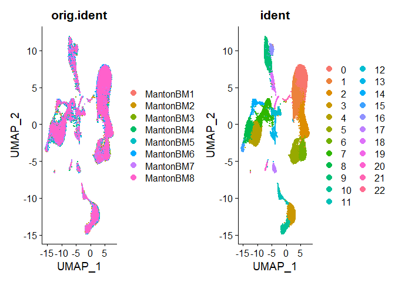
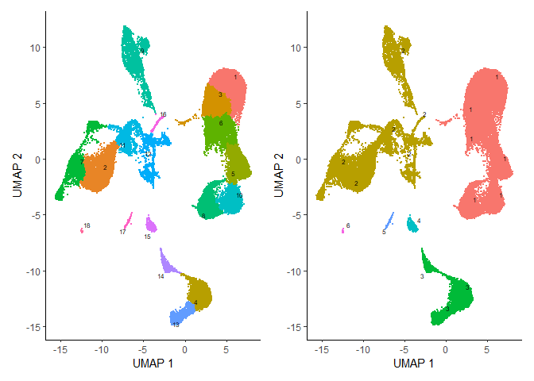
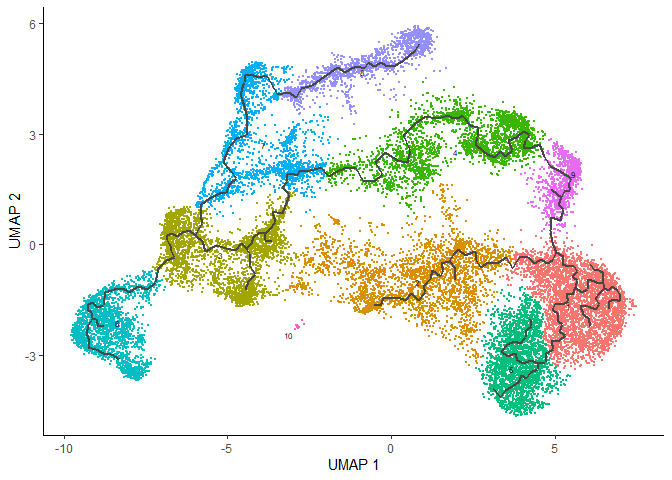
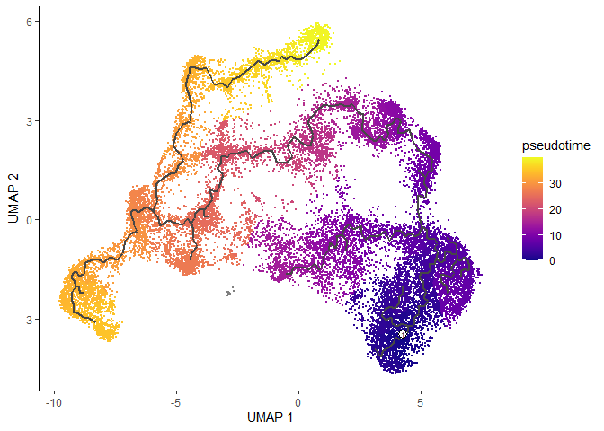
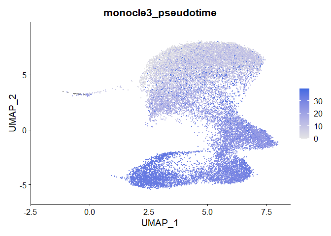

This vigettte demonstrates how to run trajectory inference and pseudotime calculations with Monocle 3 on Seurat objects. If you use Monocle 3, please cite:

The single-cell transcriptional landscape of mammalian organogenesis

Junyue Cao, Malte Spielmann, Xiaojie Qiu, Xingfan Huang, Daniel M. Ibrahim, Andrew J. Hill, Fan Zhang, Stefan Mundlos, Lena Christiansen, Frank J. Steemers, Cole Trapnell & Jay Shendure

doi: 10.1038/s41586-019-0969-x

Website: https://cole-trapnell-lab.github.io/monocle3/

Prerequisites to install:

Seurat
SeuratWrappers
SeuratData
Monocle 3


``` r
library(monocle3)
```

```
## Loading required package: Biobase
```

```
## Loading required package: BiocGenerics
```

```
## Loading required package: generics
```

```
## 
## Attaching package: 'generics'
```

```
## The following objects are masked from 'package:base':
## 
##     as.difftime, as.factor, as.ordered, intersect, is.element, setdiff,
##     setequal, union
```

```
## 
## Attaching package: 'BiocGenerics'
```

```
## The following objects are masked from 'package:stats':
## 
##     IQR, mad, sd, var, xtabs
```

```
## The following objects are masked from 'package:base':
## 
##     anyDuplicated, aperm, append, as.data.frame, basename, cbind,
##     colnames, dirname, do.call, duplicated, eval, evalq, Filter, Find,
##     get, grep, grepl, is.unsorted, lapply, Map, mapply, match, mget,
##     order, paste, pmax, pmax.int, pmin, pmin.int, Position, rank,
##     rbind, Reduce, rownames, sapply, saveRDS, table, tapply, unique,
##     unsplit, which.max, which.min
```

```
## Welcome to Bioconductor
## 
##     Vignettes contain introductory material; view with
##     'browseVignettes()'. To cite Bioconductor, see
##     'citation("Biobase")', and for packages 'citation("pkgname")'.
```

```
## Loading required package: SingleCellExperiment
```

```
## Loading required package: SummarizedExperiment
```

```
## Loading required package: MatrixGenerics
```

```
## Loading required package: matrixStats
```

```
## 
## Attaching package: 'matrixStats'
```

```
## The following objects are masked from 'package:Biobase':
## 
##     anyMissing, rowMedians
```

```
## 
## Attaching package: 'MatrixGenerics'
```

```
## The following objects are masked from 'package:matrixStats':
## 
##     colAlls, colAnyNAs, colAnys, colAvgsPerRowSet, colCollapse,
##     colCounts, colCummaxs, colCummins, colCumprods, colCumsums,
##     colDiffs, colIQRDiffs, colIQRs, colLogSumExps, colMadDiffs,
##     colMads, colMaxs, colMeans2, colMedians, colMins, colOrderStats,
##     colProds, colQuantiles, colRanges, colRanks, colSdDiffs, colSds,
##     colSums2, colTabulates, colVarDiffs, colVars, colWeightedMads,
##     colWeightedMeans, colWeightedMedians, colWeightedSds,
##     colWeightedVars, rowAlls, rowAnyNAs, rowAnys, rowAvgsPerColSet,
##     rowCollapse, rowCounts, rowCummaxs, rowCummins, rowCumprods,
##     rowCumsums, rowDiffs, rowIQRDiffs, rowIQRs, rowLogSumExps,
##     rowMadDiffs, rowMads, rowMaxs, rowMeans2, rowMedians, rowMins,
##     rowOrderStats, rowProds, rowQuantiles, rowRanges, rowRanks,
##     rowSdDiffs, rowSds, rowSums2, rowTabulates, rowVarDiffs, rowVars,
##     rowWeightedMads, rowWeightedMeans, rowWeightedMedians,
##     rowWeightedSds, rowWeightedVars
```

```
## The following object is masked from 'package:Biobase':
## 
##     rowMedians
```

```
## Loading required package: GenomicRanges
```

```
## Loading required package: stats4
```

```
## Loading required package: S4Vectors
```

```
## 
## Attaching package: 'S4Vectors'
```

```
## The following object is masked from 'package:utils':
## 
##     findMatches
```

```
## The following objects are masked from 'package:base':
## 
##     expand.grid, I, unname
```

```
## Loading required package: IRanges
```

```
## 
## Attaching package: 'IRanges'
```

```
## The following object is masked from 'package:grDevices':
## 
##     windows
```

```
## Loading required package: Seqinfo
```

```
## 
## Attaching package: 'monocle3'
```

```
## The following objects are masked from 'package:Biobase':
## 
##     exprs, fData, fData<-, pData, pData<-
```

``` r
library(Seurat)
```

```
## Loading required package: SeuratObject
```

```
## Loading required package: sp
```

```
## 
## Attaching package: 'sp'
```

```
## The following object is masked from 'package:IRanges':
## 
##     %over%
```

```
## 
## Attaching package: 'SeuratObject'
```

```
## The following object is masked from 'package:SummarizedExperiment':
## 
##     Assays
```

```
## The following object is masked from 'package:GenomicRanges':
## 
##     intersect
```

```
## The following object is masked from 'package:Seqinfo':
## 
##     intersect
```

```
## The following object is masked from 'package:IRanges':
## 
##     intersect
```

```
## The following object is masked from 'package:S4Vectors':
## 
##     intersect
```

```
## The following object is masked from 'package:BiocGenerics':
## 
##     intersect
```

```
## The following objects are masked from 'package:base':
## 
##     intersect, t
```

```
## 
## Attaching package: 'Seurat'
```

```
## The following object is masked from 'package:SummarizedExperiment':
## 
##     Assays
```

``` r
library(SeuratObject)
library(SeuratData)
```

```
## ── Installed datasets ──────────────────────────────── SeuratData v0.2.2.9001 ──
```

```
## ✔ hcabm40k 3.0.0                        ✔ stxBrain 0.1.2
```

```
## ────────────────────────────────────── Key ─────────────────────────────────────
```

```
## ✔ Dataset loaded successfully
## ❯ Dataset built with a newer version of Seurat than installed
## ❓ Unknown version of Seurat installed
```

``` r
library(SeuratWrappers)
library(SingleCellExperiment)
library(ggplot2)
library(patchwork)
library(magrittr)
```

```
## 
## Attaching package: 'magrittr'
```

```
## The following object is masked from 'package:GenomicRanges':
## 
##     subtract
```

``` r
set.seed(2025)  # make UMAP/graphs reproducible
```

# HCA Bone Marrow 40k


``` r
#InstallData("hcabm40k")

# install.packages(
#   "D:/Oldroyd_lab/GitHub/Monocle3_learning/hcabm40k.SeuratData_3.0.0.tar.gz",
#   repos = NULL,
#   type = "source"
# )
library(hcabm40k.SeuratData)
data("hcabm40k")
```


``` r
# 1) Bring the dataset up to your installed Seurat/SeuratObject schema
hcabm40k <- SeuratObject::UpdateSeuratObject(hcabm40k)
```

```
## Validating object structure
```

```
## Updating object slots
```

```
## Ensuring keys are in the proper structure
```

```
## Warning: Assay RNA changing from Assay to Assay
```

```
## Ensuring keys are in the proper structure
```

```
## Ensuring feature names don't have underscores or pipes
```

```
## Updating slots in RNA
```

```
## Validating object structure for Assay 'RNA'
```

```
## Object representation is consistent with the most current Seurat version
```

``` r
# (optional but helpful) Slim the object and drop legacy stuff that can confuse later steps
hcabm40k <- DietSeurat(
  hcabm40k,
  assays    = DefaultAssay(hcabm40k),
  dimreducs = NULL,
  graphs    = NULL
)

# sanity checks
DefaultAssay(hcabm40k)
```

```
## [1] "RNA"
```

``` r
head(hcabm40k$orig.ident)
```

```
## MantonBM1_HiSeq_8-CCCAATCGTATGCTTG-1 MantonBM1_HiSeq_8-CTGCTGTAGGACACCA-1 
##                            MantonBM1                            MantonBM1 
## MantonBM1_HiSeq_3-CAGCTGGGTACATGTC-1 MantonBM1_HiSeq_7-GCTTCCAAGATGTAAC-1 
##                            MantonBM1                            MantonBM1 
## MantonBM1_HiSeq_6-AGTGAGGCAGGGTTAG-1 MantonBM1_HiSeq_5-ATGTGTGCACCGAATT-1 
##                            MantonBM1                            MantonBM1 
## 8 Levels: MantonBM1 MantonBM2 MantonBM3 MantonBM4 MantonBM5 ... MantonBM8
```


``` r
# ---- Split by dataset of origin (acts like 'batches') ----
# Splitting lets us normalize / find HVGs per dataset before integration.
hcabm40k <- SplitObject(hcabm40k, split.by = "orig.ident")

# ---- Normalize + select HVGs per split (anchor-friendly) ----
for (i in seq_along(hcabm40k)) {
    hcabm40k[[i]] <- NormalizeData(hcabm40k[[i]]) %>% FindVariableFeatures()
}
```

```
## Warning: The `slot` argument of `SetAssayData()` is deprecated as of SeuratObject 5.0.0.
## ℹ Please use the `layer` argument instead.
## ℹ The deprecated feature was likely used in the Seurat package.
##   Please report the issue at <https://github.com/satijalab/seurat/issues>.
## This warning is displayed once every 8 hours.
## Call `lifecycle::last_lifecycle_warnings()` to see where this warning was
## generated.
```

```
## Warning: The `slot` argument of `GetAssayData()` is deprecated as of SeuratObject 5.0.0.
## ℹ Please use the `layer` argument instead.
## ℹ The deprecated feature was likely used in the Seurat package.
##   Please report the issue at <https://github.com/satijalab/seurat/issues>.
## This warning is displayed once every 8 hours.
## Call `lifecycle::last_lifecycle_warnings()` to see where this warning was
## generated.
```

``` r
# ---- Pick a common feature set used to compute anchors ----
features <- SelectIntegrationFeatures(hcabm40k)

# ---- Scale + PCA per split on the *same* features ----
# Using the same features across splits makes RPCA anchors more stable.
for (i in seq_along(along.with = hcabm40k)) {
    hcabm40k[[i]] <- ScaleData(hcabm40k[[i]], features = features) %>% RunPCA(features = features)
}
```

```
## Centering and scaling data matrix
```

```
## Warning in PrepDR(object = object, features = features, verbose = verbose): The
## following 2 features requested have zero variance (running reduction without
## them): EIF1AY, TPSB2
```

```
## PC_ 1 
## Positive:  TMSB4X, CD27, CCL5, MS4A1, IGHD, LAT, GPR183, GZMA, CD74, GZMK 
## 	   CCL4, KLRB1, SOCS3, RGS1, NKG7, CD79A, HLA-DQB1, IGKC, FOS, KLRD1 
## 	   VIM, TRGC2, RP5-887A10.1, HLA-DPB1, HLA-DPA1, GZMH, EEF1A1, S100A12, IGLC3, IGLC2 
## Negative:  KIAA0101, TYMS, AHSP, SYNGR1, KLF1, CA1, FAM178B, KCNH2, GATA1, CA2 
## 	   HBD, EPCAM, TUBB, CKS2, BLVRB, CDT1, HBQ1, SMIM1, GYPA, CENPU 
## 	   HBB, TUBA1B, BIRC5, PCNA, NME4, SNCA, HMGA1, HBA1, ALAS2, FECH 
## PC_ 2 
## Positive:  LYZ, S100A9, CST3, S100A8, CSTA, FCN1, LGALS1, VCAN, TYROBP, LST1 
## 	   MNDA, FCER1G, S100A12, CFD, AIF1, GPX1, CD14, MS4A6A, CLEC7A, GSTP1 
## 	   PLAUR, VIM, SERPINA1, RETN, MGST1, KLF4, FGL2, RNASE2, CFP, ANXA2 
## Negative:  EEF1A1, RPL14, RPS2, EEF1B2, RPL7A, RPLP0, GYPC, AHSP, NPM1, CA1 
## 	   HSPA8, GYPA, KCNH2, KLF1, FAM178B, ALAS2, HBA2, PRDX2, RPL37A, CD27 
## 	   HBA1, HBB, LDHB, SMIM1, HBD, MYL4, SOD1, HNRNPA1, EPCAM, RHAG 
## PC_ 3 
## Positive:  S100A6, S100A4, FTH1, BLVRB, CD36, FCN1, AHSP, VCAN, CA1, GYPA 
## 	   S100A12, S100A9, TYROBP, S100A8, ALAS2, CD14, HBA1, HBD, FAM178B, KCNH2 
## 	   HBB, KLF1, HBA2, G0S2, SERPINA1, CST3, RHAG, HBQ1, LYZ, CA2 
## Negative:  IGLL1, VPREB1, CD79B, VPREB3, CD24, SOX4, TCL1A, IGHM, CD79A, MZB1 
## 	   CD9, STMN1, HLA-DRA, FAM111B, PDLIM1, PTMA, CD74, ARPP21, CFAP73, CD38 
## 	   MME, IRF4, HLA-DPA1, HLA-DPB1, PCDH9, TCF4, EBF1, SPIB, IGLL5, IGLC5 
## PC_ 4 
## Positive:  MDK, PTRF, LAPTM4B, IGFBP7, ANGPT1, PRSS57, TFPI, SERPING1, SEPP1, LHFP 
## 	   GSN, WBP5, CALD1, CLU, CFH, MMP2, NGFRAP1, MSRB3, PTGDS, APOE 
## 	   SPARC, TSC22D1, SPINK2, NPR3, CD34, CXCL12, IGSF10, EMILIN1, PLPP3, PCOLCE 
## Negative:  HLA-DRA, TCL1A, IGHM, CD79A, CD79B, FCN1, VPREB3, HBM, S100A9, S100A8 
## 	   CD74, GYPB, ALAS2, GYPA, S100A12, HLA-DQB1, SLC4A1, CD24, RGS2, IGHD 
## 	   LYZ, CD36, TOP2A, MYL4, CSTA, CLEC7A, CD14, HLA-DPB1, MKI67, MS4A1 
## PC_ 5 
## Positive:  HLA-DRA, CD79A, IGHM, CD74, CD79B, TCL1A, VPREB3, IGHD, HLA-DQB1, HLA-DPA1 
## 	   SERPINF1, IGF2, HLA-DPB1, MZB1, HLA-DRB1, IGKC, IGLC2, APOE, MS4A1, HLA-DRB5 
## 	   GAS6, LEPR, EPHX1, IGLC3, HLA-DQA1, IGLL5, PPP1R14A, PCDH9, RGS16, EBF1 
## Negative:  NKG7, CCL5, GZMA, TMSB4X, CMC1, KLRD1, KLRB1, CCL4, PRF1, S100A4 
## 	   KLRF1, GZMH, HOPX, GNLY, GAPDH, LDHB, LYAR, LDHA, ENO1, XCL2 
## 	   GZMB, C12orf75, MPO, FGFBP2, TRGC2, AZU1, LAT, FCGR3A, RPS2, CD160 
## Centering and scaling data matrix
```

```
## Warning in PrepDR(object = object, features = features, verbose = verbose): The
## following 13 features requested have zero variance (running reduction without
## them): VWF, ADCY6, VGLL3, SNAI2, ABCA8, GJA4, RAB3C, TRAV38-2DV8, LINC01224,
## PRG2, TRPC6, PLPP2, NOTCH3
```

```
## PC_ 1 
## Positive:  KIAA0101, TYMS, KLF1, AHSP, CDT1, BIRC5, CA1, CA2, ALAS2, TK1 
## 	   MKI67, CENPF, KCNH2, GATA1, GYPA, CCNB2, NUSAP1, TOP2A, SMIM1, HBQ1 
## 	   UBE2T, HBD, RRM2, HMGB3, CCNA2, HEMGN, ZWINT, HBM, CDKN3, BLVRB 
## Negative:  TMSB4X, IGHD, EEF1A1, MS4A1, CD79A, HLA-DQA1, CCL5, LAT, IGKC, HLA-DQB1 
## 	   KLRB1, GZMA, NKG7, CD27, CD74, TCL1A, GNLY, GZMH, HOPX, HLA-DPB1 
## 	   IGHM, FGFBP2, GZMK, KLRD1, GZMB, IGLC2, PLAC8, RP5-887A10.1, HLA-DPA1, CMC1 
## PC_ 2 
## Positive:  EEF1A1, RPL7A, RPLP0, CD79A, RPL37A, RPL14, EEF1B2, IGHM, TCL1A, IGHD 
## 	   CD79B, RPS2, MS4A1, VPREB3, IGKC, CD24, PRDX2, IGLC2, GYPC, UBB 
## 	   JCHAIN, TSPAN13, ALAS2, LDHB, PEBP1, HIST1H4C, MYL4, KLF1, IGLC3, AHSP 
## Negative:  CST3, LYZ, FCN1, S100A9, CSTA, AIF1, LST1, S100A8, SERPINA1, CFD 
## 	   CFP, RP11-1143G9.4, MNDA, VCAN, CLEC7A, CD14, TYROBP, S100A12, FOS, LGALS2 
## 	   MS4A6A, FGL2, FCER1G, LGALS1, PLAUR, FTH1, IFI30, RNF130, G0S2, MAFB 
## PC_ 3 
## Positive:  NKG7, GNLY, GZMA, GZMB, CCL5, KLRD1, PRF1, FGFBP2, KLRF1, HOPX 
## 	   KLRB1, CMC1, SPON2, GZMH, S100A4, TRDC, CCL4, CLIC3, TMSB4X, IL2RB 
## 	   FCGR3A, C12orf75, LYAR, TRGC1, IGFBP7, CD63, CD160, XCL2, S100A6, TYROBP 
## Negative:  HLA-DRA, CD74, CD79A, HLA-DQB1, HLA-DRB1, CD79B, IGHM, HLA-DPA1, HLA-DPB1, TCL1A 
## 	   IGHD, HLA-DQA1, VPREB3, MS4A1, IGKC, CD24, IGLC2, JCHAIN, TSPAN13, SPIB 
## 	   MZB1, IGLC3, RPS2, KIAA0125, POU2AF1, BCL11A, SOX4, PHACTR1, TCF4, RPLP0 
## PC_ 4 
## Positive:  ALAS2, AHSP, GYPA, HBM, KLF1, CA1, HEMGN, CA2, HBD, GYPB 
## 	   SMIM1, RHAG, SLC4A1, HBQ1, TMEM56, HBA2, HBA1, GATA1, SELENBP1, KCNH2 
## 	   CTSE, A4GALT, GFI1B, RHCE, HBB, SNCA, HMBS, BLVRB, MYL4, CA3 
## Negative:  IGLL1, VPREB1, STMN1, SOX4, UHRF1, CD24, MME, PTMA, ARPP21, ACTG1 
## 	   DNTT, VPREB3, CD9, FABP5, IGFBP7, ITM2C, AKAP12, CD38, CMTM8, IRF4 
## 	   GZMB, AURKB, RAG2, MZB1, CFAP73, PHGDH, NKG7, NREP, UBE2C, PRF1 
## PC_ 5 
## Positive:  RPS2, RPL14, EEF1A1, LDHB, VIM, RPL37A, RPLP0, EEF1B2, CD27, NPM1 
## 	   RPL7A, GPR183, SOCS3, PPA1, AQP3, S100A6, HSPA8, TOP2A, MAD2L1, TYMS 
## 	   UHRF1, UBE2C, AURKB, S100A4, RGCC, KIAA0101, MKI67, ANP32B, NUSAP1, LDHA 
## Negative:  HIST1H2AC, GNG11, PF4, SDPR, PPBP, TSC22D1, MAP3K7CL, TUBB1, CLU, C2orf88 
## 	   CD79B, GMPR, DAB2, NRGN, CD74, CD79A, HIST1H3H, PDZK1IP1, GP9, RUFY1 
## 	   ACRBP, TCL1A, IGHM, KLRF1, ITGA2B, SMOX, NFE2, HLA-DRA, RGS18, HRAT92 
## Centering and scaling data matrix
```

```
## Warning in PrepDR(object = object, features = features, verbose = verbose): The
## following 5 features requested have zero variance (running reduction without
## them): RAG2, STXBP6, CLEC14A, CXCL10, MEIOB
```

```
## PC_ 1 
## Positive:  TMSB4X, CCL5, SOCS3, NKG7, GNLY, KLRB1, FGFBP2, RGS1, GZMH, GPR183 
## 	   SCGB3A1, PRDM1, GZMB, CD79A, CD27, KLRD1, GZMA, FOS, CCL4, RP11-291B21.2 
## 	   RGS2, GZMK, PRF1, MS4A1, HLA-DQB1, FKBP11, ZNF683, DUSP4, XCL2, AC079767.4 
## Negative:  AHSP, KIAA0101, TYMS, HBD, CA1, FAM178B, KCNH2, SMIM1, STMN1, CENPU 
## 	   HBB, APOC1, BIRC5, MYL4, PRDX2, CA2, GATA1, CCNB2, CENPF, HMBS 
## 	   ALAS2, HBQ1, CNRIP1, CKS1B, BLVRB, EPCAM, SPTA1, ZWINT, TMEM14C, HBA1 
## PC_ 2 
## Positive:  LYZ, CST3, LST1, TYROBP, S100A9, FCN1, CSTA, GPX1, AIF1, S100A8 
## 	   FCER1G, LGALS1, CLEC7A, MAFB, HLA-DRA, CEBPD, S100A12, CFD, VCAN, SERPINA1 
## 	   TIMP1, S100A6, CXCL8, ZFP36L1, PLAUR, IFI30, G0S2, VIM, GSTP1, FCGRT 
## Negative:  RPL14, EEF1A1, CCL5, RPLP0, EEF1B2, RPS2, NKG7, NPM1, LYAR, FKBP11 
## 	   GNLY, KLRB1, HSPA8, RPL7A, FGFBP2, GYPC, GZMH, HSP90AB1, SOD1, NOP58 
## 	   GZMA, PEBP1, RPL37A, LDHB, LAT, GZMB, MYC, UBB, CMC1, BUB3 
## PC_ 3 
## Positive:  GYPA, ALAS2, HBA2, AHSP, HBA1, GYPB, CTSE, SPTA1, CA1, HBD 
## 	   CA2, HMBS, MYL4, SLC4A1, RHAG, TMEM56, HBM, HBB, ADD2, ANK1 
## 	   SELENBP1, KRT13, KCNH2, HEMGN, RHCE, RFESD, SLC25A37, BLVRB, KLF1, KEL 
## Negative:  PRSS57, SMIM24, SPINK2, IGLL1, KIAA0125, SOX4, EGFL7, C1QTNF4, CRYGD, CD34 
## 	   ITM2C, NGFRAP1, FHL1, STMN1, IGFBP7, MEST, CPXM1, MPO, NREP, BAALC 
## 	   NUCB2, CLEC11A, CDK6, MSRB3, ANKRD28, IGSF10, NPW, CYTL1, RP11-354E11.2, GSN 
## PC_ 4 
## Positive:  NKG7, GNLY, CCL5, GZMH, TMSB4X, FGFBP2, GZMA, GZMB, CCL4, C12orf75 
## 	   KLRD1, LYAR, UBE2C, CMC1, MKI67, TRDC, KLRF1, PRF1, HOPX, NUSAP1 
## 	   KLRB1, RNASE2, HMGB2, S100A4, BIRC5, ACTB, GAPDH, MPO, CLIC3, AURKB 
## Negative:  CD79A, EEF1A1, RPS2, IGKC, IGHM, EEF1B2, CNRIP1, MZB1, APOC1, MS4A1 
## 	   DERL3, SPINT2, HLA-DQB1, ALDH1A1, RPL7A, KIAA0125, CYTL1, FTH1, SOCS3, MYC 
## 	   MAP7, EPCAM, IGHD, FAM178B, CXADR, RPL37A, IGLC2, SMIM10, IGLC3, CMBL 
## PC_ 5 
## Positive:  RPS2, EEF1A1, RPL37A, RPL14, MPO, EEF1B2, PTMA, HNRNPA1, AZU1, NPM1 
## 	   LDHB, RPL7A, PRSS57, RPLP0, RNASE2, IGLL1, PRTN3, ELANE, SMIM24, CTSG 
## 	   MT-CO3, SPINK2, SOCS3, STMN1, C1QTNF4, MS4A3, KIAA0101, ANP32B, RP11-620J15.3, IMPDH2 
## Negative:  DERL3, MZB1, GNLY, NKG7, CALD1, CCL5, GZMB, GZMH, IGHG3, IGHG1 
## 	   FGFBP2, CD9, GSN, JSRP1, C2orf88, GZMA, GAS6, IGHG4, PPP1R14A, CCL4 
## 	   MYL9, TPM1, MDK, CTTN, DAB2, SEC11C, C12orf75, BHLHE41, ARHGAP6, SPAG4 
## Centering and scaling data matrix
```

```
## Warning in PrepDR(object = object, features = features, verbose = verbose): The
## following 2 features requested have zero variance (running reduction without
## them): SPARCL1, IGHV3-43
```

```
## PC_ 1 
## Positive:  TMSB4X, TYROBP, FCER1G, FOS, S100A12, FCN1, S100A9, S100A8, LGALS1, VCAN 
## 	   SERPINA1, LST1, CD14, RGS2, CCL5, KLRB1, CSTA, NKG7, MNDA, LYZ 
## 	   GZMA, MS4A6A, VIM, CD74, KLRD1, FGL2, CCL4, CLEC7A, GNLY, CXCL8 
## Negative:  KIAA0101, KLF1, TYMS, AHSP, FAM178B, TUBB, SMIM1, CENPU, KCNH2, GATA1 
## 	   CA2, HBD, GFI1B, APOC1, PRDX2, TUBA1B, HIST1H4C, HBQ1, CKS2, MYL4 
## 	   BIRC5, TK1, RHAG, CCNB2, HBB, HMBS, PCNA, HMGA1, UROD, ZWINT 
## PC_ 2 
## Positive:  CST3, LYZ, AIF1, S100A9, LST1, CSTA, S100A8, LGALS1, FCN1, MNDA 
## 	   GPX1, VCAN, VIM, TYROBP, S100A12, SERPINA1, S100A6, CFD, FOS, GSTP1 
## 	   MS4A6A, CD14, FCER1G, CFP, S100A4, KLF4, FGL2, ACTB, HLA-DRA, GAPDH 
## Negative:  CCL5, KLRB1, GZMA, UBB, NKG7, KLRD1, CMC1, GNLY, PRF1, CCL4 
## 	   LAT, GZMB, GYPC, FGFBP2, KLRF1, HOPX, EEF1B2, GZMH, TRDC, CD27 
## 	   SPON2, RPL14, EEF1A1, CLIC3, RGS1, XCL2, SOD1, CD79A, CD160, GZMK 
## PC_ 3 
## Positive:  GYPB, GYPA, ALAS2, HBM, SLC4A1, RHAG, CA2, AHSP, S100A6, HBA1 
## 	   HBA2, TMEM56, BLVRB, HBD, MYL4, SMIM1, HEMGN, SPTA1, HBB, CA1 
## 	   RHCE, CD36, CTSE, S100A4, HMBS, HBQ1, GYPE, SELENBP1, SLC25A37, KLF1 
## Negative:  IGLL1, STMN1, SOX4, VPREB1, FABP5, ITM2C, MZB1, UHRF1, SPINK2, DNTT 
## 	   SMIM24, VPREB3, PHGDH, PTMA, CDCA7, TCF4, PRSS57, KIAA0125, CD24, AC002454.1 
## 	   CD34, CD79B, NREP, NGFRAP1, EEF1A1, HMGN1, ACTG1, CD74, C1QTNF4, HNRNPA1 
## PC_ 4 
## Positive:  NUSAP1, TOP2A, MKI67, VPREB3, AURKB, UBE2C, CD79B, CD24, VPREB1, BIRC5 
## 	   CD79A, CENPF, HMMR, ASPM, KIFC1, CDK1, GTSE1, CDKN3, TPX2, CENPA 
## 	   TCL1A, RRM2, PTTG1, SPC25, CENPE, MXD3, NUF2, IGHM, DLGAP5, CDC20 
## Negative:  CYTL1, PRSS57, CNRIP1, FSCN1, APOC1, SERPINE2, PTRF, MEST, SMIM10, NPR3 
## 	   GATA2, EPCAM, MYC, CMBL, HACD1, NGFRAP1, GCSH, APOE, EGFL7, CSF1 
## 	   RPS2, TSC22D1, SDPR, ITGA2B, NECAB1, AP001171.1, TMEM246, ABO, B3GALNT1, CDK6 
## PC_ 5 
## Positive:  CD79A, CD79B, HLA-DRA, MS4A1, IGHM, IGHD, IGKC, CD74, VPREB3, TCL1A 
## 	   HLA-DPB1, HLA-DPA1, HLA-DRB1, HLA-DQB1, MZB1, TSPAN13, IGLC2, JCHAIN, SPIB, HLA-DQA1 
## 	   BCL11A, PKIG, IGLC3, KIAA0125, CD24, EEF1A1, RPLP0, PPP1R14A, PCDH9, RPS2 
## Negative:  NKG7, GNLY, GZMA, PRF1, KLRD1, KLRF1, CCL4, KLRB1, FGFBP2, CCL5 
## 	   CMC1, SPON2, GZMB, TRDC, HOPX, GZMH, CLIC3, CD160, FCGR3A, KLRC1 
## 	   XCL2, IL2RB, S100A4, TMSB4X, ACTB, TRGC1, FCER1G, TYROBP, C12orf75, MT2A 
## Centering and scaling data matrix
```

```
## Warning in PrepDR(object = object, features = features, verbose = verbose): The
## following 10 features requested have zero variance (running reduction without
## them): AP001189.4, IGLV1-47, IGHV3-48, IGKV1D-39, ACKR1, ABCA8, PDGFRA,
## IGLV3-9, VAT1L, IGHV1-3
```

```
## PC_ 1 
## Positive:  TMSB4X, VIM, FOS, CD74, LGALS1, TYROBP, HLA-DPB1, HLA-DRA, HLA-DRB1, S100A9 
## 	   FCN1, LST1, S100A8, CD79A, AIF1, S100A12, FCER1G, VCAN, HLA-DPA1, CSTA 
## 	   LYZ, HLA-DQA1, SERPINA1, RP11-1143G9.4, HLA-DQB1, IGKC, CD27, MS4A1, CCL5, ANXA2 
## Negative:  AHSP, FAM178B, KCNH2, KLF1, CA2, SYNGR1, CA1, KIAA0101, REXO2, HBB 
## 	   HBD, UROD, HMBS, GATA1, PRDX2, BLVRB, APOC1, PCNA, CKS2, EPCAM 
## 	   GYPA, TYMS, MYL4, TUBB, FECH, RHAG, ALDH1A1, HBA1, CENPU, SMIM1 
## PC_ 2 
## Positive:  RPL14, EEF1A1, EEF1B2, RPS2, RPLP0, RPL7A, GYPA, HBM, SLC4A1, ALAS2 
## 	   GYPB, GYPC, CD79A, HEMGN, HBA2, AK1, CD27, CTSE, HBA1, RPL37A 
## 	   EPB42, TMEM56, RHAG, MS4A1, HBD, MYL4, CA2, AHSP, PRDX2, CA1 
## Negative:  CST3, LYZ, RP11-1143G9.4, LGALS1, S100A9, GPX1, CSTA, GSTP1, S100A8, FCER1G 
## 	   TYROBP, LST1, AIF1, FCN1, VIM, GAPDH, ACTB, VCAN, S100A12, ANXA2 
## 	   CFD, TIMP1, MGST1, S100A4, MNDA, ENO1, RNASE2, RNF130, SERPINA1, H2AFY 
## PC_ 3 
## Positive:  S100A6, S100A9, FCN1, S100A8, S100A12, VCAN, TYROBP, SERPINA1, LGALS3, CSTA 
## 	   S100A4, LYZ, FCER1G, RP11-1143G9.4, LGALS1, CLEC7A, LST1, CD36, SLC4A1, CST3 
## 	   FTH1, CD14, HBM, LGALS2, MAFB, MS4A6A, ALAS2, HBA2, GYPB, CFP 
## Negative:  PRSS57, IGLL1, EEF1A1, EEF1B2, AC002454.1, RPLP0, CD34, SPINK2, C1QTNF4, SMIM24 
## 	   NPW, KIAA0125, RPS2, MEST, NPM1, CYTL1, LDHB, EGFL7, RPL7A, NGFRAP1 
## 	   NUCB2, CRYGD, FABP5, ITM2C, LAPTM4B, RPL14, CDK6, AP001171.1, HNRNPA1, RPL37A 
## PC_ 4 
## Positive:  CNRIP1, S100A6, NMU, NECAB1, APOC1, GAL, S100A4, APOE, EPCAM, FSCN1 
## 	   SERPINE2, GRTP1, ALDH1A1, CMBL, MT2A, CYTL1, ABO, LYAR, PNMT, PVT1 
## 	   CXADR, IFITM3, UNG, GSTM3, FTH1, TIMP1, SERPINA1, SLC40A1, SMIM10, PTRF 
## Negative:  CD74, HLA-DPB1, HLA-DRA, HLA-DPA1, HLA-DRB1, CD79A, PLD4, HLA-DQB1, IGHM, JCHAIN 
## 	   ITM2C, MZB1, NUSAP1, IRF8, MKI67, CD79B, HLA-DQA1, VPREB3, TOP2A, IGKC 
## 	   UBE2C, TCF4, SLC4A1, AURKB, IGHD, HBM, MS4A1, BLNK, SCT, PHACTR1 
## PC_ 5 
## Positive:  HLA-DRA, CD79A, HLA-DQB1, HLA-DQA1, CD74, HLA-DRB1, HLA-DPB1, HLA-DPA1, MS4A1, IGHM 
## 	   IGHD, CD79B, IGKC, JCHAIN, FTH1, VPREB3, IGLC2, BCL11A, IGLC3, TCL1A 
## 	   ZFP36L1, AC079767.4, MARCKSL1, PHACTR1, PPP1R14A, RP5-887A10.1, PKIG, KIAA0125, MZB1, SPIB 
## Negative:  NKG7, CCL5, GNLY, GZMA, KLRD1, GZMH, FGFBP2, PRF1, GZMB, CCL4 
## 	   TRDC, HOPX, CMC1, KLRF1, XCL2, TRGC2, IL2RB, MPO, AZU1, ELANE 
## 	   TRGC1, LAIR2, GZMK, SPON2, TUBA4A, KLRB1, KLRC1, TMSB4X, CTSG, PRTN3 
## Centering and scaling data matrix
```

```
## Warning in PrepDR(object = object, features = features, verbose = verbose): The
## following 12 features requested have zero variance (running reduction without
## them): EIF1AY, C1QC, IGHV1-18, IGKV3-15, PDLIM4, IGLV3-9, WNT11, IGLV2-8,
## SLC35D3, PVALB, RND3, IGHV3-43
```

```
## PC_ 1 
## Positive:  TMSB4X, CD27, LAT, CCL5, GZMA, CCL4, NKG7, KLRB1, GZMK, MS4A1 
## 	   KLRD1, XCL2, GPR183, PRF1, S100A12, TRGC2, GZMH, GNLY, RP11-291B21.2, CD14 
## 	   TYROBP, FCN1, CD79A, RHOB, RGS2, RBP7, SOCS3, VCAN, IGHD, FOS 
## Negative:  KLF1, KIAA0101, AHSP, FAM178B, CA1, TYMS, KCNH2, EPCAM, APOC1, GATA1 
## 	   CA2, MYL4, GYPA, CNRIP1, GFI1B, RHAG, HBQ1, HBA1, HBB, HBD 
## 	   ALAS2, TFR2, CENPU, TMEM56, SPTA1, AKR1C3, SLC29A1, BIRC5, SMIM1, CCNB2 
## PC_ 2 
## Positive:  EEF1A1, EEF1B2, RPL14, RPS2, LDHB, RPL7A, NPM1, RPLP0, GYPC, CD27 
## 	   LAT, HSPA8, SOD1, PRDX2, RPL37A, HNRNPA1, HSP90AB1, PEBP1, UBB, CCL5 
## 	   GZMA, FKBP11, CA1, AQP3, AHSP, MLLT3, RP11-291B21.2, RGS10, FAM178B, KLF1 
## Negative:  LYZ, CST3, CSTA, RP11-1143G9.4, S100A9, MNDA, FCN1, S100A8, LST1, LGALS1 
## 	   TYROBP, FCER1G, S100A12, VCAN, CD14, GPX1, AIF1, MS4A6A, FOS, CFD 
## 	   SERPINA1, CFP, TMEM176B, FGL2, LGALS2, PLAUR, KLF4, S100A6, CEBPD, RGS2 
## PC_ 3 
## Positive:  IGLL1, VPREB1, SMIM24, SOX4, STMN1, MZB1, ITM2C, DNTT, KIAA0125, TCF4 
## 	   NREP, VPREB3, FABP5, PRSS57, CD79B, CD24, SPINK2, C1QTNF4, UHRF1, PHGDH 
## 	   IGFBP7, CD74, CD34, HLA-DPA1, HLA-DRA, HLA-DPB1, CDCA7, MDK, DDAH2, BCL11A 
## Negative:  S100A6, GYPA, ALAS2, HBA1, AHSP, CD36, HBA2, CA1, BLVRB, RHAG 
## 	   GYPB, HBB, TMEM56, KLF1, KCNH2, CA2, FAM178B, MYL4, HBM, S100A4 
## 	   HBQ1, HBD, S100A12, CTSE, FCN1, CD14, SPTA1, SMIM1, S100A8, EPCAM 
## PC_ 4 
## Positive:  PRSS57, CYTL1, NPR3, SMIM24, C1QTNF4, SPINK2, CRHBP, CD34, AVP, AP001171.1 
## 	   CRYGD, PTRF, EGFL7, MYCT1, GATA2, NPW, MSRB3, MAP7, LAPTM4B, PROM1 
## 	   IGSF10, TSC22D1, SEPP1, BEX1, HACD1, SERPINB1, EBPL, NGFRAP1, RPS2, BAALC 
## Negative:  MKI67, TOP2A, NUSAP1, UBE2C, AURKB, GTSE1, VPREB3, HMMR, CDC20, DLGAP5 
## 	   BIRC5, CDK1, CD24, CD79B, CDKN3, TPX2, CD79A, TCL1A, PLK1, CDCA8 
## 	   NUF2, ASPM, CDCA3, CENPF, KIF11, IGHM, CENPA, MXD3, CCNB1, TUBB4B 
## PC_ 5 
## Positive:  CD79A, MS4A1, CD79B, IGHM, VPREB3, HLA-DRA, IGHD, TCL1A, HLA-DQA1, IGKC 
## 	   HLA-DQB1, IGLC2, JCHAIN, IGLC3, CD74, CD24, SPIB, HLA-DRB1, POU2AF1, HLA-DPA1 
## 	   AC079767.4, CD72, TSPAN13, RPLP0, MZB1, RP5-887A10.1, PHACTR1, BCL11A, BLNK, RASGRP3 
## Negative:  NKG7, GZMA, GNLY, CCL5, PRF1, KLRD1, GZMH, CCL4, CMC1, KLRF1 
## 	   GZMB, HOPX, KLRB1, FGFBP2, XCL2, TRDC, SPON2, TRGC2, FCGR3A, CLIC3 
## 	   IL2RB, C12orf75, CD160, CD63, KLRC2, CCL4L2, S100A4, MT2A, GZMK, LYAR 
## Centering and scaling data matrix
```

```
## Warning in PrepDR(object = object, features = features, verbose = verbose): The
## following 3 features requested have zero variance (running reduction without
## them): PPIC, SLC35D3, IGKV2-30
```

```
## PC_ 1 
## Positive:  TMSB4X, LAT, CCL5, CD27, GZMA, NKG7, KLRB1, KLRD1, GNLY, GZMH 
## 	   FGFBP2, PRF1, GZMK, GPR183, CCL4, GZMB, KLRF1, RP11-291B21.2, TRDC, TYROBP 
## 	   HOPX, EEF1A1, PLAC8, RGS1, SPON2, CD160, MS4A1, SOCS3, IL2RB, S100B 
## Negative:  KIAA0101, TYMS, BIRC5, AHSP, FAM178B, KLF1, KCNH2, CA1, CENPF, CA2 
## 	   CKS2, CDT1, TUBB, GATA1, CENPU, TUBA1B, TK1, CENPW, PCNA, TUBG1 
## 	   SYNGR1, RRM2, TOP2A, APOC1, CCNB2, CCNA2, BLVRB, HBB, HBA1, GYPA 
## PC_ 2 
## Positive:  LYZ, CST3, FCN1, S100A9, LST1, CSTA, S100A8, VCAN, TYROBP, MNDA 
## 	   LGALS1, CFD, SERPINA1, FCER1G, LGALS2, AIF1, CD14, PLAUR, CLEC7A, FGL2 
## 	   S100A12, GPX1, MS4A6A, CFP, FOS, HLA-DRA, CSF3R, KLF4, HLA-DRB1, G0S2 
## Negative:  RPL14, RPS2, EEF1B2, EEF1A1, GYPC, LDHB, RPL7A, RPLP0, AHSP, CA1 
## 	   GYPA, LAT, ALAS2, NPM1, CD27, RPL37A, RHAG, KCNH2, HBM, KLF1 
## 	   HBB, HBA1, HBD, GYPB, FAM178B, CA2, PRDX2, TMEM56, HBA2, SLC4A1 
## PC_ 3 
## Positive:  IGLL1, VPREB1, VPREB3, CD79B, CD24, TCL1A, SOX4, STMN1, IGHM, CD9 
## 	   MZB1, CD79A, CMTM8, PTMA, MME, CFAP73, IRF4, AKAP12, UHRF1, ARPP21 
## 	   PDLIM1, TCF4, CD38, PCDH9, FABP5, CDCA7, DNTT, LAT2, CD74, CD72 
## Negative:  S100A6, BLVRB, S100A4, AHSP, CD36, GYPA, CA1, ALAS2, CA2, HBA1 
## 	   RHAG, HBM, HBB, KCNH2, HBA2, FAM178B, KLF1, GYPB, HBD, SLC4A1 
## 	   TMEM56, HBQ1, FCN1, SMIM1, FTH1, HMBS, S100A9, LGALS3, GFI1B, RFESD 
## PC_ 4 
## Positive:  PRSS57, CYTL1, NPR3, SPINK2, MEST, EGFL7, C1QTNF4, PTRF, NPW, LAPTM4B 
## 	   SMIM24, GATA2, CD34, CRYGD, CRHBP, AC002454.1, NGFRAP1, ANKRD28, RP11-354E11.2, IGFBP7 
## 	   MSRB3, AVP, WBP5, HPGDS, FSCN1, CDK6, RPS2, LDHB, HACD1, EBPL 
## Negative:  CD79B, TCL1A, HBM, CD79A, IGHM, SLC4A1, GYPB, VPREB3, GYPA, HLA-DRA 
## 	   CD24, ALAS2, IGLC2, MKI67, RGS2, CD74, NUSAP1, MYL4, TOP2A, ASPM 
## 	   IGKC, HLA-DQB1, CFAP73, IGHD, HLA-DRB1, RHCE, HBA2, SPTA1, SPIB, PCDH9 
## PC_ 5 
## Positive:  CD79A, HLA-DRA, HLA-DQA1, HLA-DQB1, MS4A1, CD74, IGKC, IGHM, CD79B, HLA-DPB1 
## 	   IGHD, IGLC2, EEF1A1, HLA-DRB1, HLA-DPA1, IGLC3, RPLP0, SPINT2, KIAA0125, RP5-887A10.1 
## 	   BCL11A, TCL1A, JCHAIN, PCDH9, EEF1B2, HLA-DRB5, RPS2, MZB1, TSPAN13, VPREB3 
## Negative:  NKG7, GZMA, CCL5, GNLY, KLRD1, PRF1, FGFBP2, GZMH, KLRB1, KLRF1 
## 	   GZMB, CCL4, CMC1, TMSB4X, TRDC, SPON2, HOPX, CLIC3, CD160, S100A4 
## 	   IL2RB, FCGR3A, TYROBP, LYAR, CCL3, MT2A, ACTB, C12orf75, TRGC1, KLRC1 
## Centering and scaling data matrix
```

```
## Warning in PrepDR(object = object, features = features, verbose = verbose): The
## following 35 features requested have zero variance (running reduction without
## them): IGFBP5, SPARCL1, EIF1AY, IGF2, FMO2, FMO3, ADCY6, GJA1, THY1, NTRK2,
## ST5, RBP1, ID4, ENPEP, VGLL3, LIFR, APOD, IGKV3D-20, IDO1, PPIC, PLAC9, ABCA8,
## FOXC1, PDLIM4, PGF, EXOC3L4, TIMP4, RND3, PCDH18, ENPP1, ECM2, PLPP2, C1QTNF1,
## VEGFC, NOTCH3
```

```
## PC_ 1 
## Positive:  TMSB4X, FOS, CCL5, RGS1, KLRB1, GZMK, GZMA, LAT, NKG7, CD27 
## 	   SOCS3, MS4A1, GPR183, RGS2, RGCC, CD79A, GZMH, RP11-291B21.2, KLRD1, CMC1 
## 	   TRGC2, CCL4, HLA-DQB1, FGFBP2, S100B, AQP3, GNLY, IGHD, RBP7, IGKC 
## Negative:  KIAA0101, AHSP, TYMS, KCNH2, HBD, HBQ1, CA1, FAM178B, EPCAM, KLF1 
## 	   APOC1, GATA1, GYPA, AKR1C3, RHAG, CENPU, CA2, PCNA, BIRC5, BLVRB 
## 	   ALDH1A1, HBB, TUBB, CCNB2, TK1, STMN1, CKS2, LXN, SYNGR1, CDK4 
## PC_ 2 
## Positive:  EEF1A1, RPL14, EEF1B2, RPS2, UBB, GYPC, RPL7A, HSPA8, RPLP0, NPM1 
## 	   CCL5, GYPA, LAT, SOD1, CA1, AHSP, ALAS2, LYAR, MYL4, KCNH2 
## 	   FAM178B, KLF1, RHAG, GZMK, GZMA, HBD, KLRB1, GYPB, CD27, PRDX2 
## Negative:  LYZ, CST3, CSTA, S100A9, S100A8, TYROBP, FCN1, LST1, RP11-1143G9.4, LGALS1 
## 	   FCER1G, S100A12, GPX1, AIF1, CFD, VCAN, GSTP1, MS4A6A, PLAUR, CXCL8 
## 	   SERPINA1, MNDA, CD14, CFP, KLF4, MAFB, MGST1, VIM, LGALS2, CLEC7A 
## PC_ 3 
## Positive:  PRSS57, SMIM24, SPINK2, IGLL1, SOX4, CRYGD, C1QTNF4, CD34, EGFL7, IGFBP7 
## 	   ITM2C, FABP5, CDCA7, STMN1, AC002454.1, NPW, KIAA0125, MEST, AP001171.1, CPXM1 
## 	   CLDN10, NREP, CDK6, NGFRAP1, RP11-620J15.3, CPA3, ENO1, LAPTM4B, CLEC11A, MSRB3 
## Negative:  GYPA, ALAS2, HBM, AHSP, GYPB, S100A6, CA1, CA2, RHAG, MYL4 
## 	   SLC4A1, HBA1, CD36, FTH1, KLF1, HBA2, BLVRB, S100A12, HBD, TMEM56 
## 	   FCN1, HBB, KCNH2, RFESD, S100A9, S100A8, HMBS, SELENBP1, HEMGN, CTSE 
## PC_ 4 
## Positive:  IGHM, CD79A, CD79B, VPREB3, CD74, TCL1A, HLA-DRB1, HLA-DRA, HLA-DPB1, VPREB1 
## 	   JCHAIN, HLA-DQB1, NUSAP1, CD24, HLA-DPA1, IGKC, UBE2C, HLA-DQA1, HLA-DRB5, IRF8 
## 	   PLD4, BIRC5, IRF4, MZB1, POU2AF1, TOP2A, AURKB, SPIB, IGLC2, RRM2 
## Negative:  CYTL1, PRSS57, SERPINE2, EGFL7, AP001171.1, NPR3, ALDH1A1, MEST, CNRIP1, PTRF 
## 	   ITGA2B, CMBL, EPCAM, SPINK2, CD34, RP11-620J15.3, APOC1, CRYGD, NGFRAP1, FSCN1 
## 	   SMIM10, GATA2, LDHB, WBP5, SLC40A1, AVP, RPS2, CDK6, EBPL, RP11-354E11.2 
## PC_ 5 
## Positive:  NKG7, CCL5, GZMA, CMC1, GZMH, KLRD1, GNLY, HOPX, FGFBP2, TMSB4X 
## 	   LYAR, KLRF1, CCL4, GZMK, PRF1, S100A4, TRDC, TRGC2, C12orf75, XCL2 
## 	   GZMB, KLRB1, TUBA4A, ACTB, MT2A, SPON2, FCGR3A, HSPA5, IFNG, CD160 
## Negative:  CD79A, IGHM, MS4A1, HLA-DRA, IGKC, HLA-DQB1, IGHD, HLA-DQA1, IGLC2, CD79B 
## 	   VPREB3, IGLC3, JCHAIN, CD74, BCL11A, EEF1A1, KIAA0125, RP5-887A10.1, RPS2, HLA-DRB5 
## 	   HLA-DPA1, HLA-DRB1, HLA-DPB1, RPL37A, PKIG, CD24, TSPAN13, MZB1, TCL1A, POU2AF1
```


``` r
# ---- Find anchors and integrate (RPCA-based integration) ----
# RPCA is faster/more robust on large datasets than CCA in many cases.
anchors <- FindIntegrationAnchors(
  hcabm40k,
  reference = c(1, 2),
  reduction = "rpca",
  dims = 1:30
)
```

```
## Computing 2000 integration features
```

```
## Scaling features for provided objects
```

```
## Computing within dataset neighborhoods
```

```
## Finding anchors between all query and reference datasets
```

```
## Projecting new data onto SVD
## Projecting new data onto SVD
```

```
## Finding neighborhoods
```

```
## Finding anchors
```

```
## 	Found 1805 anchors
```

```
## Projecting new data onto SVD
## Projecting new data onto SVD
```

```
## Finding neighborhoods
```

```
## Finding anchors
```

```
## 	Found 1816 anchors
```

```
## Projecting new data onto SVD
## Projecting new data onto SVD
```

```
## Finding neighborhoods
```

```
## Finding anchors
```

```
## 	Found 1416 anchors
```

```
## Projecting new data onto SVD
## Projecting new data onto SVD
```

```
## Finding neighborhoods
```

```
## Finding anchors
```

```
## 	Found 2366 anchors
```

```
## Projecting new data onto SVD
## Projecting new data onto SVD
```

```
## Finding neighborhoods
```

```
## Finding anchors
```

```
## 	Found 1689 anchors
```

```
## Projecting new data onto SVD
## Projecting new data onto SVD
```

```
## Finding neighborhoods
```

```
## Finding anchors
```

```
## 	Found 2401 anchors
```

```
## Projecting new data onto SVD
## Projecting new data onto SVD
```

```
## Finding neighborhoods
```

```
## Finding anchors
```

```
## 	Found 1648 anchors
```

```
## Projecting new data onto SVD
## Projecting new data onto SVD
```

```
## Finding neighborhoods
```

```
## Finding anchors
```

```
## 	Found 2239 anchors
```

```
## Projecting new data onto SVD
## Projecting new data onto SVD
```

```
## Finding neighborhoods
```

```
## Finding anchors
```

```
## 	Found 1685 anchors
```

```
## Projecting new data onto SVD
## Projecting new data onto SVD
```

```
## Finding neighborhoods
```

```
## Finding anchors
```

```
## 	Found 2350 anchors
```

```
## Projecting new data onto SVD
## Projecting new data onto SVD
```

```
## Finding neighborhoods
```

```
## Finding anchors
```

```
## 	Found 1797 anchors
```

```
## Projecting new data onto SVD
## Projecting new data onto SVD
```

```
## Finding neighborhoods
```

```
## Finding anchors
```

```
## 	Found 2143 anchors
```

```
## Projecting new data onto SVD
## Projecting new data onto SVD
```

```
## Finding neighborhoods
```

```
## Finding anchors
```

```
## 	Found 1555 anchors
```

``` r
integrated <- IntegrateData(anchors, dims = 1:30)
```

```
## Building integrated reference
```

```
## Merging dataset 2 into 1
```

```
## Extracting anchors for merged samples
```

```
## Finding integration vectors
```

```
## Finding integration vector weights
```

```
## Integrating data
```

```
## Warning: Layer counts isn't present in the assay object; returning NULL
## Warning: Layer counts isn't present in the assay object; returning NULL
```

```
## 
## Integrating dataset 3 with reference dataset
```

```
## Finding integration vectors
```

```
## Finding integration vector weights
```

```
## Integrating data
```

```
## 
## Integrating dataset 4 with reference dataset
```

```
## Finding integration vectors
```

```
## Finding integration vector weights
```

```
## Integrating data
```

```
## 
## Integrating dataset 5 with reference dataset
```

```
## Finding integration vectors
```

```
## Finding integration vector weights
```

```
## Integrating data
```

```
## 
## Integrating dataset 6 with reference dataset
```

```
## Finding integration vectors
```

```
## Finding integration vector weights
```

```
## Integrating data
```

```
## 
## Integrating dataset 7 with reference dataset
```

```
## Finding integration vectors
```

```
## Finding integration vector weights
```

```
## Integrating data
```

```
## 
## Integrating dataset 8 with reference dataset
```

```
## Finding integration vectors
```

```
## Finding integration vector weights
```

```
## Integrating data
```

```
## Warning: Layer counts isn't present in the assay object; returning NULL
```


``` r
# ---- Post-integration: scale, reduce, and cluster ----
# Standard Seurat pipeline on the integrated assay.
integrated <- ScaleData(integrated)
```

```
## Centering and scaling data matrix
```

``` r
integrated <- RunPCA(integrated)
```

```
## PC_ 1 
## Positive:  TMSB4X, CCL5, CD27, LAT, GZMA, MS4A1, CCL4, NKG7, SOCS3, IGHD 
## 	   GPR183, KLRD1, KLRB1, GZMK, TYROBP, RGS1, FOS, GNLY, CD74, TRGC2 
## 	   GZMH, S100A12, CD79A, CD14, PRF1, KLRF1, VIM, XCL2, FCN1, FCGR3A 
## Negative:  KIAA0101, KLF1, KCNH2, CA1, TYMS, AHSP, FAM178B, CA2, HBD, GATA1 
## 	   HBQ1, BIRC5, CENPU, GYPA, EPCAM, CDT1, SMIM1, HBB, ALAS2, HMBS 
## 	   MYL4, SYNGR1, TUBG1, CNRIP1, CCNB2, RHAG, HBA1, CENPF, BLVRB, FECH 
## PC_ 2 
## Positive:  LYZ, CST3, S100A9, FCN1, S100A8, CSTA, LST1, VCAN, TYROBP, LGALS1 
## 	   MNDA, AIF1, GPX1, CD14, FCER1G, S100A12, CFD, CLEC7A, FGL2, MS4A6A 
## 	   SERPINA1, CFP, PLAUR, KLF4, GSTP1, VIM, S100A6, G0S2, S100A4, GAPDH 
## Negative:  EEF1A1, RPL14, EEF1B2, RPL7A, GYPC, RPS2, RPLP0, LDHB, HSPA8, NPM1 
## 	   CD27, LAT, UBB, RPL37A, CCL5, GZMA, AHSP, HAGH, GYPA, PRDX2 
## 	   SOD1, CD79A, ATPIF1, MLLT3, ABO, HNRNPA1, CA1, KLF1, HBA2, MS4A1 
## PC_ 3 
## Positive:  IGLL1, VPREB1, STMN1, SOX4, CD79B, VPREB3, MZB1, SMIM24, PRSS57, CDCA7 
## 	   FABP5, TCF4, CD24, ITM2C, SPINK2, NREP, PHGDH, PTMA, CD79A, C1QTNF4 
## 	   CD74, IGHM, PDLIM1, TCL1A, CD38, HLA-DRA, KIAA0125, HLA-DPA1, IGFBP7, MME 
## Negative:  S100A6, ALAS2, GYPA, GYPB, AHSP, HBM, SLC4A1, CA1, CA2, RP11-20B24.2 
## 	   CD36, HBA2, BLVRB, S100A4, RHAG, HBA1, TMEM56, HBD, HBB, MYL4 
## 	   FTH1, HBQ1, HEMGN, KLF1, SELENBP1, RHCE, KCNH2, FAM178B, CR1L, CTSE 
## PC_ 4 
## Positive:  NKG7, CCL5, GZMA, HOPX, GNLY, KLRD1, KLRF1, PRSS57, CCL4, PRF1 
## 	   KLRB1, GZMH, GZMB, CMC1, FGFBP2, S100A4, CYTL1, FCGR3A, LYAR, SPON2 
## 	   MT2A, IGFBP7, TRDC, SPN, XCL2, PROM1, TRGC2, NPW, TMSB4X, IL2RB 
## Negative:  CD79A, IGHM, TCL1A, HLA-DRA, CD79B, VPREB3, CD74, MS4A1, IGHD, CD24 
## 	   HLA-DQB1, HLA-DPA1, HLA-DRB5, HLA-DRB1, HLA-DPB1, IGKC, HLA-DQA1, IGLL5, IGLC2, CD72 
## 	   SPIB, EBF1, MZB1, VPREB1, IGLC3, RP5-887A10.1, JCHAIN, POU2AF1, TSPAN13, IGLC5 
## PC_ 5 
## Positive:  RPS2, RPL37A, EEF1A1, NPR3, PRSS57, CYTL1, EGFL7, NPM1, FSCN1, KIAA0125 
## 	   RPLP0, EEF1B2, RPL7A, MAP7, PTRF, CNRIP1, MYC, ALDH1A1, TSC22D1, SPINK2 
## 	   PROM1, EBPL, SLC40A1, NGFRAP1, RPL14, CMBL, RP11-354E11.2, MYCT1, ANGPT1, AVP 
## Negative:  NKG7, GZMA, CCL5, CCL4, GNLY, KLRD1, KLRF1, GZMB, PRF1, GZMH 
## 	   CMC1, FGFBP2, KLRB1, HOPX, FCGR3A, MKI67, XCL2, TRDC, CLIC3, NUSAP1 
## 	   IL2RB, TOP2A, SPON2, TMSB4X, TUBA4A, CD160, C12orf75, KLRC1, AURKB, ACTB
```

``` r
integrated <- RunUMAP(integrated, dims = 1:30, reduction.name = "UMAP")
```

```
## Warning: The default method for RunUMAP has changed from calling Python UMAP via reticulate to the R-native UWOT using the cosine metric
## To use Python UMAP via reticulate, set umap.method to 'umap-learn' and metric to 'correlation'
## This message will be shown once per session
```

```
## 21:35:58 UMAP embedding parameters a = 0.9922 b = 1.112
```

```
## 21:35:58 Read 40000 rows and found 30 numeric columns
```

```
## 21:35:58 Using Annoy for neighbor search, n_neighbors = 30
```

```
## 21:35:58 Building Annoy index with metric = cosine, n_trees = 50
```

```
## 0%   10   20   30   40   50   60   70   80   90   100%
```

```
## [----|----|----|----|----|----|----|----|----|----|
```

```
## **************************************************|
## 21:36:01 Writing NN index file to temp file C:\Users\myj23\AppData\Local\Temp\RtmpGwEpLA\file5344395038bd
## 21:36:01 Searching Annoy index using 1 thread, search_k = 3000
## 21:36:12 Annoy recall = 100%
## 21:36:13 Commencing smooth kNN distance calibration using 1 thread with target n_neighbors = 30
## 21:36:16 Initializing from normalized Laplacian + noise (using RSpectra)
## 21:36:19 Commencing optimization for 200 epochs, with 1860680 positive edges
## 21:36:19 Using rng type: pcg
## 21:36:55 Optimization finished
```

``` r
integrated <- FindNeighbors(integrated, dims = 1:30)
```

```
## Computing nearest neighbor graph
## Computing SNN
```

``` r
integrated <- FindClusters(integrated)
```

```
## Modularity Optimizer version 1.3.0 by Ludo Waltman and Nees Jan van Eck
## 
## Number of nodes: 40000
## Number of edges: 1469873
## 
## Running Louvain algorithm...
## Maximum modularity in 10 random starts: 0.9089
## Number of communities: 23
## Elapsed time: 6 seconds
```

``` r
DimPlot(integrated, group.by = c("orig.ident", "ident"))
```

```
## Warning: `aes_string()` was deprecated in ggplot2 3.0.0.
## ℹ Please use tidy evaluation idioms with `aes()`.
## ℹ See also `vignette("ggplot2-in-packages")` for more information.
## ℹ The deprecated feature was likely used in the Seurat package.
##   Please report the issue at <https://github.com/satijalab/seurat/issues>.
## This warning is displayed once every 8 hours.
## Call `lifecycle::last_lifecycle_warnings()` to see where this warning was
## generated.
```

<!-- -->


``` r
# ------------------------------------------------
# 1) Convert Seurat -> Monocle (once), get partitions
# ------------------------------------------------
cds <- as.cell_data_set(integrated)
```

```
## Warning: `PackageCheck()` was deprecated in SeuratObject 5.0.0.
## ℹ Please use `rlang::check_installed()` instead.
## ℹ The deprecated feature was likely used in the Seurat package.
##   Please report the issue at <https://github.com/satijalab/seurat/issues>.
## This warning is displayed once every 8 hours.
## Call `lifecycle::last_lifecycle_warnings()` to see where this warning was
## generated.
```

```
## Warning: Monocle 3 trajectories require cluster partitions, which Seurat does
## not calculate. Please run 'cluster_cells' on your cell_data_set object
```

``` r
# computes kNN graph + clusters + partitions
cds <- cluster_cells(cds) 

# Quick look at partitions (often correspond to distinct lineages)
p1 <- plot_cells(cds, show_trajectory_graph = FALSE)
```

```
## Warning: The `size` argument of `element_line()` is deprecated as of ggplot2 3.4.0.
## ℹ Please use the `linewidth` argument instead.
## ℹ The deprecated feature was likely used in the monocle3 package.
##   Please report the issue to the authors.
## This warning is displayed once every 8 hours.
## Call `lifecycle::last_lifecycle_warnings()` to see where this warning was
## generated.
```

``` r
p2 <- plot_cells(cds, color_cells_by = "partition", show_trajectory_graph = FALSE)
p1 + p2
```

<!-- -->


``` r
# 1) Get cell IDs for partition 1 from Monocle
cells_in_p1 <- names(partitions(cds)[partitions(cds) == 1])

# Keep only cells present in the Seurat object too (safety)
cells_in_p1 <- intersect(cells_in_p1, colnames(integrated))
stopifnot(length(cells_in_p1) > 0)
```


``` r
# 2) Subset the Seurat object to the same cells
integrated.sub <- subset(integrated, cells = cells_in_p1)
```


``` r
# 3) Build a fresh Monocle cds **from RNA assay** (ensures counts are present)
DefaultAssay(integrated.sub) <- "RNA"
cds <- SeuratWrappers::as.cell_data_set(integrated.sub, assay = "RNA")
summary(cds)
```

```
## [1] "cell_data_set object of length 17369 with 0 metadata columns"
```


``` r
# Optional: drop all-zero genes in this subset
cds <- cds[rowSums(SingleCellExperiment::counts(cds)) > 0, ]
summary(cds)
```

```
## [1] "cell_data_set object of length 16941 with 0 metadata columns"
```


``` r
# 4) Recompute everything on the subset (prevents stale-slot errors)
cds <- preprocess_cds(cds, num_dim = 50)
cds <- reduce_dimension(cds, umap.fast_sgd = TRUE, cores = 1)  # cores=1 for Windows
```

```
## No preprocess_method specified, using preprocess_method = 'PCA'
```

```
## Note: reduce_dimension will produce slightly different output each time you run it unless you set 'umap.fast_sgd = FALSE' and 'cores = 1'
```

``` r
cds <- cluster_cells(cds)
cds <- learn_graph(cds)
```

```
## 
  |                                                                            
  |                                                                      |   0%
  |                                                                            
  |======================================================================| 100%
```

``` r
plot_cells(
  cds,
  label_groups_by_cluster = FALSE,
  label_leaves = FALSE,
  label_branch_points = FALSE
)
```

```
## Warning: Using `size` aesthetic for lines was deprecated in ggplot2 3.4.0.
## ℹ Please use `linewidth` instead.
## ℹ The deprecated feature was likely used in the monocle3 package.
##   Please report the issue to the authors.
## This warning is displayed once every 8 hours.
## Call `lifecycle::last_lifecycle_warnings()` to see where this warning was
## generated.
```

<!-- -->


``` r
# 5) Pick a root cell programmatically (highest AVP expression in this subset)
if (!"AVP" %in% rownames(integrated.sub)) {
  stop("Gene 'AVP' not found in integrated.sub; choose another early marker.")
}
max_avp   <- which.max(FetchData(integrated.sub, vars = "AVP")[[1]])
root_cell <- colnames(integrated.sub)[max_avp]
stopifnot(root_cell %in% colnames(cds))
```


``` r
# 6) Order cells (no GUI) and plot pseudotime
cds <- order_cells(cds, root_cells = root_cell)

plot_cells(
  cds,
  color_cells_by      = "pseudotime",
  label_cell_groups   = FALSE,
  label_leaves        = FALSE,
  label_branch_points = FALSE
)
```

<!-- -->


``` r
# 7) Bring pseudotime back to Seurat and plot (robust + minimal edits)

library(igraph)  # needed only if we fall back to node-based rooting
```

```
## 
## Attaching package: 'igraph'
```

```
## The following objects are masked from 'package:future':
## 
##     %->%, %<-%
```

```
## The following object is masked from 'package:Seurat':
## 
##     components
```

```
## The following object is masked from 'package:monocle3':
## 
##     clusters
```

```
## The following object is masked from 'package:GenomicRanges':
## 
##     union
```

```
## The following object is masked from 'package:IRanges':
## 
##     union
```

```
## The following object is masked from 'package:S4Vectors':
## 
##     union
```

```
## The following objects are masked from 'package:BiocGenerics':
## 
##     normalize, path, union
```

```
## The following objects are masked from 'package:generics':
## 
##     components, union
```

```
## The following objects are masked from 'package:stats':
## 
##     decompose, spectrum
```

```
## The following object is masked from 'package:base':
## 
##     union
```

``` r
# 1) try to get pseudotime directly
pt <- tryCatch(monocle3::pseudotime(cds), error = function(e) NULL)

# 2) if pseudotime isn't there, re-order by the nearest principal-graph node
if (is.null(pt) || length(pt) == 0) {
  aux_keys  <- names(cds@principal_graph_aux)
  graph_key <- if ("UMAP" %in% aux_keys) "UMAP" else aux_keys[1]

  # map your existing `root_cell` to its nearest node
  cv <- cds@principal_graph_aux[[graph_key]]$pr_graph_cell_proj_closest_vertex
  cv <- as.matrix(cv[colnames(cds), , drop = FALSE])
  nearest_id <- cv[root_cell, 1]

  node_names   <- igraph::V(principal_graph(cds)[[graph_key]])$name
  root_pr_node <- if (suppressWarnings(!is.na(as.numeric(nearest_id)))) {
    node_names[as.numeric(nearest_id)]
  } else {
    as.character(nearest_id)
  }

  cds <- order_cells(cds, root_pr_nodes = root_pr_node)
  pt  <- monocle3::pseudotime(cds)
}

# 3) align to Seurat cells and add as metadata
pt <- as.numeric(pt)
names(pt) <- colnames(cds)
pt <- pt[Cells(integrated.sub)]
pt[is.infinite(pt)] <- NA_real_
stopifnot(length(pt) == ncol(integrated.sub))

integrated.sub <- AddMetaData(
  integrated.sub,
  metadata = pt,
  col.name = "monocle3_pseudotime"
)

# 4) plot
FeaturePlot(
  integrated.sub,
  features  = "monocle3_pseudotime",
  reduction = "UMAP",
  cols      = c("grey90", "royalblue")
)
```

```
## Warning: The `slot` argument of `FetchData()` is deprecated as of SeuratObject 5.0.0.
## ℹ Please use the `layer` argument instead.
## ℹ The deprecated feature was likely used in the Seurat package.
##   Please report the issue at <https://github.com/satijalab/seurat/issues>.
## This warning is displayed once every 8 hours.
## Call `lifecycle::last_lifecycle_warnings()` to see where this warning was
## generated.
```

<!-- -->

