``` r
library(monocle3)
```

```
## Loading required package: Biobase
```

```
## Loading required package: BiocGenerics
```

```
## Loading required package: generics
```

```
## 
## Attaching package: 'generics'
```

```
## The following objects are masked from 'package:base':
## 
##     as.difftime, as.factor, as.ordered, intersect, is.element, setdiff,
##     setequal, union
```

```
## 
## Attaching package: 'BiocGenerics'
```

```
## The following objects are masked from 'package:stats':
## 
##     IQR, mad, sd, var, xtabs
```

```
## The following objects are masked from 'package:base':
## 
##     anyDuplicated, aperm, append, as.data.frame, basename, cbind,
##     colnames, dirname, do.call, duplicated, eval, evalq, Filter, Find,
##     get, grep, grepl, is.unsorted, lapply, Map, mapply, match, mget,
##     order, paste, pmax, pmax.int, pmin, pmin.int, Position, rank,
##     rbind, Reduce, rownames, sapply, saveRDS, table, tapply, unique,
##     unsplit, which.max, which.min
```

```
## Welcome to Bioconductor
## 
##     Vignettes contain introductory material; view with
##     'browseVignettes()'. To cite Bioconductor, see
##     'citation("Biobase")', and for packages 'citation("pkgname")'.
```

```
## Loading required package: SingleCellExperiment
```

```
## Loading required package: SummarizedExperiment
```

```
## Loading required package: MatrixGenerics
```

```
## Loading required package: matrixStats
```

```
## 
## Attaching package: 'matrixStats'
```

```
## The following objects are masked from 'package:Biobase':
## 
##     anyMissing, rowMedians
```

```
## 
## Attaching package: 'MatrixGenerics'
```

```
## The following objects are masked from 'package:matrixStats':
## 
##     colAlls, colAnyNAs, colAnys, colAvgsPerRowSet, colCollapse,
##     colCounts, colCummaxs, colCummins, colCumprods, colCumsums,
##     colDiffs, colIQRDiffs, colIQRs, colLogSumExps, colMadDiffs,
##     colMads, colMaxs, colMeans2, colMedians, colMins, colOrderStats,
##     colProds, colQuantiles, colRanges, colRanks, colSdDiffs, colSds,
##     colSums2, colTabulates, colVarDiffs, colVars, colWeightedMads,
##     colWeightedMeans, colWeightedMedians, colWeightedSds,
##     colWeightedVars, rowAlls, rowAnyNAs, rowAnys, rowAvgsPerColSet,
##     rowCollapse, rowCounts, rowCummaxs, rowCummins, rowCumprods,
##     rowCumsums, rowDiffs, rowIQRDiffs, rowIQRs, rowLogSumExps,
##     rowMadDiffs, rowMads, rowMaxs, rowMeans2, rowMedians, rowMins,
##     rowOrderStats, rowProds, rowQuantiles, rowRanges, rowRanks,
##     rowSdDiffs, rowSds, rowSums2, rowTabulates, rowVarDiffs, rowVars,
##     rowWeightedMads, rowWeightedMeans, rowWeightedMedians,
##     rowWeightedSds, rowWeightedVars
```

```
## The following object is masked from 'package:Biobase':
## 
##     rowMedians
```

```
## Loading required package: GenomicRanges
```

```
## Loading required package: stats4
```

```
## Loading required package: S4Vectors
```

```
## 
## Attaching package: 'S4Vectors'
```

```
## The following object is masked from 'package:utils':
## 
##     findMatches
```

```
## The following objects are masked from 'package:base':
## 
##     expand.grid, I, unname
```

```
## Loading required package: IRanges
```

```
## 
## Attaching package: 'IRanges'
```

```
## The following object is masked from 'package:grDevices':
## 
##     windows
```

```
## Loading required package: Seqinfo
```

```
## 
## Attaching package: 'monocle3'
```

```
## The following objects are masked from 'package:Biobase':
## 
##     exprs, fData, fData<-, pData, pData<-
```

``` r
# The tutorial shown below and on subsequent pages uses two additional packages:
library(ggplot2)
library(dplyr)
```

```
## 
## Attaching package: 'dplyr'
```

```
## The following objects are masked from 'package:GenomicRanges':
## 
##     intersect, setdiff, union
```

```
## The following object is masked from 'package:Seqinfo':
## 
##     intersect
```

```
## The following objects are masked from 'package:IRanges':
## 
##     collapse, desc, intersect, setdiff, slice, union
```

```
## The following objects are masked from 'package:S4Vectors':
## 
##     first, intersect, rename, setdiff, setequal, union
```

```
## The following object is masked from 'package:matrixStats':
## 
##     count
```

```
## The following object is masked from 'package:Biobase':
## 
##     combine
```

```
## The following objects are masked from 'package:BiocGenerics':
## 
##     combine, intersect, setdiff, setequal, union
```

```
## The following object is masked from 'package:generics':
## 
##     explain
```

```
## The following objects are masked from 'package:stats':
## 
##     filter, lag
```

```
## The following objects are masked from 'package:base':
## 
##     intersect, setdiff, setequal, union
```

``` r
set.seed(2025)
```

Single-cell experiments are often performed on tissues containing many cell types. Monocle 3 provides a simple set of functions you can use to group your cells according to their gene expression profiles into clusters. Often cells form clusters that correspond to one cell type or a set of highly related cell types. Monocle 3 uses techniques to do this that are widely accepted in single-cell RNA-seq analysis and similar to the approaches used by Seurat, scanpy, and other tools.

In this section, you will learn how to cluster cells using Monocle 3. We will demonstrate the main functions used for clustering with the C. elegans data from Cao & Packer et al. This study described how to do single-cell RNA-seq with combinatorial indexing in a protocol called "sci-RNA-seq". Cao & Packer et al. used sci-RNA-seq to produce the first single-cell RNA-seq analysis of a whole animal, so there are many cell types represented in the data. You can learn more about the dataset and see how the authors performed the original analysis at the UW Genome Sciences RNA Atlas of the Worm site.

You can load the data into Monocle 3 like this:


``` r
expression_matrix <- readRDS(url("https://depts.washington.edu:/trapnell-lab/software/monocle3/celegans/data/cao_l2_expression.rds"))
cell_metadata <- readRDS(url("https://depts.washington.edu:/trapnell-lab/software/monocle3/celegans/data/cao_l2_colData.rds"))
gene_annotation <- readRDS(url("https://depts.washington.edu:/trapnell-lab/software/monocle3/celegans/data/cao_l2_rowData.rds"))

cds <- new_cell_data_set(expression_matrix,
                         cell_metadata = cell_metadata,
                         gene_metadata = gene_annotation)
```


# Clustering and classifying your cells

## Pre-process the data

Now that the data's all loaded up, we need to pre-process it. This step is where you tell Monocle 3 how you want to normalize the data, whether to use Principal Components Analysis (the standard for RNA-seq) or Latent Semantic Indexing (common in ATAC-seq), and how to remove any batch effects. We will just use the standard PCA method in this demonstration. When using PCA, you should specify the number of principal components you want Monocle to compute.


``` r
cds <- preprocess_cds(cds, num_dim = 100)
```

It's a good idea to check that you're using enough PCs to capture most of the variation in gene expression across all the cells in the data set. You can look at the fraction of variation explained by each PC using plot_pc_variance_explained():


``` r
plot_pc_variance_explained(cds)
```

```
## Warning: `qplot()` was deprecated in ggplot2 3.4.0.
## ℹ The deprecated feature was likely used in the monocle3 package.
##   Please report the issue to the authors.
## This warning is displayed once every 8 hours.
## Call `lifecycle::last_lifecycle_warnings()` to see where this warning was
## generated.
```

```
## Warning: The `size` argument of `element_line()` is deprecated as of ggplot2 3.4.0.
## ℹ Please use the `linewidth` argument instead.
## ℹ The deprecated feature was likely used in the monocle3 package.
##   Please report the issue to the authors.
## This warning is displayed once every 8 hours.
## Call `lifecycle::last_lifecycle_warnings()` to see where this warning was
## generated.
```

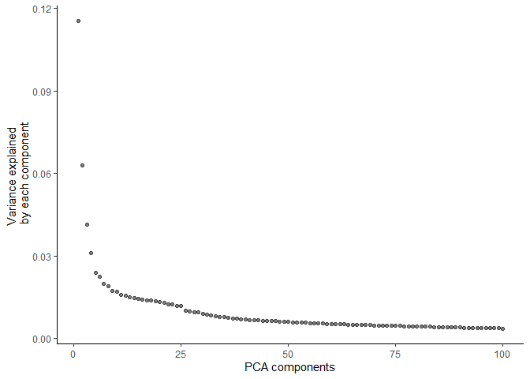<!-- -->

## Reduce dimensionality and visualize the cells

Now we're ready to visualize the cells. To do so, you can use either t-SNE, which is very popular in single-cell RNA-seq, or UMAP, which is increasingly common. Monocle 3 uses UMAP by default, as we feel that it is both faster and better suited for clustering and trajectory analysis in RNA-seq. To reduce the dimensionality of the data down into the X, Y plane so we can plot it easily, call reduce_dimension():


``` r
cds <- reduce_dimension(cds)
```

```
## No preprocess_method specified, using preprocess_method = 'PCA'
```

To plot the data, use Monocle's main plotting function, plot_cells():


``` r
plot_cells(cds)
```

```
## No trajectory to plot. Has learn_graph() been called yet?
```

```
## cluster not found in colData(cds), cells will not be colored
```

```
## cluster_cells() has not been called yet, can't color cells by cluster
```

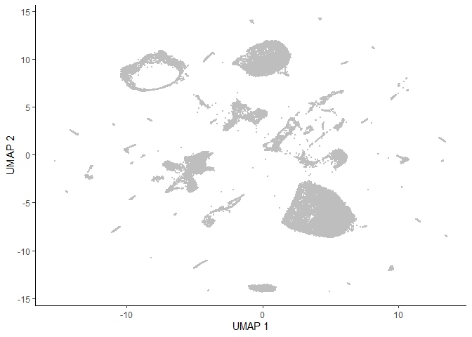<!-- -->

Each point in the plot above represents a different cell in the cell_data_set object cds. As you can see the cells form many groups, some with thousands of cells, some with only a few. Cao & Packer annotated each cell according to type manually by looking at which genes it expresses. We can color the cells in the UMAP plot by the authors' original annotations using the color_cells_by argument to plot_cells().


``` r
colData(cds)
```

```
## DataFrame with 42035 rows and 5 columns
##                            plate cao_cluster          cao_cell_type
##                         <factor>    <factor>            <character>
## cele-001-001.CATGACTCAA      001          20   Unclassified neurons
## cele-001-001.AAGACGGCCA      001          6                Germline
## cele-001-001.GCCAACGCCA      001          13 Intestinal/rectal mu..
## cele-001-001.ATAGGAGTAC      001          27      Vulval precursors
## cele-001-001.CTCGTCTAGG      001          2            Coelomocytes
## ...                          ...         ...                    ...
## cele-010-092.CGTATTGAGA      010          17                     NA
## cele-010-092.AGGTCTATGG      010          27      Vulval precursors
## cele-010-092.TGCGAAGATC      010          9        Body wall muscle
## cele-010-092.GTATTAAGTT      010          26              Failed QC
## cele-010-092.GAAGTCCGTC      010          16      GABAergic neurons
##                                     cao_tissue Size_Factor
##                                    <character>   <numeric>
## cele-001-001.CATGACTCAA                Neurons    0.236833
## cele-001-001.AAGACGGCCA                  Gonad    1.299291
## cele-001-001.GCCAACGCCA Intestinal/rectal mu..    1.368367
## cele-001-001.ATAGGAGTAC                     NA    0.324000
## cele-001-001.CTCGTCTAGG           Coelomocytes    0.781219
## ...                                        ...         ...
## cele-010-092.CGTATTGAGA                     NA    2.902847
## cele-010-092.AGGTCTATGG                     NA    5.412617
## cele-010-092.TGCGAAGATC       Body wall muscle    3.320593
## cele-010-092.GTATTAAGTT              Failed QC    0.230254
## cele-010-092.GAAGTCCGTC                Neurons    0.427615
```


``` r
plot_cells(cds, color_cells_by="cao_cell_type")
```

```
## No trajectory to plot. Has learn_graph() been called yet?
```

```
## Warning: `aes_string()` was deprecated in ggplot2 3.0.0.
## ℹ Please use tidy evaluation idioms with `aes()`.
## ℹ See also `vignette("ggplot2-in-packages")` for more information.
## ℹ The deprecated feature was likely used in the monocle3 package.
##   Please report the issue to the authors.
## This warning is displayed once every 8 hours.
## Call `lifecycle::last_lifecycle_warnings()` to see where this warning was
## generated.
```

```
## Warning: Removed 1 row containing missing values or values outside the scale range
## (`geom_text_repel()`).
```

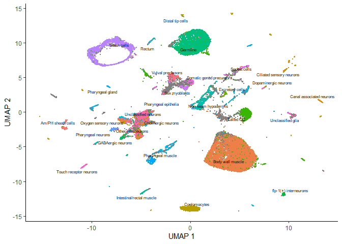<!-- -->

You can see that many of the cell types land very close to one another in the UMAP plot.

Except for a few cases described in a moment, color_cells_by can be the name of any column in colData(cds). Note that when color_cells_by is a categorical variable, labels are added to the plot, with each label positioned roughly in the middle of all the cells that have that label.

You can also color your cells according to how much of a gene or set of genes they express:


``` r
plot_cells(cds, genes=c("cpna-2", "egl-21", "ram-2", "inos-1"))
```

```
## No trajectory to plot. Has learn_graph() been called yet?
```

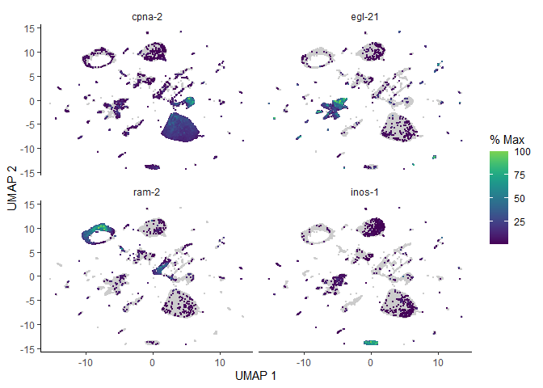<!-- -->

If you want, you can also use t-SNE to visualize your data. First, call reduce_dimension with reduction_method="tSNE".


``` r
cds <- reduce_dimension(cds, reduction_method="tSNE")
```

```
## No preprocess_method specified, using preprocess_method = 'PCA'
```

Then, when you call plot_cells(), pass reduction_method="tSNE" to it as well:


``` r
plot_cells(cds, reduction_method="tSNE", color_cells_by="cao_cell_type")
```

```
## No trajectory to plot. Has learn_graph() been called yet?
```

```
## Warning: Removed 1 row containing missing values or values outside the scale range
## (`geom_text_repel()`).
```

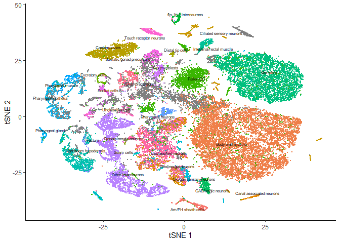<!-- -->

You can actually use UMAP and t-SNE on the same cds object - one won't overwrite the results of the other. But you must specify which one you want in downstream functions like plot_cells.

## Check for and remove batch effects

When performing gene expression analysis, it's important to check for batch effects, which are systematic differences in the transcriptome of cells measured in different experimental batches. These could be technical in nature, such as those introduced during the single-cell RNA-seq protocol, or biological, such as those that might arise from different litters of mice. How to recognize batch effects and account for them so that they don't confound your analysis can be a complex issue, but Monocle provides tools for dealing with them.

You should always check for batch effects when you perform dimensionality reduction. You should add a column to the colData that encodes which batch each cell is from. Then you can simply color the cells by batch. Cao & Packer et al included a "plate" annotation in their data, which specifies which sci-RNA-seq plate each cell originated from. Coloring the UMAP by plate reveals:


``` r
plot_cells(cds, color_cells_by="plate", label_cell_groups=FALSE)
```

```
## No trajectory to plot. Has learn_graph() been called yet?
```

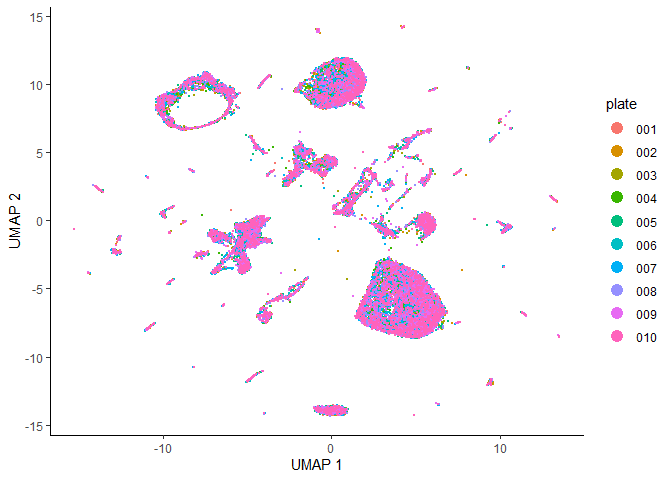<!-- -->

Dramatic batch effects are not evident in this data. If the data contained more substantial variation due to plate, we'd expect to see groups of cells that really only come from one plate. Nevertheless, we can try and remove what batch effect is by running the align_cds() function:


``` r
cds <- align_cds(cds, num_dim = 100, alignment_group = "plate")
```

```
## Aligning cells from different batches using Batchelor.
## Please remember to cite:
## 	 Haghverdi L, Lun ATL, Morgan MD, Marioni JC (2018). 'Batch effects in single-cell RNA-sequencing data are corrected by matching mutual nearest neighbors.' Nat. Biotechnol., 36(5), 421-427. doi: 10.1038/nbt.4091
```

``` r
cds <- reduce_dimension(cds)
```

```
## No preprocess_method specified, and aligned coordinates have been computed previously. Using preprocess_method = 'Aligned'
```

``` r
plot_cells(cds, color_cells_by="plate", label_cell_groups=FALSE)
```

```
## No trajectory to plot. Has learn_graph() been called yet?
```

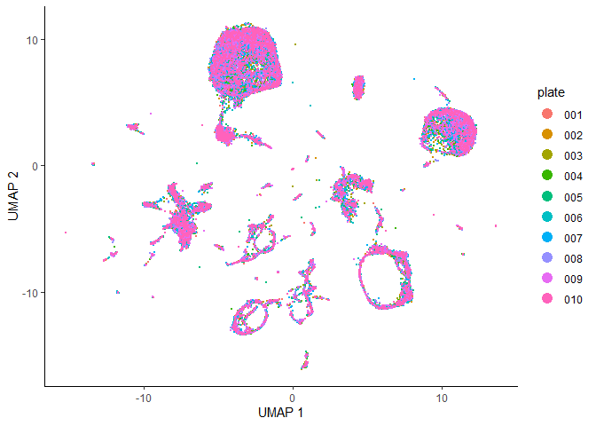<!-- -->

When run with the alignment_group argument, align_cds() tries to remove batch effects using mutual nearest neighbor alignment, a technique introduced by John Marioni's lab. Monocle 3 does so by calling Aaron Lun's excellent package batchelor. If you use align_cds(), be sure to call get_citations() to see how you should cite the software on which Monocle depends.

## Group cells into clusters

Grouping cells into clusters is an important step in identifying the cell types represented in your data. Monocle uses a technique called community detection to group cells. This approach was introduced by Levine et al as part of the phenoGraph algorithm. You can cluster your cells using the cluster_cells() function, like this:


``` r
cds <- cluster_cells(cds, resolution=1e-5)
plot_cells(cds)
```

```
## No trajectory to plot. Has learn_graph() been called yet?
```

<!-- -->

Note that now when we call plot_cells() with no arguments, it colors the cells by cluster according to default.

The cluster_cells() also divides the cells into larger, more well separated groups called partitions, using a statistical test from Alex Wolf et al, introduced as part of their PAGA algorithm. You can visualize these partitions like this:


``` r
plot_cells(cds, color_cells_by="partition", group_cells_by="partition")
```

```
## No trajectory to plot. Has learn_graph() been called yet?
```

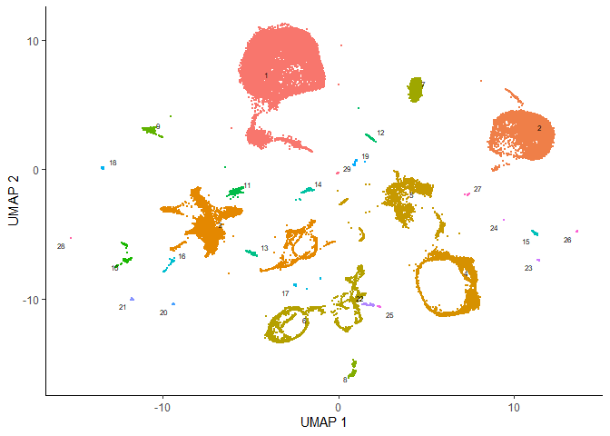<!-- -->

Once you run cluster_cells(), the plot_cells() function will label each cluster of cells is labeled separately according to how you want to color the cells. For example, the call below colors the cells according to their cell type annotation, and each cluster is labeled according the most common annotation within it:


``` r
plot_cells(cds, color_cells_by="cao_cell_type")
```

```
## No trajectory to plot. Has learn_graph() been called yet?
```

```
## Warning: Removed 7 rows containing missing values or values outside the scale range
## (`geom_text_repel()`).
```

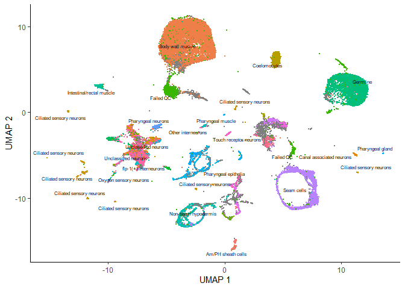<!-- -->

You can choose to label whole partitions instead of clusters by passing group_cells_by="partition". You can also plot the top 2 labels per cluster by passing labels_per_group=2 to plot_cells(). 


``` r
plot_cells(cds, labels_per_group=2)
```

```
## No trajectory to plot. Has learn_graph() been called yet?
```

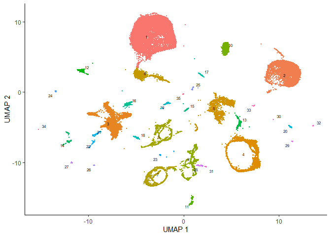<!-- -->

Finally, you can disable this labeling policy, making plot_cells() behave like it did before we called cluster_cells(), like this:


``` r
plot_cells(cds, color_cells_by="cao_cell_type", label_groups_by_cluster=FALSE)
```

```
## No trajectory to plot. Has learn_graph() been called yet?
```

```
## Warning: Removed 1 row containing missing values or values outside the scale range
## (`geom_text_repel()`).
```

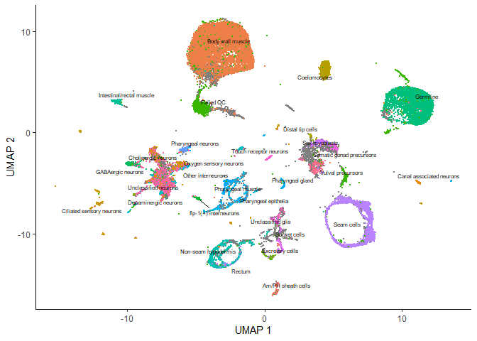<!-- -->

# Find marker genes expressed by each cluster

Once cells have been clustered, we can ask what genes makes them different from one another. To do that, start by calling the top_markers() function:


``` r
marker_test_res <- top_markers(cds, group_cells_by="partition", 
                               reference_cells=1000, cores=1)
```

```
## 
  |                                                              |   0%, ETA NA
  |                                                           |   0%, ETA 02:25
  |                                                           |   0%, ETA 01:52
  |                                                           |   0%, ETA 01:53
  |                                                           |   1%, ETA 01:50
  |                                                           |   1%, ETA 01:44
  |                                                           |   1%, ETA 01:49
  |=                                                          |   1%, ETA 01:45
  |=                                                          |   1%, ETA 01:42
  |=                                                          |   1%, ETA 01:43
  |=                                                          |   1%, ETA 01:44
  |=                                                          |   2%, ETA 01:43
  |=                                                          |   2%, ETA 01:43
  |=                                                          |   2%, ETA 01:42
  |=                                                          |   2%, ETA 01:42
  |=                                                          |   2%, ETA 01:40
  |=                                                          |   2%, ETA 01:41
  |=                                                          |   2%, ETA 01:41
  |=                                                          |   2%, ETA 01:41
  |==                                                         |   3%, ETA 01:41
  |==                                                         |   3%, ETA 01:40
  |==                                                         |   3%, ETA 01:41
  |==                                                         |   3%, ETA 01:39
  |==                                                         |   3%, ETA 01:39
  |==                                                         |   3%, ETA 01:38
  |==                                                         |   3%, ETA 01:37
  |==                                                         |   4%, ETA 01:35
  |==                                                         |   4%, ETA 01:34
  |==                                                         |   4%, ETA 01:32
  |==                                                         |   4%, ETA 01:31
  |==                                                         |   4%, ETA 01:30
  |===                                                        |   4%, ETA 01:29
  |===                                                        |   4%, ETA 01:28
  |===                                                        |   5%, ETA 01:27
  |===                                                        |   5%, ETA 01:26
  |===                                                        |   5%, ETA 01:25
  |===                                                        |   5%, ETA 01:24
  |===                                                        |   5%, ETA 01:23
  |===                                                        |   5%, ETA 01:22
  |===                                                        |   5%, ETA 01:23
  |===                                                        |   6%, ETA 01:22
  |===                                                        |   6%, ETA 01:21
  |===                                                        |   6%, ETA 01:21
  |===                                                        |   6%, ETA 01:20
  |====                                                       |   6%, ETA 01:20
  |====                                                       |   6%, ETA 01:19
  |====                                                       |   6%, ETA 01:19
  |====                                                       |   6%, ETA 01:18
  |====                                                       |   7%, ETA 01:17
  |====                                                       |   7%, ETA 01:17
  |====                                                       |   7%, ETA 01:16
  |====                                                       |   7%, ETA 01:16
  |====                                                       |   7%, ETA 01:16
  |====                                                       |   7%, ETA 01:15
  |====                                                       |   7%, ETA 01:15
  |====                                                       |   8%, ETA 01:14
  |=====                                                      |   8%, ETA 01:14
  |=====                                                      |   8%, ETA 01:13
  |=====                                                      |   8%, ETA 01:13
  |=====                                                      |   8%, ETA 01:13
  |=====                                                      |   8%, ETA 01:13
  |=====                                                      |   8%, ETA 01:12
  |=====                                                      |   9%, ETA 01:12
  |=====                                                      |   9%, ETA 01:12
  |=====                                                      |   9%, ETA 01:11
  |=====                                                      |   9%, ETA 01:11
  |=====                                                      |   9%, ETA 01:11
  |=====                                                      |   9%, ETA 01:11
  |======                                                     |   9%, ETA 01:11
  |======                                                     |  10%, ETA 01:10
  |======                                                     |  10%, ETA 01:10
  |======                                                     |  10%, ETA 01:10
  |======                                                     |  10%, ETA 01:09
  |======                                                     |  10%, ETA 01:09
  |======                                                     |  10%, ETA 01:09
  |======                                                     |  10%, ETA 01:08
  |======                                                     |  10%, ETA 01:08
  |======                                                     |  11%, ETA 01:08
  |======                                                     |  11%, ETA 01:08
  |======                                                     |  11%, ETA 01:08
  |=======                                                    |  11%, ETA 01:07
  |=======                                                    |  11%, ETA 01:07
  |=======                                                    |  11%, ETA 01:07
  |=======                                                    |  11%, ETA 01:07
  |=======                                                    |  12%, ETA 01:07
  |=======                                                    |  12%, ETA 01:06
  |=======                                                    |  12%, ETA 01:06
  |=======                                                    |  12%, ETA 01:06
  |=======                                                    |  12%, ETA 01:06
  |=======                                                    |  12%, ETA 01:06
  |=======                                                    |  12%, ETA 01:06
  |=======                                                    |  13%, ETA 01:05
  |=======                                                    |  13%, ETA 01:05
  |========                                                   |  13%, ETA 01:05
  |========                                                   |  13%, ETA 01:04
  |========                                                   |  13%, ETA 01:04
  |========                                                   |  13%, ETA 01:04
  |========                                                   |  13%, ETA 01:04
  |========                                                   |  14%, ETA 01:03
  |========                                                   |  14%, ETA 01:03
  |========                                                   |  14%, ETA 01:03
  |========                                                   |  14%, ETA 01:03
  |========                                                   |  14%, ETA 01:03
  |========                                                   |  14%, ETA 01:03
  |========                                                   |  14%, ETA 01:02
  |=========                                                  |  14%, ETA 01:02
  |=========                                                  |  15%, ETA 01:02
  |=========                                                  |  15%, ETA 01:02
  |=========                                                  |  15%, ETA 01:02
  |=========                                                  |  15%, ETA 01:02
  |=========                                                  |  15%, ETA 01:02
  |=========                                                  |  15%, ETA 01:02
  |=========                                                  |  15%, ETA 01:01
  |=========                                                  |  16%, ETA 01:01
  |=========                                                  |  16%, ETA 01:01
  |=========                                                  |  16%, ETA 01:01
  |=========                                                  |  16%, ETA 01:01
  |==========                                                 |  16%, ETA 01:01
  |==========                                                 |  16%, ETA 01:00
  |==========                                                 |  16%, ETA 01:00
  |==========                                                 |  17%, ETA 01:00
  |==========                                                 |  17%, ETA 01:00
  |==========                                                 |  17%, ETA 01:00
  |==========                                                 |  17%, ETA 01:00
  |==========                                                 |  17%, ETA 01:00
  |==========                                                 |  17%, ETA 00:59
  |==========                                                 |  17%, ETA 00:59
  |==========                                                 |  18%, ETA 00:59
  |==========                                                 |  18%, ETA 00:59
  |==========                                                 |  18%, ETA 00:59
  |===========                                                |  18%, ETA 00:59
  |===========                                                |  18%, ETA 00:59
  |===========                                                |  18%, ETA 00:59
  |===========                                                |  18%, ETA 00:58
  |===========                                                |  18%, ETA 00:58
  |===========                                                |  19%, ETA 00:58
  |===========                                                |  19%, ETA 00:58
  |===========                                                |  19%, ETA 00:58
  |===========                                                |  19%, ETA 00:58
  |===========                                                |  19%, ETA 00:57
  |===========                                                |  19%, ETA 00:57
  |===========                                                |  19%, ETA 00:57
  |============                                               |  20%, ETA 00:57
  |============                                               |  20%, ETA 00:57
  |============                                               |  20%, ETA 00:56
  |============                                               |  20%, ETA 00:56
  |============                                               |  20%, ETA 00:56
  |============                                               |  20%, ETA 00:56
  |============                                               |  20%, ETA 00:56
  |============                                               |  21%, ETA 00:55
  |============                                               |  21%, ETA 00:55
  |============                                               |  21%, ETA 00:55
  |============                                               |  21%, ETA 00:55
  |============                                               |  21%, ETA 00:55
  |=============                                              |  21%, ETA 00:54
  |=============                                              |  21%, ETA 00:54
  |=============                                              |  22%, ETA 00:54
  |=============                                              |  22%, ETA 00:54
  |=============                                              |  22%, ETA 00:54
  |=============                                              |  22%, ETA 00:54
  |=============                                              |  22%, ETA 00:54
  |=============                                              |  22%, ETA 00:54
  |=============                                              |  22%, ETA 00:53
  |=============                                              |  22%, ETA 00:53
  |=============                                              |  23%, ETA 00:53
  |=============                                              |  23%, ETA 00:53
  |==============                                             |  23%, ETA 00:53
  |==============                                             |  23%, ETA 00:53
  |==============                                             |  23%, ETA 00:53
  |==============                                             |  23%, ETA 00:53
  |==============                                             |  23%, ETA 00:52
  |==============                                             |  24%, ETA 00:52
  |==============                                             |  24%, ETA 00:52
  |==============                                             |  24%, ETA 00:52
  |==============                                             |  24%, ETA 00:52
  |==============                                             |  24%, ETA 00:52
  |==============                                             |  24%, ETA 00:52
  |==============                                             |  24%, ETA 00:51
  |==============                                             |  25%, ETA 00:51
  |===============                                            |  25%, ETA 00:51
  |===============                                            |  25%, ETA 00:51
  |===============                                            |  25%, ETA 00:51
  |===============                                            |  25%, ETA 00:51
  |===============                                            |  25%, ETA 00:51
  |===============                                            |  25%, ETA 00:50
  |===============                                            |  26%, ETA 00:50
  |===============                                            |  26%, ETA 00:50
  |===============                                            |  26%, ETA 00:50
  |===============                                            |  26%, ETA 00:50
  |===============                                            |  26%, ETA 00:50
  |===============                                            |  26%, ETA 00:50
  |================                                           |  26%, ETA 00:50
  |================                                           |  26%, ETA 00:49
  |================                                           |  27%, ETA 00:49
  |================                                           |  27%, ETA 00:49
  |================                                           |  27%, ETA 00:49
  |================                                           |  27%, ETA 00:51
  |================                                           |  27%, ETA 00:51
  |================                                           |  27%, ETA 00:51
  |================                                           |  27%, ETA 00:50
  |================                                           |  28%, ETA 00:50
  |================                                           |  28%, ETA 00:50
  |================                                           |  28%, ETA 00:50
  |=================                                          |  28%, ETA 00:50
  |=================                                          |  28%, ETA 00:50
  |=================                                          |  28%, ETA 00:50
  |=================                                          |  28%, ETA 00:50
  |=================                                          |  29%, ETA 00:49
  |=================                                          |  29%, ETA 00:49
  |=================                                          |  29%, ETA 00:49
  |=================                                          |  29%, ETA 00:49
  |=================                                          |  29%, ETA 00:49
  |=================                                          |  29%, ETA 00:49
  |=================                                          |  29%, ETA 00:49
  |=================                                          |  30%, ETA 00:49
  |=================                                          |  30%, ETA 00:49
  |==================                                         |  30%, ETA 00:49
  |==================                                         |  30%, ETA 00:49
  |==================                                         |  30%, ETA 00:48
  |==================                                         |  30%, ETA 00:48
  |==================                                         |  30%, ETA 00:48
  |==================                                         |  30%, ETA 00:48
  |==================                                         |  31%, ETA 00:48
  |==================                                         |  31%, ETA 00:48
  |==================                                         |  31%, ETA 00:48
  |==================                                         |  31%, ETA 00:48
  |==================                                         |  31%, ETA 00:48
  |==================                                         |  31%, ETA 00:47
  |===================                                        |  31%, ETA 00:47
  |===================                                        |  32%, ETA 00:47
  |===================                                        |  32%, ETA 00:47
  |===================                                        |  32%, ETA 00:47
  |===================                                        |  32%, ETA 00:47
  |===================                                        |  32%, ETA 00:47
  |===================                                        |  32%, ETA 00:47
  |===================                                        |  32%, ETA 00:47
  |===================                                        |  33%, ETA 00:47
  |===================                                        |  33%, ETA 00:46
  |===================                                        |  33%, ETA 00:46
  |===================                                        |  33%, ETA 00:46
  |====================                                       |  33%, ETA 00:46
  |====================                                       |  33%, ETA 00:46
  |====================                                       |  33%, ETA 00:46
  |====================                                       |  34%, ETA 00:46
  |====================                                       |  34%, ETA 00:46
  |====================                                       |  34%, ETA 00:46
  |====================                                       |  34%, ETA 00:46
  |====================                                       |  34%, ETA 00:45
  |====================                                       |  34%, ETA 00:45
  |====================                                       |  34%, ETA 00:45
  |====================                                       |  34%, ETA 00:45
  |====================                                       |  35%, ETA 00:45
  |=====================                                      |  35%, ETA 00:45
  |=====================                                      |  35%, ETA 00:45
  |=====================                                      |  35%, ETA 00:45
  |=====================                                      |  35%, ETA 00:44
  |=====================                                      |  35%, ETA 00:44
  |=====================                                      |  35%, ETA 00:44
  |=====================                                      |  36%, ETA 00:44
  |=====================                                      |  36%, ETA 00:44
  |=====================                                      |  36%, ETA 00:44
  |=====================                                      |  36%, ETA 00:44
  |=====================                                      |  36%, ETA 00:44
  |=====================                                      |  36%, ETA 00:44
  |=====================                                      |  36%, ETA 00:43
  |======================                                     |  37%, ETA 00:43
  |======================                                     |  37%, ETA 00:43
  |======================                                     |  37%, ETA 00:43
  |======================                                     |  37%, ETA 00:43
  |======================                                     |  37%, ETA 00:43
  |======================                                     |  37%, ETA 00:43
  |======================                                     |  37%, ETA 00:43
  |======================                                     |  38%, ETA 00:42
  |======================                                     |  38%, ETA 00:42
  |======================                                     |  38%, ETA 00:42
  |======================                                     |  38%, ETA 00:42
  |======================                                     |  38%, ETA 00:42
  |=======================                                    |  38%, ETA 00:42
  |=======================                                    |  38%, ETA 00:42
  |=======================                                    |  38%, ETA 00:42
  |=======================                                    |  39%, ETA 00:42
  |=======================                                    |  39%, ETA 00:42
  |=======================                                    |  39%, ETA 00:42
  |=======================                                    |  39%, ETA 00:42
  |=======================                                    |  39%, ETA 00:42
  |=======================                                    |  39%, ETA 00:42
  |=======================                                    |  39%, ETA 00:42
  |=======================                                    |  40%, ETA 00:42
  |=======================                                    |  40%, ETA 00:41
  |========================                                   |  40%, ETA 00:41
  |========================                                   |  40%, ETA 00:41
  |========================                                   |  40%, ETA 00:41
  |========================                                   |  40%, ETA 00:41
  |========================                                   |  40%, ETA 00:41
  |========================                                   |  41%, ETA 00:41
  |========================                                   |  41%, ETA 00:41
  |========================                                   |  41%, ETA 00:41
  |========================                                   |  41%, ETA 00:41
  |========================                                   |  41%, ETA 00:41
  |========================                                   |  41%, ETA 00:41
  |========================                                   |  41%, ETA 00:41
  |========================                                   |  42%, ETA 00:41
  |=========================                                  |  42%, ETA 00:40
  |=========================                                  |  42%, ETA 00:40
  |=========================                                  |  42%, ETA 00:40
  |=========================                                  |  42%, ETA 00:40
  |=========================                                  |  42%, ETA 00:40
  |=========================                                  |  42%, ETA 00:40
  |=========================                                  |  42%, ETA 00:40
  |=========================                                  |  43%, ETA 00:40
  |=========================                                  |  43%, ETA 00:40
  |=========================                                  |  43%, ETA 00:40
  |=========================                                  |  43%, ETA 00:39
  |=========================                                  |  43%, ETA 00:39
  |==========================                                 |  43%, ETA 00:39
  |==========================                                 |  43%, ETA 00:39
  |==========================                                 |  44%, ETA 00:39
  |==========================                                 |  44%, ETA 00:39
  |==========================                                 |  44%, ETA 00:39
  |==========================                                 |  44%, ETA 00:39
  |==========================                                 |  44%, ETA 00:39
  |==========================                                 |  44%, ETA 00:38
  |==========================                                 |  44%, ETA 00:38
  |==========================                                 |  45%, ETA 00:38
  |==========================                                 |  45%, ETA 00:38
  |==========================                                 |  45%, ETA 00:38
  |===========================                                |  45%, ETA 00:38
  |===========================                                |  45%, ETA 00:38
  |===========================                                |  45%, ETA 00:38
  |===========================                                |  45%, ETA 00:38
  |===========================                                |  46%, ETA 00:38
  |===========================                                |  46%, ETA 00:37
  |===========================                                |  46%, ETA 00:37
  |===========================                                |  46%, ETA 00:37
  |===========================                                |  46%, ETA 00:37
  |===========================                                |  46%, ETA 00:37
  |===========================                                |  46%, ETA 00:37
  |===========================                                |  46%, ETA 00:37
  |============================                               |  47%, ETA 00:37
  |============================                               |  47%, ETA 00:37
  |============================                               |  47%, ETA 00:36
  |============================                               |  47%, ETA 00:36
  |============================                               |  47%, ETA 00:36
  |============================                               |  47%, ETA 00:36
  |============================                               |  47%, ETA 00:36
  |============================                               |  48%, ETA 00:36
  |============================                               |  48%, ETA 00:36
  |============================                               |  48%, ETA 00:36
  |============================                               |  48%, ETA 00:36
  |============================                               |  48%, ETA 00:36
  |============================                               |  48%, ETA 00:35
  |=============================                              |  48%, ETA 00:35
  |=============================                              |  49%, ETA 00:35
  |=============================                              |  49%, ETA 00:35
  |=============================                              |  49%, ETA 00:35
  |=============================                              |  49%, ETA 00:35
  |=============================                              |  49%, ETA 00:35
  |=============================                              |  49%, ETA 00:35
  |=============================                              |  49%, ETA 00:35
  |=============================                              |  50%, ETA 00:34
  |=============================                              |  50%, ETA 00:34
  |=============================                              |  50%, ETA 00:34
  |=============================                              |  50%, ETA 00:34
  |==============================                             |  50%, ETA 00:34
  |==============================                             |  50%, ETA 00:34
  |==============================                             |  50%, ETA 00:34
  |==============================                             |  50%, ETA 00:34
  |==============================                             |  51%, ETA 00:34
  |==============================                             |  51%, ETA 00:34
  |==============================                             |  51%, ETA 00:33
  |==============================                             |  51%, ETA 00:33
  |==============================                             |  51%, ETA 00:33
  |==============================                             |  51%, ETA 00:33
  |==============================                             |  51%, ETA 00:33
  |==============================                             |  52%, ETA 00:33
  |===============================                            |  52%, ETA 00:33
  |===============================                            |  52%, ETA 00:33
  |===============================                            |  52%, ETA 00:33
  |===============================                            |  52%, ETA 00:33
  |===============================                            |  52%, ETA 00:32
  |===============================                            |  52%, ETA 00:32
  |===============================                            |  53%, ETA 00:32
  |===============================                            |  53%, ETA 00:32
  |===============================                            |  53%, ETA 00:32
  |===============================                            |  53%, ETA 00:32
  |===============================                            |  53%, ETA 00:32
  |===============================                            |  53%, ETA 00:32
  |===============================                            |  53%, ETA 00:32
  |================================                           |  54%, ETA 00:32
  |================================                           |  54%, ETA 00:31
  |================================                           |  54%, ETA 00:31
  |================================                           |  54%, ETA 00:31
  |================================                           |  54%, ETA 00:31
  |================================                           |  54%, ETA 00:31
  |================================                           |  54%, ETA 00:31
  |================================                           |  54%, ETA 00:31
  |================================                           |  55%, ETA 00:31
  |================================                           |  55%, ETA 00:31
  |================================                           |  55%, ETA 00:30
  |================================                           |  55%, ETA 00:30
  |=================================                          |  55%, ETA 00:30
  |=================================                          |  55%, ETA 00:30
  |=================================                          |  55%, ETA 00:30
  |=================================                          |  56%, ETA 00:30
  |=================================                          |  56%, ETA 00:30
  |=================================                          |  56%, ETA 00:30
  |=================================                          |  56%, ETA 00:30
  |=================================                          |  56%, ETA 00:30
  |=================================                          |  56%, ETA 00:29
  |=================================                          |  56%, ETA 00:29
  |=================================                          |  57%, ETA 00:29
  |=================================                          |  57%, ETA 00:29
  |==================================                         |  57%, ETA 00:29
  |==================================                         |  57%, ETA 00:29
  |==================================                         |  57%, ETA 00:29
  |==================================                         |  57%, ETA 00:29
  |==================================                         |  57%, ETA 00:29
  |==================================                         |  58%, ETA 00:29
  |==================================                         |  58%, ETA 00:29
  |==================================                         |  58%, ETA 00:28
  |==================================                         |  58%, ETA 00:28
  |==================================                         |  58%, ETA 00:28
  |==================================                         |  58%, ETA 00:28
  |==================================                         |  58%, ETA 00:28
  |===================================                        |  58%, ETA 00:28
  |===================================                        |  59%, ETA 00:28
  |===================================                        |  59%, ETA 00:28
  |===================================                        |  59%, ETA 00:28
  |===================================                        |  59%, ETA 00:28
  |===================================                        |  59%, ETA 00:28
  |===================================                        |  59%, ETA 00:27
  |===================================                        |  59%, ETA 00:27
  |===================================                        |  60%, ETA 00:27
  |===================================                        |  60%, ETA 00:27
  |===================================                        |  60%, ETA 00:27
  |===================================                        |  60%, ETA 00:27
  |===================================                        |  60%, ETA 00:27
  |====================================                       |  60%, ETA 00:27
  |====================================                       |  60%, ETA 00:27
  |====================================                       |  61%, ETA 00:27
  |====================================                       |  61%, ETA 00:26
  |====================================                       |  61%, ETA 00:26
  |====================================                       |  61%, ETA 00:26
  |====================================                       |  61%, ETA 00:26
  |====================================                       |  61%, ETA 00:26
  |====================================                       |  61%, ETA 00:26
  |====================================                       |  62%, ETA 00:26
  |====================================                       |  62%, ETA 00:26
  |====================================                       |  62%, ETA 00:26
  |=====================================                      |  62%, ETA 00:26
  |=====================================                      |  62%, ETA 00:26
  |=====================================                      |  62%, ETA 00:25
  |=====================================                      |  62%, ETA 00:25
  |=====================================                      |  62%, ETA 00:25
  |=====================================                      |  63%, ETA 00:25
  |=====================================                      |  63%, ETA 00:25
  |=====================================                      |  63%, ETA 00:25
  |=====================================                      |  63%, ETA 00:25
  |=====================================                      |  63%, ETA 00:25
  |=====================================                      |  63%, ETA 00:25
  |=====================================                      |  63%, ETA 00:25
  |======================================                     |  64%, ETA 00:25
  |======================================                     |  64%, ETA 00:25
  |======================================                     |  64%, ETA 00:24
  |======================================                     |  64%, ETA 00:24
  |======================================                     |  64%, ETA 00:24
  |======================================                     |  64%, ETA 00:24
  |======================================                     |  64%, ETA 00:24
  |======================================                     |  65%, ETA 00:24
  |======================================                     |  65%, ETA 00:24
  |======================================                     |  65%, ETA 00:24
  |======================================                     |  65%, ETA 00:24
  |======================================                     |  65%, ETA 00:24
  |======================================                     |  65%, ETA 00:24
  |=======================================                    |  65%, ETA 00:24
  |=======================================                    |  66%, ETA 00:23
  |=======================================                    |  66%, ETA 00:23
  |=======================================                    |  66%, ETA 00:23
  |=======================================                    |  66%, ETA 00:23
  |=======================================                    |  66%, ETA 00:23
  |=======================================                    |  66%, ETA 00:23
  |=======================================                    |  66%, ETA 00:23
  |=======================================                    |  66%, ETA 00:23
  |=======================================                    |  67%, ETA 00:23
  |=======================================                    |  67%, ETA 00:23
  |=======================================                    |  67%, ETA 00:23
  |========================================                   |  67%, ETA 00:23
  |========================================                   |  67%, ETA 00:22
  |========================================                   |  67%, ETA 00:22
  |========================================                   |  67%, ETA 00:22
  |========================================                   |  68%, ETA 00:22
  |========================================                   |  68%, ETA 00:22
  |========================================                   |  68%, ETA 00:22
  |========================================                   |  68%, ETA 00:22
  |========================================                   |  68%, ETA 00:22
  |========================================                   |  68%, ETA 00:22
  |========================================                   |  68%, ETA 00:22
  |========================================                   |  69%, ETA 00:21
  |=========================================                  |  69%, ETA 00:21
  |=========================================                  |  69%, ETA 00:21
  |=========================================                  |  69%, ETA 00:21
  |=========================================                  |  69%, ETA 00:21
  |=========================================                  |  69%, ETA 00:21
  |=========================================                  |  69%, ETA 00:21
  |=========================================                  |  70%, ETA 00:21
  |=========================================                  |  70%, ETA 00:21
  |=========================================                  |  70%, ETA 00:21
  |=========================================                  |  70%, ETA 00:20
  |=========================================                  |  70%, ETA 00:20
  |=========================================                  |  70%, ETA 00:20
  |==========================================                 |  70%, ETA 00:20
  |==========================================                 |  70%, ETA 00:20
  |==========================================                 |  71%, ETA 00:20
  |==========================================                 |  71%, ETA 00:20
  |==========================================                 |  71%, ETA 00:20
  |==========================================                 |  71%, ETA 00:20
  |==========================================                 |  71%, ETA 00:20
  |==========================================                 |  71%, ETA 00:20
  |==========================================                 |  71%, ETA 00:19
  |==========================================                 |  72%, ETA 00:19
  |==========================================                 |  72%, ETA 00:19
  |==========================================                 |  72%, ETA 00:19
  |==========================================                 |  72%, ETA 00:19
  |===========================================                |  72%, ETA 00:19
  |===========================================                |  72%, ETA 00:19
  |===========================================                |  72%, ETA 00:19
  |===========================================                |  73%, ETA 00:19
  |===========================================                |  73%, ETA 00:19
  |===========================================                |  73%, ETA 00:18
  |===========================================                |  73%, ETA 00:18
  |===========================================                |  73%, ETA 00:18
  |===========================================                |  73%, ETA 00:18
  |===========================================                |  73%, ETA 00:18
  |===========================================                |  74%, ETA 00:18
  |===========================================                |  74%, ETA 00:18
  |============================================               |  74%, ETA 00:18
  |============================================               |  74%, ETA 00:18
  |============================================               |  74%, ETA 00:18
  |============================================               |  74%, ETA 00:17
  |============================================               |  74%, ETA 00:17
  |============================================               |  74%, ETA 00:17
  |============================================               |  75%, ETA 00:17
  |============================================               |  75%, ETA 00:17
  |============================================               |  75%, ETA 00:17
  |============================================               |  75%, ETA 00:17
  |============================================               |  75%, ETA 00:17
  |============================================               |  75%, ETA 00:17
  |=============================================              |  75%, ETA 00:17
  |=============================================              |  76%, ETA 00:16
  |=============================================              |  76%, ETA 00:16
  |=============================================              |  76%, ETA 00:16
  |=============================================              |  76%, ETA 00:16
  |=============================================              |  76%, ETA 00:16
  |=============================================              |  76%, ETA 00:16
  |=============================================              |  76%, ETA 00:16
  |=============================================              |  77%, ETA 00:16
  |=============================================              |  77%, ETA 00:16
  |=============================================              |  77%, ETA 00:16
  |=============================================              |  77%, ETA 00:16
  |=============================================              |  77%, ETA 00:16
  |==============================================             |  77%, ETA 00:15
  |==============================================             |  77%, ETA 00:15
  |==============================================             |  78%, ETA 00:15
  |==============================================             |  78%, ETA 00:15
  |==============================================             |  78%, ETA 00:15
  |==============================================             |  78%, ETA 00:15
  |==============================================             |  78%, ETA 00:15
  |==============================================             |  78%, ETA 00:15
  |==============================================             |  78%, ETA 00:15
  |==============================================             |  78%, ETA 00:15
  |==============================================             |  79%, ETA 00:15
  |==============================================             |  79%, ETA 00:14
  |===============================================            |  79%, ETA 00:14
  |===============================================            |  79%, ETA 00:14
  |===============================================            |  79%, ETA 00:14
  |===============================================            |  79%, ETA 00:14
  |===============================================            |  79%, ETA 00:14
  |===============================================            |  80%, ETA 00:14
  |===============================================            |  80%, ETA 00:14
  |===============================================            |  80%, ETA 00:14
  |===============================================            |  80%, ETA 00:14
  |===============================================            |  80%, ETA 00:14
  |===============================================            |  80%, ETA 00:13
  |===============================================            |  80%, ETA 00:13
  |================================================           |  81%, ETA 00:13
  |================================================           |  81%, ETA 00:13
  |================================================           |  81%, ETA 00:13
  |================================================           |  81%, ETA 00:13
  |================================================           |  81%, ETA 00:13
  |================================================           |  81%, ETA 00:13
  |================================================           |  81%, ETA 00:13
  |================================================           |  82%, ETA 00:13
  |================================================           |  82%, ETA 00:13
  |================================================           |  82%, ETA 00:12
  |================================================           |  82%, ETA 00:12
  |================================================           |  82%, ETA 00:12
  |=================================================          |  82%, ETA 00:12
  |=================================================          |  82%, ETA 00:12
  |=================================================          |  82%, ETA 00:12
  |=================================================          |  83%, ETA 00:12
  |=================================================          |  83%, ETA 00:12
  |=================================================          |  83%, ETA 00:12
  |=================================================          |  83%, ETA 00:12
  |=================================================          |  83%, ETA 00:11
  |=================================================          |  83%, ETA 00:11
  |=================================================          |  83%, ETA 00:11
  |=================================================          |  84%, ETA 00:11
  |=================================================          |  84%, ETA 00:11
  |=================================================          |  84%, ETA 00:11
  |==================================================         |  84%, ETA 00:11
  |==================================================         |  84%, ETA 00:11
  |==================================================         |  84%, ETA 00:11
  |==================================================         |  84%, ETA 00:11
  |==================================================         |  85%, ETA 00:11
  |==================================================         |  85%, ETA 00:10
  |==================================================         |  85%, ETA 00:10
  |==================================================         |  85%, ETA 00:10
  |==================================================         |  85%, ETA 00:10
  |==================================================         |  85%, ETA 00:10
  |==================================================         |  85%, ETA 00:10
  |==================================================         |  86%, ETA 00:10
  |===================================================        |  86%, ETA 00:10
  |===================================================        |  86%, ETA 00:10
  |===================================================        |  86%, ETA 00:10
  |===================================================        |  86%, ETA 00:09
  |===================================================        |  86%, ETA 00:09
  |===================================================        |  86%, ETA 00:09
  |===================================================        |  86%, ETA 00:09
  |===================================================        |  87%, ETA 00:09
  |===================================================        |  87%, ETA 00:09
  |===================================================        |  87%, ETA 00:09
  |===================================================        |  87%, ETA 00:09
  |===================================================        |  87%, ETA 00:09
  |====================================================       |  87%, ETA 00:09
  |====================================================       |  87%, ETA 00:09
  |====================================================       |  88%, ETA 00:08
  |====================================================       |  88%, ETA 00:08
  |====================================================       |  88%, ETA 00:08
  |====================================================       |  88%, ETA 00:08
  |====================================================       |  88%, ETA 00:08
  |====================================================       |  88%, ETA 00:08
  |====================================================       |  88%, ETA 00:08
  |====================================================       |  89%, ETA 00:08
  |====================================================       |  89%, ETA 00:08
  |====================================================       |  89%, ETA 00:08
  |====================================================       |  89%, ETA 00:08
  |=====================================================      |  89%, ETA 00:07
  |=====================================================      |  89%, ETA 00:07
  |=====================================================      |  89%, ETA 00:07
  |=====================================================      |  90%, ETA 00:07
  |=====================================================      |  90%, ETA 00:07
  |=====================================================      |  90%, ETA 00:07
  |=====================================================      |  90%, ETA 00:07
  |=====================================================      |  90%, ETA 00:07
  |=====================================================      |  90%, ETA 00:07
  |=====================================================      |  90%, ETA 00:07
  |=====================================================      |  90%, ETA 00:06
  |=====================================================      |  91%, ETA 00:06
  |======================================================     |  91%, ETA 00:06
  |======================================================     |  91%, ETA 00:06
  |======================================================     |  91%, ETA 00:06
  |======================================================     |  91%, ETA 00:06
  |======================================================     |  91%, ETA 00:06
  |======================================================     |  91%, ETA 00:06
  |======================================================     |  92%, ETA 00:06
  |======================================================     |  92%, ETA 00:06
  |======================================================     |  92%, ETA 00:06
  |======================================================     |  92%, ETA 00:05
  |======================================================     |  92%, ETA 00:05
  |======================================================     |  92%, ETA 00:05
  |=======================================================    |  92%, ETA 00:05
  |=======================================================    |  93%, ETA 00:05
  |=======================================================    |  93%, ETA 00:05
  |=======================================================    |  93%, ETA 00:05
  |=======================================================    |  93%, ETA 00:05
  |=======================================================    |  93%, ETA 00:05
  |=======================================================    |  93%, ETA 00:05
  |=======================================================    |  93%, ETA 00:04
  |=======================================================    |  94%, ETA 00:04
  |=======================================================    |  94%, ETA 00:04
  |=======================================================    |  94%, ETA 00:04
  |=======================================================    |  94%, ETA 00:04
  |========================================================   |  94%, ETA 00:04
  |========================================================   |  94%, ETA 00:04
  |========================================================   |  94%, ETA 00:04
  |========================================================   |  94%, ETA 00:04
  |========================================================   |  95%, ETA 00:04
  |========================================================   |  95%, ETA 00:04
  |========================================================   |  95%, ETA 00:03
  |========================================================   |  95%, ETA 00:03
  |========================================================   |  95%, ETA 00:03
  |========================================================   |  95%, ETA 00:03
  |========================================================   |  95%, ETA 00:03
  |========================================================   |  96%, ETA 00:03
  |========================================================   |  96%, ETA 00:03
  |=========================================================  |  96%, ETA 00:03
  |=========================================================  |  96%, ETA 00:03
  |=========================================================  |  96%, ETA 00:03
  |=========================================================  |  96%, ETA 00:03
  |=========================================================  |  96%, ETA 00:02
  |=========================================================  |  97%, ETA 00:02
  |=========================================================  |  97%, ETA 00:02
  |=========================================================  |  97%, ETA 00:02
  |=========================================================  |  97%, ETA 00:02
  |=========================================================  |  97%, ETA 00:02
  |=========================================================  |  97%, ETA 00:02
  |=========================================================  |  97%, ETA 00:02
  |========================================================== |  98%, ETA 00:02
  |========================================================== |  98%, ETA 00:02
  |========================================================== |  98%, ETA 00:01
  |========================================================== |  98%, ETA 00:01
  |========================================================== |  98%, ETA 00:01
  |========================================================== |  98%, ETA 00:01
  |========================================================== |  98%, ETA 00:01
  |========================================================== |  98%, ETA 00:01
  |========================================================== |  99%, ETA 00:01
  |========================================================== |  99%, ETA 00:01
  |========================================================== |  99%, ETA 00:01
  |========================================================== |  99%, ETA 00:01
  |===========================================================|  99%, ETA 00:01
  |===========================================================|  99%, ETA 00:00
  |===========================================================|  99%, ETA 00:00
  |===========================================================| 100%, ETA 00:00
  |===========================================================| 100%, ETA 00:00
  |===========================================================| 100%, ETA 00:00
  |=======================================================| 100%, Elapsed 01:07
```

The data frame marker_test_res contains a number of metrics for how specifically expressed each gene is in each partition. We could group the cells according to cluster, partition, or any categorical variable in colData(cds). You can rank the table according to one or more of the specificity metrics and take the top gene for each cluster. For example, pseudo_R2 is one such measure. We can rank markers according to pseudo_R2 like this:


``` r
str(marker_test_res)
```

```
## 'data.frame':	725 obs. of  10 variables:
##  $ gene_id            : chr  "WBGene00000037" "WBGene00000069" "WBGene00000083" "WBGene00000140" ...
##  $ gene_short_name    : Factor w/ 20271 levels "2L52.1","2RSSE.1",..: 116 198 215 310 337 920 2948 3018 2981 3136 ...
##  $ cell_group         : chr  "15" "15" "25" "5" ...
##  $ marker_score       : num  0.2152 0.3336 0.3065 0.0662 0.173 ...
##  $ mean_expression    : num  1.2 1.48 4.13 1.91 9.43 ...
##  $ fraction_expressing: num  0.383 0.433 0.426 0.568 0.8 ...
##  $ specificity        : num  0.561 0.77 0.72 0.117 0.216 ...
##  $ pseudo_R2          : Named num  0.2258 0.2932 0.2876 0.0602 0.2193 ...
##   ..- attr(*, "names")= chr [1:725] "WBGene00000037" "WBGene00000069" "WBGene00000083" "WBGene00000140" ...
##  $ marker_test_p_value: Named num  7.05e-60 2.78e-77 2.20e-25 3.31e-60 1.92e-14 ...
##   ..- attr(*, "names")= chr [1:725] "WBGene00000037" "WBGene00000069" "WBGene00000083" "WBGene00000140" ...
##  $ marker_test_q_value: Named num  4.15e-54 1.64e-71 1.29e-19 1.94e-54 1.13e-08 ...
##   ..- attr(*, "names")= chr [1:725] "WBGene00000037" "WBGene00000069" "WBGene00000083" "WBGene00000140" ...
```


``` r
top_specific_markers <- marker_test_res %>%
                            filter(fraction_expressing >= 0.10) %>%
                            group_by(cell_group) %>%
                            top_n(1, pseudo_R2)

top_specific_marker_ids <- unique(top_specific_markers %>% pull(gene_id))
```


``` r
plot_genes_by_group(cds,
                    top_specific_marker_ids,
                    group_cells_by="partition",
                    ordering_type="maximal_on_diag",
                    max.size=3)
```

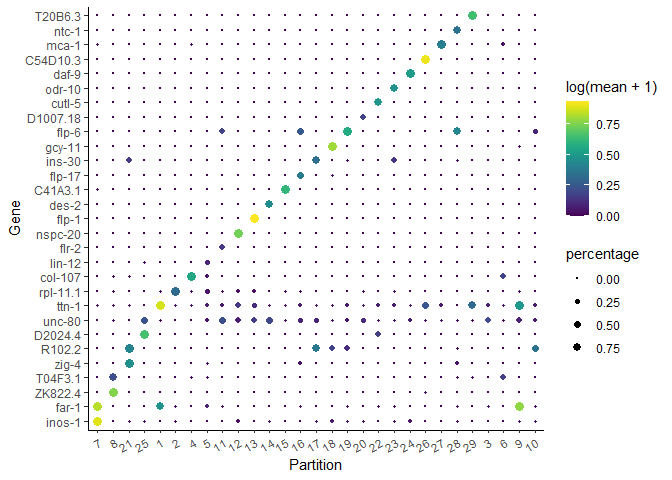<!-- -->

It's often informative to look at more than one marker, which you can do just by changing the first argument to top_n():


``` r
top_specific_markers <- marker_test_res %>%
                            filter(fraction_expressing >= 0.10) %>%
                            group_by(cell_group) %>%
                            top_n(3, pseudo_R2)

top_specific_marker_ids <- unique(top_specific_markers %>% pull(gene_id))

plot_genes_by_group(cds,
                    top_specific_marker_ids,
                    group_cells_by="partition",
                    ordering_type="cluster_row_col",
                    max.size=3)
```

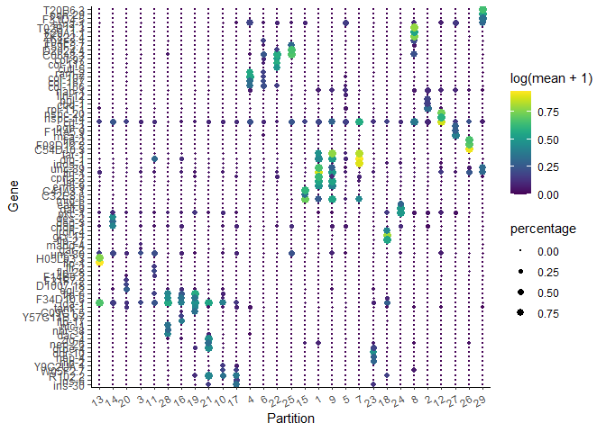<!-- -->

There are many ways to compare and contrast clusters (and other groupings) of cells. We will explore them in great detail in the differential expression analysis section a bit later.

## Annotate your cells according to type

Identifying the type of each cell in your dataset is critical for many downstream analyses. There are several ways of doing this. One commonly used approach is to first cluster the cells and then assign a cell type to each cluster based on its gene expression profile. We've already seen how to use top_markers(). Reviewing literature associated with a marker gene often give strong indications of the identity of clusters that express it. In Cao & Packer >et al, the authors consulted literature and gene expression databases for markers restricted to each cluster in order to assign the identities contained in colData(cds)$cao_cell_type.

To assign cell types based on clustering, we begin by creating a new column in colData(cds) and initialize it with the values of partitions(cds) (can also use clusters(cds) depending on your dataset):


``` r
colData(cds)$assigned_cell_type <- as.character(partitions(cds))
```

Now, we can use the dplyrpackage's recode() function to remap each cluster to a different cell type:


``` r
colData(cds)$assigned_cell_type <- dplyr::recode(
  colData(cds)$assigned_cell_type,
  "1" = "Body wall muscle",
  "2" = "Germline",
  "3" = "Motor neurons",
  "4" = "Seam cells",
  "5" = "Sex myoblasts",
  "6" = "Socket cells",
  "7" = "Marginal_cell",
  "8" = "Coelomocyte",
  "9" = "Am/PH sheath cells",
  "10" = "Ciliated neurons",
  "11" = "Intestinal/rectal muscle",
  "12" = "Excretory gland",
  "13" = "Chemosensory neurons",
  "14" = "Interneurons",
  "15" = "Unclassified eurons",
  "16" = "Ciliated neurons",
  "17" = "Pharyngeal gland cells",
  "18" = "Unclassified neurons",
  "19" = "Chemosensory neurons",
  "20" = "Ciliated neurons",
  "21" = "Ciliated neurons",
  "22" = "Inner labial neuron",
  "23" = "Ciliated neurons",
  "24" = "Ciliated neurons",
  "25" = "Ciliated neurons",
  "26" = "Hypodermal cells",
  "27" = "Mesodermal cells",
  "28" = "Motor neurons",
  "29" = "Pharyngeal gland cells",
  "30" = "Ciliated neurons",
  "31" = "Excretory cells",
  "32" = "Amphid neuron",
  "33" = "Pharyngeal muscle"
)
```

Let's see how the new annotations look:


``` r
plot_cells(cds, group_cells_by="partition", color_cells_by="assigned_cell_type")
```

```
## No trajectory to plot. Has learn_graph() been called yet?
```

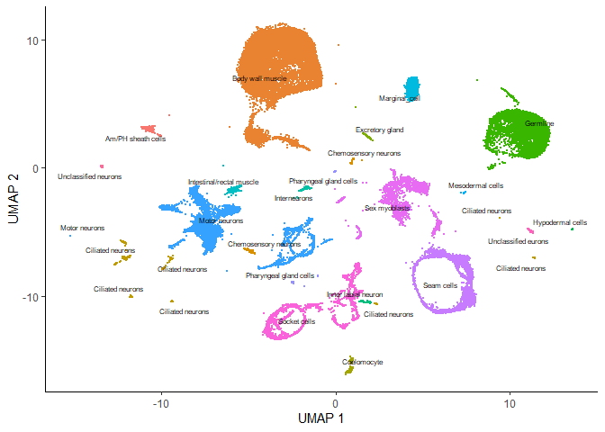<!-- -->

Partition 7 has some substructure, and it's not obvious just from looking at the output of top_markers() what cell type or types it corresponds to. So we can isolate it with the choose_cells() function for further analysis:


``` r
cds_subset <- choose_cells(cds)
```


