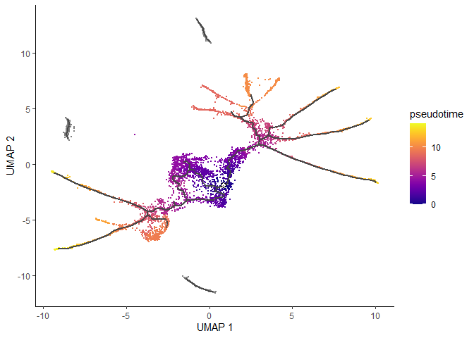
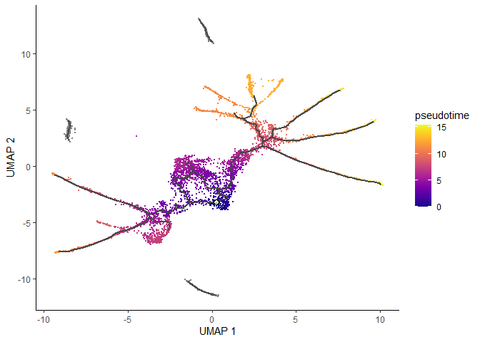

``` r
library(monocle3)
```

```
## Loading required package: Biobase
```

```
## Loading required package: BiocGenerics
```

```
## Loading required package: generics
```

```
## 
## Attaching package: 'generics'
```

```
## The following objects are masked from 'package:base':
## 
##     as.difftime, as.factor, as.ordered, intersect, is.element, setdiff,
##     setequal, union
```

```
## 
## Attaching package: 'BiocGenerics'
```

```
## The following objects are masked from 'package:stats':
## 
##     IQR, mad, sd, var, xtabs
```

```
## The following objects are masked from 'package:base':
## 
##     anyDuplicated, aperm, append, as.data.frame, basename, cbind,
##     colnames, dirname, do.call, duplicated, eval, evalq, Filter, Find,
##     get, grep, grepl, is.unsorted, lapply, Map, mapply, match, mget,
##     order, paste, pmax, pmax.int, pmin, pmin.int, Position, rank,
##     rbind, Reduce, rownames, sapply, saveRDS, table, tapply, unique,
##     unsplit, which.max, which.min
```

```
## Welcome to Bioconductor
## 
##     Vignettes contain introductory material; view with
##     'browseVignettes()'. To cite Bioconductor, see
##     'citation("Biobase")', and for packages 'citation("pkgname")'.
```

```
## Loading required package: SingleCellExperiment
```

```
## Loading required package: SummarizedExperiment
```

```
## Loading required package: MatrixGenerics
```

```
## Loading required package: matrixStats
```

```
## 
## Attaching package: 'matrixStats'
```

```
## The following objects are masked from 'package:Biobase':
## 
##     anyMissing, rowMedians
```

```
## 
## Attaching package: 'MatrixGenerics'
```

```
## The following objects are masked from 'package:matrixStats':
## 
##     colAlls, colAnyNAs, colAnys, colAvgsPerRowSet, colCollapse,
##     colCounts, colCummaxs, colCummins, colCumprods, colCumsums,
##     colDiffs, colIQRDiffs, colIQRs, colLogSumExps, colMadDiffs,
##     colMads, colMaxs, colMeans2, colMedians, colMins, colOrderStats,
##     colProds, colQuantiles, colRanges, colRanks, colSdDiffs, colSds,
##     colSums2, colTabulates, colVarDiffs, colVars, colWeightedMads,
##     colWeightedMeans, colWeightedMedians, colWeightedSds,
##     colWeightedVars, rowAlls, rowAnyNAs, rowAnys, rowAvgsPerColSet,
##     rowCollapse, rowCounts, rowCummaxs, rowCummins, rowCumprods,
##     rowCumsums, rowDiffs, rowIQRDiffs, rowIQRs, rowLogSumExps,
##     rowMadDiffs, rowMads, rowMaxs, rowMeans2, rowMedians, rowMins,
##     rowOrderStats, rowProds, rowQuantiles, rowRanges, rowRanks,
##     rowSdDiffs, rowSds, rowSums2, rowTabulates, rowVarDiffs, rowVars,
##     rowWeightedMads, rowWeightedMeans, rowWeightedMedians,
##     rowWeightedSds, rowWeightedVars
```

```
## The following object is masked from 'package:Biobase':
## 
##     rowMedians
```

```
## Loading required package: GenomicRanges
```

```
## Loading required package: stats4
```

```
## Loading required package: S4Vectors
```

```
## 
## Attaching package: 'S4Vectors'
```

```
## The following object is masked from 'package:utils':
## 
##     findMatches
```

```
## The following objects are masked from 'package:base':
## 
##     expand.grid, I, unname
```

```
## Loading required package: IRanges
```

```
## 
## Attaching package: 'IRanges'
```

```
## The following object is masked from 'package:grDevices':
## 
##     windows
```

```
## Loading required package: Seqinfo
```

```
## 
## Attaching package: 'monocle3'
```

```
## The following objects are masked from 'package:Biobase':
## 
##     exprs, fData, fData<-, pData, pData<-
```

``` r
# The tutorial shown below and on subsequent pages uses two additional packages:
library(ggplot2)
library(dplyr)
```

```
## 
## Attaching package: 'dplyr'
```

```
## The following objects are masked from 'package:GenomicRanges':
## 
##     intersect, setdiff, union
```

```
## The following object is masked from 'package:Seqinfo':
## 
##     intersect
```

```
## The following objects are masked from 'package:IRanges':
## 
##     collapse, desc, intersect, setdiff, slice, union
```

```
## The following objects are masked from 'package:S4Vectors':
## 
##     first, intersect, rename, setdiff, setequal, union
```

```
## The following object is masked from 'package:matrixStats':
## 
##     count
```

```
## The following object is masked from 'package:Biobase':
## 
##     combine
```

```
## The following objects are masked from 'package:BiocGenerics':
## 
##     combine, intersect, setdiff, setequal, union
```

```
## The following object is masked from 'package:generics':
## 
##     explain
```

```
## The following objects are masked from 'package:stats':
## 
##     filter, lag
```

```
## The following objects are masked from 'package:base':
## 
##     intersect, setdiff, setequal, union
```

``` r
set.seed(2025)
```


``` r
# cds <- readRDS("cds_after_ordering.rds")
```


``` r
# plot_cells(cds,
#            color_cells_by = "pseudotime",
#            label_cell_groups=FALSE,
#            label_leaves=FALSE,
#            label_branch_points=FALSE,
#            graph_label_size=1.5)
```

option2:


``` r
cds <- load_monocle_objects("cds_after_ordering_monocle_save")
```


``` r
plot_cells(cds,
           color_cells_by = "pseudotime",
           label_cell_groups=FALSE,
           label_leaves=FALSE,
           label_branch_points=FALSE,
           graph_label_size=1.5)
```

```
## Warning: `aes_string()` was deprecated in ggplot2 3.0.0.
## ℹ Please use tidy evaluation idioms with `aes()`.
## ℹ See also `vignette("ggplot2-in-packages")` for more information.
## ℹ The deprecated feature was likely used in the monocle3 package.
##   Please report the issue to the authors.
## This warning is displayed once every 8 hours.
## Call `lifecycle::last_lifecycle_warnings()` to see where this warning was
## generated.
```

```
## Warning: Using `size` aesthetic for lines was deprecated in ggplot2 3.4.0.
## ℹ Please use `linewidth` instead.
## ℹ The deprecated feature was likely used in the monocle3 package.
##   Please report the issue to the authors.
## This warning is displayed once every 8 hours.
## Call `lifecycle::last_lifecycle_warnings()` to see where this warning was
## generated.
```

```
## Warning: The `size` argument of `element_line()` is deprecated as of ggplot2 3.4.0.
## ℹ Please use the `linewidth` argument instead.
## ℹ The deprecated feature was likely used in the monocle3 package.
##   Please report the issue to the authors.
## This warning is displayed once every 8 hours.
## Call `lifecycle::last_lifecycle_warnings()` to see where this warning was
## generated.
```

<!-- -->

Note that some of the cells are gray. This means they have infinite pseudotime, because they were not reachable from the root nodes that were picked. In general, any cell on a partition that lacks a root node will be assigned an infinite pseudotime. In general, you should choose at least one root per partition.

It's often desirable to specify the root of the trajectory programmatically, rather than manually picking it. The function below does so by first grouping the cells according to which trajectory graph node they are nearest to. Then, it calculates what fraction of the cells at each node come from the earliest time point. Then it picks the node that is most heavily occupied by early cells and returns that as the root.


``` r
# a helper function to identify the root principal points:
get_earliest_principal_node <- function(cds, time_bin="130-170"){
  cell_ids <- which(colData(cds)[, "embryo.time.bin"] == time_bin)
  
  closest_vertex <-
  cds@principal_graph_aux[["UMAP"]]$pr_graph_cell_proj_closest_vertex
  closest_vertex <- as.matrix(closest_vertex[colnames(cds), ])
  root_pr_nodes <-
  igraph::V(principal_graph(cds)[["UMAP"]])$name[as.numeric(names
  (which.max(table(closest_vertex[cell_ids,]))))]
  
  root_pr_nodes
}
cds <- order_cells(cds, root_pr_nodes=get_earliest_principal_node(cds))
```

Passing the programatically selected root node to order_cells() via the root_pr_nodeargument yields:


``` r
plot_cells(cds,
           color_cells_by = "pseudotime",
           label_cell_groups=FALSE,
           label_leaves=FALSE,
           label_branch_points=FALSE,
           graph_label_size=1.5)
```

<!-- -->

Note that we could easily do this on a per-partition basis by first grouping the cells by partition using the partitions() function. This would result in all cells being assigned a finite pseudotime.

# Subset cells by branch

It is often useful to subset cells based on their branch in the trajectory. The function choose_graph_segments allows you to do so interactively.


``` r
# cds_sub <- choose_graph_segments(cds)
```

# Working with 3D trajectories


``` r
cds_3d <- reduce_dimension(cds, max_components = 3)
```

```
## No preprocess_method specified, and aligned coordinates have been computed previously. Using preprocess_method = 'Aligned'
```

``` r
cds_3d <- cluster_cells(cds_3d)
cds_3d <- learn_graph(cds_3d)
```

```
## 
  |                                                                            
  |                                                                      |   0%
  |                                                                            
  |======================================================================| 100%
```

``` r
cds_3d <- order_cells(cds_3d, root_pr_nodes=get_earliest_principal_node(cds))

cds_3d_plot_obj <- plot_cells_3d(cds_3d, color_cells_by="partition")
```


``` r
cds_3d_plot_obj
```

```{=html}
<div class="plotly html-widget html-fill-item" id="htmlwidget-b0b9aaaa8588571dd9dd" style="width:672px;height:480px;"></div>
<script type="application/json" data-for="htmlwidget-b0b9aaaa8588571dd9dd">{"x":{"visdat":{"5c3c74d22da1":["function () ","plotlyVisDat"]},"cur_data":"5c3c74d22da1","attrs":{"5c3c74d22da1":{"x":{},"y":{},"z":{},"mode":"markers","color":{},"size":[25],"colors":["#66C2A5","#FC8D62","#8DA0CB","#E78AC3"],"alpha":[1],"alpha_stroke":1,"sizes":[10,100],"spans":[1,20],"type":"scatter3d"},"5c3c74d22da1.1":{"x":[2.3853586300663121,2.4393973790356838],"y":[-7.5520530255216638,-7.6219732110629357],"z":[-6.0024709132502396,-6.0116647836289889],"mode":"lines","color":"black","size":[25],"colors":["#66C2A5","#FC8D62","#8DA0CB","#E78AC3"],"alpha":[1],"alpha_stroke":1,"sizes":[10,100],"spans":[1,20],"type":"scatter3d","line":{"color":["black"],"width":5},"showlegend":false,"inherit":true},"5c3c74d22da1.2":{"x":[2.4804029055794108,2.4393973790356838],"y":[-7.6782755642505895,-7.6219732110629357],"z":[-6.0206464225045169,-6.0116647836289889],"mode":"lines","color":"black","size":[25],"colors":["#66C2A5","#FC8D62","#8DA0CB","#E78AC3"],"alpha":[1],"alpha_stroke":1,"sizes":[10,100],"spans":[1,20],"type":"scatter3d","line":{"color":["black"],"width":5},"showlegend":false,"inherit":true},"5c3c74d22da1.3":{"x":[2.1327684050449331,2.0906499382855572],"y":[-7.2010025049141611,-7.1431808332540312],"z":[-5.9545813092821094,-5.9424084036219957],"mode":"lines","color":"black","size":[25],"colors":["#66C2A5","#FC8D62","#8DA0CB","#E78AC3"],"alpha":[1],"alpha_stroke":1,"sizes":[10,100],"spans":[1,20],"type":"scatter3d","line":{"color":["black"],"width":5},"showlegend":false,"inherit":true},"5c3c74d22da1.4":{"x":[1.6872814723677414,1.7236388132069813],"y":[-6.6310979814019744,-6.6756384150090593],"z":[-5.7286923597831994,-5.7547715022691026],"mode":"lines","color":"black","size":[25],"colors":["#66C2A5","#FC8D62","#8DA0CB","#E78AC3"],"alpha":[1],"alpha_stroke":1,"sizes":[10,100],"spans":[1,20],"type":"scatter3d","line":{"color":["black"],"width":5},"showlegend":false,"inherit":true},"5c3c74d22da1.5":{"x":[1.6872814723677414,1.6486473014544532],"y":[-6.6310979814019744,-6.5908820948594782],"z":[-5.7286923597831994,-5.6974887920162223],"mode":"lines","color":"black","size":[25],"colors":["#66C2A5","#FC8D62","#8DA0CB","#E78AC3"],"alpha":[1],"alpha_stroke":1,"sizes":[10,100],"spans":[1,20],"type":"scatter3d","line":{"color":["black"],"width":5},"showlegend":false,"inherit":true},"5c3c74d22da1.6":{"x":[2.0601896817369911,2.0906499382855572],"y":[-7.1038178242638557,-7.1431808332540312],"z":[-5.9307313759238562,-5.9424084036219957],"mode":"lines","color":"black","size":[25],"colors":["#66C2A5","#FC8D62","#8DA0CB","#E78AC3"],"alpha":[1],"alpha_stroke":1,"sizes":[10,100],"spans":[1,20],"type":"scatter3d","line":{"color":["black"],"width":5},"showlegend":false,"inherit":true},"5c3c74d22da1.7":{"x":[2.5777364488949082,2.5429088475859585],"y":[-7.8124948267693384,-7.7646308824656378],"z":[-6.0140311427644422,-6.0217259109807442],"mode":"lines","color":"black","size":[25],"colors":["#66C2A5","#FC8D62","#8DA0CB","#E78AC3"],"alpha":[1],"alpha_stroke":1,"sizes":[10,100],"spans":[1,20],"type":"scatter3d","line":{"color":["black"],"width":5},"showlegend":false,"inherit":true},"5c3c74d22da1.8":{"x":[2.5777364488949082,2.6196036748330416],"y":[-7.8124948267693384,-7.8714224411189671],"z":[-6.0140311427644422,-5.9975357475978877],"mode":"lines","color":"black","size":[25],"colors":["#66C2A5","#FC8D62","#8DA0CB","#E78AC3"],"alpha":[1],"alpha_stroke":1,"sizes":[10,100],"spans":[1,20],"type":"scatter3d","line":{"color":["black"],"width":5},"showlegend":false,"inherit":true},"5c3c74d22da1.9":{"x":[2.0260125998014828,2.0601896817369911],"y":[-7.0614555838988418,-7.1038178242638557],"z":[-5.9156811907610765,-5.9307313759238562],"mode":"lines","color":"black","size":[25],"colors":["#66C2A5","#FC8D62","#8DA0CB","#E78AC3"],"alpha":[1],"alpha_stroke":1,"sizes":[10,100],"spans":[1,20],"type":"scatter3d","line":{"color":["black"],"width":5},"showlegend":false,"inherit":true},"5c3c74d22da1.10":{"x":[2.5123897301243754,2.5429088475859585],"y":[-7.7227154470207608,-7.7646308824656378],"z":[-6.0237516730382046,-6.0217259109807442],"mode":"lines","color":"black","size":[25],"colors":["#66C2A5","#FC8D62","#8DA0CB","#E78AC3"],"alpha":[1],"alpha_stroke":1,"sizes":[10,100],"spans":[1,20],"type":"scatter3d","line":{"color":["black"],"width":5},"showlegend":false,"inherit":true},"5c3c74d22da1.11":{"x":[2.5123897301243754,2.4804029055794108],"y":[-7.7227154470207608,-7.6782755642505895],"z":[-6.0237516730382046,-6.0206464225045169],"mode":"lines","color":"black","size":[25],"colors":["#66C2A5","#FC8D62","#8DA0CB","#E78AC3"],"alpha":[1],"alpha_stroke":1,"sizes":[10,100],"spans":[1,20],"type":"scatter3d","line":{"color":["black"],"width":5},"showlegend":false,"inherit":true},"5c3c74d22da1.12":{"x":[2.663831016691967,2.7144941423133284],"y":[-7.935790237312256,-8.0097208856794797],"z":[-5.9704425673418449,-5.9317530237840401],"mode":"lines","color":"black","size":[25],"colors":["#66C2A5","#FC8D62","#8DA0CB","#E78AC3"],"alpha":[1],"alpha_stroke":1,"sizes":[10,100],"spans":[1,20],"type":"scatter3d","line":{"color":["black"],"width":5},"showlegend":false,"inherit":true},"5c3c74d22da1.13":{"x":[2.663831016691967,2.6196036748330416],"y":[-7.935790237312256,-7.8714224411189671],"z":[-5.9704425673418449,-5.9975357475978877],"mode":"lines","color":"black","size":[25],"colors":["#66C2A5","#FC8D62","#8DA0CB","#E78AC3"],"alpha":[1],"alpha_stroke":1,"sizes":[10,100],"spans":[1,20],"type":"scatter3d","line":{"color":["black"],"width":5},"showlegend":false,"inherit":true},"5c3c74d22da1.14":{"x":[2.7785427029462539,2.7144941423133284],"y":[-8.1013569303515336,-8.0097208856794797],"z":[-5.8817718527516254,-5.9317530237840401],"mode":"lines","color":"black","size":[25],"colors":["#66C2A5","#FC8D62","#8DA0CB","#E78AC3"],"alpha":[1],"alpha_stroke":1,"sizes":[10,100],"spans":[1,20],"type":"scatter3d","line":{"color":["black"],"width":5},"showlegend":false,"inherit":true},"5c3c74d22da1.15":{"x":[2.7785427029462539,2.8309535425721357],"y":[-8.1013569303515336,-8.1755409731813877],"z":[-5.8817718527516254,-5.8380499764341565],"mode":"lines","color":"black","size":[25],"colors":["#66C2A5","#FC8D62","#8DA0CB","#E78AC3"],"alpha":[1],"alpha_stroke":1,"sizes":[10,100],"spans":[1,20],"type":"scatter3d","line":{"color":["black"],"width":5},"showlegend":false,"inherit":true},"5c3c74d22da1.16":{"x":[1.7948080650307248,1.8303353639151234],"y":[-6.7721901429262257,-6.8176426029920432],"z":[-5.797464125019161,-5.8163915978187362],"mode":"lines","color":"black","size":[25],"colors":["#66C2A5","#FC8D62","#8DA0CB","#E78AC3"],"alpha":[1],"alpha_stroke":1,"sizes":[10,100],"spans":[1,20],"type":"scatter3d","line":{"color":["black"],"width":5},"showlegend":false,"inherit":true},"5c3c74d22da1.17":{"x":[2.8536605218317126,2.8309535425721357],"y":[-8.2071368771057482,-8.1755409731813877],"z":[-5.8187062635851987,-5.8380499764341565],"mode":"lines","color":"black","size":[25],"colors":["#66C2A5","#FC8D62","#8DA0CB","#E78AC3"],"alpha":[1],"alpha_stroke":1,"sizes":[10,100],"spans":[1,20],"type":"scatter3d","line":{"color":["black"],"width":5},"showlegend":false,"inherit":true},"5c3c74d22da1.18":{"x":[2.1955807759108894,2.1327684050449331],"y":[-7.2910138014095009,-7.2010025049141611],"z":[-5.9668256100620338,-5.9545813092821094],"mode":"lines","color":"black","size":[25],"colors":["#66C2A5","#FC8D62","#8DA0CB","#E78AC3"],"alpha":[1],"alpha_stroke":1,"sizes":[10,100],"spans":[1,20],"type":"scatter3d","line":{"color":["black"],"width":5},"showlegend":false,"inherit":true},"5c3c74d22da1.19":{"x":[2.3396790149175022,2.3853586300663121],"y":[-7.4941944838166874,-7.5520530255216638],"z":[-5.9961459190615827,-6.0024709132502396],"mode":"lines","color":"black","size":[25],"colors":["#66C2A5","#FC8D62","#8DA0CB","#E78AC3"],"alpha":[1],"alpha_stroke":1,"sizes":[10,100],"spans":[1,20],"type":"scatter3d","line":{"color":["black"],"width":5},"showlegend":false,"inherit":true},"5c3c74d22da1.20":{"x":[2.3396790149175022,2.301890642498206],"y":[-7.4941944838166874,-7.4437876515100339],"z":[-5.9961459190615827,-5.9871367044704753],"mode":"lines","color":"black","size":[25],"colors":["#66C2A5","#FC8D62","#8DA0CB","#E78AC3"],"alpha":[1],"alpha_stroke":1,"sizes":[10,100],"spans":[1,20],"type":"scatter3d","line":{"color":["black"],"width":5},"showlegend":false,"inherit":true},"5c3c74d22da1.21":{"x":[2.2541790803003643,2.301890642498206],"y":[-7.3763597339457343,-7.4437876515100339],"z":[-5.9748220153858762,-5.9871367044704753],"mode":"lines","color":"black","size":[25],"colors":["#66C2A5","#FC8D62","#8DA0CB","#E78AC3"],"alpha":[1],"alpha_stroke":1,"sizes":[10,100],"spans":[1,20],"type":"scatter3d","line":{"color":["black"],"width":5},"showlegend":false,"inherit":true},"5c3c74d22da1.22":{"x":[2.2541790803003643,2.1955807759108894],"y":[-7.3763597339457343,-7.2910138014095009],"z":[-5.9748220153858762,-5.9668256100620338],"mode":"lines","color":"black","size":[25],"colors":["#66C2A5","#FC8D62","#8DA0CB","#E78AC3"],"alpha":[1],"alpha_stroke":1,"sizes":[10,100],"spans":[1,20],"type":"scatter3d","line":{"color":["black"],"width":5},"showlegend":false,"inherit":true},"5c3c74d22da1.23":{"x":[1.9159266910973012,1.9547862105695466],"y":[-6.9234894641827545,-6.9726991953727593],"z":[-5.8600836881602403,-5.8806896573020326],"mode":"lines","color":"black","size":[25],"colors":["#66C2A5","#FC8D62","#8DA0CB","#E78AC3"],"alpha":[1],"alpha_stroke":1,"sizes":[10,100],"spans":[1,20],"type":"scatter3d","line":{"color":["black"],"width":5},"showlegend":false,"inherit":true},"5c3c74d22da1.24":{"x":[1.6122017583016586,1.5830144901243159],"y":[-6.5541111205134772,-6.5237288766821839],"z":[-5.6666541256440421,-5.6419046144154503],"mode":"lines","color":"black","size":[25],"colors":["#66C2A5","#FC8D62","#8DA0CB","#E78AC3"],"alpha":[1],"alpha_stroke":1,"sizes":[10,100],"spans":[1,20],"type":"scatter3d","line":{"color":["black"],"width":5},"showlegend":false,"inherit":true},"5c3c74d22da1.25":{"x":[1.6122017583016586,1.6486473014544532],"y":[-6.5541111205134772,-6.5908820948594782],"z":[-5.6666541256440421,-5.6974887920162223],"mode":"lines","color":"black","size":[25],"colors":["#66C2A5","#FC8D62","#8DA0CB","#E78AC3"],"alpha":[1],"alpha_stroke":1,"sizes":[10,100],"spans":[1,20],"type":"scatter3d","line":{"color":["black"],"width":5},"showlegend":false,"inherit":true},"5c3c74d22da1.26":{"x":[1.5605782672584765,1.5830144901243159],"y":[-6.499775840181317,-6.5237288766821839],"z":[-5.6227494583541251,-5.6419046144154503],"mode":"lines","color":"black","size":[25],"colors":["#66C2A5","#FC8D62","#8DA0CB","#E78AC3"],"alpha":[1],"alpha_stroke":1,"sizes":[10,100],"spans":[1,20],"type":"scatter3d","line":{"color":["black"],"width":5},"showlegend":false,"inherit":true},"5c3c74d22da1.27":{"x":[1.5605782672584765,1.5446683704879511],"y":[-6.499775840181317,-6.4825617404268652],"z":[-5.6227494583541251,-5.608918795844545],"mode":"lines","color":"black","size":[25],"colors":["#66C2A5","#FC8D62","#8DA0CB","#E78AC3"],"alpha":[1],"alpha_stroke":1,"sizes":[10,100],"spans":[1,20],"type":"scatter3d","line":{"color":["black"],"width":5},"showlegend":false,"inherit":true},"5c3c74d22da1.28":{"x":[1.870211279714852,1.8303353639151234],"y":[-6.8669080791175912,-6.8176426029920432],"z":[-5.8368808636728664,-5.8163915978187362],"mode":"lines","color":"black","size":[25],"colors":["#66C2A5","#FC8D62","#8DA0CB","#E78AC3"],"alpha":[1],"alpha_stroke":1,"sizes":[10,100],"spans":[1,20],"type":"scatter3d","line":{"color":["black"],"width":5},"showlegend":false,"inherit":true},"5c3c74d22da1.29":{"x":[1.870211279714852,1.9159266910973012],"y":[-6.8669080791175912,-6.9234894641827545],"z":[-5.8368808636728664,-5.8600836881602403],"mode":"lines","color":"black","size":[25],"colors":["#66C2A5","#FC8D62","#8DA0CB","#E78AC3"],"alpha":[1],"alpha_stroke":1,"sizes":[10,100],"spans":[1,20],"type":"scatter3d","line":{"color":["black"],"width":5},"showlegend":false,"inherit":true},"5c3c74d22da1.30":{"x":[1.9891970686566747,2.0260125998014828],"y":[-7.0159984835576097,-7.0614555838988418],"z":[-5.8983450986504629,-5.9156811907610765],"mode":"lines","color":"black","size":[25],"colors":["#66C2A5","#FC8D62","#8DA0CB","#E78AC3"],"alpha":[1],"alpha_stroke":1,"sizes":[10,100],"spans":[1,20],"type":"scatter3d","line":{"color":["black"],"width":5},"showlegend":false,"inherit":true},"5c3c74d22da1.31":{"x":[1.9891970686566747,1.9547862105695466],"y":[-7.0159984835576097,-6.9726991953727593],"z":[-5.8983450986504629,-5.8806896573020326],"mode":"lines","color":"black","size":[25],"colors":["#66C2A5","#FC8D62","#8DA0CB","#E78AC3"],"alpha":[1],"alpha_stroke":1,"sizes":[10,100],"spans":[1,20],"type":"scatter3d","line":{"color":["black"],"width":5},"showlegend":false,"inherit":true},"5c3c74d22da1.32":{"x":[1.7591658739236193,1.7236388132069813],"y":[-6.7242434529894863,-6.6756384150090593],"z":[-5.777258085640697,-5.7547715022691026],"mode":"lines","color":"black","size":[25],"colors":["#66C2A5","#FC8D62","#8DA0CB","#E78AC3"],"alpha":[1],"alpha_stroke":1,"sizes":[10,100],"spans":[1,20],"type":"scatter3d","line":{"color":["black"],"width":5},"showlegend":false,"inherit":true},"5c3c74d22da1.33":{"x":[1.7591658739236193,1.7948080650307248],"y":[-6.7242434529894863,-6.7721901429262257],"z":[-5.777258085640697,-5.797464125019161],"mode":"lines","color":"black","size":[25],"colors":["#66C2A5","#FC8D62","#8DA0CB","#E78AC3"],"alpha":[1],"alpha_stroke":1,"sizes":[10,100],"spans":[1,20],"type":"scatter3d","line":{"color":["black"],"width":5},"showlegend":false,"inherit":true},"5c3c74d22da1.34":{"x":[2.4249165299800186,2.41297991837145],"y":[7.0244463112641977,7.0686279739695292],"z":[-5.0395638097700948,-5.0774184385891967],"mode":"lines","color":"black","size":[25],"colors":["#66C2A5","#FC8D62","#8DA0CB","#E78AC3"],"alpha":[1],"alpha_stroke":1,"sizes":[10,100],"spans":[1,20],"type":"scatter3d","line":{"color":["black"],"width":5},"showlegend":false,"inherit":true},"5c3c74d22da1.35":{"x":[2.526604645616322,2.4931696339942038],"y":[7.7995103695361312,7.7434576078114219],"z":[-5.5348763391538194,-5.4904344232933893],"mode":"lines","color":"black","size":[25],"colors":["#66C2A5","#FC8D62","#8DA0CB","#E78AC3"],"alpha":[1],"alpha_stroke":1,"sizes":[10,100],"spans":[1,20],"type":"scatter3d","line":{"color":["black"],"width":5},"showlegend":false,"inherit":true},"5c3c74d22da1.36":{"x":[2.5476469409758833,2.5568872338004636],"y":[7.833152469732938,7.8475861237318103],"z":[-5.5623262844957555,-5.5743055642339909],"mode":"lines","color":"black","size":[25],"colors":["#66C2A5","#FC8D62","#8DA0CB","#E78AC3"],"alpha":[1],"alpha_stroke":1,"sizes":[10,100],"spans":[1,20],"type":"scatter3d","line":{"color":["black"],"width":5},"showlegend":false,"inherit":true},"5c3c74d22da1.37":{"x":[2.5476469409758833,2.526604645616322],"y":[7.833152469732938,7.7995103695361312],"z":[-5.5623262844957555,-5.5348763391538194],"mode":"lines","color":"black","size":[25],"colors":["#66C2A5","#FC8D62","#8DA0CB","#E78AC3"],"alpha":[1],"alpha_stroke":1,"sizes":[10,100],"spans":[1,20],"type":"scatter3d","line":{"color":["black"],"width":5},"showlegend":false,"inherit":true},"5c3c74d22da1.38":{"x":[2.4368566008838943,2.4249165299800186],"y":[6.9730231378055967,7.0244463112641977],"z":[-4.9971513383617534,-5.0395638097700948],"mode":"lines","color":"black","size":[25],"colors":["#66C2A5","#FC8D62","#8DA0CB","#E78AC3"],"alpha":[1],"alpha_stroke":1,"sizes":[10,100],"spans":[1,20],"type":"scatter3d","line":{"color":["black"],"width":5},"showlegend":false,"inherit":true},"5c3c74d22da1.39":{"x":[2.4368566008838943,2.4464070491673779],"y":[6.9730231378055967,6.9253394095918361],"z":[-4.9971513383617534,-4.9579679958997911],"mode":"lines","color":"black","size":[25],"colors":["#66C2A5","#FC8D62","#8DA0CB","#E78AC3"],"alpha":[1],"alpha_stroke":1,"sizes":[10,100],"spans":[1,20],"type":"scatter3d","line":{"color":["black"],"width":5},"showlegend":false,"inherit":true},"5c3c74d22da1.40":{"x":[2.5002566540865696,2.4868755520668095],"y":[6.5004059098125619,6.5522128471236645],"z":[-4.5528024186953822,-4.6063460396163975],"mode":"lines","color":"black","size":[25],"colors":["#66C2A5","#FC8D62","#8DA0CB","#E78AC3"],"alpha":[1],"alpha_stroke":1,"sizes":[10,100],"spans":[1,20],"type":"scatter3d","line":{"color":["black"],"width":5},"showlegend":false,"inherit":true},"5c3c74d22da1.41":{"x":[2.4068255263711782,2.41297991837145],"y":[7.1019001137215998,7.0686279739695292],"z":[-5.1052618685458935,-5.0774184385891967],"mode":"lines","color":"black","size":[25],"colors":["#66C2A5","#FC8D62","#8DA0CB","#E78AC3"],"alpha":[1],"alpha_stroke":1,"sizes":[10,100],"spans":[1,20],"type":"scatter3d","line":{"color":["black"],"width":5},"showlegend":false,"inherit":true},"5c3c74d22da1.42":{"x":[2.4076877125015663,2.4068255263711782],"y":[7.1328591705889393,7.1019001137215998],"z":[-5.1272949617816188,-5.1052618685458935],"mode":"lines","color":"black","size":[25],"colors":["#66C2A5","#FC8D62","#8DA0CB","#E78AC3"],"alpha":[1],"alpha_stroke":1,"sizes":[10,100],"spans":[1,20],"type":"scatter3d","line":{"color":["black"],"width":5},"showlegend":false,"inherit":true},"5c3c74d22da1.43":{"x":[2.4816193967132283,2.4868755520668095],"y":[6.5895080670062249,6.5522128471236645],"z":[-4.6442526214755162,-4.6063460396163975],"mode":"lines","color":"black","size":[25],"colors":["#66C2A5","#FC8D62","#8DA0CB","#E78AC3"],"alpha":[1],"alpha_stroke":1,"sizes":[10,100],"spans":[1,20],"type":"scatter3d","line":{"color":["black"],"width":5},"showlegend":false,"inherit":true},"5c3c74d22da1.44":{"x":[2.5257957349145852,2.5002566540865696],"y":[6.4393112246912256,6.5004059098125619],"z":[-4.4887096261432617,-4.5528024186953822],"mode":"lines","color":"black","size":[25],"colors":["#66C2A5","#FC8D62","#8DA0CB","#E78AC3"],"alpha":[1],"alpha_stroke":1,"sizes":[10,100],"spans":[1,20],"type":"scatter3d","line":{"color":["black"],"width":5},"showlegend":false,"inherit":true},"5c3c74d22da1.45":{"x":[2.4198030380336881,2.4142876809013467],"y":[7.5293276200887211,7.466725634191377],"z":[-5.3425460443162454,-5.3102320883082887],"mode":"lines","color":"black","size":[25],"colors":["#66C2A5","#FC8D62","#8DA0CB","#E78AC3"],"alpha":[1],"alpha_stroke":1,"sizes":[10,100],"spans":[1,20],"type":"scatter3d","line":{"color":["black"],"width":5},"showlegend":false,"inherit":true},"5c3c74d22da1.46":{"x":[2.4280648613360984,2.440478159069515],"y":[7.5833016928721397,7.6345999870421819],"z":[-5.3741719787257107,-5.4079927731661268],"mode":"lines","color":"black","size":[25],"colors":["#66C2A5","#FC8D62","#8DA0CB","#E78AC3"],"alpha":[1],"alpha_stroke":1,"sizes":[10,100],"spans":[1,20],"type":"scatter3d","line":{"color":["black"],"width":5},"showlegend":false,"inherit":true},"5c3c74d22da1.47":{"x":[2.4280648613360984,2.4198030380336881],"y":[7.5833016928721397,7.5293276200887211],"z":[-5.3741719787257107,-5.3425460443162454],"mode":"lines","color":"black","size":[25],"colors":["#66C2A5","#FC8D62","#8DA0CB","#E78AC3"],"alpha":[1],"alpha_stroke":1,"sizes":[10,100],"spans":[1,20],"type":"scatter3d","line":{"color":["black"],"width":5},"showlegend":false,"inherit":true},"5c3c74d22da1.48":{"x":[2.4541279571709409,2.4541229993801519],"y":[6.7991947169531812,6.7766106734450018],"z":[-4.8460093601501173,-4.8251239159851185],"mode":"lines","color":"black","size":[25],"colors":["#66C2A5","#FC8D62","#8DA0CB","#E78AC3"],"alpha":[1],"alpha_stroke":1,"sizes":[10,100],"spans":[1,20],"type":"scatter3d","line":{"color":["black"],"width":5},"showlegend":false,"inherit":true},"5c3c74d22da1.49":{"x":[2.4109233271523016,2.4109916190909448],"y":[7.392323389501021,7.3101784864991899],"z":[-5.2736109163051088,-5.2297469284483862],"mode":"lines","color":"black","size":[25],"colors":["#66C2A5","#FC8D62","#8DA0CB","#E78AC3"],"alpha":[1],"alpha_stroke":1,"sizes":[10,100],"spans":[1,20],"type":"scatter3d","line":{"color":["black"],"width":5},"showlegend":false,"inherit":true},"5c3c74d22da1.50":{"x":[2.4109233271523016,2.4142876809013467],"y":[7.392323389501021,7.466725634191377],"z":[-5.2736109163051088,-5.3102320883082887],"mode":"lines","color":"black","size":[25],"colors":["#66C2A5","#FC8D62","#8DA0CB","#E78AC3"],"alpha":[1],"alpha_stroke":1,"sizes":[10,100],"spans":[1,20],"type":"scatter3d","line":{"color":["black"],"width":5},"showlegend":false,"inherit":true},"5c3c74d22da1.51":{"x":[2.4548224061818673,2.4541279571709409],"y":[6.8323991759854668,6.7991947169531812],"z":[-4.8763980352262495,-4.8460093601501173],"mode":"lines","color":"black","size":[25],"colors":["#66C2A5","#FC8D62","#8DA0CB","#E78AC3"],"alpha":[1],"alpha_stroke":1,"sizes":[10,100],"spans":[1,20],"type":"scatter3d","line":{"color":["black"],"width":5},"showlegend":false,"inherit":true},"5c3c74d22da1.52":{"x":[2.5580622799952137,2.5688218839258661],"y":[6.319147785425522,6.2784316466811596],"z":[-4.3583683769887323,-4.3109054938154454],"mode":"lines","color":"black","size":[25],"colors":["#66C2A5","#FC8D62","#8DA0CB","#E78AC3"],"alpha":[1],"alpha_stroke":1,"sizes":[10,100],"spans":[1,20],"type":"scatter3d","line":{"color":["black"],"width":5},"showlegend":false,"inherit":true},"5c3c74d22da1.53":{"x":[2.4607415164631705,2.4931696339942038],"y":[7.6845062317898725,7.7434576078114219],"z":[-5.4447148353093757,-5.4904344232933893],"mode":"lines","color":"black","size":[25],"colors":["#66C2A5","#FC8D62","#8DA0CB","#E78AC3"],"alpha":[1],"alpha_stroke":1,"sizes":[10,100],"spans":[1,20],"type":"scatter3d","line":{"color":["black"],"width":5},"showlegend":false,"inherit":true},"5c3c74d22da1.54":{"x":[2.4607415164631705,2.440478159069515],"y":[7.6845062317898725,7.6345999870421819],"z":[-5.4447148353093757,-5.4079927731661268],"mode":"lines","color":"black","size":[25],"colors":["#66C2A5","#FC8D62","#8DA0CB","#E78AC3"],"alpha":[1],"alpha_stroke":1,"sizes":[10,100],"spans":[1,20],"type":"scatter3d","line":{"color":["black"],"width":5},"showlegend":false,"inherit":true},"5c3c74d22da1.55":{"x":[2.4769977451825835,2.4816193967132283],"y":[6.629593372675016,6.5895080670062249],"z":[-4.6840264346663663,-4.6442526214755162],"mode":"lines","color":"black","size":[25],"colors":["#66C2A5","#FC8D62","#8DA0CB","#E78AC3"],"alpha":[1],"alpha_stroke":1,"sizes":[10,100],"spans":[1,20],"type":"scatter3d","line":{"color":["black"],"width":5},"showlegend":false,"inherit":true},"5c3c74d22da1.56":{"x":[2.4125832943607968,2.4076877125015663],"y":[7.1713814990812939,7.1328591705889393],"z":[-5.150858079649824,-5.1272949617816188],"mode":"lines","color":"black","size":[25],"colors":["#66C2A5","#FC8D62","#8DA0CB","#E78AC3"],"alpha":[1],"alpha_stroke":1,"sizes":[10,100],"spans":[1,20],"type":"scatter3d","line":{"color":["black"],"width":5},"showlegend":false,"inherit":true},"5c3c74d22da1.57":{"x":[2.5466528317108224,2.5257957349145852],"y":[6.3738003406936397,6.4393112246912256],"z":[-4.4187771471625039,-4.4887096261432617],"mode":"lines","color":"black","size":[25],"colors":["#66C2A5","#FC8D62","#8DA0CB","#E78AC3"],"alpha":[1],"alpha_stroke":1,"sizes":[10,100],"spans":[1,20],"type":"scatter3d","line":{"color":["black"],"width":5},"showlegend":false,"inherit":true},"5c3c74d22da1.58":{"x":[2.5466528317108224,2.5580622799952137],"y":[6.3738003406936397,6.319147785425522],"z":[-4.4187771471625039,-4.3583683769887323],"mode":"lines","color":"black","size":[25],"colors":["#66C2A5","#FC8D62","#8DA0CB","#E78AC3"],"alpha":[1],"alpha_stroke":1,"sizes":[10,100],"spans":[1,20],"type":"scatter3d","line":{"color":["black"],"width":5},"showlegend":false,"inherit":true},"5c3c74d22da1.59":{"x":[2.453297060957822,2.4464070491673779],"y":[6.878168034597957,6.9253394095918361],"z":[-4.91747998156068,-4.9579679958997911],"mode":"lines","color":"black","size":[25],"colors":["#66C2A5","#FC8D62","#8DA0CB","#E78AC3"],"alpha":[1],"alpha_stroke":1,"sizes":[10,100],"spans":[1,20],"type":"scatter3d","line":{"color":["black"],"width":5},"showlegend":false,"inherit":true},"5c3c74d22da1.60":{"x":[2.453297060957822,2.4548224061818673],"y":[6.878168034597957,6.8323991759854668],"z":[-4.91747998156068,-4.8763980352262495],"mode":"lines","color":"black","size":[25],"colors":["#66C2A5","#FC8D62","#8DA0CB","#E78AC3"],"alpha":[1],"alpha_stroke":1,"sizes":[10,100],"spans":[1,20],"type":"scatter3d","line":{"color":["black"],"width":5},"showlegend":false,"inherit":true},"5c3c74d22da1.61":{"x":[2.4689818458038477,2.4606524997312862],"y":[6.6817536562772046,6.7266957693984635],"z":[-4.7348860962948702,-4.7780964400336359],"mode":"lines","color":"black","size":[25],"colors":["#66C2A5","#FC8D62","#8DA0CB","#E78AC3"],"alpha":[1],"alpha_stroke":1,"sizes":[10,100],"spans":[1,20],"type":"scatter3d","line":{"color":["black"],"width":5},"showlegend":false,"inherit":true},"5c3c74d22da1.62":{"x":[2.4689818458038477,2.4769977451825835],"y":[6.6817536562772046,6.629593372675016],"z":[-4.7348860962948702,-4.6840264346663663],"mode":"lines","color":"black","size":[25],"colors":["#66C2A5","#FC8D62","#8DA0CB","#E78AC3"],"alpha":[1],"alpha_stroke":1,"sizes":[10,100],"spans":[1,20],"type":"scatter3d","line":{"color":["black"],"width":5},"showlegend":false,"inherit":true},"5c3c74d22da1.63":{"x":[2.4150070086742605,2.4109916190909448],"y":[7.2281502903637094,7.3101784864991899],"z":[-5.1835905978740575,-5.2297469284483862],"mode":"lines","color":"black","size":[25],"colors":["#66C2A5","#FC8D62","#8DA0CB","#E78AC3"],"alpha":[1],"alpha_stroke":1,"sizes":[10,100],"spans":[1,20],"type":"scatter3d","line":{"color":["black"],"width":5},"showlegend":false,"inherit":true},"5c3c74d22da1.64":{"x":[2.4150070086742605,2.4125832943607968],"y":[7.2281502903637094,7.1713814990812939],"z":[-5.1835905978740575,-5.150858079649824],"mode":"lines","color":"black","size":[25],"colors":["#66C2A5","#FC8D62","#8DA0CB","#E78AC3"],"alpha":[1],"alpha_stroke":1,"sizes":[10,100],"spans":[1,20],"type":"scatter3d","line":{"color":["black"],"width":5},"showlegend":false,"inherit":true},"5c3c74d22da1.65":{"x":[2.4559173925359548,2.4541229993801519],"y":[6.7556961554976223,6.7766106734450018],"z":[-4.8055720825670489,-4.8251239159851185],"mode":"lines","color":"black","size":[25],"colors":["#66C2A5","#FC8D62","#8DA0CB","#E78AC3"],"alpha":[1],"alpha_stroke":1,"sizes":[10,100],"spans":[1,20],"type":"scatter3d","line":{"color":["black"],"width":5},"showlegend":false,"inherit":true},"5c3c74d22da1.66":{"x":[2.4559173925359548,2.4606524997312862],"y":[6.7556961554976223,6.7266957693984635],"z":[-4.8055720825670489,-4.7780964400336359],"mode":"lines","color":"black","size":[25],"colors":["#66C2A5","#FC8D62","#8DA0CB","#E78AC3"],"alpha":[1],"alpha_stroke":1,"sizes":[10,100],"spans":[1,20],"type":"scatter3d","line":{"color":["black"],"width":5},"showlegend":false,"inherit":true},"5c3c74d22da1.67":{"x":[2.5767516184902761,2.5688218839258661],"y":[6.2517133415049235,6.2784316466811596],"z":[-4.2771532621086887,-4.3109054938154454],"mode":"lines","color":"black","size":[25],"colors":["#66C2A5","#FC8D62","#8DA0CB","#E78AC3"],"alpha":[1],"alpha_stroke":1,"sizes":[10,100],"spans":[1,20],"type":"scatter3d","line":{"color":["black"],"width":5},"showlegend":false,"inherit":true},"5c3c74d22da1.68":{"x":[5.5802623069137169,5.6130193229094321],"y":[5.1350288947936971,5.149966144798511],"z":[-1.6004387909951512,-1.6507788565041503],"mode":"lines","color":"black","size":[25],"colors":["#66C2A5","#FC8D62","#8DA0CB","#E78AC3"],"alpha":[1],"alpha_stroke":1,"sizes":[10,100],"spans":[1,20],"type":"scatter3d","line":{"color":["black"],"width":5},"showlegend":false,"inherit":true},"5c3c74d22da1.69":{"x":[5.5802623069137169,5.5571228874401584],"y":[5.1350288947936971,5.1233191356006609],"z":[-1.6004387909951512,-1.5676403414504136],"mode":"lines","color":"black","size":[25],"colors":["#66C2A5","#FC8D62","#8DA0CB","#E78AC3"],"alpha":[1],"alpha_stroke":1,"sizes":[10,100],"spans":[1,20],"type":"scatter3d","line":{"color":["black"],"width":5},"showlegend":false,"inherit":true},"5c3c74d22da1.70":{"x":[5.8304504399448893,5.8093220391999383],"y":[5.276885030632033,5.2734965856952325],"z":[-1.9703033925913838,-1.9396167472658583],"mode":"lines","color":"black","size":[25],"colors":["#66C2A5","#FC8D62","#8DA0CB","#E78AC3"],"alpha":[1],"alpha_stroke":1,"sizes":[10,100],"spans":[1,20],"type":"scatter3d","line":{"color":["black"],"width":5},"showlegend":false,"inherit":true},"5c3c74d22da1.71":{"x":[6.1053992915554636,6.0662107877888589],"y":[5.2293840407443088,5.2298081092183679],"z":[-2.453013135020651,-2.3860062533856667],"mode":"lines","color":"black","size":[25],"colors":["#66C2A5","#FC8D62","#8DA0CB","#E78AC3"],"alpha":[1],"alpha_stroke":1,"sizes":[10,100],"spans":[1,20],"type":"scatter3d","line":{"color":["black"],"width":5},"showlegend":false,"inherit":true},"5c3c74d22da1.72":{"x":[5.5094576492179765,5.5262145214842828],"y":[5.0900160873410334,5.1022101154289494],"z":[-1.5059346192112442,-1.5275896105835398],"mode":"lines","color":"black","size":[25],"colors":["#66C2A5","#FC8D62","#8DA0CB","#E78AC3"],"alpha":[1],"alpha_stroke":1,"sizes":[10,100],"spans":[1,20],"type":"scatter3d","line":{"color":["black"],"width":5},"showlegend":false,"inherit":true},"5c3c74d22da1.73":{"x":[5.6497479652701115,5.6130193229094321],"y":[5.166071266639606,5.149966144798511],"z":[-1.7119999911664392,-1.6507788565041503],"mode":"lines","color":"black","size":[25],"colors":["#66C2A5","#FC8D62","#8DA0CB","#E78AC3"],"alpha":[1],"alpha_stroke":1,"sizes":[10,100],"spans":[1,20],"type":"scatter3d","line":{"color":["black"],"width":5},"showlegend":false,"inherit":true},"5c3c74d22da1.74":{"x":[5.6497479652701115,5.6851599326299214],"y":[5.166071266639606,5.1766687091059218],"z":[-1.7119999911664392,-1.7752726773392986],"mode":"lines","color":"black","size":[25],"colors":["#66C2A5","#FC8D62","#8DA0CB","#E78AC3"],"alpha":[1],"alpha_stroke":1,"sizes":[10,100],"spans":[1,20],"type":"scatter3d","line":{"color":["black"],"width":5},"showlegend":false,"inherit":true},"5c3c74d22da1.75":{"x":[5.7140685645292493,5.6851599326299214],"y":[5.1831669617209171,5.1766687091059218],"z":[-1.8305119754921453,-1.7752726773392986],"mode":"lines","color":"black","size":[25],"colors":["#66C2A5","#FC8D62","#8DA0CB","#E78AC3"],"alpha":[1],"alpha_stroke":1,"sizes":[10,100],"spans":[1,20],"type":"scatter3d","line":{"color":["black"],"width":5},"showlegend":false,"inherit":true},"5c3c74d22da1.76":{"x":[5.7818706804295035,5.8093220391999383],"y":[5.2590243587173076,5.2734965856952325],"z":[-1.9014944487813763,-1.9396167472658583],"mode":"lines","color":"black","size":[25],"colors":["#66C2A5","#FC8D62","#8DA0CB","#E78AC3"],"alpha":[1],"alpha_stroke":1,"sizes":[10,100],"spans":[1,20],"type":"scatter3d","line":{"color":["black"],"width":5},"showlegend":false,"inherit":true},"5c3c74d22da1.77":{"x":[5.8491550277702729,5.8304504399448893],"y":[5.2734642559113523,5.276885030632033],"z":[-1.998162333561087,-1.9703033925913838],"mode":"lines","color":"black","size":[25],"colors":["#66C2A5","#FC8D62","#8DA0CB","#E78AC3"],"alpha":[1],"alpha_stroke":1,"sizes":[10,100],"spans":[1,20],"type":"scatter3d","line":{"color":["black"],"width":5},"showlegend":false,"inherit":true},"5c3c74d22da1.78":{"x":[5.9545346799325385,5.9345652381017953],"y":[5.2234236764254618,5.2317132915314204],"z":[-2.1983045755800132,-2.1592334214258],"mode":"lines","color":"black","size":[25],"colors":["#66C2A5","#FC8D62","#8DA0CB","#E78AC3"],"alpha":[1],"alpha_stroke":1,"sizes":[10,100],"spans":[1,20],"type":"scatter3d","line":{"color":["black"],"width":5},"showlegend":false,"inherit":true},"5c3c74d22da1.79":{"x":[5.5408059206032032,5.5571228874401584],"y":[5.112980194944865,5.1233191356006609],"z":[-1.5461372427839266,-1.5676403414504136],"mode":"lines","color":"black","size":[25],"colors":["#66C2A5","#FC8D62","#8DA0CB","#E78AC3"],"alpha":[1],"alpha_stroke":1,"sizes":[10,100],"spans":[1,20],"type":"scatter3d","line":{"color":["black"],"width":5},"showlegend":false,"inherit":true},"5c3c74d22da1.80":{"x":[5.5408059206032032,5.5262145214842828],"y":[5.112980194944865,5.1022101154289494],"z":[-1.5461372427839266,-1.5275896105835398],"mode":"lines","color":"black","size":[25],"colors":["#66C2A5","#FC8D62","#8DA0CB","#E78AC3"],"alpha":[1],"alpha_stroke":1,"sizes":[10,100],"spans":[1,20],"type":"scatter3d","line":{"color":["black"],"width":5},"showlegend":false,"inherit":true},"5c3c74d22da1.81":{"x":[6.2323210916982399,6.2483551638000758],"y":[5.2736371186291047,5.2807855744724757],"z":[-2.6136097100236619,-2.632073369401192],"mode":"lines","color":"black","size":[25],"colors":["#66C2A5","#FC8D62","#8DA0CB","#E78AC3"],"alpha":[1],"alpha_stroke":1,"sizes":[10,100],"spans":[1,20],"type":"scatter3d","line":{"color":["black"],"width":5},"showlegend":false,"inherit":true},"5c3c74d22da1.82":{"x":[5.9811569176217105,5.9545346799325385],"y":[5.2198564877402855,5.2234236764254618],"z":[-2.2438011631544406,-2.1983045755800132],"mode":"lines","color":"black","size":[25],"colors":["#66C2A5","#FC8D62","#8DA0CB","#E78AC3"],"alpha":[1],"alpha_stroke":1,"sizes":[10,100],"spans":[1,20],"type":"scatter3d","line":{"color":["black"],"width":5},"showlegend":false,"inherit":true},"5c3c74d22da1.83":{"x":[6.1464539958425917,6.1053992915554636],"y":[5.2354283311270287,5.2293840407443088],"z":[-2.5112393366545804,-2.453013135020651],"mode":"lines","color":"black","size":[25],"colors":["#66C2A5","#FC8D62","#8DA0CB","#E78AC3"],"alpha":[1],"alpha_stroke":1,"sizes":[10,100],"spans":[1,20],"type":"scatter3d","line":{"color":["black"],"width":5},"showlegend":false,"inherit":true},"5c3c74d22da1.84":{"x":[5.7482303690151229,5.7140685645292493],"y":[5.2280296118365799,5.1831669617209171],"z":[-1.8621797513862386,-1.8305119754921453],"mode":"lines","color":"black","size":[25],"colors":["#66C2A5","#FC8D62","#8DA0CB","#E78AC3"],"alpha":[1],"alpha_stroke":1,"sizes":[10,100],"spans":[1,20],"type":"scatter3d","line":{"color":["black"],"width":5},"showlegend":false,"inherit":true},"5c3c74d22da1.85":{"x":[5.7482303690151229,5.7818706804295035],"y":[5.2280296118365799,5.2590243587173076],"z":[-1.8621797513862386,-1.9014944487813763],"mode":"lines","color":"black","size":[25],"colors":["#66C2A5","#FC8D62","#8DA0CB","#E78AC3"],"alpha":[1],"alpha_stroke":1,"sizes":[10,100],"spans":[1,20],"type":"scatter3d","line":{"color":["black"],"width":5},"showlegend":false,"inherit":true},"5c3c74d22da1.86":{"x":[6.0216682536305361,6.0662107877888589],"y":[5.2237562363137995,5.2298081092183679],"z":[-2.3081467921258612,-2.3860062533856667],"mode":"lines","color":"black","size":[25],"colors":["#66C2A5","#FC8D62","#8DA0CB","#E78AC3"],"alpha":[1],"alpha_stroke":1,"sizes":[10,100],"spans":[1,20],"type":"scatter3d","line":{"color":["black"],"width":5},"showlegend":false,"inherit":true},"5c3c74d22da1.87":{"x":[6.0216682536305361,5.9811569176217105],"y":[5.2237562363137995,5.2198564877402855],"z":[-2.3081467921258612,-2.2438011631544406],"mode":"lines","color":"black","size":[25],"colors":["#66C2A5","#FC8D62","#8DA0CB","#E78AC3"],"alpha":[1],"alpha_stroke":1,"sizes":[10,100],"spans":[1,20],"type":"scatter3d","line":{"color":["black"],"width":5},"showlegend":false,"inherit":true},"5c3c74d22da1.88":{"x":[5.4889814094939426,5.5094576492179765],"y":[5.0762864152596228,5.0900160873410334],"z":[-1.4786190191439827,-1.5059346192112442],"mode":"lines","color":"black","size":[25],"colors":["#66C2A5","#FC8D62","#8DA0CB","#E78AC3"],"alpha":[1],"alpha_stroke":1,"sizes":[10,100],"spans":[1,20],"type":"scatter3d","line":{"color":["black"],"width":5},"showlegend":false,"inherit":true},"5c3c74d22da1.89":{"x":[5.8692895814195181,5.8920248735652168],"y":[5.2652387232192481,5.2538485491796294],"z":[-2.0309129369332943,-2.0727990732601986],"mode":"lines","color":"black","size":[25],"colors":["#66C2A5","#FC8D62","#8DA0CB","#E78AC3"],"alpha":[1],"alpha_stroke":1,"sizes":[10,100],"spans":[1,20],"type":"scatter3d","line":{"color":["black"],"width":5},"showlegend":false,"inherit":true},"5c3c74d22da1.90":{"x":[5.8692895814195181,5.8491550277702729],"y":[5.2652387232192481,5.2734642559113523],"z":[-2.0309129369332943,-1.998162333561087],"mode":"lines","color":"black","size":[25],"colors":["#66C2A5","#FC8D62","#8DA0CB","#E78AC3"],"alpha":[1],"alpha_stroke":1,"sizes":[10,100],"spans":[1,20],"type":"scatter3d","line":{"color":["black"],"width":5},"showlegend":false,"inherit":true},"5c3c74d22da1.91":{"x":[5.9145395476380616,5.8920248735652168],"y":[5.2421400952206074,5.2538485491796294],"z":[-2.1180567050829815,-2.0727990732601986],"mode":"lines","color":"black","size":[25],"colors":["#66C2A5","#FC8D62","#8DA0CB","#E78AC3"],"alpha":[1],"alpha_stroke":1,"sizes":[10,100],"spans":[1,20],"type":"scatter3d","line":{"color":["black"],"width":5},"showlegend":false,"inherit":true},"5c3c74d22da1.92":{"x":[5.9145395476380616,5.9345652381017953],"y":[5.2421400952206074,5.2317132915314204],"z":[-2.1180567050829815,-2.1592334214258],"mode":"lines","color":"black","size":[25],"colors":["#66C2A5","#FC8D62","#8DA0CB","#E78AC3"],"alpha":[1],"alpha_stroke":1,"sizes":[10,100],"spans":[1,20],"type":"scatter3d","line":{"color":["black"],"width":5},"showlegend":false,"inherit":true},"5c3c74d22da1.93":{"x":[6.195246301552733,6.2323210916982399],"y":[5.2559519207857566,5.2736371186291047],"z":[-2.5709370248599273,-2.6136097100236619],"mode":"lines","color":"black","size":[25],"colors":["#66C2A5","#FC8D62","#8DA0CB","#E78AC3"],"alpha":[1],"alpha_stroke":1,"sizes":[10,100],"spans":[1,20],"type":"scatter3d","line":{"color":["black"],"width":5},"showlegend":false,"inherit":true},"5c3c74d22da1.94":{"x":[6.195246301552733,6.1464539958425917],"y":[5.2559519207857566,5.2354283311270287],"z":[-2.5709370248599273,-2.5112393366545804],"mode":"lines","color":"black","size":[25],"colors":["#66C2A5","#FC8D62","#8DA0CB","#E78AC3"],"alpha":[1],"alpha_stroke":1,"sizes":[10,100],"spans":[1,20],"type":"scatter3d","line":{"color":["black"],"width":5},"showlegend":false,"inherit":true},"5c3c74d22da1.95":{"x":[5.3329951598641205,5.2928488669195897],"y":[4.950037394392977,4.918897801343137],"z":[-1.2567964808954177,-1.1866385656680694],"mode":"lines","color":"black","size":[25],"colors":["#66C2A5","#FC8D62","#8DA0CB","#E78AC3"],"alpha":[1],"alpha_stroke":1,"sizes":[10,100],"spans":[1,20],"type":"scatter3d","line":{"color":["black"],"width":5},"showlegend":false,"inherit":true},"5c3c74d22da1.96":{"x":[5.3329951598641205,5.3722156790077857],"y":[4.950037394392977,4.9769359622548688],"z":[-1.2567964808954177,-1.3201191217650261],"mode":"lines","color":"black","size":[25],"colors":["#66C2A5","#FC8D62","#8DA0CB","#E78AC3"],"alpha":[1],"alpha_stroke":1,"sizes":[10,100],"spans":[1,20],"type":"scatter3d","line":{"color":["black"],"width":5},"showlegend":false,"inherit":true},"5c3c74d22da1.97":{"x":[5.4016210390571757,5.3722156790077857],"y":[5.0018820628309939,4.9769359622548688],"z":[-1.3611675202973088,-1.3201191217650261],"mode":"lines","color":"black","size":[25],"colors":["#66C2A5","#FC8D62","#8DA0CB","#E78AC3"],"alpha":[1],"alpha_stroke":1,"sizes":[10,100],"spans":[1,20],"type":"scatter3d","line":{"color":["black"],"width":5},"showlegend":false,"inherit":true},"5c3c74d22da1.98":{"x":[5.4249467203343027,5.4456594991358758],"y":[5.0254674130817021,5.045082782723612],"z":[-1.3905331262534864,-1.4184149499632723],"mode":"lines","color":"black","size":[25],"colors":["#66C2A5","#FC8D62","#8DA0CB","#E78AC3"],"alpha":[1],"alpha_stroke":1,"sizes":[10,100],"spans":[1,20],"type":"scatter3d","line":{"color":["black"],"width":5},"showlegend":false,"inherit":true},"5c3c74d22da1.99":{"x":[5.4249467203343027,5.4016210390571757],"y":[5.0254674130817021,5.0018820628309939],"z":[-1.3905331262534864,-1.3611675202973088],"mode":"lines","color":"black","size":[25],"colors":["#66C2A5","#FC8D62","#8DA0CB","#E78AC3"],"alpha":[1],"alpha_stroke":1,"sizes":[10,100],"spans":[1,20],"type":"scatter3d","line":{"color":["black"],"width":5},"showlegend":false,"inherit":true},"5c3c74d22da1.100":{"x":[5.4668187585514341,5.4456594991358758],"y":[5.0614845717608956,5.045082782723612],"z":[-1.4481050031186269,-1.4184149499632723],"mode":"lines","color":"black","size":[25],"colors":["#66C2A5","#FC8D62","#8DA0CB","#E78AC3"],"alpha":[1],"alpha_stroke":1,"sizes":[10,100],"spans":[1,20],"type":"scatter3d","line":{"color":["black"],"width":5},"showlegend":false,"inherit":true},"5c3c74d22da1.101":{"x":[5.4668187585514341,5.4889814094939426],"y":[5.0614845717608956,5.0762864152596228],"z":[-1.4481050031186269,-1.4786190191439827],"mode":"lines","color":"black","size":[25],"colors":["#66C2A5","#FC8D62","#8DA0CB","#E78AC3"],"alpha":[1],"alpha_stroke":1,"sizes":[10,100],"spans":[1,20],"type":"scatter3d","line":{"color":["black"],"width":5},"showlegend":false,"inherit":true},"5c3c74d22da1.102":{"x":[-1.6050150979552498,-1.7805992639369896],"y":[-2.1695176352943419,-1.9206389285656185],"z":[-4.5478012497378453,-4.3287745875558219],"mode":"lines","color":"black","size":[25],"colors":["#66C2A5","#FC8D62","#8DA0CB","#E78AC3"],"alpha":[1],"alpha_stroke":1,"sizes":[10,100],"spans":[1,20],"type":"scatter3d","line":{"color":["black"],"width":5},"showlegend":false,"inherit":true},"5c3c74d22da1.103":{"x":[-4.0068600202690838,-3.9373319735108536],"y":[-6.0775555170711737,-5.9359979279065245],"z":[-2.4938367755602231,-2.4534612648029257],"mode":"lines","color":"black","size":[25],"colors":["#66C2A5","#FC8D62","#8DA0CB","#E78AC3"],"alpha":[1],"alpha_stroke":1,"sizes":[10,100],"spans":[1,20],"type":"scatter3d","line":{"color":["black"],"width":5},"showlegend":false,"inherit":true},"5c3c74d22da1.104":{"x":[6.656146379006632,6.9316984234594141],"y":[3.9872269191378598,4.0275685536002985],"z":[5.9852041994661871,6.2235396850576965],"mode":"lines","color":"black","size":[25],"colors":["#66C2A5","#FC8D62","#8DA0CB","#E78AC3"],"alpha":[1],"alpha_stroke":1,"sizes":[10,100],"spans":[1,20],"type":"scatter3d","line":{"color":["black"],"width":5},"showlegend":false,"inherit":true},"5c3c74d22da1.105":{"x":[-2.1713645470362208,-2.2167644631406436],"y":[-1.0392574259516658,-1.0043091646274147],"z":[-6.0942931684935937,-6.3694447598613211],"mode":"lines","color":"black","size":[25],"colors":["#66C2A5","#FC8D62","#8DA0CB","#E78AC3"],"alpha":[1],"alpha_stroke":1,"sizes":[10,100],"spans":[1,20],"type":"scatter3d","line":{"color":["black"],"width":5},"showlegend":false,"inherit":true},"5c3c74d22da1.106":{"x":[-2.260060567182685,-2.2167644631406436],"y":[-0.99006871675815422,-1.0043091646274147],"z":[-6.6479048946221031,-6.3694447598613211],"mode":"lines","color":"black","size":[25],"colors":["#66C2A5","#FC8D62","#8DA0CB","#E78AC3"],"alpha":[1],"alpha_stroke":1,"sizes":[10,100],"spans":[1,20],"type":"scatter3d","line":{"color":["black"],"width":5},"showlegend":false,"inherit":true},"5c3c74d22da1.107":{"x":[-2.260060567182685,-2.2823355828741048],"y":[-0.99006871675815422,-0.9842667834314005],"z":[-6.6479048946221031,-6.8423141577893247],"mode":"lines","color":"black","size":[25],"colors":["#66C2A5","#FC8D62","#8DA0CB","#E78AC3"],"alpha":[1],"alpha_stroke":1,"sizes":[10,100],"spans":[1,20],"type":"scatter3d","line":{"color":["black"],"width":5},"showlegend":false,"inherit":true},"5c3c74d22da1.108":{"x":[-4.449065496248318,-4.3466700051590639],"y":[-6.9039021677481678,-6.7171680105385452],"z":[-2.6455278816750938,-2.6347362147446249],"mode":"lines","color":"black","size":[25],"colors":["#66C2A5","#FC8D62","#8DA0CB","#E78AC3"],"alpha":[1],"alpha_stroke":1,"sizes":[10,100],"spans":[1,20],"type":"scatter3d","line":{"color":["black"],"width":5},"showlegend":false,"inherit":true},"5c3c74d22da1.109":{"x":[3.1494960365325064,3.1532913666968612],"y":[3.013187066293507,3.45692414679699],"z":[2.3097451313731745,2.062842334454936],"mode":"lines","color":"black","size":[25],"colors":["#66C2A5","#FC8D62","#8DA0CB","#E78AC3"],"alpha":[1],"alpha_stroke":1,"sizes":[10,100],"spans":[1,20],"type":"scatter3d","line":{"color":["black"],"width":5},"showlegend":false,"inherit":true},"5c3c74d22da1.110":{"x":[7.6501604044046756,7.9625746541174198],"y":[-0.27530153044283129,-0.58208566438627318],"z":[1.6033511529807194,1.6029149683130146],"mode":"lines","color":"black","size":[25],"colors":["#66C2A5","#FC8D62","#8DA0CB","#E78AC3"],"alpha":[1],"alpha_stroke":1,"sizes":[10,100],"spans":[1,20],"type":"scatter3d","line":{"color":["black"],"width":5},"showlegend":false,"inherit":true},"5c3c74d22da1.111":{"x":[-7.5143367462845383,-7.2083236936563528],"y":[0.93544727798681815,0.70619339175027629],"z":[-2.3697138622513925,-2.3771349693250277],"mode":"lines","color":"black","size":[25],"colors":["#66C2A5","#FC8D62","#8DA0CB","#E78AC3"],"alpha":[1],"alpha_stroke":1,"sizes":[10,100],"spans":[1,20],"type":"scatter3d","line":{"color":["black"],"width":5},"showlegend":false,"inherit":true},"5c3c74d22da1.112":{"x":[8.2323019300979059,7.9625746541174198],"y":[-0.85492223715814009,-0.58208566438627318],"z":[1.5764865232255243,1.6029149683130146],"mode":"lines","color":"black","size":[25],"colors":["#66C2A5","#FC8D62","#8DA0CB","#E78AC3"],"alpha":[1],"alpha_stroke":1,"sizes":[10,100],"spans":[1,20],"type":"scatter3d","line":{"color":["black"],"width":5},"showlegend":false,"inherit":true},"5c3c74d22da1.113":{"x":[-2.4734292279911605,-2.5169635435420576],"y":[-1.9298310617830172,-1.6655222947607409],"z":[-1.5130812672807001,-1.2452641459335352],"mode":"lines","color":"black","size":[25],"colors":["#66C2A5","#FC8D62","#8DA0CB","#E78AC3"],"alpha":[1],"alpha_stroke":1,"sizes":[10,100],"spans":[1,20],"type":"scatter3d","line":{"color":["black"],"width":5},"showlegend":false,"inherit":true},"5c3c74d22da1.114":{"x":[3.1269762359740003,3.4017090418028495],"y":[2.9600143444319227,3.1460705620450535],"z":[2.9330905310700084,3.0466679592867281],"mode":"lines","color":"black","size":[25],"colors":["#66C2A5","#FC8D62","#8DA0CB","#E78AC3"],"alpha":[1],"alpha_stroke":1,"sizes":[10,100],"spans":[1,20],"type":"scatter3d","line":{"color":["black"],"width":5},"showlegend":false,"inherit":true},"5c3c74d22da1.115":{"x":[-5.5105090662133698,-5.4214866497145149],"y":[-6.438314429568754,-5.9244994601681373],"z":[2.3989382151917442,2.4914202790659385],"mode":"lines","color":"black","size":[25],"colors":["#66C2A5","#FC8D62","#8DA0CB","#E78AC3"],"alpha":[1],"alpha_stroke":1,"sizes":[10,100],"spans":[1,20],"type":"scatter3d","line":{"color":["black"],"width":5},"showlegend":false,"inherit":true},"5c3c74d22da1.116":{"x":[6.4470284568623555,6.656146379006632],"y":[3.9678220676714329,3.9872269191378598],"z":[5.7931863952796565,5.9852041994661871],"mode":"lines","color":"black","size":[25],"colors":["#66C2A5","#FC8D62","#8DA0CB","#E78AC3"],"alpha":[1],"alpha_stroke":1,"sizes":[10,100],"spans":[1,20],"type":"scatter3d","line":{"color":["black"],"width":5},"showlegend":false,"inherit":true},"5c3c74d22da1.117":{"x":[-4.0903435440999161,-4.0068600202690838],"y":[-6.2411665901265261,-6.0775555170711737],"z":[-2.5399384586818625,-2.4938367755602231],"mode":"lines","color":"black","size":[25],"colors":["#66C2A5","#FC8D62","#8DA0CB","#E78AC3"],"alpha":[1],"alpha_stroke":1,"sizes":[10,100],"spans":[1,20],"type":"scatter3d","line":{"color":["black"],"width":5},"showlegend":false,"inherit":true},"5c3c74d22da1.118":{"x":[6.1237135427069482,5.8055244902460919],"y":[1.143002288088862,1.3104403452369633],"z":[2.2699998698831068,2.2860261643434585],"mode":"lines","color":"black","size":[25],"colors":["#66C2A5","#FC8D62","#8DA0CB","#E78AC3"],"alpha":[1],"alpha_stroke":1,"sizes":[10,100],"spans":[1,20],"type":"scatter3d","line":{"color":["black"],"width":5},"showlegend":false,"inherit":true},"5c3c74d22da1.119":{"x":[-8.3745681591996792,-8.5702960097497538],"y":[1.7375100867558462,1.9567391514924424],"z":[-2.1905495982651324,-2.116168808396901],"mode":"lines","color":"black","size":[25],"colors":["#66C2A5","#FC8D62","#8DA0CB","#E78AC3"],"alpha":[1],"alpha_stroke":1,"sizes":[10,100],"spans":[1,20],"type":"scatter3d","line":{"color":["black"],"width":5},"showlegend":false,"inherit":true},"5c3c74d22da1.120":{"x":[-8.102683978245576,-8.3745681591996792],"y":[1.446859582269048,1.7375100867558462],"z":[-2.2819427096074625,-2.1905495982651324],"mode":"lines","color":"black","size":[25],"colors":["#66C2A5","#FC8D62","#8DA0CB","#E78AC3"],"alpha":[1],"alpha_stroke":1,"sizes":[10,100],"spans":[1,20],"type":"scatter3d","line":{"color":["black"],"width":5},"showlegend":false,"inherit":true},"5c3c74d22da1.121":{"x":[7.0661422571881776,7.2943101039763629],"y":[0.5008655811497833,0.22020943541142729],"z":[2.0907988561679578,1.9263355377651339],"mode":"lines","color":"black","size":[25],"colors":["#66C2A5","#FC8D62","#8DA0CB","#E78AC3"],"alpha":[1],"alpha_stroke":1,"sizes":[10,100],"spans":[1,20],"type":"scatter3d","line":{"color":["black"],"width":5},"showlegend":false,"inherit":true},"5c3c74d22da1.122":{"x":[-2.1122116787304988,-2.1713645470362208],"y":[-1.1486978838195272,-1.0392574259516658],"z":[-5.7280302744146692,-6.0942931684935937],"mode":"lines","color":"black","size":[25],"colors":["#66C2A5","#FC8D62","#8DA0CB","#E78AC3"],"alpha":[1],"alpha_stroke":1,"sizes":[10,100],"spans":[1,20],"type":"scatter3d","line":{"color":["black"],"width":5},"showlegend":false,"inherit":true},"5c3c74d22da1.123":{"x":[-5.3818829622234228,-5.4214866497145149],"y":[-5.5481453170955115,-5.9244994601681373],"z":[2.5264907006078849,2.4914202790659385],"mode":"lines","color":"black","size":[25],"colors":["#66C2A5","#FC8D62","#8DA0CB","#E78AC3"],"alpha":[1],"alpha_stroke":1,"sizes":[10,100],"spans":[1,20],"type":"scatter3d","line":{"color":["black"],"width":5},"showlegend":false,"inherit":true},"5c3c74d22da1.124":{"x":[-5.3818829622234228,-5.3424528128731659],"y":[-5.5481453170955115,-5.187092046638095],"z":[2.5264907006078849,2.5462641653763067],"mode":"lines","color":"black","size":[25],"colors":["#66C2A5","#FC8D62","#8DA0CB","#E78AC3"],"alpha":[1],"alpha_stroke":1,"sizes":[10,100],"spans":[1,20],"type":"scatter3d","line":{"color":["black"],"width":5},"showlegend":false,"inherit":true},"5c3c74d22da1.125":{"x":[-6.1914321084139594,-5.8026395847666032],"y":[0.13337090085504422,-0.050282526844390218],"z":[-2.2198889124865251,-2.1091682559887919],"mode":"lines","color":"black","size":[25],"colors":["#66C2A5","#FC8D62","#8DA0CB","#E78AC3"],"alpha":[1],"alpha_stroke":1,"sizes":[10,100],"spans":[1,20],"type":"scatter3d","line":{"color":["black"],"width":5},"showlegend":false,"inherit":true},"5c3c74d22da1.126":{"x":[-6.1914321084139594,-6.5058439067294769],"y":[0.13337090085504422,0.29232227318615794],"z":[-2.2198889124865251,-2.2818154287745616],"mode":"lines","color":"black","size":[25],"colors":["#66C2A5","#FC8D62","#8DA0CB","#E78AC3"],"alpha":[1],"alpha_stroke":1,"sizes":[10,100],"spans":[1,20],"type":"scatter3d","line":{"color":["black"],"width":5},"showlegend":false,"inherit":true},"5c3c74d22da1.127":{"x":[5.1593896236607621,4.830332449980518],"y":[3.7643740202318425,3.7235320884622345],"z":[4.5409523792944979,4.2207076571644784],"mode":"lines","color":"black","size":[25],"colors":["#66C2A5","#FC8D62","#8DA0CB","#E78AC3"],"alpha":[1],"alpha_stroke":1,"sizes":[10,100],"spans":[1,20],"type":"scatter3d","line":{"color":["black"],"width":5},"showlegend":false,"inherit":true},"5c3c74d22da1.128":{"x":[5.1593896236607621,5.5451309858238185],"y":[3.7643740202318425,3.8157734348118697],"z":[4.5409523792944979,4.919493009376434],"mode":"lines","color":"black","size":[25],"colors":["#66C2A5","#FC8D62","#8DA0CB","#E78AC3"],"alpha":[1],"alpha_stroke":1,"sizes":[10,100],"spans":[1,20],"type":"scatter3d","line":{"color":["black"],"width":5},"showlegend":false,"inherit":true},"5c3c74d22da1.129":{"x":[7.334831607276139,6.9316984234594141],"y":[4.0631499346045459,4.0275685536002985],"z":[6.566188575284813,6.2235396850576965],"mode":"lines","color":"black","size":[25],"colors":["#66C2A5","#FC8D62","#8DA0CB","#E78AC3"],"alpha":[1],"alpha_stroke":1,"sizes":[10,100],"spans":[1,20],"type":"scatter3d","line":{"color":["black"],"width":5},"showlegend":false,"inherit":true},"5c3c74d22da1.130":{"x":[-8.7610754031801701,-8.5702960097497538],"y":[2.1828451829813336,1.9567391514924424],"z":[-2.0327198646107956,-2.116168808396901],"mode":"lines","color":"black","size":[25],"colors":["#66C2A5","#FC8D62","#8DA0CB","#E78AC3"],"alpha":[1],"alpha_stroke":1,"sizes":[10,100],"spans":[1,20],"type":"scatter3d","line":{"color":["black"],"width":5},"showlegend":false,"inherit":true},"5c3c74d22da1.131":{"x":[-8.7610754031801701,-8.8877761206015808],"y":[2.1828451829813336,2.3349707630860426],"z":[-2.0327198646107956,-1.9584136991685344],"mode":"lines","color":"black","size":[25],"colors":["#66C2A5","#FC8D62","#8DA0CB","#E78AC3"],"alpha":[1],"alpha_stroke":1,"sizes":[10,100],"spans":[1,20],"type":"scatter3d","line":{"color":["black"],"width":5},"showlegend":false,"inherit":true},"5c3c74d22da1.132":{"x":[-7.8509128345427923,-7.5143367462845383],"y":[1.2119545278384058,0.93544727798681815],"z":[-2.3371943141843095,-2.3697138622513925],"mode":"lines","color":"black","size":[25],"colors":["#66C2A5","#FC8D62","#8DA0CB","#E78AC3"],"alpha":[1],"alpha_stroke":1,"sizes":[10,100],"spans":[1,20],"type":"scatter3d","line":{"color":["black"],"width":5},"showlegend":false,"inherit":true},"5c3c74d22da1.133":{"x":[-7.8509128345427923,-8.102683978245576],"y":[1.2119545278384058,1.446859582269048],"z":[-2.3371943141843095,-2.2819427096074625],"mode":"lines","color":"black","size":[25],"colors":["#66C2A5","#FC8D62","#8DA0CB","#E78AC3"],"alpha":[1],"alpha_stroke":1,"sizes":[10,100],"spans":[1,20],"type":"scatter3d","line":{"color":["black"],"width":5},"showlegend":false,"inherit":true},"5c3c74d22da1.134":{"x":[-8.9980236352990488,-8.8877761206015808],"y":[2.4596394902276364,2.3349707630860426],"z":[-1.8861011561204366,-1.9584136991685344],"mode":"lines","color":"black","size":[25],"colors":["#66C2A5","#FC8D62","#8DA0CB","#E78AC3"],"alpha":[1],"alpha_stroke":1,"sizes":[10,100],"spans":[1,20],"type":"scatter3d","line":{"color":["black"],"width":5},"showlegend":false,"inherit":true},"5c3c74d22da1.135":{"x":[-1.9499096292118607,-2.0927801303394764],"y":[-1.7155728347831072,-1.447400880161174],"z":[-3.7417878102638205,-3.6716293439460563],"mode":"lines","color":"black","size":[25],"colors":["#66C2A5","#FC8D62","#8DA0CB","#E78AC3"],"alpha":[1],"alpha_stroke":1,"sizes":[10,100],"spans":[1,20],"type":"scatter3d","line":{"color":["black"],"width":5},"showlegend":false,"inherit":true},"5c3c74d22da1.136":{"x":[5.7911115563998665,5.5451309858238185],"y":[3.859607126918108,3.8157734348118697],"z":[5.1606096357525475,4.919493009376434],"mode":"lines","color":"black","size":[25],"colors":["#66C2A5","#FC8D62","#8DA0CB","#E78AC3"],"alpha":[1],"alpha_stroke":1,"sizes":[10,100],"spans":[1,20],"type":"scatter3d","line":{"color":["black"],"width":5},"showlegend":false,"inherit":true},"5c3c74d22da1.137":{"x":[5.7911115563998665,6.0381030589448876],"y":[3.859607126918108,3.9030142198702413],"z":[5.1606096357525475,5.4011444958090564],"mode":"lines","color":"black","size":[25],"colors":["#66C2A5","#FC8D62","#8DA0CB","#E78AC3"],"alpha":[1],"alpha_stroke":1,"sizes":[10,100],"spans":[1,20],"type":"scatter3d","line":{"color":["black"],"width":5},"showlegend":false,"inherit":true},"5c3c74d22da1.138":{"x":[-2.262022021965175,-2.274137997793471],"y":[-1.2248695471626592,-1.3475522699051474],"z":[-3.279788584906564,-3.050588686728263],"mode":"lines","color":"black","size":[25],"colors":["#66C2A5","#FC8D62","#8DA0CB","#E78AC3"],"alpha":[1],"alpha_stroke":1,"sizes":[10,100],"spans":[1,20],"type":"scatter3d","line":{"color":["black"],"width":5},"showlegend":false,"inherit":true},"5c3c74d22da1.139":{"x":[-5.2882251924862969,-5.3424528128731659],"y":[-4.9425119178161365,-5.187092046638095],"z":[2.5554466340841007,2.5462641653763067],"mode":"lines","color":"black","size":[25],"colors":["#66C2A5","#FC8D62","#8DA0CB","#E78AC3"],"alpha":[1],"alpha_stroke":1,"sizes":[10,100],"spans":[1,20],"type":"scatter3d","line":{"color":["black"],"width":5},"showlegend":false,"inherit":true},"5c3c74d22da1.140":{"x":[-3.1569281964889631,-3.0718302509039361],"y":[-3.7686998612796492,-3.5565553149354927],"z":[-1.9281342757162017,-1.8879999977484792],"mode":"lines","color":"black","size":[25],"colors":["#66C2A5","#FC8D62","#8DA0CB","#E78AC3"],"alpha":[1],"alpha_stroke":1,"sizes":[10,100],"spans":[1,20],"type":"scatter3d","line":{"color":["black"],"width":5},"showlegend":false,"inherit":true},"5c3c74d22da1.141":{"x":[-4.2484195514512804,-4.3466700051590639],"y":[-6.5621236744437876,-6.7171680105385452],"z":[-2.6240549806164459,-2.6347362147446249],"mode":"lines","color":"black","size":[25],"colors":["#66C2A5","#FC8D62","#8DA0CB","#E78AC3"],"alpha":[1],"alpha_stroke":1,"sizes":[10,100],"spans":[1,20],"type":"scatter3d","line":{"color":["black"],"width":5},"showlegend":false,"inherit":true},"5c3c74d22da1.142":{"x":[6.2545402116261437,6.0381030589448876],"y":[3.9367005680928555,3.9030142198702413],"z":[5.6097836598047994,5.4011444958090564],"mode":"lines","color":"black","size":[25],"colors":["#66C2A5","#FC8D62","#8DA0CB","#E78AC3"],"alpha":[1],"alpha_stroke":1,"sizes":[10,100],"spans":[1,20],"type":"scatter3d","line":{"color":["black"],"width":5},"showlegend":false,"inherit":true},"5c3c74d22da1.143":{"x":[6.2545402116261437,6.4470284568623555],"y":[3.9367005680928555,3.9678220676714329],"z":[5.6097836598047994,5.7931863952796565],"mode":"lines","color":"black","size":[25],"colors":["#66C2A5","#FC8D62","#8DA0CB","#E78AC3"],"alpha":[1],"alpha_stroke":1,"sizes":[10,100],"spans":[1,20],"type":"scatter3d","line":{"color":["black"],"width":5},"showlegend":false,"inherit":true},"5c3c74d22da1.144":{"x":[-5.2845236204533688,-4.6818756150481144],"y":[-0.2527099971486747,-0.47579026036264205],"z":[-1.96864870848777,-1.8146393701805923],"mode":"lines","color":"black","size":[25],"colors":["#66C2A5","#FC8D62","#8DA0CB","#E78AC3"],"alpha":[1],"alpha_stroke":1,"sizes":[10,100],"spans":[1,20],"type":"scatter3d","line":{"color":["black"],"width":5},"showlegend":false,"inherit":true},"5c3c74d22da1.145":{"x":[-5.2845236204533688,-5.8026395847666032],"y":[-0.2527099971486747,-0.050282526844390218],"z":[-1.96864870848777,-2.1091682559887919],"mode":"lines","color":"black","size":[25],"colors":["#66C2A5","#FC8D62","#8DA0CB","#E78AC3"],"alpha":[1],"alpha_stroke":1,"sizes":[10,100],"spans":[1,20],"type":"scatter3d","line":{"color":["black"],"width":5},"showlegend":false,"inherit":true},"5c3c74d22da1.146":{"x":[-1.1707055556832422,-1.6050150979552498],"y":[-2.4296502081177378,-2.1695176352943419],"z":[-4.7442801853928573,-4.5478012497378453],"mode":"lines","color":"black","size":[25],"colors":["#66C2A5","#FC8D62","#8DA0CB","#E78AC3"],"alpha":[1],"alpha_stroke":1,"sizes":[10,100],"spans":[1,20],"type":"scatter3d","line":{"color":["black"],"width":5},"showlegend":false,"inherit":true},"5c3c74d22da1.147":{"x":[-5.1546832911251776,-5.0222527365198459],"y":[-4.6987038068509381,-4.5175509848806081],"z":[2.5577926279699259,2.5559545278965863],"mode":"lines","color":"black","size":[25],"colors":["#66C2A5","#FC8D62","#8DA0CB","#E78AC3"],"alpha":[1],"alpha_stroke":1,"sizes":[10,100],"spans":[1,20],"type":"scatter3d","line":{"color":["black"],"width":5},"showlegend":false,"inherit":true},"5c3c74d22da1.148":{"x":[-5.1546832911251776,-5.2882251924862969],"y":[-4.6987038068509381,-4.9425119178161365],"z":[2.5577926279699259,2.5554466340841007],"mode":"lines","color":"black","size":[25],"colors":["#66C2A5","#FC8D62","#8DA0CB","#E78AC3"],"alpha":[1],"alpha_stroke":1,"sizes":[10,100],"spans":[1,20],"type":"scatter3d","line":{"color":["black"],"width":5},"showlegend":false,"inherit":true},"5c3c74d22da1.149":{"x":[-4.2595747283695591,-4.6818756150481144],"y":[-0.64140246670060785,-0.47579026036264205],"z":[-1.6893000395938262,-1.8146393701805923],"mode":"lines","color":"black","size":[25],"colors":["#66C2A5","#FC8D62","#8DA0CB","#E78AC3"],"alpha":[1],"alpha_stroke":1,"sizes":[10,100],"spans":[1,20],"type":"scatter3d","line":{"color":["black"],"width":5},"showlegend":false,"inherit":true},"5c3c74d22da1.150":{"x":[-4.1788816576870449,-4.0903435440999161],"y":[-6.4245296439777411,-6.2411665901265261],"z":[-2.5866172964607781,-2.5399384586818625],"mode":"lines","color":"black","size":[25],"colors":["#66C2A5","#FC8D62","#8DA0CB","#E78AC3"],"alpha":[1],"alpha_stroke":1,"sizes":[10,100],"spans":[1,20],"type":"scatter3d","line":{"color":["black"],"width":5},"showlegend":false,"inherit":true},"5c3c74d22da1.151":{"x":[-4.1788816576870449,-4.2484195514512804],"y":[-6.4245296439777411,-6.5621236744437876],"z":[-2.5866172964607781,-2.6240549806164459],"mode":"lines","color":"black","size":[25],"colors":["#66C2A5","#FC8D62","#8DA0CB","#E78AC3"],"alpha":[1],"alpha_stroke":1,"sizes":[10,100],"spans":[1,20],"type":"scatter3d","line":{"color":["black"],"width":5},"showlegend":false,"inherit":true},"5c3c74d22da1.152":{"x":[-2.1181815490192184,-2.1736393975783295],"y":[-0.93312587532874358,-0.6500236056909261],"z":[-4.5619187615356074,-4.3179551336843325],"mode":"lines","color":"black","size":[25],"colors":["#66C2A5","#FC8D62","#8DA0CB","#E78AC3"],"alpha":[1],"alpha_stroke":1,"sizes":[10,100],"spans":[1,20],"type":"scatter3d","line":{"color":["black"],"width":5},"showlegend":false,"inherit":true},"5c3c74d22da1.153":{"x":[-1.8465424462762712,-1.7805992639369896],"y":[-1.849821616483315,-1.9206389285656185],"z":[-4.025983599209126,-4.3287745875558219],"mode":"lines","color":"black","size":[25],"colors":["#66C2A5","#FC8D62","#8DA0CB","#E78AC3"],"alpha":[1],"alpha_stroke":1,"sizes":[10,100],"spans":[1,20],"type":"scatter3d","line":{"color":["black"],"width":5},"showlegend":false,"inherit":true},"5c3c74d22da1.154":{"x":[-1.8465424462762712,-1.9499096292118607],"y":[-1.849821616483315,-1.7155728347831072],"z":[-4.025983599209126,-3.7417878102638205],"mode":"lines","color":"black","size":[25],"colors":["#66C2A5","#FC8D62","#8DA0CB","#E78AC3"],"alpha":[1],"alpha_stroke":1,"sizes":[10,100],"spans":[1,20],"type":"scatter3d","line":{"color":["black"],"width":5},"showlegend":false,"inherit":true},"5c3c74d22da1.155":{"x":[-2.3352427143989787,-2.2823355828741048],"y":[-0.95124010205761578,-0.9842667834314005],"z":[-7.1051902938143838,-6.8423141577893247],"mode":"lines","color":"black","size":[25],"colors":["#66C2A5","#FC8D62","#8DA0CB","#E78AC3"],"alpha":[1],"alpha_stroke":1,"sizes":[10,100],"spans":[1,20],"type":"scatter3d","line":{"color":["black"],"width":5},"showlegend":false,"inherit":true},"5c3c74d22da1.156":{"x":[6.7979129748408793,7.0661422571881776],"y":[0.7201264454734938,0.5008655811497833],"z":[2.1886187803422978,2.0907988561679578],"mode":"lines","color":"black","size":[25],"colors":["#66C2A5","#FC8D62","#8DA0CB","#E78AC3"],"alpha":[1],"alpha_stroke":1,"sizes":[10,100],"spans":[1,20],"type":"scatter3d","line":{"color":["black"],"width":5},"showlegend":false,"inherit":true},"5c3c74d22da1.157":{"x":[7.4839602386844106,7.6501604044046756],"y":[-0.034314059933031764,-0.27530153044283129],"z":[1.763061671449494,1.6033511529807194],"mode":"lines","color":"black","size":[25],"colors":["#66C2A5","#FC8D62","#8DA0CB","#E78AC3"],"alpha":[1],"alpha_stroke":1,"sizes":[10,100],"spans":[1,20],"type":"scatter3d","line":{"color":["black"],"width":5},"showlegend":false,"inherit":true},"5c3c74d22da1.158":{"x":[7.4839602386844106,7.2943101039763629],"y":[-0.034314059933031764,0.22020943541142729],"z":[1.763061671449494,1.9263355377651339],"mode":"lines","color":"black","size":[25],"colors":["#66C2A5","#FC8D62","#8DA0CB","#E78AC3"],"alpha":[1],"alpha_stroke":1,"sizes":[10,100],"spans":[1,20],"type":"scatter3d","line":{"color":["black"],"width":5},"showlegend":false,"inherit":true},"5c3c74d22da1.159":{"x":[3.0622074121163108,3.1532913666968612],"y":[3.8454699071897211,3.45692414679699],"z":[1.9509958011990702,2.062842334454936],"mode":"lines","color":"black","size":[25],"colors":["#66C2A5","#FC8D62","#8DA0CB","#E78AC3"],"alpha":[1],"alpha_stroke":1,"sizes":[10,100],"spans":[1,20],"type":"scatter3d","line":{"color":["black"],"width":5},"showlegend":false,"inherit":true},"5c3c74d22da1.160":{"x":[-6.9214692467169527,-7.2083236936563528],"y":[0.51761183322839865,0.70619339175027629],"z":[-2.3465797948004359,-2.3771349693250277],"mode":"lines","color":"black","size":[25],"colors":["#66C2A5","#FC8D62","#8DA0CB","#E78AC3"],"alpha":[1],"alpha_stroke":1,"sizes":[10,100],"spans":[1,20],"type":"scatter3d","line":{"color":["black"],"width":5},"showlegend":false,"inherit":true},"5c3c74d22da1.161":{"x":[-6.9214692467169527,-6.5058439067294769],"y":[0.51761183322839865,0.29232227318615794],"z":[-2.3465797948004359,-2.2818154287745616],"mode":"lines","color":"black","size":[25],"colors":["#66C2A5","#FC8D62","#8DA0CB","#E78AC3"],"alpha":[1],"alpha_stroke":1,"sizes":[10,100],"spans":[1,20],"type":"scatter3d","line":{"color":["black"],"width":5},"showlegend":false,"inherit":true},"5c3c74d22da1.162":{"x":[-3.9433864129565523,-4.3260664067832231],"y":[-3.0627281398246304,-3.5621378780566411],"z":[2.2893148056327877,2.4007181634599251],"mode":"lines","color":"black","size":[25],"colors":["#66C2A5","#FC8D62","#8DA0CB","#E78AC3"],"alpha":[1],"alpha_stroke":1,"sizes":[10,100],"spans":[1,20],"type":"scatter3d","line":{"color":["black"],"width":5},"showlegend":false,"inherit":true},"5c3c74d22da1.163":{"x":[-3.4670813747389788,-3.5717257657727495],"y":[-4.6847987782699265,-4.9689643386126443],"z":[-2.1029706598350399,-2.1743133752852408],"mode":"lines","color":"black","size":[25],"colors":["#66C2A5","#FC8D62","#8DA0CB","#E78AC3"],"alpha":[1],"alpha_stroke":1,"sizes":[10,100],"spans":[1,20],"type":"scatter3d","line":{"color":["black"],"width":5},"showlegend":false,"inherit":true},"5c3c74d22da1.164":{"x":[-2.5685390482746606,-2.5169635435420576],"y":[-1.4217857079955936,-1.6655222947607409],"z":[-1.4562452337512222,-1.2452641459335352],"mode":"lines","color":"black","size":[25],"colors":["#66C2A5","#FC8D62","#8DA0CB","#E78AC3"],"alpha":[1],"alpha_stroke":1,"sizes":[10,100],"spans":[1,20],"type":"scatter3d","line":{"color":["black"],"width":5},"showlegend":false,"inherit":true},"5c3c74d22da1.165":{"x":[-2.5685390482746606,-2.5114203238821919],"y":[-1.4217857079955936,-1.2622205702762903],"z":[-1.4562452337512222,-1.2868169436655426],"mode":"lines","color":"black","size":[25],"colors":["#66C2A5","#FC8D62","#8DA0CB","#E78AC3"],"alpha":[1],"alpha_stroke":1,"sizes":[10,100],"spans":[1,20],"type":"scatter3d","line":{"color":["black"],"width":5},"showlegend":false,"inherit":true},"5c3c74d22da1.166":{"x":[-2.388334345240847,-2.3352427143989787],"y":[-0.92648155516342323,-0.95124010205761578],"z":[-7.3083234407579072,-7.1051902938143838],"mode":"lines","color":"black","size":[25],"colors":["#66C2A5","#FC8D62","#8DA0CB","#E78AC3"],"alpha":[1],"alpha_stroke":1,"sizes":[10,100],"spans":[1,20],"type":"scatter3d","line":{"color":["black"],"width":5},"showlegend":false,"inherit":true},"5c3c74d22da1.167":{"x":[-2.5608863233240742,-2.5685390482746606],"y":[-1.2437084598407033,-1.4217857079955936],"z":[-1.6859430469145427,-1.4562452337512222],"mode":"lines","color":"black","size":[25],"colors":["#66C2A5","#FC8D62","#8DA0CB","#E78AC3"],"alpha":[1],"alpha_stroke":1,"sizes":[10,100],"spans":[1,20],"type":"scatter3d","line":{"color":["black"],"width":5},"showlegend":false,"inherit":true},"5c3c74d22da1.168":{"x":[-4.597408848920371,-4.3260664067832231],"y":[-3.9243489248758241,-3.5621378780566411],"z":[2.4731573689368465,2.4007181634599251],"mode":"lines","color":"black","size":[25],"colors":["#66C2A5","#FC8D62","#8DA0CB","#E78AC3"],"alpha":[1],"alpha_stroke":1,"sizes":[10,100],"spans":[1,20],"type":"scatter3d","line":{"color":["black"],"width":5},"showlegend":false,"inherit":true},"5c3c74d22da1.169":{"x":[3.6270806542691201,3.4017090418028495],"y":[3.2964560711834157,3.1460705620450535],"z":[3.2302703525296499,3.0466679592867281],"mode":"lines","color":"black","size":[25],"colors":["#66C2A5","#FC8D62","#8DA0CB","#E78AC3"],"alpha":[1],"alpha_stroke":1,"sizes":[10,100],"spans":[1,20],"type":"scatter3d","line":{"color":["black"],"width":5},"showlegend":false,"inherit":true},"5c3c74d22da1.170":{"x":[-2.2990467408622037,-2.3862839731213357],"y":[-1.094024137593131,-0.68334416896491768],"z":[-0.011295651461081071,0.17168323251508247],"mode":"lines","color":"black","size":[25],"colors":["#66C2A5","#FC8D62","#8DA0CB","#E78AC3"],"alpha":[1],"alpha_stroke":1,"sizes":[10,100],"spans":[1,20],"type":"scatter3d","line":{"color":["black"],"width":5},"showlegend":false,"inherit":true},"5c3c74d22da1.171":{"x":[-3.2383584077245784,-3.3076577461446948],"y":[-4.0222748460972531,-4.2333611581495312],"z":[-1.9711264811045279,-2.0126511655348378],"mode":"lines","color":"black","size":[25],"colors":["#66C2A5","#FC8D62","#8DA0CB","#E78AC3"],"alpha":[1],"alpha_stroke":1,"sizes":[10,100],"spans":[1,20],"type":"scatter3d","line":{"color":["black"],"width":5},"showlegend":false,"inherit":true},"5c3c74d22da1.172":{"x":[-3.2383584077245784,-3.1569281964889631],"y":[-4.0222748460972531,-3.7686998612796492],"z":[-1.9711264811045279,-1.9281342757162017],"mode":"lines","color":"black","size":[25],"colors":["#66C2A5","#FC8D62","#8DA0CB","#E78AC3"],"alpha":[1],"alpha_stroke":1,"sizes":[10,100],"spans":[1,20],"type":"scatter3d","line":{"color":["black"],"width":5},"showlegend":false,"inherit":true},"5c3c74d22da1.173":{"x":[2.9750697564469291,3.1269762359740003],"y":[2.7042407958986185,2.9600143444319227],"z":[2.7485055070794382,2.9330905310700084],"mode":"lines","color":"black","size":[25],"colors":["#66C2A5","#FC8D62","#8DA0CB","#E78AC3"],"alpha":[1],"alpha_stroke":1,"sizes":[10,100],"spans":[1,20],"type":"scatter3d","line":{"color":["black"],"width":5},"showlegend":false,"inherit":true},"5c3c74d22da1.174":{"x":[-2.3092617569916247,-2.397295297051369],"y":[-1.5051321387711827,-1.4462787130243404],"z":[-2.6117416394121364,-2.3706874330930701],"mode":"lines","color":"black","size":[25],"colors":["#66C2A5","#FC8D62","#8DA0CB","#E78AC3"],"alpha":[1],"alpha_stroke":1,"sizes":[10,100],"spans":[1,20],"type":"scatter3d","line":{"color":["black"],"width":5},"showlegend":false,"inherit":true},"5c3c74d22da1.175":{"x":[-3.7967841229317001,-3.7370918181347603],"y":[-5.6239413636390427,-5.4211846857447563],"z":[-2.3507436217231272,-2.2962875903335234],"mode":"lines","color":"black","size":[25],"colors":["#66C2A5","#FC8D62","#8DA0CB","#E78AC3"],"alpha":[1],"alpha_stroke":1,"sizes":[10,100],"spans":[1,20],"type":"scatter3d","line":{"color":["black"],"width":5},"showlegend":false,"inherit":true},"5c3c74d22da1.176":{"x":[-2.520019753539009,-2.5169635435420576],"y":[-1.7061238473603368,-1.6655222947607409],"z":[-0.83746721562788162,-1.2452641459335352],"mode":"lines","color":"black","size":[25],"colors":["#66C2A5","#FC8D62","#8DA0CB","#E78AC3"],"alpha":[1],"alpha_stroke":1,"sizes":[10,100],"spans":[1,20],"type":"scatter3d","line":{"color":["black"],"width":5},"showlegend":false,"inherit":true},"5c3c74d22da1.177":{"x":[-3.3871752879023078,-3.3076577461446948],"y":[-4.4580574254414262,-4.2333611581495312],"z":[-2.0585743673952686,-2.0126511655348378],"mode":"lines","color":"black","size":[25],"colors":["#66C2A5","#FC8D62","#8DA0CB","#E78AC3"],"alpha":[1],"alpha_stroke":1,"sizes":[10,100],"spans":[1,20],"type":"scatter3d","line":{"color":["black"],"width":5},"showlegend":false,"inherit":true},"5c3c74d22da1.178":{"x":[-3.3871752879023078,-3.4670813747389788],"y":[-4.4580574254414262,-4.6847987782699265],"z":[-2.0585743673952686,-2.1029706598350399],"mode":"lines","color":"black","size":[25],"colors":["#66C2A5","#FC8D62","#8DA0CB","#E78AC3"],"alpha":[1],"alpha_stroke":1,"sizes":[10,100],"spans":[1,20],"type":"scatter3d","line":{"color":["black"],"width":5},"showlegend":false,"inherit":true},"5c3c74d22da1.179":{"x":[-2.5205720657645885,-2.520019753539009],"y":[-1.6854445986496676,-1.7061238473603368],"z":[-0.48806953942744152,-0.83746721562788162],"mode":"lines","color":"black","size":[25],"colors":["#66C2A5","#FC8D62","#8DA0CB","#E78AC3"],"alpha":[1],"alpha_stroke":1,"sizes":[10,100],"spans":[1,20],"type":"scatter3d","line":{"color":["black"],"width":5},"showlegend":false,"inherit":true},"5c3c74d22da1.180":{"x":[-2.9978487774077296,-3.0718302509039361],"y":[-3.3260704323955239,-3.5565553149354927],"z":[-1.8286593710920696,-1.8879999977484792],"mode":"lines","color":"black","size":[25],"colors":["#66C2A5","#FC8D62","#8DA0CB","#E78AC3"],"alpha":[1],"alpha_stroke":1,"sizes":[10,100],"spans":[1,20],"type":"scatter3d","line":{"color":["black"],"width":5},"showlegend":false,"inherit":true},"5c3c74d22da1.181":{"x":[-2.9978487774077296,-2.9289819546392462],"y":[-3.3260704323955239,-3.1230856222534764],"z":[-1.8286593710920696,-1.7859239704214303],"mode":"lines","color":"black","size":[25],"colors":["#66C2A5","#FC8D62","#8DA0CB","#E78AC3"],"alpha":[1],"alpha_stroke":1,"sizes":[10,100],"spans":[1,20],"type":"scatter3d","line":{"color":["black"],"width":5},"showlegend":false,"inherit":true},"5c3c74d22da1.182":{"x":[-2.3268875715158166,-2.274137997793471],"y":[-1.3640666104468155,-1.3475522699051474],"z":[-2.7833112451878192,-3.050588686728263],"mode":"lines","color":"black","size":[25],"colors":["#66C2A5","#FC8D62","#8DA0CB","#E78AC3"],"alpha":[1],"alpha_stroke":1,"sizes":[10,100],"spans":[1,20],"type":"scatter3d","line":{"color":["black"],"width":5},"showlegend":false,"inherit":true},"5c3c74d22da1.183":{"x":[-2.3268875715158166,-2.3092617569916247],"y":[-1.3640666104468155,-1.5051321387711827],"z":[-2.7833112451878192,-2.6117416394121364],"mode":"lines","color":"black","size":[25],"colors":["#66C2A5","#FC8D62","#8DA0CB","#E78AC3"],"alpha":[1],"alpha_stroke":1,"sizes":[10,100],"spans":[1,20],"type":"scatter3d","line":{"color":["black"],"width":5},"showlegend":false,"inherit":true},"5c3c74d22da1.184":{"x":[-2.8426315709294596,-2.9289819546392462],"y":[-2.897571258134104,-3.1230856222534764],"z":[-1.7157065207285815,-1.7859239704214303],"mode":"lines","color":"black","size":[25],"colors":["#66C2A5","#FC8D62","#8DA0CB","#E78AC3"],"alpha":[1],"alpha_stroke":1,"sizes":[10,100],"spans":[1,20],"type":"scatter3d","line":{"color":["black"],"width":5},"showlegend":false,"inherit":true},"5c3c74d22da1.185":{"x":[-3.6654818906665998,-3.5717257657727495],"y":[-5.2312845198784768,-4.9689643386126443],"z":[-2.2403317546103465,-2.1743133752852408],"mode":"lines","color":"black","size":[25],"colors":["#66C2A5","#FC8D62","#8DA0CB","#E78AC3"],"alpha":[1],"alpha_stroke":1,"sizes":[10,100],"spans":[1,20],"type":"scatter3d","line":{"color":["black"],"width":5},"showlegend":false,"inherit":true},"5c3c74d22da1.186":{"x":[-3.6654818906665998,-3.7370918181347603],"y":[-5.2312845198784768,-5.4211846857447563],"z":[-2.2403317546103465,-2.2962875903335234],"mode":"lines","color":"black","size":[25],"colors":["#66C2A5","#FC8D62","#8DA0CB","#E78AC3"],"alpha":[1],"alpha_stroke":1,"sizes":[10,100],"spans":[1,20],"type":"scatter3d","line":{"color":["black"],"width":5},"showlegend":false,"inherit":true},"5c3c74d22da1.187":{"x":[-2.2148974311128269,-2.1736393975783295],"y":[-0.775261059380282,-0.6500236056909261],"z":[-4.0683276667269661,-4.3179551336843325],"mode":"lines","color":"black","size":[25],"colors":["#66C2A5","#FC8D62","#8DA0CB","#E78AC3"],"alpha":[1],"alpha_stroke":1,"sizes":[10,100],"spans":[1,20],"type":"scatter3d","line":{"color":["black"],"width":5},"showlegend":false,"inherit":true},"5c3c74d22da1.188":{"x":[-2.2148974311128269,-2.2193331725703005],"y":[-0.775261059380282,-0.96701403398688013],"z":[-4.0683276667269661,-3.8294742776264332],"mode":"lines","color":"black","size":[25],"colors":["#66C2A5","#FC8D62","#8DA0CB","#E78AC3"],"alpha":[1],"alpha_stroke":1,"sizes":[10,100],"spans":[1,20],"type":"scatter3d","line":{"color":["black"],"width":5},"showlegend":false,"inherit":true},"5c3c74d22da1.189":{"x":[0.93788939508363445,0.82680508468171443],"y":[-0.55431942565976222,-0.2145326025186938],"z":[0.76352026424542419,0.77863257933730434],"mode":"lines","color":"black","size":[25],"colors":["#66C2A5","#FC8D62","#8DA0CB","#E78AC3"],"alpha":[1],"alpha_stroke":1,"sizes":[10,100],"spans":[1,20],"type":"scatter3d","line":{"color":["black"],"width":5},"showlegend":false,"inherit":true},"5c3c74d22da1.190":{"x":[-0.17286151913960268,-0.10437496342006143],"y":[0.39319482803947553,0.47931594426052382],"z":[3.0861244611292427,2.7868780880126902],"mode":"lines","color":"black","size":[25],"colors":["#66C2A5","#FC8D62","#8DA0CB","#E78AC3"],"alpha":[1],"alpha_stroke":1,"sizes":[10,100],"spans":[1,20],"type":"scatter3d","line":{"color":["black"],"width":5},"showlegend":false,"inherit":true},"5c3c74d22da1.191":{"x":[3.4942089763579385,3.8006670483908014],"y":[2.3891289583235329,2.1853297329839338],"z":[2.5401025837902402,2.4963942839097384],"mode":"lines","color":"black","size":[25],"colors":["#66C2A5","#FC8D62","#8DA0CB","#E78AC3"],"alpha":[1],"alpha_stroke":1,"sizes":[10,100],"spans":[1,20],"type":"scatter3d","line":{"color":["black"],"width":5},"showlegend":false,"inherit":true},"5c3c74d22da1.192":{"x":[-0.95785074124633141,-0.76699004434438822],"y":[-1.1585888992304076,-1.2675292887745666],"z":[3.1841555211380528,3.2240780320572],"mode":"lines","color":"black","size":[25],"colors":["#66C2A5","#FC8D62","#8DA0CB","#E78AC3"],"alpha":[1],"alpha_stroke":1,"sizes":[10,100],"spans":[1,20],"type":"scatter3d","line":{"color":["black"],"width":5},"showlegend":false,"inherit":true},"5c3c74d22da1.193":{"x":[5.2647557316332847,5.8055244902460919],"y":[1.5625178938039861,1.3104403452369633],"z":[2.3067292157392587,2.2860261643434585],"mode":"lines","color":"black","size":[25],"colors":["#66C2A5","#FC8D62","#8DA0CB","#E78AC3"],"alpha":[1],"alpha_stroke":1,"sizes":[10,100],"spans":[1,20],"type":"scatter3d","line":{"color":["black"],"width":5},"showlegend":false,"inherit":true},"5c3c74d22da1.194":{"x":[-0.9138892463751318,-0.66736280694329086],"y":[-1.148377154037509,-0.9943093886724913],"z":[1.1648896079893305,1.1833180253436379],"mode":"lines","color":"black","size":[25],"colors":["#66C2A5","#FC8D62","#8DA0CB","#E78AC3"],"alpha":[1],"alpha_stroke":1,"sizes":[10,100],"spans":[1,20],"type":"scatter3d","line":{"color":["black"],"width":5},"showlegend":false,"inherit":true},"5c3c74d22da1.195":{"x":[-2.4556698667448851,-2.2990467408622037],"y":[-1.4471132692786359,-1.094024137593131],"z":[-0.2180903517418718,-0.011295651461081071],"mode":"lines","color":"black","size":[25],"colors":["#66C2A5","#FC8D62","#8DA0CB","#E78AC3"],"alpha":[1],"alpha_stroke":1,"sizes":[10,100],"spans":[1,20],"type":"scatter3d","line":{"color":["black"],"width":5},"showlegend":false,"inherit":true},"5c3c74d22da1.196":{"x":[-2.4556698667448851,-2.5205720657645885],"y":[-1.4471132692786359,-1.6854445986496676],"z":[-0.2180903517418718,-0.48806953942744152],"mode":"lines","color":"black","size":[25],"colors":["#66C2A5","#FC8D62","#8DA0CB","#E78AC3"],"alpha":[1],"alpha_stroke":1,"sizes":[10,100],"spans":[1,20],"type":"scatter3d","line":{"color":["black"],"width":5},"showlegend":false,"inherit":true},"5c3c74d22da1.197":{"x":[-1.7203611657946303,-1.7937351873871843],"y":[-0.73083261563492763,-0.77167422917591277],"z":[3.4858783014430208,3.7386248288895487],"mode":"lines","color":"black","size":[25],"colors":["#66C2A5","#FC8D62","#8DA0CB","#E78AC3"],"alpha":[1],"alpha_stroke":1,"sizes":[10,100],"spans":[1,20],"type":"scatter3d","line":{"color":["black"],"width":5},"showlegend":false,"inherit":true},"5c3c74d22da1.198":{"x":[-2.5589189209308949,-2.5608863233240742],"y":[-1.2490117652075707,-1.2437084598407033],"z":[-1.9568693221281337,-1.6859430469145427],"mode":"lines","color":"black","size":[25],"colors":["#66C2A5","#FC8D62","#8DA0CB","#E78AC3"],"alpha":[1],"alpha_stroke":1,"sizes":[10,100],"spans":[1,20],"type":"scatter3d","line":{"color":["black"],"width":5},"showlegend":false,"inherit":true},"5c3c74d22da1.199":{"x":[-2.7815062243156929,-2.5114203238821919],"y":[-1.0672028826348778,-1.2622205702762903],"z":[-1.2749894535920514,-1.2868169436655426],"mode":"lines","color":"black","size":[25],"colors":["#66C2A5","#FC8D62","#8DA0CB","#E78AC3"],"alpha":[1],"alpha_stroke":1,"sizes":[10,100],"spans":[1,20],"type":"scatter3d","line":{"color":["black"],"width":5},"showlegend":false,"inherit":true},"5c3c74d22da1.200":{"x":[-2.3591806555475272,-2.5116009678272495],"y":[-2.1882795175881045,-2.4044405326141378],"z":[-1.8171210844249912,-1.7309165692135418],"mode":"lines","color":"black","size":[25],"colors":["#66C2A5","#FC8D62","#8DA0CB","#E78AC3"],"alpha":[1],"alpha_stroke":1,"sizes":[10,100],"spans":[1,20],"type":"scatter3d","line":{"color":["black"],"width":5},"showlegend":false,"inherit":true},"5c3c74d22da1.201":{"x":[-2.3591806555475272,-2.4734292279911605],"y":[-2.1882795175881045,-1.9298310617830172],"z":[-1.8171210844249912,-1.5130812672807001],"mode":"lines","color":"black","size":[25],"colors":["#66C2A5","#FC8D62","#8DA0CB","#E78AC3"],"alpha":[1],"alpha_stroke":1,"sizes":[10,100],"spans":[1,20],"type":"scatter3d","line":{"color":["black"],"width":5},"showlegend":false,"inherit":true},"5c3c74d22da1.202":{"x":[4.1172626010089637,3.8006670483908014],"y":[2.0420101997673741,2.1853297329839338],"z":[2.4631247830060903,2.4963942839097384],"mode":"lines","color":"black","size":[25],"colors":["#66C2A5","#FC8D62","#8DA0CB","#E78AC3"],"alpha":[1],"alpha_stroke":1,"sizes":[10,100],"spans":[1,20],"type":"scatter3d","line":{"color":["black"],"width":5},"showlegend":false,"inherit":true},"5c3c74d22da1.203":{"x":[4.1172626010089637,4.4064916215244869],"y":[2.0420101997673741,1.8998258321128834],"z":[2.4631247830060903,2.4221371460227403],"mode":"lines","color":"black","size":[25],"colors":["#66C2A5","#FC8D62","#8DA0CB","#E78AC3"],"alpha":[1],"alpha_stroke":1,"sizes":[10,100],"spans":[1,20],"type":"scatter3d","line":{"color":["black"],"width":5},"showlegend":false,"inherit":true},"5c3c74d22da1.204":{"x":[-2.4022445230763001,-2.0841301660873652],"y":[-1.2538586665373026,-0.95748371662197351],"z":[3.0091079096714499,3.1831759404422151],"mode":"lines","color":"black","size":[25],"colors":["#66C2A5","#FC8D62","#8DA0CB","#E78AC3"],"alpha":[1],"alpha_stroke":1,"sizes":[10,100],"spans":[1,20],"type":"scatter3d","line":{"color":["black"],"width":5},"showlegend":false,"inherit":true},"5c3c74d22da1.205":{"x":[-2.0732005160035931,-2.1181815490192184],"y":[-1.1940298435699706,-0.93312587532874358],"z":[-4.8979191654712677,-4.5619187615356074],"mode":"lines","color":"black","size":[25],"colors":["#66C2A5","#FC8D62","#8DA0CB","#E78AC3"],"alpha":[1],"alpha_stroke":1,"sizes":[10,100],"spans":[1,20],"type":"scatter3d","line":{"color":["black"],"width":5},"showlegend":false,"inherit":true},"5c3c74d22da1.206":{"x":[2.2084560258758126,2.4988111109388305],"y":[2.2764036554714773,2.2364012128652409],"z":[2.7510989161711263,2.5166534840799675],"mode":"lines","color":"black","size":[25],"colors":["#66C2A5","#FC8D62","#8DA0CB","#E78AC3"],"alpha":[1],"alpha_stroke":1,"sizes":[10,100],"spans":[1,20],"type":"scatter3d","line":{"color":["black"],"width":5},"showlegend":false,"inherit":true},"5c3c74d22da1.207":{"x":[6.5496694068154815,6.1237135427069482],"y":[0.93005557987708276,1.143002288088862],"z":[2.2993770303231988,2.2699998698831068],"mode":"lines","color":"black","size":[25],"colors":["#66C2A5","#FC8D62","#8DA0CB","#E78AC3"],"alpha":[1],"alpha_stroke":1,"sizes":[10,100],"spans":[1,20],"type":"scatter3d","line":{"color":["black"],"width":5},"showlegend":false,"inherit":true},"5c3c74d22da1.208":{"x":[6.5496694068154815,6.7979129748408793],"y":[0.93005557987708276,0.7201264454734938],"z":[2.2993770303231988,2.1886187803422978],"mode":"lines","color":"black","size":[25],"colors":["#66C2A5","#FC8D62","#8DA0CB","#E78AC3"],"alpha":[1],"alpha_stroke":1,"sizes":[10,100],"spans":[1,20],"type":"scatter3d","line":{"color":["black"],"width":5},"showlegend":false,"inherit":true},"5c3c74d22da1.209":{"x":[-0.43682995605312541,-0.54228359287603833],"y":[-1.4993380274988461,-1.3880925192425311],"z":[2.8320333210510227,2.9526985598750639],"mode":"lines","color":"black","size":[25],"colors":["#66C2A5","#FC8D62","#8DA0CB","#E78AC3"],"alpha":[1],"alpha_stroke":1,"sizes":[10,100],"spans":[1,20],"type":"scatter3d","line":{"color":["black"],"width":5},"showlegend":false,"inherit":true},"5c3c74d22da1.210":{"x":[-0.43682995605312541,-0.43991366889125227],"y":[-1.4993380274988461,-1.4108626163680693],"z":[2.8320333210510227,2.5736543146093922],"mode":"lines","color":"black","size":[25],"colors":["#66C2A5","#FC8D62","#8DA0CB","#E78AC3"],"alpha":[1],"alpha_stroke":1,"sizes":[10,100],"spans":[1,20],"type":"scatter3d","line":{"color":["black"],"width":5},"showlegend":false,"inherit":true},"5c3c74d22da1.211":{"x":[-2.6951171236786693,-2.5116009678272495],"y":[-2.626755326057935,-2.4044405326141378],"z":[-1.6301346243474275,-1.7309165692135418],"mode":"lines","color":"black","size":[25],"colors":["#66C2A5","#FC8D62","#8DA0CB","#E78AC3"],"alpha":[1],"alpha_stroke":1,"sizes":[10,100],"spans":[1,20],"type":"scatter3d","line":{"color":["black"],"width":5},"showlegend":false,"inherit":true},"5c3c74d22da1.212":{"x":[-2.6951171236786693,-2.8426315709294596],"y":[-2.626755326057935,-2.897571258134104],"z":[-1.6301346243474275,-1.7157065207285815],"mode":"lines","color":"black","size":[25],"colors":["#66C2A5","#FC8D62","#8DA0CB","#E78AC3"],"alpha":[1],"alpha_stroke":1,"sizes":[10,100],"spans":[1,20],"type":"scatter3d","line":{"color":["black"],"width":5},"showlegend":false,"inherit":true},"5c3c74d22da1.213":{"x":[-0.30282405021963771,-0.058279446043797853],"y":[-1.2168470965187559,-1.0302089787929019],"z":[2.0381163383715077,1.7154423741632692],"mode":"lines","color":"black","size":[25],"colors":["#66C2A5","#FC8D62","#8DA0CB","#E78AC3"],"alpha":[1],"alpha_stroke":1,"sizes":[10,100],"spans":[1,20],"type":"scatter3d","line":{"color":["black"],"width":5},"showlegend":false,"inherit":true},"5c3c74d22da1.214":{"x":[-4.8130888918081167,-5.0222527365198459],"y":[-4.2215205731060799,-4.5175509848806081],"z":[2.5260725040693619,2.5559545278965863],"mode":"lines","color":"black","size":[25],"colors":["#66C2A5","#FC8D62","#8DA0CB","#E78AC3"],"alpha":[1],"alpha_stroke":1,"sizes":[10,100],"spans":[1,20],"type":"scatter3d","line":{"color":["black"],"width":5},"showlegend":false,"inherit":true},"5c3c74d22da1.215":{"x":[-4.8130888918081167,-4.597408848920371],"y":[-4.2215205731060799,-3.9243489248758241],"z":[2.5260725040693619,2.4731573689368465],"mode":"lines","color":"black","size":[25],"colors":["#66C2A5","#FC8D62","#8DA0CB","#E78AC3"],"alpha":[1],"alpha_stroke":1,"sizes":[10,100],"spans":[1,20],"type":"scatter3d","line":{"color":["black"],"width":5},"showlegend":false,"inherit":true},"5c3c74d22da1.216":{"x":[2.8359256206778634,2.9750697564469291],"y":[2.4284696485381954,2.7042407958986185],"z":[2.5211042739683713,2.7485055070794382],"mode":"lines","color":"black","size":[25],"colors":["#66C2A5","#FC8D62","#8DA0CB","#E78AC3"],"alpha":[1],"alpha_stroke":1,"sizes":[10,100],"spans":[1,20],"type":"scatter3d","line":{"color":["black"],"width":5},"showlegend":false,"inherit":true},"5c3c74d22da1.217":{"x":[2.8359256206778634,2.4988111109388305],"y":[2.4284696485381954,2.2364012128652409],"z":[2.5211042739683713,2.5166534840799675],"mode":"lines","color":"black","size":[25],"colors":["#66C2A5","#FC8D62","#8DA0CB","#E78AC3"],"alpha":[1],"alpha_stroke":1,"sizes":[10,100],"spans":[1,20],"type":"scatter3d","line":{"color":["black"],"width":5},"showlegend":false,"inherit":true},"5c3c74d22da1.218":{"x":[-1.661434930467947,-1.4711479387644932],"y":[-0.69595642942407787,-0.9177277167019956],"z":[0.9006074028625356,0.98008897144343488],"mode":"lines","color":"black","size":[25],"colors":["#66C2A5","#FC8D62","#8DA0CB","#E78AC3"],"alpha":[1],"alpha_stroke":1,"sizes":[10,100],"spans":[1,20],"type":"scatter3d","line":{"color":["black"],"width":5},"showlegend":false,"inherit":true},"5c3c74d22da1.219":{"x":[-2.4276700065128987,-2.397295297051369],"y":[-1.4576698143401774,-1.4462787130243404],"z":[-2.091339331774301,-2.3706874330930701],"mode":"lines","color":"black","size":[25],"colors":["#66C2A5","#FC8D62","#8DA0CB","#E78AC3"],"alpha":[1],"alpha_stroke":1,"sizes":[10,100],"spans":[1,20],"type":"scatter3d","line":{"color":["black"],"width":5},"showlegend":false,"inherit":true},"5c3c74d22da1.220":{"x":[-2.4276700065128987,-2.5589189209308949],"y":[-1.4576698143401774,-1.2490117652075707],"z":[-2.091339331774301,-1.9568693221281337],"mode":"lines","color":"black","size":[25],"colors":["#66C2A5","#FC8D62","#8DA0CB","#E78AC3"],"alpha":[1],"alpha_stroke":1,"sizes":[10,100],"spans":[1,20],"type":"scatter3d","line":{"color":["black"],"width":5},"showlegend":false,"inherit":true},"5c3c74d22da1.221":{"x":[-0.82477184091200006,-0.95785074124633141],"y":[-0.95877924271304105,-1.1585888992304076],"z":[3.2929574953940826,3.1841555211380528],"mode":"lines","color":"black","size":[25],"colors":["#66C2A5","#FC8D62","#8DA0CB","#E78AC3"],"alpha":[1],"alpha_stroke":1,"sizes":[10,100],"spans":[1,20],"type":"scatter3d","line":{"color":["black"],"width":5},"showlegend":false,"inherit":true},"5c3c74d22da1.222":{"x":[-0.17105240096481467,-0.058279446043797853],"y":[-1.0998962030362593,-1.0302089787929019],"z":[1.2544431245133172,1.7154423741632692],"mode":"lines","color":"black","size":[25],"colors":["#66C2A5","#FC8D62","#8DA0CB","#E78AC3"],"alpha":[1],"alpha_stroke":1,"sizes":[10,100],"spans":[1,20],"type":"scatter3d","line":{"color":["black"],"width":5},"showlegend":false,"inherit":true},"5c3c74d22da1.223":{"x":[-2.2209401425742081,-2.0927801303394764],"y":[-1.1356955992496816,-1.447400880161174],"z":[-3.5928297258129067,-3.6716293439460563],"mode":"lines","color":"black","size":[25],"colors":["#66C2A5","#FC8D62","#8DA0CB","#E78AC3"],"alpha":[1],"alpha_stroke":1,"sizes":[10,100],"spans":[1,20],"type":"scatter3d","line":{"color":["black"],"width":5},"showlegend":false,"inherit":true},"5c3c74d22da1.224":{"x":[-2.2209401425742081,-2.262022021965175],"y":[-1.1356955992496816,-1.2248695471626592],"z":[-3.5928297258129067,-3.279788584906564],"mode":"lines","color":"black","size":[25],"colors":["#66C2A5","#FC8D62","#8DA0CB","#E78AC3"],"alpha":[1],"alpha_stroke":1,"sizes":[10,100],"spans":[1,20],"type":"scatter3d","line":{"color":["black"],"width":5},"showlegend":false,"inherit":true},"5c3c74d22da1.225":{"x":[-2.2209401425742081,-2.2193331725703005],"y":[-1.1356955992496816,-0.96701403398688013],"z":[-3.5928297258129067,-3.8294742776264332],"mode":"lines","color":"black","size":[25],"colors":["#66C2A5","#FC8D62","#8DA0CB","#E78AC3"],"alpha":[1],"alpha_stroke":1,"sizes":[10,100],"spans":[1,20],"type":"scatter3d","line":{"color":["black"],"width":5},"showlegend":false,"inherit":true},"5c3c74d22da1.226":{"x":[-0.49504562956057735,-0.76699004434438822],"y":[-1.1886551339945992,-1.2675292887745666],"z":[3.1405843366931951,3.2240780320572],"mode":"lines","color":"black","size":[25],"colors":["#66C2A5","#FC8D62","#8DA0CB","#E78AC3"],"alpha":[1],"alpha_stroke":1,"sizes":[10,100],"spans":[1,20],"type":"scatter3d","line":{"color":["black"],"width":5},"showlegend":false,"inherit":true},"5c3c74d22da1.227":{"x":[-0.49504562956057735,-0.54228359287603833],"y":[-1.1886551339945992,-1.3880925192425311],"z":[3.1405843366931951,2.9526985598750639],"mode":"lines","color":"black","size":[25],"colors":["#66C2A5","#FC8D62","#8DA0CB","#E78AC3"],"alpha":[1],"alpha_stroke":1,"sizes":[10,100],"spans":[1,20],"type":"scatter3d","line":{"color":["black"],"width":5},"showlegend":false,"inherit":true},"5c3c74d22da1.228":{"x":[0.22599587499863427,-0.058279446043797853],"y":[-0.73217258515320194,-1.0302089787929019],"z":[1.7973137329562456,1.7154423741632692],"mode":"lines","color":"black","size":[25],"colors":["#66C2A5","#FC8D62","#8DA0CB","#E78AC3"],"alpha":[1],"alpha_stroke":1,"sizes":[10,100],"spans":[1,20],"type":"scatter3d","line":{"color":["black"],"width":5},"showlegend":false,"inherit":true},"5c3c74d22da1.229":{"x":[-1.51072493771283,-1.3983015749566654],"y":[-0.7387391071607422,-1.0046457459937517],"z":[1.3113900473621258,1.4476405710349527],"mode":"lines","color":"black","size":[25],"colors":["#66C2A5","#FC8D62","#8DA0CB","#E78AC3"],"alpha":[1],"alpha_stroke":1,"sizes":[10,100],"spans":[1,20],"type":"scatter3d","line":{"color":["black"],"width":5},"showlegend":false,"inherit":true},"5c3c74d22da1.230":{"x":[-1.51072493771283,-1.4711479387644932],"y":[-0.7387391071607422,-0.9177277167019956],"z":[1.3113900473621258,0.98008897144343488],"mode":"lines","color":"black","size":[25],"colors":["#66C2A5","#FC8D62","#8DA0CB","#E78AC3"],"alpha":[1],"alpha_stroke":1,"sizes":[10,100],"spans":[1,20],"type":"scatter3d","line":{"color":["black"],"width":5},"showlegend":false,"inherit":true},"5c3c74d22da1.231":{"x":[-3.8647383014655694,-3.9373319735108536],"y":[-5.7913865725189693,-5.9359979279065245],"z":[-2.3988080985584874,-2.4534612648029257],"mode":"lines","color":"black","size":[25],"colors":["#66C2A5","#FC8D62","#8DA0CB","#E78AC3"],"alpha":[1],"alpha_stroke":1,"sizes":[10,100],"spans":[1,20],"type":"scatter3d","line":{"color":["black"],"width":5},"showlegend":false,"inherit":true},"5c3c74d22da1.232":{"x":[-3.8647383014655694,-3.7967841229317001],"y":[-5.7913865725189693,-5.6239413636390427],"z":[-2.3988080985584874,-2.3507436217231272],"mode":"lines","color":"black","size":[25],"colors":["#66C2A5","#FC8D62","#8DA0CB","#E78AC3"],"alpha":[1],"alpha_stroke":1,"sizes":[10,100],"spans":[1,20],"type":"scatter3d","line":{"color":["black"],"width":5},"showlegend":false,"inherit":true},"5c3c74d22da1.233":{"x":[-2.0678201803972618,-2.1122116787304988],"y":[-1.2878373938535752,-1.1486978838195272],"z":[-5.2710936669952666,-5.7280302744146692],"mode":"lines","color":"black","size":[25],"colors":["#66C2A5","#FC8D62","#8DA0CB","#E78AC3"],"alpha":[1],"alpha_stroke":1,"sizes":[10,100],"spans":[1,20],"type":"scatter3d","line":{"color":["black"],"width":5},"showlegend":false,"inherit":true},"5c3c74d22da1.234":{"x":[-2.0678201803972618,-2.0732005160035931],"y":[-1.2878373938535752,-1.1940298435699706],"z":[-5.2710936669952666,-4.8979191654712677],"mode":"lines","color":"black","size":[25],"colors":["#66C2A5","#FC8D62","#8DA0CB","#E78AC3"],"alpha":[1],"alpha_stroke":1,"sizes":[10,100],"spans":[1,20],"type":"scatter3d","line":{"color":["black"],"width":5},"showlegend":false,"inherit":true},"5c3c74d22da1.235":{"x":[-1.6360769595002351,-1.7937351873871843],"y":[-0.85713494607402363,-0.77167422917591277],"z":[3.9855632453151935,3.7386248288895487],"mode":"lines","color":"black","size":[25],"colors":["#66C2A5","#FC8D62","#8DA0CB","#E78AC3"],"alpha":[1],"alpha_stroke":1,"sizes":[10,100],"spans":[1,20],"type":"scatter3d","line":{"color":["black"],"width":5},"showlegend":false,"inherit":true},"5c3c74d22da1.236":{"x":[4.7663702907844208,5.2647557316332847],"y":[1.7702921545227803,1.5625178938039861],"z":[2.3466894353391865,2.3067292157392587],"mode":"lines","color":"black","size":[25],"colors":["#66C2A5","#FC8D62","#8DA0CB","#E78AC3"],"alpha":[1],"alpha_stroke":1,"sizes":[10,100],"spans":[1,20],"type":"scatter3d","line":{"color":["black"],"width":5},"showlegend":false,"inherit":true},"5c3c74d22da1.237":{"x":[4.7663702907844208,4.4064916215244869],"y":[1.7702921545227803,1.8998258321128834],"z":[2.3466894353391865,2.4221371460227403],"mode":"lines","color":"black","size":[25],"colors":["#66C2A5","#FC8D62","#8DA0CB","#E78AC3"],"alpha":[1],"alpha_stroke":1,"sizes":[10,100],"spans":[1,20],"type":"scatter3d","line":{"color":["black"],"width":5},"showlegend":false,"inherit":true},"5c3c74d22da1.238":{"x":[-2.812253197512073,-3.2613805753155627],"y":[-1.7257131916242299,-2.242275841179413],"z":[2.6456919860572827,2.3398137295039696],"mode":"lines","color":"black","size":[25],"colors":["#66C2A5","#FC8D62","#8DA0CB","#E78AC3"],"alpha":[1],"alpha_stroke":1,"sizes":[10,100],"spans":[1,20],"type":"scatter3d","line":{"color":["black"],"width":5},"showlegend":false,"inherit":true},"5c3c74d22da1.239":{"x":[-2.812253197512073,-2.4022445230763001],"y":[-1.7257131916242299,-1.2538586665373026],"z":[2.6456919860572827,3.0091079096714499],"mode":"lines","color":"black","size":[25],"colors":["#66C2A5","#FC8D62","#8DA0CB","#E78AC3"],"alpha":[1],"alpha_stroke":1,"sizes":[10,100],"spans":[1,20],"type":"scatter3d","line":{"color":["black"],"width":5},"showlegend":false,"inherit":true},"5c3c74d22da1.240":{"x":[4.5018018019443682,4.830332449980518],"y":[3.7589684915121548,3.7235320884622345],"z":[3.9024062732937606,4.2207076571644784],"mode":"lines","color":"black","size":[25],"colors":["#66C2A5","#FC8D62","#8DA0CB","#E78AC3"],"alpha":[1],"alpha_stroke":1,"sizes":[10,100],"spans":[1,20],"type":"scatter3d","line":{"color":["black"],"width":5},"showlegend":false,"inherit":true},"5c3c74d22da1.241":{"x":[4.5018018019443682,4.2366243915087738],"y":[3.7589684915121548,3.6208346960077247],"z":[3.9024062732937606,3.6581276585779214],"mode":"lines","color":"black","size":[25],"colors":["#66C2A5","#FC8D62","#8DA0CB","#E78AC3"],"alpha":[1],"alpha_stroke":1,"sizes":[10,100],"spans":[1,20],"type":"scatter3d","line":{"color":["black"],"width":5},"showlegend":false,"inherit":true},"5c3c74d22da1.242":{"x":[-1.1434353524250309,-1.3983015749566654],"y":[-1.0625550150658716,-1.0046457459937517],"z":[1.2394408213215977,1.4476405710349527],"mode":"lines","color":"black","size":[25],"colors":["#66C2A5","#FC8D62","#8DA0CB","#E78AC3"],"alpha":[1],"alpha_stroke":1,"sizes":[10,100],"spans":[1,20],"type":"scatter3d","line":{"color":["black"],"width":5},"showlegend":false,"inherit":true},"5c3c74d22da1.243":{"x":[-1.1434353524250309,-0.9138892463751318],"y":[-1.0625550150658716,-1.148377154037509],"z":[1.2394408213215977,1.1648896079893305],"mode":"lines","color":"black","size":[25],"colors":["#66C2A5","#FC8D62","#8DA0CB","#E78AC3"],"alpha":[1],"alpha_stroke":1,"sizes":[10,100],"spans":[1,20],"type":"scatter3d","line":{"color":["black"],"width":5},"showlegend":false,"inherit":true},"5c3c74d22da1.244":{"x":[1.1242941569925202,0.82680508468171443],"y":[-0.14187711443766568,-0.2145326025186938],"z":[0.75531127662400499,0.77863257933730434],"mode":"lines","color":"black","size":[25],"colors":["#66C2A5","#FC8D62","#8DA0CB","#E78AC3"],"alpha":[1],"alpha_stroke":1,"sizes":[10,100],"spans":[1,20],"type":"scatter3d","line":{"color":["black"],"width":5},"showlegend":false,"inherit":true},"5c3c74d22da1.245":{"x":[1.1242941569925202,1.2241158058731183],"y":[-0.14187711443766568,0.12426558447720996],"z":[0.75531127662400499,0.89377005181674729],"mode":"lines","color":"black","size":[25],"colors":["#66C2A5","#FC8D62","#8DA0CB","#E78AC3"],"alpha":[1],"alpha_stroke":1,"sizes":[10,100],"spans":[1,20],"type":"scatter3d","line":{"color":["black"],"width":5},"showlegend":false,"inherit":true},"5c3c74d22da1.246":{"x":[-3.7915060727634713,-4.2595747283695591],"y":[-0.81719299273039037,-0.64140246670060785],"z":[-1.5579590183996563,-1.6893000395938262],"mode":"lines","color":"black","size":[25],"colors":["#66C2A5","#FC8D62","#8DA0CB","#E78AC3"],"alpha":[1],"alpha_stroke":1,"sizes":[10,100],"spans":[1,20],"type":"scatter3d","line":{"color":["black"],"width":5},"showlegend":false,"inherit":true},"5c3c74d22da1.247":{"x":[-3.7915060727634713,-3.4056183959693134],"y":[-0.81719299273039037,-0.9324791402035445],"z":[-1.5579590183996563,-1.4549346140487311],"mode":"lines","color":"black","size":[25],"colors":["#66C2A5","#FC8D62","#8DA0CB","#E78AC3"],"alpha":[1],"alpha_stroke":1,"sizes":[10,100],"spans":[1,20],"type":"scatter3d","line":{"color":["black"],"width":5},"showlegend":false,"inherit":true},"5c3c74d22da1.248":{"x":[-0.837472735055943,-0.82477184091200006],"y":[-0.70512000122485574,-0.95877924271304105],"z":[3.313425395491342,3.2929574953940826],"mode":"lines","color":"black","size":[25],"colors":["#66C2A5","#FC8D62","#8DA0CB","#E78AC3"],"alpha":[1],"alpha_stroke":1,"sizes":[10,100],"spans":[1,20],"type":"scatter3d","line":{"color":["black"],"width":5},"showlegend":false,"inherit":true},"5c3c74d22da1.249":{"x":[0.32807665091437299,0.57943668209360188],"y":[-0.55435385926890368,-0.61101822307569076],"z":[1.5387951962531878,1.2898521199648385],"mode":"lines","color":"black","size":[25],"colors":["#66C2A5","#FC8D62","#8DA0CB","#E78AC3"],"alpha":[1],"alpha_stroke":1,"sizes":[10,100],"spans":[1,20],"type":"scatter3d","line":{"color":["black"],"width":5},"showlegend":false,"inherit":true},"5c3c74d22da1.250":{"x":[0.32807665091437299,0.22599587499863427],"y":[-0.55435385926890368,-0.73217258515320194],"z":[1.5387951962531878,1.7973137329562456],"mode":"lines","color":"black","size":[25],"colors":["#66C2A5","#FC8D62","#8DA0CB","#E78AC3"],"alpha":[1],"alpha_stroke":1,"sizes":[10,100],"spans":[1,20],"type":"scatter3d","line":{"color":["black"],"width":5},"showlegend":false,"inherit":true},"5c3c74d22da1.251":{"x":[3.2421918969188948,3.1494960365325064],"y":[2.6636427235222353,3.013187066293507],"z":[2.5760885858735896,2.3097451313731745],"mode":"lines","color":"black","size":[25],"colors":["#66C2A5","#FC8D62","#8DA0CB","#E78AC3"],"alpha":[1],"alpha_stroke":1,"sizes":[10,100],"spans":[1,20],"type":"scatter3d","line":{"color":["black"],"width":5},"showlegend":false,"inherit":true},"5c3c74d22da1.252":{"x":[3.2421918969188948,2.9750697564469291],"y":[2.6636427235222353,2.7042407958986185],"z":[2.5760885858735896,2.7485055070794382],"mode":"lines","color":"black","size":[25],"colors":["#66C2A5","#FC8D62","#8DA0CB","#E78AC3"],"alpha":[1],"alpha_stroke":1,"sizes":[10,100],"spans":[1,20],"type":"scatter3d","line":{"color":["black"],"width":5},"showlegend":false,"inherit":true},"5c3c74d22da1.253":{"x":[3.2421918969188948,3.4942089763579385],"y":[2.6636427235222353,2.3891289583235329],"z":[2.5760885858735896,2.5401025837902402],"mode":"lines","color":"black","size":[25],"colors":["#66C2A5","#FC8D62","#8DA0CB","#E78AC3"],"alpha":[1],"alpha_stroke":1,"sizes":[10,100],"spans":[1,20],"type":"scatter3d","line":{"color":["black"],"width":5},"showlegend":false,"inherit":true},"5c3c74d22da1.254":{"x":[-0.55983190328812737,-0.48266080245600601],"y":[-0.19856322800320222,-0.4877607414540977],"z":[3.4377371630054707,3.2873096409179481],"mode":"lines","color":"black","size":[25],"colors":["#66C2A5","#FC8D62","#8DA0CB","#E78AC3"],"alpha":[1],"alpha_stroke":1,"sizes":[10,100],"spans":[1,20],"type":"scatter3d","line":{"color":["black"],"width":5},"showlegend":false,"inherit":true},"5c3c74d22da1.255":{"x":[-3.0587469477856186,-3.4056183959693134],"y":[-1.0311884682033146,-0.9324791402035445],"z":[-1.4142517560951535,-1.4549346140487311],"mode":"lines","color":"black","size":[25],"colors":["#66C2A5","#FC8D62","#8DA0CB","#E78AC3"],"alpha":[1],"alpha_stroke":1,"sizes":[10,100],"spans":[1,20],"type":"scatter3d","line":{"color":["black"],"width":5},"showlegend":false,"inherit":true},"5c3c74d22da1.256":{"x":[-3.0587469477856186,-2.7815062243156929],"y":[-1.0311884682033146,-1.0672028826348778],"z":[-1.4142517560951535,-1.2749894535920514],"mode":"lines","color":"black","size":[25],"colors":["#66C2A5","#FC8D62","#8DA0CB","#E78AC3"],"alpha":[1],"alpha_stroke":1,"sizes":[10,100],"spans":[1,20],"type":"scatter3d","line":{"color":["black"],"width":5},"showlegend":false,"inherit":true},"5c3c74d22da1.257":{"x":[-2.0148072862526054,-1.8939568222887457],"y":[-0.77764057557063226,-0.76833699496596497],"z":[0.73391297406965528,0.33829718595497721],"mode":"lines","color":"black","size":[25],"colors":["#66C2A5","#FC8D62","#8DA0CB","#E78AC3"],"alpha":[1],"alpha_stroke":1,"sizes":[10,100],"spans":[1,20],"type":"scatter3d","line":{"color":["black"],"width":5},"showlegend":false,"inherit":true},"5c3c74d22da1.258":{"x":[-2.0148072862526054,-1.661434930467947],"y":[-0.77764057557063226,-0.69595642942407787],"z":[0.73391297406965528,0.9006074028625356],"mode":"lines","color":"black","size":[25],"colors":["#66C2A5","#FC8D62","#8DA0CB","#E78AC3"],"alpha":[1],"alpha_stroke":1,"sizes":[10,100],"spans":[1,20],"type":"scatter3d","line":{"color":["black"],"width":5},"showlegend":false,"inherit":true},"5c3c74d22da1.259":{"x":[-0.7832573916934551,-0.837472735055943],"y":[-0.56752214257209788,-0.70512000122485574],"z":[3.141751132124285,3.313425395491342],"mode":"lines","color":"black","size":[25],"colors":["#66C2A5","#FC8D62","#8DA0CB","#E78AC3"],"alpha":[1],"alpha_stroke":1,"sizes":[10,100],"spans":[1,20],"type":"scatter3d","line":{"color":["black"],"width":5},"showlegend":false,"inherit":true},"5c3c74d22da1.260":{"x":[-0.7832573916934551,-0.48266080245600601],"y":[-0.56752214257209788,-0.4877607414540977],"z":[3.141751132124285,3.2873096409179481],"mode":"lines","color":"black","size":[25],"colors":["#66C2A5","#FC8D62","#8DA0CB","#E78AC3"],"alpha":[1],"alpha_stroke":1,"sizes":[10,100],"spans":[1,20],"type":"scatter3d","line":{"color":["black"],"width":5},"showlegend":false,"inherit":true},"5c3c74d22da1.261":{"x":[-0.4297379547669205,-0.43991366889125227],"y":[-1.2759444425994126,-1.4108626163680693],"z":[2.327244589665415,2.5736543146093922],"mode":"lines","color":"black","size":[25],"colors":["#66C2A5","#FC8D62","#8DA0CB","#E78AC3"],"alpha":[1],"alpha_stroke":1,"sizes":[10,100],"spans":[1,20],"type":"scatter3d","line":{"color":["black"],"width":5},"showlegend":false,"inherit":true},"5c3c74d22da1.262":{"x":[-0.4297379547669205,-0.30282405021963771],"y":[-1.2759444425994126,-1.2168470965187559],"z":[2.327244589665415,2.0381163383715077],"mode":"lines","color":"black","size":[25],"colors":["#66C2A5","#FC8D62","#8DA0CB","#E78AC3"],"alpha":[1],"alpha_stroke":1,"sizes":[10,100],"spans":[1,20],"type":"scatter3d","line":{"color":["black"],"width":5},"showlegend":false,"inherit":true},"5c3c74d22da1.263":{"x":[1.3240270488821062,1.2241158058731183],"y":[0.26216673682752051,0.12426558447720996],"z":[1.146040075003276,0.89377005181674729],"mode":"lines","color":"black","size":[25],"colors":["#66C2A5","#FC8D62","#8DA0CB","#E78AC3"],"alpha":[1],"alpha_stroke":1,"sizes":[10,100],"spans":[1,20],"type":"scatter3d","line":{"color":["black"],"width":5},"showlegend":false,"inherit":true},"5c3c74d22da1.264":{"x":[1.3240270488821062,1.3344024909324796],"y":[0.26216673682752051,0.13396743973515712],"z":[1.146040075003276,1.5781667865693554],"mode":"lines","color":"black","size":[25],"colors":["#66C2A5","#FC8D62","#8DA0CB","#E78AC3"],"alpha":[1],"alpha_stroke":1,"sizes":[10,100],"spans":[1,20],"type":"scatter3d","line":{"color":["black"],"width":5},"showlegend":false,"inherit":true},"5c3c74d22da1.265":{"x":[1.815741333280088,1.612227873851644],"y":[1.5987301162380232,1.9623444349446058],"z":[2.2741783360350798,2.4965479499281691],"mode":"lines","color":"black","size":[25],"colors":["#66C2A5","#FC8D62","#8DA0CB","#E78AC3"],"alpha":[1],"alpha_stroke":1,"sizes":[10,100],"spans":[1,20],"type":"scatter3d","line":{"color":["black"],"width":5},"showlegend":false,"inherit":true},"5c3c74d22da1.266":{"x":[1.3292904696143464,1.3344024909324796],"y":[0.51351514130932607,0.13396743973515712],"z":[1.7309566489204198,1.5781667865693554],"mode":"lines","color":"black","size":[25],"colors":["#66C2A5","#FC8D62","#8DA0CB","#E78AC3"],"alpha":[1],"alpha_stroke":1,"sizes":[10,100],"spans":[1,20],"type":"scatter3d","line":{"color":["black"],"width":5},"showlegend":false,"inherit":true},"5c3c74d22da1.267":{"x":[-0.48738277978598071,-0.17286151913960268],"y":[0.14944892930319997,0.39319482803947553],"z":[3.3348631041304158,3.0861244611292427],"mode":"lines","color":"black","size":[25],"colors":["#66C2A5","#FC8D62","#8DA0CB","#E78AC3"],"alpha":[1],"alpha_stroke":1,"sizes":[10,100],"spans":[1,20],"type":"scatter3d","line":{"color":["black"],"width":5},"showlegend":false,"inherit":true},"5c3c74d22da1.268":{"x":[-0.48738277978598071,-0.55983190328812737],"y":[0.14944892930319997,-0.19856322800320222],"z":[3.3348631041304158,3.4377371630054707],"mode":"lines","color":"black","size":[25],"colors":["#66C2A5","#FC8D62","#8DA0CB","#E78AC3"],"alpha":[1],"alpha_stroke":1,"sizes":[10,100],"spans":[1,20],"type":"scatter3d","line":{"color":["black"],"width":5},"showlegend":false,"inherit":true},"5c3c74d22da1.269":{"x":[1.3058588929056201,1.3292904696143464],"y":[0.81187425982262251,0.51351514130932607],"z":[2.0572242503155187,1.7309566489204198],"mode":"lines","color":"black","size":[25],"colors":["#66C2A5","#FC8D62","#8DA0CB","#E78AC3"],"alpha":[1],"alpha_stroke":1,"sizes":[10,100],"spans":[1,20],"type":"scatter3d","line":{"color":["black"],"width":5},"showlegend":false,"inherit":true},"5c3c74d22da1.270":{"x":[2.0120349557517145,2.2084560258758126],"y":[2.0750302585162492,2.2764036554714773],"z":[2.6365285618370478,2.7510989161711263],"mode":"lines","color":"black","size":[25],"colors":["#66C2A5","#FC8D62","#8DA0CB","#E78AC3"],"alpha":[1],"alpha_stroke":1,"sizes":[10,100],"spans":[1,20],"type":"scatter3d","line":{"color":["black"],"width":5},"showlegend":false,"inherit":true},"5c3c74d22da1.271":{"x":[2.0120349557517145,1.612227873851644],"y":[2.0750302585162492,1.9623444349446058],"z":[2.6365285618370478,2.4965479499281691],"mode":"lines","color":"black","size":[25],"colors":["#66C2A5","#FC8D62","#8DA0CB","#E78AC3"],"alpha":[1],"alpha_stroke":1,"sizes":[10,100],"spans":[1,20],"type":"scatter3d","line":{"color":["black"],"width":5},"showlegend":false,"inherit":true},"5c3c74d22da1.272":{"x":[-0.43497915036996931,-0.66736280694329086],"y":[-1.1288897554738535,-0.9943093886724913],"z":[1.0126138230253225,1.1833180253436379],"mode":"lines","color":"black","size":[25],"colors":["#66C2A5","#FC8D62","#8DA0CB","#E78AC3"],"alpha":[1],"alpha_stroke":1,"sizes":[10,100],"spans":[1,20],"type":"scatter3d","line":{"color":["black"],"width":5},"showlegend":false,"inherit":true},"5c3c74d22da1.273":{"x":[-0.43497915036996931,-0.17105240096481467],"y":[-1.1288897554738535,-1.0998962030362593],"z":[1.0126138230253225,1.2544431245133172],"mode":"lines","color":"black","size":[25],"colors":["#66C2A5","#FC8D62","#8DA0CB","#E78AC3"],"alpha":[1],"alpha_stroke":1,"sizes":[10,100],"spans":[1,20],"type":"scatter3d","line":{"color":["black"],"width":5},"showlegend":false,"inherit":true},"5c3c74d22da1.274":{"x":[0.91325429089497545,0.57943668209360188],"y":[-0.70372680639949536,-0.61101822307569076],"z":[1.0699649686275861,1.2898521199648385],"mode":"lines","color":"black","size":[25],"colors":["#66C2A5","#FC8D62","#8DA0CB","#E78AC3"],"alpha":[1],"alpha_stroke":1,"sizes":[10,100],"spans":[1,20],"type":"scatter3d","line":{"color":["black"],"width":5},"showlegend":false,"inherit":true},"5c3c74d22da1.275":{"x":[0.91325429089497545,0.93788939508363445],"y":[-0.70372680639949536,-0.55431942565976222],"z":[1.0699649686275861,0.76352026424542419],"mode":"lines","color":"black","size":[25],"colors":["#66C2A5","#FC8D62","#8DA0CB","#E78AC3"],"alpha":[1],"alpha_stroke":1,"sizes":[10,100],"spans":[1,20],"type":"scatter3d","line":{"color":["black"],"width":5},"showlegend":false,"inherit":true},"5c3c74d22da1.276":{"x":[-2.0167812320132552,-2.3862839731213357],"y":[-0.52831632860525735,-0.68334416896491768],"z":[0.15346801889641509,0.17168323251508247],"mode":"lines","color":"black","size":[25],"colors":["#66C2A5","#FC8D62","#8DA0CB","#E78AC3"],"alpha":[1],"alpha_stroke":1,"sizes":[10,100],"spans":[1,20],"type":"scatter3d","line":{"color":["black"],"width":5},"showlegend":false,"inherit":true},"5c3c74d22da1.277":{"x":[-2.0167812320132552,-1.8939568222887457],"y":[-0.52831632860525735,-0.76833699496596497],"z":[0.15346801889641509,0.33829718595497721],"mode":"lines","color":"black","size":[25],"colors":["#66C2A5","#FC8D62","#8DA0CB","#E78AC3"],"alpha":[1],"alpha_stroke":1,"sizes":[10,100],"spans":[1,20],"type":"scatter3d","line":{"color":["black"],"width":5},"showlegend":false,"inherit":true},"5c3c74d22da1.278":{"x":[-1.1176175300823974,-1.3295380240996475],"y":[-0.65214367528136341,-0.86636869607320965],"z":[3.0277478891171992,3.1448894563679546],"mode":"lines","color":"black","size":[25],"colors":["#66C2A5","#FC8D62","#8DA0CB","#E78AC3"],"alpha":[1],"alpha_stroke":1,"sizes":[10,100],"spans":[1,20],"type":"scatter3d","line":{"color":["black"],"width":5},"showlegend":false,"inherit":true},"5c3c74d22da1.279":{"x":[-1.1176175300823974,-0.7832573916934551],"y":[-0.65214367528136341,-0.56752214257209788],"z":[3.0277478891171992,3.141751132124285],"mode":"lines","color":"black","size":[25],"colors":["#66C2A5","#FC8D62","#8DA0CB","#E78AC3"],"alpha":[1],"alpha_stroke":1,"sizes":[10,100],"spans":[1,20],"type":"scatter3d","line":{"color":["black"],"width":5},"showlegend":false,"inherit":true},"5c3c74d22da1.280":{"x":[1.5103928406815108,1.815741333280088],"y":[1.2335097687203795,1.5987301162380232],"z":[2.2185369670840336,2.2741783360350798],"mode":"lines","color":"black","size":[25],"colors":["#66C2A5","#FC8D62","#8DA0CB","#E78AC3"],"alpha":[1],"alpha_stroke":1,"sizes":[10,100],"spans":[1,20],"type":"scatter3d","line":{"color":["black"],"width":5},"showlegend":false,"inherit":true},"5c3c74d22da1.281":{"x":[1.5103928406815108,1.3058588929056201],"y":[1.2335097687203795,0.81187425982262251],"z":[2.2185369670840336,2.0572242503155187],"mode":"lines","color":"black","size":[25],"colors":["#66C2A5","#FC8D62","#8DA0CB","#E78AC3"],"alpha":[1],"alpha_stroke":1,"sizes":[10,100],"spans":[1,20],"type":"scatter3d","line":{"color":["black"],"width":5},"showlegend":false,"inherit":true},"5c3c74d22da1.282":{"x":[3.9311259542562724,3.6270806542691201],"y":[3.4438304819469003,3.2964560711834157],"z":[3.3955232467212597,3.2302703525296499],"mode":"lines","color":"black","size":[25],"colors":["#66C2A5","#FC8D62","#8DA0CB","#E78AC3"],"alpha":[1],"alpha_stroke":1,"sizes":[10,100],"spans":[1,20],"type":"scatter3d","line":{"color":["black"],"width":5},"showlegend":false,"inherit":true},"5c3c74d22da1.283":{"x":[3.9311259542562724,4.2366243915087738],"y":[3.4438304819469003,3.6208346960077247],"z":[3.3955232467212597,3.6581276585779214],"mode":"lines","color":"black","size":[25],"colors":["#66C2A5","#FC8D62","#8DA0CB","#E78AC3"],"alpha":[1],"alpha_stroke":1,"sizes":[10,100],"spans":[1,20],"type":"scatter3d","line":{"color":["black"],"width":5},"showlegend":false,"inherit":true},"5c3c74d22da1.284":{"x":[-1.8762052315661431,-2.0841301660873652],"y":[-0.69702910324550615,-0.95748371662197351],"z":[3.3400522622126703,3.1831759404422151],"mode":"lines","color":"black","size":[25],"colors":["#66C2A5","#FC8D62","#8DA0CB","#E78AC3"],"alpha":[1],"alpha_stroke":1,"sizes":[10,100],"spans":[1,20],"type":"scatter3d","line":{"color":["black"],"width":5},"showlegend":false,"inherit":true},"5c3c74d22da1.285":{"x":[-1.8762052315661431,-1.7203611657946303],"y":[-0.69702910324550615,-0.73083261563492763],"z":[3.3400522622126703,3.4858783014430208],"mode":"lines","color":"black","size":[25],"colors":["#66C2A5","#FC8D62","#8DA0CB","#E78AC3"],"alpha":[1],"alpha_stroke":1,"sizes":[10,100],"spans":[1,20],"type":"scatter3d","line":{"color":["black"],"width":5},"showlegend":false,"inherit":true},"5c3c74d22da1.286":{"x":[-1.5169951719981278,-1.3295380240996475],"y":[-0.79958846422155994,-0.86636869607320965],"z":[3.3298346449967298,3.1448894563679546],"mode":"lines","color":"black","size":[25],"colors":["#66C2A5","#FC8D62","#8DA0CB","#E78AC3"],"alpha":[1],"alpha_stroke":1,"sizes":[10,100],"spans":[1,20],"type":"scatter3d","line":{"color":["black"],"width":5},"showlegend":false,"inherit":true},"5c3c74d22da1.287":{"x":[-1.5169951719981278,-1.7203611657946303],"y":[-0.79958846422155994,-0.73083261563492763],"z":[3.3298346449967298,3.4858783014430208],"mode":"lines","color":"black","size":[25],"colors":["#66C2A5","#FC8D62","#8DA0CB","#E78AC3"],"alpha":[1],"alpha_stroke":1,"sizes":[10,100],"spans":[1,20],"type":"scatter3d","line":{"color":["black"],"width":5},"showlegend":false,"inherit":true},"5c3c74d22da1.288":{"x":[-1.6295672385890594,-1.6360769595002351],"y":[-0.66036288546450439,-0.85713494607402363],"z":[4.0286155449760095,3.9855632453151935],"mode":"lines","color":"black","size":[25],"colors":["#66C2A5","#FC8D62","#8DA0CB","#E78AC3"],"alpha":[1],"alpha_stroke":1,"sizes":[10,100],"spans":[1,20],"type":"scatter3d","line":{"color":["black"],"width":5},"showlegend":false,"inherit":true},"5c3c74d22da1.289":{"x":[-3.6424871317142133,-3.2613805753155627],"y":[-2.6915450877407534,-2.242275841179413],"z":[2.2766121529363139,2.3398137295039696],"mode":"lines","color":"black","size":[25],"colors":["#66C2A5","#FC8D62","#8DA0CB","#E78AC3"],"alpha":[1],"alpha_stroke":1,"sizes":[10,100],"spans":[1,20],"type":"scatter3d","line":{"color":["black"],"width":5},"showlegend":false,"inherit":true},"5c3c74d22da1.290":{"x":[-3.6424871317142133,-3.9433864129565523],"y":[-2.6915450877407534,-3.0627281398246304],"z":[2.2766121529363139,2.2893148056327877],"mode":"lines","color":"black","size":[25],"colors":["#66C2A5","#FC8D62","#8DA0CB","#E78AC3"],"alpha":[1],"alpha_stroke":1,"sizes":[10,100],"spans":[1,20],"type":"scatter3d","line":{"color":["black"],"width":5},"showlegend":false,"inherit":true}},"layout":{"margin":{"b":40,"l":60,"t":25,"r":10},"scene":{"xaxis":{"title":"Component 1"},"yaxis":{"title":"Component 2"},"zaxis":{"title":"Component 3"}},"hovermode":"closest","showlegend":true},"source":"A","config":{"modeBarButtonsToAdd":["hoverclosest","hovercompare"],"showSendToCloud":false},"data":[{"x":[-3.6955535411834717,1.1625757217407227,-0.9673689603805542,-0.38774478435516357,2.9722192287445068,-1.7361849546432495,-1.0552585124969482,1.1421828269958496,-1.2961517572402954,-1.6385370492935181,0.21926678717136383,2.2446198463439941,-0.45084851980209351,2.2321763038635254,3.8723711967468262,2.9863560199737549,-1.8298890590667725,-0.35140523314476013,-0.93317949771881104,-1.7643060684204102,1.9106820821762085,-0.0021176100708544254,1.3415085077285767,-1.8328148126602173,-2.1642518043518066,-1.8051999807357788,2.1238834857940674,-2.2492423057556152,-0.56625217199325562,-0.57114750146865845,-0.87894332408905029,2.2256152629852295,-4.1044697761535645,-1.4174063205718994,-0.20337672531604767,1.01781165599823,-1.8363286256790161,2.1222105026245117,-1.9201219081878662,-0.16817760467529297,1.4705535173416138,-2.0191869735717773,-0.59806865453720093,0.32972899079322815,3.1626064777374268,0.28723219037055969,-1.2695490121841431,-1.6622070074081421,-1.6119335889816284,-1.3208705186843872,2.0896496772766113,-0.64483129978179932,-1.0798743963241577,0.80471718311309814,-2.2462592124938965,-1.4375815391540527,-0.60112369060516357,-0.70479512214660645,-0.42113393545150757,-1.2809309959411621,-1.7715200185775757,-1.8674805164337158,2.5650334358215332,-1.793574333190918,-0.46482449769973755,3.1018311977386475,-0.057993389666080475,-0.46718919277191162,2.7533516883850098,1.224352240562439,0.05276951938867569,-1.8691080808639526,-1.1166614294052124,2.9168708324432373,0.70594626665115356,-3.3712699413299561,4.2804303169250488,3.4398500919342041,1.8050410747528076,-1.4485806226730347,-1.1201291084289551,-1.5806256532669067,-0.84952861070632935,3.2747864723205566,-3.6239292621612549,1.7965219020843506,-0.83256220817565918,2.7214107513427734,2.607438325881958,0.56933975219726562,-2.4638140201568604,-1.9108833074569702,-1.9915895462036133,-2.4183590412139893,-3.6196401119232178,2.6444826126098633,-1.44646155834198,0.33905524015426636,-2.0651814937591553,-0.38919603824615479,0.18192127346992493,-0.5809052586555481,-1.3539509773254395,-0.82479727268218994,2.8838357925415039,-3.4051375389099121,0.3895709216594696,-1.1587997674942017,-2.8745911121368408,2.1261556148529053,-0.88876408338546753,1.2093355655670166,0.29406815767288208,2.1885216236114502,-2.3797788619995117,0.26341527700424194,-1.6396083831787109,-2.6268410682678223,-1.3697783946990967,3.6159095764160156,-2.4192061424255371,2.1525416374206543,2.1246755123138428,4.071535587310791,-1.4325578212738037,-0.2614172101020813,-0.7678607702255249,0.83073097467422485,6.1028785705566406,-3.496436595916748,-0.83564376831054688,-1.7335507869720459,-0.79264509677886963,-1.4388105869293213,-1.182090163230896,1.8461288213729858,3.411046028137207,-2.8191394805908203,2.5727534294128418,1.7410831451416016,-2.0886147022247314,1.4618611335754395,-1.9299074411392212,-0.98044306039810181,0.1494908481836319,-0.06485159695148468,-1.0692628622055054,-3.208972692489624,-7.8091559410095215,-1.6703283786773682,2.46356201171875,-0.32018595933914185,-1.2425631284713745,-3.9414396286010742,1.1668219566345215,-1.9103721380233765,-1.5666923522949219,-1.0126068592071533,-1.7429831027984619,-1.523964524269104,-4.4918003082275391,3.8516790866851807,-1.1072250604629517,1.8273705244064331,2.6198487281799316,0.87363523244857788,0.74696749448776245,1.8853530883789062,-1.674077033996582,-0.75716924667358398,0.81508153676986694,-2.2101256847381592,-1.5309648513793945,5.8418655395507812,-1.3419259786605835,4.612058162689209,2.6538336277008057,-1.935029149055481,2.4392154216766357,-1.1661295890808105,-1.5693600177764893,-1.9167622327804565,-0.36266162991523743,2.1672074794769287,-1.5921779870986938,1.1978065967559814,-2.164778470993042,-1.6775059700012207,2.1900084018707275,-0.37271395325660706,-0.66498291492462158,-0.64359670877456665,-0.67048799991607666,-1.754204273223877,-1.2847404479980469,0.14552126824855804,-2.1338794231414795,4.4820060729980469,-1.9758741855621338,-2.0207765102386475,0.48760318756103516,-0.39679524302482605,-0.19187784194946289,-1.6756470203399658,1.101712703704834,-0.47256273031234741,1.9215013980865479,-1.7089601755142212,-2.3842158317565918,-1.0876282453536987,-1.5618693828582764,3.1880695819854736,-2.2794275283813477,1.3822519779205322,1.6534762382507324,-1.3572208881378174,2.9828011989593506,-0.15828195214271545,0.91905403137207031,0.62434744834899902,-0.93398964405059814,1.3841722011566162,0.15330205857753754,3.1701111793518066,-1.0341708660125732,-1.5283619165420532,-1.5520403385162354,-1.7975136041641235,-2.1930830478668213,-1.0342820882797241,-0.7005995512008667,-2.0752131938934326,-2.9270656108856201,-2.288203239440918,-3.980194091796875,-2.0434670448303223,0.40245839953422546,4.5489320755004883,-0.64515554904937744,-0.98932337760925293,-1.1141257286071777,-1.806473970413208,-0.80233860015869141,2.5983855724334717,1.313770055770874,6.1098155975341797,0.47305208444595337,-1.641498327255249,1.1737749576568604,2.1971697807312012,-0.83783519268035889,3.3777687549591064,0.18980279564857483,-0.62165427207946777,0.27433198690414429,-5.2988152503967285,-0.98690098524093628,-2.7539365291595459,-2.9883177280426025,1.3400459289550781,-0.49600258469581604,2.97440505027771,-0.36895111203193665,-1.5794756412506104,-2.2172489166259766,-0.69414961338043213,-1.071270227432251,-1.6616437435150146,2.2619907855987549,-2.4398989677429199,-0.48415356874465942,-1.5189532041549683,-1.8692919015884399,2.7018349170684814,-0.94875222444534302,-2.4114773273468018,-1.3637834787368774,-1.0046758651733398,2.1601593494415283,-0.66635417938232422,-0.26907435059547424,1.2466946840286255,-3.3590126037597656,-1.0372148752212524,0.59606564044952393,0.97905439138412476,0.26116195321083069,-0.7853885293006897,-1.7482689619064331,-2.3619446754455566,-1.6252678632736206,-0.90815544128417969,2.1531732082366943,-1.4446909427642822,2.3293881416320801,-2.7090966701507568,2.0700998306274414,1.4917341470718384,1.4889168739318848,-1.6122162342071533,-0.82099980115890503,-5.4615287780761719,-1.109345555305481,-1.9380691051483154,2.3802540302276611,4.0289130210876465,0.41112345457077026,-1.7767237424850464,-1.4177020788192749,3.8505983352661133,-2.3389685153961182,2.5622732639312744,-1.7928100824356079,-1.3260278701782227,1.3903663158416748,1.1285284757614136,-0.78723466396331787,3.4423949718475342,-0.49937346577644348,-1.7993426322937012,-2.3532204627990723,-0.25810718536376953,0.36003273725509644,-1.2093298435211182,-1.610448956489563,-2.4281113147735596,-1.113079309463501,4.3505706787109375,-1.9001561403274536,-1.3320971727371216,3.6359410285949707,-1.0063974857330322,-1.5741167068481445,2.135350227355957,-1.3966991901397705,-0.096263542771339417,-3.3091039657592773,1.9240586757659912,1.3468140363693237,0.26114904880523682,-1.6626013517379761,-1.7889126539230347,3.8380517959594727,-2.484912633895874,-2.4735441207885742,1.4867351055145264,-1.553195595741272,-2.2994554042816162,-0.061628222465515137,3.30155348777771,3.0537679195404053,-1.823151707649231,-2.4123032093048096,-1.4753110408782959,-1.4511197805404663,-0.94675284624099731,-1.8984591960906982,4.5894813537597656,-2.0193791389465332,-1.6300795078277588,-1.6752878427505493,-2.4164283275604248,-1.5368638038635254,1.0664818286895752,-0.76964610815048218,-1.1375582218170166,-0.88368070125579834,-1.8418998718261719,-2.0521430969238281,-1.20003342628479,-1.1317979097366333,2.8953721523284912,-1.8561015129089355,2.3395993709564209,-1.2842792272567749,-2.0006844997406006,-2.4822845458984375,0.24002136290073395,2.1770508289337158,-1.4051121473312378,-1.9465758800506592,2.8629996776580811,-1.9220099449157715,-2.4205853939056396,-3.040989875793457,0.40322169661521912,2.3952515125274658,2.8748681545257568,-1.5673880577087402,-5.0417261123657227,-1.1731041669845581,-1.8157174587249756,3.9591522216796875,-1.9018949270248413,-1.3167597055435181,-2.0423290729522705,3.3557107448577881,1.4924702644348145,2.0843846797943115,-2.5012216567993164,-1.9930953979492188,2.645310640335083,-1.7582441568374634,-2.6837174892425537,-1.8891773223876953,-2.0412909984588623,0.87248027324676514,-0.99917906522750854,-4.388239860534668,-1.2502137422561646,-1.6977534294128418,2.4320034980773926,-1.9963122606277466,-1.414223313331604,-1.7306821346282959,2.3693549633026123,-1.3248535394668579,-0.84385490417480469,1.3812506198883057,-2.167569637298584,0.80089199542999268,2.5576851367950439,-0.44328534603118896,0.048407655209302902,0.065163716673851013,0.12345092743635178,-1.8345115184783936,-2.308652400970459,-1.6271007061004639,-2.4576308727264404,-1.5332838296890259,0.57636964321136475,0.39695733785629272,-1.9348640441894531,2.2388026714324951,-1.900825023651123,0.17739741504192352,-0.55251091718673706,3.5417964458465576,0.60017645359039307,-0.47487452626228333,1.0124480724334717,-1.6738616228103638,2.2707569599151611,3.4922618865966797,-2.4645986557006836,-1.6537539958953857,1.0488181114196777,-1.7543957233428955,-1.6269954442977905,-4.2689099311828613,-1.5898500680923462,-1.9550203084945679,-1.5926780700683594,-0.2752973735332489,2.6681647300720215,-1.2918963432312012,-0.97171449661254883,-0.86092042922973633,-3.1966338157653809,-0.90406042337417603,-3.25008225440979,-0.99829065799713135,-2.4354405403137207,-1.9212327003479004,0.99739921092987061,-2.2717249393463135,-2.271608829498291,-0.028265222907066345,-2.539095401763916,-4.6205768585205078,1.4022984504699707,-0.60924345254898071,-1.737149715423584,2.9263191223144531,-0.68578922748565674,-1.8123494386672974,-1.2051186561584473,-2.4588792324066162,1.0301038026809692,2.3215944766998291,-0.81971484422683716,3.8680357933044434,-1.2455935478210449,-1.7326787710189819,4.1591057777404785,-1.8750753402709961,-2.1135480403900146,-0.72548061609268188,-2.1524074077606201,-1.8276760578155518,-0.55985432863235474,-1.7336272001266479,0.2198697030544281,0.98914092779159546,-2.4312393665313721,-1.7234241962432861,-2.3730149269104004,-3.3134720325469971,-0.33951261639595032,2.2150559425354004,-1.573062539100647,-3.078944206237793,-1.9004560708999634,-1.6110426187515259,-2.5372037887573242,-3.2314906120300293,-1.5813174247741699,-0.44484239816665649,3.8272488117218018,-1.6047152280807495,-1.1981037855148315,2.1695661544799805,-2.2763142585754395,-1.7832828760147095,-1.3124433755874634,2.1680645942687988,-1.0157967805862427,-1.5179716348648071,2.3755795955657959,3.6537082195281982,-1.8721429109573364,1.2603906393051147,-1.9877969026565552,0.59897804260253906,3.1992311477661133,-0.73025065660476685,0.64115613698959351,-1.739079475402832,1.7711552381515503,0.15629443526268005,-1.367859959602356,-1.7897459268569946,-0.64786440134048462,-1.0769686698913574,1.1523343324661255,-0.47857701778411865,-2.1611616611480713,0.12974677979946136,-3.4606294631958008,-0.53952211141586304,-1.6549345254898071,-1.9038134813308716,6.7370028495788574,-1.9339559078216553,2.1810758113861084,-4.4254651069641113,3.5016074180603027,2.2102787494659424,2.5238151550292969,-3.729400634765625,-1.6690281629562378,2.1791715621948242,-1.9389485120773315,-1.5793527364730835,1.8775702714920044,0.35999450087547302,-2.7333955764770508,-0.61469882726669312,-2.3398432731628418,-1.0598849058151245,-0.48919108510017395,-0.20255431532859802,-1.3126864433288574,2.216489315032959,-2.2734513282775879,-1.6757946014404297,0.89937329292297363,-1.6593228578567505,0.58897960186004639,-0.64059567451477051,0.10596468299627304,1.0531599521636963,-1.3655878305435181,-2.686920166015625,1.302541971206665,0.81018483638763428,-0.58057701587677002,-1.81290602684021,-3.2015297412872314,-1.4206472635269165,-2.4935166835784912,2.1452779769897461,0.02673407644033432,-1.8248289823532104,-1.6410999298095703,6.0496501922607422,4.3749070167541504,4.1499643325805664,0.45558223128318787,-1.5137777328491211,-1.6994055509567261,-1.5612772703170776,6.6043176651000977,-2.5890953540802002,-1.8764657974243164,1.2520028352737427,-0.57622480392456055,-1.2967798709869385,-0.92222827672958374,-0.39462569355964661,2.4248402118682861,-1.4061309099197388,-0.19908048212528229,0.39737910032272339,1.5326434373855591,-1.3873234987258911,1.2787041664123535,3.4778087139129639,1.9053106307983398,2.2767770290374756,1.0965913534164429,-0.53334164619445801,-2.6692085266113281,-2.2519795894622803,-1.3849364519119263,-1.4710946083068848,-0.47525987029075623,-1.2200846672058105,-3.9793405532836914,-1.9132946729660034,0.87614428997039795,1.6551833152770996,-2.3864052295684814,-1.2679598331451416,-1.2214491367340088,1.3972145318984985,-1.864052414894104,-2.0191836357116699,0.45958182215690613,-1.9419217109680176,-2.0253744125366211,2.7148196697235107,-0.26760441064834595,-2.370330810546875,-2.4394116401672363,2.2675602436065674,-1.1710139513015747,0.7345736026763916,-0.15115587413311005,5.9561805725097656,-1.3899078369140625,-0.43503892421722412,2.1746208667755127,-1.6336731910705566,-1.5415689945220947,-0.5455443263053894,3.9784209728240967,-0.88925808668136597,-0.20873080193996429,-1.7629644870758057,-1.3029844760894775,0.86637455224990845,-0.55918204784393311,4.3154354095458984,1.9428483247756958,-1.1348017454147339,-1.7333099842071533,4.0690550804138184,-1.2445203065872192,-2.4939312934875488,-2.4295048713684082,2.1141974925994873,2.5232570171356201,-1.0519130229949951,-1.8700402975082397,-2.7635395526885986,-1.7950929403305054,1.0986621379852295,-3.4287631511688232,3.9954514503479004,3.1028749942779541,0.79508358240127563,2.1588218212127686,4.4964756965637207,-0.51566791534423828,-1.4486677646636963,-1.9243888854980469,2.0071325302124023,-1.1101623773574829,-0.81903231143951416,-0.29558819532394409,-3.8373856544494629,-0.090989217162132263,-2.2133948802947998,-2.8744220733642578,6.1771960258483887,-2.443687915802002,3.1952204704284668,1.3968628644943237,-0.5140647292137146,-1.6332721710205078,-0.46208480000495911,2.9056026935577393,0.52252262830734253,1.2379796504974365,2.1906998157501221,-2.1960232257843018,-0.11112916469573975,-1.0696338415145874,1.2118089199066162,-6.3043532371520996,-1.8325651884078979,-2.6569156646728516,1.3713421821594238,2.1616318225860596,-3.6318159103393555,-3.9007487297058105,2.1878912448883057,2.6893711090087891,-1.0822130441665649,0.2228589653968811,2.9708888530731201,-2.6819772720336914,-1.9095003604888916,-0.26345035433769226,3.2557921409606934,1.3055210113525391,3.267308235168457,-3.0117199420928955,0.14585724472999573,-2.5676419734954834,-0.46951889991760254,-2.4421610832214355,-1.3807498216629028,-3.4143726825714111,-3.5512912273406982,1.4645224809646606,0.01905873604118824,6.5313611030578613,2.3281803131103516,0.47990491986274719,1.3626149892807007,2.1627225875854492,3.1606388092041016,-1.0735627412796021,0.26383933424949646,0.83847099542617798,-1.8611384630203247,0.29162752628326416,-2.5785782337188721,-0.48459136486053467,-1.5676370859146118,2.2033059597015381,2.3369593620300293,3.1654767990112305,3.7812633514404297,2.6162214279174805,-0.78603959083557129,-0.93675988912582397,0.91673892736434937,-4.1249594688415527,0.15668465197086334,1.1931546926498413,-2.0546393394470215,1.3810447454452515,2.4416990280151367,1.9004648923873901,-3.6821460723876953,1.1170845031738281,1.5373232364654541,-0.5242190957069397,-2.2275705337524414,0.24004173278808594,-2.3004856109619141,-1.1995358467102051,-1.6866070032119751,-1.7622519731521606,-2.0348579883575439,4.2740616798400879,-1.8661172389984131,-1.6900507211685181,-3.1493034362792969,-2.4760844707489014,0.25099387764930725,-1.2224036455154419,-0.90187168121337891,-2.5228636264801025,-1.2533344030380249,-1.8301540613174438,3.1898567676544189,1.720679759979248,-3.248755931854248,1.1987820863723755,0.68724888563156128,-1.5876587629318237,4.4000086784362793,-1.8821806907653809,-0.85639744997024536,0.13150539994239807,-1.3156889677047729,-1.7039291858673096,-1.7029730081558228,-2.0909254550933838,-2.1882574558258057,-2.2578651905059814,-3.4281442165374756,5.9081335067749023,2.2853794097900391,-1.4606395959854126,-0.93077874183654785,-2.2236092090606689,0.29905954003334045,-0.33953973650932312,-2.4247691631317139,-1.2435703277587891,-0.53681832551956177,1.0190054178237915,-1.2116489410400391,6.6223716735839844,-3.7508780956268311,-1.6036134958267212,0.62680673599243164,-0.71317058801651001,-2.5266857147216797,2.1459674835205078,1.1201918125152588,-1.440746545791626,-1.5921307802200317,-1.6627392768859863,1.3802617788314819,1.1294707059860229,2.1398522853851318,-1.4527666568756104,3.0483334064483643,-2.3402025699615479,3.090273380279541,1.051501989364624,-2.4648234844207764,-1.7206223011016846,-2.0307517051696777,-0.78956657648086548,2.1153626441955566,-1.9561517238616943,-1.6067500114440918,0.15873545408248901,-1.1041959524154663,-1.3405269384384155,-2.4202251434326172,0.64012116193771362,-2.3097267150878906,-2.2271947860717773,-1.6437326669692993,2.3322157859802246,1.5361305475234985,-0.91016989946365356,-2.4113075733184814,1.3268113136291504,-1.4051090478897095,1.1819123029708862,2.9206686019897461,-1.707615852355957,0.43397894501686096,-2.2700653076171875,-2.5369389057159424,-5.3752231597900391,-1.4653640985488892,-1.8106650114059448,-2.5985369682312012,-3.6025481224060059,-0.82920527458190918,-2.5626256465911865,-0.53573352098464966,-2.7181012630462646,-3.4091637134552002,4.4569711685180664,-0.57967483997344971,4.330479621887207,2.5414276123046875,-7.4256000518798828,-1.0504310131072998,3.1537015438079834,-1.4814082384109497,-3.7378244400024414,-1.5782835483551025,-1.1500312089920044,2.440474271774292,0.22948992252349854,3.6511785984039307,-1.0701925754547119,-2.2933287620544434,3.170870304107666,-1.9231981039047241,-1.2472105026245117,2.3233721256256104,-2.1963813304901123,-0.068445548415184021,2.9113750457763672,-1.6881300210952759,-2.1552855968475342,-1.7848860025405884,4.6367530822753906,0.29887449741363525,-1.9301073551177979,-4.3664236068725586,2.8484268188476562,3.4231688976287842,-2.2313218116760254,-1.8715394735336304,-0.97694814205169678,-2.1495709419250488,-3.0367245674133301,-1.7606699466705322,-0.76707857847213745,-3.7055556774139404,-2.5464644432067871,-0.36701312661170959,-2.0068120956420898,-1.7700552940368652,-2.0867316722869873,-2.3503029346466064,-0.88333284854888916,-1.8022762537002563,3.0958280563354492,-2.3877980709075928,4.6197967529296875,-2.4638290405273438,2.6380608081817627,-2.5403094291687012,-1.8466634750366211,-1.497099757194519,-3.3029787540435791,-3.9126732349395752,-2.3298909664154053,-2.3358428478240967,4.2504482269287109,3.1912105083465576,-1.8453342914581299,-4.2766985893249512,-0.43765479326248169,-3.3085930347442627,-2.4224584102630615,3.1491329669952393,-4.0578718185424805,-3.8345696926116943,-2.3197391033172607,3.0237958431243896,-1.5277628898620605,0.17235635221004486,4.4267010688781738,-1.9912159442901611,3.4299545288085938,-1.0837826728820801,-2.5018398761749268,-1.4260034561157227,-2.3650479316711426,-3.8071997165679932,2.8123266696929932,4.0165615081787109,-1.5997761487960815,-8.1164894104003906,-3.6403968334197998,0.12123947590589523,3.1393544673919678,-2.5797386169433594,-1.2601677179336548,-3.1979067325592041,-1.7488045692443848,-1.7158383131027222,-2.3686220645904541,-0.95468670129776001,-2.1368441581726074,-2.138446569442749,-0.43084102869033813,-3.7574708461761475,-3.4355025291442871,2.3781425952911377,0.34489956498146057,-2.2379698753356934,-3.7141361236572266,-1.684898853302002,-1.396690845489502,-2.3126111030578613,-4.3924570083618164,6.6284017562866211,-2.1479814052581787,2.0800914764404297,3.666356086730957,6.1948575973510742,-2.8395717144012451,4.4044113159179688,2.8955767154693604,-6.1977801322937012,1.7527627944946289,2.1326146125793457,0.039821784943342209,6.1173005104064941,3.280623197555542,-3.2220516204833984,0.12454502284526825,-0.1113436371088028,0.53141337633132935,1.2959481477737427,-2.2201943397521973,2.0834071636199951,4.2378988265991211,1.1636675596237183,-2.21260666847229,-2.3966693878173828,-2.188232421875,-0.39628896117210388,-2.1765632629394531,4.4706549644470215,-4.7839694023132324,-3.0879895687103271,-2.6810224056243896,-4.5825982093811035,-2.144935131072998,-2.3864035606384277,-2.1190056800842285,-3.4796080589294434,-3.252877950668335,-4.5910849571228027,-0.97365784645080566,2.3008966445922852,-1.6724071502685547,-2.3873405456542969,1.3243274688720703,1.044203519821167,-1.0662599802017212,1.7988561391830444,-2.4634478092193604,2.2098162174224854,6.5886497497558594,-2.5005359649658203,1.7636899948120117,5.6761670112609863,-1.5211962461471558,-0.26786085963249207,1.5220168828964233,-1.7808212041854858,-2.6002631187438965,-2.2551605701446533,-2.2289054393768311,-1.9011597633361816,1.5560952425003052,-1.9980546236038208,-2.2172503471374512,-2.3315460681915283,-1.1816698312759399,-1.2344760894775391,0.36244213581085205,0.86304968595504761,-1.7777042388916016,1.4447393417358398,3.6812946796417236,0.30359819531440735,-2.4835114479064941,4.1032791137695312,-2.2004070281982422,-8.0098495483398438,-0.35221076011657715,2.174576997756958,-1.6186400651931763,-4.0192060470581055,0.48577055335044861,-2.4841716289520264,0.57314163446426392,-2.8053593635559082,-4.8041853904724121,2.1638762950897217,-0.8113674521446228,2.1775684356689453,-2.3036112785339355,2.6457209587097168,-3.3238024711608887,-0.5162239670753479,-2.1793053150177002,-2.0468080043792725,-1.6789264678955078,0.19899563491344452,4.5046067237854004,-5.151123046875,6.5390682220458984,-2.0125913619995117,-2.2803986072540283,3.0526962280273438,3.6054913997650146,2.449683666229248,-0.41536179184913635,-3.8131098747253418,-0.24134781956672668,3.0682303905487061,3.0146791934967041,-2.4862873554229736,-0.40104830265045166,2.7825393676757812,3.2055997848510742,-3.0433485507965088,3.4634842872619629,-0.35016360878944397,-2.4840500354766846,2.398632287979126,-2.4908261299133301,-3.9241223335266113,4.149752140045166,-2.9874751567840576,3.6243436336517334,5.8419771194458008,7.0052652359008789,-2.9507946968078613,-0.17693082988262177,2.8709895610809326,-2.1985020637512207,-2.6488330364227295,-1.2867395877838135,3.3296890258789062,3.2712016105651855,0.083655446767807007,2.893517017364502,3.3133811950683594,3.6994853019714355,-1.8950643539428711,-2.8400890827178955,-1.5807442665100098,1.0912134647369385,-1.089611291885376,-2.1678378582000732,-1.8024545907974243,1.9858067035675049,6.7244749069213867,3.3668167591094971,4.857114315032959,-2.1872892379760742,-1.7925498485565186,-3.5765731334686279,-0.32346063852310181,-2.4593696594238281,-1.4551393985748291,-3.3337411880493164,6.0366425514221191,-0.37146377563476562,-3.4310727119445801,2.2353742122650146,-1.362849235534668,-2.9108600616455078,-3.8564257621765137,-0.66823893785476685,-0.3806253969669342,-2.0306737422943115,-1.9003045558929443,-0.20791615545749664,-2.8369839191436768,-2.3576316833496094,1.5364507436752319,4.4544305801391602,-4.4236016273498535,1.040604829788208,-2.2309505939483643,-1.7237735986709595,-1.9849023818969727,-2.2137072086334229,-4.6540045738220215,-2.9370074272155762,-2.110806941986084,-5.1349258422851562,3.0789647102355957,-1.606926441192627,-0.79989063739776611,-1.341423511505127,-0.37008684873580933,-1.7004088163375854,-3.536402702331543,5.6525130271911621,4.3056116104125977,6.4863824844360352,-5.3874087333679199,0.46536272764205933,-2.1394102573394775,3.0739784240722656,-0.13968962430953979,-3.9061410427093506,-1.0566625595092773,-0.99878740310668945,0.42663818597793579,-2.3603415489196777,-3.5768134593963623,3.6544947624206543,2.2007122039794922,-2.7650496959686279,4.2625613212585449,-4.2316522598266602,-1.3905357122421265,1.2311476469039917,-7.5043172836303711,3.3117454051971436,1.1466124057769775,-3.2824757099151611,4.4089164733886719,4.425297737121582,4.1907534599304199,-4.4400029182434082,-0.92578625679016113,-0.39193266630172729,-0.56327569484710693,-1.3876131772994995,3.0408711433410645,-5.124086856842041,0.36002129316329956,-1.972622275352478,1.106423020362854,3.4670441150665283,-3.8702263832092285,3.3816111087799072,5.1515007019042969,-2.2378642559051514,3.1709136962890625,-1.0054194927215576,3.3546004295349121,-2.6847884654998779,-3.1967329978942871,-0.22133222222328186,3.1253199577331543,0.74915248155593872,-2.2614727020263672,3.893420934677124,-1.6022617816925049,-2.267566442489624,-0.33321234583854675,-2.0068943500518799,-1.0666083097457886,-2.206181526184082,-5.1272072792053223,3.4411377906799316,-3.895352840423584,4.3244051933288574,3.9332039356231689,2.185840368270874,3.2141423225402832,0.13133183121681213,1.1812741756439209,-1.2498934268951416,2.6940999031066895,-0.21420130133628845,-0.10054055601358414,4.1599488258361816,-2.3300437927246094,3.1480791568756104,-2.4671401977539062,-1.0138473510742188,-1.994816780090332,-1.8458694219589233,-2.2480082511901855,-2.152796745300293,-0.23712480068206787,-1.7973202466964722,3.9121994972229004,3.1527695655822754,-2.0907034873962402,-4.6340007781982422,6.7274060249328613,-0.57285290956497192,-2.3573038578033447,-2.8184783458709717,-0.92738085985183716,2.1466727256774902,-1.6907989978790283,-0.5026322603225708,2.2171034812927246,-2.6554908752441406,-1.6727756261825562,-2.1100242137908936,-1.6689581871032715,-1.5759828090667725,-2.5048518180847168,-2.2916281223297119,-2.5062570571899414,-1.4129346609115601,4.5755205154418945,4.8686904907226562,4.4810638427734375,3.5409743785858154,7.0437970161437988,-1.5632767677307129,-1.7673631906509399,-1.6014572381973267,-3.3678739070892334,-0.75707679986953735,-4.1910700798034668,4.5493497848510742,0.18000903725624084,-0.42968609929084778,1.8285524845123291,-2.4964203834533691,2.0512270927429199,-0.57569509744644165,-4.9380588531494141,-3.9256341457366943,3.3602912425994873,5.3102178573608398,2.1464982032775879,-2.6800951957702637,-1.2190017700195312,-2.440593957901001,-0.90787112712860107,-3.3489639759063721,-1.6704170703887939,2.8273446559906006,-2.6266434192657471,-2.446624755859375,-1.1299086809158325,-5.349419116973877,-2.3604135513305664,-2.5396673679351807,4.4057998657226562,3.4215621948242188,4.9068360328674316,-1.8866832256317139,-2.1781773567199707,1.3742303848266602,8.2145347595214844,-3.4134511947631836,-3.5277867317199707,-1.6100467443466187,-2.4283905029296875,-1.806193470954895,-1.520957350730896,-2.5412142276763916,-3.9523923397064209,2.2280805110931396,-0.51344722509384155,-2.0084412097930908,-0.91445577144622803,-7.7524404525756836,2.2417328357696533,4.3829193115234375,3.1870198249816895,-2.6017720699310303,-2.2083535194396973,2.5349864959716797,-0.45894923806190491,-1.601102352142334,2.0777649879455566,3.4447307586669922,2.5853157043457031,-1.6267877817153931,2.5872256755828857,3.0699379444122314,-1.199402928352356,-3.4051005840301514,1.4850146770477295,-2.2493462562561035,-4.7837095260620117,-0.82874250411987305,-1.3144067525863647,-1.2068319320678711,0.3838733434677124,-1.5091235637664795,1.8479205369949341,-4.5122318267822266,-0.9445299506187439,3.3412489891052246,-0.1967729926109314,2.8107180595397949,3.5335164070129395,0.019609402865171432,-0.43296307325363159,-3.3418104648590088,1.0592324733734131,-1.3993438482284546,-0.02486083097755909,-1.3352141380310059,2.7650294303894043,4.1765780448913574,-1.8377608060836792,-2.3226325511932373,-1.9768763780593872,-1.148937463760376,-1.8254003524780273,2.2459938526153564,-1.7817398309707642,-1.8100689649581909,-3.1155056953430176,-1.3801870346069336,-0.83981627225875854,0.94004064798355103,0.70025044679641724,-4.9705557823181152,-1.5839059352874756,-0.25253039598464966,2.4529139995574951,-1.0445833206176758,-2.4568593502044678,4.0096664428710938,-0.6259763240814209,3.0430161952972412,-6.5499076843261719,7.1415433883666992,0.42796659469604492,0.019191378727555275,4.346888542175293,-0.52714097499847412,-1.6540695428848267,3.5148537158966064,3.3664224147796631,3.8504910469055176,-1.3809200525283813,3.350022554397583,1.0357896089553833,-1.5881109237670898,-0.59203577041625977,-7.3455958366394043,2.4854781627655029,-0.705893874168396,2.677365779876709,-2.1846597194671631,-1.8400310277938843,3.4498305320739746,-4.6538581848144531,-2.5915720462799072,2.2358112335205078,-1.0696734189987183,-2.1665363311767578,-5.2077155113220215,0.73874646425247192,6.7527041435241699,-0.55997902154922485,2.5126547813415527,2.1438071727752686,-2.2553436756134033,-0.25304079055786133,-3.9304544925689697,0.50502181053161621,-0.7128063440322876,-5.6746878623962402,-2.6253716945648193,4.2296113967895508,-2.5037274360656738,-0.50860714912414551,-3.508115291595459,-2.599423885345459,1.1730853319168091,6.8766818046569824,-0.64823782444000244,-2.2137598991394043,-1.2492532730102539,5.9452309608459473,2.3082661628723145,3.5765092372894287,-2.3849258422851562,-1.2718615531921387,-1.7123509645462036,5.0757904052734375,0.60930466651916504,-0.17406733334064484,2.2131786346435547,-1.6472263336181641,-1.2857652902603149,-1.6776969432830811,-1.0348292589187622,-1.8053420782089233,-5.3458762168884277,-0.21398484706878662,-2.6779439449310303,-1.3258763551712036,-1.6516261100769043,-1.2444025278091431,-2.3986537456512451,-2.1692938804626465,-1.8347320556640625,4.7008285522460938,-1.707159161567688,3.2278373241424561,-2.4743244647979736,4.6770739555358887,-3.4436030387878418,-1.0693511962890625,2.5889990329742432,3.6954581737518311,-1.9267666339874268,-2.3589065074920654,3.5169751644134521,-1.8185224533081055,0.047235563397407532,-2.5554790496826172,-2.138096809387207,6.6220541000366211,1.7006717920303345,-2.6766672134399414,1.3119276762008667,4.8449530601501465,-0.40849202871322632,-3.1821706295013428,2.5299735069274902,5.5256338119506836,2.4991075992584229,6.8155856132507324,2.5041244029998779,5.5864381790161133,-2.1335053443908691,-0.88469928503036499,-1.3590438365936279,6.4469037055969238,-0.39474156498908997,4.2166743278503418,0.73368638753890991,4.3437519073486328,-0.7714727520942688,4.0926403999328613,-0.73343777656555176,2.092005729675293,6.774756908416748,-2.6797397136688232,0.98161798715591431,3.4937875270843506,6.4595141410827637,-2.1406197547912598,-6.3499889373779297,-1.7925705909729004,-1.7418327331542969,-2.3109285831451416,-0.42314666509628296,2.2517352104187012,-2.2988369464874268,2.5769331455230713,-0.46467223763465881,3.0558788776397705,-1.8504651784896851,-2.4667799472808838,1.9965566396713257,-3.5649354457855225,-2.4393548965454102,-2.009096622467041,2.8476345539093018,3.323199987411499,-3.414543628692627,-1.5843298435211182,6.1338644027709961,5.928870677947998,-2.4960474967956543,2.8979048728942871,-2.4451429843902588,6.5309553146362305,-2.5434384346008301,0.021292246878147125,2.9181413650512695,-1.0230717658996582,0.42402228713035583,-2.2805843353271484,-2.4040815830230713,1.7215594053268433,-2.97599196434021,-2.42144775390625,-0.30476832389831543,-2.2654755115509033,5.9299168586730957,5.948883056640625,-1.0640171766281128,3.0162816047668457,3.4024405479431152,-4.0855956077575684,0.42510676383972168,-0.39492908120155334,-3.2439088821411133,-1.6804249286651611,-4.9579548835754395,4.286710262298584,-2.0325586795806885,-7.2947883605957031,-2.0424981117248535,-3.415412425994873,-2.110584020614624,-1.1504478454589844,2.0108687877655029,0.76580983400344849,2.4440803527832031,2.7642693519592285,-0.22408080101013184,0.1661260575056076,-2.053931713104248,-0.77210378646850586,-3.3448920249938965,2.1763253211975098,-0.9303932785987854,-2.3910212516784668,1.9159930944442749,3.40889573097229,4.5210680961608887,-1.3623807430267334,-6.2862720489501953,0.051589623093605042,6.7380828857421875,-0.54086941480636597,-4.3606753349304199,-1.8744008541107178,1.3522075414657593,-3.6059489250183105,-2.6256012916564941,-3.1844027042388916,-2.4728305339813232,-3.3107140064239502,-1.4486668109893799,-2.2358133792877197,-3.5876576900482178,-2.4262881278991699,-3.2914001941680908,-3.104196310043335,-1.1565481424331665,-3.2431514263153076,-2.2385683059692383,-2.8816745281219482,-0.17319098114967346,-0.36399692296981812,-0.44287490844726562,-1.397497296333313,-3.6078462600708008,0.049643732607364655,-1.7794665098190308,-2.2626049518585205,2.8297312259674072,-3.5429418087005615,1.3547636270523071,-1.944043755531311,-3.3159000873565674,2.9014759063720703,-1.8252499103546143,0.016263838857412338,-6.8734645843505859,0.85267573595046997,-2.2942092418670654,2.7487587928771973,-2.4063723087310791,-1.4030661582946777,0.27416601777076721,-7.4442853927612305,1.0485743284225464,-1.5174727439880371,2.4640340805053711,-2.2721710205078125,3.9434711933135986,1.8516581058502197,-2.3022494316101074,4.047935962677002,-3.9789562225341797,2.0992012023925781,-2.4465012550354004,-4.0182352066040039,-3.1339216232299805,-1.7946716547012329,-2.5040266513824463,4.1494340896606445,3.1851294040679932,-0.62940889596939087,-1.9148114919662476,-1.4424210786819458,-2.4007077217102051,-3.8894948959350586,-0.45079290866851807,-3.1030447483062744,-0.43458521366119385,-3.8677897453308105,-2.6936013698577881,-1.2697429656982422,2.1930437088012695,-0.83325886726379395,-1.836703896522522,4.2771778106689453,3.1245229244232178,-1.1744329929351807,3.3718242645263672,2.0750045776367188,-5.0685677528381348,2.5266215801239014,0.21592806279659271,-1.2918016910552979,4.3552632331848145,-2.4879076480865479,-2.1315090656280518,1.0461605787277222,-2.3474657535552979,2.3538258075714111,-3.7419066429138184,-2.619412899017334,1.0976256132125854,-3.7926084995269775,-1.7529592514038086,-2.5294451713562012,-2.6663498878479004,-3.0647149085998535,2.7117176055908203,-1.6152803897857666,6.0059065818786621,-1.3503336906433105,4.3771648406982422,-2.0630238056182861,-1.0310423374176025,3.1029167175292969,-2.9157025814056396,3.4406006336212158,6.2703237533569336,-0.76370680332183838,5.6175498962402344,4.5912051200866699,4.8155159950256348,-1.5619577169418335,1.2446564435958862,-0.72875148057937622,-3.151763916015625,3.5036234855651855,6.0923848152160645,-5.2674288749694824,2.2052505016326904,-2.9869332313537598,3.3222496509552002,-2.2021713256835938,-1.8040076494216919,-1.6783014535903931,-2.957432746887207,4.002263069152832,-1.1255773305892944,-0.28332063555717468,-2.5420253276824951,-2.8978135585784912,-2.8390786647796631,-1.4738658666610718,-2.1952486038208008,0.1514095813035965,2.3316166400909424,-0.18071319162845612,-1.4887218475341797,0.1497996598482132,2.8713819980621338,-2.0661747455596924,-1.7193717956542969,-3.7976522445678711,-2.5083062648773193,2.5475122928619385,2.1485283374786377,-2.606182336807251,-3.1772570610046387,-2.326923131942749,2.5577800273895264,-2.5530552864074707,-1.5473403930664062,0.43812847137451172,-7.1584973335266113,3.6357693672180176,2.4113731384277344,-2.27191162109375,-0.7917245626449585,-1.9683768749237061,-5.0893902778625488,2.4754014015197754,-2.3828749656677246,-2.4501774311065674,3.725853443145752,-1.8105659484863281,-1.8447418212890625,-0.58385318517684937,-0.062471833080053329,-0.29695221781730652,-2.7274465560913086,-2.4379854202270508,-0.72102099657058716,-2.2410850524902344,-2.1981842517852783,-2.0637326240539551,-1.8438483476638794,-1.6571125984191895,5.6746482849121094,4.6086688041687012,0.99447178840637207,6.3065228462219238,4.2006902694702148,4.6401195526123047,-6.2731890678405762,-1.6031366586685181,-2.487194299697876,1.5388599634170532,5.0491409301757812,-3.8544692993164062,-1.4536385536193848,-2.1196315288543701,-4.8040933609008789,-5.2324790954589844,-2.2322244644165039,-1.8727370500564575,-2.33868408203125,4.1208100318908691,-3.7889103889465332,-3.4364545345306396,-0.76396358013153076,-5.9100275039672852,-0.74420040845870972,-3.507164478302002,-1.4837305545806885,0.07126300036907196,-1.6075608730316162,-1.3901792764663696,2.5560953617095947,-4.74371337890625,-2.420403003692627,-2.4971415996551514,3.0505588054656982,1.4000142812728882,0.37832820415496826,1.2735381126403809,-1.5774580240249634,-2.9125146865844727,-2.3675508499145508,-2.4820048809051514,2.2337586879730225,1.8428364992141724,-2.4385178089141846,5.1679439544677734,4.697443962097168,-0.48028558492660522,-2.5789604187011719,-0.45888859033584595,-3.9634058475494385,6.6684136390686035,-0.94480127096176147,2.3404238224029541,2.2450635433197021,2.9397778511047363,3.2109088897705078,-1.7425109148025513,-0.89763796329498291,-1.0970886945724487,2.1168015003204346,5.2861328125,-0.58531033992767334,-2.6262986660003662,2.5638587474822998,-1.6301100254058838,-3.8716998100280762,-2.8384194374084473,-0.29796826839447021,2.1241517066955566,1.8867138624191284,-2.3184020519256592,4.1648621559143066,4.2935638427734375,2.1697800159454346,4.2816934585571289,5.7997589111328125,3.4164645671844482,-1.7526775598526001,-1.3199735879898071,-2.7040395736694336,-2.9630842208862305,-2.2676875591278076,-0.63700973987579346,3.353935718536377,2.7312910556793213,-5.2042675018310547,-1.0168105363845825,2.6742844581604004,-1.2990701198577881,-0.80292284488677979,-2.2458724975585938,-0.15386082231998444,-3.6859874725341797,3.3018889427185059,4.4868102073669434,-1.4942320585250854,-2.5083503723144531,-3.4192624092102051,4.3643035888671875,-1.0576608180999756,2.66107177734375,-1.0848338603973389,-0.6721348762512207,4.3994879722595215,0.87595528364181519,-4.8086442947387695,-2.8704202175140381,3.4960486888885498,-2.3857181072235107,-2.0530154705047607,-0.68262815475463867,4.6939287185668945,2.2645003795623779,-3.7945117950439453,-4.7940211296081543,2.6359708309173584,3.6289191246032715,1.7996662855148315,2.8032686710357666,-1.8038079738616943,-2.224257230758667,2.6902947425842285,0.95892912149429321,-1.6213359832763672,2.2092301845550537,-2.0907411575317383,-1.4095711708068848,-4.7389063835144043,2.1924233436584473,-0.34082710742950439,-3.1537239551544189,-1.0219124555587769,-0.59596812725067139,-3.5198299884796143,-1.7628629207611084,-1.5698845386505127,-1.6535621881484985,-5.3079371452331543,6.757317066192627,-1.7662795782089233,-1.461552619934082,2.7434697151184082,2.8142459392547607,3.3517522811889648,-0.94785135984420776,0.43026968836784363,-2.302802562713623,-1.5789748430252075,-2.2384729385375977,-2.2416074275970459,-1.8886885643005371,-0.54075813293457031,-1.8080413341522217,-3.7842085361480713,-2.2973959445953369,1.5588555335998535,-1.8802641630172729,-5.2907748222351074,0.34444776177406311,-2.6260538101196289,0.06196478009223938,-0.34768471121788025,-1.5340389013290405,3.415194034576416,3.3454656600952148,-2.2055714130401611,-1.8812587261199951,-2.3054633140563965,4.5942020416259766,-0.70397555828094482,3.4461877346038818,-2.3979995250701904,3.0938010215759277,2.6756577491760254,4.1597762107849121,0.29342502355575562,-0.57539927959442139,0.23716393113136292,-0.37580958008766174,5.9652895927429199,4.1876230239868164,-0.57273328304290771,-2.1571502685546875,3.2304222583770752,1.129314661026001,-2.686992883682251,-0.77654016017913818,-1.3777405023574829,-2.2400505542755127,1.0907491445541382,-0.098600544035434723,-5.9750871658325195,3.6685245037078857,-1.9154400825500488,-2.5314357280731201,3.5126762390136719,-6.4567980766296387,-3.2245895862579346,4.0533909797668457,-2.3860828876495361,-4.9265871047973633,-5.3413248062133789,2.3975527286529541,2.5462746620178223,-1.4820766448974609,4.0442399978637695,3.119922399520874,-0.40011873841285706,-0.73311805725097656,-1.9527828693389893,1.2726677656173706,-3.2141768932342529,-1.7787384986877441,-2.1024627685546875,4.4703569412231445,-2.5822746753692627,-4.3165249824523926,-0.88180655241012573,2.9462277889251709,0.35138681530952454,3.8084619045257568,-5.4934892654418945,-1.5399821996688843,-0.013497716747224331,-3.3155426979064941,-2.136770486831665,-1.9329787492752075,-3.9767358303070068,-2.4445579051971436,-1.9032632112503052,-2.2624533176422119,2.9640398025512695,-2.2210993766784668,-2.4486536979675293,2.9303584098815918,-1.9350689649581909,1.3239732980728149,-1.4325774908065796,3.2911877632141113,-3.1786189079284668,1.1516274213790894,-0.82866209745407104,-2.6160268783569336,-4.3804969787597656,-0.85442227125167847,-1.275006890296936,-6.1167664527893066,4.0639233589172363,4.858884334564209,6.3205804824829102,-3.6870489120483398,-2.1906239986419678,-1.2225568294525146,-0.058967716991901398,-2.1750719547271729,0.45625701546669006,6.060755729675293,-1.6095178127288818,-2.3370108604431152,6.1260385513305664,3.5236737728118896,-1.8862212896347046,4.390078067779541,-3.557030200958252,-3.2582564353942871,-0.59143954515457153,-2.4375872611999512,-0.57901108264923096,-3.126988410949707,-1.4356586933135986,3.9484899044036865,-2.3373425006866455,-1.5890136957168579,-0.052497521042823792,-1.7204419374465942,-1.669675350189209,-0.57206511497497559,-2.0623650550842285,5.6060433387756348,-2.5264711380004883,1.5306344032287598,3.657827615737915,0.54941099882125854,-2.1406450271606445,-1.6324092149734497,-0.59459930658340454,-0.69482839107513428,-2.304898738861084,4.469179630279541,2.8323447704315186,-2.9055469036102295,0.21275801956653595,-0.39897915720939636,-2.3109161853790283,3.3165547847747803,-0.72655624151229858,1.7949889898300171,-3.1714634895324707,4.4053044319152832,-1.9343075752258301,1.0228548049926758,-2.2565782070159912,-0.74132800102233887,-2.2475211620330811,1.4759151935577393,-3.2140572071075439,-2.2011013031005859,-2.0485725402832031,3.5555109977722168,2.1583328247070312,-2.2288506031036377,-0.85247606039047241,-4.831596851348877,1.171973705291748,5.6625018119812012,-0.96857446432113647,-2.4548530578613281,3.0396592617034912,-1.1833257675170898,6.0577635765075684,-2.5961544513702393,4.4648227691650391,-1.6763689517974854,-2.0534453392028809,-3.8210070133209229,1.4939124584197998,6.2635993957519531,-1.6941355466842651,-0.55857187509536743,-1.8746452331542969,-2.9555914402008057,4.4820981025695801,-2.2372245788574219,-2.3327629566192627,-2.707711935043335,0.95795440673828125,-3.7419016361236572,-2.2102251052856445,5.1868486404418945,-1.1264280080795288,-2.5356035232543945,4.9749279022216797,0.018351051956415176,3.6813702583312988,2.2307021617889404,-2.1649112701416016,-2.3416979312896729,-2.1366698741912842,5.7605123519897461,-2.3126535415649414,-1.5512979030609131,-7.2082629203796387,-1.9956569671630859,-2.1206083297729492,2.4264986515045166,-0.36083292961120605,-5.1742701530456543,2.7737915515899658,3.6175661087036133,1.4600955247879028,4.3219156265258789,2.855762243270874,-1.8809729814529419,2.981043815612793,-1.2206516265869141,5.8366045951843262,-2.5481317043304443,5.9443268775939941,-0.77833181619644165,5.8891658782958984,-0.57419991493225098,4.1100335121154785,-2.9729881286621094,1.1904290914535522,3.5763199329376221,4.0148000717163086,-2.4536952972412109,-2.4140868186950684,3.1665339469909668,0.89600926637649536,2.666806697845459,-1.5246154069900513,3.30051589012146,-1.1452429294586182,-1.428658127784729,-0.64287513494491577,3.250478982925415,-1.9274677038192749,-1.511012077331543,1.1021353006362915,-6.1468887329101562,-1.8258019685745239,-2.139890193939209,-1.4612711668014526,-0.060392096638679504,-2.5140485763549805,4.5722837448120117,-5.030367374420166,2.8167345523834229,1.7617311477661133,-2.4630613327026367,2.5426418781280518,-2.3863508701324463,-3.384315013885498,-4.5520725250244141,-0.81528055667877197,-6.2538700103759766,-1.4527676105499268,-4.8249001502990723,2.2622659206390381,-0.88481312990188599,-3.3258500099182129,-0.88940882682800293,0.17701639235019684,-0.45137229561805725,2.241072416305542,-0.30145615339279175,2.2231569290161133,-5.3119792938232422,-2.4495384693145752,3.6498029232025146,-2.1855382919311523,-1.0249791145324707,-1.2156194448471069,-4.2537117004394531,-1.4582254886627197,2.8822190761566162,-4.3523926734924316,0.84327083826065063,0.62561178207397461,-0.11806462705135345,-2.1371612548828125,0.19744454324245453,3.7971560955047607,2.7817997932434082,4.2318840026855469,-0.48838111758232117,0.11017817258834839,-1.005250096321106,2.7108790874481201,2.3565237522125244,-1.7313634157180786,-2.9169011116027832,-0.65102535486221313,-1.8529552221298218,-2.0246126651763916,2.5763053894042969,-3.2193384170532227,-0.97119623422622681,-1.0036367177963257,6.1119413375854492,-0.71950656175613403,-2.1999406814575195,3.932469367980957,-2.3304729461669922,-1.2527803182601929,3.1602602005004883,2.1090338230133057,-1.5832455158233643,2.30804443359375,-4.7704968452453613,2.0588827133178711,-5.1946067810058594,-1.865715503692627,-3.1534814834594727,3.0460526943206787,-1.0027482509613037,-2.7800252437591553,-1.790299654006958,2.323845386505127,-0.25042116641998291,-3.9827883243560791,1.1957161426544189,6.5903787612915039,-4.6151328086853027,-2.8034381866455078,-2.9484171867370605,-0.11072962731122971,-3.6153256893157959,1.5002392530441284,-0.74697476625442505,2.1514337062835693,-1.8073158264160156,2.0892326831817627,-1.9063786268234253,-2.974379301071167,-5.1902689933776855,-2.4716050624847412,6.2258920669555664,-2.6472964286804199,2.2686924934387207,6.7290840148925781,-1.07599937915802,-0.53011667728424072,-2.2332763671875,-0.78844964504241943,-1.9812431335449219,2.1176137924194336,2.9435091018676758,-2.0994963645935059,2.6336584091186523,0.51412111520767212,-1.3560265302658081,-3.7565515041351318,2.6933941841125488,-2.4630393981933594,4.4245724678039551,-3.3145885467529297,-1.6539598703384399,3.3137335777282715,2.6575896739959717,-2.5202536582946777,-5.1096076965332031,-0.57820063829421997,2.3111765384674072,2.2315807342529297,1.4627529382705688,-2.6035494804382324,-2.2476439476013184,-2.2473862171173096,3.2258820533752441,2.2720775604248047,2.5314440727233887,-1.8118906021118164,-0.63528066873550415,2.3893203735351562,-0.56828159093856812,-3.3588945865631104,3.2842502593994141,-3.2855310440063477,-2.1217601299285889,6.4808988571166992,-0.42764702439308167,2.1803228855133057,-3.5498697757720947,-2.5359396934509277,-1.3875265121459961,-3.8516895771026611,-3.7000813484191895,-1.0356631278991699,-3.0796010494232178,-2.3366720676422119,-7.0721330642700195,-1.0185604095458984,-1.9241769313812256,0.093962594866752625,-0.29122909903526306,-2.4915084838867188,3.4196574687957764,0.65541166067123413,4.9194846153259277,-2.6568782329559326,-1.7367647886276245,-2.2620923519134521,-0.44064214825630188,-2.6559944152832031,-0.84270083904266357,-0.48388329148292542,2.1092443466186523,-0.37426382303237915,3.1650207042694092,-1.257298469543457,3.6964130401611328,2.8242006301879883,2.2818284034729004,-4.1163721084594727,-2.3544042110443115,-1.6693508625030518,0.92577570676803589,-3.4307858943939209,-2.4524173736572266,-1.7550164461135864,0.27893683314323425,0.38201755285263062,1.1025241613388062,-0.41333019733428955,-0.56632554531097412,-1.336356520652771,-3.6201314926147461,3.1187694072723389,-4.6405324935913086,-0.80121606588363647,2.3726344108581543,-0.89916598796844482,-2.1925234794616699,3.7386467456817627,5.5849566459655762,3.0606417655944824,6.4031944274902344,-1.8914351463317871,-1.900914192199707,-0.94669824838638306,-0.97435289621353149,0.32764023542404175,5.9058823585510254,2.4719281196594238,-2.2458398342132568,-3.1904656887054443,4.5889930725097656,2.0708434581756592,-2.3262424468994141,-1.3331960439682007,-0.38177868723869324,0.60564041137695312,-0.53811854124069214,0.35373812913894653,-1.8486822843551636,2.248255729675293,1.8949671983718872,4.4142680168151855,-2.4525418281555176,-5.3637452125549316,-7.1592683792114258,-2.6089277267456055,3.8129453659057617,-0.12296075373888016,1.0807195901870728,2.3871374130249023,-5.8051738739013672,-1.7036677598953247,-0.63975328207015991,-0.48620116710662842,3.5066664218902588,3.4950437545776367,-2.1078507900238037,-2.4741637706756592,-1.6269559860229492,4.0856356620788574,3.0481939315795898,2.304990291595459,-1.9868417978286743,0.52151209115982056,-4.2928004264831543,-3.2818174362182617,-1.7093445062637329,-0.44625145196914673,0.081399448215961456,3.0899913311004639,2.2968850135803223,-2.4299602508544922,-1.5964440107345581,-6.2922439575195312,-0.99059855937957764,-1.0198701620101929,3.596773624420166,2.3227818012237549,3.1632592678070068,5.1073708534240723,-2.5248270034790039,-2.1780416965484619,0.039916381239891052,-0.82629537582397461,4.477508544921875,1.2889840602874756,3.3323149681091309,-2.9517824649810791,-7.8156943321228027,-1.2155872583389282,1.0612591505050659,-2.9318883419036865,-2.2559030055999756,-1.7060377597808838,0.1139845997095108,-2.492286205291748,2.4367203712463379,-2.2557363510131836,0.13633821904659271,-2.3332853317260742,-3.8221211433410645,-1.4790196418762207,-1.9660288095474243,0.099409006536006927,-1.6030241250991821,0.85459446907043457,3.103994607925415,-2.4842395782470703,-2.3161284923553467,-0.79360401630401611,-1.8770550489425659,3.0652434825897217,-2.1211390495300293,-1.7127453088760376,-1.7877129316329956,3.1973998546600342,-0.84762167930603027,-1.0934407711029053,0.61003643274307251,-2.4408867359161377,3.4498798847198486,-1.9351969957351685,2.624392032623291,-2.2896618843078613,3.0087449550628662,-2.4304544925689697,3.1660947799682617,-2.2211852073669434,-0.38616845011711121,1.3628616333007812,0.088106349110603333,0.07457287609577179,3.4824109077453613,-4.7853412628173828,-3.2591414451599121,3.8848865032196045,-1.5608260631561279,3.3669154644012451,2.669011116027832,6.4254040718078613,-1.4338546991348267,-0.33361047506332397,4.3022055625915527,-1.6430512666702271,-4.2701106071472168,3.8858819007873535,-2.5369663238525391,-2.0758988857269287,6.0969729423522949,-0.75194525718688965,-1.4554312229156494,-2.1516351699829102,2.900413990020752,-1.6125737428665161,-2.4702808856964111,-1.8232889175415039,-5.0291438102722168,5.598029613494873,-1.1301354169845581,-2.5277268886566162,-2.3127086162567139,-1.8038272857666016,0.25952637195587158,-1.6924980878829956,3.7265114784240723,-2.3185410499572754,-1.7693555355072021,2.1366825103759766,-0.5121878981590271,-1.9168715476989746,-2.5805506706237793,6.0826468467712402,-2.4067096710205078,0.56249439716339111,2.0582311153411865,-2.9050698280334473,0.95827704668045044,-3.9114336967468262,-1.2888790369033813,-6.9818630218505859,2.9005682468414307,3.185204029083252,-3.0209057331085205,-8.4948158264160156,0.18752175569534302,-2.5237002372741699,2.4518704414367676,-2.5186734199523926,-2.5416228771209717,-1.5832521915435791,3.0807554721832275,-1.9319838285446167,0.33430939912796021,-6.1376986503601074,-4.6653552055358887,-4.2495722770690918,-0.99865078926086426,4.2382469177246094,6.038752555847168,6.2908749580383301,2.7435238361358643,-2.5318338871002197,-0.41158595681190491,-3.3956928253173828,-1.8102082014083862,-1.2991820573806763,2.3070609569549561,-1.2805871963500977,2.356194019317627,-2.6048829555511475,3.2638006210327148,2.2442729473114014,-4.1508016586303711,2.5527412891387939,3.3373317718505859,5.999971866607666,1.3309985399246216,3.7730343341827393,-1.0329800844192505,-3.879474401473999,4.2813224792480469,4.5992422103881836,1.1616584062576294,-0.94020318984985352,3.2878429889678955,2.416060209274292,-4.6366763114929199,4.7206954956054688,-2.7531735897064209,-1.0672726631164551,0.47648996114730835,6.4265141487121582,4.7098221778869629,-2.23577880859375,6.4206066131591797,-1.9469853639602661,3.5398554801940918,-2.4444661140441895,-0.51768374443054199,2.9774801731109619,-3.1680102348327637,-1.1222960948944092,4.1586685180664062,2.9768047332763672,-2.1805903911590576,1.6613829135894775,0.29686242341995239,4.7184295654296875,-0.25062015652656555,3.4007651805877686,3.8269095420837402,2.5388579368591309,-3.4089996814727783,-2.5284078121185303,3.0445537567138672,2.7115490436553955,-1.2589973211288452,2.8020660877227783,-4.9896097183227539,-2.4346039295196533,1.9090771675109863,2.8332018852233887,-5.8138542175292969,-0.32521143555641174,6.7113585472106934,-1.6760948896408081,-2.6875367164611816,0.52424788475036621,1.796237587928772,2.4954195022583008,2.9917511940002441,-2.4870204925537109,-1.8926011323928833,-5.8808956146240234,-1.852156400680542,-0.80577284097671509,2.1344406604766846,2.4574229717254639,1.2349668741226196,-0.5927804708480835,1.378986120223999,0.99583053588867188,6.0294671058654785,4.1854395866394043,4.1433596611022949,2.8312671184539795,-3.2984988689422607,1.6983487606048584,0.97589302062988281,-1.1342270374298096,3.837754487991333,-4.4747447967529297,-2.633925199508667,0.36943963170051575,1.4374545812606812,-2.1868367195129395,0.89816558361053467,-3.0293455123901367,3.343433141708374,3.6322562694549561,3.3353633880615234,6.5785417556762695,-2.5647673606872559,1.3237966299057007,2.9609293937683105,-2.0252907276153564,-0.50411421060562134,-0.4629618227481842,0.056500703096389771,-3.9014153480529785,1.0160799026489258,0.023770932108163834,-2.2107064723968506,-4.9998664855957031,-2.1874878406524658,3.2651886940002441,6.8019108772277832,-1.8339967727661133,-2.6982412338256836,-5.0707912445068359,-2.2153427600860596,0.90955954790115356,-7.0596261024475098,6.3048262596130371,-2.2009501457214355,-2.5382459163665771,-3.8755600452423096,4.5566258430480957,2.74281907081604,-5.8596234321594238,-4.8103976249694824,-2.2204585075378418,-3.9783856868743896,-2.7143023014068604,3.0940725803375244,-3.8218309879302979,-2.3935449123382568,-0.076044730842113495,-6.466395378112793,-2.6060447692871094,-3.8467366695404053,-2.2905073165893555,-3.4634063243865967,-4.7843132019042969,-8.4872026443481445,-2.4682514667510986,3.0097730159759521,-1.7518723011016846,4.7168731689453125,-2.6183195114135742,-2.2633664608001709,-1.6647962331771851,-3.4494564533233643,6.7494683265686035,3.1043441295623779,2.9934477806091309,0.042952693998813629,7.0272932052612305,-0.19169157743453979,-2.4373838901519775,-0.92975276708602905,-0.97884398698806763,-2.4070417881011963,6.5291628837585449,7.1294169425964355,-3.773651123046875,-0.16045914590358734,5.4843225479125977,0.86382097005844116,6.0159897804260254,-4.9796161651611328,3.0231344699859619,-4.2720952033996582,-2.98543381690979,4.5641369819641113,3.7437794208526611,3.3460931777954102,7.1044082641601562,7.6341667175292969,-2.6592240333557129,-2.2508277893066406,-6.4528679847717285,4.2065768241882324,-0.9593735933303833,4.7234673500061035,3.3226323127746582,-6.3467063903808594,3.0729825496673584,-3.1633017063140869,0.44857385754585266,-2.506274938583374,-0.65581268072128296,3.5715608596801758,-3.8379843235015869,-5.0703892707824707,-8.7817258834838867,7.6500625610351562,6.0530538558959961,-5.0052957534790039,-3.4554111957550049,8.31982421875,2.7739143371582031,4.5533833503723145,-2.4456121921539307,2.9769291877746582,-4.2450523376464844,-2.1184656620025635,-6.2110958099365234,3.4612157344818115,-3.8536252975463867,0.11286021023988724,-2.8121740818023682,-0.34669169783592224,4.746638298034668,6.5898604393005371,-2.4783339500427246,4.556490421295166,-2.247760534286499,-1.3651579618453979,-4.4178314208984375,4.3865036964416504,1.0266835689544678,5.3126521110534668,1.0254253149032593,-2.3190460205078125,5.8099169731140137,6.0261416435241699,5.72003173828125,-2.2026183605194092,-3.7446432113647461,-2.1690430641174316,-2.2302665710449219,-5.3972668647766113,-8.1373081207275391,5.5622282028198242,-2.2972922325134277,-5.3793706893920898,6.9295773506164551,-2.2020657062530518,-1.8791766166687012,-2.2284271717071533,-5.1572961807250977,-3.9207892417907715,-5.5322384834289551,-2.9129326343536377,6.2809734344482422,6.177708625793457,-5.5194644927978516,-2.1988265514373779,-4.4808392524719238,4.7261137962341309,3.4336936473846436,-0.36028078198432922,6.614959716796875,-2.3813436031341553,-2.2772107124328613,4.7677693367004395,-0.51380842924118042,-1.0799136161804199,-7.0020551681518555,-1.2944271564483643,-2.7055847644805908,4.6812992095947266,-3.7344374656677246,4.3905849456787109,-0.3917945921421051,-6.0352816581726074,-2.4694011211395264,-2.2195396423339844,-5.0201106071472168,2.5675976276397705,-0.32347586750984192,-0.59240144491195679,4.4357261657714844,-2.2634429931640625,-4.901519775390625,-1.0312037467956543,-4.2141761779785156,-2.1026790142059326,5.931663990020752,-2.1960949897766113,8.356602668762207,-8.9066400527954102,-4.7895736694335938,-5.3612799644470215,-3.2452223300933838,-1.2145835161209106,-2.3223533630371094,3.4996712207794189,-0.62654870748519897,-1.5193421840667725,6.6087689399719238,4.9153232574462891,6.8115758895874023,-2.111142635345459,2.983090877532959,-3.0154564380645752,0.98819869756698608,3.310305118560791,6.6574554443359375,-8.0210437774658203,5.9702186584472656,-0.64144176244735718,-0.020241301506757736,-2.5669529438018799,4.1723051071166992,-3.1395747661590576,-4.2089900970458984,6.6261076927185059,7.3944025039672852,-4.0654797554016113,6.8104696273803711,4.0953512191772461,7.1586565971374512,-5.4740815162658691,-2.962944507598877,-3.3150019645690918,6.0329713821411133,7.6381673812866211,-2.1539828777313232,3.2539703845977783,-0.19991257786750793,-4.1774258613586426,8.1863689422607422,-2.2791695594787598,3.572648286819458,-2.5564603805541992,5.8962292671203613,-2.4458127021789551,-2.3450279235839844,-5.0307521820068359,-4.0719656944274902,6.2507295608520508,-7.1095490455627441,-4.659614086151123,-2.0504798889160156,6.585273265838623,-0.52390420436859131,6.6854314804077148,4.6119871139526367,-2.1844744682312012,-1.9582040309906006,-1.0208308696746826,-2.4647786617279053,-4.8039422035217285,-1.8799515962600708,-1.7617706060409546,-2.413419246673584,-1.0414670705795288,8.1908435821533203,-2.1203398704528809,-1.6854574680328369,5.8131823539733887,-5.2460341453552246,3.5075266361236572,-1.2903136014938354,3.0545051097869873,-3.1067919731140137,-2.4138445854187012,-2.1912283897399902,-0.75721687078475952,-2.1407544612884521,-0.21662633121013641,6.9608616828918457,-4.4967527389526367,0.90022194385528564,-0.63663917779922485,4.7602071762084961,0.82074511051177979,4.229301929473877,-3.9708573818206787,7.1107349395751953,-7.3257007598876953,0.18568417429924011,6.7311429977416992,5.2876806259155273,-6.4637079238891602,2.3073904514312744,-2.3489415645599365,3.3744268417358398,3.8540112972259521,6.9247713088989258,-5.7064990997314453,-2.2955553531646729,-0.0061997552402317524,-0.3908284604549408,-1.172680139541626,-2.4902670383453369,-5.1294088363647461,-1.9728628396987915,4.835597038269043,6.727442741394043,-6.3698081970214844,-9.0898780822753906,0.63595855236053467,-2.1790826320648193,-0.60328108072280884,5.5441231727600098,-1.9493948221206665,-2.268052339553833,-4.4980664253234863,2.9544458389282227,-2.6049289703369141,-2.4969840049743652,-7.8805222511291504,-2.3549394607543945,-2.2901978492736816,0.88007634878158569,-5.9197807312011719,5.8079466819763184,-2.3079414367675781,2.371415376663208,4.6311721801757812,-4.1559057235717773,-1.5902875661849976,2.9178798198699951,-0.35802978277206421,-2.3572161197662354,-2.16375732421875,-2.4263308048248291,3.2054345607757568,-0.97761654853820801,7.1738171577453613,3.4787046909332275,-5.3871951103210449,-2.6356918811798096,-2.1858799457550049,-3.8083765506744385,-1.0405267477035522,-0.70758038759231567,-2.1299848556518555,-3.9326357841491699,0.95354413986206055,-2.273561954498291,-4.0551366806030273,7.3804326057434082,6.6235928535461426,6.0974650382995605,-2.9846217632293701,-3.9323182106018066,-0.56455385684967041,3.4333148002624512,6.6495509147644043,-8.1258106231689453,-4.3271651268005371,6.198326587677002,-4.5209002494812012,8.2992954254150391,4.7466235160827637,6.9935164451599121,-7.7133402824401855,-2.2593803405761719,-3.8425164222717285,-1.7260071039199829,-0.72456026077270508,-0.92966729402542114,-5.8702635765075684,6.3794956207275391,-2.2277004718780518,6.3281068801879883,-3.2147729396820068,-2.7236874103546143,7.1091680526733398,4.629188060760498,-4.7954964637756348,-2.2893550395965576,3.5011067390441895,-2.9271864891052246,-0.90332531929016113,0.38611337542533875,-1.3951810598373413,-7.3479628562927246,-3.4326725006103516,4.3103013038635254,-7.2392005920410156,3.2389581203460693,-0.47601091861724854,-4.5218286514282227,0.54998165369033813,7.939946174621582,-2.2609410285949707,-2.1815361976623535,2.9149816036224365,0.3076094388961792,-1.143018364906311,-2.777104377746582,3.8685009479522705,-4.3946390151977539,-5.1961154937744141,6.6845316886901855,6.6820950508117676,-1.8482112884521484,-4.0808734893798828,3.2986433506011963,5.9398179054260254,7.6504030227661133,-5.1510000228881836,-4.2271542549133301,5.8362669944763184,-2.0547661781311035,-3.6652731895446777,7.0522561073303223,5.1765942573547363,6.28253173828125,-3.1150739192962646,-0.078846268355846405,-2.2312843799591064,7.0090603828430176,-2.3335375785827637,3.235600471496582,7.6586432456970215,-2.5421061515808105,-2.3298957347869873,-5.3598623275756836,-1.2826343774795532,4.104372501373291,-3.6971852779388428,-3.6584136486053467,-2.2309327125549316,6.5211634635925293,3.6576557159423828,-2.9279203414916992,4.44134521484375,-2.6096107959747314,2.83559250831604,-7.1152939796447754,-1.3973568677902222,8.043513298034668,-0.62560427188873291,-2.4911746978759766,6.7395157814025879,7.083244800567627,-2.2756388187408447,0.15002185106277466,4.7296133041381836,0.10390100628137589,-2.6167366504669189,-5.2612638473510742,-7.9902358055114746,4.571622371673584,-2.0328299999237061,6.0453495979309082,-2.2205419540405273,0.10223571211099625,-1.2948369979858398,-4.0552206039428711,-3.7424373626708984,-3.791762113571167,-7.0418238639831543,-2.3797459602355957,-0.082029528915882111,2.9909160137176514,-2.0996303558349609,-0.99348360300064087,0.88719415664672852,6.6395058631896973,3.0811727046966553,-1.7202455997467041,-2.2296826839447021,-2.120774507522583,-1.6747797727584839,-3.8846416473388672,-5.1050868034362793,-4.5123481750488281,-2.1476373672485352,-5.0470185279846191,-5.3519687652587891,-4.2496724128723145,-3.6841738224029541,4.670170783996582,-4.2320165634155273,-3.7211363315582275,-4.0542454719543457,3.2430150508880615,0.47820678353309631,-2.5590837001800537,-0.73369258642196655,-5.7619938850402832,6.6751441955566406,4.4155049324035645,0.94575291872024536,-3.9131765365600586,3.2460353374481201,-4.671262264251709,-2.3874645233154297,-2.0244953632354736,-2.5142827033996582,-4.0276479721069336,-3.785907506942749,-1.6029689311981201,4.5988368988037109,3.6360270977020264,-5.0361709594726562,-6.3926167488098145,2.6703097820281982,-2.2368361949920654,-2.2161777019500732,6.2637772560119629,-1.3350046873092651,-2.5775206089019775,-4.3185210227966309,4.4780197143554688,-5.9361553192138672,-0.29340380430221558,-5.3459854125976562,-7.7744746208190918,-2.4301860332489014,6.4520955085754395,6.2183408737182617,-0.69378608465194702,-7.9926486015319824,4.4260945320129395,-3.3243515491485596,-2.2365243434906006,3.0343163013458252,3.3453066349029541,-5.3980131149291992,-4.2671928405761719,-5.8630104064941406,0.7023119330406189,-2.5529804229736328,-1.745652437210083,2.4967043399810791,-2.1155803203582764,6.6950464248657227,-6.128326416015625,-1.0064454078674316,-2.1394052505493164,2.2672016620635986,2.9153251647949219,-2.6441850662231445,-4.6230587959289551,-0.73538720607757568,-1.9747474193572998,-5.8553690910339355,-0.099326618015766144,4.6974797248840332,-2.2459566593170166,-3.8243868350982666,6.6815080642700195,6.4738936424255371,-2.6119718551635742,-0.83726799488067627,6.2060494422912598,6.495506763458252,-2.2117197513580322,4.4931144714355469,-2.1271662712097168,-1.6474565267562866,-2.7875211238861084,5.136624813079834,4.7481570243835449,0.50867438316345215,-2.2119402885437012,6.9286112785339355,-6.1569766998291016,1.1983951330184937,-3.7504982948303223,-0.28451275825500488,-1.6531929969787598,-1.9661082029342651,-5.3226737976074219,-2.0894179344177246,3.4433777332305908,-0.41173115372657776,4.579810619354248,-7.1338696479797363,-5.1303277015686035,3.361579418182373,3.1571540832519531,-7.9531540870666504,-0.66519409418106079,-3.6745975017547607,-2.3882689476013184,-2.3196749687194824,-0.73631036281585693,0.36018803715705872,-3.1564712524414062,-8.5532693862915039,-2.0843527317047119,-3.3982300758361816,6.6195592880249023,-2.1730694770812988,6.296452522277832,-0.099347591400146484,-2.3341324329376221,-5.3963661193847656,-1.9765195846557617,3.6474902629852295,4.1982789039611816,-4.1838154792785645,-8.5142765045166016,-1.8605324029922485,-2.2333507537841797,8.2894058227539062,-7.9419360160827637,-2.2763717174530029,-2.162468433380127,-2.1924059391021729,-3.8940474987030029,7.116401195526123,-2.0333175659179688,3.4921791553497314,2.9578878879547119,4.1501584053039551,3.3585026264190674,-2.2865867614746094,6.8759431838989258,-7.819159984588623,-1.2910608053207397,4.1203289031982422,-5.3165512084960938,-0.58224904537200928,-3.4756035804748535,6.5307159423828125,-3.9015474319458008,-5.2840394973754883,-2.1608707904815674,6.613983154296875,0.76687216758728027,-1.1592216491699219,5.9572477340698242,5.5571608543395996,2.6167800426483154,0.68260395526885986,3.4910211563110352,0.88600456714630127,6.9307651519775391,7.3457369804382324,0.43004772067070007,-5.3928265571594238,-2.1058759689331055,-4.0016317367553711,-2.3823354244232178,-2.3170359134674072,-2.3791515827178955,-2.0842738151550293,-7.6845102310180664,-0.88737285137176514,-2.453587532043457,-2.4273791313171387,-2.2738857269287109,-3.7769045829772949,7.6190900802612305,-4.4830312728881836,6.3046455383300781,-2.0336685180664062,6.8181543350219727,-2.2215225696563721,-1.912439227104187,-2.1975457668304443,-2.163818359375,-2.3060004711151123,-3.0009524822235107,-1.2347129583358765,-2.0664918422698975,-2.2327735424041748,3.0452382564544678,3.394183874130249,4.2967052459716797,-2.1201841831207275,-5.3387932777404785,-4.2258572578430176,-8.8634738922119141,0.4085005521774292,-2.1476290225982666,-2.4443695545196533,-2.1815934181213379,-4.6487483978271484,-3.4564738273620605,-2.2828607559204102,3.4120573997497559,0.12828177213668823,6.2781262397766113,-1.5814220905303955,-1.2356263399124146,5.7145743370056152,-7.5179810523986816,6.5750026702880859,6.0416488647460938,-3.8411619663238525,7.1648931503295898,6.9779081344604492,6.2832212448120117,3.5740160942077637,-2.4908649921417236,-2.1660499572753906,-5.5291309356689453,-2.136176586151123,-1.13319993019104,-1.5572587251663208,5.0673832893371582,-2.2704615592956543,-1.8816606998443604,-1.6893894672393799,3.2930426597595215,-0.92761331796646118,-3.8977293968200684,4.6044306755065918,-5.9529070854187012,-2.9067642688751221,3.8258266448974609,-2.1596822738647461,-2.1744401454925537,-1.8466297388076782,6.039215087890625,7.114748477935791,3.5007977485656738,-2.3337745666503906,0.046345863491296768,-0.63722819089889526,3.4657771587371826,-2.1854662895202637,-4.2770814895629883,-4.1558961868286133,5.5401606559753418,-2.0289468765258789,-2.1618509292602539,-2.0916366577148438,-3.1614556312561035,-2.9485476016998291,0.4029061496257782,-7.2421889305114746,-3.3873369693756104,-2.1606888771057129,-2.2539279460906982,5.1550507545471191,4.6173820495605469,-1.1832044124603271,-1.6645543575286865,-3.0460057258605957,-3.7305073738098145,3.1400840282440186,-0.12602043151855469,-1.9138296842575073,1.3254274129867554,-9.0600738525390625,-2.0717942714691162,-0.65317505598068237,-2.6882898807525635,0.89817285537719727,-5.3727469444274902,-4.0009908676147461,6.0838980674743652,-0.14416736364364624,-0.01478047389537096,-3.6710333824157715,-2.3166787624359131,4.650230884552002,5.9942922592163086,0.76372772455215454,-1.9463825225830078,4.6044459342956543,-3.3468170166015625,-3.7216227054595947,4.6326870918273926,-2.1781682968139648,6.2394866943359375,-4.1245517730712891,5.8398928642272949,-3.2713718414306641,-5.3119583129882812,3.6969738006591797,-5.6860861778259277,6.7547187805175781,-4.5857877731323242,-3.8928425312042236,-0.98438042402267456,-0.10429947078227997,0.85454779863357544,6.768092155456543,-4.877375602722168,-2.2758455276489258,-2.2382521629333496,-4.3112854957580566,3.709456205368042,-0.92939674854278564,-7.029045581817627,-5.2979311943054199,-2.3448882102966309,-2.2526350021362305,4.116938591003418,-2.2728285789489746,6.077329158782959,-8.0637025833129883,-7.8494067192077637,-3.74271559715271,6.3786807060241699,6.5857915878295898,-1.6683841943740845,3.7579562664031982,7.0957546234130859,-0.50215286016464233,-1.221820592880249,6.4156227111816406,-2.9199895858764648,-3.3662090301513672,-4.2484197616577148,-0.21939599514007568,3.5682847499847412,-2.7227520942687988,-2.2515296936035156,-3.0265860557556152,-2.5863437652587891,-0.52129077911376953,-2.2161655426025391,1.3046414852142334,-4.6320972442626953,6.0798749923706055,6.1410055160522461,7.0331020355224609,-2.0940690040588379,6.2954440116882324,3.5250430107116699,-2.1845123767852783,2.0572385787963867,-5.3038606643676758,0.90437459945678711,-8.5981349945068359,-0.67082947492599487,-2.2272388935089111,-1.1721764802932739,6.9313545227050781,7.0299859046936035,-2.9265186786651611,-7.0175204277038574,2.4636580944061279,-2.4437482357025146,-6.0398411750793457,-2.0819852352142334,5.7652192115783691,-8.6095113754272461,-0.86261218786239624,-7.1436071395874023,8.2511777877807617,-7.6499238014221191,-0.34607908129692078,-9.0463581085205078,-0.90039432048797607,-4.262814998626709,-5.4982213973999023,7.127716064453125,-2.3745532035827637,6.4882774353027344,8.2791814804077148,8.3058280944824219,0.31311702728271484,-2.2531993389129639,-4.3359179496765137,8.3647947311401367,7.6378674507141113,-1.8130282163619995,7.0088033676147461,8.1113624572753906,6.4369125366210938,-0.64035803079605103,8.2008066177368164,6.7773556709289551,5.9994320869445801,-8.9694643020629883,-5.5465188026428223,5.0769796371459961,-1.0207953453063965,-2.6337409019470215,-5.5287022590637207,5.6757135391235352,4.7068777084350586,-5.3154001235961914,-3.3616218566894531,-4.1131281852722168,-8.5230340957641602,6.8658604621887207,-1.9137330055236816,7.3030104637145996,6.5521578788757324,-8.9599552154541016,-0.96783548593521118,6.1015586853027344,-1.0383249521255493,-8.1140546798706055,-0.12378992885351181,-0.096288129687309265,-0.66100537776947021,-9.0843982696533203,-2.3788125514984131,-2.2228567600250244,4.9542531967163086,8.2804126739501953,-7.4515690803527832,-5.2314977645874023,-2.4530298709869385,-6.6861028671264648,-2.3588197231292725,1.8579705953598022,-0.91299420595169067,6.7372021675109863,5.0132527351379395,-0.71948957443237305,7.4756269454956055,-4.1436123847961426,-4.5385398864746094,-7.5012383460998535,-8.4187612533569336,-0.035391386598348618,4.3024191856384277,-5.4653420448303223,-0.69153016805648804,0.69188255071640015,-3.7178003787994385,6.3936710357666016,-2.4216318130493164,-5.5342345237731934,6.635521411895752,-5.495966911315918,-5.5757999420166016,5.5251908302307129,-8.5653009414672852,-2.2299232482910156,-7.8705501556396484,5.5964679718017578,7.4548239707946777,-8.9141616821289062,5.0515103340148926,-6.7345719337463379,-0.4900875985622406,-4.2268052101135254,6.6598920822143555,3.0315415859222412,-2.172818660736084,-5.6855936050415039,3.429631233215332,7.4410252571105957,-1.6506997346878052,-5.6034984588623047,6.6117339134216309,-6.175321102142334,-6.2956714630126953,-5.3019590377807617,-8.9161558151245117,-1.8295402526855469,7.5570788383483887,5.07452392578125,6.812467098236084,6.8542132377624512,-2.38092041015625,-5.5738844871520996,-8.5069971084594727,-3.4944734573364258,3.46407151222229,8.3049182891845703,-7.0233783721923828,-8.8349113464355469,8.2330732345581055,-7.5562763214111328,1.330400824546814,-5.3788113594055176,7.1566424369812012,5.4310050010681152,-7.2796444892883301,-0.82112622261047363,-8.7311019897460938,-5.5294651985168457,-6.7533750534057617,-4.9094724655151367,8.2495279312133789,5.1267108917236328,6.7275018692016602,-9.0187053680419922,7.7735781669616699,-6.9819908142089844,-0.0094538377597928047,-3.9142739772796631,7.6572613716125488,-3.5897111892700195,7.5908098220825195,-2.7217228412628174,-7.1672792434692383,8.1656608581542969,-8.1685152053833008,-2.4166486263275146,-2.4130651950836182,-8.9853935241699219,-4.7323017120361328,0.22965143620967865,-4.1894545555114746,5.3685455322265625,-7.1264848709106445,-5.4991359710693359,6.6377277374267578,6.8498249053955078,7.654850959777832,3.3916792869567871,-3.963550329208374,7.5397558212280273,8.2872400283813477,-2.1807966232299805,4.683316707611084,-2.0934362411499023,4.7264366149902344,-5.3698101043701172,-2.1843881607055664,-3.7575874328613281,-8.2413473129272461,-2.171241283416748,-2.3475282192230225,-8.4743576049804688,-3.4921438694000244,7.5675735473632812,-6.3126769065856934,-4.1005816459655762,7.6797976493835449,8.2349281311035156,8.3226528167724609,-4.4095587730407715,-5.3329243659973145,-8.9457826614379883,6.4252734184265137,-8.8808059692382812,-1.373570442199707,-5.0626997947692871,-5.4617438316345215,-3.8571040630340576,-2.2022144794464111,8.2443037033081055,-0.76220935583114624,7.19598388671875,-4.0799069404602051,-3.710930347442627,-5.0179629325866699,-0.55885058641433716,-2.0718982219696045,-2.2306387424468994,7.5365638732910156,-5.9444446563720703,7.4728684425354004,6.7749214172363281,7.6037359237670898,-0.73200905323028564,-5.2024984359741211,7.3204350471496582,7.090641975402832,-4.438753604888916,-5.5968389511108398,8.2250776290893555,0.18937981128692627,8.2899141311645508,5.8158926963806152,-5.4587993621826172,-2.4607224464416504,-5.4562315940856934,3.5522842407226562,5.5839157104492188,-6.4088492393493652,-3.5422518253326416,-8.1782751083374023,0.82857221364974976,7.166374683380127,-1.8970956802368164,-5.4223613739013672,7.6506919860839844,-5.7529997825622559,-2.3989932537078857,-4.0141453742980957,-8.7858896255493164,7.0544381141662598,-8.5246715545654297,6.4230656623840332,2.7421121597290039,6.3890414237976074,-4.4945001602172852,-8.75604248046875,0.27738496661186218,-3.4010324478149414,6.9283342361450195,7.4601225852966309,-1.8829221725463867,6.2112650871276855,-7.1494283676147461,-2.3722372055053711,6.2914175987243652,6.5861091613769531,-4.7810649871826172,7.6541690826416016,-1.96112060546875,-5.7770471572875977,-5.5217156410217285,-7.9644150733947754,-7.437324047088623,-8.6316690444946289,-3.8604726791381836,-2.1780250072479248,-8.7895774841308594,-8.7051353454589844,-2.1880626678466797,-8.6111373901367188,-4.2472329139709473,-1.719903826713562,8.2738513946533203,6.0350790023803711,1.0814547538757324,8.3322601318359375,8.2675657272338867,-7.2365813255310059,-7.3720135688781738,3.2214829921722412,7.5639338493347168,-3.8492584228515625,3.4611597061157227,-4.888556957244873,7.6379966735839844,-5.5301642417907715,-2.2873814105987549,-5.2320752143859863,-8.7356195449829102,-6.6712965965270996,-8.9782905578613281,-2.3575859069824219,-5.5608406066894531,-0.73351830244064331,-6.9650983810424805,7.4149265289306641,-6.9637484550476074,-9.0528888702392578,-4.1918644905090332,-4.4229764938354492,-6.3132457733154297,6.7138419151306152,-2.2573251724243164,-8.8869152069091797,-8.8749179840087891,7.1071395874023438,-1.0266796350479126,5.7363171577453613,-4.9960975646972656,6.2666540145874023,-6.5433087348937988,-3.9145801067352295,3.4095132350921631,6.0317082405090332,-8.2803516387939453,-3.1261069774627686,-1.0935137271881104,-0.53261417150497437,0.80611419677734375,-8.8621625900268555,-5.4960041046142578,6.5428910255432129,-5.1438302993774414,-4.8297314643859863,-5.4161968231201172,-9.070286750793457,-2.2677538394927979,6.4404215812683105,4.1165270805358887,-4.0820746421813965,4.6753420829772949,6.9942164421081543,-1.2131741046905518,6.0937566757202148,7.656151294708252,-4.5193724632263184,-8.3156604766845703,-2.2195158004760742,-6.2740006446838379,-6.5972437858581543,-0.62159544229507446,-4.4348373413085938,-2.4095690250396729,-2.2943894863128662,-4.8767356872558594,-5.3967456817626953,-6.8325610160827637,7.623161792755127,-5.5331263542175293,-5.286156177520752,-8.1183443069458008,6.606163501739502,-5.0811367034912109,0.10743212699890137,-8.9292802810668945,8.2407913208007812,5.8794665336608887,-5.230257511138916,-0.67197120189666748,-2.3197782039642334,-1.9423360824584961,7.53411865234375,8.2535953521728516,7.3538675308227539,-7.4491987228393555,7.5613703727722168,-1.139901876449585,-7.6060657501220703,-8.9903411865234375,6.2996559143066406,-1.7171590328216553,-4.1371984481811523,3.1147575378417969,-3.7950680255889893,-3.9393599033355713,-4.1685299873352051,-1.3324681520462036,5.0620284080505371,8.2859163284301758,-2.2578666210174561,-6.1139388084411621,-5.4514870643615723,8.2847900390625,-3.1978704929351807,-5.3026952743530273,-7.6862306594848633,-4.210881233215332,-7.5083870887756348,3.3793637752532959,-5.5300459861755371,-0.17708058655261993,-4.4659619331359863,-2.3306121826171875,0.84707564115524292,-2.2694699764251709,7.3973855972290039,7.7305378913879395,-5.0070648193359375,-2.015373706817627,0.97103726863861084,-7.7788095474243164,-6.8625774383544922,-9.0582389831542969,-3.2331037521362305,-2.2600736618041992,-6.2845745086669922,3.3368256092071533,-7.5750188827514648,3.624009370803833,-0.71960854530334473,-2.7882981300354004,-8.5933313369750977,3.5861368179321289,-0.63865751028060913,7.1780529022216797,-3.3674542903900146,-2.1999080181121826,-3.7675561904907227,-0.57296466827392578,-2.3400928974151611,-2.2017176151275635,1.0032566785812378,-5.3235173225402832,-1.3128186464309692,-3.1769034862518311,-5.1990466117858887,-2.371873140335083,7.5545382499694824,-2.1929440498352051,6.8529105186462402,-5.4165787696838379,-8.061284065246582,-2.2112500667572021,7.5618867874145508,-7.1204957962036133,-1.9055379629135132,-3.4486417770385742,-1.964393138885498,4.8309874534606934,6.0344839096069336,7.5177607536315918,6.8164372444152832,-3.8867719173431396,6.5815520286560059,-2.3859677314758301,7.0370678901672363,-0.32703259587287903,0.9424288272857666,-6.0099024772644043,-2.3182458877563477,-3.5782561302185059,-4.2183456420898438,-4.3564853668212891,-2.211113452911377,-2.3942036628723145,6.8405880928039551,-1.1865458488464355,-3.9713923931121826,7.4941120147705078,-5.9861087799072266,7.647092342376709,-4.0515031814575195,-3.3953068256378174,-0.13896194100379944,-0.56172674894332886,7.6468815803527832,6.5007915496826172,4.6457676887512207,-0.75699454545974731,-1.8519554138183594,-5.1476716995239258,-0.93786567449569702,-5.3509011268615723,-2.3345503807067871,-8.9519567489624023,-5.2516436576843262,6.024085521697998,5.7563199996948242,6.650482177734375,6.6240053176879883,-7.3189287185668945,-8.0944652557373047,6.5684299468994141,6.5791664123535156,-4.268646240234375,7.6482076644897461,3.6116979122161865,-2.0675084590911865,3.1090285778045654,-5.4833531379699707,-3.3895308971405029,-9.0625686645507812,-8.8788785934448242,-9.0390787124633789,-6.8919687271118164,-3.1680333614349365,-8.8581218719482422,-5.512056827545166,6.9372076988220215,4.6656680107116699,-5.786252498626709,-9.0617523193359375,-8.5084819793701172,6.0929980278015137,7.6504321098327637,6.0052309036254883,0.53123754262924194,4.7432665824890137,-2.2702875137329102,7.6316184997558594,-5.4193038940429688,4.761106014251709,6.6111021041870117,-1.3717399835586548,-6.3662552833557129,3.6435847282409668,-5.5001707077026367,8.2116470336914062,-5.5038113594055176,-7.0649685859680176,6.2281985282897949,3.1603496074676514,8.1712512969970703,7.5567989349365234,8.26702880859375,4.6493158340454102,7.1946988105773926,6.5796728134155273,-0.90712994337081909,-5.1671619415283203,-2.4297454357147217,-1.750892162322998,-2.8377177715301514,-2.2640466690063477,-2.546079158782959,-2.1196634769439697,-2.555405855178833,-0.54640853404998779,-1.6139914989471436,3.4576117992401123,-2.4993536472320557,-2.2180459499359131,1.8393458127975464,0.22746536135673523,1.767047643661499,-0.48321503400802612,-1.0709843635559082,0.6331789493560791,6.0794777870178223,-1.9239228963851929,1.8427082300186157,-4.7503352165222168,-4.4715385437011719,1.3172538280487061,-1.4937139749526978,-1.3818397521972656,-0.029549580067396164,-0.92486506700515747,-2.5014407634735107,-0.33343768119812012,5.6733355522155762,1.0223759412765503,-5.0663642883300781,1.8765785694122314,2.3158373832702637,-2.2399711608886719,-3.2879142761230469,3.5820736885070801,-1.0053415298461914,2.9044382572174072,2.4993486404418945,5.7022428512573242,-2.233273983001709,1.9194564819335938,-1.7566682100296021,-1.4400181770324707,-1.1293760538101196,2.7253172397613525,2.6849715709686279,-8.0728092193603516,-0.87048941850662231,-0.83430963754653931,-0.60355252027511597,-0.49260026216506958,-0.95972579717636108,-1.0065206289291382,-0.37954074144363403,1.8611940145492554,3.1287996768951416,-1.738953709602356,-2.5352039337158203,-1.2129975557327271,-0.83132696151733398,0.2110743373632431,3.3018085956573486,-2.0821282863616943,2.9361116886138916,5.6387577056884766,1.9979039430618286,-1.8282909393310547,2.8338336944580078,-1.9902065992355347,-1.8413432836532593,-1.8196077346801758,-0.90992498397827148,-3.0939762592315674,2.5838665962219238,-1.515239953994751,-0.032617039978504181,2.1065740585327148,-0.46399027109146118,-1.02815842628479,-1.4138736724853516,-1.4110949039459229,0.59707039594650269,-0.49068483710289001,5.7795825004577637,-1.3563817739486694,-0.49336355924606323,5.1041469573974609,-0.84901517629623413,-1.9583828449249268,-1.6257354021072388,-1.7406270503997803,-2.0565013885498047,-5.405426025390625,-1.3633996248245239,1.9166907072067261,-0.33163055777549744,-1.7673532962799072,1.7146924734115601,-1.7008943557739258,1.6580508947372437,-0.97332632541656494,2.2499208450317383,-2.1917815208435059,-2.1759164333343506,-2.5311281681060791,-2.0633022785186768,1.3577430248260498,-1.6170995235443115,-1.1933358907699585,-2.0031707286834717,-1.4442776441574097,-0.6559329628944397,-0.67339164018630981,2.948965311050415,0.062607035040855408,-5.0763788223266602,4.4763832092285156,4.2776966094970703,-1.7830759286880493,-0.75563430786132812,1.2950540781021118,-4.8472580909729004,4.5699987411499023,-2.4485676288604736,-2.4915611743927002,1.8693966865539551,0.60448634624481201,-0.35445204377174377,-1.345508337020874,1.8104759454727173,-0.15723392367362976,-2.5010883808135986,2.2406859397888184,1.071897029876709,-0.60375243425369263,3.4056942462921143,-2.0267119407653809,-8.1121978759765625,-0.42154243588447571,-0.57204723358154297,-1.5177133083343506,-1.175640344619751,-1.5143531560897827,-1.7279021739959717,-1.7749769687652588,-0.81657451391220093,-1.5805666446685791,1.9424467086791992,-1.5797826051712036,-2.3100543022155762,-1.9732500314712524,-2.4764258861541748,-1.9964292049407959,-2.0513243675231934,-0.57843881845474243,3.3818707466125488,-1.8792929649353027,-0.42269048094749451,-1.5784429311752319,1.9436707496643066,-0.85212975740432739,-1.5471814870834351,1.2521378993988037,-3.9798414707183838,-1.2065547704696655,-0.50223970413208008,-2.1825411319732666,-2.1732273101806641,-4.5501670837402344,1.832902193069458,1.5047506093978882,-3.6198973655700684,-0.92028439044952393,3.1137492656707764,2.3887231349945068,-0.83319759368896484,-0.27304744720458984,-4.9575667381286621,-2.183856725692749,-3.0620040893554688,1.0573933124542236,-2.0857436656951904,6.7204151153564453,3.4225180149078369,-5.4827361106872559,0.30131435394287109,3.0628230571746826,-1.8339211940765381,-1.6967868804931641,-3.7485387325286865,-0.3520958423614502,3.2093312740325928,-1.8083789348602295,3.5057876110076904,5.6686434745788574,-1.1076573133468628,2.4599597454071045,6.1951813697814941,3.772430419921875,-2.4189739227294922,5.6345562934875488,3.5023443698883057,-1.6350159645080566,-0.65890508890151978,3.2031114101409912,-1.6415964365005493,-1.5912442207336426,4.4887199401855469,0.42556720972061157,-0.22850681841373444,-1.6045676469802856,-2.2908806800842285,-3.4126429557800293,-1.7412106990814209,-1.5772844552993774,0.15622709691524506,-1.3547807931900024,1.2753938436508179,-1.9122238159179688,1.7668960094451904,-2.4159214496612549,-1.6862417459487915,2.5239615440368652,-4.7269129753112793,-1.7883315086364746,4.6776442527770996,-2.5344619750976562,-1.3963377475738525,-1.7614568471908569,4.4784111976623535,-1.9725830554962158,2.6322400569915771,-0.28274410963058472,3.0388948917388916,-2.2914481163024902,1.6939319372177124,1.8677242994308472,-1.1534196138381958,-0.42600581049919128,-2.9482433795928955,5.3435697555541992,-1.3806576728820801,-1.5503265857696533,-2.0534143447875977,3.3025681972503662,-6.0239548683166504,0.64855605363845825,-1.6349124908447266,1.7790957689285278,1.4054394960403442,-0.86762374639511108,-2.5816361904144287,4.7350020408630371,-2.6287827491760254,4.6497654914855957,1.8464785814285278,-2.3990490436553955,-6.4119806289672852,-1.7222386598587036,-3.5219557285308838,-8.5977602005004883,-2.4787006378173828,3.0961329936981201,1.9281976222991943,-0.10153104364871979,4.6927785873413086,1.170020580291748,-2.0880389213562012,-2.2055113315582275,-4.3435873985290527,-2.5433921813964844,-2.1574709415435791,-1.3841197490692139,7.1993236541748047,-1.4191540479660034,-0.0036727134138345718,-0.79963392019271851,1.185413122177124,0.69967913627624512,-1.6634968519210815,-1.7324155569076538,-1.6863859891891479,-0.75099533796310425,-7.1812968254089355,-2.032235860824585,-7.0262866020202637,-0.54949271678924561,-0.80792725086212158,6.1085343360900879,3.3508157730102539,-1.8057985305786133,-2.7401318550109863,-1.2184489965438843,-0.8426896333694458,-3.4944546222686768,1.2328991889953613,1.6559140682220459,1.2159593105316162,-1.6763390302658081,2.2628474235534668,0.67495435476303101,-6.980292797088623,-1.8587746620178223,1.6061500310897827,-1.5492904186248779,-0.57294756174087524,-1.4911816120147705,6.693413257598877,1.1035107374191284,0.61520689725875854,-1.8567347526550293,-1.7603884935379028,-0.47514069080352783,2.872882604598999,-2.175666332244873,-1.7027148008346558,1.8533920049667358,4.7155084609985352,-0.33911213278770447,-2.2335083484649658,-3.5528833866119385,0.64141350984573364,3.0290112495422363,-2.3913230895996094,-3.3587265014648438,-0.022993564605712891,-1.3839823007583618,-2.5630815029144287,4.5269455909729004,-2.1593732833862305,-0.33294638991355896,-2.8135921955108643,5.268129825592041,-1.1908223628997803,-2.5566525459289551,0.91646862030029297,-5.0589590072631836,-4.4715557098388672,-2.3348550796508789,0.39732789993286133,1.9613891839981079,-1.0667488574981689,5.9982786178588867,4.0501418113708496,-2.1449141502380371,-1.3220900297164917,-1.1117544174194336,-1.8823750019073486,-0.23517927527427673,-0.52927249670028687,5.9100184440612793,2.7797861099243164,-2.4773399829864502,1.1154035329818726,-0.61340546607971191,3.0050714015960693,0.82293754816055298,-4.6459169387817383,3.0414152145385742,-1.0368713140487671,-1.2501246929168701,-1.8060297966003418,-4.0867490768432617,-1.6491574048995972,-2.253697395324707,-2.4211850166320801,1.2394965887069702,-1.1251068115234375,3.7102394104003906,-1.7709444761276245,-3.3610637187957764,-3.5689709186553955,2.9101238250732422,-1.7189990282058716,-2.1611292362213135,4.6485600471496582,2.2116603851318359,-1.7646200656890869,2.5276634693145752,1.8968435525894165,3.3379485607147217,-1.3274712562561035,-0.48565950989723206,-1.6861660480499268,5.1180791854858398,5.2290363311767578,-4.7410082817077637,-2.5169565677642822,-0.0815410315990448,-1.944109320640564,3.2141575813293457,-1.2516814470291138,1.4104863405227661,-3.0714287757873535,1.4979504346847534,-0.97731804847717285,-1.9947645664215088,1.0033481121063232,-1.0881873369216919,-1.9324660301208496,-0.52379941940307617,1.3983349800109863,-0.73255056142807007,2.8596043586730957,-0.06268426775932312,-1.8422515392303467,-0.84958899021148682,5.6641044616699219,3.9280297756195068,-2.3470208644866943,-2.3028581142425537,6.3170785903930664,-1.75532066822052,-2.6448307037353516,2.2505714893341064,4.8845071792602539,-1.4858911037445068,3.38218092918396,-0.30326855182647705,2.016756534576416,-1.9302443265914917,2.8434932231903076,2.1676328182220459,-1.2828904390335083,2.7441143989562988,4.3716030120849609,-1.6176929473876953,-2.5630569458007812,-1.4302799701690674,-1.3280344009399414,-2.7241930961608887,3.8633942604064941,1.4435149431228638,-5.412353515625,-1.1411985158920288,4.1841468811035156,-2.5682330131530762,-1.904741644859314,2.992664098739624,-5.1325788497924805,-0.79775333404541016,-2.6173093318939209,3.212090015411377,-2.0919101238250732,-2.2132394313812256,-2.4063496589660645,3.6397669315338135,-0.66924571990966797,-1.4444702863693237,-1.4945453405380249,2.7036137580871582,0.11167072504758835,-1.5943702459335327,-1.8062330484390259,-2.185917854309082,-3.9661948680877686,-2.2814872264862061,-2.6075558662414551,-1.6611216068267822,0.080654650926589966,-0.39786666631698608,3.540956974029541,3.1288399696350098,2.8289530277252197,-1.2689775228500366,1.6469482183456421,-0.32157745957374573,-1.8091880083084106,-0.87474405765533447,-5.1240963935852051,4.6998004913330078,-2.3026614189147949,1.1610764265060425,-2.6729979515075684,7.1368598937988281,-4.3173933029174805,-2.3236370086669922,-5.0741066932678223,6.3543505668640137,-2.8818979263305664,-8.0646648406982422,-2.2521407604217529,1.8900381326675415,-4.2753233909606934,-1.4542162418365479,-1.8839164972305298,-2.5005927085876465,4.5042691230773926,3.4776098728179932,0.83697414398193359,0.21103700995445251,3.4450247287750244,1.472997784614563,-0.33779171109199524,3.0802862644195557,-6.9298133850097656,4.1903486251831055,-8.7869157791137695,-3.9428730010986328,3.5684723854064941,0.66574794054031372,-0.48537304997444153,3.2784247398376465,-0.18564464151859283,-8.6369247436523438,0.25183260440826416,-1.917601466178894,1.3577739000320435,-4.584984302520752,-2.3338496685028076,4.3429145812988281,0.31320667266845703,-4.467437744140625,8.3054227828979492,3.0956323146820068,3.67942214012146,-8.3122119903564453,-0.38418549299240112,1.2565529346466064,6.2888498306274414,-0.2484847754240036,7.3233036994934082,-7.3431639671325684,0.90734964609146118,0.082278221845626831,3.8204097747802734,0.99307519197463989,5.8437137603759766,-1.4873452186584473,-1.7856531143188477,-8.7857685089111328,1.8155887126922607,-7.5628838539123535,0.52010780572891235,-0.81787079572677612,1.3719029426574707,2.1841142177581787,-4.6211113929748535,0.41278257966041565,1.3030632734298706,2.324777364730835,4.7304067611694336,6.2122936248779297,-8.6153898239135742,-0.91324198246002197,-1.3076101541519165,-8.7228536605834961,-1.5459214448928833,-1.2603210210800171,6.6926469802856445,3.0992898941040039,-7.4221549034118652,-2.2071013450622559,3.6908788681030273,-8.8591032028198242,1.6149227619171143,5.7949776649475098,-0.91761595010757446,-1.5755536556243896,1.7218730449676514,-7.8037996292114258,-2.7371549606323242,1.4602049589157104,-3.3075768947601318,0.364214688539505,-2.3549823760986328,6.0421643257141113,3.5730745792388916,-2.4289791584014893,7.0407857894897461,7.9588189125061035,0.89076632261276245,-5.2215304374694824,4.2015161514282227,-0.69369572401046753,2.4197707176208496,-2.7951781749725342,-2.137927770614624,-1.4223833084106445,6.2439498901367188,-5.0413885116577148,6.8287596702575684,0.38652655482292175,2.8422274589538574,3.3693437576293945,0.32655748724937439,0.87460428476333618,-8.9125814437866211,0.54075407981872559,-0.1609908789396286,2.2871973514556885,1.9664632081985474,-2.6403987407684326,3.5582094192504883,1.848204493522644,1.9311422109603882,-8.464447021484375,1.5036842823028564,-4.0436720848083496,-0.23531682789325714,5.8205389976501465,2.532181978225708,0.91155087947845459,-3.5336110591888428,1.6426661014556885,-0.40510725975036621,-1.8265215158462524,3.393608570098877,0.97597807645797729,0.31185343861579895,0.9969475269317627,-2.2886061668395996,-0.81199395656585693,-0.62006151676177979,1.081425666809082,6.707939624786377,4.4612493515014648,6.6583981513977051,3.0882227420806885,-3.8474183082580566,-5.4858641624450684,-5.3586211204528809,-8.8721380233764648,6.8382720947265625,-1.3991438150405884,-5.4137172698974609,-6.3012323379516602,6.6286816596984863,-1.138444185256958,0.79261630773544312,0.32268708944320679,2.52443528175354,3.8789229393005371,-2.6378159523010254,0.20104941725730896,2.5133309364318848,-1.388441801071167,3.6114058494567871,1.5589272975921631,5.2586703300476074,6.4897351264953613,-0.45565077662467957,0.98833984136581421,-1.3748517036437988,-1.965589165687561,4.2487425804138184,1.6520830392837524,6.4824395179748535,-3.4669661521911621,-2.3084309101104736,-7.1636133193969727,-1.1123077869415283,7.6290922164916992,1.17415452003479,0.35777559876441956,0.19320377707481384,1.2612992525100708,6.4681611061096191,2.3018760681152344,-8.7888364791870117,1.6399930715560913,-2.1532504558563232,3.1440157890319824,-2.751664400100708,0.78348314762115479,-1.8762234449386597,7.2946152687072754,-2.0912096500396729,3.0258350372314453,-1.9107340574264526,-1.0577142238616943,-0.39536741375923157,3.30179762840271,6.1451077461242676,3.3433084487915039,1.3596245050430298,-0.39343175292015076,-3.3631265163421631,-2.4053175449371338,1.7896661758422852,3.2254648208618164,2.9876763820648193,-8.1602334976196289,7.5046858787536621,6.7557015419006348,-8.0201587677001953,1.2711712121963501,3.4351358413696289,-5.9524264335632324,1.4085524082183838,2.8969178199768066,1.0626490116119385,4.7311592102050781,6.8960652351379395,1.3152191638946533,1.2971018552780151,-9.0249385833740234,-3.9779617786407471,1.9234505891799927,7.3951711654663086,-0.96363234519958496,-2.565011739730835,2.7669909000396729,-9.0329151153564453,3.3189153671264648,-4.0939936637878418,-4.3820328712463379,-8.5910224914550781,0.365631103515625,1.3156862258911133,3.3387081623077393,-2.1297142505645752,8.0320720672607422,-1.4697667360305786,3.2213356494903564,1.3826210498809814,1.2615853548049927,6.4075860977172852,4.4811086654663086,0.69315963983535767,0.11196142435073853,-1.4809737205505371,-2.6014614105224609,-2.01580810546875,2.7731752395629883,3.2025058269500732,-0.86350429058074951,-5.3267250061035156,-4.4829907417297363,-4.6086664199829102,0.47043946385383606,1.9873194694519043,0.73176652193069458,-7.3779644966125488,7.1991081237792969,1.6503924131393433,-7.4090991020202637,-1.1823849678039551,-5.8000955581665039,3.1243553161621094,-4.1756625175476074,-1.7799891233444214,-4.0716967582702637,1.6212882995605469,1.9013537168502808,3.3716628551483154,-1.8005036115646362,-2.6131441593170166,5.5013136863708496,-1.0992814302444458,-4.452580451965332,-4.7251930236816406,1.6320571899414062,-6.4482259750366211,-0.40979421138763428,1.6073602437973022,-2.0219252109527588,2.0169241428375244,1.2802780866622925,-3.9735188484191895,1.2763721942901611,-2.5916562080383301,-2.4697334766387939,-5.4000849723815918,1.7738989591598511,3.7702112197875977,-2.1338601112365723,-4.1954607963562012,-0.49725174903869629,1.8002148866653442,1.1228299140930176,3.7805821895599365,-4.2466588020324707,3.2699465751647949,3.8126111030578613,-0.5902477502822876,3.4639480113983154,-5.6944780349731445,1.4518681764602661,-5.1497092247009277,1.3168305158615112,2.9688358306884766,0.33325508236885071,1.243028998374939,1.083577036857605,5.8588314056396484,-9.0632028579711914,0.9218442440032959,3.3512349128723145,-2.3861207962036133,-5.1875972747802734,6.0339794158935547,1.3101620674133301,-8.1569375991821289,-6.5176353454589844,2.5170519351959229,3.7083821296691895,-7.5161905288696289,0.77724599838256836,3.2742912769317627,-8.995335578918457,1.9261962175369263,-4.3853187561035156,-0.90892738103866577,-5.4771509170532227,6.4871416091918945,7.1765861511230469,4.1291975975036621,6.2160549163818359,1.2661774158477783,-7.9125151634216309,1.020229697227478,-7.119727611541748,-0.55392974615097046,1.9972587823867798,1.3595336675643921,2.8659243583679199,4.2930073738098145,-5.1165175437927246,-0.54620975255966187,-2.6040530204772949,6.0223937034606934,2.0378966331481934,3.6208908557891846,-2.1412737369537354,-2.4367637634277344,0.89335095882415771,-0.53173965215682983,-2.4907288551330566,-0.069340802729129791,0.68202990293502808,1.3405486345291138,1.4454725980758667,-5.831761360168457,7.523158073425293,2.2387771606445312,5.2523665428161621,-5.3937106132507324,2.6920249462127686,0.79965293407440186,-2.2548825740814209,-3.4806718826293945,4.4191350936889648,-0.61532348394393921,3.0846207141876221,-0.27713415026664734,6.8031530380249023,0.20197848975658417,-7.1958732604980469,-5.3370790481567383,0.21226570010185242,0.88526374101638794,-4.7708344459533691,0.86220955848693848,2.0709106922149658,-3.8384888172149658,-1.0365054607391357,0.84920352697372437,-8.8720684051513672,-3.3635673522949219,-4.7405781745910645,-2.5530035495758057,-0.88929247856140137,3.4703216552734375,-2.9061002731323242,-0.012780467048287392,-1.1706775426864624,-2.0869567394256592,0.36330011487007141,-0.30395853519439697,-2.9002063274383545,-7.0951328277587891,3.9283638000488281,-7.3492913246154785,4.0990829467773438,-7.8961753845214844,-2.5708575248718262,1.4307527542114258,-5.8003864288330078,0.4345744252204895,3.5006570816040039,-1.9571676254272461,-7.1716499328613281,-2.2869768142700195,-3.0793061256408691,-4.9785637855529785,-8.8541049957275391,6.7922754287719727,-0.010748300701379776,3.1193881034851074,1.5422921180725098,-1.0173841714859009,8.302006721496582,-2.2271497249603271,0.48411309719085693,-1.0460947751998901,1.9389779567718506,5.9266190528869629,0.46854907274246216,-2.2146427631378174,1.8642432689666748,1.4644702672958374,-6.9998679161071777,-2.0702168941497803,1.5611739158630371,-6.3019576072692871,-4.0718417167663574,5.0144290924072266,-3.9317700862884521,-8.0818138122558594,-2.2651910781860352,1.2741492986679077,0.59966814517974854,-6.7646541595458984,1.9749391078948975,1.3673341274261475,-5.3467798233032227,-0.88952165842056274,5.6368446350097656,-4.5893492698669434,1.7513096332550049,-2.1767148971557617,3.5783290863037109,-3.8782899379730225,3.2790155410766602,-0.77519619464874268,-2.004234790802002,-2.3135476112365723,-2.092456579208374,-0.41834837198257446,1.7260396480560303,-4.3878135681152344,1.7156155109405518,3.0837736129760742,-7.5970454216003418,0.44139322638511658,-4.0638995170593262,0.28267788887023926,5.2298808097839355,-5.8440794944763184,-0.50654220581054688,-2.2390856742858887,3.4979479312896729,3.3128287792205811,7.4742488861083984,7.3283758163452148,-1.1217408180236816,6.4913735389709473,-0.91094595193862915,-4.4992842674255371,-2.7196245193481445,-3.8383307456970215,-1.1703015565872192,-0.37214019894599915,-8.8454151153564453,-8.0786657333374023,2.9662280082702637,1.7512969970703125,-8.1709175109863281,-0.52887237071990967,6.1127152442932129,1.8881329298019409,4.1260776519775391,2.7152998447418213,2.8262643814086914,0.33177506923675537,-0.24181212484836578,-4.0094685554504395,-7.5448532104492188,2.6845123767852783,3.3791112899780273,1.16982102394104,3.637331485748291,-3.9830875396728516,-0.78543674945831299,5.9691629409790039,-4.847661018371582,0.82563155889511108,-2.2056879997253418,-0.74906480312347412,3.431084156036377,-0.43156921863555908,0.23950265347957611,-1.0871248245239258,0.85571098327636719,6.5922231674194336,-1.4751709699630737,-0.64449375867843628,1.0850136280059814,-8.9245719909667969,0.39243176579475403,0.60706746578216553,-0.35404881834983826,3.3240785598754883,1.14125657081604,2.7694034576416016,-1.8299703598022461,-3.122636079788208,-1.7751971483230591,3.690960168838501,0.25868093967437744,1.1777790784835815,-0.57345706224441528,1.5503875017166138,0.095662496984004974,-2.0686500072479248,1.2956267595291138,0.070108890533447266,-3.7505354881286621,4.8458380699157715,2.9645891189575195,-0.52286100387573242,1.1147370338439941,-1.5038080215454102,0.33862337470054626,3.2416753768920898,-0.47419774532318115,-2.1820206642150879,3.4520101547241211,-2.474158763885498,-0.38481956720352173,2.6301381587982178,-2.5431275367736816,-3.4629061222076416,-8.8020524978637695,-5.377446174621582,-4.4100890159606934,3.7502639293670654,-1.1489741802215576,-1.9114431142807007,0.52354979515075684,7.5415239334106445,-5.7442545890808105,-0.48693504929542542,3.3707654476165771,1.6103581190109253,-2.1374280452728271,-5.4322299957275391,-0.93159443140029907,-8.7866992950439453,-0.59174525737762451,1.8991960287094116,-1.8254029750823975,1.3003894090652466,-7.4886536598205566,-6.0098247528076172,0.4316786527633667,5.5716443061828613,5.0671448707580566,4.1843090057373047,-0.68657088279724121,-6.5072999000549316,0.66019505262374878,1.0395948886871338,3.204127311706543,-0.90325552225112915,1.5157558917999268,7.3878645896911621,3.3887348175048828,-0.60498917102813721,-2.854884147644043,-2.8975226879119873,0.0013278907863423228,-2.7159690856933594,5.9430403709411621,-8.1684322357177734,-1.5177016258239746,-2.643521785736084,6.4540090560913086,-1.446614146232605,-0.5083845853805542,0.1604313999414444,2.3772995471954346,-7.5594272613525391,1.5393285751342773,3.1380445957183838,5.2410178184509277,-6.2395315170288086,-5.5235013961791992,7.3914709091186523,-5.9284038543701172,-2.2728183269500732,3.508497953414917,3.3593499660491943,2.8880558013916016,3.1047508716583252,-2.2473270893096924,-0.6329810619354248,0.57155877351760864,6.3354573249816895,-1.0906414985656738,-2.4151272773742676,3.0198359489440918,-0.39544209837913513,2.7083308696746826,-8.8615169525146484,0.058850597590208054,1.432783842086792,0.037917234003543854,0.39333772659301758,-4.1880497932434082,4.0051183700561523,-1.9972794055938721,2.2939713001251221,-0.91638368368148804,-5.5264883041381836,-0.81386631727218628,2.0297009944915771,0.38598719239234924,3.2426211833953857,-1.9508568048477173,2.3547968864440918,3.0751440525054932,-0.76409697532653809,-0.90623688697814941,1.4693490266799927,-2.112506628036499,2.3514294624328613,2.1872692108154297,5.6695556640625,0.51909774541854858,-6.9867644309997559,5.8263206481933594,-7.4627089500427246,5.2866077423095703,1.4614535570144653,2.2787735462188721,1.2455655336380005,4.6838536262512207,-0.54525381326675415,-2.3029899597167969,1.0905749797821045,-1.969315767288208,2.0843715667724609,-0.86641287803649902,0.69395941495895386,-2.0040206909179688,0.71845525503158569,7.2919626235961914,-8.9186677932739258,1.4365136623382568,-8.8487873077392578,1.6216176748275757,1.8746720552444458,-8.7638263702392578,2.2298529148101807,-0.44258514046669006,1.4512015581130981,-0.40814986824989319,-2.6593146324157715,-2.2923638820648193,-1.4537333250045776,2.9096260070800781,-8.3759002685546875,-4.4114189147949219,-2.9992332458496094,6.0687098503112793,1.8259260654449463,-1.0746376514434814,1.5240577459335327,-8.5040960311889648,1.6004325151443481,0.72544127702713013,6.5931234359741211,0.96460729837417603,-0.37109711766242981,-7.1443586349487305,7.4751386642456055,2.6627607345581055,-0.71921145915985107,2.1362900733947754,-2.2938926219940186,4.1098718643188477,-1.2412035465240479,1.054958701133728,2.9802637100219727,2.9143707752227783,-1.0192818641662598,7.42510986328125,-0.89108419418334961,-3.4122064113616943,2.9404571056365967,0.45724242925643921,-0.59367519617080688,-1.709075927734375,-0.62531715631484985,-1.3541190624237061,-2.3997354507446289,-2.0682194232940674,0.40909495949745178,-0.72299379110336304,2.7612338066101074,1.0473743677139282,1.3767898082733154,2.5427348613739014,1.9179496765136719,-2.1049549579620361,-8.9883756637573242,-1.380031943321228,-7.9426226615905762,2.3797624111175537,0.45972275733947754,-2.6748549938201904,-0.99408024549484253,-4.2579374313354492,3.0065507888793945,-2.4634337425231934,-5.3856010437011719,3.5330610275268555,0.84946006536483765,4.5680942535400391,0.60491132736206055,0.81504607200622559,-2.4833776950836182,-3.8380234241485596,-2.3902626037597656,-2.3049750328063965,-2.3620343208312988,-7.3228497505187988,-5.2189702987670898,-5.545600414276123,-8.7311582565307617,0.86246365308761597,-3.7597777843475342,-7.9943332672119141,7.1063199043273926,-4.1995906829833984,-4.3184447288513184,4.5203614234924316,6.491518497467041,-5.3850183486938477,-2.2532992362976074,-5.2692317962646484,-2.2878258228302002,-8.5608272552490234,0.18147972226142883,-1.9272452592849731,-4.558619499206543,-4.2113723754882812,-5.5191946029663086,-0.78071302175521851,-0.051218073815107346,-0.094516955316066742,-5.5419883728027344,-2.1791462898254395,-2.0872337818145752,-1.949925422668457,-8.6250123977661133,-0.73000061511993408,-2.2973763942718506,-8.0475378036499023,0.016624633222818375,-2.0471482276916504,-2.4197769165039062,-0.70982897281646729,-8.8286752700805664,4.3926410675048828,-0.088006332516670227,-2.0896635055541992,-4.3893518447875977,0.077802538871765137,-2.1825745105743408,-2.2836501598358154,-4.5183839797973633,-4.2385663986206055,-2.1616935729980469,6.4837346076965332,-2.0449976921081543,7.0837321281433105,-1.8706874847412109,7.1639714241027832,0.87550145387649536,3.1931982040405273,-2.3675239086151123,6.8199906349182129,-2.093858003616333,-8.3867101669311523,6.5286307334899902,-2.1466333866119385,-2.1286649703979492,-5.4123802185058594,4.386695384979248,-7.9831109046936035,6.680330753326416,0.044625528156757355,-2.2333955764770508,-5.202242374420166,-4.484529972076416,3.3853604793548584,-0.74175828695297241,-2.0732071399688721,-4.3029270172119141,-4.1508336067199707,0.99701875448226929,-2.2051758766174316,-0.65802627801895142,-0.76950401067733765,-2.1220235824584961,-0.1926775723695755,-7.9396324157714844,-2.0343055725097656,-5.0057559013366699,6.7821831703186035,-3.7480683326721191,-3.4299454689025879,-2.0666086673736572,0.39446735382080078,-2.3472709655761719,-2.1276180744171143,-2.2846808433532715,-5.3985280990600586,6.450040340423584,-5.4965033531188965,-2.3916447162628174,-5.3739175796508789,-2.2749373912811279,-1.8474235534667969,0.9984593391418457,-8.8333311080932617,0.73676759004592896,-2.2643561363220215,-2.2541084289550781,0.96300739049911499,-1.5084351301193237,-4.0962538719177246,0.064427755773067474,-4.0586638450622559,-1.9026614427566528,-3.7958672046661377,-8.804783821105957,-1.7617341279983521,-5.533513069152832,-0.093930952250957489,-2.1871433258056641,-1.9737483263015747,0.43327981233596802,-8.51824951171875,-5.3616819381713867,-2.3932938575744629,-4.0218381881713867,3.6541883945465088,0.027124131098389626,-1.9429471492767334,-2.0766525268554688,-2.3730864524841309,-2.2848873138427734,-2.4785377979278564,-5.081028938293457,-2.3596043586730957,-3.9792816638946533,-2.1462721824645996,-2.2449593544006348,0.77400612831115723,-2.1308481693267822,-4.0375022888183594,-8.8831052780151367,0.33983507752418518,-5.4775881767272949,4.6042003631591797,-5.3143324851989746,-0.12794654071331024,-2.054377555847168,-0.55691826343536377,-0.65582126379013062,-2.157294750213623,6.2980093955993652,-0.59454751014709473,-2.2031540870666504,-2.4221270084381104,0.43230676651000977,0.88332951068878174,-2.2977757453918457,-2.0472891330718994,-2.2049903869628906,-2.1672353744506836,-3.9064171314239502,-2.1511287689208984,0.89294123649597168,-1.93280029296875,-8.9221591949462891,-2.0896987915039062,-2.2773103713989258,-2.4119420051574707,-2.3015801906585693,-3.9729559421539307,-9.0408763885498047,-4.0322790145874023,-2.266193151473999,-2.1477727890014648,-1.9086989164352417,2.6507546901702881,-2.21915602684021,0.046705767512321472,-1.017175555229187,-1.0064972639083862,-5.2316241264343262,-2.218757152557373,0.47190284729003906,-8.3725423812866211,-1.8830945491790771,-2.3513298034667969,-5.3159961700439453,3.1522259712219238,-8.8334941864013672,-4.1101593971252441,7.332770824432373,-2.1075398921966553,-0.23476208746433258,-2.227280855178833,-2.221339225769043,4.5815019607543945,6.2246060371398926,-1.9831658601760864,-2.4222753047943115,7.1544961929321289,-5.2870550155639648,-5.1149287223815918,-5.3468384742736816,7.5223684310913086,3.5341193675994873,-3.4897072315216064,-3.8454761505126953,-8.9043292999267578,-4.4599828720092773,-3.9308433532714844,-2.0718772411346436,4.639793872833252,6.4937410354614258,0.20274308323860168,4.6443114280700684,-2.3852763175964355,7.342064380645752,6.6969203948974609,0.90371441841125488,0.46669620275497437,-2.2416491508483887,-2.1362926959991455,-5.3782610893249512,-2.4466407299041748,6.0842428207397461,-2.7115340232849121,-3.8736064434051514,-5.3505010604858398,-0.58849990367889404,3.4684393405914307,4.7334766387939453,-0.64005428552627563,-3.6972150802612305,-3.9123208522796631,3.2159383296966553,-3.9982659816741943,-2.217008113861084,-0.29794216156005859,-4.2318134307861328,-2.151477575302124,-8.7264947891235352,-2.0987415313720703,7.3461942672729492,-2.1120355129241943,0.34618699550628662,-5.1352686882019043,-8.7733230590820312,-3.7770988941192627,0.27364495396614075,-2.3845589160919189,-2.1820178031921387,-2.2703886032104492,-2.1949336528778076,-1.8932573795318604,-2.2567896842956543,-1.6298972368240356,3.3484580516815186,-2.1320183277130127,3.369633674621582,-2.26222825050354,-2.1258537769317627,-2.1862494945526123,-2.31522536277771,3.8309533596038818,-0.68879282474517822,-2.1624255180358887,-8.9332571029663086,-2.3328666687011719,-0.073593385517597198,-2.2660939693450928,-2.7301888465881348,-2.2702293395996094,-5.4249248504638672,-1.9462615251541138,-2.274944543838501,4.7135419845581055,-2.2216684818267822,-2.0221731662750244,-0.19340935349464417,0.046928074210882187,-2.3400356769561768,-2.3529989719390869,-2.3041145801544189,-2.3130812644958496,-2.3105692863464355,-2.8035624027252197,-3.423210620880127,-1.9322404861450195,6.1750125885009766,-4.4215660095214844,0.81387841701507568,-4.1591143608093262,-0.49945300817489624,-2.0491254329681396,-2.3500320911407471,7.2214436531066895,4.541287899017334,-2.0582318305969238,0.45909604430198669,-1.9180448055267334,0.054310627281665802,-2.1479504108428955,-3.5540053844451904,0.023839900270104408,-2.2292454242706299,-2.3655910491943359,-1.9457352161407471,0.30818444490432739,4.6855373382568359,-5.377446174621582,-2.1562778949737549,-2.2881793975830078,-2.0798254013061523,-2.2554900646209717,-2.1626286506652832,-1.4079089164733887,4.7685308456420898,-3.7570548057556152,-2.4505269527435303,7.5377874374389648,-2.3803188800811768,-3.9009592533111572,6.3527445793151855,7.0147275924682617,-2.1573307514190674,6.324462890625,-0.22079473733901978,-2.8447160720825195,-4.2636427879333496,-2.410752534866333,-3.9282293319702148,-2.1481680870056152,-8.7644977569580078,0.93404275178909302,-1.9293692111968994,0.47567546367645264,-2.1632463932037354,-2.2420384883880615,-3.7660913467407227,-0.78956186771392822,4.7507333755493164,-2.2367920875549316,-0.55413287878036499,-0.70192062854766846,-1.4846360683441162,-2.4286282062530518,-8.717193603515625,-4.5196208953857422,-8.9203376770019531,-2.41219162940979,-3.243342399597168,-1.9915910959243774,0.87116241455078125,6.5258727073669434,-2.4331166744232178,-2.12054443359375,0.49634203314781189,-5.4424066543579102,-4.1186213493347168,-2.352311372756958,-3.2425143718719482,0.3827231228351593,-5.5464019775390625,-0.26482111215591431,-2.0493292808532715,7.3048076629638672,0.27870804071426392,-0.65902292728424072,-1.044638991355896,-1.8053200244903564,-1.9789626598358154,7.3114743232727051,-2.1889772415161133,-4.2504420280456543],"y":[-2.7518932819366455,-0.28647533059120178,-0.63877576589584351,-1.5030202865600586,3.5024354457855225,-0.039167813956737518,-0.79358047246932983,-0.38349539041519165,-0.44261267781257629,-0.85023707151412964,-0.53870320320129395,2.5232629776000977,-0.65588778257369995,3.6090691089630127,2.2028226852416992,2.9840939044952393,-0.47108587622642517,-1.3975719213485718,0.49867001175880432,-0.62336075305938721,-0.31321057677268982,-1.1277991533279419,0.26998776197433472,-0.86347246170043945,-0.40337371826171875,-0.44521164894104004,2.0710771083831787,-0.35157182812690735,-1.3913038969039917,0.14748251438140869,-0.62094926834106445,2.7620887756347656,-0.71500110626220703,-1.1692907810211182,-1.1501556634902954,-0.46863013505935669,-0.85034757852554321,2.2201645374298096,-0.5855908989906311,-0.88149422407150269,0.52507126331329346,-0.62146848440170288,-1.6143773794174194,-0.70847928524017334,2.9121909141540527,-0.40950453281402588,-1.1459474563598633,-0.70969218015670776,-0.41168451309204102,-1.0203323364257812,3.0117366313934326,-0.84407180547714233,-1.2048227787017822,-0.60039794445037842,-2.3622183799743652,-0.90113765001296997,-0.32502767443656921,-1.0476752519607544,-0.42808046936988831,-0.84013110399246216,-0.72983092069625854,-1.8665518760681152,2.3233518600463867,-0.83722984790802002,0.025652945041656494,3.2385833263397217,0.42359045147895813,-0.89726865291595459,2.3259541988372803,0.81565648317337036,-0.95331692695617676,-0.26123782992362976,-0.73309659957885742,2.4393727779388428,0.48289811611175537,-0.92366814613342285,1.9157711267471313,4.2257318496704102,1.4133201837539673,-0.84413772821426392,-0.094272099435329437,0.14371731877326965,-0.8984106183052063,3.5583462715148926,-1.0032411813735962,1.3618276119232178,0.45995169878005981,4.0105495452880859,1.9578686952590942,-0.87754499912261963,-1.34494948387146,-0.070773132145404816,-0.54340839385986328,-0.83630824089050293,-0.86129081249237061,3.4139182567596436,-0.98449897766113281,-0.98208868503570557,-0.85651123523712158,-1.5116657018661499,0.81503146886825562,-0.27068677544593811,-1.2334849834442139,0.50351977348327637,2.6731503009796143,-1.0070080757141113,-0.78153812885284424,-1.2116954326629639,-2.8933761119842529,3.3740346431732178,-1.2631440162658691,-0.7127956748008728,-0.8179587721824646,2.3915262222290039,-0.49190613627433777,-0.86868041753768921,-0.080265745520591736,-1.3007972240447998,-0.53373289108276367,3.3884749412536621,-0.352974534034729,2.3773872852325439,3.2902681827545166,2.0342693328857422,-1.0735723972320557,-1.0724278688430786,-0.19675396382808685,-0.42326834797859192,1.1916526556015015,-0.88146549463272095,-1.1290988922119141,-0.57853668928146362,-1.158463716506958,-0.87229514122009277,0.19241267442703247,-0.34678351879119873,3.4245955944061279,-1.1459921598434448,1.8445725440979004,1.3859785795211792,-0.81578350067138672,0.194225013256073,-0.64056450128555298,-1.3405773639678955,-1.0209075212478638,-0.86065953969955444,-1.0669362545013428,-0.97106760740280151,1.1680736541748047,-2.132871150970459,1.8593317270278931,-1.2272504568099976,-0.98577278852462769,-0.76634478569030762,0.21937336027622223,-0.12019860744476318,-0.17622077465057373,-0.88051021099090576,-0.36903214454650879,0.21902354061603546,-0.56592863798141479,3.3775482177734375,0.39166310429573059,1.4621882438659668,4.0843071937561035,-0.34336012601852417,-0.76378554105758667,1.5088987350463867,-0.96876829862594604,-0.5585252046585083,0.59418922662734985,-2.3579144477844238,-0.16776086390018463,1.2959439754486084,-0.93886339664459229,1.7987104654312134,2.2636313438415527,-0.46183526515960693,2.1461186408996582,-0.75179505348205566,-0.22879718244075775,-0.71440756320953369,-1.1342259645462036,3.4953265190124512,-1.0711104869842529,-0.0053779813461005688,-0.90992134809494019,-0.54431700706481934,2.2171599864959717,-1.1171849966049194,-1.1511620283126831,-0.76951634883880615,-1.2519104480743408,-0.0092305736616253853,0.37066960334777832,-0.82089608907699585,-0.61499029397964478,1.8341479301452637,-0.32273852825164795,-0.67046207189559937,0.40183702111244202,-1.4918978214263916,0.55255645513534546,-0.835274338722229,0.28794378042221069,0.68664681911468506,-0.46389436721801758,-1.0085035562515259,-0.7115439772605896,-1.1688275337219238,-0.29269623756408691,2.5745296478271484,-2.3360846042633057,0.80116915702819824,-0.17780342698097229,-1.0236988067626953,3.9103660583496094,-1.1481446027755737,-0.6841234564781189,-0.6891518235206604,0.23678344488143921,0.24665217101573944,-1.0415884256362915,4.3022356033325195,-0.47127982974052429,-0.87047094106674194,-0.70637398958206177,-0.84720152616500854,-2.3832151889801025,-0.98890137672424316,-0.57968246936798096,-1.0647071599960327,-3.2067670822143555,-1.619076132774353,-3.107877254486084,-2.0798416137695312,0.51947647333145142,3.6776845455169678,-1.1477679014205933,0.0022417369764298201,-1.0197517871856689,-0.082554467022418976,-1.1371252536773682,2.3643231391906738,-0.58648878335952759,1.1587432622909546,-0.56089240312576294,-0.41640600562095642,0.0055089285597205162,3.684319019317627,0.52218157052993774,4.3165421485900879,-0.94007337093353271,-0.62508827447891235,-0.99339371919631958,-0.25890758633613586,-1.1803399324417114,-0.92561590671539307,-1.2962312698364258,0.60741418600082397,-1.1771193742752075,3.7232038974761963,-1.2293287515640259,-0.94246804714202881,-0.62263274192810059,-0.82656115293502808,-0.44412598013877869,-0.03357289731502533,3.6864333152770996,-1.8968708515167236,-1.3820726871490479,0.25964134931564331,-0.028410760685801506,3.8825905323028564,-1.2459932565689087,-0.30862188339233398,-1.0252082347869873,0.32014420628547668,2.1901345252990723,0.25806790590286255,-1.4457269906997681,-0.41486382484436035,-2.3550121784210205,-1.1735249757766724,0.52777403593063354,-0.80257576704025269,-1.0059123039245605,0.016374427825212479,-0.56348413228988647,-1.5162408351898193,-0.25525939464569092,-0.98579216003417969,2.3122458457946777,0.02533724345266819,2.2896802425384521,-1.1336966753005981,2.0603551864624023,0.84981215000152588,0.62980896234512329,-0.74889177083969116,-1.090654730796814,-0.16748170554637909,-1.1545472145080566,-0.73275595903396606,3.7930982112884521,2.1172170639038086,0.66788780689239502,-0.87424635887145996,-1.1735895872116089,3.4054646492004395,-0.69438439607620239,3.9973187446594238,-0.81948661804199219,0.41427308320999146,-0.3240908682346344,-0.57020860910415649,-1.2033737897872925,3.2576150894165039,0.086646229028701782,-0.15248505771160126,-0.50575101375579834,-1.2124391794204712,-0.7394183874130249,-0.37711405754089355,0.1967649906873703,-0.56519436836242676,-1.2691570520401001,3.5701329708099365,-0.12374439835548401,-0.5952533483505249,3.3384153842926025,-0.4971768856048584,-0.92382824420928955,2.2131311893463135,-1.0146520137786865,0.22798885405063629,-2.2948398590087891,-0.39179196953773499,0.032261267304420471,-0.7543148398399353,-0.94840556383132935,-0.13991713523864746,2.1686265468597412,-1.8013348579406738,-1.8171309232711792,-0.014793598093092442,-0.57365244626998901,-2.20731520652771,-0.94102787971496582,3.3840548992156982,2.1643111705780029,-0.66658324003219604,-0.66340893507003784,-0.55796116590499878,-0.97394764423370361,0.47044897079467773,-0.7234836220741272,4.735694408416748,-0.19099533557891846,-0.83891719579696655,-0.60149455070495605,-1.3270344734191895,-0.3881397545337677,0.5950462818145752,-1.1341696977615356,-1.2992532253265381,-1.393153190612793,-0.67331463098526001,-0.84206134080886841,-1.0591804981231689,-0.79131817817687988,4.0909113883972168,-0.45199006795883179,2.4898631572723389,0.078593306243419647,-0.64924860000610352,-0.65053153038024902,-0.94400125741958618,2.0536792278289795,-0.83522915840148926,-0.58837312459945679,2.7998268604278564,-0.530467689037323,-0.58383435010910034,-1.9987869262695312,0.52964836359024048,1.9421597719192505,1.9522899389266968,-0.64658212661743164,-4.5453639030456543,-0.62417221069335938,-0.38176837563514709,2.0892853736877441,-0.38698261976242065,-0.31745907664299011,-0.75918871164321899,3.0808069705963135,0.39526385068893433,2.0682594776153564,-1.5561628341674805,-0.91322684288024902,4.0423507690429688,-0.082219690084457397,-1.3297430276870728,-0.60308516025543213,-0.86058104038238525,-0.28913342952728271,-0.03380126878619194,-0.59114354848861694,-0.033181320875883102,0.031364273279905319,3.8571829795837402,-0.79715651273727417,-0.96875554323196411,-0.03091052919626236,2.5330984592437744,0.078882709145545959,-1.3071432113647461,0.17178893089294434,-0.69662916660308838,-0.28699052333831787,2.296480655670166,-1.5349093675613403,-0.5044141411781311,-0.86282628774642944,-0.95713114738464355,-0.022042559459805489,-0.35848376154899597,-0.59718936681747437,-1.6828999519348145,-0.51347100734710693,-0.77873426675796509,-0.64557921886444092,-0.61882317066192627,2.6989724636077881,-0.71505486965179443,-1.438887357711792,-1.4267534017562866,3.2455792427062988,-0.15668688714504242,-0.93099808692932129,-0.60996633768081665,-0.14183449745178223,3.716118335723877,2.4415805339813232,-1.6603102684020996,0.0077779651619493961,0.68000495433807373,0.012679039500653744,-0.72534501552581787,-3.4796397686004639,-0.79740017652511597,-0.6638108491897583,-0.85383278131484985,-0.78329271078109741,2.8569917678833008,-0.0028433701954782009,-0.47459807991981506,-1.0035767555236816,-2.1598341464996338,-1.2898468971252441,-2.2106618881225586,-1.183854341506958,-0.35544726252555847,-0.4629381000995636,-0.70352059602737427,-2.285872220993042,-0.41637635231018066,-1.0887041091918945,-0.79093509912490845,-4.011939525604248,-0.33896920084953308,-1.4155136346817017,-1.0895178318023682,2.3853340148925781,0.40756049752235413,-0.69534063339233398,-1.2034010887145996,-1.6798413991928101,-0.32140016555786133,2.5170950889587402,-1.2077605724334717,2.1909024715423584,-1.0764364004135132,-0.298052579164505,3.7046687602996826,-0.14483462274074554,-0.86058622598648071,0.4181181788444519,-0.57484680414199829,-0.12867498397827148,-1.190747857093811,-0.8251078724861145,-0.4634513258934021,-0.67214059829711914,-0.33541637659072876,0.13028901815414429,-0.79898500442504883,-4.1528973579406738,-1.2643661499023438,2.2426817417144775,-0.60862374305725098,-3.5372722148895264,-0.19073982536792755,-0.75813120603561401,-1.6841499805450439,-2.1970903873443604,-0.79499411582946777,-0.18368050456047058,3.4310538768768311,-0.64825534820556641,0.41202488541603088,3.0837795734405518,-0.37878620624542236,-0.22809645533561707,-0.084540940821170807,3.3657972812652588,-0.59692078828811646,-0.95535141229629517,3.8206307888031006,3.2434461116790771,-0.23914721608161926,0.15619084239006042,-0.77118057012557983,-0.62363851070404053,2.1978678703308105,-0.51394015550613403,-0.16796363890171051,-2.006497859954834,1.3484748601913452,-0.89262259006500244,-1.129642128944397,-0.68710130453109741,-0.15559345483779907,-0.38308361172676086,-0.46750783920288086,-0.16559016704559326,-0.78255766630172729,-0.84126180410385132,-0.90271341800689697,-1.5148874521255493,-0.88122045993804932,-0.63196134567260742,0.70050334930419922,-0.31957963109016418,2.2923285961151123,-0.5953100323677063,2.9916872978210449,2.4661529064178467,1.9450763463973999,-0.81233036518096924,-0.68519389629364014,3.7235982418060303,-0.90346968173980713,-0.63947910070419312,1.5819735527038574,-0.8399626612663269,-1.1177859306335449,-0.28876385092735291,-1.1078118085861206,-0.52779579162597656,-1.333703875541687,-1.1723009347915649,-1.0758157968521118,2.3607156276702881,-0.86676132678985596,-0.93169480562210083,-0.78433531522750854,-1.0853009223937988,0.49761319160461426,-1.121578574180603,-0.60455667972564697,0.66120022535324097,-0.53743934631347656,-1.026658296585083,0.31444245576858521,0.82218027114868164,0.081820294260978699,-0.39556092023849487,-1.0876610279083252,-0.34460577368736267,-1.8055665493011475,2.210031270980835,0.13490277528762817,-0.77027058601379395,-0.077732346951961517,1.1132508516311646,2.0364515781402588,2.0411789417266846,-0.53232443332672119,-0.91813021898269653,0.062808007001876831,-0.73914283514022827,0.84563285112380981,-1.2655823230743408,-0.85481846332550049,0.80592840909957886,-1.4785424470901489,-1.2113300561904907,-1.0603042840957642,-1.1935160160064697,3.7563991546630859,-0.98457872867584229,0.27637261152267456,0.45511156320571899,1.1023373603820801,-0.92015719413757324,0.1874098926782608,3.3418567180633545,-0.29836365580558777,3.7585010528564453,-0.10006330162286758,0.50778657197952271,-0.8961327075958252,-1.275261402130127,-1.1714483499526978,-0.84107792377471924,-0.91455036401748657,-0.53611272573471069,-5.9360146522521973,-0.43327838182449341,-0.20428808033466339,-0.21656617522239685,-0.29059842228889465,-1.085092306137085,-1.0764296054840088,-0.14009761810302734,-0.14457370340824127,-0.45706775784492493,-0.69411438703536987,-0.60589087009429932,-0.27380228042602539,3.1943187713623047,-1.0385550260543823,-0.28103864192962646,-1.7306103706359863,2.756406307220459,-0.46379926800727844,-0.66758048534393311,-0.48341423273086548,1.2790167331695557,-0.23860575258731842,-1.1455464363098145,3.4138627052307129,0.080664254724979401,-0.95883744955062866,-1.1839230060577393,2.1272716522216797,-1.2829467058181763,-1.0418194532394409,-0.06616578996181488,-1.193866491317749,0.60961776971817017,-0.91281646490097046,3.5228021144866943,1.703887939453125,-0.81410056352615356,-0.34009024500846863,2.0431773662567139,-0.33921635150909424,-1.5920047760009766,-0.49727794528007507,2.1626241207122803,3.641035795211792,-0.96315431594848633,-0.84136003255844116,-1.4041820764541626,-0.21245647966861725,-0.067875511944293976,-0.92455399036407471,2.1139290332794189,3.0769178867340088,-0.6204337477684021,2.3021132946014404,1.8339135646820068,-1.4758179187774658,0.4020257294178009,-0.52100557088851929,1.9302246570587158,0.025832053273916245,0.56577199697494507,-0.6732940673828125,-2.933180570602417,-1.1272280216217041,-0.30841425061225891,-0.83496338129043579,1.1377989053726196,-1.9635248184204102,3.7337849140167236,1.1445815563201904,-1.2681416273117065,-0.34672635793685913,-1.186060905456543,2.7189452648162842,-0.45951840281486511,-0.059565670788288116,2.4104926586151123,-0.99311113357543945,0.30558949708938599,-1.1658236980438232,0.26571980118751526,0.17209601402282715,-0.9958118200302124,-1.4771718978881836,0.12198064476251602,3.0199582576751709,-0.88509106636047363,-2.9811625480651855,3.0300955772399902,1.9092962741851807,-1.2653641700744629,-0.60913205146789551,3.8317482471466064,-0.77654725313186646,-0.87639039754867554,-1.0887312889099121,2.6282684803009033,0.87784326076507568,3.6427333354949951,-0.9234200119972229,-0.94136977195739746,-0.67377495765686035,-0.477110356092453,-1.385894775390625,-0.95136386156082153,-2.4155254364013672,-2.5744607448577881,-0.11752606183290482,0.39593744277954102,0.94742709398269653,3.7923965454101562,-0.8724706768989563,0.62685257196426392,2.3228168487548828,3.7687098979949951,-0.51565855741500854,-0.6339263916015625,-0.33648684620857239,-1.1884500980377197,-0.60263562202453613,-0.86823266744613647,-0.20642481744289398,-0.99146866798400879,2.3830955028533936,2.366389274597168,2.8822362422943115,2.1747119426727295,3.0335369110107422,-0.28197044134140015,-0.54319339990615845,-0.83037048578262329,-0.69148898124694824,-0.81206595897674561,0.20430779457092285,-0.77504688501358032,0.42858460545539856,1.9933860301971436,1.5699198246002197,-0.85875624418258667,-0.27832737565040588,-0.49921673536300659,-1.145391583442688,-0.11051137000322342,-0.48474618792533875,-0.13306353986263275,0.48339110612869263,-2.0387775897979736,-0.59326577186584473,-0.54452013969421387,1.9681860208511353,-0.33672580122947693,-0.71506279706954956,-0.91832464933395386,-0.55909013748168945,-0.9135211706161499,-0.9532129168510437,-0.56616669893264771,-1.2431936264038086,-0.71637380123138428,-0.10015325993299484,3.1142151355743408,1.3089271783828735,-0.90878897905349731,1.120058536529541,-0.64342528581619263,-0.98704791069030762,1.8521618843078613,-0.73518317937850952,-1.4528210163116455,-0.89678335189819336,-0.7393530011177063,-0.3354034423828125,-0.52819979190826416,-0.33960121870040894,-0.6502835750579834,-1.0884432792663574,-0.90707135200500488,1.2640047073364258,3.3328738212585449,-1.0754878520965576,-0.16624070703983307,-0.95065456628799438,-1.0423580408096313,-1.5008573532104492,-0.82853549718856812,-0.93804240226745605,-0.16757450997829437,-0.066178910434246063,-1.0667037963867188,0.87883108854293823,-2.8203029632568359,-0.019191665574908257,-0.16369596123695374,-1.0341696739196777,-1.2668372392654419,3.5644350051879883,0.083154432475566864,-0.71998500823974609,-1.0835621356964111,-0.80352181196212769,0.28803488612174988,0.23225487768650055,2.0927164554595947,-0.93556708097457886,3.3130028247833252,-0.63990658521652222,2.8531832695007324,-0.64253568649291992,-0.32335469126701355,-0.71763461828231812,-0.81742686033248901,-1.3780040740966797,2.6425199508666992,-0.82530373334884644,-0.30362659692764282,-1.0561980009078979,-1.1770180463790894,0.064288556575775146,-0.6831132173538208,-0.16717837750911713,-0.20005495846271515,-0.27092096209526062,-0.58851814270019531,1.9563808441162109,-0.026027005165815353,-1.2234100103378296,-0.85316652059555054,0.52256119251251221,-0.80861818790435791,0.32479706406593323,3.940727710723877,-0.047877538949251175,-0.55313205718994141,-2.3341810703277588,-1.2445659637451172,-5.9620428085327148,-0.4389653205871582,-0.64045923948287964,-1.2189111709594727,-5.0291285514831543,-1.263086199760437,-0.66883152723312378,-1.3392387628555298,-0.81891953945159912,-2.4001083374023438,1.8591296672821045,-0.99196827411651611,1.9456648826599121,2.0090680122375488,0.85935455560684204,-0.59225976467132568,3.9515130519866943,0.19778867065906525,-0.82337653636932373,-1.1169382333755493,-0.69826394319534302,1.8651955127716064,-0.83344447612762451,2.161116361618042,-1.1395741701126099,-1.4955106973648071,4.2780709266662598,-0.92646753787994385,-0.55286377668380737,3.8213338851928711,-0.49826398491859436,-2.5006959438323975,4.2030158042907715,-0.47718650102615356,-2.2379233837127686,-0.14784343540668488,3.6700899600982666,-0.69732946157455444,-0.72030758857727051,-3.6323792934417725,2.787261962890625,3.240429162979126,-1.00499427318573,-0.58709567785263062,-0.61339408159255981,0.063969165086746216,-3.3984248638153076,-0.70462244749069214,-0.70681089162826538,-2.7676854133605957,-0.88216382265090942,-2.3977341651916504,-1.0500366687774658,-0.01655234768986702,-0.54408234357833862,-2.0669622421264648,-0.98396009206771851,-0.64125251770019531,4.0696496963500977,-1.3435218334197998,3.6514856815338135,-1.3591549396514893,1.8164436817169189,-1.2727878093719482,-1.8048796653747559,-1.013134241104126,-2.2841837406158447,-3.0155050754547119,-2.2547047138214111,-1.4691578149795532,1.9857331514358521,4.1364855766296387,-0.53638154268264771,-3.4914987087249756,-1.4806833267211914,-2.2944495677947998,-1.3015952110290527,2.9415740966796875,-3.2111778259277344,-0.78771132230758667,-1.2374135255813599,4.218686580657959,0.17512214183807373,-1.0724252462387085,1.8642984628677368,-0.9002382755279541,2.50852370262146,-1.2034642696380615,-1.1900023221969604,0.03714732825756073,-1.5693674087524414,-2.8892548084259033,3.0462336540222168,3.4432430267333984,-0.62784343957901001,1.4520082473754883,-0.87755602598190308,0.49793580174446106,2.5769379138946533,-1.1561148166656494,0.24490141868591309,-3.866727352142334,-0.67618453502655029,-0.66217845678329468,-2.3428585529327393,-1.2389848232269287,0.18144698441028595,-0.56068271398544312,-1.3735860586166382,-5.4701056480407715,-4.5914039611816406,3.7688877582550049,-0.97995251417160034,-2.3390078544616699,-5.3637261390686035,-0.37279853224754333,-0.97907930612564087,-1.4351251125335693,-6.7347488403320312,0.8816298246383667,-2.4151690006256104,2.097010612487793,3.2925381660461426,1.0261193513870239,-2.8946499824523926,1.8466982841491699,2.9526059627532959,0.14198845624923706,-0.14843714237213135,2.5167746543884277,-1.0306047201156616,1.1022096872329712,3.1894867420196533,-3.9780881404876709,-1.0391138792037964,-2.4918365478515625,-0.73584222793579102,-0.52178859710693359,-1.0535800457000732,3.2238998413085938,1.935120701789856,-0.57586443424224854,-2.3816759586334229,-1.5351611375808716,-0.44167020916938782,-1.54901123046875,-0.18866750597953796,1.8413331508636475,-4.164057731628418,-3.5290019512176514,-1.3949216604232788,-3.8842878341674805,-0.86205011606216431,-0.93494302034378052,-1.2038884162902832,-4.6351971626281738,-4.1018514633178711,-3.9068381786346436,-1.1317722797393799,3.7460706233978271,-0.81690061092376709,-2.0358033180236816,0.16212181746959686,-0.65622735023498535,-1.1850376129150391,-0.40982326865196228,-1.2935863733291626,3.6765174865722656,4.0099568367004395,-1.125810980796814,1.3022679090499878,1.3603637218475342,-1.0195327997207642,-1.5063627958297729,2.0939030647277832,-0.82589763402938843,-1.8511897325515747,-1.3619248867034912,-2.3554418087005615,-0.56398338079452515,-0.47598043084144592,-0.511688232421875,-0.30247384309768677,-2.1228499412536621,-1.1346054077148438,-1.0002070665359497,-0.81485509872436523,-0.37932118773460388,-0.36827206611633301,-0.34689846634864807,2.1535897254943848,-0.93282139301300049,-1.8031716346740723,2.0479974746704102,-0.83317857980728149,1.3473120927810669,-1.5484532117843628,2.619732141494751,-0.80860626697540283,-0.72661173343658447,-0.66442936658859253,-0.66950708627700806,-0.69407320022583008,-1.0479608774185181,-0.49609470367431641,2.2714531421661377,-1.2494170665740967,3.6846902370452881,-1.3940930366516113,3.1662852764129639,-4.2569780349731445,-1.5609046220779419,-1.7099926471710205,-1.4024640321731567,-0.97495901584625244,-1.087279200553894,3.6235122680664062,-4.7035770416259766,0.94295483827590942,-1.4891763925552368,-1.0801045894622803,4.21466064453125,3.2593350410461426,2.5701420307159424,-2.3027758598327637,-2.8975675106048584,-1.149183988571167,2.9442167282104492,3.132718563079834,-1.7508265972137451,-1.6283934116363525,3.8754394054412842,3.9698722362518311,-2.0101726055145264,3.293954610824585,-1.3231619596481323,-1.6621335744857788,3.8232953548431396,-1.657095193862915,-5.8171682357788086,1.9739537239074707,-3.2597980499267578,2.3376500606536865,1.2949913740158081,0.61837345361709595,-1.1126984357833862,0.49260330200195312,3.8626339435577393,-0.58376604318618774,-1.2829636335372925,-0.74411296844482422,4.0443410873413086,3.2866458892822266,-1.0536625385284424,2.9961621761322021,3.7439961433410645,3.3265290260314941,-1.7434115409851074,-0.91146683692932129,-0.45601803064346313,-0.071095295250415802,-1.2559973001480103,-1.6183589696884155,-0.57110863924026489,1.7627549171447754,0.87239336967468262,4.2366490364074707,3.7045753002166748,-1.5527058839797974,-0.016414985060691833,-0.88461720943450928,-1.3248599767684937,-1.2371435165405273,0.055853746831417084,-4.2247638702392578,1.1922066211700439,-1.1739438772201538,-4.6448321342468262,3.6343817710876465,-0.55045366287231445,-1.1835964918136597,-2.9599504470825195,-1.3047529458999634,-1.5251259803771973,-1.4318280220031738,-0.93132668733596802,-1.2341643571853638,-2.3856594562530518,-0.92560696601867676,2.1066591739654541,1.8812551498413086,-3.6989808082580566,-0.31401222944259644,-1.0090551376342773,-0.30844151973724365,-2.2186219692230225,-2.3271574974060059,-0.48297566175460815,-3.040475606918335,-0.017185891047120094,-4.6661930084228516,2.8606176376342773,-0.36404499411582947,-1.2052257061004639,-0.2493336945772171,-2.3871397972106934,-0.84210067987442017,-0.82234448194503784,3.859703540802002,3.772658109664917,0.9774702787399292,-5.8704590797424316,-0.85984534025192261,-0.72014844417572021,3.1259591579437256,-1.1044571399688721,-3.004615306854248,0.45847010612487793,-0.99334585666656494,-0.66965079307556152,-0.28478869795799255,-2.6104035377502441,3.776822566986084,2.2811968326568604,-2.6138136386871338,3.8994040489196777,-3.4306252002716064,-0.79848319292068481,0.43698501586914062,0.91648697853088379,4.3348264694213867,0.036174658685922623,-2.2546043395996094,1.909680962562561,1.9230660200119019,2.0159590244293213,-0.57233363389968872,-1.2416568994522095,-0.34072870016098022,-1.3276022672653198,-1.1402088403701782,4.0834822654724121,-4.6772704124450684,-0.83331179618835449,-1.8123700618743896,0.23209083080291748,3.1047308444976807,-2.9550244808197021,3.3644025325775146,3.7471351623535156,-1.2779932022094727,4.261289119720459,0.4262443482875824,4.0025811195373535,-1.6420700550079346,-1.0288158655166626,-1.1980335712432861,2.6187882423400879,-0.65987753868103027,-1.0340954065322876,3.4287590980529785,-1.0323562622070312,-0.97527074813842773,-1.4821834564208984,-0.79890686273574829,-1.2600908279418945,-2.3430662155151367,-4.5890970230102539,3.9581246376037598,-2.985173225402832,1.9267480373382568,3.3212890625,3.4067554473876953,4.1991462707519531,-0.98290002346038818,-0.46611323952674866,-1.1900016069412231,3.2049152851104736,-1.3760851621627808,-1.0836371183395386,2.058875560760498,-1.2525107860565186,4.2032828330993652,-1.3416765928268433,-1.3415188789367676,-0.55447900295257568,-0.37286138534545898,-0.99118995666503906,-1.6502832174301147,-2.4074616432189941,-0.92562651634216309,2.1648600101470947,4.0240168571472168,-0.48931461572647095,-3.9638981819152832,0.81346935033798218,0.44593113660812378,-0.36172643303871155,-2.8935596942901611,-1.0447347164154053,2.2614800930023193,-2.0967762470245361,0.12708692252635956,2.311023473739624,-1.3637285232543945,-2.1211936473846436,-0.91465461254119873,-2.1334679126739502,-0.93545717000961304,-1.4710530042648315,-1.3559398651123047,-0.79809647798538208,-1.0210689306259155,4.761479377746582,1.7130246162414551,1.8334622383117676,4.1459627151489258,0.53505861759185791,-0.56459057331085205,-0.27886494994163513,-0.18093317747116089,-0.93946725130081177,-1.1129739284515381,-0.68761420249938965,4.6754574775695801,-0.93842357397079468,-1.1232140064239502,1.4203822612762451,-1.7315446138381958,3.2558331489562988,-1.1305893659591675,-4.4166321754455566,-3.0485198497772217,3.7439954280853271,3.7874667644500732,3.0713343620300293,-1.3846935033798218,-0.71421772241592407,-1.4993249177932739,-1.213309645652771,-2.3318691253662109,-2.1347942352294922,3.2641541957855225,-1.2723337411880493,-1.2583777904510498,-0.69657999277114868,-5.0774917602539062,-1.671587347984314,-1.7691364288330078,3.6066505908966064,3.0589218139648438,3.7271180152893066,-0.68190914392471313,-0.53501248359680176,-0.18869189918041229,-0.83679050207138062,-4.5388569831848145,-0.93190264701843262,-0.87258338928222656,-2.1800994873046875,-0.38611927628517151,-1.168033242225647,-0.78404384851455688,-5.9411087036132812,3.5775425434112549,0.61557269096374512,-0.88636749982833862,-0.63927143812179565,1.1243133544921875,3.2817025184631348,3.5604279041290283,3.7836642265319824,-1.1809742450714111,-2.3575155735015869,3.9389631748199463,-0.69972324371337891,-1.0198187828063965,1.8787689208984375,3.3276419639587402,3.720339298248291,-0.6703261137008667,3.8019201755523682,3.2750394344329834,-0.76245629787445068,-0.98284345865249634,-0.021279335021972656,-1.1392157077789307,-4.1742997169494629,-0.56444525718688965,-2.7313668727874756,-0.77381128072738647,-0.76555663347244263,-0.80216056108474731,1.5088369846343994,-0.54015547037124634,-1.0050019025802612,3.4605586528778076,-1.1798336505889893,2.5992586612701416,3.0645616054534912,-0.61551928520202637,-1.5166200399398804,-4.2435898780822754,-0.12569276988506317,-0.96009176969528198,-2.5302371978759766,-0.99330276250839233,3.2356626987457275,2.0608325004577637,-0.24768112599849701,-2.2132651805877686,-1.5660148859024048,-1.1917625665664673,-0.19113270938396454,3.6392412185668945,-1.9365540742874146,-0.58128207921981812,-3.6094021797180176,-1.0250612497329712,-0.57905840873718262,-0.47909450531005859,-0.75718116760253906,-4.4763665199279785,-1.0416414737701416,-1.2734401226043701,2.90728759765625,-3.1002652645111084,-1.0392438173294067,2.1357264518737793,0.13402503728866577,3.1477904319763184,0.31545978784561157,0.43049511313438416,-0.58639931678771973,-0.97440439462661743,3.8979997634887695,-1.1362295150756836,-1.1227635145187378,3.7650294303894043,4.0132207870483398,3.2114200592041016,-0.97823053598403931,3.5517282485961914,-0.38514074683189392,-1.047792911529541,-1.4102112054824829,0.80666863918304443,3.9651033878326416,-0.31922414898872375,3.9784517288208008,-0.28400075435638428,-0.56422138214111328,4.3235554695129395,-4.0003418922424316,-1.6371469497680664,2.4721801280975342,-1.0257736444473267,-2.3690528869628906,-4.7935585975646973,-0.23242668807506561,0.7886127233505249,-1.5273681879043579,3.9288887977600098,3.2868800163269043,-0.74470388889312744,-1.2324857711791992,-3.0411899089813232,-0.72384899854660034,-1.1727641820907593,-0.097127750515937805,-1.3318028450012207,1.9753966331481934,-1.6126314401626587,-0.59547269344329834,-2.5267210006713867,-1.8758118152618408,-0.27214193344116211,0.68684834241867065,-1.3531252145767212,-0.61332625150680542,-1.0628665685653687,1.214432954788208,3.4518501758575439,4.3037776947021484,-1.3261302709579468,-1.0997306108474731,-0.96244931221008301,3.7150225639343262,-0.7796594500541687,-1.222404956817627,2.6000635623931885,-0.38050967454910278,-2.7543659210205078,-0.60816711187362671,-1.3529179096221924,-0.58677607774734497,-4.9605484008789062,-1.0939590930938721,-2.6338982582092285,0.22523033618927002,0.11018254607915878,-1.0171245336532593,-2.1592481136322021,-0.20548568665981293,-1.8902028799057007,1.8039333820343018,0.14015947282314301,3.0166234970092773,-1.6885515451431274,1.742662787437439,-2.4497158527374268,-1.3527454137802124,3.9877278804779053,3.4214746952056885,-0.71921730041503906,-2.2549796104431152,4.2639403343200684,-0.67398965358734131,-1.0087372064590454,-1.4966198205947876,-0.41504305601119995,3.9361238479614258,2.3223252296447754,-1.7234770059585571,0.63846772909164429,1.7180087566375732,-2.3841962814331055,-0.99995917081832886,3.9511375427246094,3.7965474128723145,2.0640671253204346,0.72811406850814819,3.393491268157959,3.7961986064910889,-1.190528392791748,-1.3327934741973877,-0.9338538646697998,1.0023939609527588,-1.5000708103179932,1.9723528623580933,-0.42263072729110718,1.8438942432403564,-0.98277169466018677,3.473698616027832,-0.3174426257610321,3.3438460826873779,0.74862009286880493,-0.65688270330429077,0.097597204148769379,3.2721364498138428,3.9911305904388428,-0.61936426162719727,0.19796131551265717,-0.028429187834262848,-0.70821070671081543,-0.5324404239654541,-1.3829236030578613,3.5999460220336914,-2.2677297592163086,2.1756711006164551,-1.1631149053573608,3.4679310321807861,-1.8662896156311035,-1.293379545211792,1.9519068002700806,-0.86403024196624756,-1.4788422584533691,-0.65125656127929688,3.201815128326416,3.2435729503631592,-2.4226529598236084,-2.2845020294189453,3.9013166427612305,1.2345993518829346,-1.2870416641235352,3.8912324905395508,-1.0819592475891113,0.94486063718795776,-1.2593399286270142,-1.1734635829925537,4.139153003692627,-0.87866264581680298,-0.67591321468353271,-0.61209779977798462,-2.0040547847747803,1.5751159191131592,-1.1550356149673462,-0.90190494060516357,-0.86918455362319946,-2.3245406150817871,1.265534520149231,3.8971152305603027,-1.3021247386932373,3.0270602703094482,4.1275057792663574,-6.2339015007019043,-0.71934932470321655,-1.3456443548202515,-4.0827360153198242,-2.1133103370666504,-4.4790868759155273,3.4517827033996582,-0.86771309375762939,0.76120758056640625,-0.69280326366424561,-2.4075891971588135,-0.95490223169326782,-0.39557439088821411,1.6745619773864746,-0.33148989081382751,3.9972593784332275,3.2534856796264648,-1.2291041612625122,-1.0064233541488647,-2.2191793918609619,-3.3444898128509521,-2.3361349105834961,2.2354412078857422,-1.2350723743438721,-1.2427457571029663,1.6421440839767456,4.0263943672180176,1.8165335655212402,-1.0940130949020386,0.1981368213891983,-0.92153531312942505,3.9874765872955322,-1.1961580514907837,-3.6014213562011719,-1.8415597677230835,1.9684246778488159,-2.6366047859191895,-1.2286304235458374,-2.1491408348083496,-0.34962561726570129,-4.1600522994995117,-0.76196098327636719,-1.0583971738815308,-4.9187479019165039,-1.6118646860122681,-2.2804911136627197,-0.99163651466369629,-0.52810496091842651,-0.96204298734664917,-1.5414334535598755,-2.96169114112854,-2.447145938873291,-1.5962918996810913,-1.5380047559738159,-0.93513619899749756,-2.6501822471618652,-0.64842849969863892,-1.9632432460784912,-0.39321359992027283,3.942528247833252,-4.9394931793212891,0.32137900590896606,-0.59473115205764771,-4.2371830940246582,2.3126051425933838,-0.65613758563995361,-1.1086051464080811,0.48924282193183899,-2.8230156898498535,-1.0565699338912964,3.9335663318634033,-1.1937247514724731,-0.9490807056427002,-0.8197791576385498,0.88854092359542847,-0.74847304821014404,-0.82339340448379517,2.1569528579711914,-2.3002500534057617,2.0176465511322021,1.5204135179519653,-0.69798636436462402,2.0747895240783691,-3.0998711585998535,2.8045523166656494,-1.2928407192230225,-3.1544182300567627,-2.0920708179473877,-1.9406118392944336,-1.3399659395217896,2.0072369575500488,4.2413053512573242,-3.4691617488861084,-0.85053956508636475,0.10252232104539871,-1.5118362903594971,-0.74585455656051636,-2.3598349094390869,-0.94744694232940674,0.17424224317073822,-2.9566566944122314,-2.1339540481567383,-0.088894665241241455,3.5581064224243164,-1.1893441677093506,-1.8786544799804688,3.8695056438446045,3.3211071491241455,-0.21546405553817749,4.0432553291320801,2.2563173770904541,-4.572819709777832,3.9363257884979248,0.61046916246414185,-0.25109028816223145,3.8273539543151855,-1.8353908061981201,-1.5624322891235352,-0.3782883882522583,-0.70114076137542725,3.8381333351135254,-2.8099298477172852,-2.5966017246246338,-0.57570368051528931,-5.696617603302002,-0.75490677356719971,-1.7263448238372803,-1.3429981470108032,-2.0223701000213623,4.0624136924743652,-0.023043407127261162,1.2527352571487427,-1.0376350879669189,1.9281787872314453,-1.6686428785324097,-0.55324673652648926,3.8956892490386963,-3.1810705661773682,3.9917206764221191,3.8900406360626221,-1.2623072862625122,3.825843334197998,4.8715825080871582,1.6717936992645264,-1.0237147808074951,-0.5654444694519043,-0.57328641414642334,-3.7589268684387207,4.1060433387756348,1.1623520851135254,-0.27606302499771118,2.3440511226654053,-3.2848067283630371,3.1368410587310791,-1.6559284925460815,-1.9537882804870605,-0.15848588943481445,-3.0613992214202881,2.1052374839782715,-0.92134714126586914,0.4000433087348938,-1.2266830205917358,-0.95049023628234863,-1.4012733697891235,-0.62733924388885498,-1.0179333686828613,-1.0379549264907837,3.7862207889556885,-0.62400275468826294,-0.5939292311668396,-2.629037618637085,4.0031185150146484,-0.66774815320968628,-0.2216736227273941,-2.8757381439208984,-1.7769808769226074,4.0386905670166016,3.2302112579345703,-1.7070095539093018,-2.1422977447509766,-1.3342162370681763,3.9795839786529541,-1.6657733917236328,-0.85972899198532104,-0.83600258827209473,0.66348057985305786,3.8056795597076416,2.0886917114257812,-0.90511429309844971,-1.2424793243408203,-1.0493224859237671,-4.5438370704650879,3.6381528377532959,-0.85782593488693237,-0.76767051219940186,3.3401646614074707,-0.14850105345249176,-1.8735396862030029,-1.1430984735488892,-0.79345530271530151,-1.3216578960418701,-1.1678563356399536,-1.2129836082458496,-1.1114907264709473,-2.3243653774261475,-0.96962422132492065,-1.3475738763809204,-0.098345920443534851,-0.63212001323699951,3.8405449390411377,5.0010709762573242,-0.6071847677230835,1.0440155267715454,3.8566684722900391,3.6871418952941895,0.1449953019618988,-0.17720785737037659,-1.6936162710189819,-0.59788632392883301,3.7632405757904053,-5.772221565246582,-1.2797805070877075,-0.6823851466178894,-4.2051248550415039,-0.27567318081855774,-1.0314805507659912,-1.7942065000534058,-2.083554744720459,3.4427139759063721,-5.605644702911377,-0.95559722185134888,-1.4622308015823364,-0.0081614041700959206,-0.5781741738319397,-2.5180141925811768,0.24773761630058289,-0.87119156122207642,-0.88192188739776611,-0.58155834674835205,1.9585222005844116,-0.45206433534622192,-1.5524494647979736,-1.3423130512237549,4.0447440147399902,0.28047433495521545,-0.47324752807617188,-0.60822373628616333,-0.67766326665878296,-2.6753945350646973,-0.50026392936706543,-1.3028923273086548,3.4546892642974854,2.2048745155334473,-1.3345191478729248,1.5499554872512817,5.3187198638916016,-1.5045510530471802,-0.72213363647460938,-1.2839285135269165,-0.74185091257095337,0.85718691349029541,-1.2040086984634399,2.3230874538421631,2.6624302864074707,3.940208911895752,3.9707000255584717,-1.9443778991699219,-1.2506164312362671,-3.0172443389892578,2.2669224739074707,1.5198580026626587,-0.4791380763053894,-1.8578718900680542,3.9676594734191895,0.023489359766244888,-2.9678092002868652,-1.1637048721313477,-1.189360499382019,2.1408121585845947,1.5169403553009033,-1.4189975261688232,1.9873735904693604,1.9473491907119751,3.6092560291290283,3.5370700359344482,3.8493499755859375,3.202476978302002,-1.9638559818267822,-1.0185972452163696,-1.1354442834854126,-1.123021125793457,-2.1949384212493896,0.50985050201416016,4.0895781517028809,2.5307254791259766,-4.7554802894592285,-1.2317160367965698,2.565406322479248,-0.59737575054168701,-0.10254979133605957,-0.75515353679656982,-1.126305103302002,-5.2711501121520996,2.5591721534729004,1.8452017307281494,-0.91357314586639404,-2.4422821998596191,-0.89847970008850098,3.6456823348999023,-0.94912320375442505,3.1004748344421387,-1.0547487735748291,-1.0257968902587891,4.2048616409301758,0.57755082845687866,-0.42023763060569763,-0.93920737504959106,3.6962172985076904,-2.305819034576416,-0.53273886442184448,-1.5030438899993896,1.7591161727905273,3.14711594581604,-5.6392221450805664,-0.42314940690994263,1.9130740165710449,2.3518135547637939,-0.20427392423152924,3.1921761035919189,-0.76524800062179565,-0.97162878513336182,2.8894689083099365,-0.65784108638763428,-0.07574915885925293,2.9695925712585449,-0.77063632011413574,-0.9963107705116272,-4.1130313873291016,3.5060012340545654,-1.5800950527191162,-3.7352573871612549,-1.2022973299026489,-1.6324334144592285,-0.87782365083694458,-1.9636389017105103,-2.2543933391571045,-2.1685903072357178,-4.9539022445678711,0.7770240306854248,-0.028738722205162048,-0.29441472887992859,3.980196475982666,2.4329841136932373,4.1707572937011719,-1.2332320213317871,-0.4445764422416687,-1.0231161117553711,-0.94609701633453369,-0.84477764368057251,-1.5591937303543091,-1.8362902402877808,-1.6179594993591309,-0.68109893798828125,-0.80961751937866211,-0.36799910664558411,2.1120784282684326,-0.49256625771522522,-4.9047117233276367,-0.58584010601043701,-1.8915101289749146,0.44576460123062134,-1.3199896812438965,-1.0393415689468384,3.2887890338897705,4.3000144958496094,-1.6165573596954346,-0.14190541207790375,-1.0277500152587891,1.7732102870941162,0.74216663837432861,2.3926739692687988,-1.3218798637390137,4.1148471832275391,3.1872267723083496,1.9855563640594482,-0.79352140426635742,-0.40706753730773926,-0.92714822292327881,-1.0853672027587891,1.2320001125335693,1.9706695079803467,-2.2985811233520508,-1.0796723365783691,3.0118463039398193,-0.16848103702068329,-1.1562806367874146,-1.2480610609054565,-1.0748432874679565,-0.94483339786529541,1.818800687789917,0.47680678963661194,0.013416385278105736,3.3038508892059326,-0.64517617225646973,-0.51684391498565674,3.2319257259368896,0.26583811640739441,-2.1955869197845459,3.7557947635650635,-1.5528390407562256,-4.3880033493041992,-4.978757381439209,3.2359104156494141,3.968123197555542,-0.31153357028961182,2.1213672161102295,2.9050166606903076,-1.5073728561401367,-1.2161886692047119,-0.74101221561431885,-0.56056874990463257,-1.0104597806930542,-0.15650036931037903,-1.430724024772644,4.2894506454467773,-1.824562668800354,-0.62346434593200684,-1.3645050525665283,3.5711393356323242,-0.45821565389633179,2.185326099395752,-6.1808280944824219,-0.12847168743610382,-0.95561063289642334,-2.30253005027771,-0.64805138111114502,-0.54153943061828613,-3.0928964614868164,-1.6552734375,-1.7121509313583374,-0.82723528146743774,4.0483732223510742,-0.75132858753204346,-0.63878911733627319,3.1881265640258789,-0.65034157037734985,0.03879629448056221,-1.1204978227615356,3.8399021625518799,-2.162276029586792,-0.35275539755821228,-1.3208552598953247,-1.5620964765548706,-0.59292232990264893,-1.2222689390182495,-0.48826774954795837,0.079203620553016663,2.1021895408630371,1.6537877321243286,1.0593661069869995,-5.3778972625732422,-2.411635160446167,-1.1608462333679199,-2.4755990505218506,-1.1663161516189575,-2.6745786666870117,1.1589982509613037,-0.6703193187713623,-2.0924055576324463,1.1444687843322754,3.2712681293487549,-0.16144677996635437,1.8809220790863037,-2.583486795425415,-2.2349545955657959,-1.2377334833145142,-0.41338127851486206,-1.0085201263427734,-1.0452523231506348,-0.84307104349136353,3.4402198791503906,-1.1051596403121948,-2.0032169818878174,-1.125149130821228,-0.11839134991168976,-0.56468474864959717,-1.3927763700485229,-0.8978608250617981,3.8140044212341309,-0.55025941133499146,2.1086912155151367,4.2881608009338379,-2.7191483974456787,-2.4443075656890869,-0.32219049334526062,-2.3023829460144043,-1.3668686151504517,-1.4818308353424072,1.8647123575210571,4.048161506652832,-3.1222898960113525,-0.95371836423873901,-0.55018150806427002,-2.2071247100830078,2.6389787197113037,-1.1506253480911255,-0.49323710799217224,-2.1361143589019775,3.5591514110565186,-0.51030820608139038,-0.49667680263519287,-0.95051282644271851,0.15251408517360687,-0.86334645748138428,0.61098265647888184,-0.98966026306152344,-0.53535306453704834,-0.54767304658889771,3.3170254230499268,2.1939888000488281,-1.3592113256454468,-1.0697758197784424,-4.2403726577758789,-0.30323600769042969,3.8469488620758057,-1.0329548120498657,-1.2460705041885376,4.1513690948486328,-0.92287689447402954,1.1848493814468384,-1.2492691278457642,3.6230764389038086,-2.1454358100891113,-1.3652976751327515,-0.78893733024597168,2.1450743675231934,3.96451735496521,-0.82212048768997192,0.41069528460502625,-0.29684534668922424,-3.3093478679656982,3.6074938774108887,-0.53671145439147949,-1.5659976005554199,-0.98001527786254883,-0.16934856772422791,-2.7995760440826416,-0.71694654226303101,3.7715713977813721,-1.0399208068847656,-1.2678465843200684,3.7370026111602783,-0.89520066976547241,3.2759478092193604,2.2757031917572021,-0.81864935159683228,-0.86921077966690063,-2.4123308658599854,1.349804162979126,-0.31053608655929565,-1.0112321376800537,0.7116243839263916,-0.70823508501052856,-0.52449727058410645,3.8940417766571045,-1.5601310729980469,-4.7513089179992676,3.9073541164398193,3.2661566734313965,0.85628741979598999,1.9425826072692871,4.0087246894836426,-0.68980580568313599,3.2047488689422607,-1.1487910747528076,1.2989659309387207,-1.6094143390655518,1.2434837818145752,-1.3708839416503906,3.8624489307403564,-3.5204064846038818,2.0327775478363037,-3.1456863880157471,1.8955551385879517,3.2827696800231934,2.0863132476806641,-1.391175389289856,-1.2583638429641724,3.9364030361175537,-0.83056104183197021,4.104865550994873,-0.82187765836715698,4.2432327270507812,-2.9765326976776123,-0.64734739065170288,-1.2124305963516235,3.2081332206726074,-1.8147339820861816,-0.74529159069061279,-0.17795450985431671,0.11445321142673492,-0.32961422204971313,0.1103513240814209,-0.57789915800094604,-0.97866976261138916,-0.49418440461158752,1.7816369533538818,-4.5290956497192383,2.504784107208252,-0.034430943429470062,-1.2399961948394775,2.033207893371582,-0.45176213979721069,-4.4298586845397949,-0.51262253522872925,-0.73878186941146851,0.16234114766120911,0.20514003932476044,-4.2404026985168457,2.2705559730529785,-0.91617423295974731,-0.96906322240829468,-1.2214884757995605,-0.94000130891799927,-1.1051740646362305,3.6763501167297363,-0.98411637544631958,2.3879494667053223,-0.25714382529258728,-0.34919014573097229,2.1700072288513184,-0.31029120087623596,0.51670831441879272,-1.1936324834823608,-0.64972281455993652,-0.15722860395908356,3.274627685546875,-0.62088555097579956,-0.23759931325912476,-0.54204267263412476,-1.1714057922363281,-0.67488187551498413,-1.0131608247756958,2.1393146514892578,3.2353112697601318,1.9870249032974243,-0.20898823440074921,-0.72685229778289795,-1.0359243154525757,3.7388098239898682,3.7537133693695068,-0.86971604824066162,-2.9956228733062744,-0.15049357712268829,-0.18942774832248688,-0.64001727104187012,2.8914995193481445,-0.98237758874893188,-3.1896078586578369,-1.2000339031219482,3.908524751663208,-1.3873946666717529,-2.3342592716217041,2.2160496711730957,-1.1576985120773315,-1.0270464420318604,2.5221936702728271,3.2840690612792969,-2.2802786827087402,2.5048785209655762,-0.42891722917556763,2.3276615142822266,-0.30076110363006592,-0.88597136735916138,-0.93919205665588379,4.1354765892028809,-0.065789923071861267,-0.87487822771072388,-0.75256097316741943,3.8000762462615967,-1.2512876987457275,-3.1075019836425781,0.23576447367668152,3.9916956424713135,-0.49869972467422485,-1.1698182821273804,-0.99613106250762939,-2.4930582046508789,-5.0954761505126953,1.3479902744293213,-1.3246623277664185,3.1218197345733643,-0.68836027383804321,2.0569775104522705,-0.93170660734176636,-1.5398132801055908,-4.6511449813842773,-1.3268752098083496,3.9359238147735596,-1.871127724647522,3.7170851230621338,4.0052838325500488,-1.1739816665649414,-1.4185922145843506,-1.8274019956588745,-0.9832114577293396,-0.88590067625045776,3.4714648723602295,3.9684998989105225,-0.33228921890258789,3.8423945903778076,-0.99272894859313965,-2.6415762901306152,-0.8714936375617981,4.0702738761901855,-1.4841189384460449,1.8882724046707153,-4.2592649459838867,-0.85086673498153687,3.981076717376709,4.089745044708252,-0.45264288783073425,-4.6416511535644531,-0.96621674299240112,2.6476774215698242,2.39827561378479,2.0738673210144043,-1.5937626361846924,-0.80014878511428833,-1.4817469120025635,3.9466667175292969,3.4981679916381836,3.9744358062744141,-0.26101681590080261,-1.2141416072845459,3.7756941318511963,-1.3001394271850586,-2.3506176471710205,3.9753377437591553,-0.9680367112159729,-0.85579794645309448,0.95237225294113159,-1.3499158620834351,2.298708438873291,-2.5718002319335938,-1.2822104692459106,-1.1110974550247192,-0.78915125131607056,-0.84958821535110474,-1.0754650831222534,-1.0180102586746216,-1.3246637582778931,0.61703163385391235,-1.1475727558135986,-0.5262940526008606,-1.1017965078353882,-0.67050588130950928,-1.7971415519714355,2.3718152046203613,-0.49369695782661438,3.7039279937744141,-1.1955021619796753,-0.95612084865570068,-1.2665892839431763,-1.2035293579101562,-1.1426469087600708,-1.2649245262145996,-0.70402425527572632,3.3139915466308594,-1.5209711790084839,2.8584628105163574,0.021540584042668343,3.244678258895874,3.3864579200744629,3.0726997852325439,-0.70999735593795776,-2.2333934307098389,-2.1245908737182617,-0.8401639461517334,-4.6018266677856445,-1.2438726425170898,-0.62557142972946167,-1.0394223928451538,0.27074173092842102,-0.035117149353027344,-2.3742361068725586,-1.4464070796966553,-1.1582404375076294,-0.87152653932571411,2.595064640045166,-3.9674334526062012,-1.0733610391616821,3.7789306640625,-1.4007062911987305,-1.0343494415283203,2.2350811958312988,3.8221328258514404,4.1269359588623047,1.0162744522094727,-0.88429838418960571,-0.81657123565673828,-1.2364996671676636,-1.2382974624633789,-0.94693917036056519,1.2516337633132935,3.9447472095489502,-0.74788099527359009,-2.1543359756469727,4.8160638809204102,2.030332088470459,-1.4082901477813721,-0.89842981100082397,-1.4849568605422974,-0.59177768230438232,-1.1995950937271118,-0.60753452777862549,-0.21985894441604614,2.3030056953430176,-0.34523162245750427,3.5855884552001953,-1.8678950071334839,-5.3876442909240723,0.67333251237869263,-1.4159278869628906,2.0482277870178223,-2.4277217388153076,-0.76236104965209961,2.609055757522583,-0.050687961280345917,-0.15417076647281647,-1.4453902244567871,-1.5183913707733154,2.2226250171661377,3.3275794982910156,0.53203517198562622,-0.48014849424362183,-0.8716312050819397,2.034360408782959,4.2048697471618652,3.7858226299285889,-0.24205553531646729,-0.18621465563774109,-3.5197474956512451,-4.2220778465270996,-0.85603803396224976,-1.2932909727096558,-0.63483339548110962,2.9715850353240967,2.3516907691955566,-1.2945749759674072,-1.1505682468414307,0.1747400164604187,-1.3574753999710083,-0.49414265155792236,4.358222484588623,3.5532011985778809,3.1427927017211914,3.7405543327331543,-1.6558941602706909,-2.4047520160675049,-2.5987799167633057,-1.2640715837478638,3.6022496223449707,0.83580589294433594,4.0837302207946777,-1.0499788522720337,1.1750037670135498,-1.0570144653320312,-0.39113825559616089,-0.94285428524017334,-0.51077723503112793,-0.65193420648574829,-0.88427311182022095,-1.327842116355896,3.9118366241455078,-0.83562308549880981,-0.35536918044090271,-1.0073152780532837,-5.7183337211608887,-0.063236549496650696,-0.75474792718887329,-2.4988813400268555,-2.2422950267791748,-0.93025755882263184,3.5186216831207275,-1.8447574377059937,-2.0785531997680664,0.29191827774047852,-0.69962692260742188,3.8054475784301758,-0.80480343103408813,-0.12747684121131897,-1.9346919059753418,3.0041911602020264,-1.308097243309021,-1.3028923273086548,-0.6403045654296875,-1.3243658542633057,4.2419099807739258,-0.92461609840393066,2.8590412139892578,-1.2899743318557739,3.8503906726837158,-0.31782647967338562,3.7650675773620605,-1.5672550201416016,-1.5511898994445801,-0.047894801944494247,-0.90290451049804688,-0.81838876008987427,3.3271737098693848,-4.1730232238769531,-4.3566031455993652,4.3657059669494629,0.2589971125125885,4.2462892532348633,3.1556520462036133,3.9644877910614014,-0.99567902088165283,-1.1662768125534058,3.5182712078094482,-0.82932388782501221,-0.65681391954421997,2.1592845916748047,-1.6855441331863403,-1.2301808595657349,1.1656467914581299,-1.2152290344238281,-0.19687594473361969,-0.065190955996513367,2.3189239501953125,-0.56557375192642212,-0.65413504838943481,-0.17983162403106689,-0.34290185570716858,3.8145310878753662,-1.1689885854721069,-1.2395401000976562,-1.5714215040206909,-0.33567935228347778,0.043760236352682114,-2.0942192077636719,2.2533009052276611,-1.2414426803588867,-0.78180384635925293,2.2020518779754639,-1.1488204002380371,-0.22516921162605286,-1.7959377765655518,3.9292488098144531,-1.6708899736404419,-0.79054099321365356,2.2695558071136475,-1.0770250558853149,-0.61113756895065308,-0.7560267448425293,-1.1803973913192749,0.54012531042098999,4.0881271362304688,3.8977887630462646,-1.9711915254592896,1.8678029775619507,-0.83613228797912598,-1.3650736808776855,2.2211470603942871,-1.6870632171630859,-1.7756925821304321,-0.50874084234237671,2.9191858768463135,-0.74474138021469116,-0.65560555458068848,0.10717350989580154,-4.0021891593933105,-3.4565460681915283,-1.2395025491714478,2.0023231506347656,3.8965332508087158,3.9631485939025879,2.5256078243255615,-0.78794091939926147,-1.4899328947067261,-2.3938083648681641,-0.29119133949279785,0.098323561251163483,2.0514404773712158,-0.078968092799186707,3.6280796527862549,-1.8290263414382935,3.3142061233520508,2.6719455718994141,-6.3634238243103027,3.9144394397735596,3.8142967224121094,1.1503143310546875,0.5200619101524353,2.2044878005981445,0.5564839243888855,-0.77637743949890137,3.9844605922698975,3.6884620189666748,-0.70578944683074951,-3.2193000316619873,3.4665777683258057,3.8282716274261475,-0.50532615184783936,1.74015212059021,-2.7087268829345703,-1.0283935070037842,-2.6846909523010254,1.0583287477493286,1.7641199827194214,-0.61925274133682251,1.0460226535797119,-1.6172122955322266,4.2752470970153809,-1.330543041229248,-1.3472216129302979,2.9577887058258057,-3.7677319049835205,-1.1821677684783936,2.0104730129241943,3.2255792617797852,-2.3677680492401123,-0.12975038588047028,-0.50223684310913086,3.6749382019042969,-2.4636261463165283,4.1860136985778809,2.2868373394012451,3.7723431587219238,-0.90416282415390015,-1.2808933258056641,2.5754859447479248,3.7899034023284912,-0.93754446506500244,3.1827607154846191,-4.4732189178466797,-1.5675383806228638,-0.43857836723327637,3.1916584968566895,-0.043828189373016357,-0.77240598201751709,0.8129500150680542,-0.71475410461425781,-0.88484388589859009,-0.69203615188598633,-0.46842986345291138,3.111994743347168,2.8379011154174805,-1.5307251214981079,-0.82483053207397461,0.041950389742851257,-0.15728920698165894,-0.85540109872817993,3.4808034896850586,3.8801412582397461,0.10700557380914688,-1.4407672882080078,-0.39884263277053833,-0.78582942485809326,1.1933259963989258,3.5473246574401855,3.4975261688232422,3.124622106552124,-2.2818350791931152,2.1365442276000977,0.82518237829208374,-0.21825107932090759,3.3877570629119873,-0.55327838659286499,-0.71021336317062378,0.49607798457145691,0.30984091758728027,-0.23944984376430511,-0.52202880382537842,-3.5477478504180908,3.1770164966583252,3.3411977291107178,2.9576005935668945,0.90572565793991089,-1.5726078748703003,0.05646124854683876,2.9373819828033447,-0.64103877544403076,-1.4538407325744629,-1.5795445442199707,-1.1128658056259155,-2.9979417324066162,-0.72256952524185181,-1.1463137865066528,-1.0592999458312988,-4.4587311744689941,0.023651586845517159,3.9583799839019775,4.0293025970458984,-1.8781207799911499,-1.5569448471069336,-4.5949892997741699,-0.84331363439559937,-2.84368896484375,0.59902101755142212,3.9340877532958984,-2.2670102119445801,-1.5908452272415161,-3.0155701637268066,4.7305216789245605,4.0302152633666992,-0.03061252273619175,-4.2258486747741699,-1.0357669591903687,-5.9777827262878418,-1.1246111392974854,3.7839100360870361,-5.7439823150634766,-0.54544061422348022,-2.5475821495056152,0.23366977274417877,-1.1017997264862061,-2.9347989559173584,-0.98288917541503906,-4.6573352813720703,-0.41218239068984985,1.8580396175384521,-1.0138180255889893,2.9526755809783936,-1.9662977457046509,5.4229164123535156,-1.2057814598083496,-0.95479065179824829,-2.1224780082702637,-4.6432018280029297,0.77429467439651489,4.1029415130615234,3.8500130176544189,-2.4927141666412354,0.53622537851333618,-2.4280867576599121,-0.89019256830215454,-3.2282202243804932,-3.1902906894683838,-1.5387258529663086,0.96002691984176636,0.44346851110458374,-2.8446040153503418,-2.4208920001983643,3.82952880859375,-2.8276903629302979,1.1928974390029907,-4.462709903717041,3.8360929489135742,-0.64714431762695312,-3.2678782939910889,3.8037676811218262,2.2027506828308105,3.8444786071777344,0.48069110512733459,-0.22844535112380981,-1.1820113658905029,-0.75689363479614258,0.26274803280830383,3.8832082748413086,-3.2053153514862061,5.389366626739502,3.962691068649292,0.20909340679645538,2.8323752880096436,-3.7333810329437256,-2.6966116428375244,-1.2773590087890625,-3.3075037002563477,3.688438892364502,-5.7215690612792969,-4.5746927261352539,2.1997706890106201,-0.28170722723007202,1.1320204734802246,-4.4999737739562988,-4.6788773536682129,-0.94376540184020996,3.9093456268310547,4.6758899688720703,-1.4894527196884155,3.796666145324707,-6.5426540374755859,0.34937959909439087,0.14824618399143219,4.1561155319213867,-5.7696385383605957,-2.4975099563598633,-1.0753899812698364,-2.4068915843963623,5.4345178604125977,3.9845151901245117,-1.435879111289978,4.6589388847351074,-0.97010594606399536,-2.659337043762207,-3.6755132675170898,3.6689293384552002,-2.9622905254364014,3.7692177295684814,-2.9596467018127441,-1.8580905199050903,3.8488435745239258,3.8653767108917236,1.3832573890686035,-1.0440585613250732,-5.4345755577087402,-0.17114554345607758,-1.0941996574401855,-5.6370716094970703,1.4782356023788452,3.8079726696014404,-1.5976049900054932,-5.4064216613769531,0.62795329093933105,-1.2852911949157715,-0.54915732145309448,-0.70119673013687134,-4.7095670700073242,-3.0210044384002686,-6.551175594329834,-1.3471721410751343,3.9229140281677246,1.0371897220611572,-6.4883694648742676,-1.0407425165176392,-3.764040470123291,5.4000778198242188,4.055814266204834,-2.3391852378845215,0.89492315053939819,-2.1107027530670166,-1.2797015905380249,5.4371829032897949,-1.0426379442214966,-3.0746140480041504,0.5460624098777771,-2.7370243072509766,-2.697343111038208,5.302459716796875,-5.4262042045593262,3.902785062789917,-1.398148775100708,0.13484659790992737,-1.4966232776641846,-0.67469155788421631,-4.541193962097168,3.9851295948028564,-2.4425716400146484,-3.4643480777740479,4.3152918815612793,-0.94924831390380859,-4.3531603813171387,-3.2049961090087891,-6.497830867767334,0.32331356406211853,1.2545311450958252,-1.0402359962463379,-0.9791225790977478,2.3590922355651855,-4.1810050010681152,-5.0220394134521484,-4.4081811904907227,-2.8651206493377686,-1.3158009052276611,4.1468229293823242,-3.4681053161621094,-2.3829140663146973,0.88562572002410889,3.704493522644043,0.7854844331741333,0.49182498455047607,4.105501651763916,-3.388261079788208,-2.9214522838592529,3.3416390419006348,0.91210746765136719,1.3593399524688721,3.8907153606414795,-3.4468293190002441,-2.5395128726959229,-1.2352398633956909,1.9854199886322021,-3.7076616287231445,-6.4464054107666016,3.9892048835754395,0.1298048347234726,-3.2127864360809326,0.75305408239364624,3.6513686180114746,4.054476261138916,-6.0601682662963867,-3.5434839725494385,-4.1697268486022949,3.9001307487487793,-0.22849857807159424,-2.4397099018096924,3.4479057788848877,-2.436892032623291,-6.4106378555297852,-0.80474895238876343,-0.97444319725036621,3.3111693859100342,-1.2568937540054321,3.8753917217254639,-2.3127093315124512,-1.493186354637146,-4.5304036140441895,-6.2332668304443359,3.9396378993988037,0.64116281270980835,-4.013547420501709,-1.8182165622711182,0.91134399175643921,-2.324000358581543,0.83877831697463989,1.789853572845459,-0.8369709849357605,-1.6894792318344116,-3.1504919528961182,-1.6737111806869507,-4.2197704315185547,-1.7065398693084717,-1.9119570255279541,-1.421533465385437,0.48741847276687622,-0.81038910150527954,0.39730104804039001,-2.128239631652832,3.8425896167755127,-4.6984729766845703,3.1227383613586426,-2.7497496604919434,3.9912917613983154,-3.6395740509033203,-1.3254014253616333,-0.40040242671966553,-3.3649659156799316,-2.45703125,-2.4199306964874268,0.6122744083404541,-3.7819061279296875,-2.8564529418945312,-3.4541206359863281,5.4028162956237793,-2.8041095733642578,3.5610218048095703,-5.9739995002746582,0.4592779278755188,0.77788633108139038,-2.5689520835876465,0.86767446994781494,1.5931059122085571,0.27022233605384827,3.7562932968139648,-0.94860196113586426,2.5990169048309326,4.1012759208679199,0.62880474328994751,-0.09675724059343338,-1.4262163639068604,-2.4310832023620605,-2.3645296096801758,0.26134967803955078,-1.2823140621185303,-4.6778478622436523,-1.6685419082641602,3.7220172882080078,0.81317955255508423,0.2197565883398056,2.557833194732666,-2.753171443939209,-0.27935224771499634,-3.4855990409851074,3.8193469047546387,-1.8130313158035278,-1.3163950443267822,-0.56398391723632812,4.0127420425415039,-1.2652279138565063,-1.5851032733917236,1.2313215732574463,-1.6969164609909058,-0.9611285924911499,-2.8274786472320557,-0.00085626821964979172,3.8806455135345459,-2.1716823577880859,3.8973143100738525,1.8169513940811157,-6.4110927581787109,-2.2487740516662598,2.7836592197418213,-2.3863394260406494,-0.87528139352798462,0.035032786428928375,-0.91617405414581299,4.0981507301330566,-3.1926531791687012,0.39689138531684875,3.6942799091339111,-5.0758447647094727,-1.6629335880279541,-0.30537569522857666,-2.9393360614776611,-0.29570022225379944,-3.3963871002197266,0.22902002930641174,-5.9161052703857422,-2.9185514450073242,-1.6453287601470947,-6.1852655410766602,0.13341668248176575,3.9734208583831787,1.1535663604736328,-3.1717870235443115,-5.9179635047912598,-3.526569128036499,4.2460088729858398,3.9144687652587891,1.4625182151794434,-3.5636899471282959,1.1186598539352417,-0.55304431915283203,-0.92569369077682495,5.448981761932373,0.57470637559890747,1.0882381200790405,-0.97915732860565186,-5.7597908973693848,-2.057347297668457,-3.33847975730896,-3.2259948253631592,-0.13577984273433685,3.9739127159118652,-0.68961524963378906,1.0796974897384644,-2.2063064575195312,-0.92921608686447144,0.45610573887825012,5.0706334114074707,-4.1923031806945801,-2.2786438465118408,4.2115130424499512,-2.9732918739318848,-3.2681546211242676,-2.625896692276001,-2.599616527557373,0.79236608743667603,-4.5905537605285645,3.7928502559661865,0.72722721099853516,3.9876410961151123,-2.3567712306976318,-3.8297045230865479,-2.688096284866333,-0.53422349691390991,-1.2366949319839478,-2.3859903812408447,3.9517810344696045,-2.5923221111297607,-2.9761862754821777,-0.84574055671691895,2.1505768299102783,-0.59699499607086182,-0.2912256121635437,0.96782207489013672,3.9895401000976562,-1.8612809181213379,-6.2687673568725586,3.783597469329834,3.8750364780426025,-0.24908469617366791,-4.7390575408935547,-6.531468391418457,3.8727331161499023,0.61269128322601318,-2.7132763862609863,0.51550942659378052,3.7772376537322998,3.9407162666320801,-3.7066762447357178,-2.5052464008331299,-0.8265184760093689,0.56713563203811646,-1.125160813331604,3.5800607204437256,-0.27270206809043884,-1.4148026704788208,-0.95595508813858032,-0.21983109414577484,-2.7564666271209717,3.4397015571594238,-1.0919380187988281,-0.8607097864151001,-0.58707618713378906,0.96932286024093628,3.5922813415527344,-3.1882157325744629,1.8830944299697876,-0.93750160932540894,3.9836840629577637,0.68360030651092529,0.36422359943389893,-0.65048819780349731,-3.4583008289337158,-1.5241985321044922,0.86503380537033081,0.4862072765827179,-1.7745144367218018,-2.6110970973968506,5.4128742218017578,-2.5403573513031006,-1.8216333389282227,-4.8803009986877441,1.3331396579742432,4.7394833564758301,-1.3632915019989014,3.9037590026855469,-0.38506823778152466,-2.5780189037322998,-2.6809754371643066,-6.1560006141662598,-2.8053185939788818,-5.5829758644104004,0.5710715651512146,-0.93352335691452026,-2.4978408813476562,3.8091530799865723,-1.257419228553772,-3.1717824935913086,-2.8457980155944824,0.77345222234725952,4.0902142524719238,-1.9970369338989258,-2.312382698059082,-1.1985000371932983,-2.0826311111450195,-2.9820456504821777,-4.6258087158203125,-3.8091447353363037,0.055965140461921692,-4.5504183769226074,-5.8522682189941406,-0.65156859159469604,-5.2999577522277832,5.4341840744018555,-6.5224781036376953,-2.7766523361206055,-6.1626381874084473,4.0187788009643555,-2.6904819011688232,-1.7693427801132202,-3.3678863048553467,-0.060604322701692581,0.73211050033569336,3.617262601852417,-2.8902139663696289,-3.0215957164764404,3.5439658164978027,-4.0216007232666016,-1.8100178241729736,0.66763299703598022,-1.6001566648483276,-6.1073579788208008,-5.4628996849060059,-2.2467353343963623,4.9225201606750488,2.8523235321044922,-4.5509176254272461,0.23485733568668365,4.0694460868835449,-0.98666203022003174,-0.61520987749099731,3.9554212093353271,-2.6862673759460449,-1.1825549602508545,-0.60371869802474976,4.4091081619262695,0.0094194989651441574,-2.3904087543487549,-4.987149715423584,1.1310561895370483,-2.0399131774902344,1.0214638710021973,1.2617071866989136,-3.4066915512084961,1.3339537382125854,3.8785610198974609,-2.3323943614959717,-2.330225944519043,3.5008530616760254,2.6589462757110596,-5.8002123832702637,-6.5911679267883301,-0.03303314745426178,-2.7616519927978516,-1.2195625305175781,-2.0046401023864746,3.9616680145263672,-1.1982762813568115,0.88971245288848877,0.066930525004863739,-3.1603260040283203,-0.11814647912979126,2.4956235885620117,3.2099051475524902,-1.4579113721847534,-3.9527909755706787,-3.415116548538208,-1.6767351627349854,-0.032112017273902893,-2.4460458755493164,5.314143180847168,-0.93862861394882202,-0.8022991418838501,0.86788475513458252,3.9707112312316895,-1.1980422735214233,-3.2964954376220703,1.0818235874176025,3.9360637664794922,0.058629706501960754,3.6295289993286133,0.27972617745399475,-2.1545016765594482,-1.1652778387069702,1.6891701221466064,5.4486889839172363,-2.6800856590270996,-1.0087826251983643,0.6351935863494873,0.10786692798137665,1.9072196483612061,-5.4597077369689941,-2.4410624504089355,-2.1582729816436768,-1.7408709526062012,-4.9653677940368652,0.54941558837890625,4.0189189910888672,-2.3877136707305908,4.8194670677185059,0.66008609533309937,-4.6652698516845703,4.3074154853820801,3.8626382350921631,1.2897692918777466,-2.2988460063934326,-5.264127254486084,-1.2869209051132202,-0.58365166187286377,-3.3767960071563721,-2.6323006153106689,-3.7092623710632324,1.935261607170105,0.58967727422714233,-4.5030245780944824,0.88318055868148804,-1.041107177734375,3.93841552734375,-2.4767687320709229,-0.93128085136413574,-5.862816333770752,0.7630239725112915,4.0034909248352051,3.4890437126159668,-6.4399561882019043,1.8893382549285889,-1.8648135662078857,-1.0114732980728149,-0.91245466470718384,1.2839388847351074,-1.6583799123764038,-1.6487500667572021,-0.94890981912612915,-3.0099618434906006,0.43813517689704895,0.60772508382797241,3.7311680316925049,4.1654171943664551,3.6366972923278809,4.189971923828125,-1.3181655406951904,0.67751502990722656,1.176701545715332,-2.751157283782959,3.3993663787841797,-4.9520668983459473,-2.3190562725067139,-2.4873611927032471,3.9780678749084473,-5.864621639251709,-4.8741064071655273,-0.16930510103702545,0.93628960847854614,-2.8071017265319824,-0.58513838052749634,1.2384895086288452,3.8104090690612793,3.3375117778778076,-2.7723910808563232,3.3270561695098877,-2.8454766273498535,0.63049912452697754,0.17258688807487488,-2.6569936275482178,-5.7960224151611328,-1.2445290088653564,-6.0588521957397461,-0.93824136257171631,-2.2960464954376221,-1.3852009773254395,-0.67091482877731323,1.0623135566711426,-3.2639937400817871,-1.4432563781738281,-0.89943289756774902,-1.4993046522140503,-5.5518159866333008,-0.15724343061447144,-6.952488899230957,1.1167457103729248,-1.400205135345459,4.0200285911560059,-1.5843719244003296,0.82451575994491577,-1.0589892864227295,-0.16924616694450378,-0.96332705020904541,-3.2920527458190918,-2.8268482685089111,0.61421507596969604,-1.0985465049743652,3.0866048336029053,3.0697801113128662,3.5723581314086914,0.11129113286733627,-5.0168623924255371,-6.5318284034729004,2.3034660816192627,-2.6493566036224365,-0.0051837838254868984,-1.6168216466903687,-1.0310004949569702,-0.4808884859085083,-0.90976125001907349,-1.3409905433654785,3.8368918895721436,-2.4395735263824463,1.0846701860427856,0.14126691222190857,-2.8510003089904785,3.8692011833190918,0.93233215808868408,3.9778800010681152,1.2150495052337646,-5.8220210075378418,0.44253525137901306,0.58985888957977295,3.9356319904327393,4.2838993072509766,-1.1543151140213013,-0.73810297250747681,-6.5397953987121582,0.14816227555274963,-2.9845452308654785,-2.3241951465606689,3.7469325065612793,-1.4495165348052979,-1.8140741586685181,-2.0943026542663574,4.2182493209838867,-3.2392539978027344,-5.9732785224914551,4.9262881278991699,0.015796707943081856,-2.9567441940307617,3.4093270301818848,-1.1111046075820923,-1.4359718561172485,-1.8658328056335449,3.9073524475097656,0.45215111970901489,3.9845612049102783,-1.0519696474075317,-2.5366003513336182,-3.4560680389404297,4.2777795791625977,-0.15676520764827728,-6.6007189750671387,-3.3283662796020508,3.7989907264709473,-1.7531830072402954,-0.17481191456317902,-1.2974648475646973,-3.7203614711761475,-1.184191107749939,-2.6188743114471436,0.72878235578536987,-4.400576114654541,0.19136837124824524,-1.0854477882385254,3.7618787288665771,4.8307657241821289,-2.9118828773498535,-2.1325178146362305,-1.9937375783920288,-5.4045019149780273,4.0705251693725586,-2.3762261867523193,-1.705216646194458,0.54247212409973145,2.5306541919708252,0.59030002355575562,-3.438603401184082,-1.633763313293457,-2.8600361347198486,-5.7423191070556641,-6.1064281463623047,3.9109587669372559,-2.5149147510528564,-2.5180110931396484,-5.295203685760498,-1.5674906969070435,5.1281838417053223,1.2321120500564575,0.16837546229362488,-1.8446108102798462,4.8896422386169434,-4.370945930480957,-5.3832058906555176,4.9366054534912109,-0.11976024508476257,3.936206579208374,-6.3229618072509766,1.3048868179321289,-4.1073789596557617,-4.9051809310913086,3.3238475322723389,-0.12474745512008667,4.0222086906433105,-0.51737421751022339,-0.81025081872940063,-3.1792213916778564,-2.4432737827301025,-2.8248772621154785,3.9747276306152344,-0.35260525345802307,-0.97579014301300049,-1.0079457759857178,-6.6358551979064941,4.2247004508972168,-3.2236733436584473,0.57678020000457764,-4.9130415916442871,-1.5373743772506714,-2.2984285354614258,3.4834773540496826,-1.0309576988220215,3.9104127883911133,1.4030174016952515,1.1999523639678955,-5.4469079971313477,1.0303819179534912,3.9889857769012451,-2.1157379150390625,3.3324089050292969,0.46820017695426941,-2.3380937576293945,-2.8566093444824219,1.0131839513778687,-3.0930254459381104,-4.4539775848388672,-6.5675358772277832,-2.4065606594085693,4.2299432754516602,-1.091801643371582,-0.83469587564468384,-3.3488807678222656,-1.4343233108520508,-3.5529673099517822,-0.20561319589614868,0.72752988338470459,-0.49155077338218689,3.9349679946899414,3.9312887191772461,0.57601308822631836,0.58377408981323242,3.9618279933929443,4.2420854568481445,-0.71434986591339111,3.3585562705993652,-4.9304285049438477,-2.8094720840454102,1.9826549291610718,-3.4265820980072021,-2.3423681259155273,-2.9362871646881104,0.64793461561203003,0.53612399101257324,-1.0989463329315186,0.55931609869003296,3.9468717575073242,-1.3128100633621216,0.057650517672300339,-1.5245789289474487,3.8531596660614014,1.9971981048583984,-3.2895698547363281,0.65273165702819824,-0.87348580360412598,1.0400737524032593,-2.7799899578094482,2.5092384815216064,-3.2441725730895996,-6.5817780494689941,-6.4774618148803711,4.0738720893859863,-0.89394140243530273,3.9754769802093506,-0.90158778429031372,-0.93679159879684448,-2.599189281463623,-2.2071573734283447,-6.6991105079650879,-0.98746126890182495,-0.24114443361759186,0.73888736963272095,4.0411643981933594,-0.72298181056976318,4.0047402381896973,-3.454181432723999,-0.8234296441078186,0.74660545587539673,3.8739893436431885,2.381335973739624,-6.5620360374450684,3.700716495513916,-3.1441261768341064,-1.4316613674163818,-6.4939765930175781,1.3797695636749268,3.7732934951782227,-4.9332342147827148,-1.0488244295120239,-6.2711362838745117,1.9027819633483887,4.0252447128295898,0.82314562797546387,4.0651311874389648,0.83439415693283081,2.3745536804199219,-3.1869902610778809,3.8856675624847412,-3.1191153526306152,1.4512147903442383,-2.5144705772399902,-2.224853515625,-3.4491341114044189,2.5538182258605957,-0.6347547173500061,-1.0272095203399658,3.7230339050292969,-0.90087664127349854,0.87360399961471558,-4.8459930419921875,-0.96922516822814941,0.42352542281150818,-0.93544787168502808,-0.37458086013793945,-1.3245028257369995,3.9902560710906982,3.6944286823272705,-3.3878228664398193,4.0347118377685547,-6.3205242156982422,-7.0600361824035645,0.92177653312683105,1.7785661220550537,-2.4353713989257812,3.5894451141357422,-6.6125974655151367,-3.4037659168243408,-0.27305841445922852,-5.3736953735351562,0.93221157789230347,-0.77794694900512695,-6.5501246452331543,3.9918596744537354,-6.0374760627746582,-6.5852274894714355,3.8022537231445312,1.9444707632064819,-0.45894980430603027,1.22269606590271,3.830826997756958,4.0623035430908203,2.3459548950195312,3.8212575912475586,0.41835817694664001,-2.3278117179870605,-6.5442705154418945,3.9643831253051758,3.6749739646911621,-0.82611346244812012,-0.088173277676105499,4.2676019668579102,4.0686402320861816,-2.1381878852844238,-0.13692224025726318,3.976226806640625,0.11946326494216919,0.18170203268527985,-4.9255843162536621,2.3637850284576416,0.78715670108795166,4.0450825691223145,3.737717866897583,0.72326779365539551,4.0248031616210938,-0.93747627735137939,-0.16734576225280762,1.8868645429611206,-4.7638506889343262,4.256108283996582,-0.92829066514968872,0.56701087951660156,2.2712483406066895,-0.86673611402511597,0.96439528465270996,1.9756903648376465,-5.8546366691589355,4.0749368667602539,3.7878124713897705,0.74875330924987793,-3.3196775913238525,2.1638693809509277,-6.560999870300293,0.42754313349723816,-0.38987013697624207,-0.87221109867095947,1.9956080913543701,0.90493524074554443,2.4700183868408203,-0.36546897888183594,0.55552101135253906,-2.5832278728485107,-5.862724781036377,-0.23999939858913422,-5.031074047088623,-0.26276907324790955,-1.153228759765625,0.66117793321609497,-0.78376650810241699,1.5065320730209351,-1.7495778799057007,-0.92012381553649902,2.4363970756530762,-4.1087918281555176,-2.664898157119751,-6.5625720024108887,3.794234037399292,0.64074450731277466,-6.5720863342285156,0.86383390426635742,0.6829831600189209,-0.22751842439174652,3.4197413921356201,-5.9257960319519043,-0.37808781862258911,-0.91136103868484497,-0.96640199422836304,1.9842455387115479,0.55495578050613403,5.4008598327636719,-5.3082442283630371,-1.5669423341751099,-5.4606165885925293,1.585919976234436,-0.51812475919723511,-0.95796126127243042,1.8489046096801758,-4.7304778099060059,4.0772228240966797,0.19790269434452057,-6.2952218055725098,-0.23149847984313965,-0.85841256380081177,-0.94612294435501099,-6.8206925392150879,-4.9871993064880371,2.3988642692565918,1.0749725103378296,2.3041038513183594,-0.87265980243682861,-4.5613627433776855,-6.3825435638427734,-5.7696743011474609,-0.13177976012229919,-0.8670770525932312,-3.3605449199676514,0.3636099100112915,-6.1661415100097656,-5.3584914207458496,-4.6562695503234863,-3.5116994380950928,0.60506147146224976,-0.97215259075164795,4.0657758712768555,-0.011229477822780609,0.0095128761604428291,0.76281440258026123,-0.34054940938949585,-1.4039362668991089,-5.0311179161071777,4.0616788864135742,4.044614315032959,-0.57066541910171509,-6.4699344635009766,-0.84603196382522583,-2.9834880828857422,-0.91326218843460083,1.3254555463790894,-5.9134435653686523,-0.91074508428573608,-0.19888181984424591,3.6673853397369385,3.815021276473999,0.23530398309230804,-4.8856110572814941,1.5163372755050659,-2.7879531383514404,4.0508017539978027,-1.6177189350128174,-5.9353818893432617,-0.22189299762248993,-0.063678920269012451,-0.95500844717025757,-6.0252594947814941,2.2360019683837891,0.46390619874000549,1.9026002883911133,3.9942967891693115,3.9499032497406006,1.0314682722091675,-6.975987434387207,2.2404005527496338,-2.571519136428833,-4.3794460296630859,0.59279012680053711,-0.25873309373855591,0.84322589635848999,3.881450891494751,0.65990287065505981,-0.91904419660568237,3.9552516937255859,0.91047269105911255,-0.42521962523460388,-0.33791267871856689,0.77635729312896729,-0.059998266398906708,-6.5872073173522949,1.3090991973876953,0.86963337659835815,2.0319144725799561,-5.789879322052002,-1.0268889665603638,2.2068233489990234,2.1030235290527344,-0.88097316026687622,1.9997110366821289,-6.5531001091003418,-2.0308945178985596,-0.89844077825546265,3.9053351879119873,-0.74662089347839355,-0.95555520057678223,-0.89121884107589722,0.72275650501251221,0.8208891749382019,3.7996129989624023,-0.16637872159481049,-5.9401187896728516,4.2691030502319336,-4.3276886940002441,-0.25774657726287842,-6.5535221099853516,-0.94497263431549072,-4.8650650978088379,2.1384727954864502,0.35292601585388184,2.4162406921386719,-1.3162882328033447,-6.5552783012390137,-3.3705823421478271,0.54077237844467163,4.0644321441650391,0.54186052083969116,2.5128097534179688,-6.4772748947143555,-6.8488616943359375,0.18799982964992523,4.0347256660461426,-0.97756165266036987,2.3324587345123291,2.3240056037902832,0.46742942929267883,-3.133986234664917,3.8538272380828857,-4.4825563430786133,1.087019681930542,0.26986983418464661,-5.8311367034912109,4.1847019195556641,1.1411678791046143,1.6247073411941528,-0.92377692461013794,-2.9995498657226562,-2.3272268772125244,-2.7910101413726807,2.3512403964996338,-6.3246870040893555,0.94974243640899658,-4.7052006721496582,-4.2391448020935059,-5.915194034576416,2.534970760345459,-1.0007132291793823,3.9686262607574463,3.7217941284179688,-6.221168041229248,5.2383556365966797,0.56896626949310303,-2.8645699024200439,1.0973455905914307,-0.23940064013004303,-7.0405497550964355,1.6638047695159912,-1.0223935842514038,0.15943388640880585,0.34320428967475891,-3.463083028793335,-6.8806657791137695,-0.93265420198440552,-0.74533587694168091,-4.3381977081298828,-5.4551301002502441,0.46706017851829529,-0.21058171987533569,-6.5666956901550293,-4.9317831993103027,1.4556258916854858,4.0292778015136719,-4.6134071350097656,-2.4961798191070557,2.3846931457519531,-0.86303049325942993,3.8816964626312256,-4.8760819435119629,-3.419142484664917,-0.86213988065719604,0.79676681756973267,-0.066573403775691986,-0.87638062238693237,4.1254291534423828,0.87856906652450562,4.0676989555358887,-2.9552247524261475,1.0090056657791138,2.4460060596466064,4.0114169120788574,-2.0537919998168945,-6.2361650466918945,4.0125908851623535,-5.5776677131652832,-5.861701488494873,-6.4145302772521973,-2.673959493637085,3.7261588573455811,-0.9122353196144104,-0.99477982521057129,0.093438424170017242,-0.19091556966304779,-0.90924489498138428,-3.8663599491119385,-4.9031128883361816,1.0643022060394287,-6.4636092185974121,0.9281923770904541,3.2751243114471436,-6.545417308807373,-2.4521572589874268,-3.7433605194091797,-1.2843692302703857,-2.8114120960235596,-0.95986145734786987,4.0695662498474121,-0.31510671973228455,-4.5252161026000977,-1.7149032354354858,-2.9102957248687744,1.1390408277511597,0.44391167163848877,2.5254008769989014,-4.1774468421936035,-1.4342324733734131,0.17550782859325409,4.2661929130554199,0.97573131322860718,2.492868185043335,-3.3813955783843994,-1.8842084407806396,1.9786680936813354,4.291386604309082,-3.4527595043182373,0.39489579200744629,-4.4012370109558105,-1.3760025501251221,-5.4930844306945801,-3.5041067600250244,-0.9682348370552063,-0.93966639041900635,-2.9376492500305176,-5.0042963027954102,-2.718451976776123,-0.89349400997161865,-4.5724658966064453,-0.89258617162704468,-0.36231943964958191,-0.33098876476287842,4.0237760543823242,-5.8387928009033203,1.398475170135498,-1.0472226142883301,4.0296306610107422,0.64376205205917358,0.8320080041885376,-4.8170289993286133,0.77150183916091919,3.6358177661895752,1.1895116567611694,-0.22811180353164673,4.0301909446716309,-5.8838930130004883,0.90380007028579712,-1.0548802614212036,0.53068184852600098,-3.2208805084228516,-2.8811883926391602,0.045942094177007675,-0.98872262239456177,-2.6112751960754395,-6.5347785949707031,-6.6759481430053711,-1.0015941858291626,-0.92898958921432495,0.70602566003799438,-2.9139194488525391,-6.0097894668579102,4.0641646385192871,0.0417194664478302,-0.25065776705741882,-6.2052459716796875,-4.4395384788513184,-3.1094446182250977,-3.5047414302825928,-0.25863301753997803,3.9459397792816162,5.1055889129638672,-1.2192964553833008,-0.39486506581306458,-4.6854000091552734,-3.2176487445831299,-0.22937145829200745,-0.98016601800918579,2.41390061378479,-5.081390380859375,3.8982396125793457,3.8145942687988281,0.85851043462753296,0.8952755331993103,0.77323687076568604,1.4315551519393921,0.70554447174072266,0.88393592834472656,-6.6001830101013184,-0.31143811345100403,4.1190242767333984,-1.3558094501495361,2.9335858821868896,-6.342287540435791,-4.5257740020751953,2.5284919738769531,2.3879823684692383,2.5572788715362549,0.50207251310348511,-0.96190792322158813,2.3022050857543945,-0.15961715579032898,0.62799400091171265,3.6612610816955566,-0.083726204931735992,2.5251543521881104,1.8842935562133789,1.1171329021453857,-0.29650864005088806,3.9455790519714355,-2.6913318634033203,5.386354923248291,-2.2196109294891357,-0.23434253036975861,-5.8419256210327148,5.4435019493103027,3.9503839015960693,-1.1072385311126709,0.22566245496273041,3.7237565517425537,-6.5036091804504395,-0.83367431163787842,-6.5716242790222168,0.60509246587753296,3.9275305271148682,4.0041699409484863,-0.78718841075897217,4.0698356628417969,-0.89097774028778076,5.4744749069213867,0.49751424789428711,0.917075514793396,-0.70492696762084961,-4.6127309799194336,-1.7274885177612305,-0.58004546165466309,-0.98876053094863892,-0.85120326280593872,-1.260919451713562,-0.94912338256835938,-1.5046806335449219,0.52479761838912964,0.074849486351013184,3.1868164539337158,-1.5099204778671265,-0.62917476892471313,-0.44969278573989868,-0.8930971622467041,-0.52461099624633789,-1.4636471271514893,-0.73472899198532104,-0.65216118097305298,3.976719856262207,-1.2969818115234375,-0.5570257306098938,-4.1115727424621582,-0.56454527378082275,0.52546995878219604,-0.48995596170425415,0.29157307744026184,0.49502620100975037,-1.2294065952301025,-1.9359359741210938,0.31089749932289124,1.3293098211288452,-2.9510576725006104,-4.5808367729187012,-0.40420642495155334,2.9791409969329834,-1.0048854351043701,-2.2634866237640381,3.1101913452148438,-1.1206470727920532,3.989884614944458,2.3487699031829834,3.8803908824920654,-1.0909007787704468,-0.4157581627368927,0.022684695199131966,-0.91808778047561646,-0.12276443839073181,1.7241336107254028,1.6957962512969971,1.4098943471908569,-0.73911952972412109,-0.94135129451751709,-0.26602572202682495,-3.5721395015716553,-0.69876348972320557,-0.44609743356704712,0.37150561809539795,-0.49950993061065674,3.5238742828369141,-0.73753303289413452,-0.95140182971954346,0.43536669015884399,0.53208017349243164,-0.12583090364933014,2.3408203125,-0.98741245269775391,3.2421212196350098,3.8285446166992188,-0.26956474781036377,-0.033593986183404922,2.4031753540039062,-0.8742985725402832,-0.33168390393257141,-0.85381656885147095,-1.059823751449585,-1.0418578386306763,2.1231863498687744,0.30046540498733521,-0.5063016414642334,3.2365083694458008,0.026527028530836105,-1.0846028327941895,-0.43232893943786621,-0.46932682394981384,-0.93092381954193115,-1.443427562713623,1.3443613052368164,0.29436302185058594,-0.11119335889816284,3.7244575023651123,0.45353421568870544,0.84269481897354126,-1.0233817100524902,-0.53627079725265503,-0.34524226188659668,-5.8638334274291992,-2.6404671669006348,-0.38768172264099121,-0.13212877511978149,-0.18033131957054138,-0.37435874342918396,-0.90829700231552124,-0.14476574957370758,0.28404006361961365,2.3951206207275391,-0.39830008149147034,-0.64105910062789917,-1.5628124475479126,-1.3141236305236816,0.91521912813186646,-0.12058062851428986,0.42312160134315491,-0.77409195899963379,-0.8681260347366333,0.067545339465141296,-0.20232568681240082,2.4692988395690918,0.65499693155288696,-4.6184282302856445,4.9101748466491699,1.9864017963409424,-0.81803488731384277,-3.3670125007629395,0.31190001964569092,-4.2710275650024414,3.6152603626251221,-0.71319353580474854,-1.1470413208007812,-0.27282378077507019,-0.74713551998138428,0.28682264685630798,-2.6699972152709961,-0.2126302570104599,0.39094886183738708,-1.4039802551269531,3.6102011203765869,-0.1787082850933075,0.021699970588088036,4.0865583419799805,-0.92028158903121948,1.4502880573272705,-0.47601959109306335,0.12604168057441711,-0.69218409061431885,-1.250368595123291,0.13951261341571808,0.057228598743677139,-0.34017598628997803,0.51627457141876221,-0.35811504721641541,-0.28426331281661987,-0.63672888278961182,-1.4102175235748291,-0.81977665424346924,-1.133094310760498,-0.9489980936050415,0.62067627906799316,-1.4118156433105469,3.2125358581542969,-0.22147080302238464,-1.4884554147720337,-0.35565754771232605,-0.30893826484680176,-0.97926431894302368,-0.8971022367477417,-0.31823641061782837,-5.9924788475036621,-2.9357683658599854,-1.3468292951583862,-0.36583143472671509,-0.24288320541381836,-3.8502864837646484,-0.30730542540550232,-0.16084308922290802,-5.0804486274719238,-0.61361515522003174,3.1690785884857178,3.8559751510620117,-1.2233614921569824,-1.0488142967224121,-4.4340934753417969,-2.4409928321838379,-1.0115591287612915,-2.9870882034301758,-1.6086498498916626,4.017570972442627,3.6325700283050537,-6.3841104507446289,-0.63196480274200439,2.4012012481689453,-0.25888901948928833,-0.35110956430435181,-5.3616476058959961,0.43102753162384033,2.8607702255249023,-2.0459928512573242,4.2945761680603027,3.8362348079681396,0.19369810819625854,3.6152420043945312,3.9216046333312988,3.3877804279327393,-1.1861695051193237,3.8472270965576172,3.2052974700927734,-0.41910117864608765,-0.26178592443466187,2.7483413219451904,-0.49860158562660217,-0.49956986308097839,3.682302713394165,-0.57377642393112183,0.52320271730422974,-0.81845015287399292,-1.0962265729904175,-2.4074206352233887,-0.89274883270263672,-0.25244030356407166,-0.60407048463821411,-0.649025559425354,0.072375372052192688,-0.72108787298202515,-0.38226136565208435,-1.1710751056671143,-0.45351549983024597,3.2155296802520752,-4.0954313278198242,-0.46645465493202209,5.2167458534240723,-0.97091215848922729,-0.58125454187393188,0.015956629067659378,1.8492984771728516,-0.63594049215316772,3.4354331493377686,-0.55150938034057617,3.803368091583252,-1.5972543954849243,-0.2241709977388382,-0.43489533662796021,0.43945273756980896,-0.81056326627731323,-0.97414737939834595,1.4958521127700806,-1.1826032400131226,0.10368900001049042,-0.32988458871841431,3.3661444187164307,0.038369800895452499,0.47407087683677673,-0.75659137964248657,-0.44157341122627258,-0.17801795899868011,0.37259763479232788,-1.2690855264663696,5.4374842643737793,-1.3939719200134277,5.2175483703613281,-0.24555188417434692,-1.9708257913589478,0.2340482622385025,-0.33612236380577087,-2.5349721908569336,1.9866135120391846,-1.0951371192932129,3.8100419044494629,-0.41228577494621277,-0.19671265780925751,5.4563336372375488,0.73581618070602417,-1.068668007850647,-2.360435962677002,-0.577353835105896,-1.0491935014724731,0.1896112859249115,-0.28470522165298462,0.35577034950256348,-1.2257826328277588,0.6697998046875,0.58343493938446045,0.097388535737991333,-0.64459586143493652,-0.37589076161384583,-0.1791193038225174,-0.092689529061317444,-0.77570116519927979,0.68239682912826538,0.75070458650588989,0.56197327375411987,-0.10154102742671967,0.24379792809486389,3.9143850803375244,2.6083555221557617,-0.67292863130569458,-1.6080973148345947,-1.1360814571380615,-1.0566456317901611,-4.7032942771911621,0.38906925916671753,-0.41016900539398193,0.55050235986709595,-0.36318939924240112,3.7294442653656006,-2.7553248405456543,0.52732115983963013,-0.47984814643859863,-0.055524479597806931,-0.79340147972106934,-1.1308897733688354,0.0035208186600357294,4.0008807182312012,0.70380306243896484,-0.71461337804794312,-1.6359457969665527,-0.096808284521102905,-1.3541396856307983,4.0982570648193359,0.057937059551477432,-1.1676963567733765,-0.31787201762199402,5.363461971282959,0.074676245450973511,-0.95523035526275635,-2.5848822593688965,-0.60600787401199341,2.305851936340332,-1.1693695783615112,-2.3738296031951904,0.71048969030380249,-0.088105246424674988,-1.267720103263855,4.6277108192443848,-1.7138220071792603,0.22756186127662659,-1.8012619018554688,3.7808234691619873,-0.97538244724273682,-1.7397640943527222,-0.87853193283081055,-4.5776233673095703,-0.54842621088027954,-0.71715861558914185,-0.57273930311203003,-0.522483229637146,0.47875642776489258,3.8826453685760498,2.2936611175537109,-0.012923195026814938,-1.1352201700210571,-1.0544639825820923,-0.42895489931106567,0.36670988798141479,-1.3622895479202271,3.8988406658172607,4.0489177703857422,-1.1446051597595215,0.25439763069152832,-1.5681524276733398,4.110741138458252,-2.7997879981994629,-3.9866187572479248,2.1909935474395752,0.22968773543834686,-0.09902992844581604,-0.64397287368774414,-0.67883259057998657,-1.4241424798965454,-0.9794735312461853,-0.99031180143356323,-0.28021985292434692,-3.0164546966552734,2.4366703033447266,-0.35818859934806824,-4.4237351417541504,-5.0049285888671875,2.7998614311218262,-0.061066951602697372,0.14027047157287598,5.1331024169921875,3.1124575138092041,-0.23851820826530457,1.885069727897644,-0.5321769118309021,3.7880618572235107,-2.6233258247375488,0.6919330358505249,-0.84644520282745361,3.7529010772705078,3.7721235752105713,-0.42874106764793396,-1.233850359916687,-1.0186759233474731,-0.20132440328598022,3.302943229675293,-2.8005850315093994,-0.39977678656578064,-3.5603537559509277,0.012440179474651814,-1.239627480506897,-0.61381715536117554,-0.25857982039451599,-1.2166527509689331,-0.75295215845108032,-1.2848037481307983,-0.4843255877494812,-0.84635484218597412,2.5218725204467773,-0.98053514957427979,-0.0025543505325913429,-0.41895169019699097,1.3773810863494873,2.090876579284668,-1.0753408670425415,-1.2661830186843872,3.9519517421722412,-0.85627537965774536,-1.0048487186431885,3.2461330890655518,1.6799911260604858,-0.97550779581069946,2.6214549541473389,0.30748656392097473,1.6912367343902588,-1.0280728340148926,2.4983284473419189,3.2281856536865234,-1.0249791145324707,2.4367296695709229,1.9027607440948486,-0.45685434341430664,-1.2547835111618042,-0.042885378003120422,0.3280373215675354,-1.4215619564056396,3.3633944988250732,-0.45938122272491455,-5.8911800384521484,0.42415434122085571,2.0842664241790771,-0.57739371061325073,-0.28026196360588074,3.2228376865386963,-4.6902332305908203,0.45268213748931885,-1.1817855834960938,3.9272520542144775,-1.5613460540771484,-0.29203617572784424,-0.33683690428733826,3.3335826396942139,-0.42246392369270325,-0.52113115787506104,0.11510679125785828,2.6508502960205078,-0.97907686233520508,-0.64175492525100708,-0.63831591606140137,-1.4657931327819824,-6.0121612548828125,-1.0642095804214478,-1.480523943901062,-0.43075388669967651,-0.93440032005310059,0.28272616863250732,1.9971541166305542,2.8313529491424561,3.1110742092132568,0.48259860277175903,-0.1663941890001297,0.48027950525283813,-0.14872086048126221,0.55661499500274658,-4.5176305770874023,3.5887906551361084,-0.88580268621444702,0.26899850368499756,-2.5411043167114258,4.0568699836730957,-6.6630396842956543,-0.91790682077407837,-4.5803937911987305,3.9864804744720459,-1.8374887704849243,1.4070479869842529,-0.601462721824646,-0.28237077593803406,-0.60266375541687012,-0.8879203200340271,-0.55997490882873535,-1.7903605699539185,1.8676131963729858,3.2704486846923828,-0.027576450258493423,0.21860659122467041,3.454014778137207,-0.38280549645423889,-3.2724225521087646,3.0273969173431396,0.51361685991287231,1.9779807329177856,2.2047879695892334,-5.9608402252197266,3.72422194480896,-2.7176947593688965,-0.58212959766387939,3.9975008964538574,-1.417766809463501,2.0310883522033691,0.4996107816696167,-2.22464919090271,0.64022743701934814,-0.52565556764602661,-2.1578044891357422,1.9212090969085693,-0.74763131141662598,-3.7328343391418457,-0.92945492267608643,3.8823800086975098,2.1426911354064941,1.6650155782699585,-0.10265351086854935,-0.20418097078800201,3.969111442565918,0.28837457299232483,4.0580496788024902,0.80991911888122559,0.53186315298080444,-1.0886428356170654,2.2788560390472412,-2.9317564964294434,3.8709859848022461,-0.067879714071750641,-0.67274218797683716,2.2137107849121094,-0.49415802955627441,0.97151553630828857,-0.7392585277557373,-1.2727285623550415,0.32258254289627075,2.0520257949829102,-3.9463906288146973,-2.6532011032104492,0.10271963477134705,2.1863834857940674,5.3408966064453125,3.9294471740722656,2.0025317668914795,0.14273525774478912,-0.80843740701675415,2.1194262504577637,-0.529549241065979,-0.93037688732147217,4.0040111541748047,3.6552879810333252,0.85840737819671631,-1.4262460470199585,3.7910611629486084,2.2871565818786621,-0.48272642493247986,1.3065949678421021,0.59995466470718384,-0.46498200297355652,-0.35055845975875854,1.1635148525238037,-1.1206165552139282,-0.48467415571212769,-4.1825723648071289,-0.51143580675125122,-1.7585828304290771,1.1908369064331055,4.2522549629211426,-1.5688440799713135,0.8411901593208313,-0.5908692479133606,-2.8482728004455566,-4.8469228744506836,3.5156428813934326,0.70365732908248901,2.1035287380218506,-1.222740650177002,-0.47812190651893616,0.27024203538894653,3.9482817649841309,-4.5879521369934082,0.64884084463119507,-0.19827432930469513,2.8645296096801758,3.1867868900299072,-0.26730212569236755,-2.9035241603851318,2.3658609390258789,-0.44844239950180054,-0.93514490127563477,1.9236241579055786,1.757510781288147,-1.3644974231719971,3.1759848594665527,-0.40088728070259094,-0.35120561718940735,1.8345934152603149,0.11885450035333633,-3.1890480518341064,0.3230774998664856,3.8607614040374756,2.228853702545166,-8.0279271060135216e-05,-2.5602164268493652,-0.64595365524291992,-0.92364603281021118,-0.80336999893188477,3.1712520122528076,-2.9199812412261963,-0.57328122854232788,-0.073716476559638977,-2.2912571430206299,-1.2828483581542969,0.11109136044979095,0.02868255041539669,0.82204896211624146,3.6689708232879639,0.81380683183670044,3.9093949794769287,-5.825864315032959,-6.0193800926208496,-5.0792222023010254,2.3407144546508789,0.54547500610351562,-0.24435688555240631,-5.8635749816894531,0.18520250916481018,0.76751226186752319,-0.42608740925788879,0.90249431133270264,-2.6449801921844482,1.8520529270172119,2.1628220081329346,-2.6233201026916504,-0.43251058459281921,1.8819596767425537,-0.46495175361633301,3.2460095882415771,1.942726731300354,3.7781922817230225,0.9774169921875,0.51599866151809692,-0.60398101806640625,-0.84997075796127319,-1.738633394241333,1.9413697719573975,-0.37237593531608582,3.9294819831848145,-0.86814588308334351,-0.97436106204986572,0.66781747341156006,-3.0219042301177979,-0.2852931022644043,0.78660047054290771,0.52171021699905396,-0.32560494542121887,-0.25572937726974487,3.9900062084197998,2.2279260158538818,2.2300927639007568,-0.42973577976226807,-1.1525530815124512,3.6980278491973877,-1.0941413640975952,-0.47900328040122986,-0.4392143189907074,4.0906777381896973,0.48818802833557129,3.8607103824615479,-1.5765266418457031,-0.53333103656768799,-2.3963446617126465,2.818507194519043,1.1916159391403198,3.0126597881317139,0.054513305425643921,-1.1345576047897339,-0.91938477754592896,-0.93912327289581299,-0.49480345845222473,3.0276956558227539,2.3482115268707275,1.4976742267608643,4.0829734802246094,4.015876293182373,1.3605184555053711,0.30798491835594177,4.2337479591369629,-0.0028887437656521797,0.5324779748916626,3.0484516620635986,-0.61821991205215454,3.6428291797637939,0.63473153114318848,0.13768582046031952,0.41186007857322693,2.4887385368347168,-0.74207884073257446,1.8452252149581909,4.0816192626953125,-1.2306592464447021,-1.5261787176132202,2.5557494163513184,2.5074701309204102,2.5161981582641602,-0.69422131776809692,-0.59177899360656738,1.9702982902526855,-0.30781713128089905,-0.47744864225387573,4.0185165405273438,-0.099461078643798828,-0.64438802003860474,0.43212577700614929,3.047501802444458,-0.35374945402145386,-0.15297441184520721,3.9766643047332764,1.8348181247711182,0.66841250658035278,-0.44278407096862793,-1.1398558616638184,-1.0095864534378052,-1.3877717256546021,3.9336316585540771,3.3916568756103516,0.53604906797409058,-4.9970440864562988,-0.54117101430892944,-0.4527868926525116,-2.6816713809967041,-0.44496184587478638,-0.56184017658233643,0.82042258977890015,4.0536799430847168,-0.48496139049530029,0.84112918376922607,0.25689178705215454,-0.043563064187765121,2.9549126625061035,-6.4349160194396973,-1.9642032384872437,-0.71132683753967285,-0.46524685621261597,-0.4207141101360321,2.789222240447998,-0.63511401414871216,-1.5561231374740601,3.7957324981689453,-2.1688868999481201,-3.7241575717926025,-0.45462915301322937,-0.283875972032547,0.27859476208686829,-0.92698132991790771,-0.44338107109069824,0.58700984716415405,-0.47574526071548462,0.8268132209777832,-6.0355672836303711,0.20543511211872101,-1.2759585380554199,-1.8780736923217773,-5.8412537574768066,-0.45828515291213989,2.192589282989502,-0.26367354393005371,-6.4551835060119629,-1.4036077260971069,-0.32296019792556763,-0.23430716991424561,3.2029883861541748,-6.5560927391052246,3.6090307235717773,3.3310441970825195,-2.334679126739502,3.2417614459991455,-0.102488674223423,-0.48319754004478455,-4.6965022087097168,0.23464798927307129,3.4471917152404785,-0.5952761173248291,-0.26922667026519775,0.038248762488365173,3.869642972946167,2.5227971076965332,0.012851550243794918,2.8783314228057861,-0.91137486696243286,-4.7555637359619141,1.1579211950302124,-0.19782550632953644,1.4933205842971802,0.30293825268745422,2.1839251518249512,3.238370418548584,0.93908846378326416,-0.013137640431523323,3.2037973403930664,2.4605886936187744,-0.32575345039367676,-0.6226731538772583,-0.97863560914993286,-6.0457606315612793,3.9732530117034912,4.0644888877868652,2.133183479309082,1.0879104137420654,-0.10749377310276031,1.2576642036437988,-2.9568567276000977,0.64218086004257202,-1.3833922147750854,1.6825892925262451,0.059102095663547516,3.966926097869873,2.021324634552002,-0.31271657347679138,-1.4122403860092163,-1.1823118925094604,3.8902699947357178,1.5949690341949463,4.1367025375366211,-0.86276590824127197,-1.3435790538787842,-2.8418567180633545,-0.46431416273117065,-1.1012964248657227,0.66983383893966675,-0.64960920810699463,-0.34610489010810852,-0.51506680250167847,-0.031767014414072037,4.0487246513366699,2.6634645462036133,3.8087024688720703,-5.8625726699829102,3.540663480758667,-2.7717933654785156,-0.9707607626914978,-0.93979310989379883,1.8918670415878296,0.51615744829177856,4.0104184150695801,-1.2101461887359619,0.69306409358978271,0.51814967393875122,0.68879735469818115,-0.23520082235336304,-0.83453637361526489,-2.8893070220947266,-0.47752445936203003,1.4449934959411621,1.6823875904083252,-5.6049323081970215,-0.79362326860427856,-2.8380999565124512,2.3250319957733154,-4.4353089332580566,-0.45835283398628235,-1.4868659973144531,0.37418702244758606,2.8082079887390137,-3.1739213466644287,-0.60302799940109253,-0.78550976514816284,-0.54268372058868408,-0.70051681995391846,-0.50257706642150879,-1.1222195625305176,0.60623002052307129,3.6565542221069336,0.79636591672897339,2.0121760368347168,1.2452046871185303,-2.6108896732330322,0.18689630925655365,-0.077730052173137665,0.55558037757873535,3.9312756061553955,-1.6775014400482178,0.68151962757110596,-0.93769347667694092,-1.1930772066116333,-4.4778671264648438,2.3169014453887939,0.70595425367355347,-0.3729565441608429,2.6796672344207764,-0.48078823089599609,0.51639729738235474,-0.92692500352859497,-1.0101717710494995,-0.79931360483169556,-1.1777341365814209,-0.21232044696807861,1.2530138492584229,-0.42821937799453735,-2.2825214862823486,-0.37070411443710327,-0.32665219902992249,0.54685091972351074,-0.15814843773841858,-0.12041414529085159,0.17351582646369934,-0.71845895051956177,3.8557722568511963,-5.9235105514526367,1.4212350845336914,-0.98677408695220947,-0.40910089015960693,0.59892350435256958,0.42251867055892944,-0.63170063495635986,0.65836316347122192,-5.0319271087646484,-0.61979269981384277,3.833031177520752,-3.9164125919342041,1.7928082942962646,-0.5293039083480835,4.4132204055786133,-2.9703538417816162,4.0648775100708008,-0.70643991231918335,0.73266410827636719,-0.91552186012268066,-1.3739062547683716,0.4285149872303009,-0.6280444860458374,-6.7838406562805176,-0.17092375457286835,3.804879903793335,1.0065426826477051,-0.18885137140750885,-6.2682113647460938,-0.51800483465194702,3.7757055759429932,0.0020886037964373827,-1.443729043006897,-0.50590306520462036,3.8323814868927002,3.2152402400970459,4.0704550743103027,4.0550775527954102,0.37240669131278992,0.97078549861907959,-3.2613904476165771,-7.0039610862731934,-1.7189421653747559,-5.74285888671875,0.42905020713806152,-1.5894967317581177,2.4248054027557373,1.4113109111785889,2.1685571670532227,-0.21774700284004211,1.5102407932281494,-2.3138062953948975,3.9063644409179688,-0.32212436199188232,3.4481301307678223,3.7848577499389648,2.8448927402496338,-0.86397719383239746,0.51550972461700439,-6.0809211730957031,0.95858860015869141,3.6196150779724121,3.8412833213806152,-0.014038614928722382,3.2116076946258545,-6.0006389617919922,-0.59341764450073242,1.2407745122909546,-4.2611284255981445,-0.28557559847831726,-2.0581831932067871,-1.3928506374359131,3.9263401031494141,-1.3330790996551514,0.82728463411331177,-0.12996527552604675,-0.71089768409729004,0.92779403924942017,-0.52175909280776978,-3.4273567199707031,-0.59335201978683472,2.3829586505889893,-0.48721042275428772,0.10999433696269989,0.4039493203163147,4.2822213172912598,-0.22026956081390381,3.2818868160247803,-0.97944194078445435,-1.0826923847198486,-0.40278646349906921,3.4040720462799072,0.46549332141876221,0.67201924324035645,-3.500957727432251,-0.28984227776527405,-0.97424966096878052,0.59992045164108276,0.52131950855255127,0.54616636037826538,-0.84115946292877197,3.7044239044189453,2.8807687759399414,0.46545568108558655,0.42753937840461731,-0.71120625734329224,-0.75700008869171143,3.9439315795898438,-0.91172820329666138,-1.0558133125305176,4.0057306289672852,-2.4415333271026611,-1.3159047365188599,3.0360350608825684,-1.8560167551040649,-4.5175104141235352,2.2193620204925537,-5.8559980392456055,-6.8516902923583984,3.3478827476501465,-0.097420193254947662,-0.79677730798721313,-0.65159201622009277,4.0659794807434082,-0.086087778210639954,-1.3940435647964478,3.4499313831329346,-0.36178365349769592,-1.028344988822937,-6.010413646697998,-3.2292618751525879,2.1989336013793945,-1.2167719602584839,-0.34412944316864014,0.92686665058135986,0.8184630274772644,0.90970253944396973,0.071871832013130188,-2.7088019847869873,3.812736988067627,3.7611947059631348,2.0082724094390869,-1.2395350933074951,0.30873820185661316,-0.77875596284866333,-0.70663321018218994,4.2528958320617676,-0.96850770711898804,0.74871504306793213,4.0735068321228027,3.2790920734405518,0.024187946692109108,-1.1544626951217651,-0.93517178297042847,-2.5150468349456787,-2.0376825332641602,1.2310534715652466,1.5076992511749268,-0.86107629537582397,-1.6666239500045776,4.0123867988586426,-0.28440120816230774,0.55320703983306885,-2.5516412258148193,2.2495429515838623,0.9721602201461792,0.97018104791641235,3.3094959259033203,1.5664399862289429,0.1507306843996048,-6.4907627105712891,4.0704240798950195,0.0019836840219795704,-0.95903337001800537,3.8556075096130371,2.8528285026550293,2.3228607177734375,3.4094719886779785,-1.0243099927902222,0.52211189270019531,0.97213500738143921,3.984083890914917,0.49220737814903259,-1.9527677297592163,3.4978294372558594,0.55946314334869385,2.8897628784179688,2.3990521430969238,-2.4608027935028076,0.89310872554779053,0.64058828353881836,0.52443492412567139,-6.4343466758728027,3.4461250305175781,-1.6541788578033447,2.2208151817321777,0.3875156044960022,-6.5365381240844727,0.19143576920032501,1.8191231489181519,-0.71797579526901245,3.2654566764831543,0.79849404096603394,2.0113635063171387,3.5285065174102783,-0.37383538484573364,0.52973318099975586,0.14963661134243011,-0.16871029138565063,2.1755306720733643,2.2295682430267334,3.8347535133361816,0.045189041644334793,0.55152088403701782,1.3233178853988647,0.89072948694229126,3.7760052680969238,0.8172147274017334,2.3546469211578369,-0.16606707870960236,2.0666277408599854,-3.5320489406585693,-0.95000183582305908,0.92509394884109497,-0.18173591792583466,2.1144495010375977,0.48464879393577576,-0.016440900042653084,0.72579413652420044,-0.29820838570594788,4.0666451454162598,2.3692166805267334,0.63834249973297119,2.2757973670959473,0.087793953716754913,-0.36106950044631958,2.1997189521789551,1.7874624729156494,-0.64397990703582764,0.96150416135787964,0.067674636840820312,-1.8792834281921387,-0.95760750770568848,0.28240966796875,2.8588640689849854,1.7286499738693237,-6.8485307693481445,-3.3460404872894287,1.1312941312789917,1.5749754905700684,0.29620018601417542,0.90323179960250854,1.8836321830749512,2.0633630752563477,-2.7486083507537842,0.85807973146438599,-2.8713493347167969,0.68674987554550171,0.62202417850494385,4.0702915191650391,2.337519645690918,0.43247824907302856,1.8945873975753784,-1.0028069019317627,3.4722537994384766,-0.25664329528808594,0.59037154912948608,2.6271438598632812,2.7764620780944824,-3.1378052234649658,4.0827536582946777,0.36707431077957153,-4.4033684730529785,2.6659069061279297,0.54648709297180176,0.49867981672286987,-0.033431574702262878,0.49587243795394897,0.28021872043609619,-0.92921847105026245,0.56796318292617798,-0.16045527160167694,-0.73446172475814819,2.578294038772583,-2.9695887565612793,0.92422503232955933,2.320359468460083,-0.25949105620384216,0.29576921463012695,2.3890347480773926,-0.6571233868598938,1.2878546714782715,2.3457069396972656,-0.66492360830307007,-1.359886646270752,0.43532475829124451,-6.5140748023986816,3.9984695911407471,-2.0319766998291016,-5.1614642143249512,4.1284751892089844,-2.8039689064025879,4.7775073051452637,-2.7343125343322754,-2.7870886325836182,-1.464592456817627,-5.7493143081665039,-0.93180364370346069,-1.4205969572067261,-0.96637648344039917,0.7873913049697876,-4.7495665550231934,-6.5634341239929199,2.1455066204071045,-2.8995833396911621,-5.4992070198059082,1.3347395658493042,4.0503826141357422,-6.4570178985595703,-6.6782135963439941,4.6488251686096191,3.9009490013122559,-5.8624100685119629,-2.2883169651031494,-4.8676877021789551,-1.1874831914901733,1.9402458667755127,-2.5819849967956543,0.80756902694702148,-7.0957503318786621,-6.6161432266235352,-6.5168185234069824,-3.3424003124237061,-2.4768235683441162,-2.89035964012146,-6.5103812217712402,0.024006780236959457,-1.0839084386825562,0.77873086929321289,2.0240626335144043,-3.3780875205993652,-0.99349135160446167,1.3885767459869385,-2.5119068622589111,0.63552594184875488,-0.90265965461730957,-3.4702966213226318,2.2558197975158691,2.0638985633850098,-2.5818893909454346,0.5301285982131958,-6.7609610557556152,-2.487872838973999,-0.12742859125137329,-0.96940732002258301,-7.0391860008239746,-6.5529780387878418,-0.20812372863292694,3.9921259880065918,0.69859206676483154,4.0416703224182129,0.85372579097747803,4.0501456260681152,-2.8326516151428223,2.9867815971374512,-0.97766643762588501,4.0186023712158203,0.47599363327026367,1.7441813945770264,3.9713547229766846,-0.70114594697952271,0.24185961484909058,-5.8916525840759277,4.0328373908996582,1.3259741067886353,3.8885762691497803,-2.5515360832214355,-2.3501734733581543,-4.7934355735778809,-6.9666852951049805,4.1457362174987793,-1.1831046342849731,0.58122539520263672,-6.6276130676269531,-6.3688116073608398,-2.9475960731506348,-1.0409051179885864,-3.4701015949249268,-3.3590202331542969,0.46143898367881775,-2.4507644176483154,1.2854151725769043,0.67725437879562378,-4.5114254951477051,4.0394105911254883,-5.6916060447692871,-4.611717700958252,0.6014176607131958,0.40700432658195496,-0.92153018712997437,0.28095218539237976,-0.97310078144073486,-5.8929333686828613,3.9501011371612549,-6.3353610038757324,-0.90506821870803833,-5.7648429870605469,-1.1501636505126953,-1.7535500526428223,-2.9293274879455566,2.277033805847168,-2.7866802215576172,-0.97804021835327148,-1.033806324005127,-2.901839017868042,-0.5296480655670166,-6.2056221961975098,-2.5082688331604004,-6.1422476768493652,0.8122132420539856,-5.6230111122131348,2.2264859676361084,0.95477896928787231,-6.5535340309143066,-2.502068042755127,-0.32859504222869873,-1.1715974807739258,-2.6411628723144531,1.8975918292999268,-5.8903985023498535,-0.93343406915664673,-6.0961380004882812,4.1917624473571777,-2.5173518657684326,0.80937039852142334,-1.2674551010131836,-0.94760775566101074,-0.98232024908065796,-1.1620023250579834,-4.6279172897338867,-0.95836591720581055,-6.0087685585021973,-0.38118350505828857,-1.001177191734314,-2.7861878871917725,0.11867300420999527,-6.0886168479919434,2.2798240184783936,-2.6292765140533447,-6.0728340148925781,5.0330333709716797,-4.9579916000366211,-2.4837849140167236,0.66515201330184937,-3.5189914703369141,-3.438408374786377,-0.21563297510147095,3.9122276306152344,-3.4812386035919189,-0.73291325569152832,-0.92052024602890015,-2.6615593433380127,-2.8345193862915039,-0.97288244962692261,0.59304213523864746,-1.3750754594802856,-1.1961575746536255,-6.1253361701965332,0.015805086120963097,-2.8410506248474121,0.80371963977813721,2.416475772857666,0.56251907348632812,-0.98178714513778687,-1.611189603805542,0.080392695963382721,-5.980522632598877,2.4938819408416748,-6.1192936897277832,-1.0262824296951294,0.22934156656265259,-0.77802681922912598,2.4709088802337646,-1.6597058773040771,-2.4256992340087891,-1.2001343965530396,-1.2711181640625,-4.7937264442443848,-0.68807381391525269,-2.6657288074493408,1.7338727712631226,-1.7558531761169434,-2.0328521728515625,-5.1070957183837891,4.045039176940918,2.2956299781799316,-6.2449798583984375,4.0791044235229492,0.25927907228469849,-2.4697616100311279,-1.2269914150238037,-0.70333296060562134,4.7721915245056152,3.8806943893432617,-1.7672944068908691,-1.3876668214797974,4.0497984886169434,-4.9089474678039551,-4.6545243263244629,-5.0903582572937012,4.0679678916931152,4.1905136108398438,-4.6948628425598145,-5.7804985046386719,2.3143372535705566,-6.9260420799255371,-5.9065842628479004,-1.2602968215942383,5.0441722869873047,3.979647159576416,-2.5905075073242188,4.9876675605773926,-1.0834184885025024,4.0705246925354004,4.0331025123596191,-2.8648028373718262,-2.6885066032409668,-0.988800048828125,0.2343166321516037,-5.5647625923156738,-0.87485402822494507,3.9024879932403564,-1.7773869037628174,-5.8680768013000488,-5.1889548301696777,-1.4176568984985352,4.0592770576477051,5.4138922691345215,-1.2738552093505859,-5.3231120109558105,-5.8929219245910645,4.2136321067810059,-6.0478038787841797,-1.5118494033813477,-1.36542809009552,-6.4972033500671387,0.14465820789337158,2.1707899570465088,-0.19602729380130768,4.0655107498168945,0.27805092930793762,-2.6204016208648682,-4.6111307144165039,2.1809582710266113,-5.7003335952758789,0.58607107400894165,-0.93845683336257935,-0.10352699458599091,-0.97197133302688599,-1.4809023141860962,0.8519170880317688,-1.0243620872497559,-0.78826463222503662,4.3584895133972168,0.18169507384300232,4.1204299926757812,-1.1730642318725586,-1.5360921621322632,-0.99663054943084717,-1.0296860933303833,3.8655328750610352,-3.4081165790557861,-0.16547524929046631,2.3699209690093994,-2.0823149681091309,-2.3676977157592773,-0.98007750511169434,-1.4977155923843384,-0.99190354347229004,-5.9305315017700195,-1.7343757152557373,-2.2309300899505615,5.3936810493469238,-0.98936748504638672,-1.6087242364883423,-2.3577103614807129,-2.51985764503479,-1.6771254539489746,-0.94937646389007568,-0.92600923776626587,-1.2968233823776245,-2.2121837139129639,-0.97034460306167603,-4.5488643646240234,-1.5666667222976685,3.9146082401275635,-6.8513455390930176,-2.8016934394836426,-6.4362335205078125,-1.5297821760177612,-0.7160760760307312,-1.2765253782272339,4.0627374649047852,4.6641964912414551,-1.3597118854522705,-2.6808402538299561,0.85918658971786499,-2.4846870899200439,-1.615620493888855,-4.9063143730163574,-2.4083645343780518,-0.68371915817260742,-1.6445286273956299,0.84222674369812012,-2.5913159847259521,5.2259373664855957,-5.623664379119873,-0.99325847625732422,-2.3634395599365234,-2.5505781173706055,-1.2949080467224121,-0.059297412633895874,-1.0249596834182739,3.8272619247436523,-5.6297802925109863,-0.96031385660171509,4.0981540679931641,-0.9584001898765564,-5.9105677604675293,3.9622759819030762,4.038576602935791,-0.056239165365695953,3.9481563568115234,-0.95146381855010986,-1.1509091854095459,-6.6066670417785645,-0.90790492296218872,-5.8328747749328613,0.065422125160694122,2.1761801242828369,-2.8930425643920898,-1.7720385789871216,-2.6684975624084473,0.068218626081943512,-1.0080670118331909,-5.35894775390625,-0.090948328375816345,5.4356427192687988,-1.4960448741912842,-3.5161619186401367,-3.4541573524475098,-0.88775986433029175,-0.94218486547470093,2.1097145080566406,-7.0402402877807617,2.3018078804016113,-0.93424785137176514,-4.0052757263183594,0.73384469747543335,-2.7614514827728271,3.9542555809020996,-1.4626190662384033,-1.1784572601318359,-2.7199466228485107,-5.9787688255310059,-6.2754855155944824,-1.3031985759735107,-4.0259037017822266,0.8396381139755249,-6.5085983276367188,-2.4774155616760254,-1.3776789903640747,4.0683698654174805,-2.5567376613616943,-3.3848652839660645,-1.1729052066802979,-0.72692906856536865,0.75405073165893555,4.0571961402893066,-0.3904038667678833,-6.6359872817993164],"z":[2.2609491348266602,0.99771946668624878,3.5126731395721436,2.7911832332611084,1.9800436496734619,1.9491989612579346,3.4058759212493896,1.1525006294250488,3.1269299983978271,4.1068401336669922,1.6966475248336792,2.8609094619750977,3.4513165950775146,2.4803102016448975,2.4305887222290039,2.9752380847930908,3.2766811847686768,2.5756447315216064,2.9693963527679443,3.9461815357208252,0.99062186479568481,1.5924663543701172,0.99517297744750977,3.6853818893432617,0.2166488915681839,0.19649520516395569,2.6850671768188477,0.37752839922904968,2.9176900386810303,3.3937685489654541,3.3616549968719482,2.8830091953277588,-1.6643997430801392,3.8241736888885498,2.2738964557647705,0.66632562875747681,0.8851470947265625,2.8406977653503418,0.27121114730834961,2.9211266040802002,1.4129359722137451,0.13950955867767334,2.7621324062347412,2.4299328327178955,2.9616522789001465,2.356290340423584,0.99118626117706299,0.88014942407608032,3.5390615463256836,1.634709358215332,2.7817292213439941,3.4458382129669189,3.7026715278625488,0.61101675033569336,-2.080352783203125,4.0646843910217285,3.5271494388580322,2.7312467098236084,3.1905539035797119,3.301145076751709,3.2193977832794189,-3.9400360584259033,2.8781342506408691,0.22316093742847443,3.3725805282592773,3.1134324073791504,3.1294879913330078,3.2497241497039795,2.3332195281982422,2.0500833988189697,1.7690876722335815,3.6194822788238525,3.059471607208252,2.2653133869171143,2.4171962738037109,-1.4774439334869385,2.4648556709289551,1.5692110061645508,2.1083178520202637,3.4098494052886963,3.382476806640625,2.533172607421875,3.289600133895874,1.3236095905303955,-1.3059693574905396,2.0575535297393799,2.9469053745269775,1.7963804006576538,2.2859454154968262,0.81154924631118774,3.2012205123901367,3.354778528213501,0.21407307684421539,0.52803975343704224,-1.5273891687393188,2.9645817279815674,1.108392596244812,0.87582552433013916,0.69097459316253662,2.8473711013793945,3.0422790050506592,3.5135374069213867,3.7884654998779297,2.9782352447509766,2.7398850917816162,-1.35951828956604,0.63036710023880005,1.1250749826431274,-1.6338474750518799,2.5308046340942383,0.96426475048065186,1.0445196628570557,1.0216279029846191,2.8846182823181152,0.54021823406219482,0.76983225345611572,2.4508194923400879,-1.3794070482254028,2.9555413722991943,3.2873075008392334,0.38116952776908875,2.8299911022186279,2.6036088466644287,2.3148374557495117,0.42723098397254944,2.9837920665740967,3.3381936550140381,1.7207808494567871,2.3463718891143799,-1.4501175880432129,3.6247036457061768,1.1223819255828857,1.3706321716308594,3.3395986557006836,2.9937796592712402,0.90588515996932983,1.3065569400787354,-1.4057705402374268,2.140601634979248,2.2328250408172607,0.80342471599578857,1.1262975931167603,0.29326710104942322,3.4779150485992432,0.7518196702003479,2.6460657119750977,0.86141586303710938,-1.3744925260543823,-2.3441989421844482,-4.5097203254699707,2.2151837348937988,3.1171534061431885,1.3004095554351807,-1.5636310577392578,1.0233575105667114,3.3698692321777344,2.6076757907867432,0.92849475145339966,3.4848411083221436,2.5454401969909668,-1.7997843027114868,3.3814525604248047,3.3012621402740479,2.1426515579223633,1.8204549551010132,0.80585587024688721,1.2498451471328735,2.1280183792114258,1.0865859985351562,3.6340649127960205,2.4752330780029297,-2.0475156307220459,3.6108541488647461,2.2935926914215088,3.3483712673187256,2.4281380176544189,2.3268270492553711,3.4582960605621338,2.5257742404937744,3.1173384189605713,3.6047008037567139,-0.030104268342256546,0.83870226144790649,2.4984250068664551,0.65405452251434326,0.79449397325515747,0.81309384107589722,3.2094728946685791,2.7476556301116943,0.75661510229110718,1.9762436151504517,3.2456746101379395,0.9678274393081665,3.291658878326416,3.0820598602294922,2.6149246692657471,0.75841450691223145,2.3890597820281982,0.36590105295181274,0.84017175436019897,2.6180007457733154,2.7743513584136963,2.5010864734649658,0.66203027963638306,0.93573719263076782,3.1137495040893555,0.84921449422836304,3.9373738765716553,-0.019516723230481148,1.082499623298645,3.8267114162445068,2.7610383033752441,-2.0299515724182129,1.9517670869827271,1.1413730382919312,3.2653403282165527,1.9673329591751099,1.7419428825378418,0.69136369228363037,1.2561016082763672,2.2018797397613525,1.6467248201370239,0.78735476732254028,1.705092191696167,3.5154933929443359,0.77191561460494995,1.5134092569351196,0.23147007822990417,-2.0555136203765869,0.55189317464828491,3.5400776863098145,0.14610326290130615,-1.7261630296707153,-2.7667441368103027,2.2723820209503174,-2.7322239875793457,2.734644889831543,3.9508540630340576,0.84307879209518433,3.5272486209869385,3.2939093112945557,2.7341232299804688,3.6889955997467041,2.4910118579864502,0.93680471181869507,2.2828450202941895,2.1922562122344971,3.6197953224182129,0.73305010795593262,2.3870923519134521,2.9701824188232422,1.6296120882034302,1.0568783283233643,2.966174840927124,0.84254515171051025,-1.9623759984970093,1.063459038734436,-1.1159402132034302,-1.2654495239257812,1.8406281471252441,0.98113173246383667,2.0222656726837158,1.0582603216171265,1.1876928806304932,-0.62050944566726685,3.3151347637176514,3.2761678695678711,2.6918861865997314,2.3204715251922607,-1.6704367399215698,2.4433624744415283,2.9414637088775635,2.114361047744751,2.2598145008087158,1.1661806106567383,0.30782148241996765,0.85726368427276611,3.0872859954833984,2.7230491638183594,3.4990677833557129,2.5406806468963623,0.83908343315124512,2.3375635147094727,3.189812183380127,2.5395603179931641,1.1699310541152954,1.0380250215530396,1.5789837837219238,3.4016683101654053,-0.59404659271240234,2.8838942050933838,3.3223490715026855,2.7932517528533936,2.9316456317901611,2.6080124378204346,-1.7447423934936523,2.6724309921264648,1.8885130882263184,1.4563963413238525,1.0740578174591064,3.3437042236328125,-2.0266461372375488,1.1884723901748657,0.49594306945800781,2.2250299453735352,2.5186269283294678,2.3466475009918213,3.9533953666687012,0.73271197080612183,3.4004108905792236,0.55844032764434814,1.9437334537506104,0.40533348917961121,2.716698169708252,0.66835516691207886,0.84473365545272827,0.90843093395233154,1.2916152477264404,3.3122425079345703,3.2631690502166748,0.66762799024581909,0.8266870379447937,1.8086055517196655,2.9999830722808838,3.0190913677215576,0.46033373475074768,3.5927670001983643,3.6839392185211182,3.5754787921905518,3.182314395904541,3.2317640781402588,3.5326790809631348,1.2124333381652832,2.7522108554840088,3.9830267429351807,2.4821341037750244,2.3915188312530518,0.88823229074478149,1.1271504163742065,2.0485494136810303,0.95197415351867676,3.4643645286560059,2.4172682762145996,-0.8274914026260376,-1.2104315757751465,0.9623374342918396,1.0287430286407471,-1.8701905012130737,2.2064697742462158,1.9591546058654785,2.2220766544342041,0.45207697153091431,0.3347492516040802,2.5959370136260986,4.0121555328369141,2.8315474987030029,3.71565842628479,3.9770359992980957,2.0492095947265625,1.1552478075027466,1.3508957624435425,3.2387633323669434,3.1800148487091064,2.2939205169677734,2.6285109519958496,3.7080848217010498,3.2874834537506104,0.39813682436943054,0.02956017293035984,0.84932523965835571,1.174579381942749,1.5446159839630127,3.2295713424682617,2.9088582992553711,3.5127019882202148,0.16453294456005096,0.43291917443275452,1.0277020931243896,2.6245601177215576,0.95423084497451782,0.17770849168300629,2.9169862270355225,0.37992921471595764,0.090821593999862671,2.1305544376373291,2.4975523948669434,2.1481709480285645,2.2631070613861084,0.84012675285339355,2.5547494888305664,3.4567999839782715,3.3769192695617676,2.4897658824920654,3.2908964157104492,3.2550060749053955,0.77616792917251587,3.0410053730010986,1.2050386667251587,2.7056896686553955,-1.3163356781005859,0.72225403785705566,1.8234846591949463,2.4652070999145508,-0.75675570964813232,0.61523455381393433,3.6768627166748047,0.73216742277145386,3.3299486637115479,-1.7153308391571045,2.6385419368743896,3.2504584789276123,2.0689992904663086,0.068240135908126831,3.0583169460296631,2.3757963180541992,2.8752322196960449,3.4410982131958008,3.1245605945587158,0.80707043409347534,0.70068293809890747,2.0827822685241699,2.4631431102752686,2.8971321582794189,2.8642280101776123,0.47917518019676208,0.76266372203826904,3.5044665336608887,0.31187519431114197,4.0793313980102539,-0.65365099906921387,1.2061479091644287,0.90676891803741455,1.4233969449996948,3.4966504573822021,2.8969743251800537,0.65933698415756226,0.86228018999099731,2.4323940277099609,2.8705928325653076,1.1223249435424805,3.3254926204681396,1.0028145313262939,2.9133713245391846,2.3093569278717041,2.6061196327209473,-0.75489693880081177,2.9391615390777588,2.2893810272216797,3.3693060874938965,1.0304971933364868,2.3838968276977539,0.75859546661376953,0.42516443133354187,4.1002631187438965,3.2238860130310059,2.98858642578125,3.4866733551025391,3.1836209297180176,3.2241485118865967,2.5224378108978271,3.2627897262573242,2.4684245586395264,1.318051815032959,0.39133143424987793,0.054187092930078506,1.1538350582122803,-1.9764807224273682,0.038310326635837555,1.853900671005249,0.13285481929779053,2.4600474834442139,0.6756247878074646,3.023667573928833,3.7945432662963867,2.5057575702667236,3.1741414070129395,0.53710895776748657,3.6547486782073975,-0.48395386338233948,1.4656347036361694,2.8609304428100586,0.90196198225021362,2.4304041862487793,0.67564272880554199,3.5561249256134033,3.5700204372406006,3.0709810256958008,0.69478929042816162,3.1546797752380371,0.2151753306388855,2.5455317497253418,1.0490972995758057,0.80307221412658691,1.4138023853302002,1.159351110458374,0.42779970169067383,2.6275928020477295,0.40727183222770691,-2.0343592166900635,1.9680204391479492,2.7289912700653076,4.1243515014648438,-1.8732987642288208,3.6375274658203125,3.403749942779541,-1.2728949785232544,2.4761569499969482,4.0702462196350098,3.42303466796875,3.2643306255340576,4.0857019424438477,2.7787101268768311,2.7371623516082764,0.25001662969589233,3.3835184574127197,3.6309149265289307,2.4992010593414307,2.5124812126159668,4.0621237754821777,2.1664078235626221,3.2030882835388184,2.8482255935668945,1.8739703893661499,0.86095470190048218,1.193467378616333,2.6141207218170166,3.1682322025299072,0.61111646890640259,-4.4318852424621582,2.0695462226867676,1.9827201366424561,0.90184098482131958,3.3823401927947998,3.5027647018432617,3.5273942947387695,0.96008956432342529,3.4033999443054199,0.7726091742515564,0.51732146739959717,-1.4641096591949463,3.0385415554046631,0.86136996746063232,3.6073787212371826,2.0577139854431152,3.4973511695861816,2.7339177131652832,-1.6742972135543823,3.003018856048584,2.8693418502807617,2.2216289043426514,-1.5592601299285889,3.4428756237030029,2.3431200981140137,0.86343908309936523,1.5054957866668701,2.2437078952789307,0.80626636743545532,-1.5512769222259521,3.4641017913818359,3.0554156303405762,3.4765152931213379,3.228351354598999,1.3962281942367554,0.72489321231842041,2.8289251327514648,-3.88399338722229,3.8819053173065186,1.1241006851196289,3.9649214744567871,2.575808048248291,0.68261605501174927,0.54475665092468262,2.2094130516052246,3.5619876384735107,-1.2262918949127197,1.6290689706802368,2.6927833557128906,3.4411447048187256,3.6823358535766602,-0.92830193042755127,0.92041856050491333,-0.7087445855140686,2.789283275604248,3.0816490650177002,0.32195580005645752,2.2063820362091064,2.1508729457855225,2.1114616394042969,2.5391170978546143,1.4543700218200684,1.0932992696762085,3.3548698425292969,4.2274737358093262,2.1989827156066895,-1.4263733625411987,3.6733834743499756,2.1079869270324707,2.842444896697998,3.7368757724761963,0.86229079961776733,0.86820632219314575,2.1515960693359375,1.4246001243591309,3.133291482925415,2.6952157020568848,2.1975131034851074,1.1699028015136719,1.8822518587112427,3.2366578578948975,1.0066394805908203,2.2610123157501221,0.64215999841690063,2.6876833438873291,-0.40698447823524475,3.4075474739074707,0.96658778190612793,4.0801815986633301,2.8528475761413574,3.5327193737030029,-2.4733517169952393,0.38684630393981934,0.80047005414962769,1.2744323015213013,0.31839203834533691,1.2120128870010376,1.1185468435287476,1.5901211500167847,3.5282807350158691,0.18112967908382416,2.0012249946594238,0.52551835775375366,0.14460043609142303,3.0611753463745117,2.9165034294128418,0.40099579095840454,-0.56788110733032227,2.8674240112304688,3.5512535572052002,1.3182574510574341,0.63146883249282837,2.327202320098877,3.3393967151641846,0.80611217021942139,2.4102907180786133,3.2385363578796387,0.42732885479927063,0.84948921203613281,2.4012258052825928,3.2097229957580566,2.9418649673461914,2.519869327545166,3.7072467803955078,2.4110574722290039,3.3401947021484375,3.6755998134613037,2.3442182540893555,0.66845983266830444,3.4629983901977539,2.427631139755249,0.35493296384811401,-0.16102150082588196,0.49477031826972961,2.7768867015838623,2.4908943176269531,1.2530678510665894,0.9591597318649292,-0.12520886957645416,3.5457558631896973,0.65307748317718506,-1.4452507495880127,2.2606735229492188,2.4859247207641602,0.62245011329650879,2.8327112197875977,2.3963708877563477,2.8364734649658203,2.8210585117340088,3.6352527141571045,2.5761582851409912,3.6196613311767578,2.5801992416381836,3.2933876514434814,2.2266457080841064,0.90038138628005981,0.72829073667526245,-0.8852803111076355,2.3187808990478516,-1.4110687971115112,1.5199326276779175,2.1880462169647217,3.2218427658081055,3.4936645030975342,3.2415390014648438,2.8102512359619141,2.3634254932403564,1.241605281829834,2.8223607540130615,0.25376749038696289,3.2334952354431152,0.79205137491226196,0.94217586517333984,-2.2362508773803711,0.08137492835521698,2.5683636665344238,1.7398455142974854,2.7164785861968994,-1.5389708280563354,2.32486891746521,2.7309689521789551,2.2371277809143066,3.6075050830841064,1.6695427894592285,1.4290647506713867,-0.54224604368209839,2.9225220680236816,3.1703660488128662,2.7276639938354492,2.1435847282409668,2.1920876502990723,-1.2129068374633789,1.8102562427520752,-0.046034235507249832,3.4228205680847168,-1.6473977565765381,1.1043761968612671,2.3759350776672363,2.2401382923126221,1.4798949956893921,3.0968015193939209,2.3389742374420166,2.2259790897369385,0.68152934312820435,1.8911645412445068,2.8420090675354004,1.3149758577346802,3.5241122245788574,1.6696712970733643,0.61484074592590332,0.13898678123950958,0.97551393508911133,-0.30855986475944519,3.4840583801269531,0.55768853425979614,2.8421506881713867,2.7240078449249268,2.9065485000610352,2.5013856887817383,3.0434038639068604,3.5905756950378418,3.5661182403564453,1.1625881195068359,-1.6541482210159302,1.8239964246749878,1.9206348657608032,1.036960244178772,1.3276101350784302,2.2121965885162354,2.257030725479126,-1.4591130018234253,0.6475059986114502,0.79785698652267456,0.88505494594573975,0.46716740727424622,1.5479199886322021,0.50360822677612305,3.0244965553283691,-4.290705680847168,4.0426249504089355,0.17945146560668945,2.4772210121154785,3.4477932453155518,3.3934750556945801,-1.4183545112609863,0.26481220126152039,0.56769794225692749,0.93436044454574585,3.5511162281036377,-1.9423547983169556,3.4038681983947754,3.4703412055969238,3.0449593067169189,2.1891610622406006,-1.3178772926330566,2.6146337985992432,1.5454188585281372,4.0400528907775879,2.4130508899688721,-0.0065949116833508015,2.9188647270202637,2.523679256439209,2.5259079933166504,3.5879523754119873,1.1479109525680542,0.0088711138814687729,0.65276521444320679,0.65350019931793213,-1.4278585910797119,2.2033629417419434,2.339634895324707,3.9107670783996582,3.528045654296875,0.84655880928039551,1.2123438119888306,3.0522854328155518,0.3057633638381958,0.90024924278259277,3.4902191162109375,0.71324145793914795,3.0784139633178711,2.2914953231811523,2.271756649017334,3.4638369083404541,1.0316047668457031,3.3388311862945557,-1.9867055416107178,2.5087130069732666,0.78816819190979004,3.3573031425476074,0.67272448539733887,4.1636419296264648,1.1727777719497681,0.90136128664016724,2.7587080001831055,3.8714866638183594,3.039722204208374,0.65379458665847778,2.7573482990264893,0.7745245099067688,0.34480100870132446,0.9901425838470459,0.77794623374938965,2.8338117599487305,2.6572742462158203,0.96387845277786255,3.3817811012268066,0.88887244462966919,1.1234182119369507,2.9091131687164307,0.31144312024116516,1.2040566205978394,0.24984247982501984,0.034671906381845474,1.119114875793457,2.1807000637054443,1.5784175395965576,0.96556615829467773,-1.0695043802261353,1.7477027177810669,3.1203057765960693,1.1326228380203247,2.2228598594665527,2.2110946178436279,0.74622869491577148,-1.9955382347106934,-1.8017027378082275,2.534555196762085,3.4066379070281982,0.45436581969261169,-1.7656710147857666,-2.192547082901001,2.9702873229980469,0.14600302278995514,3.042499303817749,-0.68423193693161011,2.3316128253936768,2.3901455402374268,1.1155285835266113,2.4878766536712646,2.2876350879669189,-2.3794045448303223,3.454434871673584,1.9045093059539795,2.5003528594970703,-1.5179789066314697,3.8291542530059814,3.2918674945831299,2.1736605167388916,0.66007637977600098,2.58272385597229,1.0668268203735352,-0.44826790690422058,1.7455781698226929,0.85634446144104004,3.4340884685516357,2.1972684860229492,-4.3752164840698242,-4.2755036354064941,1.8222295045852661,0.12609823048114777,-1.9243769645690918,2.5699384212493896,4.0308613777160645,1.6832964420318604,0.97032731771469116,2.4864275455474854,2.849398136138916,1.2022294998168945,-6.5234308242797852,0.1189449280500412,3.5532166957855225,-4.983008861541748,-1.8357654809951782,3.2536847591400146,3.5120480060577393,2.2481727600097656,-0.71050399541854858,-4.0644512176513672,0.11330491304397583,2.4186410903930664,0.11419863253831863,-1.8487014770507812,3.3182108402252197,3.5001041889190674,2.0690062046051025,-0.46224233508110046,4.0155367851257324,-1.6436930894851685,2.213038444519043,-1.9394477605819702,-4.3271651268005371,0.77960819005966187,2.403933048248291,2.2766110897064209,-1.8847159147262573,-2.5060997009277344,2.5507228374481201,1.2041223049163818,0.046345226466655731,2.379530668258667,2.9321956634521484,2.4232397079467773,-2.734050989151001,2.899287223815918,2.1791083812713623,-1.5188419818878174,3.158860445022583,1.5221617221832275,3.0932140350341797,0.93266695737838745,2.4079952239990234,0.84123861789703369,2.6317951679229736,1.6214073896408081,-1.8722532987594604,2.3866214752197266,-2.6487205028533936,2.2662196159362793,3.0642025470733643,3.4878902435302734,1.7835049629211426,-2.2547402381896973,-1.5454039573669434,2.3342318534851074,2.5750627517700195,-1.4316508769989014,2.7508227825164795,-1.9421509504318237,0.18226160109043121,3.4954094886779785,-1.8723429441452026,0.84243249893188477,-5.0645127296447754,0.15610970556735992,3.0790383815765381,-2.3110027313232422,-2.0806000232696533,2.1997854709625244,0.90704327821731567,-2.0009725093841553,-2.2735028266906738,2.7229831218719482,0.97323733568191528,-2.7998123168945312,-2.5719408988952637,2.328895092010498,-1.9978568553924561,2.7425658702850342,3.262484073638916,2.3658766746520996,-1.7050313949584961,2.3918888568878174,2.4758608341217041,-2.2178573608398438,1.1477289199829102,2.7148792743682861,0.77095872163772583,2.1576182842254639,3.0979654788970947,-1.9759207963943481,0.8786625862121582,-4.2380423545837402,1.3108117580413818,0.63171452283859253,-3.6468939781188965,2.5728099346160889,2.4782326221466064,1.2319849729537964,-2.0911784172058105,-2.3003590106964111,-4.434138298034668,2.8735313415527344,-4.7226071357727051,2.4334571361541748,2.5306856632232666,-1.8612332344055176,-0.55388826131820679,2.4853873252868652,-4.0723614692687988,-7.316859245300293,-5.8101959228515625,-2.1180028915405273,-1.9796668291091919,2.4777047634124756,3.2545671463012695,2.3255338668823242,4.1491909027099609,-1.6314260959625244,1.5951727628707886,1.1944254636764526,3.7811822891235352,0.85628229379653931,-1.4254844188690186,2.3768637180328369,5.9238896369934082,-1.9391205310821533,2.0665040016174316,2.3048586845397949,0.4959624707698822,2.8362393379211426,2.5444867610931396,0.020285950973629951,-0.39446815848350525,-3.0178401470184326,-1.987820029258728,0.016990572214126587,0.77762401103973389,0.2460106760263443,-4.6316494941711426,-1.8100683689117432,1.3643521070480347,1.3914010524749756,0.60057514905929565,0.79404640197753906,2.9976825714111328,1.1733872890472412,2.5955038070678711,0.77638733386993408,-1.5997284650802612,2.5069069862365723,-4.0275554656982422,-2.3121013641357422,2.8416166305541992,2.8956294059753418,3.3174397945404053,-1.6444289684295654,2.1688661575317383,0.12751275300979614,1.1750941276550293,-1.3032879829406738,-1.7781243324279785,2.7488455772399902,1.0897591114044189,2.4140315055847168,-2.7555418014526367,3.0559675693511963,-2.0223653316497803,2.9265344142913818,-2.7749760150909424,-5.2223620414733887,4.1629281044006348,0.80578321218490601,3.9101283550262451,2.6024057865142822,2.2917954921722412,-4.900397777557373,-3.4830226898193359,1.5398998260498047,3.1845462322235107,2.8871896266937256,-4.0033993721008301,2.3023700714111328,2.936732292175293,2.973414421081543,2.9569237232208252,-0.97308260202407837,2.8246409893035889,1.5786439180374146,1.8175405263900757,2.22064208984375,3.1806762218475342,3.0136101245880127,-0.82714444398880005,2.1377480030059814,-1.2181864976882935,-2.4564635753631592,2.4273436069488525,-1.7746708393096924,2.5472099781036377,2.3015387058258057,2.2548608779907227,-1.486616849899292,3.0522897243499756,2.1741096973419189,-4.2734165191650391,-1.4439634084701538,3.3192472457885742,1.0338549613952637,3.2070159912109375,0.83465576171875,3.0778625011444092,0.82647621631622314,3.3006322383880615,-4.4556279182434082,-1.07030189037323,1.5506092309951782,0.64553213119506836,3.140594482421875,-2.9197287559509277,3.4170098304748535,2.3586065769195557,2.3307778835296631,1.7321634292602539,4.2494015693664551,-2.933640718460083,2.4346895217895508,-1.4901777505874634,2.239548921585083,-1.8880505561828613,3.3358690738677979,-2.040372371673584,2.2959575653076172,3.1295385360717773,-2.0866758823394775,2.3689055442810059,4.0599217414855957,-1.0204133987426758,2.2070736885070801,3.3255987167358398,2.8343534469604492,-5.0733261108398438,0.15629185736179352,1.8012681007385254,-1.4483268260955811,0.13146413862705231,2.5563974380493164,2.4464859962463379,2.4355792999267578,0.65091615915298462,-6.5780811309814453,3.4739105701446533,-2.6222314834594727,-2.1149537563323975,-1.8016419410705566,-1.7482591867446899,-4.9124603271484375,2.5365748405456543,2.8482661247253418,2.5500648021697998,3.0419507026672363,3.4346389770507812,-4.0334563255310059,3.7891340255737305,-1.4259415864944458,5.0261235237121582,3.7288818359375,2.3099534511566162,2.5236005783081055,1.2481523752212524,0.60011166334152222,2.4166505336761475,2.7807557582855225,2.3068828582763672,2.4958291053771973,3.2118241786956787,1.6653361320495605,0.40091970562934875,2.2247240543365479,1.40532386302948,2.892042875289917,-1.6357583999633789,3.6527163982391357,2.3691732883453369,4.0725383758544922,1.8054670095443726,-2.37917160987854,1.6407541036605835,0.80143874883651733,2.4148557186126709,2.507615327835083,2.5142168998718262,2.5072600841522217,-1.7443779706954956,1.1348273754119873,3.5450592041015625,3.1712431907653809,1.0498600006103516,1.3421878814697266,2.5263955593109131,1.8317457437515259,-3.4990637302398682,0.84185183048248291,3.1006524562835693,2.3445944786071777,1.1626322269439697,4.5337457656860352,-3.2086546421051025,1.9290335178375244,2.9744503498077393,1.7761489152908325,-1.1496263742446899,-1.5394763946533203,1.6372272968292236,2.5353739261627197,0.53061980009078979,-3.5811061859130859,3.3941266536712646,0.65111380815505981,-6.6498813629150391,2.9654214382171631,0.012936538085341454,1.0571151971817017,-2.0616827011108398,2.5241749286651611,1.4898436069488525,2.3094091415405273,2.4873273372650146,3.4101953506469727,2.5789129734039307,1.8429722785949707,1.0794187784194946,1.4228135347366333,0.51601606607437134,3.0848703384399414,2.4630367755889893,1.1625186204910278,2.5925512313842773,-2.6929848194122314,1.3654389381408691,-2.0737884044647217,3.2364823818206787,0.37299534678459167,3.5219979286193848,-6.4410099983215332,-2.9941117763519287,-4.1800904273986816,0.45786347985267639,2.4014632701873779,1.087605357170105,0.24654977023601532,2.4890129566192627,2.2732722759246826,2.8618135452270508,0.52711862325668335,-1.9563432931900024,3.3151919841766357,2.8624019622802734,-4.4604597091674805,2.7166075706481934,2.8116347789764404,-1.1335591077804565,-4.4646949768066406,0.84118765592575073,-4.5178451538085938,0.41598778963088989,-1.4002068042755127,-3.0042068958282471,-0.63203984498977661,3.9825339317321777,3.9697563648223877,2.3170781135559082,2.4339945316314697,1.5148899555206299,2.1474025249481201,4.0738911628723145,3.6818511486053467,2.9042317867279053,-1.469016432762146,1.2061738967895508,-1.706020712852478,3.9436142444610596,1.091508150100708,3.2472362518310547,2.1284713745117188,-0.46246626973152161,2.6764073371887207,3.1298930644989014,2.5524554252624512,2.2132754325866699,1.546165943145752,4.6906523704528809,2.7163238525390625,-1.3388570547103882,0.50885653495788574,-2.3828902244567871,3.6477830410003662,2.3830037117004395,-4.4969258308410645,3.1085958480834961,-1.5252537727355957,-1.4310768842697144,3.3329856395721436,2.5477907657623291,-2.1659641265869141,-0.48329648375511169,3.8023402690887451,3.0192489624023438,4.2947597503662109,0.39090099930763245,0.060084842145442963,1.6925888061523438,1.6287510395050049,-2.067310094833374,-1.5858669281005859,1.2858728170394897,-1.6581380367279053,3.5327761173248291,3.8716070652008057,0.046238262206315994,-2.4859416484832764,2.4389255046844482,2.462261438369751,0.10493490099906921,3.5129435062408447,-2.3479423522949219,2.7093057632446289,3.7725646495819092,1.5163912773132324,-1.860997200012207,-2.1033222675323486,2.064896821975708,2.4134998321533203,3.5323193073272705,2.5184285640716553,3.2467114925384521,2.3905375003814697,3.4523253440856934,2.3258426189422607,3.1455609798431396,3.3368456363677979,-1.398234486579895,1.6211694478988647,-0.0042832535691559315,2.5227587223052979,3.211477518081665,-5.5037784576416016,3.3657729625701904,0.66373491287231445,1.2964241504669189,2.2110464572906494,-1.7630056142807007,2.798236608505249,1.3244023323059082,2.5439300537109375,2.6139132976531982,3.0268447399139404,0.63557440042495728,2.6830306053161621,-2.0303478240966797,0.66162407398223877,3.4193875789642334,-4.3242874145507812,1.3084321022033691,3.0814008712768555,2.548663854598999,3.5060591697692871,-1.8977333307266235,-4.7496652603149414,1.6063717603683472,3.3264122009277344,2.3751287460327148,-4.0784411430358887,3.5859019756317139,-1.9069105386734009,1.1330978870391846,3.2100048065185547,0.62960678339004517,0.55534005165100098,2.5084400177001953,0.56695753335952759,2.2348911762237549,3.0125072002410889,-6.0845346450805664,-0.96145188808441162,2.5328989028930664,3.219433069229126,3.0645415782928467,-2.2994904518127441,2.0577075481414795,0.47136551141738892,1.6076855659484863,3.7493648529052734,0.78637480735778809,0.29704281687736511,1.5660481452941895,0.99094539880752563,3.2422010898590088,3.9942851066589355,1.8042913675308228,1.6218283176422119,3.9745841026306152,2.982114315032959,-2.3837745189666748,2.0895183086395264,3.419431209564209,1.84611976146698,0.054204549640417099,2.3551700115203857,1.6887151002883911,2.4774541854858398,0.0028185374103486538,2.9112780094146729,0.84231370687484741,-2.0698018074035645,2.5325815677642822,0.57965630292892456,2.2859361171722412,2.973322868347168,2.0281858444213867,2.6162607669830322,-4.0977082252502441,2.1124334335327148,2.330075740814209,1.3211334943771362,1.0246645212173462,-2.084667444229126,-1.6633102893829346,2.4698977470397949,-1.2109545469284058,3.4567244052886963,2.3450331687927246,-0.51177597045898438,0.96135920286178589,2.2148482799530029,2.3478915691375732,-4.2199101448059082,0.60315847396850586,2.2488753795623779,2.5742056369781494,1.4637172222137451,-1.2093467712402344,3.7592291831970215,3.9463894367218018,4.4592103958129883,0.99305355548858643,1.2784727811813354,2.9132521152496338,3.4768452644348145,-5.5330491065979004,4.0057721138000488,3.4791529178619385,0.97378981113433838,2.5614089965820312,1.0036510229110718,-1.6094763278961182,3.2469573020935059,3.316953182220459,0.46658611297607422,-1.8251323699951172,-4.7036848068237305,-3.9316215515136719,2.3096785545349121,3.2702410221099854,3.0484042167663574,-0.47626814246177673,2.4016623497009277,2.3012630939483643,3.1832544803619385,1.9905028343200684,3.3745918273925781,0.46127527952194214,-1.8570535182952881,1.4706898927688599,4.0158205032348633,0.9483189582824707,-1.4695520401000977,0.74297922849655151,5.9639334678649902,2.66290283203125,-1.1201781034469604,1.9982614517211914,2.3473153114318848,-4.072883129119873,-1.4072399139404297,2.1323401927947998,4.9003925323486328,2.3367316722869873,2.1549196243286133,2.7606174945831299,4.9592571258544922,-3.980919361114502,3.4999315738677979,3.0116729736328125,2.3070225715637207,2.7895078659057617,2.3667705059051514,1.1353317499160767,2.4309351444244385,3.2011091709136963,3.55434250831604,3.3338923454284668,2.4867665767669678,2.2065668106079102,-0.30062445998191833,0.79849594831466675,3.1737806797027588,5.8066310882568359,0.62387251853942871,-2.2400946617126465,2.668872594833374,0.57055860757827759,-0.39866414666175842,2.4081830978393555,2.4326636791229248,-1.9986565113067627,2.3784217834472656,0.95424318313598633,2.7505459785461426,-3.8576161861419678,-1.5093380212783813,2.6555888652801514,-1.4846953153610229,-2.4295563697814941,2.1441125869750977,3.074012279510498,3.1497557163238525,2.1141693592071533,-4.7602939605712891,5.492283821105957,2.2983481884002686,-1.5944551229476929,2.0382406711578369,-1.3709601163864136,2.3576123714447021,-2.0015425682067871,0.89675259590148926,1.5308886766433716,3.063967227935791,2.2210464477539062,0.59026503562927246,-1.563228964805603,2.5596077442169189,-1.4697765111923218,0.15964730083942413,2.8471167087554932,-1.9243537187576294,2.2884669303894043,5.3155689239501953,3.6290717124938965,2.9711554050445557,1.7293275594711304,-2.5401854515075684,2.2656674385070801,1.9159376621246338,-1.9756666421890259,-4.4891276359558105,2.6093761920928955,3.7159459590911865,0.75049656629562378,-2.3774318695068359,0.63279038667678833,2.318143367767334,3.468285083770752,3.5582649707794189,2.2668807506561279,1.489464282989502,2.0537145137786865,3.149057149887085,2.9101400375366211,1.1713187694549561,-2.3874437808990479,-6.4844803810119629,2.37947678565979,2.7306489944458008,0.9882393479347229,-2.9310042858123779,2.2301533222198486,1.7127478122711182,2.3795499801635742,0.59594494104385376,-2.2796459197998047,1.7007460594177246,6.0585818290710449,1.0339378118515015,2.4029867649078369,-3.9527661800384521,2.5502545833587646,2.280043363571167,-1.8785450458526611,2.3739941120147705,0.40903788805007935,-2.0333194732666016,2.8238711357116699,-3.6024255752563477,-2.1839885711669922,-1.8670814037322998,2.2339158058166504,-1.3884578943252563,3.4834070205688477,-1.4797974824905396,-2.7518420219421387,-1.6733202934265137,-4.2090802192687988,2.6965410709381104,2.8662762641906738,2.9942140579223633,2.2247130870819092,2.930605411529541,-3.5670323371887207,0.35128745436668396,0.86931008100509644,-2.1439714431762695,1.803870677947998,3.3469393253326416,-2.0256187915802002,2.3812541961669922,3.3671081066131592,0.94443851709365845,-2.3519806861877441,-4.882352352142334,3.1498725414276123,1.7223466634750366,3.066307544708252,3.1123785972595215,0.64081645011901855,-2.3942101001739502,0.72795653343200684,4.0676493644714355,2.5208516120910645,-1.8748780488967896,2.4771478176116943,2.1983878612518311,0.59888124465942383,2.4314444065093994,2.3062319755554199,2.8761966228485107,-2.2510364055633545,2.2605588436126709,2.542555570602417,-4.2752313613891602,-2.2686665058135986,2.5456488132476807,1.7452119588851929,-6.6320199966430664,3.904470682144165,3.4627535343170166,-2.5194647312164307,-1.5975480079650879,-4.03936767578125,-1.4616489410400391,3.4698529243469238,2.3055474758148193,-0.73945194482803345,3.3363924026489258,2.417959451675415,0.78935891389846802,-3.99822998046875,3.701923131942749,3.1248030662536621,3.5462584495544434,1.849047064781189,2.796473503112793,2.5556585788726807,1.9758570194244385,2.342451810836792,3.4510023593902588,3.7714879512786865,-0.79085946083068848,-2.707355260848999,1.0046913623809814,0.37297242879867554,2.202836275100708,2.2710320949554443,-1.6742153167724609,0.62458443641662598,-2.414970874786377,3.9754960536956787,-0.31607541441917419,-1.3832595348358154,2.1569125652313232,1.6822957992553711,2.1151750087738037,2.3395628929138184,3.1344084739685059,2.4861857891082764,-3.5911180973052979,3.1031959056854248,1.9841883182525635,-1.756792426109314,1.9025605916976929,5.6243839263916016,1.0297931432723999,4.9907565116882324,3.9846212863922119,2.4001905918121338,0.89975845813751221,0.93133246898651123,3.5445511341094971,-1.9274201393127441,1.5290826559066772,2.271409273147583,-1.9577958583831787,2.8384573459625244,-1.8252620697021484,3.1044795513153076,-2.9036595821380615,-4.0079183578491211,2.4812216758728027,-1.7913991212844849,2.4444923400878906,1.4463382959365845,3.150637149810791,-1.7826387882232666,-1.2074236869812012,-0.98523420095443726,1.1555747985839844,0.56949275732040405,0.74742436408996582,2.1593573093414307,3.1666719913482666,0.89543896913528442,-4.8999629020690918,1.9096919298171997,0.56898999214172363,3.4264588356018066,2.2918071746826172,-0.5306050181388855,1.913806676864624,2.4430084228515625,-0.27802282571792603,2.3038656711578369,-2.7984182834625244,1.9483492374420166,-0.99785149097442627,4.0918092727661133,0.68374752998352051,-2.3409173488616943,1.5482780933380127,2.2072410583496094,-3.8474338054656982,0.99795162677764893,0.34369206428527832,2.6084280014038086,2.5724945068359375,-0.52338504791259766,0.13111841678619385,3.2969956398010254,2.7499828338623047,-3.9503097534179688,3.1827666759490967,2.7985377311706543,2.1227810382843018,-2.0377945899963379,2.8943772315979004,1.3920770883560181,-1.9433871507644653,-3.7809712886810303,-5.3151016235351562,0.14333778619766235,2.0258312225341797,5.046684741973877,4.0009636878967285,0.67983347177505493,2.2387282848358154,3.6307990550994873,4.0197067260742188,-2.2012569904327393,3.6181399822235107,-0.58308994770050049,0.87673342227935791,4.4317078590393066,-2.3760817050933838,3.5904076099395752,0.83130675554275513,2.5217151641845703,-1.9552700519561768,-3.677842378616333,-4.2772893905639648,-1.7756288051605225,3.5686755180358887,-2.3267595767974854,-1.5690574645996094,2.8252863883972168,-2.1398324966430664,3.4736852645874023,2.3354220390319824,3.2985060214996338,0.836040198802948,4.0715594291687012,3.3921775817871094,2.2637009620666504,-1.8320668935775757,-0.57473295927047729,3.0952472686767578,1.3337167501449585,1.0593037605285645,1.2698348760604858,0.87111914157867432,2.1437900066375732,-1.6407692432403564,0.34140762686729431,-2.0213003158569336,2.5221724510192871,2.6448042392730713,-1.642387866973877,2.373558521270752,4.085416316986084,2.6548411846160889,-0.047629613429307938,1.4619767665863037,-1.5967245101928711,2.2769980430603027,1.1304320096969604,2.7264659404754639,2.9235429763793945,1.8653614521026611,1.1178559064865112,-4.1070046424865723,3.5279378890991211,-5.9560351371765137,2.8681337833404541,2.3089280128479004,3.4722433090209961,-0.49460747838020325,1.957500696182251,3.3833217620849609,2.2874302864074707,-2.1097249984741211,1.0431450605392456,2.7440977096557617,2.1513564586639404,-2.5567238330841064,2.4656822681427002,2.4571518898010254,2.4582984447479248,3.7377731800079346,5.1690030097961426,3.1508328914642334,-4.1239972114562988,1.1103290319442749,-0.79175096750259399,-1.5167607069015503,-1.9068552255630493,2.6088216304779053,0.9752652645111084,2.6252651214599609,2.5901799201965332,1.0528730154037476,2.2956917285919189,3.4975061416625977,3.8278648853302002,0.53453898429870605,1.1050271987915039,-2.2529206275939941,2.5748424530029297,2.4254672527313232,0.93133777379989624,-1.6890792846679688,-1.4055131673812866,3.6846804618835449,1.2757998704910278,3.0596075057983398,1.1968132257461548,3.1568534374237061,3.8010241985321045,2.3834805488586426,-1.8667210340499878,-1.0768897533416748,1.8342764377593994,-1.9235789775848389,0.24045911431312561,2.8061776161193848,2.3849401473999023,2.7613825798034668,-2.4118237495422363,-1.8223845958709717,2.3495275974273682,2.6311252117156982,1.1253229379653931,2.9615557193756104,0.39038792252540588,-3.7749209403991699,2.9803597927093506,0.64713746309280396,2.2157485485076904,2.8335080146789551,3.421593189239502,3.0673778057098389,2.5064492225646973,2.4948539733886719,2.9144661426544189,-1.9212369918823242,2.8590519428253174,2.9457051753997803,-1.4759631156921387,-4.212468147277832,-4.6661262512207031,-4.5501389503479004,2.5571212768554688,2.2513279914855957,2.4964346885681152,3.440903902053833,1.8135842084884644,2.7359082698822021,1.027066707611084,3.6500976085662842,2.5448839664459229,-3.5964257717132568,1.0153367519378662,-3.9342441558837891,-0.14286962151527405,-3.8177392482757568,2.8528118133544922,3.7886295318603516,-1.5478594303131104,0.075934365391731262,2.5676741600036621,3.1819775104522705,2.5498723983764648,1.4637335538864136,-0.55859172344207764,3.040114164352417,2.0475609302520752,3.9580943584442139,3.1807460784912109,1.8471008539199829,-2.8332555294036865,3.6861402988433838,-6.7624192237854004,2.4264559745788574,2.4950966835021973,2.5698103904724121,-2.5836517810821533,1.8597602844238281,3.0986928939819336,2.4706273078918457,0.53883230686187744,3.0483977794647217,0.60773211717605591,3.1925029754638672,2.2775249481201172,2.3369495868682861,-4.0795364379882812,-6.103950023651123,3.0561726093292236,1.129016637802124,-1.6172045469284058,1.1559258699417114,0.51897156238555908,-3.7910275459289551,2.4011974334716797,3.0569474697113037,-2.1484754085540771,3.2826461791992188,3.3798072338104248,0.24131335318088531,3.1387760639190674,-2.2814807891845703,2.36895751953125,3.2588531970977783,-0.54716479778289795,2.5248985290527344,2.5380029678344727,2.8666982650756836,2.0220098495483398,3.8163859844207764,2.4124858379364014,2.8685111999511719,2.7416152954101562,0.9391636848449707,0.26415872573852539,0.77374726533889771,-1.4189924001693726,3.5566821098327637,-3.6194510459899902,3.8711264133453369,-0.45149004459381104,-1.7016555070877075,3.253281831741333,2.0677447319030762,1.1620458364486694,2.506028413772583,2.4496481418609619,3.4603545665740967,0.75921058654785156,2.3366439342498779,0.524769127368927,0.030097803100943565,2.3049871921539307,-0.47914770245552063,-4.2793698310852051,-4.0070409774780273,1.8251568078994751,-4.0874190330505371,0.22484777867794037,3.0583713054656982,0.21980415284633636,0.77598148584365845,3.957061767578125,1.0479851961135864,2.0772089958190918,0.78772991895675659,3.3621394634246826,-1.4422891139984131,-1.7061682939529419,0.92460161447525024,2.9315981864929199,-2.187263011932373,2.5496177673339844,2.37626051902771,2.2910497188568115,-2.2466707229614258,-2.0757460594177246,3.8020553588867188,-4.3160829544067383,-3.7402260303497314,-4.6908297538757324,2.3172736167907715,3.3074216842651367,-1.7801264524459839,2.3093612194061279,3.2045938968658447,3.4237687587738037,2.4171254634857178,2.3132247924804688,2.3824048042297363,1.3525108098983765,0.34419927000999451,3.2600362300872803,-1.559794545173645,0.84851866960525513,3.4556460380554199,2.9996378421783447,-4.0996618270874023,0.90313148498535156,2.4685540199279785,1.6386178731918335,2.5335559844970703,0.87878865003585815,4.9783296585083008,-0.14887206256389618,2.5628097057342529,1.3159630298614502,-4.7749218940734863,-2.0387094020843506,3.1830854415893555,-3.8787474632263184,2.0883076190948486,-2.5756950378417969,2.4377849102020264,1.6968153715133667,-1.8070566654205322,0.61257797479629517,3.1769580841064453,-1.9058997631072998,2.7738873958587646,0.90149283409118652,0.7523762583732605,2.532996654510498,3.8450274467468262,0.14806282520294189,0.80437147617340088,-3.7780992984771729,3.5474936962127686,-3.8933258056640625,1.5632897615432739,-1.4353141784667969,-4.3185725212097168,0.94243466854095459,3.2700402736663818,2.7663154602050781,-3.1476199626922607,1.0447945594787598,2.5368635654449463,1.4106671810150146,5.0354423522949219,1.1737066507339478,-1.651419997215271,1.3620480298995972,1.7867230176925659,2.3331849575042725,-2.093508243560791,3.874946117401123,-4.4980955123901367,-5.2567768096923828,-1.5784683227539062,2.5911178588867188,5.6193256378173828,1.2989501953125,2.9029278755187988,3.5277981758117676,-1.7983859777450562,3.8842208385467529,0.55197983980178833,-0.58148819208145142,-1.2771872282028198,0.73645418882369995,2.2734460830688477,-4.122535228729248,4.5674972534179688,0.74993699789047241,-1.9973030090332031,4.3625202178955078,1.4506454467773438,3.218571662902832,2.7868669033050537,0.69078624248504639,-0.61375856399536133,-2.146446704864502,2.2775743007659912,0.48135951161384583,3.9743568897247314,-2.3904974460601807,0.21851432323455811,0.15150701999664307,2.0928206443786621,2.8227725028991699,2.4727213382720947,1.7678771018981934,3.2509293556213379,1.9351980686187744,2.4656176567077637,1.9472591876983643,0.29873085021972656,3.0592217445373535,3.092475414276123,2.2941389083862305,-1.4302927255630493,2.2790625095367432,0.78181612491607666,5.2572021484375,-6.6944665908813477,2.4531605243682861,-1.8030276298522949,2.4468624591827393,3.2551183700561523,2.5007338523864746,-2.4780552387237549,3.2295172214508057,1.1809902191162109,1.1476031541824341,1.970273494720459,3.3447196483612061,1.345217227935791,-5.8960928916931152,3.2538051605224609,3.4428889751434326,3.0952255725860596,-3.7040879726409912,2.6353535652160645,1.8569542169570923,-2.2163281440734863,3.4512226581573486,-5.0167136192321777,1.076147198677063,2.389533519744873,0.33379548788070679,2.3886494636535645,2.5401883125305176,2.4874465465545654,1.1492434740066528,-1.7466208934783936,2.2052638530731201,0.28545835614204407,-2.0592913627624512,-1.754302978515625,3.4247407913208008,-2.2368521690368652,2.9465563297271729,2.574876070022583,2.7725579738616943,3.4182047843933105,-1.3981883525848389,1.024432897567749,0.89151239395141602,3.0671052932739258,2.3501055240631104,3.0292088985443115,2.8118884563446045,-1.9637409448623657,0.33434557914733887,2.4838809967041016,0.21689754724502563,2.9728972911834717,1.1689714193344116,-1.6918716430664062,3.388965368270874,3.1147964000701904,-1.6803867816925049,0.73626410961151123,1.3958287239074707,1.7802680730819702,-4.2448973655700684,0.78829842805862427,2.4845356941223145,3.1377971172332764,2.5050277709960938,3.5352933406829834,2.1643130779266357,3.1454222202301025,2.3877742290496826,2.2904512882232666,0.35854804515838623,-1.751557469367981,3.4819207191467285,2.7328238487243652,-0.18288905918598175,3.0182433128356934,-1.4039582014083862,-6.2428956031799316,1.1497838497161865,5.470707893371582,3.1006851196289062,-2.0109508037567139,2.6057765483856201,-0.092556409537792206,3.2463779449462891,2.4542357921600342,2.5195271968841553,-4.706028938293457,2.8662979602813721,-1.7871922254562378,2.685396671295166,-1.932219386100769,0.77516549825668335,-1.425561785697937,1.3632278442382812,1.4104065895080566,-0.97164696455001831,0.67583590745925903,2.1759102344512939,2.948920726776123,2.3066322803497314,0.98581516742706299,5.9258146286010742,-1.7973979711532593,-1.5189763307571411,-1.5518100261688232,-4.2795519828796387,-2.2041609287261963,2.5254507064819336,3.3225739002227783,2.6913564205169678,3.3836748600006104,2.6653435230255127,0.34429022669792175,-1.3194828033447266,2.4604880809783936,-1.9912184476852417,5.5832610130310059,-0.32777643203735352,2.312178373336792,6.049072265625,3.0138967037200928,2.9601156711578369,-2.6134216785430908,3.2210268974304199,0.089064396917819977,2.4861938953399658,1.67412269115448,0.11709527671337128,2.2101404666900635,0.80178534984588623,-5.3309416770935059,-1.6190340518951416,1.815287709236145,-1.9097063541412354,2.4099326133728027,-2.0122766494750977,3.5108685493469238,1.4630568027496338,1.7570405006408691,0.38775238394737244,2.6364784240722656,3.3591511249542236,2.9367039203643799,2.8801610469818115,2.5479047298431396,-1.1465517282485962,-3.980586051940918,-0.28638693690299988,1.9573962688446045,2.5066955089569092,1.9830647706985474,2.5694460868835449,2.4522645473480225,2.1911885738372803,3.2695145606994629,2.3734378814697266,1.1304188966751099,-1.4638229608535767,0.95888704061508179,2.2846224308013916,2.1802518367767334,2.8224701881408691,2.2853422164916992,-1.7294975519180298,0.75634592771530151,-1.5936503410339355,-1.544935941696167,3.2331421375274658,-1.360195517539978,0.16883480548858643,-2.3964130878448486,1.2863445281982422,3.1703863143920898,1.0768481492996216,3.2603926658630371,-0.82208281755447388,2.373957633972168,2.0064184665679932,4.3074793815612793,-1.8254332542419434,4.0264678001403809,-3.1836338043212891,3.2429876327514648,-1.4888077974319458,3.4382219314575195,3.353384256362915,2.5941851139068604,2.8777809143066406,2.8750855922698975,2.8429765701293945,3.2108685970306396,2.8747024536132812,2.8155272006988525,-1.6555658578872681,-1.8184412717819214,-4.5016975402832031,1.1440452337265015,-2.0735697746276855,-1.1964641809463501,3.5658481121063232,0.87942314147949219,2.3920929431915283,0.71288496255874634,-4.0601673126220703,2.4434590339660645,3.8579611778259277,-1.4772965908050537,2.6448445320129395,2.4977867603302002,3.1213521957397461,2.2475724220275879,3.1079952716827393,-6.3172163963317871,2.4714133739471436,4.9585838317871094,1.3744598627090454,2.3914151191711426,0.85212862491607666,3.2627444267272949,0.82603353261947632,2.7688741683959961,0.70871102809906006,2.2621006965637207,2.0371336936950684,-4.0860204696655273,2.4292895793914795,3.9834790229797363,2.6582357883453369,-2.8053765296936035,1.1121240854263306,2.7977499961853027,2.1013543605804443,1.0873361825942993,1.7046322822570801,3.3805203437805176,2.8767035007476807,0.91925537586212158,3.7710752487182617,-1.337526798248291,2.5386347770690918,-2.3561582565307617,-1.4310640096664429,2.5422682762145996,-4.2410135269165039,0.9656406044960022,2.8617258071899414,-2.11617112159729,2.3339278697967529,2.5680091381072998,2.7272186279296875,2.4548115730285645,3.2112753391265869,-5.3299393653869629,0.46299320459365845,3.3343443870544434,2.4654061794281006,1.4321824312210083,2.2990293502807617,3.3247756958007812,2.091890811920166,2.3906741142272949,-2.0000693798065186,0.17243762314319611,1.6672669649124146,2.7442138195037842,2.9740443229675293,2.6537306308746338,-1.2353507280349731,3.8365702629089355,-2.257481575012207,3.2770979404449463,3.5229368209838867,1.5384845733642578,2.5305984020233154,3.0657703876495361,4.4902706146240234,-0.62872892618179321,-2.0871415138244629,-4.3827018737792969,1.0022612810134888,3.8515186309814453,2.153663158416748,1.0378865003585815,-1.4187188148498535,-2.3400492668151855,3.7713057994842529,0.67376673221588135,-1.2558040618896484,0.27115559577941895,3.5139670372009277,0.86964148283004761,-1.8563457727432251,2.1304638385772705,-3.9275829792022705,1.8896486759185791,-1.5377579927444458,-2.3623309135437012,3.6001014709472656,0.30179911851882935,-4.3948359489440918,-4.6570768356323242,1.1289801597595215,2.7694635391235352,-1.2886499166488647,-1.8414953947067261,3.3257763385772705,0.10416709631681442,1.4511014223098755,0.57186019420623779,3.2246026992797852,-4.1220698356628418,2.9537265300750732,2.7526724338531494,3.4470763206481934,0.74063020944595337,-2.1470963954925537,1.6615456342697144,0.47662290930747986,2.9901065826416016,-2.9884164333343506,2.1055624485015869,0.41446438431739807,1.9808026552200317,-2.7621335983276367,2.8507931232452393,0.85582822561264038,0.56920188665390015,0.63557809591293335,3.2112650871276855,2.5274763107299805,-1.9312129020690918,0.94055014848709106,2.7177541255950928,1.7622643709182739,3.0094313621520996,5.7714338302612305,3.8032286167144775,0.927115797996521,3.790273904800415,3.5460278987884521,-1.7012684345245361,2.4812009334564209,-0.20434966683387756,-5.7700619697570801,2.2875351905822754,0.98540151119232178,3.0873110294342041,-4.8652439117431641,2.837144136428833,2.4685912132263184,0.32829076051712036,2.1165657043457031,-1.9092390537261963,4.9712657928466797,0.920265793800354,-1.9688447713851929,-2.6361932754516602,3.3621895313262939,2.3065133094787598,-4.4379816055297852,2.4525797367095947,-0.91511106491088867,0.48042252659797668,2.8066151142120361,1.4209387302398682,3.4439594745635986,-0.62604093551635742,5.4450454711914062,-2.7373583316802979,1.2241675853729248,2.8585879802703857,-1.4685593843460083,1.0181536674499512,-1.5636779069900513,3.8210301399230957,-2.4040191173553467,1.479063868522644,1.2768880128860474,2.0001041889190674,-2.1482534408569336,2.5154399871826172,-1.6338571310043335,2.5024328231811523,-2.3212158679962158,-0.53092563152313232,0.93822968006134033,2.9319131374359131,3.8567616939544678,0.93236780166625977,-2.210336446762085,2.500432014465332,2.3804371356964111,3.2453792095184326,2.5366263389587402,5.4043073654174805,5.647951602935791,2.6666150093078613,-0.30489245057106018,2.914569616317749,2.2938454151153564,3.607062816619873,3.3946826457977295,2.4276385307312012,3.5131204128265381,2.5073521137237549,-0.4716256856918335,1.0406806468963623,2.9076347351074219,-2.5750348567962646,1.9640917778015137,1.7593930959701538,2.16351318359375,2.0395393371582031,2.4811842441558838,2.7676045894622803,-1.6283327341079712,3.683629035949707,3.9982779026031494,0.94490599632263184,-6.2792243957519531,1.2428641319274902,2.1440880298614502,-1.7806099653244019,2.3634040355682373,-1.5863032341003418,1.1968938112258911,-4.7114086151123047,2.4259870052337646,2.3041684627532959,-4.1969199180603027,2.358492374420166,-4.5328574180603027,1.6490330696105957,-1.7464278936386108,3.2358255386352539,2.9413526058197021,-1.9313493967056274,3.0463433265686035,2.4908657073974609,3.077251672744751,-2.0898063182830811,1.4105813503265381,1.4877640008926392,4.1126823425292969,-4.1125836372375488,1.6811546087265015,2.6605050563812256,2.3370769023895264,-1.4539028406143188,-1.8479776382446289,2.3696858882904053,1.8265787363052368,3.2637894153594971,3.0467181205749512,2.5330667495727539,-0.43926531076431274,0.85645067691802979,3.0699081420898438,-2.115511417388916,2.1587672233581543,2.2575573921203613,3.4450545310974121,-0.89048606157302856,1.3406988382339478,0.79752355813980103,3.0080678462982178,2.9140126705169678,-1.520855188369751,0.85427176952362061,-2.1890769004821777,3.5050959587097168,2.4386782646179199,2.5048882961273193,2.0657360553741455,1.4464720487594604,2.9554381370544434,0.82138580083847046,1.1668524742126465,2.3323607444763184,3.6176939010620117,3.6004714965820312,3.1529855728149414,2.4071409702301025,2.6045112609863281,2.5413975715637207,2.6586086750030518,3.3796720504760742,-1.7380120754241943,-0.15839840471744537,2.708925724029541,1.1850913763046265,-4.6733379364013672,0.66916722059249878,-1.9254716634750366,3.1137239933013916,3.2725710868835449,3.014275074005127,2.2834715843200684,-1.2762643098831177,1.0419483184814453,2.9605450630187988,0.47032171487808228,2.4840497970581055,2.8451964855194092,1.1187747716903687,2.2847263813018799,1.0590629577636719,0.90740722417831421,-6.5858774185180664,2.6374828815460205,-4.9342532157897949,1.1152572631835938,6.1149725914001465,-4.0621218681335449,-1.2608969211578369,2.5457665920257568,-3.9791738986968994,-4.9645533561706543,-2.3727061748504639,5.658905029296875,-2.1400830745697021,-1.9945715665817261,2.10207200050354,3.9521429538726807,1.8033303022384644,-2.1252024173736572,2.5363354682922363,-3.728644847869873,-2.5011370182037354,-1.8657398223876953,1.5994067192077637,-2.3549325466156006,0.29094779491424561,-4.2943835258483887,-2.2391369342803955,-1.8301112651824951,2.2831645011901855,-6.7748165130615234,-2.1008338928222656,-1.8832433223724365,-2.1602182388305664,-2.0950520038604736,1.9581310749053955,-4.2683887481689453,4.1032242774963379,-1.6441211700439453,-6.4233593940734863,-4.4701008796691895,-2.0835540294647217,2.2378017902374268,1.3352162837982178,1.3893283605575562,-4.3795404434204102,2.1389727592468262,-4.1925382614135742,-7.3750400543212891,-6.295356273651123,-6.2425470352172852,-2.6053333282470703,2.3835287094116211,2.0592343807220459,2.26045823097229,-4.1775064468383789,4.860499382019043,-4.9422454833984375,2.2285711765289307,2.5357334613800049,1.5576907396316528,-1.6544688940048218,-1.8048113584518433,3.9650650024414062,2.4742856025695801,1.0744419097900391,2.0942990779876709,1.6190642118453979,-1.7530747652053833,-4.0197291374206543,-2.2797086238861084,3.6335365772247314,-6.2581181526184082,4.110100269317627,1.127882719039917,-2.2483925819396973,2.8842189311981201,-1.9047058820724487,-4.6883435249328613,-1.5827833414077759,-6.4614496231079102,1.4367525577545166,-2.3156516551971436,2.5118832588195801,-2.0294711589813232,1.5576815605163574,2.1964664459228516,2.5549795627593994,-2.0807437896728516,1.6002907752990723,1.7686387300491333,3.9493622779846191,-2.5268239974975586,1.9206039905548096,-2.6250724792480469,-5.1982154846191406,-2.225883960723877,1.321280837059021,-2.4192562103271484,-4.4517912864685059,-1.0512396097183228,-4.0727872848510742,4.1320457458496094,5.925565242767334,-2.3853704929351807,3.9490735530853271,-3.7373340129852295,-5.4000320434570312,2.4238674640655518,3.7779397964477539,-5.082362174987793,4.6922087669372559,-5.0807094573974609,-2.3830680847167969,5.1796669960021973,5.3897814750671387,2.208871603012085,-6.889686107635498,-2.2965960502624512,-4.7396764755249023,-3.5533127784729004,2.5198564529418945,-2.3143472671508789,4.9355340003967285,-3.0392303466796875,2.5341658592224121,2.181818962097168,-2.5876364707946777,3.2296898365020752,-4.1044440269470215,2.5593657493591309,2.3368737697601318,2.3848328590393066,-1.5975617170333862,5.6363930702209473,2.069878101348877,2.4012510776519775,-6.3833365440368652,2.4429914951324463,4.1130256652832031,1.5453251600265503,-4.1534833908081055,2.3117890357971191,-1.9753526449203491,-2.1516239643096924,4.1537013053894043,0.7825048565864563,-6.085322380065918,-2.4229617118835449,-5.4928097724914551,-1.6116958856582642,4.0692296028137207,-2.2921326160430908,3.7988464832305908,1.9738746881484985,-2.2567393779754639,-1.9925402402877808,-4.1435461044311523,2.5683944225311279,1.8574965000152588,-4.0186600685119629,-6.6547493934631348,3.8365058898925781,-6.8034934997558594,2.5900466442108154,-6.1886081695556641,-2.6009392738342285,-5.1797537803649902,2.3037102222442627,-6.260955810546875,1.6005765199661255,-1.9219075441360474,2.5032603740692139,2.5599668025970459,-1.959428071975708,-5.7085466384887695,-2.9323711395263672,1.5344612598419189,-6.633333683013916,-4.9080777168273926,2.2811663150787354,4.3030314445495605,2.2773888111114502,-5.2959270477294922,1.2115960121154785,-1.8846304416656494,-5.0495476722717285,2.1146106719970703,2.3445589542388916,-2.3382954597473145,5.3360142707824707,-6.6079301834106445,-4.3873333930969238,-1.9084280729293823,2.4434525966644287,-1.9128766059875488,-2.6057300567626953,5.9579977989196777,1.9071898460388184,2.3016536235809326,2.2420547008514404,3.5530836582183838,6.4155130386352539,2.4428346157073975,-1.9864668846130371,-2.0323078632354736,5.3959918022155762,1.6167005300521851,-2.0384941101074219,1.2163448333740234,-4.1687860488891602,-2.5892617702484131,1.5877492427825928,-6.8853154182434082,3.2937052249908447,-1.9133193492889404,5.2634968757629395,-1.714585542678833,-2.5133912563323975,2.5620894432067871,-2.5438754558563232,5.6070265769958496,-2.3767104148864746,2.5008137226104736,-3.1577703952789307,2.2910459041595459,-3.9224963188171387,2.3156275749206543,2.4183094501495361,-6.0613322257995605,-3.976515531539917,-6.1947293281555176,-0.58551025390625,2.5777559280395508,-3.5325939655303955,-4.044222354888916,-1.9993996620178223,2.4693820476531982,1.6126527786254883,-5.2327051162719727,-4.4586806297302246,5.1821999549865723,2.6515476703643799,3.0563445091247559,-5.5315260887145996,1.2811126708984375,-1.8686050176620483,-2.4986231327056885,-4.4740252494812012,-6.4928503036499023,-2.1050465106964111,-4.1786870956420898,2.1797382831573486,2.4469282627105713,-4.9720964431762695,-6.6170034408569336,4.1458883285522461,-4.8953690528869629,3.6702213287353516,-2.4851417541503906,2.0689282417297363,-2.3949601650238037,-4.4987549781799316,2.3604843616485596,2.1798269748687744,-2.2824852466583252,2.2615728378295898,-7.1786046028137207,2.7297534942626953,1.1884758472442627,2.1725780963897705,-2.0739820003509521,-2.8668551445007324,-4.4933962821960449,-4.0852956771850586,1.913779616355896,-2.0601999759674072,2.5886852741241455,-4.0521950721740723,4.2255139350891113,2.2742817401885986,-2.261099100112915,-1.8426253795623779,-4.8236207962036133,-4.6212334632873535,-6.6528387069702148,4.9193944931030273,-3.6332921981811523,-3.1664674282073975,-1.7705522775650024,1.403364896774292,-1.5713251829147339,-1.6612685918807983,-2.3369250297546387,-0.50942909717559814,-6.7169513702392578,-4.9447231292724609,-2.1451685428619385,5.1768951416015625,-1.7705729007720947,2.2027251720428467,2.3769156932830811,-2.5612654685974121,-4.6886935234069824,3.1839616298675537,-4.0889110565185547,-7.340972900390625,-4.9527239799499512,-7.3565292358398438,1.9357742071151733,-6.2453970909118652,2.0428230762481689,1.3597214221954346,2.5495369434356689,-0.28722524642944336,-4.5847554206848145,2.0476596355438232,3.3802754878997803,-6.5514674186706543,-5.1029729843139648,-2.5014815330505371,-5.034031867980957,-2.7965569496154785,-2.5268011093139648,1.8829861879348755,5.9572324752807617,2.2487897872924805,-1.7989360094070435,-2.4276168346405029,-6.6889891624450684,1.6216748952865601,5.9658827781677246,-2.2954964637756348,2.387995719909668,2.2809808254241943,-1.7522150278091431,1.578771710395813,4.1281208992004395,2.1862387657165527,-2.3507695198059082,-6.6523041725158691,-2.4361412525177002,-4.4049243927001953,-6.5391950607299805,-6.2991251945495605,-2.0244715213775635,5.7306103706359863,-4.1272459030151367,2.2661616802215576,1.9594792127609253,-1.0285202264785767,2.1068472862243652,4.021730899810791,2.5214600563049316,-1.8868694305419922,1.5491771697998047,-1.6965482234954834,-6.3400259017944336,-4.6847400665283203,-5.2879910469055176,-2.3728644847869873,-2.0748856067657471,3.7156260013580322,-2.3788285255432129,1.0981204509735107,-3.9769892692565918,2.4261784553527832,-4.7800450325012207,1.6578851938247681,-3.2468338012695312,-2.0458965301513672,1.520061731338501,-4.5823922157287598,-5.8879890441894531,-0.77354741096496582,2.4221320152282715,-1.6916463375091553,-1.9446687698364258,2.388167142868042,6.0137672424316406,-4.1024689674377441,-2.5242366790771484,1.4008833169937134,5.3071351051330566,1.5944638252258301,2.5752530097961426,-2.6606955528259277,5.2057919502258301,-5.4059257507324219,2.2772510051727295,2.1362271308898926,4.5606846809387207,5.636742115020752,-1.960058331489563,-4.258087158203125,-3.9527273178100586,2.156041145324707,3.1634180545806885,1.5522528886795044,1.5658601522445679,-1.6892991065979004,-7.1766786575317383,-1.9961843490600586,-5.5289430618286133,3.5064375400543213,-1.5686206817626953,-1.5086115598678589,-4.2479243278503418,2.3512468338012695,1.5433261394500732,-1.858782172203064,2.4266211986541748,-1.3055773973464966,1.6847860813140869,-2.3991773128509521,2.346515417098999,1.616937518119812,-6.6225075721740723,-1.3549156188964844,2.4782896041870117,2.0950515270233154,-2.6236395835876465,-4.6610655784606934,4.11553955078125,-4.4479770660400391,-0.47604554891586304,2.5544285774230957,-2.3170220851898193,3.9651596546173096,-5.3807210922241211,5.4093360900878906,-4.4834189414978027,-4.6539621353149414,-5.4611592292785645,-2.5303666591644287,2.2747774124145508,-2.3370211124420166,-2.3343710899353027,-7.2845668792724609,-4.2917661666870117,1.4401342868804932,-5.656435489654541,-6.2398204803466797,-4.962745189666748,2.0905818939208984,1.2863973379135132,-4.2702126502990723,-2.0577714443206787,-5.8234853744506836,-4.301023006439209,2.3193080425262451,2.5707886219024658,2.4608266353607178,-4.9632835388183594,2.5520880222320557,2.5555045604705811,-1.6820549964904785,-2.2461986541748047,4.052215576171875,-2.6128549575805664,2.2644929885864258,-2.5239675045013428,1.0722192525863647,-4.7241072654724121,-0.90681052207946777,-6.5197324752807617,-2.1098661422729492,2.0824782848358154,3.78537917137146,-5.0156068801879883,2.2589340209960938,1.2711048126220703,2.4876365661621094,-1.9986060857772827,-5.4516177177429199,-0.82416790723800659,-2.5029356479644775,-2.3289427757263184,-4.682093620300293,3.9917008876800537,2.9625823497772217,2.566464900970459,-2.2971668243408203,1.7530415058135986,-6.5170483589172363,-4.216132640838623,5.6201658248901367,-5.4282970428466797,-2.0183720588684082,-1.7496424913406372,3.8767910003662109,-2.1538214683532715,-4.1306352615356445,2.5533237457275391,-2.3648450374603271,-1.8342151641845703,2.362839937210083,2.4235002994537354,-6.5633482933044434,-2.3152003288269043,3.824831485748291,2.1467816829681396,-2.0567686557769775,1.7895203828811646,2.710012674331665,2.5074000358581543,-2.6159765720367432,-2.1335484981536865,-4.8590068817138672,-2.0053951740264893,-4.1928668022155762,2.0325243473052979,-5.788144588470459,2.3441598415374756,-2.2585823535919189,-6.2074275016784668,-4.7993426322937012,2.8423964977264404,3.1281466484069824,-1.5800768136978149,2.4903993606567383,-6.569854736328125,-4.1394639015197754,-2.1253774166107178,-4.2897887229919434,4.0859065055847168,-3.7646017074584961,-1.5372248888015747,2.3267865180969238,5.8187713623046875,-1.898187518119812,-6.4182219505310059,2.3789656162261963,5.835357666015625,-4.9637947082519531,3.8711602687835693,-5.1419811248779297,-4.5305767059326172,-1.95850670337677,2.2876019477844238,4.1336216926574707,-4.7308464050292969,-6.343315601348877,2.1832330226898193,-2.1819155216217041,2.4439225196838379,-2.2911522388458252,-4.1097431182861328,-4.5388193130493164,-3.8568394184112549,2.5760047435760498,-5.3464264869689941,1.8710731267929077,-4.0215010643005371,3.9738402366638184,-2.3968405723571777,2.5666289329528809,1.6975314617156982,1.1612223386764526,-2.3404648303985596,-3.9409537315368652,-2.2413561344146729,-2.6902346611022949,0.0085461381822824478,-6.5317287445068359,-4.6220970153808594,-1.8719873428344727,-2.1174266338348389,-5.376854419708252,-2.0590300559997559,2.2858057022094727,-6.3298077583312988,5.6505494117736816,-4.2557787895202637,-7.1335158348083496,2.5087804794311523,-5.5518927574157715,1.421369194984436,3.6251356601715088,-2.5866365432739258,-2.1450588703155518,-3.9413237571716309,-6.6045384407043457,1.5491058826446533,-2.3575739860534668,-2.72019362449646,-2.9901950359344482,-6.2222790718078613,2.2113447189331055,2.0642087459564209,-5.3995962142944336,1.9087681770324707,1.4830459356307983,3.6075918674468994,1.6664036512374878,-3.0621936321258545,2.229358434677124,-2.349700927734375,-5.5297904014587402,3.4208056926727295,2.5535945892333984,-3.9053335189819336,2.2841413021087646,5.8720273971557617,-2.3698780536651611,2.5804951190948486,-4.7427897453308105,2.3288228511810303,-4.9014086723327637,3.3884501457214355,2.3027136325836182,4.930579662322998,2.8369019031524658,-4.8470511436462402,3.1703388690948486,-4.961735725402832,2.1891055107116699,1.9007477760314941,-4.6810054779052734,2.5162875652313232,-5.6906509399414062,-2.468287467956543,-7.3156461715698242,-1.9530985355377197,-2.7803208827972412,-4.3256607055664062,-2.3622837066650391,-6.3472385406494141,-2.4137153625488281,-7.3404512405395508,-2.5544967651367188,-2.3442902565002441,1.6871362924575806,-2.6350693702697754,2.3733139038085938,-5.1250095367431641,6.1304154396057129,-2.7799782752990723,-5.6287531852722168,-6.7724165916442871,-4.7456212043762207,-6.867680549621582,-1.8199326992034912,-5.6519088745117188,-5.4043536186218262,-3.5892226696014404,3.126009464263916,2.8473877906799316,3.6958966255187988,-5.0272245407104492,2.5704724788665771,-2.6464931964874268,-1.9687190055847168,-4.6597328186035156,-4.9246788024902344,-2.623100757598877,-6.323826789855957,-1.8039164543151855,-1.4143853187561035,-3.0357518196105957,1.7860190868377686,-4.6501717567443848,2.2875421047210693,3.3156445026397705,-5.6870980262756348,5.087244987487793,-2.3746664524078369,5.9185824394226074,2.3014853000640869,-2.3841631412506104,2.0745868682861328,2.1666707992553711,5.6388492584228516,1.4170874357223511,-1.2747647762298584,-4.1270499229431152,2.3862984180450439,-5.0427250862121582,-5.9081540107727051,-4.8114380836486816,4.4501161575317383,-2.5498933792114258,-4.0536274909973145,-4.4357447624206543,1.7728841304779053,-6.297694206237793,-2.4143080711364746,3.996434211730957,-2.1609718799591064,-1.688315749168396,3.3298821449279785,-6.0648927688598633,-2.9713640213012695,-3.9399676322937012,5.4024844169616699,2.0674750804901123,1.8012987375259399,-6.7174921035766602,-4.3719677925109863,-6.6153120994567871,1.5621567964553833,-4.7562861442565918,-2.6328873634338379,2.3439369201660156,4.9138989448547363,-3.4358668327331543,-5.1477255821228027,-5.4635443687438965,-1.9821411371231079,-1.4618988037109375,-4.6294550895690918,-2.347529411315918,-2.0662431716918945,-5.0930547714233398,-3.5262825489044189,4.5367889404296875,4.010840892791748,-5.7942934036254883,-4.507321834564209,2.2767565250396729,-2.2906668186187744,1.27782142162323,-4.2186169624328613,-4.5703568458557129,0.8725273609161377,-1.7829033136367798,-5.3826580047607422,-6.6045589447021484,-1.566204309463501,-4.9752511978149414,2.5402631759643555,-2.4724116325378418,5.4460372924804688,-4.2497000694274902,-4.3625054359436035,-2.2327032089233398,-2.7450761795043945,4.0405654907226562,2.2331302165985107,0.83077138662338257,-2.8834984302520752,3.9976301193237305,-2.0243735313415527,-2.2826611995697021,4.0180497169494629,-4.8177394866943359,5.5954499244689941,-2.5745513439178467,2.2999682426452637,-1.9903076887130737,2.5550858974456787,3.2827939987182617,-2.0639584064483643,6.0775160789489746,-1.7787109613418579,-1.5642731189727783,-6.2184600830078125,-4.2406387329101562,-4.9350552558898926,6.0851054191589355,-1.8620017766952515,-6.7781705856323242,-6.7498888969421387,-2.6559324264526367,0.95143073797225952,-6.3058743476867676,-2.3605611324310303,2.5625090599060059,-2.6755292415618896,-2.0830569267272949,3.5735745429992676,-3.5760672092437744,5.4403738975524902,-2.2812891006469727,-2.3418538570404053,-2.2992045879364014,2.3045008182525635,5.9038162231445312,-4.4602632522583008,3.315382719039917,2.1059346199035645,-4.0339832305908203,-5.6929135322570801,2.2993655204772949,-1.8857084512710571,-2.0358991622924805,-2.600147008895874,-4.1917228698730469,1.594541072845459,-1.4035218954086304,-3.9930052757263184,-1.8300689458847046,-2.4881091117858887,-6.7339920997619629,-4.6829218864440918,1.9629724025726318,-1.8057798147201538,5.4424037933349609,5.5006346702575684,2.2056739330291748,-5.3705286979675293,5.6498241424560547,1.3852680921554565,-4.1679339408874512,2.5516607761383057,2.5575981140136719,-4.9633831977844238,-2.1024284362792969,-6.5877447128295898,-2.0825076103210449,-5.8249192237854004,2.2954795360565186,2.1359076499938965,-1.7224355936050415,-2.3494420051574707,2.081247091293335,-2.3630411624908447,-2.1963744163513184,-2.7865762710571289,5.134239673614502,-2.0859615802764893,-6.364285945892334,-2.3669564723968506,1.5768486261367798,-2.3651249408721924,-5.244718074798584,-1.8863135576248169,-6.3447318077087402,-2.6152033805847168,2.420487642288208,6.4006538391113281,-7.3345251083374023,5.8308138847351074,1.5651649236679077,1.5171352624893188,-4.5814299583435059,-1.8491324186325073,-2.6251614093780518,1.4734534025192261,1.6033881902694702,-5.7256550788879395,6.2889547348022461,1.6140789985656738,5.7865266799926758,-6.6051235198974609,1.6152476072311401,2.2070646286010742,5.3635005950927734,-1.9997667074203491,2.3623542785644531,4.4551000595092773,-6.1727800369262695,-0.53885930776596069,2.3972823619842529,2.3167212009429932,4.0887012481689453,2.5815353393554688,-1.515704870223999,-2.5289852619171143,-2.135547399520874,6.1700048446655273,-5.6266160011291504,6.5402283668518066,2.1245603561401367,-2.0236911773681641,-6.2431955337524414,5.4615893363952637,-6.1365160942077637,-2.2823572158813477,-4.1997051239013672,-4.6342530250549316,-6.5790281295776367,-1.8431291580200195,0.14397871494293213,-6.7743043899536133,4.3406481742858887,1.5728293657302856,-2.3864102363586426,2.5332469940185547,-7.3873834609985352,-2.3511061668395996,-7.2183890342712402,0.90203225612640381,2.8859050273895264,6.0603656768798828,4.3808832168579102,-6.5015416145324707,6.6772580146789551,-2.5805988311767578,-2.6833972930908203,-2.3992223739624023,-2.1499731540679932,-4.2752842903137207,3.7033305168151855,2.3148736953735352,-6.560093879699707,0.5157586932182312,-2.2778677940368652,2.1339633464813232,-7.4030718803405762,2.3830413818359375,5.9670505523681641,2.4155275821685791,2.3385860919952393,4.8987765312194824,-2.1245951652526855,-4.39825439453125,-2.3350546360015869,4.9696645736694336,6.6697635650634766,-1.9895546436309814,4.4352874755859375,-2.3515946865081787,-4.0408601760864258,-2.6006383895874023,5.9944639205932617,1.1583834886550903,-4.0911836624145508,-2.0901095867156982,1.5688797235488892,6.6514372825622559,-4.4791197776794434,-2.0520057678222656,5.949547290802002,-2.2070450782775879,-2.2502880096435547,2.5598669052124023,-1.9518226385116577,-5.7239599227905273,6.7601499557495117,4.458829402923584,2.2253208160400391,6.1603598594665527,-7.2543683052062988,-2.025651216506958,-2.1767129898071289,-2.1098477840423584,1.6228592395782471,1.5453779697418213,-2.3377575874328613,-2.0003583431243896,1.5515619516372681,-2.3720645904541016,2.492002010345459,2.531048059463501,6.4102168083190918,4.8090267181396484,-2.3744361400604248,-6.4307112693786621,-2.0917036533355713,2.3815569877624512,-2.3305220603942871,-1.8670171499252319,1.5771100521087646,2.3797433376312256,2.3315181732177734,-1.8862262964248657,1.6426641941070557,-2.3287293910980225,-4.2452507019042969,-2.4083931446075439,1.6036747694015503,-2.1818602085113525,1.6050460338592529,-0.28059756755828857,-2.4655582904815674,1.6196984052658081,-2.2684228420257568,-2.3983554840087891,-7.3632683753967285,-1.9048542976379395,2.4915549755096436,-4.5528378486633301,-2.7035880088806152,4.747840404510498,-2.3872084617614746,2.4001665115356445,2.3421502113342285,2.1129624843597412,1.6220016479492188,1.3653140068054199,-2.4774177074432373,1.4315611124038696,1.5309571027755737,-6.1628012657165527,2.1525683403015137,-5.3525738716125488,4.1127071380615234,2.5463671684265137,-3.7539763450622559,-2.3059773445129395,-2.2448506355285645,-5.6076745986938477,-7.2707839012145996,-2.1723432540893555,-2.1209468841552734,6.7670483589172363,-2.2610044479370117,-2.5460259914398193,1.6167396306991577,1.6086243391036987,1.5207080841064453,-2.6282784938812256,2.5501511096954346,-1.9114714860916138,2.2925240993499756,-2.0267288684844971,0.44341140985488892,2.5575981140136719,2.3075516223907471,-2.4065821170806885,-4.7815279960632324,1.5896135568618774,-6.500401496887207,2.0170226097106934,-2.460106372833252,-2.2717983722686768,2.6056728363037109,-6.685948371887207,-5.3984861373901367,-6.251990795135498,6.7390842437744141,-2.1241676807403564,1.801074743270874,2.1837842464447021,1.5011711120605469,2.6302294731140137,2.50626540184021,6.5530819892883301,6.352747917175293,-2.007133960723877,2.3246996402740479,1.5872136354446411,-5.4827508926391602,1.5792280435562134,2.2583835124969482,2.4602315425872803,-7.4080033302307129,-2.02146315574646,1.3628357648849487,4.9579682350158691,-2.2691361904144287,-2.1530513763427734,-2.2274842262268066,-4.8998241424560547,6.4192371368408203,-4.6844706535339355,2.4875450134277344,1.608651876449585,-2.0997447967529297,-7.3200230598449707,-2.4315543174743652,-2.0102424621582031,2.0298547744750977,-2.150623083114624,5.7757086753845215,1.720711350440979,2.3491361141204834,-2.6504135131835938,-2.0275602340698242,-4.5975141525268555,-2.0762946605682373,2.1299877166748047,1.5398237705230713,-5.6587581634521484,5.5682339668273926,-2.3745224475860596,-7.2592220306396484,5.646155834197998,2.2866971492767334,-1.8603520393371582,1.492300271987915,-5.5641355514526367,-2.1007282733917236,2.3643748760223389,-2.3236320018768311,-2.3793601989746094,-2.0947437286376953,-2.4036314487457275,-6.2552099227905273,-2.0051350593566895,-2.0703930854797363,-6.1297531127929688,-2.0873913764953613,-2.6530179977416992,-4.2074642181396484,1.5613515377044678,5.3977456092834473,1.035646915435791,1.5718961954116821,1.5702602863311768,-2.3761725425720215,-2.3821282386779785,2.0904045104980469,1.6251180171966553,-2.5090069770812988,1.6000713109970093,2.535534143447876,1.5743176937103271,2.3895809650421143,-7.0512003898620605,2.5028665065765381,-2.0570628643035889,-2.2930741310119629,-1.930547833442688,-0.3551480770111084,2.3536982536315918,-6.52777099609375,-2.3638925552368164,6.6213827133178711,-2.350022554397583,-1.8992927074432373,-2.5545101165771484,-2.6324348449707031,-2.2484383583068848,6.0441861152648926,-6.5698761940002441,-1.912021279335022,-1.9525837898254395,2.092503547668457,-6.1629867553710938,5.1081318855285645,2.5759398937225342,2.2032725811004639,-2.2489912509918213,-2.4085867404937744,1.4670827388763428,2.1703157424926758,-2.24281907081604,-1.3524116277694702,-5.6721854209899902,-4.1964259147644043,-4.894803524017334,-2.0265538692474365,2.433579683303833,2.335984468460083,2.5783374309539795,2.531233549118042,2.4897725582122803,-1.9062061309814453,-6.9271349906921387,5.7876524925231934,3.5469772815704346,-2.5362682342529297,4.0623011589050293,2.1709935665130615,-5.701911449432373,2.1525449752807617,1.5989731550216675,-2.6656920909881592,-2.2211775779724121,-6.3275651931762695,-2.2397520542144775,-2.3024766445159912,-6.6265568733215332,-2.6382250785827637,-7.3430871963500977,-4.0090107917785645,2.5348968505859375,2.5698788166046143,-2.3428833484649658,1.6131201982498169,2.3817877769470215,2.5455801486968994,-2.2932119369506836,5.9360547065734863,2.5577623844146729,-4.6231446266174316,-1.9476320743560791,1.5875174999237061,5.2476072311401367,2.55621337890625,-6.5820622444152832,-7.344881534576416,-5.6053881645202637,1.763708233833313,1.5881252288818359,6.5856614112854004,-2.3757529258728027,6.7634243965148926,-6.0784497261047363,-2.4114561080932617,-1.8947244882583618,5.6551752090454102,-4.3726310729980469,-2.6300063133239746,0.96896219253540039,-2.3536980152130127,-2.4385311603546143,-2.580543041229248,-5.4067091941833496,4.4423346519470215,1.5521161556243896,-6.7530856132507324,-2.2061789035797119,-2.0163955688476562,1.5589535236358643,-1.9289407730102539,2.5611975193023682,-2.3604767322540283,-2.6300742626190186,-2.3751387596130371,1.4240020513534546,2.3840508460998535,-4.1728849411010742,2.428760290145874,-2.3072257041931152,-4.9126996994018555,-6.3300213813781738,6.6196193695068359,1.6451840400695801,2.6166560649871826,-2.0581247806549072,-5.032895565032959,-2.3417565822601318,-2.3401250839233398,-1.8562266826629639,-1.9609682559967041,-2.2854404449462891,-2.2394776344299316,1.4611688852310181,-2.3798437118530273,1.3985699415206909,-6.5448145866394043,-0.090473107993602753,-2.1107447147369385,1.4396903514862061,-6.6231637001037598,2.016470193862915,-2.0436365604400635,1.6701689958572388,-2.3326880931854248,-6.6738901138305664,-7.2365207672119141,-6.311394214630127,-5.0597391128540039,2.5173091888427734,-5.4776711463928223,-1.2493404150009155,2.4037585258483887,-7.3245439529418945,1.5248441696166992,-4.550166130065918,6.1614551544189453,2.4931833744049072,-2.2484767436981201,-6.6044268608093262,6.773226261138916,-2.3903884887695312,-5.6231379508972168,-2.0699994564056396,-5.5622096061706543,4.2090630531311035,2.2318453788757324,1.5921351909637451,6.1303319931030273,-2.5204284191131592,2.3501951694488525,-3.2395076751708984,2.1252226829528809,-6.1136608123779297,-5.0016040802001953,-2.1931254863739014,-6.8312315940856934,2.2831895351409912,-2.5845024585723877,-2.6865696907043457,-6.3641109466552734,-7.312070369720459,2.1798923015594482,-5.7930870056152344,-2.343275785446167,6.7018709182739258,-2.178194522857666,1.5994285345077515,-2.5241682529449463,-2.0981557369232178,-5.8245892524719238,-6.6773285865783691,1.5846406221389771,5.8443007469177246,4.0361742973327637,2.2537572383880615,0.22507913410663605,2.5269148349761963,-6.281486988067627,-1.9877222776412964,-7.0737771987915039,-1.8723012208938599,2.5495600700378418,5.3891334533691406,5.1272616386413574,2.2199559211730957,2.3160274028778076,-2.3846688270568848,-2.2970888614654541,1.9528411626815796,2.2376744747161865,-2.6358098983764648,1.5259217023849487,1.4359889030456543,-5.2265119552612305,2.9376952648162842,2.4241683483123779,-2.0583498477935791,-1.8618931770324707,-2.0020017623901367,-1.749475359916687,-2.3459846973419189,-1.3818349838256836,-1.9963088035583496,-1.9827160835266113,2.2289316654205322,4.0624737739562988,-2.0821058750152588,-1.8173816204071045,-2.1559586524963379,2.1826598644256592,1.5423543453216553,5.3683271408081055,-4.766486644744873,4.1324582099914551,-2.1454553604125977,1.6137146949768066,2.4831809997558594,4.1470837593078613,5.9435305595397949,0.85445654392242432,-2.2738046646118164,1.5542690753936768,2.3970952033996582,1.6086777448654175,2.3589992523193359,-2.368293285369873,5.5843715667724609,1.3624110221862793,1.5951679944992065,6.7614459991455078,1.5739649534225464,4.1763100624084473,2.1279094219207764,2.2999429702758789,2.6781597137451172,2.6393332481384277,-1.0698519945144653,3.9595692157745361,-1.3939641714096069,-3.9117057323455811,-1.6620852947235107,3.4106383323669434,-1.0394145250320435,3.061460018157959,0.51640611886978149,3.1777570247650146,-0.036089658737182617,-4.203345775604248,0.78613626956939697,1.5469814538955688,0.71105706691741943,2.9905259609222412,3.8752193450927734,2.1008987426757812,5.4411678314208984,-1.0713411569595337,0.72397893667221069,2.4696083068847656,-1.7304689884185791,0.93699163198471069,0.87061178684234619,3.1354022026062012,3.0667176246643066,3.0926029682159424,-1.4178624153137207,3.3682618141174316,2.3346776962280273,-5.0695614814758301,2.5149765014648438,0.87569642066955566,2.7808067798614502,-6.7219147682189941,2.419048547744751,3.0783131122589111,0.84186041355133057,1.6263265609741211,2.631976842880249,5.0748019218444824,-3.603259801864624,0.90322655439376831,3.475794792175293,3.1622757911682129,3.3797066211700439,2.2904794216156006,2.3183572292327881,-2.2981529235839844,3.2433974742889404,3.5504326820373535,2.9326488971710205,-6.743070125579834,3.8182137012481689,3.3072478771209717,2.7826306819915771,0.80508160591125488,1.4015138149261475,3.9881274700164795,-1.108086109161377,2.6814329624176025,3.1103665828704834,2.4353129863739014,2.443234920501709,3.4521102905273438,3.0933232307434082,5.0115432739257812,0.90013748407363892,3.2907979488372803,2.3568112850189209,3.6033535003662109,3.4498660564422607,3.229417085647583,1.427570104598999,-1.3844703435897827,2.2614762783050537,3.05892014503479,1.2553499937057495,2.4874532222747803,2.794255256652832,1.2874947786331177,3.6941208839416504,3.5342395305633545,0.60136944055557251,2.97129225730896,2.273521900177002,3.1539914608001709,3.4640262126922607,4.4866127967834473,2.849088191986084,-5.6291112899780273,3.8951778411865234,3.7009508609771729,0.12526917457580566,2.5019030570983887,-5.3326778411865234,0.89217954874038696,3.4289228916168213,3.5383989810943604,0.79155457019805908,3.9461238384246826,1.1195064783096313,1.8986520767211914,2.8222253322601318,-4.4735126495361328,-4.2595772743225098,-0.71458035707473755,-5.2112984657287598,2.1763761043548584,3.4187188148498535,2.8883295059204102,3.2799136638641357,4.0116143226623535,3.4846277236938477,3.5501124858856201,2.7838222980499268,3.0058102607727051,2.6065783500671387,3.8991851806640625,2.2760922908782959,0.64343959093093872,-6.4985675811767578,1.8978449106216431,2.5438261032104492,3.9729194641113281,-0.66850775480270386,-1.727753758430481,1.0270633697509766,1.4983261823654175,3.3287651538848877,-5.4177975654602051,1.1961579322814941,3.144120454788208,-2.6802003383636475,2.3167636394500732,0.59811985492706299,2.0673942565917969,1.841688871383667,0.32300582528114319,-2.2962124347686768,3.4004473686218262,3.4099400043487549,4.0297112464904785,2.931309700012207,2.6955077648162842,3.1893365383148193,3.6489429473876953,3.0694305896759033,3.7839093208312988,1.009278416633606,3.9991083145141602,-2.135284423828125,0.83151096105575562,-1.6894433498382568,2.7895126342773438,-5.4133453369140625,3.2275893688201904,3.072622537612915,3.3092520236968994,2.232189416885376,3.9033129215240479,0.98558777570724487,2.7087540626525879,3.3498082160949707,0.5894508957862854,-2.4782779216766357,-5.7657546997070312,2.3130359649658203,-4.5154266357421875,-4.660377025604248,2.4529609680175781,0.96541285514831543,1.5188676118850708,-2.2200286388397217,3.4784786701202393,3.1060962677001953,2.1312377452850342,1.144192099571228,1.2620807886123657,2.5705235004425049,-2.0173943042755127,-1.5193685293197632,-5.1090450286865234,-3.476752758026123,6.041107177734375,1.5827538967132568,2.4797747135162354,1.6927707195281982,2.1529350280761719,2.6428983211517334,2.4163825511932373,-2.3119931221008301,3.1756465435028076,2.8679275512695312,-4.2417073249816895,1.5813747644424438,5.0414681434631348,2.9026932716369629,2.0850231647491455,5.5514450073242188,3.3517799377441406,2.7170956134796143,5.0081987380981445,2.7355949878692627,0.72395151853561401,1.1794219017028809,2.2065491676330566,3.937208890914917,3.8535406589508057,3.8903927803039551,0.63860434293746948,2.9533095359802246,3.2660648822784424,2.6965651512145996,2.3181729316711426,0.53510141372680664,3.7252390384674072,1.4944684505462646,2.8111958503723145,0.75285649299621582,3.0794270038604736,0.84627032279968262,0.13802401721477509,3.5215983390808105,2.9683730602264404,2.5070610046386719,3.6252810955047607,4.0681171417236328,-0.79321503639221191,1.1195536851882935,2.917017936706543,2.4122319221496582,-0.16549687087535858,2.7766416072845459,3.2726292610168457,1.2430421113967896,-1.4354110956192017,0.81958365440368652,0.84254974126815796,2.6831507682800293,3.0672862529754639,-1.3539301156997681,2.3469333648681641,0.25427708029747009,3.452582836151123,3.3247001171112061,2.1130523681640625,-2.1587767601013184,1.8603065013885498,4.1867499351501465,0.83528381586074829,1.357872486114502,2.8086490631103516,-1.9806754589080811,4.1210508346557617,-1.1153315305709839,4.0414438247680664,1.1921138763427734,-1.5169686079025269,-2.2473840713500977,3.5779640674591064,2.2817223072052002,-2.0986886024475098,-1.538875937461853,1.1733311414718628,0.85293972492218018,3.102787971496582,4.0768237113952637,2.2199277877807617,3.265718936920166,-1.9181478023529053,-1.7393636703491211,-1.7115051746368408,-5.0666518211364746,1.5674753189086914,2.0332138538360596,3.6271786689758301,2.8436510562896729,3.128920316696167,0.76809960603713989,2.0107712745666504,3.6405727863311768,3.2073860168457031,1.8334951400756836,1.3281353712081909,-2.3848073482513428,-5.5353531837463379,-2.4172186851501465,3.4607164859771729,3.4119336605072021,5.4708666801452637,2.3127322196960449,3.5833911895751953,2.6167993545532227,1.0209022760391235,3.6533567905426025,-2.1211233139038086,0.83823889493942261,0.78133714199066162,0.84238600730895996,2.3212306499481201,2.2832934856414795,-4.8367023468017578,-2.3099715709686279,2.9396553039550781,1.4554086923599243,3.1885528564453125,1.1500874757766724,3.548051118850708,6.0195374488830566,2.0712106227874756,1.6312698125839233,-2.5485074520111084,1.9037152528762817,2.9659280776977539,1.8123109340667725,0.61522525548934937,-2.3267340660095215,0.98141121864318848,4.1054744720458984,3.3848235607147217,-6.4253864288330078,2.1870009899139404,1.8953763246536255,2.8094921112060547,2.9071829319000244,2.0599837303161621,1.792900562286377,3.597282886505127,-2.3072879314422607,3.9229927062988281,-1.2820889949798584,3.2473845481872559,2.8877716064453125,4.6487078666687012,2.9332842826843262,-0.36089286208152771,0.98329007625579834,2.5126311779022217,-1.7134984731674194,0.51342988014221191,1.8807460069656372,0.82503509521484375,2.9780588150024414,5.3634676933288574,2.6760265827178955,-4.9048643112182617,0.56029367446899414,3.6400680541992188,3.7201135158538818,3.1547954082489014,2.5160167217254639,5.277735710144043,1.7230165004730225,-1.3165808916091919,0.79438900947570801,2.9135544300079346,1.452134370803833,-4.910280704498291,2.4961812496185303,2.7608346939086914,3.3417892456054688,3.5859735012054443,3.4835631847381592,-1.6283535957336426,-1.1808297634124756,-0.49190118908882141,-0.14065803587436676,1.3223847150802612,-5.9875092506408691,2.5591251850128174,2.7446820735931396,-2.0355584621429443,-2.175062894821167,2.6128470897674561,2.3761286735534668,-5.0301976203918457,4.039121150970459,2.3674263954162598,3.5919651985168457,2.4060342311859131,0.78460562229156494,1.8271421194076538,-5.0612668991088867,2.9515373706817627,3.532461404800415,4.4995789527893066,4.6108317375183105,-1.8477598428726196,-2.0546481609344482,1.8514771461486816,3.5919358730316162,2.6984212398529053,-5.6074824333190918,0.86401486396789551,-1.8642798662185669,1.5815081596374512,1.2762906551361084,3.4036123752593994,0.43659707903862,0.50432842969894409,3.1912128925323486,2.3092935085296631,0.68174493312835693,0.96608853340148926,2.5912783145904541,1.9337350130081177,3.4316539764404297,3.0012130737304688,2.3094096183776855,2.4708676338195801,-1.7584813833236694,-3.0796248912811279,5.6701955795288086,4.0468440055847168,-0.69866269826889038,2.735065221786499,2.3217697143554688,4.0336403846740723,2.6782553195953369,3.3191118240356445,2.1201224327087402,-0.45210590958595276,2.6980974674224854,2.6065013408660889,1.4913314580917358,2.4782476425170898,2.4840209484100342,3.59139084815979,-2.1050519943237305,3.5456011295318604,3.0814728736877441,-1.0286030769348145,3.3687243461608887,0.99304342269897461,2.4961133003234863,2.8019468784332275,2.2842903137207031,0.13969908654689789,3.4443111419677734,3.051520824432373,2.5583021640777588,3.0226385593414307,-1.3807024955749512,1.2470613718032837,-2.5054824352264404,0.17348860204219818,0.50778710842132568,2.5395493507385254,1.4385130405426025,1.5929410457611084,3.1122348308563232,2.7578129768371582,1.7005070447921753,4.045323371887207,3.8150646686553955,-2.555349588394165,-2.48929762840271,3.2926681041717529,-1.5691003799438477,4.045069694519043,2.065819263458252,3.3094289302825928,2.6288414001464844,2.4882669448852539,3.067399263381958,2.433535099029541,0.92369097471237183,2.8244199752807617,3.4116625785827637,3.0327329635620117,2.4967942237854004,4.0976142883300781,-7.0555334091186523,0.85756146907806396,-1.4443962574005127,6.3946127891540527,-2.6474714279174805,-6.6963448524475098,2.566845178604126,5.7084808349609375,2.2796831130981445,-2.2812550067901611,-4.1523747444152832,0.85397511720657349,-1.7312829494476318,3.4256660938262939,0.092777028679847717,-0.39804720878601074,2.3373634815216064,3.2224845886230469,0.79176121950149536,1.4892675876617432,1.307984471321106,0.92694920301437378,-6.2304544448852539,3.0414283275604248,-2.3448410034179688,2.4840681552886963,-2.0249643325805664,-2.4637258052825928,1.2997016906738281,-4.8253507614135742,2.3530247211456299,1.789150595664978,2.8761799335479736,-2.0943129062652588,2.4388833045959473,-2.5174086093902588,1.8945488929748535,-1.7997530698776245,-1.9826714992523193,2.374809741973877,0.93237996101379395,2.4412567615509033,1.5434603691101074,1.3407778739929199,2.4287788867950439,-2.2207396030426025,1.2774386405944824,0.72926521301269531,5.6455512046813965,2.6566312313079834,6.5542392730712891,-2.3522915840148926,1.0910053253173828,0.8628232479095459,2.4541163444519043,-5.0509824752807617,5.212735652923584,2.6351184844970703,3.7955265045166016,-2.0396277904510498,0.77386939525604248,-2.3954160213470459,0.57883560657501221,1.4823589324951172,1.1990028619766235,2.5763938426971436,2.4895527362823486,-4.6562652587890625,0.86939305067062378,2.6217827796936035,4.117950439453125,5.5705986022949219,-2.0972967147827148,3.0783364772796631,3.1675271987915039,-2.0628194808959961,0.59950637817382812,3.2669243812561035,6.0196137428283691,1.7447065114974976,-2.3265984058380127,1.6128953695297241,1.6163359880447388,-1.9976664781570435,0.70485067367553711,2.2901749610900879,2.5013525485992432,2.4289755821228027,0.87694019079208374,-2.3400275707244873,-1.35474693775177,0.68912875652313232,-2.0182807445526123,0.24214901030063629,-2.0400979518890381,2.2590048313140869,1.4345698356628418,-2.6326777935028076,1.7886213064193726,1.6275180578231812,-4.9624156951904297,2.591261625289917,3.6377987861633301,2.9892301559448242,2.4648675918579102,-1.6092839241027832,-4.4493503570556641,2.7243669033050537,5.6014571189880371,2.6178426742553711,2.1869111061096191,1.1464749574661255,2.8818376064300537,3.1194286346435547,2.1362209320068359,-4.8289446830749512,-1.8882318735122681,1.078980565071106,0.7792096734046936,2.4136233329772949,2.3930189609527588,-1.201886773109436,3.1384720802307129,0.73655104637145996,0.94200479984283447,-2.1649270057678223,1.1146965026855469,2.2776997089385986,3.214576244354248,5.1898503303527832,2.5281262397766113,1.4536203145980835,2.2425575256347656,0.88638210296630859,3.1307785511016846,0.041042383760213852,2.9296531677246094,-5.0351643562316895,1.600275993347168,0.71313464641571045,-2.1649589538574219,1.1206071376800537,3.1096782684326172,0.8425106406211853,2.2810091972351074,3.8818755149841309,2.1110920906066895,1.8556873798370361,-2.4211225509643555,2.4480607509613037,2.5507528781890869,-1.8765825033187866,2.0194306373596191,2.6272926330566406,2.5113070011138916,-2.2481324672698975,2.0963804721832275,3.5905935764312744,2.1317989826202393,-4.4605369567871094,2.1123464107513428,2.4596271514892578,-1.4914759397506714,1.3675533533096313,2.2034409046173096,1.0971051454544067,3.1783268451690674,2.3888967037200928,4.6390061378479004,2.3121039867401123,2.7803618907928467,0.75517410039901733,1.8216426372528076,-3.7381713390350342,2.3840227127075195,0.8272513747215271,5.8485641479492188,-1.5132124423980713,-7.0456066131591797,-2.406407356262207,-5.9960551261901855,1.5434709787368774,2.2700479030609131,2.7558887004852295,2.7649805545806885,0.73392713069915771,5.8153419494628906,2.6986916065216064,-1.9734523296356201,0.85575264692306519,-5.9700927734375,2.340008020401001,-1.4702099561691284,0.73811405897140503,3.7043061256408691,6.537846565246582,-5.2983665466308594,1.3828744888305664,-3.9317159652709961,3.2737324237823486,-4.0519652366638184,2.3554854393005371,2.3160736560821533,2.973111629486084,0.81237339973449707,3.2107014656066895,-1.41943359375,-7.3462224006652832,0.78531104326248169,2.8925573825836182,2.3035092353820801,-2.2721366882324219,6.7131633758544922,6.0759873390197754,-2.2787926197052002,1.2629489898681641,1.7375380992889404,-2.1335337162017822,1.4484108686447144,3.1255025863647461,0.81992232799530029,4.1401705741882324,2.2065541744232178,0.86490744352340698,1.8407303094863892,-1.8794023990631104,-1.5831917524337769,2.347773551940918,6.6151108741760254,0.17674864828586578,-0.94579321146011353,2.739443302154541,-1.8401424884796143,2.6791248321533203,-1.6523844003677368,-1.7047607898712158,-2.1087429523468018,1.7752021551132202,0.68366485834121704,1.5983288288116455,-4.821955680847168,1.6096922159194946,3.0255622863769531,3.0765407085418701,0.80612146854400635,0.6969035267829895,5.7583222389221191,2.3895015716552734,2.4710626602172852,2.9453165531158447,3.7182459831237793,-0.99475061893463135,-5.2538704872131348,1.7080926895141602,2.9618546962738037,2.4790923595428467,2.5582327842712402,-1.7664313316345215,-1.7271740436553955,-4.7017421722412109,0.7811318039894104,1.6352897882461548,-2.3845100402832031,6.450070858001709,0.79362136125564575,-2.3369283676147461,2.5976102352142334,-2.1088862419128418,2.4794571399688721,-2.584542989730835,-4.1955628395080566,-1.6287842988967896,0.72440743446350098,0.85974413156509399,2.7927384376525879,3.5569536685943604,-0.78208833932876587,4.8760972023010254,-4.0510745048522949,2.4333577156066895,-1.8421430587768555,0.69218719005584717,-2.3002028465270996,2.4142565727233887,0.73118174076080322,-5.3986606597900391,0.73673570156097412,2.0770168304443359,-2.4731197357177734,1.0618206262588501,-2.3107857704162598,-1.25804603099823,2.5039761066436768,0.77600103616714478,2.4071552753448486,-4.5033087730407715,-2.5934634208679199,2.9981064796447754,0.93992859125137329,0.84841305017471313,3.1553044319152832,-2.6444578170776367,1.2759054899215698,3.3361070156097412,-3.9354510307312012,2.0365774631500244,-2.0738224983215332,0.92308956384658813,2.5645425319671631,1.1444172859191895,2.787123441696167,0.85571211576461792,1.2005918025970459,0.9363369345664978,5.2262129783630371,-1.7996311187744141,0.84947174787521362,2.8060684204101562,-7.3767881393432617,2.5583362579345703,2.1848490238189697,0.71300685405731201,-2.317582368850708,-2.2965400218963623,2.2627735137939453,3.2778470516204834,-2.3642332553863525,0.8077700138092041,3.0947623252868652,-1.8705754280090332,0.99464601278305054,-1.7367789745330811,3.3853414058685303,2.4571630954742432,5.8309454917907715,6.4299888610839844,2.5587704181671143,2.2174136638641357,0.80418699979782104,-2.3387956619262695,-5.078639030456543,-2.3966078758239746,2.3357737064361572,2.1832282543182373,1.2745459079742432,1.6778461933135986,2.5159585475921631,-1.9322700500488281,2.9962852001190186,-1.7193279266357422,5.3879990577697754,2.1741378307342529,1.2010844945907593,-4.0655436515808105,-2.0050978660583496,-4.8286428451538086,2.742783784866333,-0.64139753580093384,2.6829161643981934,1.2628799676895142,0.78034728765487671,0.84477543830871582,-2.129230260848999,6.7341198921203613,2.4840331077575684,4.6337289810180664,2.5130999088287354,2.1149203777313232,-4.897514820098877,-6.5209336280822754,-1.5483361482620239,2.4473872184753418,3.0472311973571777,1.3259267807006836,2.7106368541717529,2.1331460475921631,2.7860636711120605,-2.3655438423156738,-1.988932728767395,0.56684654951095581,-5.0057268142700195,-1.8441627025604248,2.272510290145874,2.3991425037384033,-2.3457586765289307,1.1459685564041138,-4.9052286148071289,-1.9664992094039917,-2.0401592254638672,-1.8442772626876831,-1.498560905456543,2.8131821155548096,2.4563770294189453,-1.8287228345870972,2.0746698379516602,3.3138203620910645,-4.4453210830688477,1.2062638998031616,3.3986971378326416,-1.7482976913452148,-2.4077086448669434,2.9058632850646973,-2.3808093070983887,2.4061188697814941,-2.378514289855957,-1.416267991065979,1.2486239671707153,-2.082108736038208,2.6406900882720947,1.919270396232605,-3.0651345252990723,-2.3460211753845215,-6.7658820152282715,-1.0649772882461548,2.5437681674957275,-1.8260211944580078,2.1302101612091064,2.977487325668335,2.8515489101409912,0.64419960975646973,2.7491400241851807,1.5454013347625732,-6.4048285484313965,0.66840457916259766,3.0690062046051025,1.0538636445999146,2.333651065826416,0.50090497732162476,-1.9733140468597412,0.8807523250579834,0.77015525102615356,-2.3366837501525879,-4.9085187911987305,0.85753822326660156,-2.212005615234375,-1.6472285985946655,4.3985657691955566,-2.4406716823577881,-2.2993249893188477,-6.7759385108947754,0.89935028553009033,2.364504337310791,-2.3244516849517822,0.82038414478302002,1.8201463222503662,2.5489637851715088,2.9595239162445068,5.0097594261169434,2.4684162139892578,2.2710332870483398,-0.039611034095287323,1.5311604738235474,2.2937393188476562,1.8366628885269165,3.0419325828552246,-5.517798900604248,-6.6485614776611328,-0.004512004554271698,2.719944953918457,0.63171368837356567,-2.6268131732940674,0.91408365964889526,1.9465857744216919,-2.3584780693054199,2.5064630508422852,-2.4722111225128174,1.5698375701904297,4.6091866493225098,-2.1698586940765381,2.8704285621643066,0.3328070342540741,1.792410135269165,2.2818095684051514,6.685849666595459,6.5570359230041504,2.8994431495666504,2.2952780723571777,-6.336094856262207,-2.6565444469451904,-1.1416589021682739,-2.3285391330718994,2.7687599658966064,2.6592960357666016,-1.9595286846160889,-2.3127820491790771,2.4145307540893555,1.0370581150054932,-2.2654743194580078,-4.0598850250244141,5.4726872444152832,0.99073934555053711,3.5391550064086914,1.9873838424682617,2.944955587387085,0.55764168500900269,2.9790060520172119,-2.4882209300994873,-2.3747124671936035,2.1436355113983154,1.839572548866272,1.5121989250183105,3.1161403656005859,-2.4796667098999023,1.2486006021499634,2.2867343425750732,2.5242736339569092,1.0857487916946411,-2.5192685127258301,3.2510125637054443,1.7368011474609375,2.8629410266876221,2.136160135269165,3.5018932819366455,0.67990690469741821,2.3460996150970459,3.3062207698822021,-6.5954465866088867,0.89460229873657227,-1.8911186456680298,1.7813805341720581,1.0002236366271973,2.9909131526947021,1.5310180187225342,1.0631394386291504,2.7372918128967285,2.873892068862915,-1.2569961547851562,3.3835422992706299,3.1035120487213135,2.2627739906311035,1.4349898099899292,-6.6733622550964355,0.79825174808502197,0.65905392169952393,-5.3941316604614258,0.90379607677459717,3.0561563968658447,-1.5817680358886719,4.2368102073669434,2.0307290554046631,3.0816977024078369,1.9558340311050415,1.1416764259338379,1.1194267272949219,1.1301122903823853,2.3607714176177979,-6.2204160690307617,1.5983448028564453,-1.8254935741424561,2.1669166088104248,3.1420888900756836,-0.72472983598709106,-2.1270589828491211,-2.0037992000579834,2.528688907623291,-2.639775276184082,3.3189771175384521,3.4552431106567383,3.3138022422790527,0.81332236528396606,6.7443032264709473,-2.0824747085571289,2.8039889335632324,1.2758761644363403,0.72716087102890015,-0.18986314535140991,2.4701662063598633,-6.2995772361755371,-2.0618398189544678,2.7719829082489014,0.94542795419692993,-5.6899580955505371,2.1231961250305176,-2.3852488994598389,-2.2467732429504395,-4.5532660484313965,4.9454050064086914,4.4494118690490723,2.3538753986358643,1.8132575750350952,-2.2927348613739014,0.60032981634140015,0.6645350456237793,1.3884943723678589,3.0577714443206787,1.6651395559310913,6.613593578338623,1.341763973236084,3.3513402938842773,-0.9830966591835022,-1.263196587562561,-4.3436422348022461,-1.1939446926116943,2.2633411884307861,-2.2651228904724121,1.0520365238189697,0.07945975661277771,5.8053665161132812,3.4750802516937256,2.9622194766998291,-4.4638333320617676,2.6219272613525391,-2.3430562019348145,1.9267265796661377,1.1324921846389771,2.2432427406311035,-2.2190823554992676,2.4003546237945557,6.612515926361084,-2.1626713275909424,-6.5880312919616699,1.8530342578887939,2.8114466667175293,2.4521324634552002,1.9181476831436157,-6.9018115997314453,2.9009439945220947,2.3308157920837402,5.665372371673584,3.081859827041626,-1.3219093084335327,1.9000524282455444,2.903209924697876,2.9781622886657715,-1.8495601415634155,-4.3515129089355469,2.0173578262329102,2.3080744743347168,2.594038724899292,-2.5917255878448486,3.4886300563812256,-3.9209952354431152,2.5914294719696045,2.6555283069610596,2.393735408782959,3.1893119812011719,2.3583745956420898,0.50004410743713379,3.1792659759521484,-5.5634217262268066,2.2371101379394531,1.5060566663742065,3.3125648498535156,2.8301379680633545,1.0857337713241577,0.18624867498874664,2.5838234424591064,2.7188670635223389,5.0386104583740234,0.59171062707901001,-2.3070943355560303,2.2519450187683105,-2.3711006641387939,4.6660428047180176,1.8752658367156982,2.8147573471069336,0.8356163501739502,2.0339288711547852,-6.7041387557983398,-6.8697218894958496,2.1352212429046631,-4.4389243125915527,2.7124779224395752,2.9150910377502441,2.1463654041290283,-5.4985318183898926,0.75198012590408325,6.5278749465942383,-1.9167667627334595,1.6193351745605469,-1.9912072420120239,1.0788798332214355,0.88824790716171265,-1.9740719795227051,2.1682925224304199,3.0486190319061279,2.0581581592559814,2.7565431594848633,-1.706157922744751,-6.6825442314147949,3.0460445880889893,2.8666720390319824,-2.1895549297332764,-2.6259288787841797,-1.8230091333389282,2.3167173862457275,2.3870944976806641,3.0899703502655029,1.8166071176528931,-2.1004171371459961,2.5249240398406982,-4.964393138885498,2.1727890968322754,-5.0107264518737793,2.0735869407653809,-2.3946573734283447,6.6872477531433105,2.4057164192199707,3.0660483837127686,2.4004268646240234,-7.1942505836486816,3.5640311241149902,3.4078996181488037,1.770541787147522,2.7431704998016357,2.900383472442627,-6.1510190963745117,6.6470708847045898,2.6989865303039551,-2.0838668346405029,2.3446540832519531,2.6381120681762695,2.4750821590423584,2.2580857276916504,3.0723915100097656,3.1936910152435303,-7.319237232208252,-5.3666229248046875,0.69104856252670288,3.2012438774108887,2.7186861038208008,-5.0972323417663574,2.1159977912902832,2.4902002811431885,1.0416007041931152,-5.1619534492492676,-1.9919521808624268,3.3701684474945068,-2.3240563869476318,2.5559556484222412,1.2250443696975708,-1.6204521656036377,2.9262509346008301,-2.6528806686401367,1.9048820734024048,-1.5619655847549438,2.5511972904205322,1.2415266036987305,-4.9413690567016602,3.9607241153717041,-4.8108706474304199,-4.9055018424987793,-1.4809994697570801,-2.3954851627349854,-7.2894787788391113,-2.3409383296966553,-7.2834010124206543,-2.3900847434997559,2.6242423057556152,2.3758423328399658,-2.0595047473907471,-5.0166172981262207,-2.314955472946167,-2.3064894676208496,6.3631348609924316,-2.5916306972503662,-2.6290726661682129,3.9091532230377197,5.8340020179748535,2.5223681926727295,-2.2528762817382812,2.642237663269043,-3.2097830772399902,-2.1335842609405518,-4.4945125579833984,-5.6002326011657715,-2.6834175586700439,-2.6651859283447266,2.3855018615722656,-6.4654331207275391,-4.3205070495605469,-3.996288537979126,2.4042141437530518,-4.8921337127685547,-4.2732882499694824,-5.5673122406005859,-2.0884482860565186,-6.5257577896118164,-6.8653335571289062,-2.302593469619751,-4.3681526184082031,-5.4262404441833496,-7.0996732711791992,-6.5515995025634766,-1.9959961175918579,2.6046233177185059,-4.3129658699035645,-5.3346290588378906,-2.6344354152679443,-4.3607087135314941,-4.8031630516052246,-6.8097867965698242,-2.665877103805542,-2.6142024993896484,-4.7103075981140137,5.8274917602539062,-5.4865736961364746,6.3490514755249023,-5.6661548614501953,6.4152545928955078,-4.9515690803527832,2.6923749446868896,-7.4180927276611328,6.1313838958740234,-5.2944869995117188,-2.1774845123291016,5.8695969581604004,-4.2399916648864746,-5.1164989471435547,2.4933409690856934,3.7736935615539551,-2.3456616401672363,6.0506014823913574,-4.3388819694519043,-1.9560601711273193,2.5394587516784668,-2.6386787891387939,1.6873522996902466,0.27172860503196716,-5.375730037689209,-2.6526525020599365,-2.6260538101196289,-5.0675077438354492,-6.3709855079650879,-6.6295781135559082,-6.4955606460571289,-5.2756834030151367,-4.1727886199951172,-2.3229787349700928,-5.4653835296630859,2.5946002006530762,6.104647159576416,-2.3436052799224854,-2.0750658512115479,-5.3967294692993164,2.4329695701599121,-7.3036365509033203,-5.1400842666625977,-6.8349795341491699,2.5129020214080811,5.7947306632995605,2.4443087577819824,-7.3506512641906738,2.5264022350311279,-3.310302734375,-3.6920890808105469,-5.0479893684387207,-1.9792146682739258,-4.8633322715759277,-6.664696216583252,-3.6045935153961182,-5.0303735733032227,2.7824065685272217,-2.5536556243896484,-4.4171648025512695,-2.5365684032440186,-5.6311931610107422,-2.3529617786407471,-2.0295777320861816,-5.6717462539672852,2.3836040496826172,-4.2501926422119141,-4.5474896430969238,-5.8634028434753418,-4.6644806861877441,-2.1545312404632568,2.5529370307922363,-7.3041872978210449,-2.5048954486846924,1.3145221471786499,-4.3621125221252441,-5.6007099151611328,-5.1481947898864746,-7.2996621131896973,-6.9670238494873047,-0.096272729337215424,2.521571159362793,-7.2673168182373047,-2.4775991439819336,-4.4954314231872559,-6.5625996589660645,-4.9013323783874512,-5.0140476226806641,-2.5218250751495361,-1.9962257146835327,-4.609748363494873,2.4988842010498047,3.9956419467926025,2.5552518367767334,-4.2439837455749512,-5.4564595222473145,-6.6977696418762207,-6.5994086265563965,-4.6825904846191406,5.6539616584777832,-6.6190223693847656,-4.1058945655822754,-7.350100040435791,-4.6855678558349609,-4.9629263877868652,-6.8072509765625,-5.3885817527770996,-2.4775857925415039,-5.8928585052490234,-2.5402522087097168,-4.9395365715026855,-4.9564113616943359,-5.5954465866088867,-1.8260829448699951,-5.3560070991516113,-6.9476785659790039,-1.8901629447937012,0.32649827003479004,-2.545290470123291,-2.0026359558105469,-2.493370532989502,-3.581040620803833,-5.1031908988952637,0.19828052818775177,2.2875380516052246,-1.3555032014846802,-4.4672503471374512,0.9049486517906189,0.82067036628723145,2.5435123443603516,-4.1648178100585938,-4.7050023078918457,-2.1927974224090576,-4.5046610832214355,-1.9012448787689209,2.5782415866851807,1.833638072013855,-1.8604216575622559,-2.5507547855377197,6.5630707740783691,-5.1215014457702637,-4.1345424652099609,-3.4478433132171631,-4.1114988327026367,3.9744343757629395,5.5819544792175293,-2.7569365501403809,-2.198444128036499,6.4096336364746094,2.5599179267883301,2.5543296337127686,2.5510575771331787,6.726682186126709,1.4876519441604614,-2.1200211048126221,-2.4021291732788086,-2.0165982246398926,-2.6328301429748535,-2.4498417377471924,-3.9231173992156982,4.0305933952331543,5.8387575149536133,-4.4591808319091797,4.0378732681274414,-2.6285309791564941,6.5738515853881836,6.0277671813964844,-4.9814858436584473,-4.7134451866149902,-6.4866490364074707,-5.1066384315490723,2.529423713684082,-7.3629360198974609,5.4452352523803711,-1.5978817939758301,-2.3619632720947266,2.541083812713623,2.8631730079650879,0.98285055160522461,4.1176409721374512,1.1148660182952881,-2.2589752674102783,-2.4449887275695801,1.7678134441375732,-2.4864993095397949,-2.8076825141906738,2.3244657516479492,-2.5680246353149414,-5.0371561050415039,-1.9313139915466309,-4.8590741157531738,6.5725398063659668,-5.1282448768615723,-4.6114144325256348,2.5455062389373779,-2.1050519943237305,-2.3999495506286621,2.4663057327270508,-7.3044872283935547,-4.7855896949768066,-6.7123827934265137,-3.1604678630828857,-5.655341625213623,-6.6805634498596191,3.2823758125305176,1.8389307260513306,-5.0503344535827637,1.5898443460464478,-3.2334630489349365,-2.6812436580657959,-6.2755136489868164,-6.7842607498168945,1.0538332462310791,-6.5650591850280762,-4.7684664726257324,-2.0266103744506836,-1.8092103004455566,-4.0719695091247559,-6.6846981048583984,-2.2745327949523926,-6.6739716529846191,2.5004565715789795,-3.8500654697418213,-2.1000547409057617,4.1004133224487305,-6.4088501930236816,-3.7115070819854736,-4.1712350845336914,-4.3711428642272949,-0.81703019142150879,-7.1279177665710449,-6.6668190956115723,-2.5941400527954102,-1.6976693868637085,-1.3092963695526123,-2.072404146194458,-4.4095149040222168,5.5327043533325195,-2.6245088577270508,-4.9107718467712402,-2.5347683429718018,2.8393561840057373,-4.2667350769042969,-2.8425478935241699,6.468268871307373,3.9345047473907471,-5.3144116401672363,-4.6949667930603027,-5.6615209579467773,-4.4002399444580078,-3.2483572959899902,-2.1630127429962158,-4.3803596496582031,-4.1241049766540527,-2.5269784927368164,-5.6065621376037598,-4.570615291595459,4.0729689598083496,2.5239813327789307,-3.8265540599822998,-2.1660840511322021,-1.943474292755127,-3.1970670223236084,-4.8615860939025879,0.17406809329986572,4.1603965759277344,-2.3048617839813232,-7.3857107162475586,6.7392916679382324,-7.204892635345459,-2.3931324481964111,5.7051668167114258,6.2935519218444824,-4.8762235641479492,5.6781673431396484,0.30032399296760559,-2.1535077095031738,-2.5985343456268311,-7.4163885116577148,-2.3667504787445068,-4.9749608039855957,-2.0442147254943848,-5.0169482231140137,-3.4624104499816895,-4.7515325546264648,-4.9785923957824707,-6.7050652503967285,-2.3303544521331787,2.7780015468597412,4.1373209953308105,-2.7681770324707031,-6.690220832824707,-6.5912842750549316,1.0644840002059937,-7.340144157409668,-2.1376848220825195,-2.6646974086761475,-1.997439980506897,-7.371337890625,-1.9720381498336792,-5.5232152938842773,-4.9104633331298828,5.8666801452636719,-1.2042486667633057,-3.8610813617706299,-4.7729859352111816,2.4725105762481689,-2.5581090450286865,-2.899616003036499,-1.9364885091781616,1.514215350151062,2.4093334674835205,-4.1210780143737793,-5.2053894996643066,6.5348458290100098,-4.6145024299621582,-6.5317044258117676,0.72370147705078125,0.33744937181472778,-5.543609619140625,6.5402908325195312,-4.4942307472229004,-2.6821749210357666],"mode":"markers","type":"scatter3d","name":"1","marker":{"color":"rgba(102,194,165,1)","size":[25,25,25,25,25,25,25,25,25,25,25,25,25,25,25,25,25,25,25,25,25,25,25,25,25,25,25,25,25,25,25,25,25,25,25,25,25,25,25,25,25,25,25,25,25,25,25,25,25,25,25,25,25,25,25,25,25,25,25,25,25,25,25,25,25,25,25,25,25,25,25,25,25,25,25,25,25,25,25,25,25,25,25,25,25,25,25,25,25,25,25,25,25,25,25,25,25,25,25,25,25,25,25,25,25,25,25,25,25,25,25,25,25,25,25,25,25,25,25,25,25,25,25,25,25,25,25,25,25,25,25,25,25,25,25,25,25,25,25,25,25,25,25,25,25,25,25,25,25,25,25,25,25,25,25,25,25,25,25,25,25,25,25,25,25,25,25,25,25,25,25,25,25,25,25,25,25,25,25,25,25,25,25,25,25,25,25,25,25,25,25,25,25,25,25,25,25,25,25,25,25,25,25,25,25,25,25,25,25,25,25,25,25,25,25,25,25,25,25,25,25,25,25,25,25,25,25,25,25,25,25,25,25,25,25,25,25,25,25,25,25,25,25,25,25,25,25,25,25,25,25,25,25,25,25,25,25,25,25,25,25,25,25,25,25,25,25,25,25,25,25,25,25,25,25,25,25,25,25,25,25,25,25,25,25,25,25,25,25,25,25,25,25,25,25,25,25,25,25,25,25,25,25,25,25,25,25,25,25,25,25,25,25,25,25,25,25,25,25,25,25,25,25,25,25,25,25,25,25,25,25,25,25,25,25,25,25,25,25,25,25,25,25,25,25,25,25,25,25,25,25,25,25,25,25,25,25,25,25,25,25,25,25,25,25,25,25,25,25,25,25,25,25,25,25,25,25,25,25,25,25,25,25,25,25,25,25,25,25,25,25,25,25,25,25,25,25,25,25,25,25,25,25,25,25,25,25,25,25,25,25,25,25,25,25,25,25,25,25,25,25,25,25,25,25,25,25,25,25,25,25,25,25,25,25,25,25,25,25,25,25,25,25,25,25,25,25,25,25,25,25,25,25,25,25,25,25,25,25,25,25,25,25,25,25,25,25,25,25,25,25,25,25,25,25,25,25,25,25,25,25,25,25,25,25,25,25,25,25,25,25,25,25,25,25,25,25,25,25,25,25,25,25,25,25,25,25,25,25,25,25,25,25,25,25,25,25,25,25,25,25,25,25,25,25,25,25,25,25,25,25,25,25,25,25,25,25,25,25,25,25,25,25,25,25,25,25,25,25,25,25,25,25,25,25,25,25,25,25,25,25,25,25,25,25,25,25,25,25,25,25,25,25,25,25,25,25,25,25,25,25,25,25,25,25,25,25,25,25,25,25,25,25,25,25,25,25,25,25,25,25,25,25,25,25,25,25,25,25,25,25,25,25,25,25,25,25,25,25,25,25,25,25,25,25,25,25,25,25,25,25,25,25,25,25,25,25,25,25,25,25,25,25,25,25,25,25,25,25,25,25,25,25,25,25,25,25,25,25,25,25,25,25,25,25,25,25,25,25,25,25,25,25,25,25,25,25,25,25,25,25,25,25,25,25,25,25,25,25,25,25,25,25,25,25,25,25,25,25,25,25,25,25,25,25,25,25,25,25,25,25,25,25,25,25,25,25,25,25,25,25,25,25,25,25,25,25,25,25,25,25,25,25,25,25,25,25,25,25,25,25,25,25,25,25,25,25,25,25,25,25,25,25,25,25,25,25,25,25,25,25,25,25,25,25,25,25,25,25,25,25,25,25,25,25,25,25,25,25,25,25,25,25,25,25,25,25,25,25,25,25,25,25,25,25,25,25,25,25,25,25,25,25,25,25,25,25,25,25,25,25,25,25,25,25,25,25,25,25,25,25,25,25,25,25,25,25,25,25,25,25,25,25,25,25,25,25,25,25,25,25,25,25,25,25,25,25,25,25,25,25,25,25,25,25,25,25,25,25,25,25,25,25,25,25,25,25,25,25,25,25,25,25,25,25,25,25,25,25,25,25,25,25,25,25,25,25,25,25,25,25,25,25,25,25,25,25,25,25,25,25,25,25,25,25,25,25,25,25,25,25,25,25,25,25,25,25,25,25,25,25,25,25,25,25,25,25,25,25,25,25,25,25,25,25,25,25,25,25,25,25,25,25,25,25,25,25,25,25,25,25,25,25,25,25,25,25,25,25,25,25,25,25,25,25,25,25,25,25,25,25,25,25,25,25,25,25,25,25,25,25,25,25,25,25,25,25,25,25,25,25,25,25,25,25,25,25,25,25,25,25,25,25,25,25,25,25,25,25,25,25,25,25,25,25,25,25,25,25,25,25,25,25,25,25,25,25,25,25,25,25,25,25,25,25,25,25,25,25,25,25,25,25,25,25,25,25,25,25,25,25,25,25,25,25,25,25,25,25,25,25,25,25,25,25,25,25,25,25,25,25,25,25,25,25,25,25,25,25,25,25,25,25,25,25,25,25,25,25,25,25,25,25,25,25,25,25,25,25,25,25,25,25,25,25,25,25,25,25,25,25,25,25,25,25,25,25,25,25,25,25,25,25,25,25,25,25,25,25,25,25,25,25,25,25,25,25,25,25,25,25,25,25,25,25,25,25,25,25,25,25,25,25,25,25,25,25,25,25,25,25,25,25,25,25,25,25,25,25,25,25,25,25,25,25,25,25,25,25,25,25,25,25,25,25,25,25,25,25,25,25,25,25,25,25,25,25,25,25,25,25,25,25,25,25,25,25,25,25,25,25,25,25,25,25,25,25,25,25,25,25,25,25,25,25,25,25,25,25,25,25,25,25,25,25,25,25,25,25,25,25,25,25,25,25,25,25,25,25,25,25,25,25,25,25,25,25,25,25,25,25,25,25,25,25,25,25,25,25,25,25,25,25,25,25,25,25,25,25,25,25,25,25,25,25,25,25,25,25,25,25,25,25,25,25,25,25,25,25,25,25,25,25,25,25,25,25,25,25,25,25,25,25,25,25,25,25,25,25,25,25,25,25,25,25,25,25,25,25,25,25,25,25,25,25,25,25,25,25,25,25,25,25,25,25,25,25,25,25,25,25,25,25,25,25,25,25,25,25,25,25,25,25,25,25,25,25,25,25,25,25,25,25,25,25,25,25,25,25,25,25,25,25,25,25,25,25,25,25,25,25,25,25,25,25,25,25,25,25,25,25,25,25,25,25,25,25,25,25,25,25,25,25,25,25,25,25,25,25,25,25,25,25,25,25,25,25,25,25,25,25,25,25,25,25,25,25,25,25,25,25,25,25,25,25,25,25,25,25,25,25,25,25,25,25,25,25,25,25,25,25,25,25,25,25,25,25,25,25,25,25,25,25,25,25,25,25,25,25,25,25,25,25,25,25,25,25,25,25,25,25,25,25,25,25,25,25,25,25,25,25,25,25,25,25,25,25,25,25,25,25,25,25,25,25,25,25,25,25,25,25,25,25,25,25,25,25,25,25,25,25,25,25,25,25,25,25,25,25,25,25,25,25,25,25,25,25,25,25,25,25,25,25,25,25,25,25,25,25,25,25,25,25,25,25,25,25,25,25,25,25,25,25,25,25,25,25,25,25,25,25,25,25,25,25,25,25,25,25,25,25,25,25,25,25,25,25,25,25,25,25,25,25,25,25,25,25,25,25,25,25,25,25,25,25,25,25,25,25,25,25,25,25,25,25,25,25,25,25,25,25,25,25,25,25,25,25,25,25,25,25,25,25,25,25,25,25,25,25,25,25,25,25,25,25,25,25,25,25,25,25,25,25,25,25,25,25,25,25,25,25,25,25,25,25,25,25,25,25,25,25,25,25,25,25,25,25,25,25,25,25,25,25,25,25,25,25,25,25,25,25,25,25,25,25,25,25,25,25,25,25,25,25,25,25,25,25,25,25,25,25,25,25,25,25,25,25,25,25,25,25,25,25,25,25,25,25,25,25,25,25,25,25,25,25,25,25,25,25,25,25,25,25,25,25,25,25,25,25,25,25,25,25,25,25,25,25,25,25,25,25,25,25,25,25,25,25,25,25,25,25,25,25,25,25,25,25,25,25,25,25,25,25,25,25,25,25,25,25,25,25,25,25,25,25,25,25,25,25,25,25,25,25,25,25,25,25,25,25,25,25,25,25,25,25,25,25,25,25,25,25,25,25,25,25,25,25,25,25,25,25,25,25,25,25,25,25,25,25,25,25,25,25,25,25,25,25,25,25,25,25,25,25,25,25,25,25,25,25,25,25,25,25,25,25,25,25,25,25,25,25,25,25,25,25,25,25,25,25,25,25,25,25,25,25,25,25,25,25,25,25,25,25,25,25,25,25,25,25,25,25,25,25,25,25,25,25,25,25,25,25,25,25,25,25,25,25,25,25,25,25,25,25,25,25,25,25,25,25,25,25,25,25,25,25,25,25,25,25,25,25,25,25,25,25,25,25,25,25,25,25,25,25,25,25,25,25,25,25,25,25,25,25,25,25,25,25,25,25,25,25,25,25,25,25,25,25,25,25,25,25,25,25,25,25,25,25,25,25,25,25,25,25,25,25,25,25,25,25,25,25,25,25,25,25,25,25,25,25,25,25,25,25,25,25,25,25,25,25,25,25,25,25,25,25,25,25,25,25,25,25,25,25,25,25,25,25,25,25,25,25,25,25,25,25,25,25,25,25,25,25,25,25,25,25,25,25,25,25,25,25,25,25,25,25,25,25,25,25,25,25,25,25,25,25,25,25,25,25,25,25,25,25,25,25,25,25,25,25,25,25,25,25,25,25,25,25,25,25,25,25,25,25,25,25,25,25,25,25,25,25,25,25,25,25,25,25,25,25,25,25,25,25,25,25,25,25,25,25,25,25,25,25,25,25,25,25,25,25,25,25,25,25,25,25,25,25,25,25,25,25,25,25,25,25,25,25,25,25,25,25,25,25,25,25,25,25,25,25,25,25,25,25,25,25,25,25,25,25,25,25,25,25,25,25,25,25,25,25,25,25,25,25,25,25,25,25,25,25,25,25,25,25,25,25,25,25,25,25,25,25,25,25,25,25,25,25,25,25,25,25,25,25,25,25,25,25,25,25,25,25,25,25,25,25,25,25,25,25,25,25,25,25,25,25,25,25,25,25,25,25,25,25,25,25,25,25,25,25,25,25,25,25,25,25,25,25,25,25,25,25,25,25,25,25,25,25,25,25,25,25,25,25,25,25,25,25,25,25,25,25,25,25,25,25,25,25,25,25,25,25,25,25,25,25,25,25,25,25,25,25,25,25,25,25,25,25,25,25,25,25,25,25,25,25,25,25,25,25,25,25,25,25,25,25,25,25,25,25,25,25,25,25,25,25,25,25,25,25,25,25,25,25,25,25,25,25,25,25,25,25,25,25,25,25,25,25,25,25,25,25,25,25,25,25,25,25,25,25,25,25,25,25,25,25,25,25,25,25,25,25,25,25,25,25,25,25,25,25,25,25,25,25,25,25,25,25,25,25,25,25,25,25,25,25,25,25,25,25,25,25,25,25,25,25,25,25,25,25,25,25,25,25,25,25,25,25,25,25,25,25,25,25,25,25,25,25,25,25,25,25,25,25,25,25,25,25,25,25,25,25,25,25,25,25,25,25,25,25,25,25,25,25,25,25,25,25,25,25,25,25,25,25,25,25,25,25,25,25,25,25,25,25,25,25,25,25,25,25,25,25,25,25,25,25,25,25,25,25,25,25,25,25,25,25,25,25,25,25,25,25,25,25,25,25,25,25,25,25,25,25,25,25,25,25,25,25,25,25,25,25,25,25,25,25,25,25,25,25,25,25,25,25,25,25,25,25,25,25,25,25,25,25,25,25,25,25,25,25,25,25,25,25,25,25,25,25,25,25,25,25,25,25,25,25,25,25,25,25,25,25,25,25,25,25,25,25,25,25,25,25,25,25,25,25,25,25,25,25,25,25,25,25,25,25,25,25,25,25,25,25,25,25,25,25,25,25,25,25,25,25,25,25,25,25,25,25,25,25,25,25,25,25,25,25,25,25,25,25,25,25,25,25,25,25,25,25,25,25,25,25,25,25,25,25,25,25,25,25,25,25,25,25,25,25,25,25,25,25,25,25,25,25,25,25,25,25,25,25,25,25,25,25,25,25,25,25,25,25,25,25,25,25,25,25,25,25,25,25,25,25,25,25,25,25,25,25,25,25,25,25,25,25,25,25,25,25,25,25,25,25,25,25,25,25,25,25,25,25,25,25,25,25,25,25,25,25,25,25,25,25,25,25,25,25,25,25,25,25,25,25,25,25,25,25,25,25,25,25,25,25,25,25,25,25,25,25,25,25,25,25,25,25,25,25,25,25,25,25,25,25,25,25,25,25,25,25,25,25,25,25,25,25,25,25,25,25,25,25,25,25,25,25,25,25,25,25,25,25,25,25,25,25,25,25,25,25,25,25,25,25,25,25,25,25,25,25,25,25,25,25,25,25,25,25,25,25,25,25,25,25,25,25,25,25,25,25,25,25,25,25,25,25,25,25,25,25,25,25,25,25,25,25,25,25,25,25,25,25,25,25,25,25,25,25,25,25,25,25,25,25,25,25,25,25,25,25,25,25,25,25,25,25,25,25,25,25,25,25,25,25,25,25,25,25,25,25,25,25,25,25,25,25,25,25,25,25,25,25,25,25,25,25,25,25,25,25,25,25,25,25,25,25,25,25,25,25,25,25,25,25,25,25,25,25,25,25,25,25,25,25,25,25,25,25,25,25,25,25,25,25,25,25,25,25,25,25,25,25,25,25,25,25,25,25,25,25,25,25,25,25,25,25,25,25,25,25,25,25,25,25,25,25,25,25,25,25,25,25,25,25,25,25,25,25,25,25,25,25,25,25,25,25,25,25,25,25,25,25,25,25,25,25,25,25,25,25,25,25,25,25,25,25,25,25,25,25,25,25,25,25,25,25,25,25,25,25,25,25,25,25,25,25,25,25,25,25,25,25,25,25,25,25,25,25,25,25,25,25,25,25,25,25,25,25,25,25,25,25,25,25,25,25,25,25,25,25,25,25,25,25,25,25,25,25,25,25,25,25,25,25,25,25,25,25,25,25,25,25,25,25,25,25,25,25,25,25,25,25,25,25,25,25,25,25,25,25,25,25,25,25,25,25,25,25,25,25,25,25,25,25,25,25,25,25,25,25,25,25,25,25,25,25,25,25,25,25,25,25,25,25,25,25,25,25,25,25,25,25,25,25,25,25,25,25,25,25,25,25,25,25,25,25,25,25,25,25,25,25,25,25,25,25,25,25,25,25,25,25,25,25,25,25,25,25,25,25,25,25,25,25,25,25,25,25,25,25,25,25,25,25,25,25,25,25,25,25,25,25,25,25,25,25,25,25,25,25,25,25,25,25,25,25,25,25,25,25,25,25,25,25,25,25,25,25,25,25,25,25,25,25,25,25,25,25,25,25,25,25,25,25,25,25,25,25,25,25,25,25,25,25,25,25,25,25,25,25,25,25,25,25,25,25,25,25,25,25,25,25,25,25,25,25,25,25,25,25,25,25,25,25,25,25,25,25,25,25,25,25,25,25,25,25,25,25,25,25,25,25,25,25,25,25,25,25,25,25,25,25,25,25,25,25,25,25,25,25,25,25,25,25,25,25,25,25,25,25,25,25,25,25,25,25,25,25,25,25,25,25,25,25,25,25,25,25,25,25,25,25,25,25,25,25,25,25,25,25,25,25,25,25,25,25,25,25,25,25,25,25,25,25,25,25,25,25,25,25,25,25,25,25,25,25,25,25,25,25,25,25,25,25,25,25,25,25,25,25,25,25,25,25,25,25,25,25,25,25,25,25,25,25,25,25,25,25,25,25,25,25,25,25,25,25,25,25,25,25,25,25,25,25,25,25,25,25,25,25,25,25,25,25,25,25,25,25,25,25,25,25,25,25,25,25,25,25,25,25,25,25,25,25,25,25,25,25,25,25,25,25,25,25,25,25,25,25,25,25,25,25,25,25,25,25,25,25,25,25,25,25,25,25,25,25,25,25,25,25,25,25,25,25,25,25,25,25,25,25,25,25,25,25,25,25,25,25,25,25,25,25,25,25,25,25,25,25,25,25,25,25,25,25,25,25,25,25,25,25,25,25,25,25,25,25,25,25,25,25,25,25,25,25,25,25,25,25,25,25,25,25,25,25,25,25,25,25,25,25,25,25,25,25,25,25,25,25,25,25,25,25,25,25,25,25,25,25,25,25,25,25,25,25,25,25,25,25,25,25,25,25,25,25,25,25,25,25,25,25,25,25,25,25,25,25,25,25,25,25,25,25,25,25,25,25,25,25,25,25,25,25,25,25,25,25,25,25,25,25,25,25,25,25,25,25,25,25,25,25,25,25,25,25,25,25,25,25,25,25,25,25,25,25,25,25,25,25,25,25,25,25,25,25,25,25,25,25,25,25,25,25,25,25,25,25,25,25,25,25,25,25,25,25,25,25,25,25,25,25,25,25,25,25,25,25,25,25,25,25,25,25,25,25,25,25,25,25,25,25,25,25,25,25,25,25,25,25,25,25,25,25,25,25,25,25,25,25,25,25,25,25,25,25,25,25,25,25,25,25,25,25,25,25,25,25,25,25,25,25,25,25,25,25,25,25,25,25,25,25,25,25,25,25,25,25,25,25,25,25,25,25,25,25,25,25,25,25,25,25,25,25,25,25,25,25,25,25,25,25,25,25,25,25,25,25,25,25,25,25,25,25,25,25,25,25,25,25,25,25,25,25,25,25,25,25,25,25,25,25,25,25,25,25,25,25,25,25,25,25,25,25,25,25,25,25,25,25,25,25,25,25,25,25,25,25,25,25,25,25,25,25,25,25,25,25,25,25,25,25,25,25,25,25,25,25,25,25,25,25,25,25,25,25,25,25,25,25,25,25,25,25,25,25,25,25,25,25,25,25,25,25,25,25,25,25,25,25,25,25,25,25,25,25,25,25,25,25,25,25,25,25,25,25,25,25,25,25,25,25,25,25,25,25,25,25,25,25,25,25,25,25,25,25,25,25,25,25,25,25,25,25,25,25,25,25,25,25,25,25,25,25,25,25,25,25,25,25,25,25,25,25,25,25,25,25,25,25,25,25,25,25,25,25,25,25,25,25,25,25,25,25,25,25,25,25,25,25,25,25,25,25,25,25,25,25,25,25,25,25,25,25,25,25,25,25,25,25,25,25,25,25,25,25,25,25,25,25,25,25,25,25,25,25,25,25,25,25,25,25,25,25,25,25,25,25,25,25,25,25,25,25,25,25,25,25,25,25,25,25,25,25,25,25,25,25,25,25,25,25,25,25,25,25,25,25,25,25,25,25,25,25,25,25,25,25,25,25,25,25,25,25,25,25,25,25,25,25,25,25,25,25,25,25,25,25,25,25,25,25,25,25,25,25,25,25,25,25,25,25,25,25,25,25,25,25,25,25,25,25,25,25,25,25,25,25,25,25,25,25,25,25,25,25,25,25,25,25,25,25,25,25,25,25,25,25,25,25,25,25,25,25,25,25,25,25,25,25,25,25,25,25,25,25,25,25,25,25,25,25,25,25,25,25,25,25,25,25,25,25,25,25,25,25,25,25,25,25,25,25,25,25,25,25,25,25,25,25,25,25,25,25,25,25,25,25,25,25,25,25,25,25,25,25,25,25,25,25,25,25,25,25,25,25,25,25,25,25,25,25,25,25,25,25,25,25,25,25,25,25,25,25,25,25,25,25,25,25,25,25,25,25,25,25,25,25,25,25,25,25,25,25,25,25,25,25,25,25,25,25,25,25,25,25,25,25,25,25,25,25,25,25,25,25,25,25,25,25,25,25,25,25,25,25,25,25,25,25,25,25,25,25,25,25,25,25,25,25,25,25,25,25,25,25,25,25,25,25,25,25,25,25,25,25,25,25,25,25,25,25,25,25,25,25,25,25,25,25,25,25,25,25,25,25,25,25,25,25,25,25,25,25,25,25,25,25,25,25,25,25,25,25,25,25,25,25,25,25,25,25,25,25,25,25,25,25,25,25,25,25,25,25,25,25,25,25,25,25,25,25,25,25,25,25,25,25,25,25,25,25,25,25,25,25,25,25,25,25,25,25,25,25,25,25,25,25,25,25,25,25,25,25,25,25,25,25,25,25,25,25,25,25,25,25,25,25,25,25,25,25,25,25,25,25,25,25,25,25,25,25,25,25,25,25,25,25,25,25,25,25,25,25,25,25,25,25,25,25,25,25,25,25,25,25,25,25,25,25,25,25,25,25,25,25,25,25,25,25,25,25,25,25,25,25,25,25,25,25,25,25,25,25,25,25,25,25,25,25,25,25,25,25,25,25,25,25,25,25,25,25,25,25,25,25,25,25,25,25,25,25,25,25,25,25,25,25,25,25,25,25,25,25,25,25,25,25,25,25,25,25,25,25,25,25,25,25,25,25,25,25,25,25,25,25,25,25,25,25,25,25,25,25,25,25,25,25,25,25,25,25,25,25,25,25,25,25,25,25,25,25,25,25,25,25,25,25,25,25,25,25,25,25,25,25,25,25,25,25,25,25,25,25,25,25,25,25,25,25,25,25,25,25,25,25,25,25,25,25,25,25,25,25,25,25,25,25,25,25,25,25,25,25,25,25,25,25,25,25,25,25,25,25,25,25,25,25,25,25,25,25,25,25,25,25,25,25,25,25,25,25,25,25,25,25,25,25,25,25,25,25,25,25,25,25,25,25,25,25,25,25,25,25,25,25,25,25,25,25,25,25,25,25,25,25,25,25,25,25,25,25,25,25,25,25,25,25,25,25,25,25,25,25,25,25,25,25,25,25,25,25,25,25,25,25,25,25,25,25,25,25,25,25,25,25,25,25,25,25,25,25,25,25,25,25,25,25,25,25,25,25,25,25,25,25,25,25,25,25,25,25,25,25,25,25,25,25,25,25,25,25,25,25,25,25,25,25,25,25,25,25,25,25,25,25,25,25,25,25,25,25,25,25,25,25,25,25,25,25,25,25,25,25,25,25,25,25,25,25,25,25,25,25,25,25,25,25,25,25,25,25,25,25,25,25,25,25,25,25,25,25,25,25,25,25,25,25,25,25,25,25,25,25,25,25,25,25,25,25,25,25,25,25,25,25,25,25,25,25,25,25,25,25,25,25,25,25,25,25,25,25,25,25,25,25,25,25,25,25,25,25,25,25,25,25,25,25,25,25,25,25,25,25,25,25,25,25,25,25,25,25,25,25,25,25,25,25,25,25,25,25,25,25,25,25,25,25,25,25,25,25,25,25,25,25,25,25,25,25,25,25,25,25,25,25,25,25,25,25,25,25,25,25,25,25,25,25,25,25,25,25,25,25,25,25,25,25,25,25,25,25,25,25,25,25,25,25,25,25,25,25,25,25,25,25,25,25,25,25,25,25,25,25,25,25,25,25,25,25,25,25,25,25,25,25,25,25,25,25,25,25,25,25,25,25,25,25,25,25,25,25,25,25,25,25,25,25,25,25,25,25,25,25,25,25,25,25,25,25,25,25,25,25,25,25,25,25,25,25,25,25,25,25,25,25,25,25,25,25,25,25,25,25,25,25,25,25,25,25,25,25,25,25,25,25,25,25,25,25,25,25,25,25,25,25,25,25,25,25,25,25,25,25,25,25,25,25,25,25,25,25,25,25,25,25,25,25,25,25,25,25,25,25,25,25,25,25,25,25,25,25,25,25,25,25,25,25,25,25,25,25,25,25,25,25,25,25,25,25,25,25,25,25,25,25,25,25,25,25,25,25,25,25,25,25,25,25,25,25,25,25,25,25,25,25,25,25,25,25,25,25,25,25,25,25,25,25,25,25,25,25,25,25,25,25,25,25,25,25,25,25,25,25,25,25,25,25,25,25,25,25,25,25,25,25,25,25,25,25,25,25,25,25,25,25,25,25,25,25,25,25,25,25,25,25,25,25,25,25,25,25,25,25,25,25,25,25,25,25,25,25,25,25,25,25,25,25,25,25,25,25,25,25,25,25,25,25,25,25,25,25,25,25,25,25,25,25,25,25,25,25,25,25,25,25,25,25,25,25,25,25,25,25,25,25,25,25,25,25,25,25,25,25,25,25,25,25,25,25,25,25,25,25,25,25,25,25,25,25,25,25,25,25,25,25,25,25,25,25,25,25,25,25,25,25,25,25,25,25,25,25,25,25,25,25,25,25,25,25,25,25,25,25,25,25,25,25,25,25,25,25,25,25,25,25,25,25,25,25,25,25,25,25,25,25,25,25,25,25,25,25,25,25,25,25,25,25,25,25,25,25,25,25,25,25,25,25,25,25,25,25,25,25,25,25,25,25,25,25,25,25,25,25,25,25,25,25,25,25,25,25,25,25,25,25,25,25,25,25,25,25,25,25,25,25,25,25,25,25,25,25,25,25,25,25,25,25,25,25,25,25,25,25,25,25,25,25,25,25,25,25,25,25,25,25,25,25,25,25,25,25,25,25,25,25,25,25,25,25,25,25,25,25,25,25,25,25,25,25,25,25,25,25,25,25,25,25,25,25,25,25,25,25,25,25,25,25,25,25,25,25,25,25,25,25,25,25,25,25,25,25,25,25,25,25,25,25,25,25],"sizemode":"area","line":{"color":"rgba(102,194,165,1)"}},"textfont":{"color":"rgba(102,194,165,1)","size":25},"error_y":{"color":"rgba(102,194,165,1)","width":25},"error_x":{"color":"rgba(102,194,165,1)","width":25},"line":{"color":"rgba(102,194,165,1)","width":25},"frame":null},{"x":[5.5262413024902344,5.446650505065918,5.5536308288574219,5.5632815361022949,5.447782039642334,5.8555154800415039,5.3821811676025391,5.9346818923950195,5.6400651931762695,5.7328033447265625,5.2707810401916504,5.6584634780883789,5.3968138694763184,5.1954445838928223,5.558262825012207,5.4127368927001953,5.4546475410461426,5.437558650970459,5.3659758567810059,5.486783504486084,5.3586053848266602,5.8623313903808594,5.5350551605224609,5.680427074432373,6.2299094200134277,5.482572078704834,5.946624755859375,6.0855865478515625,5.5306086540222168,6.1701245307922363,5.8932938575744629,6.1603841781616211,5.5391197204589844,5.894477367401123,6.1675276756286621,6.1076970100402832,5.8569374084472656,5.855811595916748,5.4238524436950684,5.8829116821289062,5.5535988807678223,5.4772224426269531,5.9755859375,5.5287680625915527,5.4044232368469238,6.047518253326416,5.8298177719116211,6.2796330451965332,5.8558201789855957,5.3669323921203613,5.5856113433837891,6.0911135673522949,5.9991888999938965,5.4176487922668457,5.7636189460754395,5.9490833282470703,6.0578584671020508,5.4858918190002441,6.0874691009521484,5.3824977874755859,5.7846336364746094,5.782440185546875,5.8259525299072266,5.804649829864502,5.852470874786377,5.4056563377380371,6.0748052597045898,6.2259721755981445,5.6769442558288574,6.1455202102661133,5.5921468734741211,5.4925732612609863,6.2991428375244141,5.3208189010620117,5.8998565673828125,5.737210750579834,5.7752828598022461,5.5663924217224121,6.1503329277038574,5.8578314781188965,6.2244501113891602,5.9901852607727051,5.4657330513000488,6.0442295074462891,6.197178840637207,6.1572933197021484,6.2577266693115234,5.4528303146362305,5.5736889839172363,6.261988639831543,5.7707805633544922,5.7501645088195801,5.5451021194458008,6.2050647735595703,6.0810041427612305,5.9546637535095215,5.7325177192687988,6.1413049697875977,5.9875187873840332,6.0912604331970215,5.9136629104614258,6.0798306465148926,6.083343505859375,6.0133295059204102,6.2662701606750488,5.5088973045349121,6.143397331237793,5.7425594329833984,5.4318499565124512,6.1437840461730957,5.8597011566162109,6.249112606048584,5.8118610382080078,6.2502627372741699,6.1480560302734375,6.0612163543701172,5.768622875213623,5.534060001373291,5.8620939254760742,6.2789821624755859,5.9609589576721191,6.2574477195739746,5.7549343109130859,5.655247688293457,5.9035754203796387,5.8789424896240234,5.760704517364502,5.4287304878234863,6.0323314666748047,5.6208305358886719,5.6960234642028809,5.9892644882202148,6.175316333770752,5.531043529510498,5.6454296112060547,5.7012519836425781,5.4336028099060059,6.0526976585388184,6.2212715148925781,6.3155303001403809,5.9731907844543457,5.4476866722106934,5.9835991859436035,5.8652644157409668,5.9200148582458496,6.3418760299682617,5.5260396003723145,5.5652627944946289,5.8403444290161133,6.0879125595092773,6.2252955436706543,5.8971104621887207,5.9720172882080078,6.0039553642272949,6.2659568786621094,5.977604866027832,6.1609416007995605,5.8202104568481445,6.202542781829834,5.815826416015625,6.1344881057739258,6.2252531051635742,5.9385685920715332,5.8057036399841309,5.5440244674682617,5.5350713729858398,6.2843384742736816,6.0771908760070801,6.2527847290039062,5.9238519668579102,6.1674566268920898,5.9953312873840332,5.8212099075317383,5.3160061836242676,5.4861984252929688,5.7836952209472656,5.8105645179748535,5.3415513038635254,5.5497751235961914,5.6954402923583984,5.4818816184997559,5.310999870300293,5.2705059051513672,6.2674112319946289,5.9115042686462402,5.6188497543334961,6.2380795478820801,5.6794743537902832,6.0823168754577637,5.47650146484375,5.6057524681091309,5.9186949729919434,5.1968779563903809,5.6285204887390137,6.2051215171813965,6.2068271636962891,5.5564689636230469,5.696843147277832,5.587226390838623,6.174323558807373,5.6257824897766113,6.2653484344482422,5.9590063095092773,5.6293764114379883,5.923377513885498,5.4137544631958008,5.7158355712890625,5.9387302398681641,6.246981143951416,5.8951921463012695],"y":[5.1003961563110352,5.0327649116516113,5.1059341430664062,5.1172242164611816,5.0743050575256348,5.2988138198852539,5.1436429023742676,5.187103271484375,5.1274118423461914,4.9926462173461914,4.9903230667114258,5.2484350204467773,4.9949207305908203,4.8362674713134766,5.1088070869445801,5.0226869583129883,5.0384273529052734,5.0980033874511719,4.9701762199401855,5.0489230155944824,4.961815357208252,5.2434077262878418,5.1587357521057129,5.104851245880127,5.2867841720581055,5.0658092498779297,5.2276010513305664,5.2611994743347168,5.0901045799255371,5.2339072227478027,5.2504801750183105,5.2527399063110352,5.1147112846374512,5.2549567222595215,5.2459020614624023,5.242497444152832,5.2848749160766602,5.2552499771118164,5.0294256210327148,5.3020076751708984,5.1195335388183594,5.0563111305236816,5.3156261444091797,5.100369930267334,5.0230631828308105,5.2621054649353027,5.2728462219238281,5.2055282592773438,5.2935347557067871,4.9710073471069336,5.0267586708068848,5.2263269424438477,5.2088131904602051,5.0079011917114258,5.2350053787231445,5.2215814590454102,5.2448430061340332,5.0638031959533691,5.2826824188232422,5.0628466606140137,5.4184794425964355,5.2701711654663086,5.2864460945129395,5.258357048034668,5.2823529243469238,5.0191149711608887,5.2744240760803223,5.3009958267211914,5.197364330291748,5.1898212432861328,5.1617093086242676,5.3187031745910645,5.3374524116516113,4.8595147132873535,5.2432475090026855,5.0762968063354492,5.3399801254272461,5.1424226760864258,5.2642345428466797,5.1380138397216797,5.2766237258911133,5.2510581016540527,4.979222297668457,5.2191781997680664,5.2448487281799316,5.2343521118164062,5.3148999214172363,5.0386052131652832,5.15802001953125,5.301262378692627,5.2763371467590332,5.2328190803527832,5.1180334091186523,5.241844654083252,5.2116904258728027,5.287013053894043,5.1993460655212402,5.2675790786743164,5.2709670066833496,5.1684870719909668,5.2814698219299316,5.1706328392028809,5.1825804710388184,5.2654118537902832,5.2698655128479004,5.0947942733764648,5.232935905456543,5.1877331733703613,5.0582823753356934,5.2099342346191406,5.2608242034912109,5.2970314025878906,5.3054289817810059,5.3192596435546875,5.1943178176879883,5.2731490135192871,5.3222665786743164,5.1349725723266602,5.2154312133789062,5.324213981628418,5.2584381103515625,5.2458310127258301,5.2260332107543945,4.8702874183654785,5.2682862281799316,5.3375725746154785,5.2684235572814941,5.0464992523193359,5.2033390998840332,5.1509823799133301,5.153160572052002,5.2190046310424805,5.25640869140625,5.0383152961730957,5.1439599990844727,5.1540155410766602,4.9616713523864746,5.2321538925170898,5.2707948684692383,5.2534480094909668,5.1147308349609375,5.0456538200378418,5.2347750663757324,5.2546586990356445,5.2664680480957031,5.3151469230651855,5.0871028900146484,5.0117039680480957,5.2105984687805176,5.1857757568359375,5.2902393341064453,5.2570199966430664,5.1931424140930176,5.2144327163696289,5.3066401481628418,5.2219038009643555,5.2483105659484863,5.2368083000183105,5.2900795936584473,5.29632568359375,5.2260069847106934,5.2568559646606445,5.3450841903686523,5.3465385437011719,5.1088261604309082,5.1360454559326172,5.2383303642272949,5.2787418365478516,5.2938456535339355,5.2684721946716309,5.1469383239746094,5.1743040084838867,5.2283096313476562,4.7813477516174316,5.079439640045166,5.2803268432617188,5.3015999794006348,5.095210075378418,5.117455005645752,5.3118329048156738,5.0548810958862305,4.9231491088867188,4.8668947219848633,5.322596549987793,5.2679262161254883,5.0960378646850586,5.2933526039123535,5.2752795219421387,5.2319350242614746,5.0700712203979492,5.1720170974731445,5.1279430389404297,4.9164180755615234,5.2249345779418945,5.3088822364807129,5.2217411994934082,5.1535005569458008,5.1117982864379883,5.1355595588684082,5.1870746612548828,5.1992316246032715,5.3220453262329102,5.2411055564880371,5.1547636985778809,5.2551774978637695,5.0033783912658691,5.2459897994995117,5.2074680328369141,5.2449164390563965,5.2831811904907227],"z":[-1.4872621297836304,-1.4060615301132202,-1.5311568975448608,-1.5386273860931396,-1.4228981733322144,-1.9670286178588867,-1.4176527261734009,-2.1927485466003418,-1.5881528854370117,-2.1867237091064453,-1.1834144592285156,-1.7357358932495117,-1.3290572166442871,-0.986469566822052,-1.5443311929702759,-1.333202600479126,-1.432711124420166,-1.4392917156219482,-1.2771774530410767,-1.4614740610122681,-1.2652623653411865,-2.0137269496917725,-1.5340589284896851,-1.6631083488464355,-2.6126384735107422,-1.4638036489486694,-2.2469470500946045,-2.4267382621765137,-1.5288790464401245,-2.5580718517303467,-2.0912022590637207,-2.5319101810455322,-1.5563197135925293,-1.991912841796875,-2.5432562828063965,-2.4578242301940918,-2.004091739654541,-1.990456223487854,-1.3470613956451416,-1.9599018096923828,-1.5724412202835083,-1.4403673410415649,-2.181382417678833,-1.5273071527481079,-1.3420586585998535,-2.3610389232635498,-1.9569193124771118,-2.6508994102478027,-1.9871997833251953,-1.2859690189361572,-1.4611209630966187,-2.4509079456329346,-2.2728164196014404,-1.3685007095336914,-1.8945959806442261,-2.1682369709014893,-2.3664343357086182,-1.4731076955795288,-2.4393923282623291,-1.336504340171814,-2.0160398483276367,-1.9015052318572998,-1.965934157371521,-1.9514628648757935,-1.993006706237793,-1.347852349281311,-2.3206949234008789,-2.57973313331604,-1.7661328315734863,-2.5014841556549072,-1.6180428266525269,-1.4926064014434814,-2.7103807926177979,-1.1120704412460327,-2.0822551250457764,-1.792156457901001,-1.9185630083084106,-1.5684573650360107,-2.5168783664703369,-2.2416164875030518,-2.6183688640594482,-2.2227249145507812,-1.3429009914398193,-2.4009158611297607,-2.5826799869537354,-2.5404787063598633,-2.6202082633972168,-1.424389123916626,-1.5706238746643066,-2.646021842956543,-1.8742777109146118,-1.8580721616744995,-1.5460817813873291,-2.6030981540679932,-2.4325850009918213,-2.1351187229156494,-1.8040764331817627,-2.4668350219726562,-2.1944630146026611,-2.4557511806488037,-2.0352003574371338,-2.5004222393035889,-2.4999930858612061,-2.2889244556427002,-2.6578896045684814,-1.5389736890792847,-2.505216121673584,-1.820873498916626,-1.3772082328796387,-2.5150492191314697,-2.0236666202545166,-2.6362161636352539,-1.9506210088729858,-2.6180744171142578,-2.5301601886749268,-2.3943541049957275,-1.9404844045639038,-1.564500093460083,-2.0394251346588135,-2.6381099224090576,-2.1541481018066406,-2.6581318378448486,-1.8652039766311646,-2.0300352573394775,-2.1119234561920166,-2.0203542709350586,-1.8432860374450684,-1.3831011056900024,-2.3198537826538086,-1.6958636045455933,-1.8407396078109741,-2.2596497535705566,-2.5569925308227539,-1.4973528385162354,-1.7020379304885864,-1.8779939413070679,-1.7188339233398438,-2.3814043998718262,-2.6118803024291992,-2.7082128524780273,-2.2926793098449707,-1.4442003965377808,-2.1525113582611084,-2.0244958400726318,-2.1235005855560303,-2.7402994632720947,-1.4868524074554443,-1.5387402772903442,-1.9686726331710815,-2.2939441204071045,-2.6247813701629639,-2.086421012878418,-2.2278633117675781,-2.2971000671386719,-2.6700003147125244,-2.2077624797821045,-2.551079273223877,-1.9424188137054443,-2.5781826972961426,-1.9230865240097046,-2.5070343017578125,-2.6190569400787354,-2.1493740081787109,-1.7991640567779541,-1.5384730100631714,-1.5552604198455811,-2.6823005676269531,-2.4357624053955078,-2.6454238891601562,-2.0987033843994141,-2.4352011680603027,-2.156196117401123,-1.9904074668884277,-1.5263022184371948,-1.4531180858612061,-1.8963195085525513,-1.9832712411880493,-1.5854243040084839,-1.514682412147522,-1.781015157699585,-1.4514212608337402,-1.3357917070388794,-1.1276609897613525,-2.6592874526977539,-2.1204478740692139,-1.5625882148742676,-2.6149561405181885,-1.7695159912109375,-2.4197573661804199,-1.4201457500457764,-1.5732753276824951,-2.058732271194458,-1.1841272115707397,-1.7055076360702515,-2.5977306365966797,-2.5850191116333008,-1.589624285697937,-1.7711763381958008,-1.683228611946106,-2.5464260578155518,-1.6339329481124878,-2.5788407325744629,-2.1941652297973633,-1.6714366674423218,-2.1243288516998291,-1.3677959442138672,-1.8061761856079102,-2.1994915008544922,-2.6170997619628906,-2.0619027614593506],"mode":"markers","type":"scatter3d","name":"2","marker":{"color":"rgba(225,158,115,1)","size":[25,25,25,25,25,25,25,25,25,25,25,25,25,25,25,25,25,25,25,25,25,25,25,25,25,25,25,25,25,25,25,25,25,25,25,25,25,25,25,25,25,25,25,25,25,25,25,25,25,25,25,25,25,25,25,25,25,25,25,25,25,25,25,25,25,25,25,25,25,25,25,25,25,25,25,25,25,25,25,25,25,25,25,25,25,25,25,25,25,25,25,25,25,25,25,25,25,25,25,25,25,25,25,25,25,25,25,25,25,25,25,25,25,25,25,25,25,25,25,25,25,25,25,25,25,25,25,25,25,25,25,25,25,25,25,25,25,25,25,25,25,25,25,25,25,25,25,25,25,25,25,25,25,25,25,25,25,25,25,25,25,25,25,25,25,25,25,25,25,25,25,25,25,25,25,25,25,25,25,25,25,25,25,25,25,25,25,25,25,25,25,25,25,25,25,25,25,25,25,25,25,25,25,25,25,25,25,25,25,25],"sizemode":"area","line":{"color":"rgba(225,158,115,1)"}},"textfont":{"color":"rgba(225,158,115,1)","size":25},"error_y":{"color":"rgba(225,158,115,1)","width":25},"error_x":{"color":"rgba(225,158,115,1)","width":25},"line":{"color":"rgba(225,158,115,1)","width":25},"frame":null},{"x":[2.5696475505828857,2.564854621887207,2.4450595378875732,2.4629974365234375,2.5365250110626221,2.5054655075073242,2.5684902667999268,2.5339429378509521,2.4166219234466553,2.498532772064209,2.5986626148223877,2.5817749500274658,2.4035220146179199,2.6316804885864258,2.4174323081970215,2.6176166534423828,2.5987038612365723,2.6202125549316406,2.4647305011749268,2.4851677417755127,2.5587940216064453,2.4639053344726562,2.4156358242034912,2.4444220066070557,2.6052794456481934,2.4962031841278076,2.4192943572998047,2.4202432632446289,2.2486684322357178,2.5771360397338867,2.6256871223449707,2.4049713611602783,2.4862051010131836,2.4042885303497314,2.3532607555389404,2.3987751007080078,2.4026050567626953,2.5280177593231201,2.4553041458129883,2.4982879161834717,2.4213287830352783,2.3590621948242188,2.5941271781921387,2.4712240695953369,2.4673097133636475,2.4889264106750488,2.5259242057800293,2.4469165802001953,2.5709905624389648,2.5127081871032715,2.5317575931549072,2.4562675952911377,2.4156227111816406,2.4815795421600342,2.4813377857208252,2.5463075637817383,2.4506716728210449,2.5359253883361816,2.4753446578979492,2.3908238410949707,2.5852525234222412,2.3780786991119385,2.5141966342926025,2.5500304698944092,2.5441114902496338,2.3931291103363037,2.4735207557678223,2.4235079288482666,2.4137375354766846,2.4409677982330322,2.4716734886169434,2.4080345630645752,2.4606060981750488,2.413139820098877,2.3441729545593262,2.5739431381225586,2.5643706321716309,2.400571346282959,2.51953125,2.5116913318634033,2.3942046165466309,2.4090688228607178,2.4204158782958984,2.6073262691497803,2.4265167713165283,2.5563888549804688,2.4358451366424561,2.4375076293945312,2.4557077884674072,2.3288486003875732,2.479283332824707,2.3785741329193115,2.4233033657073975,2.4562337398529053,2.4021055698394775,2.4179179668426514,2.4795475006103516,2.3998680114746094,2.5329313278198242,2.403099536895752,2.4503121376037598,2.4273433685302734,2.4744148254394531,2.3382358551025391,2.4412615299224854,2.433969259262085,2.4963150024414062,2.4555494785308838,2.4165763854980469,2.473517894744873,2.4472701549530029,2.4378688335418701,2.4862823486328125,2.4324793815612793,2.5923149585723877,2.5578253269195557,2.4594507217407227,2.4743936061859131,2.5429751873016357,2.4136407375335693,2.4771311283111572,2.4613463878631592,2.4659419059753418,2.460134744644165,2.4855084419250488,2.4005978107452393,2.4212639331817627,2.3862643241882324,2.4611587524414062,2.510566234588623,2.4378736019134521,2.4133706092834473,2.364405632019043,2.5496082305908203,2.3713715076446533,2.4924757480621338,2.3740649223327637,2.4733119010925293,2.5868549346923828,2.5663514137268066,2.3897504806518555,2.425208568572998,2.3961224555969238,2.5363459587097168,2.3988986015319824,2.4194800853729248,2.4802975654602051,2.431124210357666,2.3791093826293945,2.5573046207427979,2.3778655529022217,2.3596091270446777,2.5381820201873779,2.582381010055542,2.4923703670501709,2.4568021297454834,2.4280261993408203,2.5749387741088867,2.393265962600708,2.5433452129364014,2.4636642932891846,2.4165561199188232,2.4313514232635498,2.5234525203704834,2.49900221824646,2.5241515636444092,2.4717226028442383,2.4901695251464844,2.3952710628509521,2.5493779182434082,2.4547519683837891,2.5168623924255371,2.439115047454834,2.4931943416595459,2.409224271774292,2.3948760032653809,2.4439847469329834,2.546126127243042,2.5864195823669434,2.5816729068756104,2.5339853763580322,2.4071264266967773,2.4743847846984863,2.3295438289642334,2.4974091053009033,2.4370174407958984,2.4134342670440674,2.4099645614624023,2.4671599864959717,2.4345488548278809,2.4099524021148682,2.4062988758087158,2.4546918869018555,2.4936742782592773,2.5049142837524414,2.471437931060791,2.3548605442047119,2.4560058116912842,2.5053837299346924,2.4931745529174805,2.4099986553192139,2.5824978351593018,2.4973013401031494,2.511479377746582,2.4450898170471191,2.4125316143035889,2.4641876220703125,2.5645432472229004,2.510012149810791,2.399125337600708],"y":[6.2702064514160156,6.284172534942627,6.7661929130554199,6.4691629409790039,6.3620662689208984,7.7827496528625488,6.7915043830871582,6.5866155624389648,6.8490781784057617,6.4783539772033691,6.251070499420166,6.2256832122802734,7.1865649223327637,6.4446835517883301,6.7817897796630859,6.2637615203857422,6.2498197555541992,6.1684608459472656,6.7141232490539551,6.606104850769043,6.3059730529785156,6.5557265281677246,6.7695322036743164,6.7116246223449707,6.8812174797058105,6.6024584770202637,7.1971402168273926,7.1044197082519531,7.0247974395751953,6.1940269470214844,6.4188938140869141,6.7134699821472168,6.592771053314209,7.0737924575805664,7.2887072563171387,7.1849689483642578,7.0750284194946289,6.6833362579345703,6.7273731231689453,6.9276185035705566,7.099365234375,6.9155230522155762,6.2079691886901855,6.7024469375610352,6.448634147644043,6.6501173973083496,7.8090968132019043,7.1741476058959961,6.8960003852844238,7.7799959182739258,7.8034214973449707,7.5895853042602539,7.0631017684936523,6.558159351348877,6.6303863525390625,6.342252254486084,7.6300840377807617,6.3129448890686035,6.8024277687072754,7.1218571662902832,6.2894153594970703,6.9091281890869141,6.7967114448547363,7.8300976753234863,6.2508940696716309,7.540034294128418,6.6923956871032715,7.4782652854919434,7.4658336639404297,6.6004452705383301,6.7291378974914551,7.5890989303588867,6.7808389663696289,6.7831382751464844,7.3793001174926758,6.2756772041320801,6.282926082611084,7.4758334159851074,6.4487500190734863,6.7741708755493164,7.6412291526794434,7.2767753601074219,6.941321849822998,7.930783748626709,7.3101139068603516,6.3371357917785645,7.575627326965332,7.3763537406921387,6.6609592437744141,7.5607290267944336,6.772885799407959,7.191594123840332,7.5385088920593262,7.7053132057189941,7.6796550750732422,7.0699887275695801,7.2115340232849121,6.8541769981384277,6.4126982688903809,7.3046460151672363,7.5448436737060547,7.1854734420776367,7.6686930656433105,6.7630476951599121,7.5347819328308105,7.1854205131530762,7.5497226715087891,6.5724377632141113,6.7482562065124512,6.8045482635498047,6.6350626945495605,7.1441178321838379,6.7649950981140137,7.1698055267333984,6.2290964126586914,7.8712544441223145,7.0780110359191895,6.7750530242919922,6.3531994819641113,7.4495053291320801,7.0284023284912109,6.7081184387207031,7.0866541862487793,7.6187353134155273,7.7020196914672852,7.0217056274414062,6.786959171295166,7.4992794990539551,6.5326752662658691,6.4777030944824219,7.6187667846679688,6.7683157920837402,7.1282272338867188,6.324979305267334,7.690096378326416,6.584683895111084,7.0722060203552246,6.4811077117919922,7.8877658843994141,6.184539794921875,6.9896764755249023,7.6562247276306152,7.0872373580932617,6.8699498176574707,6.9381856918334961,6.9553046226501465,7.7130031585693359,6.9755725860595703,6.8842267990112305,7.8550000190734863,7.1104350090026855,7.0612144470214844,7.81109619140625,7.8858580589294434,7.7592840194702148,6.538360595703125,6.8997015953063965,7.858640193939209,7.1470551490783691,7.8240399360656738,6.7163057327270508,7.3734498023986816,7.1721463203430176,7.8053946495056152,6.5826797485351562,7.8045454025268555,6.9802393913269043,6.7647614479064941,7.1464886665344238,6.3607172966003418,6.8310732841491699,6.9795017242431641,6.9353952407836914,6.8631744384765625,7.0376849174499512,6.8212747573852539,7.4101934432983398,7.836240291595459,7.8832874298095703,7.8788895606994629,7.8121867179870605,7.3418540954589844,6.5595130920410156,7.1060647964477539,7.0222358703613281,6.9169716835021973,7.242612361907959,7.0711226463317871,7.6834006309509277,7.1178054809570312,7.0046396255493164,7.5630884170532227,6.8132095336914062,6.6654987335205078,6.5979080200195312,6.7572808265686035,6.8056988716125488,6.5929684638977051,6.5603947639465332,6.5423016548156738,7.4602217674255371,7.8886713981628418,6.3071074485778809,6.8170590400695801,7.6945705413818359,7.5397944450378418,7.6753458976745605,6.3214406967163086,7.1994166374206543,7.4046893119812012],"z":[-4.3046479225158691,-4.3198060989379883,-4.8119206428527832,-4.5223331451416016,-4.4037413597106934,-5.514732837677002,-4.8555259704589844,-4.660804271697998,-4.8943076133728027,-4.533658504486084,-4.2734155654907227,-4.2529940605163574,-5.1679081916809082,-4.4993190765380859,-4.8291363716125488,-4.3311238288879395,-4.2874674797058105,-4.1255402565002441,-4.7656364440917969,-4.664851188659668,-4.3416099548339844,-4.598724365234375,-4.8018641471862793,-4.7658076286315918,-4.9636721611022949,-4.6553473472595215,-5.160438060760498,-5.1132607460021973,-5.2125325202941895,-4.2080159187316895,-4.4680094718933105,-4.7886862754821777,-4.6497969627380371,-5.0667672157287598,-5.2117042541503906,-5.1638679504394531,-5.0834798812866211,-4.7383232116699219,-4.7783851623535156,-5.0018301010131836,-5.0867595672607422,-4.9507384300231934,-4.2102532386779785,-4.7507739067077637,-4.5008792877197266,-4.7049341201782227,-5.5385456085205078,-5.1820840835571289,-4.9351596832275391,-5.5168161392211914,-5.5403385162353516,-5.3810653686523438,-5.072392463684082,-4.6156907081604004,-4.681096076965332,-4.3822622299194336,-5.4070358276367188,-4.3189182281494141,-4.8524365425109863,-5.1197714805603027,-4.3251099586486816,-4.9402737617492676,-4.8391265869140625,-5.5673708915710449,-4.2870230674743652,-5.3333873748779297,-4.7436079978942871,-5.3086791038513184,-5.3094768524169922,-4.6512951850891113,-4.7834954261779785,-5.3833179473876953,-4.8232707977294922,-4.8333678245544434,-5.2688045501708984,-4.3114447593688965,-4.3182954788208008,-5.3146252632141113,-4.496100902557373,-4.8359718322753906,-5.4002032279968262,-5.2097501754760742,-4.9631175994873047,-5.6431012153625488,-5.2237048149108887,-4.3753829002380371,-5.3741836547851562,-5.303497314453125,-4.717188835144043,-5.3408365249633789,-4.8229851722717285,-5.1508345603942871,-5.3494682312011719,-5.4545750617980957,-5.4627981185913086,-5.0753331184387207,-5.1877765655517578,-4.8929624557495117,-4.4578857421875,-5.241091251373291,-5.3637371063232422,-5.1361517906188965,-5.4447884559631348,-4.8132109642028809,-5.3567099571228027,-5.1594657897949219,-5.3212361335754395,-4.6288638114929199,-4.797661304473877,-4.8488583564758301,-4.691523551940918,-5.129448413848877,-4.8094186782836914,-5.1582522392272949,-4.2627367973327637,-5.5872392654418945,-5.0719404220581055,-4.8215169906616211,-4.3943691253662109,-5.3011512756347656,-5.0442852973937988,-4.7605857849121094,-5.0841999053955078,-5.4065732955932617,-5.4640159606933594,-5.0347042083740234,-4.8375773429870605,-5.3057403564453125,-4.5913982391357422,-4.5288972854614258,-5.3949980735778809,-4.8186535835266113,-5.1590871810913086,-4.3655600547790527,-5.3724780082702637,-4.637779712677002,-5.0714945793151855,-4.5347800254821777,-5.6172876358032227,-4.215446949005127,-5.0006694793701172,-5.4211025238037109,-5.0886344909667969,-4.9111638069152832,-4.9772982597351074,-4.991755485534668,-5.465482234954834,-4.9891633987426758,-4.908843994140625,-5.5786042213439941,-5.1251153945922852,-5.0824532508850098,-5.5422153472900391,-5.6018996238708496,-5.4970922470092773,-4.5931172370910645,-4.9285950660705566,-5.5844755172729492,-5.1319355964660645,-5.5568056106567383,-4.7705354690551758,-5.267920970916748,-5.1192431449890137,-5.5367326736450195,-4.6371445655822754,-5.5350890159606934,-4.9873332977294922,-4.8135738372802734,-5.1297516822814941,-4.4032740592956543,-4.8737144470214844,-4.9972262382507324,-4.9627842903137207,-4.906764030456543,-5.046107292175293,-4.8784594535827637,-5.279444694519043,-5.560577392578125,-5.606473445892334,-5.6033248901367188,-5.5411872863769531,-5.2551589012145996,-4.6152229309082031,-5.1212844848632812,-5.0333609580993652,-4.9461555480957031,-5.1792473793029785,-5.0667047500610352,-5.4434881210327148,-5.1057925224304199,-5.0295486450195312,-5.3511767387390137,-4.8535809516906738,-4.7196645736694336,-4.6508932113647461,-4.807185173034668,-4.8467435836791992,-4.6504449844360352,-4.6106915473937988,-4.5984015464782715,-5.3085613250732422,-5.6084079742431641,-4.3408427238464355,-4.860447883605957,-5.4428887367248535,-5.349672794342041,-5.435917854309082,-4.4119687080383301,-5.1770820617675781,-5.2755861282348633],"mode":"markers","type":"scatter3d","name":"3","marker":{"color":"rgba(207,151,151,1)","size":[25,25,25,25,25,25,25,25,25,25,25,25,25,25,25,25,25,25,25,25,25,25,25,25,25,25,25,25,25,25,25,25,25,25,25,25,25,25,25,25,25,25,25,25,25,25,25,25,25,25,25,25,25,25,25,25,25,25,25,25,25,25,25,25,25,25,25,25,25,25,25,25,25,25,25,25,25,25,25,25,25,25,25,25,25,25,25,25,25,25,25,25,25,25,25,25,25,25,25,25,25,25,25,25,25,25,25,25,25,25,25,25,25,25,25,25,25,25,25,25,25,25,25,25,25,25,25,25,25,25,25,25,25,25,25,25,25,25,25,25,25,25,25,25,25,25,25,25,25,25,25,25,25,25,25,25,25,25,25,25,25,25,25,25,25,25,25,25,25,25,25,25,25,25,25,25,25,25,25,25,25,25,25,25,25,25,25,25,25,25,25,25,25,25,25,25,25,25,25,25,25,25,25,25,25,25,25,25,25,25],"sizemode":"area","line":{"color":"rgba(207,151,151,1)"}},"textfont":{"color":"rgba(207,151,151,1)","size":25},"error_y":{"color":"rgba(207,151,151,1)","width":25},"error_x":{"color":"rgba(207,151,151,1)","width":25},"line":{"color":"rgba(207,151,151,1)","width":25},"frame":null},{"x":[1.7901698350906372,2.4596583843231201,1.8057491779327393,1.5113989114761353,1.6189581155776978,1.9755301475524902,2.0790035724639893,2.2465255260467529,1.5436865091323853,1.9955075979232788,2.0453147888183594,1.82175612449646,2.0904300212860107,1.8629388809204102,1.6758941411972046,1.6489278078079224,1.6822828054428101,1.5564906597137451,2.3766105175018311,2.3444366455078125,2.1664693355560303,1.5543497800827026,1.5411494970321655,1.5899465084075928,1.9034345149993896,2.0708587169647217,2.1950106620788574,2.6255760192871094,2.3074920177459717,1.8444505929946899,2.3477234840393066,2.4456837177276611,1.9318161010742188,1.8224102258682251,1.9570749998092651,2.384946346282959,2.4888958930969238,1.924363374710083,1.7666794061660767,2.4474062919616699,1.5467110872268677,2.2981932163238525,1.5323066711425781,2.3712227344512939,1.7540265321731567,2.5271975994110107,2.2642343044281006,2.348792552947998,2.0734405517578125,2.0486860275268555,2.5182907581329346,1.8420284986495972,2.3202269077301025,2.6323390007019043,2.4925365447998047,1.5580852031707764,2.0295615196228027,2.0930509567260742,2.2223334312438965,2.0614056587219238,1.7076202630996704,1.9489198923110962,2.4105598926544189,1.9801287651062012,2.8792498111724854,1.9746854305267334,2.3154819011688232,1.5848579406738281,2.0555930137634277,1.7951046228408813,2.5689043998718262,2.1629562377929688,2.8698344230651855,1.9967448711395264,1.9129476547241211,2.8129963874816895,2.3115425109863281,2.1557362079620361,2.6431748867034912,2.0615582466125488,2.7974894046783447,2.6985659599304199,2.8446624279022217,1.7382745742797852,1.9848237037658691,2.5342683792114258,2.650738000869751,2.541323184967041,2.2819604873657227,2.4760241508483887,1.7452162504196167,2.6734557151794434,2.4380562305450439,2.0034546852111816,2.8608739376068115,2.8661472797393799,2.3182768821716309,2.9061505794525146,1.8070204257965088,1.8414981365203857,1.930037260055542,2.4818227291107178,1.6377540826797485,2.2509124279022217,2.8701608180999756,2.8670096397399902,1.9666640758514404,2.6601004600524902,2.3234148025512695,1.8492354154586792,2.560619592666626,2.1108956336975098,1.9809544086456299,1.7499372959136963,2.3262152671813965,2.1094448566436768,2.0327005386352539,2.5397546291351318,2.4838187694549561,1.6084496974945068,1.764499306678772,1.5263715982437134,1.7483141422271729,2.3747396469116211,1.4157396554946899,2.8404886722564697,1.593976616859436,1.5133228302001953,2.6018805503845215,2.2231075763702393,2.1109092235565186,2.7934291362762451,2.7278861999511719,2.091841459274292,2.5439682006835938,1.652806282043457,1.591157078742981,2.4899017810821533,2.1141796112060547,1.6671392917633057,2.1024360656738281,1.9042427539825439,1.8630281686782837,2.45416259765625,2.3855330944061279,1.5641779899597168,2.6121821403503418,2.0011684894561768,2.6672708988189697,1.8568670749664307,2.7886786460876465,2.519906759262085,2.6147971153259277,2.6053521633148193,2.2505893707275391,2.5488419532775879,2.3061118125915527,1.7698417901992798,1.6287844181060791,2.4542543888092041,2.551522970199585,1.7313365936279297,2.0748674869537354,2.1061775684356689,1.6692783832550049,2.4763953685760498,2.0224285125732422,2.5690784454345703,2.2890317440032959,2.8872570991516113,1.9616854190826416,1.824327826499939,2.5721683502197266,2.8848812580108643,2.4759495258331299,2.4751980304718018,2.6557469367980957,2.0582997798919678,1.6298214197158813,2.3210065364837646,2.5004518032073975,2.084322452545166,2.5717382431030273,1.5885071754455566,1.9478586912155151,2.2092399597167969,2.5477731227874756,1.7239418029785156,1.7113795280456543,1.959331750869751,2.8538053035736084,1.591300368309021,2.701275110244751],"y":[-6.7603178024291992,-7.6612911224365234,-6.7894778251647949,-6.4482636451721191,-6.571835994720459,-7.0012474060058594,-7.1364889144897461,-7.3691549301147461,-6.4762978553771973,-7.0524935722351074,-7.083519458770752,-6.8157920837402344,-7.1140131950378418,-6.8588371276855469,-6.6279726028442383,-6.6015639305114746,-6.6383509635925293,-6.4957876205444336,-7.5390486717224121,-7.4953904151916504,-7.2284221649169922,-6.5059127807617188,-6.4735231399536133,-6.5292935371398926,-6.9413223266601562,-7.1257929801940918,-7.2869858741760254,-7.8766064643859863,-7.4569745063781738,-6.8407368659973145,-7.4978451728820801,-7.623896598815918,-6.9479928016662598,-6.8126540184020996,-6.9049324989318848,-7.5529966354370117,-7.6982078552246094,-6.9293656349182129,-6.7536749839782715,-7.6357316970825195,-6.4856138229370117,-7.4533538818359375,-6.4703807830810547,-7.536705493927002,-6.6355361938476562,-7.7380251884460449,-7.4113354682922363,-7.499171257019043,-7.1155104637145996,-7.0838503837585449,-7.7338376045227051,-6.8354825973510742,-7.4664888381958008,-7.872490406036377,-7.7079153060913086,-6.4990801811218262,-7.0762710571289062,-7.1418461799621582,-7.3386225700378418,-7.1221232414245605,-6.6658143997192383,-6.9672679901123047,-7.5919208526611328,-7.0097527503967285,-8.2461919784545898,-6.9978451728820801,-7.4721918106079102,-6.5271973609924316,-7.0928044319152832,-6.789520263671875,-7.7940492630004883,-7.257265567779541,-8.231689453125,-7.0254349708557129,-6.9233341217041016,-8.1561441421508789,-7.474513053894043,-7.226651668548584,-7.9076347351074219,-7.0994277000427246,-8.1238765716552734,-7.9751715660095215,-8.1992483139038086,-6.5369405746459961,-7.006528377532959,-7.7756199836730957,-7.9331040382385254,-7.7608737945556641,-7.4092621803283691,-7.6717524528503418,-6.7096376419067383,-8.000248908996582,-7.6147260665893555,-7.0264811515808105,-8.2196121215820312,-8.2251482009887695,-7.453066349029541,-8.2673177719116211,-6.7828974723815918,-6.8317184448242188,-6.9424209594726562,-7.6770792007446289,-6.5748238563537598,-7.3679542541503906,-8.2289590835571289,-8.2291269302368164,-6.9914536476135254,-7.9194984436035156,-7.4682393074035645,-6.8449921607971191,-7.7817950248718262,-7.1595654487609863,-7.006319522857666,-6.716224193572998,-7.467775821685791,-7.169581413269043,-7.0667777061462402,-7.7799358367919922,-7.6878147125244141,-6.5530953407287598,-6.7364039421081543,-6.4587364196777344,-6.7084541320800781,-7.5300126075744629,-6.3409891128540039,-8.1914386749267578,-6.5372357368469238,-6.4527082443237305,-7.8499546051025391,-7.3220839500427246,-7.1669807434082031,-8.124211311340332,-8.0170269012451172,-7.143712043762207,-7.7551794052124023,-6.6042561531066895,-6.5251560211181641,-7.6893415451049805,-7.1627721786499023,-6.6192750930786133,-7.1572680473327637,-6.91241455078125,-6.8660259246826172,-7.6345491409301758,-7.5497837066650391,-6.5015530586242676,-7.8563876152038574,-7.0236482620239258,-7.9416365623474121,-6.8507323265075684,-8.1205863952636719,-7.7405099868774414,-7.8496928215026855,-7.8541498184204102,-7.3808174133300781,-7.7615137100219727,-7.4411091804504395,-6.7448215484619141,-6.5821657180786133,-7.576622486114502,-7.7839169502258301,-6.6901240348815918,-7.1233181953430176,-7.1688475608825684,-6.6255044937133789,-7.6640744209289551,-7.0497322082519531,-7.7968101501464844,-7.4311089515686035,-8.2495813369750977,-6.991511344909668,-6.7950387001037598,-7.8048338890075684,-8.2514734268188477,-7.660038948059082,-7.6810111999511719,-7.923614501953125,-7.0938315391540527,-6.5740132331848145,-7.5398569107055664,-7.7225341796875,-7.125328540802002,-7.8037929534912109,-6.5290851593017578,-6.9589629173278809,-7.3039216995239258,-7.7410669326782227,-6.6943864822387695,-6.6760120391845703,-6.9793868064880371,-8.207916259765625,-6.5373220443725586,-7.9723138809204102],"z":[-5.7927150726318359,-6.0375704765319824,-5.8087921142578125,-5.5747694969177246,-5.6663622856140137,-5.8852748870849609,-5.9948563575744629,-5.9810910224914551,-5.6129937171936035,-5.8924694061279297,-5.9391674995422363,-5.7841124534606934,-5.8903827667236328,-5.8434290885925293,-5.7263369560241699,-5.699678897857666,-5.7300686836242676,-5.6191902160644531,-6.0205273628234863,-5.9962010383605957,-5.9835524559020996,-5.6028823852539062,-5.6116414070129395,-5.6547355651855469,-5.893000602722168,-5.9587230682373047,-5.992682933807373,-5.9998602867126465,-6.0419449806213379,-5.8059887886047363,-5.993598461151123,-5.963810920715332,-5.851992130279541,-5.8053231239318848,-5.7990708351135254,-6.0054373741149902,-6.0116391181945801,-5.8863472938537598,-5.7591300010681152,-5.986271858215332,-5.6083950996398926,-5.9550633430480957,-5.5997700691223145,-6.0030508041381836,-5.7319164276123047,-6.0235686302185059,-5.9445557594299316,-5.9984016418457031,-5.9368715286254883,-5.9280538558959961,-6.017336368560791,-5.8140392303466797,-6.0728936195373535,-6.006232738494873,-6.036125659942627,-5.6259036064147949,-5.9308614730834961,-5.929142951965332,-5.9728603363037109,-5.901768684387207,-5.7458157539367676,-5.9251470565795898,-6.0055584907531738,-5.910456657409668,-5.7993144989013672,-5.9049768447875977,-5.9656715393066406,-5.6810941696166992,-5.9223089218139648,-5.7823348045349121,-6.0029826164245605,-5.9998106956481934,-5.8087344169616699,-5.891869068145752,-5.8679656982421875,-5.8563013076782227,-5.970766544342041,-5.9359931945800781,-5.9924430847167969,-5.9426097869873047,-5.8790721893310547,-5.9572019577026367,-5.8279128074645996,-5.8212771415710449,-5.9065966606140137,-6.0943918228149414,-5.9898214340209961,-6.0149259567260742,-5.9915709495544434,-6.0455665588378906,-5.7772259712219238,-5.9127955436706543,-6.0138916969299316,-5.9230060577392578,-5.8139057159423828,-5.8090658187866211,-5.9900155067443848,-5.7723150253295898,-5.8147726058959961,-5.8321166038513184,-5.8684267997741699,-6.0240325927734375,-5.6451258659362793,-5.9593768119812012,-5.8053874969482422,-5.8083252906799316,-5.8727846145629883,-5.992156982421875,-6.0105481147766113,-5.8233156204223633,-6.0225586891174316,-5.9671902656555176,-5.8979063034057617,-5.790226936340332,-5.9938139915466309,-5.943601131439209,-5.9149947166442871,-5.9875888824462891,-6.0576887130737305,-5.665255069732666,-5.7773609161376953,-5.5986018180847168,-5.8144035339355469,-6.0323996543884277,-5.4918012619018555,-5.7988758087158203,-5.6462655067443848,-5.5882968902587891,-6.038722038269043,-5.966118335723877,-5.9464244842529297,-5.8778448104858398,-5.9427676200866699,-5.9495620727539062,-5.9729657173156738,-5.7096610069274902,-5.6263995170593262,-6.0313715934753418,-5.9674830436706543,-5.7440576553344727,-5.9476499557495117,-5.8466238975524902,-5.8127222061157227,-6.0340309143066406,-6.0110683441162109,-5.6282529830932617,-5.9940848350524902,-5.8867335319519043,-5.9887609481811523,-5.8913116455078125,-5.8821024894714355,-6.0254383087158203,-6.0264253616333008,-6.0310764312744141,-5.9123411178588867,-6.0546784400939941,-6.0173783302307129,-5.7968602180480957,-5.6737480163574219,-5.9258251190185547,-6.0414857864379883,-5.7701930999755859,-5.9297642707824707,-5.9320526123046875,-5.7064218521118164,-6.0720453262329102,-5.9134159088134766,-6.0245218276977539,-5.9698977470397949,-5.7922134399414062,-5.8723416328430176,-5.8465628623962402,-6.0260396003723145,-5.7935576438903809,-6.040123462677002,-6.0114617347717285,-5.9788732528686523,-5.9467711448669434,-5.6864748001098633,-5.9531497955322266,-6.0090522766113281,-5.9561824798583984,-6.0152654647827148,-5.6509990692138672,-5.8425097465515137,-5.964759349822998,-6.0392379760742188,-5.7340984344482422,-5.748786449432373,-5.8957705497741699,-5.8236203193664551,-5.657771110534668,-5.9489030838012695],"mode":"markers","type":"scatter3d","name":"4","marker":{"color":"rgba(167,156,201,1)","size":[25,25,25,25,25,25,25,25,25,25,25,25,25,25,25,25,25,25,25,25,25,25,25,25,25,25,25,25,25,25,25,25,25,25,25,25,25,25,25,25,25,25,25,25,25,25,25,25,25,25,25,25,25,25,25,25,25,25,25,25,25,25,25,25,25,25,25,25,25,25,25,25,25,25,25,25,25,25,25,25,25,25,25,25,25,25,25,25,25,25,25,25,25,25,25,25,25,25,25,25,25,25,25,25,25,25,25,25,25,25,25,25,25,25,25,25,25,25,25,25,25,25,25,25,25,25,25,25,25,25,25,25,25,25,25,25,25,25,25,25,25,25,25,25,25,25,25,25,25,25,25,25,25,25,25,25,25,25,25,25,25,25,25,25,25,25,25,25,25,25,25,25,25,25,25,25,25,25,25,25,25,25,25,25,25,25,25,25,25,25,25,25,25],"sizemode":"area","line":{"color":"rgba(167,156,201,1)"}},"textfont":{"color":"rgba(167,156,201,1)","size":25},"error_y":{"color":"rgba(167,156,201,1)","width":25},"error_x":{"color":"rgba(167,156,201,1)","width":25},"line":{"color":"rgba(167,156,201,1)","width":25},"frame":null},{"x":[2.3853586300663121,2.4393973790356838],"y":[-7.5520530255216638,-7.6219732110629357],"z":[-6.0024709132502396,-6.0116647836289889],"mode":"lines","type":"scatter3d","line":{"color":["black"],"width":5},"showlegend":false,"name":"black","marker":{"color":"rgba(231,138,195,1)","size":[25,25],"sizemode":"area","line":{"color":"rgba(231,138,195,1)"}},"textfont":{"color":"rgba(231,138,195,1)","size":25},"error_y":{"color":"rgba(231,138,195,1)","width":25},"error_x":{"color":"rgba(231,138,195,1)","width":25},"frame":null},{"x":[2.4804029055794108,2.4393973790356838],"y":[-7.6782755642505895,-7.6219732110629357],"z":[-6.0206464225045169,-6.0116647836289889],"mode":"lines","type":"scatter3d","line":{"color":["black"],"width":5},"showlegend":false,"name":"black","marker":{"color":"rgba(231,138,195,1)","size":[25,25],"sizemode":"area","line":{"color":"rgba(231,138,195,1)"}},"textfont":{"color":"rgba(231,138,195,1)","size":25},"error_y":{"color":"rgba(231,138,195,1)","width":25},"error_x":{"color":"rgba(231,138,195,1)","width":25},"frame":null},{"x":[2.1327684050449331,2.0906499382855572],"y":[-7.2010025049141611,-7.1431808332540312],"z":[-5.9545813092821094,-5.9424084036219957],"mode":"lines","type":"scatter3d","line":{"color":["black"],"width":5},"showlegend":false,"name":"black","marker":{"color":"rgba(231,138,195,1)","size":[25,25],"sizemode":"area","line":{"color":"rgba(231,138,195,1)"}},"textfont":{"color":"rgba(231,138,195,1)","size":25},"error_y":{"color":"rgba(231,138,195,1)","width":25},"error_x":{"color":"rgba(231,138,195,1)","width":25},"frame":null},{"x":[1.6872814723677414,1.7236388132069813],"y":[-6.6310979814019744,-6.6756384150090593],"z":[-5.7286923597831994,-5.7547715022691026],"mode":"lines","type":"scatter3d","line":{"color":["black"],"width":5},"showlegend":false,"name":"black","marker":{"color":"rgba(231,138,195,1)","size":[25,25],"sizemode":"area","line":{"color":"rgba(231,138,195,1)"}},"textfont":{"color":"rgba(231,138,195,1)","size":25},"error_y":{"color":"rgba(231,138,195,1)","width":25},"error_x":{"color":"rgba(231,138,195,1)","width":25},"frame":null},{"x":[1.6872814723677414,1.6486473014544532],"y":[-6.6310979814019744,-6.5908820948594782],"z":[-5.7286923597831994,-5.6974887920162223],"mode":"lines","type":"scatter3d","line":{"color":["black"],"width":5},"showlegend":false,"name":"black","marker":{"color":"rgba(231,138,195,1)","size":[25,25],"sizemode":"area","line":{"color":"rgba(231,138,195,1)"}},"textfont":{"color":"rgba(231,138,195,1)","size":25},"error_y":{"color":"rgba(231,138,195,1)","width":25},"error_x":{"color":"rgba(231,138,195,1)","width":25},"frame":null},{"x":[2.0601896817369911,2.0906499382855572],"y":[-7.1038178242638557,-7.1431808332540312],"z":[-5.9307313759238562,-5.9424084036219957],"mode":"lines","type":"scatter3d","line":{"color":["black"],"width":5},"showlegend":false,"name":"black","marker":{"color":"rgba(231,138,195,1)","size":[25,25],"sizemode":"area","line":{"color":"rgba(231,138,195,1)"}},"textfont":{"color":"rgba(231,138,195,1)","size":25},"error_y":{"color":"rgba(231,138,195,1)","width":25},"error_x":{"color":"rgba(231,138,195,1)","width":25},"frame":null},{"x":[2.5777364488949082,2.5429088475859585],"y":[-7.8124948267693384,-7.7646308824656378],"z":[-6.0140311427644422,-6.0217259109807442],"mode":"lines","type":"scatter3d","line":{"color":["black"],"width":5},"showlegend":false,"name":"black","marker":{"color":"rgba(231,138,195,1)","size":[25,25],"sizemode":"area","line":{"color":"rgba(231,138,195,1)"}},"textfont":{"color":"rgba(231,138,195,1)","size":25},"error_y":{"color":"rgba(231,138,195,1)","width":25},"error_x":{"color":"rgba(231,138,195,1)","width":25},"frame":null},{"x":[2.5777364488949082,2.6196036748330416],"y":[-7.8124948267693384,-7.8714224411189671],"z":[-6.0140311427644422,-5.9975357475978877],"mode":"lines","type":"scatter3d","line":{"color":["black"],"width":5},"showlegend":false,"name":"black","marker":{"color":"rgba(231,138,195,1)","size":[25,25],"sizemode":"area","line":{"color":"rgba(231,138,195,1)"}},"textfont":{"color":"rgba(231,138,195,1)","size":25},"error_y":{"color":"rgba(231,138,195,1)","width":25},"error_x":{"color":"rgba(231,138,195,1)","width":25},"frame":null},{"x":[2.0260125998014828,2.0601896817369911],"y":[-7.0614555838988418,-7.1038178242638557],"z":[-5.9156811907610765,-5.9307313759238562],"mode":"lines","type":"scatter3d","line":{"color":["black"],"width":5},"showlegend":false,"name":"black","marker":{"color":"rgba(231,138,195,1)","size":[25,25],"sizemode":"area","line":{"color":"rgba(231,138,195,1)"}},"textfont":{"color":"rgba(231,138,195,1)","size":25},"error_y":{"color":"rgba(231,138,195,1)","width":25},"error_x":{"color":"rgba(231,138,195,1)","width":25},"frame":null},{"x":[2.5123897301243754,2.5429088475859585],"y":[-7.7227154470207608,-7.7646308824656378],"z":[-6.0237516730382046,-6.0217259109807442],"mode":"lines","type":"scatter3d","line":{"color":["black"],"width":5},"showlegend":false,"name":"black","marker":{"color":"rgba(231,138,195,1)","size":[25,25],"sizemode":"area","line":{"color":"rgba(231,138,195,1)"}},"textfont":{"color":"rgba(231,138,195,1)","size":25},"error_y":{"color":"rgba(231,138,195,1)","width":25},"error_x":{"color":"rgba(231,138,195,1)","width":25},"frame":null},{"x":[2.5123897301243754,2.4804029055794108],"y":[-7.7227154470207608,-7.6782755642505895],"z":[-6.0237516730382046,-6.0206464225045169],"mode":"lines","type":"scatter3d","line":{"color":["black"],"width":5},"showlegend":false,"name":"black","marker":{"color":"rgba(231,138,195,1)","size":[25,25],"sizemode":"area","line":{"color":"rgba(231,138,195,1)"}},"textfont":{"color":"rgba(231,138,195,1)","size":25},"error_y":{"color":"rgba(231,138,195,1)","width":25},"error_x":{"color":"rgba(231,138,195,1)","width":25},"frame":null},{"x":[2.663831016691967,2.7144941423133284],"y":[-7.935790237312256,-8.0097208856794797],"z":[-5.9704425673418449,-5.9317530237840401],"mode":"lines","type":"scatter3d","line":{"color":["black"],"width":5},"showlegend":false,"name":"black","marker":{"color":"rgba(231,138,195,1)","size":[25,25],"sizemode":"area","line":{"color":"rgba(231,138,195,1)"}},"textfont":{"color":"rgba(231,138,195,1)","size":25},"error_y":{"color":"rgba(231,138,195,1)","width":25},"error_x":{"color":"rgba(231,138,195,1)","width":25},"frame":null},{"x":[2.663831016691967,2.6196036748330416],"y":[-7.935790237312256,-7.8714224411189671],"z":[-5.9704425673418449,-5.9975357475978877],"mode":"lines","type":"scatter3d","line":{"color":["black"],"width":5},"showlegend":false,"name":"black","marker":{"color":"rgba(231,138,195,1)","size":[25,25],"sizemode":"area","line":{"color":"rgba(231,138,195,1)"}},"textfont":{"color":"rgba(231,138,195,1)","size":25},"error_y":{"color":"rgba(231,138,195,1)","width":25},"error_x":{"color":"rgba(231,138,195,1)","width":25},"frame":null},{"x":[2.7785427029462539,2.7144941423133284],"y":[-8.1013569303515336,-8.0097208856794797],"z":[-5.8817718527516254,-5.9317530237840401],"mode":"lines","type":"scatter3d","line":{"color":["black"],"width":5},"showlegend":false,"name":"black","marker":{"color":"rgba(231,138,195,1)","size":[25,25],"sizemode":"area","line":{"color":"rgba(231,138,195,1)"}},"textfont":{"color":"rgba(231,138,195,1)","size":25},"error_y":{"color":"rgba(231,138,195,1)","width":25},"error_x":{"color":"rgba(231,138,195,1)","width":25},"frame":null},{"x":[2.7785427029462539,2.8309535425721357],"y":[-8.1013569303515336,-8.1755409731813877],"z":[-5.8817718527516254,-5.8380499764341565],"mode":"lines","type":"scatter3d","line":{"color":["black"],"width":5},"showlegend":false,"name":"black","marker":{"color":"rgba(231,138,195,1)","size":[25,25],"sizemode":"area","line":{"color":"rgba(231,138,195,1)"}},"textfont":{"color":"rgba(231,138,195,1)","size":25},"error_y":{"color":"rgba(231,138,195,1)","width":25},"error_x":{"color":"rgba(231,138,195,1)","width":25},"frame":null},{"x":[1.7948080650307248,1.8303353639151234],"y":[-6.7721901429262257,-6.8176426029920432],"z":[-5.797464125019161,-5.8163915978187362],"mode":"lines","type":"scatter3d","line":{"color":["black"],"width":5},"showlegend":false,"name":"black","marker":{"color":"rgba(231,138,195,1)","size":[25,25],"sizemode":"area","line":{"color":"rgba(231,138,195,1)"}},"textfont":{"color":"rgba(231,138,195,1)","size":25},"error_y":{"color":"rgba(231,138,195,1)","width":25},"error_x":{"color":"rgba(231,138,195,1)","width":25},"frame":null},{"x":[2.8536605218317126,2.8309535425721357],"y":[-8.2071368771057482,-8.1755409731813877],"z":[-5.8187062635851987,-5.8380499764341565],"mode":"lines","type":"scatter3d","line":{"color":["black"],"width":5},"showlegend":false,"name":"black","marker":{"color":"rgba(231,138,195,1)","size":[25,25],"sizemode":"area","line":{"color":"rgba(231,138,195,1)"}},"textfont":{"color":"rgba(231,138,195,1)","size":25},"error_y":{"color":"rgba(231,138,195,1)","width":25},"error_x":{"color":"rgba(231,138,195,1)","width":25},"frame":null},{"x":[2.1955807759108894,2.1327684050449331],"y":[-7.2910138014095009,-7.2010025049141611],"z":[-5.9668256100620338,-5.9545813092821094],"mode":"lines","type":"scatter3d","line":{"color":["black"],"width":5},"showlegend":false,"name":"black","marker":{"color":"rgba(231,138,195,1)","size":[25,25],"sizemode":"area","line":{"color":"rgba(231,138,195,1)"}},"textfont":{"color":"rgba(231,138,195,1)","size":25},"error_y":{"color":"rgba(231,138,195,1)","width":25},"error_x":{"color":"rgba(231,138,195,1)","width":25},"frame":null},{"x":[2.3396790149175022,2.3853586300663121],"y":[-7.4941944838166874,-7.5520530255216638],"z":[-5.9961459190615827,-6.0024709132502396],"mode":"lines","type":"scatter3d","line":{"color":["black"],"width":5},"showlegend":false,"name":"black","marker":{"color":"rgba(231,138,195,1)","size":[25,25],"sizemode":"area","line":{"color":"rgba(231,138,195,1)"}},"textfont":{"color":"rgba(231,138,195,1)","size":25},"error_y":{"color":"rgba(231,138,195,1)","width":25},"error_x":{"color":"rgba(231,138,195,1)","width":25},"frame":null},{"x":[2.3396790149175022,2.301890642498206],"y":[-7.4941944838166874,-7.4437876515100339],"z":[-5.9961459190615827,-5.9871367044704753],"mode":"lines","type":"scatter3d","line":{"color":["black"],"width":5},"showlegend":false,"name":"black","marker":{"color":"rgba(231,138,195,1)","size":[25,25],"sizemode":"area","line":{"color":"rgba(231,138,195,1)"}},"textfont":{"color":"rgba(231,138,195,1)","size":25},"error_y":{"color":"rgba(231,138,195,1)","width":25},"error_x":{"color":"rgba(231,138,195,1)","width":25},"frame":null},{"x":[2.2541790803003643,2.301890642498206],"y":[-7.3763597339457343,-7.4437876515100339],"z":[-5.9748220153858762,-5.9871367044704753],"mode":"lines","type":"scatter3d","line":{"color":["black"],"width":5},"showlegend":false,"name":"black","marker":{"color":"rgba(231,138,195,1)","size":[25,25],"sizemode":"area","line":{"color":"rgba(231,138,195,1)"}},"textfont":{"color":"rgba(231,138,195,1)","size":25},"error_y":{"color":"rgba(231,138,195,1)","width":25},"error_x":{"color":"rgba(231,138,195,1)","width":25},"frame":null},{"x":[2.2541790803003643,2.1955807759108894],"y":[-7.3763597339457343,-7.2910138014095009],"z":[-5.9748220153858762,-5.9668256100620338],"mode":"lines","type":"scatter3d","line":{"color":["black"],"width":5},"showlegend":false,"name":"black","marker":{"color":"rgba(231,138,195,1)","size":[25,25],"sizemode":"area","line":{"color":"rgba(231,138,195,1)"}},"textfont":{"color":"rgba(231,138,195,1)","size":25},"error_y":{"color":"rgba(231,138,195,1)","width":25},"error_x":{"color":"rgba(231,138,195,1)","width":25},"frame":null},{"x":[1.9159266910973012,1.9547862105695466],"y":[-6.9234894641827545,-6.9726991953727593],"z":[-5.8600836881602403,-5.8806896573020326],"mode":"lines","type":"scatter3d","line":{"color":["black"],"width":5},"showlegend":false,"name":"black","marker":{"color":"rgba(231,138,195,1)","size":[25,25],"sizemode":"area","line":{"color":"rgba(231,138,195,1)"}},"textfont":{"color":"rgba(231,138,195,1)","size":25},"error_y":{"color":"rgba(231,138,195,1)","width":25},"error_x":{"color":"rgba(231,138,195,1)","width":25},"frame":null},{"x":[1.6122017583016586,1.5830144901243159],"y":[-6.5541111205134772,-6.5237288766821839],"z":[-5.6666541256440421,-5.6419046144154503],"mode":"lines","type":"scatter3d","line":{"color":["black"],"width":5},"showlegend":false,"name":"black","marker":{"color":"rgba(231,138,195,1)","size":[25,25],"sizemode":"area","line":{"color":"rgba(231,138,195,1)"}},"textfont":{"color":"rgba(231,138,195,1)","size":25},"error_y":{"color":"rgba(231,138,195,1)","width":25},"error_x":{"color":"rgba(231,138,195,1)","width":25},"frame":null},{"x":[1.6122017583016586,1.6486473014544532],"y":[-6.5541111205134772,-6.5908820948594782],"z":[-5.6666541256440421,-5.6974887920162223],"mode":"lines","type":"scatter3d","line":{"color":["black"],"width":5},"showlegend":false,"name":"black","marker":{"color":"rgba(231,138,195,1)","size":[25,25],"sizemode":"area","line":{"color":"rgba(231,138,195,1)"}},"textfont":{"color":"rgba(231,138,195,1)","size":25},"error_y":{"color":"rgba(231,138,195,1)","width":25},"error_x":{"color":"rgba(231,138,195,1)","width":25},"frame":null},{"x":[1.5605782672584765,1.5830144901243159],"y":[-6.499775840181317,-6.5237288766821839],"z":[-5.6227494583541251,-5.6419046144154503],"mode":"lines","type":"scatter3d","line":{"color":["black"],"width":5},"showlegend":false,"name":"black","marker":{"color":"rgba(231,138,195,1)","size":[25,25],"sizemode":"area","line":{"color":"rgba(231,138,195,1)"}},"textfont":{"color":"rgba(231,138,195,1)","size":25},"error_y":{"color":"rgba(231,138,195,1)","width":25},"error_x":{"color":"rgba(231,138,195,1)","width":25},"frame":null},{"x":[1.5605782672584765,1.5446683704879511],"y":[-6.499775840181317,-6.4825617404268652],"z":[-5.6227494583541251,-5.608918795844545],"mode":"lines","type":"scatter3d","line":{"color":["black"],"width":5},"showlegend":false,"name":"black","marker":{"color":"rgba(231,138,195,1)","size":[25,25],"sizemode":"area","line":{"color":"rgba(231,138,195,1)"}},"textfont":{"color":"rgba(231,138,195,1)","size":25},"error_y":{"color":"rgba(231,138,195,1)","width":25},"error_x":{"color":"rgba(231,138,195,1)","width":25},"frame":null},{"x":[1.870211279714852,1.8303353639151234],"y":[-6.8669080791175912,-6.8176426029920432],"z":[-5.8368808636728664,-5.8163915978187362],"mode":"lines","type":"scatter3d","line":{"color":["black"],"width":5},"showlegend":false,"name":"black","marker":{"color":"rgba(231,138,195,1)","size":[25,25],"sizemode":"area","line":{"color":"rgba(231,138,195,1)"}},"textfont":{"color":"rgba(231,138,195,1)","size":25},"error_y":{"color":"rgba(231,138,195,1)","width":25},"error_x":{"color":"rgba(231,138,195,1)","width":25},"frame":null},{"x":[1.870211279714852,1.9159266910973012],"y":[-6.8669080791175912,-6.9234894641827545],"z":[-5.8368808636728664,-5.8600836881602403],"mode":"lines","type":"scatter3d","line":{"color":["black"],"width":5},"showlegend":false,"name":"black","marker":{"color":"rgba(231,138,195,1)","size":[25,25],"sizemode":"area","line":{"color":"rgba(231,138,195,1)"}},"textfont":{"color":"rgba(231,138,195,1)","size":25},"error_y":{"color":"rgba(231,138,195,1)","width":25},"error_x":{"color":"rgba(231,138,195,1)","width":25},"frame":null},{"x":[1.9891970686566747,2.0260125998014828],"y":[-7.0159984835576097,-7.0614555838988418],"z":[-5.8983450986504629,-5.9156811907610765],"mode":"lines","type":"scatter3d","line":{"color":["black"],"width":5},"showlegend":false,"name":"black","marker":{"color":"rgba(231,138,195,1)","size":[25,25],"sizemode":"area","line":{"color":"rgba(231,138,195,1)"}},"textfont":{"color":"rgba(231,138,195,1)","size":25},"error_y":{"color":"rgba(231,138,195,1)","width":25},"error_x":{"color":"rgba(231,138,195,1)","width":25},"frame":null},{"x":[1.9891970686566747,1.9547862105695466],"y":[-7.0159984835576097,-6.9726991953727593],"z":[-5.8983450986504629,-5.8806896573020326],"mode":"lines","type":"scatter3d","line":{"color":["black"],"width":5},"showlegend":false,"name":"black","marker":{"color":"rgba(231,138,195,1)","size":[25,25],"sizemode":"area","line":{"color":"rgba(231,138,195,1)"}},"textfont":{"color":"rgba(231,138,195,1)","size":25},"error_y":{"color":"rgba(231,138,195,1)","width":25},"error_x":{"color":"rgba(231,138,195,1)","width":25},"frame":null},{"x":[1.7591658739236193,1.7236388132069813],"y":[-6.7242434529894863,-6.6756384150090593],"z":[-5.777258085640697,-5.7547715022691026],"mode":"lines","type":"scatter3d","line":{"color":["black"],"width":5},"showlegend":false,"name":"black","marker":{"color":"rgba(231,138,195,1)","size":[25,25],"sizemode":"area","line":{"color":"rgba(231,138,195,1)"}},"textfont":{"color":"rgba(231,138,195,1)","size":25},"error_y":{"color":"rgba(231,138,195,1)","width":25},"error_x":{"color":"rgba(231,138,195,1)","width":25},"frame":null},{"x":[1.7591658739236193,1.7948080650307248],"y":[-6.7242434529894863,-6.7721901429262257],"z":[-5.777258085640697,-5.797464125019161],"mode":"lines","type":"scatter3d","line":{"color":["black"],"width":5},"showlegend":false,"name":"black","marker":{"color":"rgba(231,138,195,1)","size":[25,25],"sizemode":"area","line":{"color":"rgba(231,138,195,1)"}},"textfont":{"color":"rgba(231,138,195,1)","size":25},"error_y":{"color":"rgba(231,138,195,1)","width":25},"error_x":{"color":"rgba(231,138,195,1)","width":25},"frame":null},{"x":[2.4249165299800186,2.41297991837145],"y":[7.0244463112641977,7.0686279739695292],"z":[-5.0395638097700948,-5.0774184385891967],"mode":"lines","type":"scatter3d","line":{"color":["black"],"width":5},"showlegend":false,"name":"black","marker":{"color":"rgba(231,138,195,1)","size":[25,25],"sizemode":"area","line":{"color":"rgba(231,138,195,1)"}},"textfont":{"color":"rgba(231,138,195,1)","size":25},"error_y":{"color":"rgba(231,138,195,1)","width":25},"error_x":{"color":"rgba(231,138,195,1)","width":25},"frame":null},{"x":[2.526604645616322,2.4931696339942038],"y":[7.7995103695361312,7.7434576078114219],"z":[-5.5348763391538194,-5.4904344232933893],"mode":"lines","type":"scatter3d","line":{"color":["black"],"width":5},"showlegend":false,"name":"black","marker":{"color":"rgba(231,138,195,1)","size":[25,25],"sizemode":"area","line":{"color":"rgba(231,138,195,1)"}},"textfont":{"color":"rgba(231,138,195,1)","size":25},"error_y":{"color":"rgba(231,138,195,1)","width":25},"error_x":{"color":"rgba(231,138,195,1)","width":25},"frame":null},{"x":[2.5476469409758833,2.5568872338004636],"y":[7.833152469732938,7.8475861237318103],"z":[-5.5623262844957555,-5.5743055642339909],"mode":"lines","type":"scatter3d","line":{"color":["black"],"width":5},"showlegend":false,"name":"black","marker":{"color":"rgba(231,138,195,1)","size":[25,25],"sizemode":"area","line":{"color":"rgba(231,138,195,1)"}},"textfont":{"color":"rgba(231,138,195,1)","size":25},"error_y":{"color":"rgba(231,138,195,1)","width":25},"error_x":{"color":"rgba(231,138,195,1)","width":25},"frame":null},{"x":[2.5476469409758833,2.526604645616322],"y":[7.833152469732938,7.7995103695361312],"z":[-5.5623262844957555,-5.5348763391538194],"mode":"lines","type":"scatter3d","line":{"color":["black"],"width":5},"showlegend":false,"name":"black","marker":{"color":"rgba(231,138,195,1)","size":[25,25],"sizemode":"area","line":{"color":"rgba(231,138,195,1)"}},"textfont":{"color":"rgba(231,138,195,1)","size":25},"error_y":{"color":"rgba(231,138,195,1)","width":25},"error_x":{"color":"rgba(231,138,195,1)","width":25},"frame":null},{"x":[2.4368566008838943,2.4249165299800186],"y":[6.9730231378055967,7.0244463112641977],"z":[-4.9971513383617534,-5.0395638097700948],"mode":"lines","type":"scatter3d","line":{"color":["black"],"width":5},"showlegend":false,"name":"black","marker":{"color":"rgba(231,138,195,1)","size":[25,25],"sizemode":"area","line":{"color":"rgba(231,138,195,1)"}},"textfont":{"color":"rgba(231,138,195,1)","size":25},"error_y":{"color":"rgba(231,138,195,1)","width":25},"error_x":{"color":"rgba(231,138,195,1)","width":25},"frame":null},{"x":[2.4368566008838943,2.4464070491673779],"y":[6.9730231378055967,6.9253394095918361],"z":[-4.9971513383617534,-4.9579679958997911],"mode":"lines","type":"scatter3d","line":{"color":["black"],"width":5},"showlegend":false,"name":"black","marker":{"color":"rgba(231,138,195,1)","size":[25,25],"sizemode":"area","line":{"color":"rgba(231,138,195,1)"}},"textfont":{"color":"rgba(231,138,195,1)","size":25},"error_y":{"color":"rgba(231,138,195,1)","width":25},"error_x":{"color":"rgba(231,138,195,1)","width":25},"frame":null},{"x":[2.5002566540865696,2.4868755520668095],"y":[6.5004059098125619,6.5522128471236645],"z":[-4.5528024186953822,-4.6063460396163975],"mode":"lines","type":"scatter3d","line":{"color":["black"],"width":5},"showlegend":false,"name":"black","marker":{"color":"rgba(231,138,195,1)","size":[25,25],"sizemode":"area","line":{"color":"rgba(231,138,195,1)"}},"textfont":{"color":"rgba(231,138,195,1)","size":25},"error_y":{"color":"rgba(231,138,195,1)","width":25},"error_x":{"color":"rgba(231,138,195,1)","width":25},"frame":null},{"x":[2.4068255263711782,2.41297991837145],"y":[7.1019001137215998,7.0686279739695292],"z":[-5.1052618685458935,-5.0774184385891967],"mode":"lines","type":"scatter3d","line":{"color":["black"],"width":5},"showlegend":false,"name":"black","marker":{"color":"rgba(231,138,195,1)","size":[25,25],"sizemode":"area","line":{"color":"rgba(231,138,195,1)"}},"textfont":{"color":"rgba(231,138,195,1)","size":25},"error_y":{"color":"rgba(231,138,195,1)","width":25},"error_x":{"color":"rgba(231,138,195,1)","width":25},"frame":null},{"x":[2.4076877125015663,2.4068255263711782],"y":[7.1328591705889393,7.1019001137215998],"z":[-5.1272949617816188,-5.1052618685458935],"mode":"lines","type":"scatter3d","line":{"color":["black"],"width":5},"showlegend":false,"name":"black","marker":{"color":"rgba(231,138,195,1)","size":[25,25],"sizemode":"area","line":{"color":"rgba(231,138,195,1)"}},"textfont":{"color":"rgba(231,138,195,1)","size":25},"error_y":{"color":"rgba(231,138,195,1)","width":25},"error_x":{"color":"rgba(231,138,195,1)","width":25},"frame":null},{"x":[2.4816193967132283,2.4868755520668095],"y":[6.5895080670062249,6.5522128471236645],"z":[-4.6442526214755162,-4.6063460396163975],"mode":"lines","type":"scatter3d","line":{"color":["black"],"width":5},"showlegend":false,"name":"black","marker":{"color":"rgba(231,138,195,1)","size":[25,25],"sizemode":"area","line":{"color":"rgba(231,138,195,1)"}},"textfont":{"color":"rgba(231,138,195,1)","size":25},"error_y":{"color":"rgba(231,138,195,1)","width":25},"error_x":{"color":"rgba(231,138,195,1)","width":25},"frame":null},{"x":[2.5257957349145852,2.5002566540865696],"y":[6.4393112246912256,6.5004059098125619],"z":[-4.4887096261432617,-4.5528024186953822],"mode":"lines","type":"scatter3d","line":{"color":["black"],"width":5},"showlegend":false,"name":"black","marker":{"color":"rgba(231,138,195,1)","size":[25,25],"sizemode":"area","line":{"color":"rgba(231,138,195,1)"}},"textfont":{"color":"rgba(231,138,195,1)","size":25},"error_y":{"color":"rgba(231,138,195,1)","width":25},"error_x":{"color":"rgba(231,138,195,1)","width":25},"frame":null},{"x":[2.4198030380336881,2.4142876809013467],"y":[7.5293276200887211,7.466725634191377],"z":[-5.3425460443162454,-5.3102320883082887],"mode":"lines","type":"scatter3d","line":{"color":["black"],"width":5},"showlegend":false,"name":"black","marker":{"color":"rgba(231,138,195,1)","size":[25,25],"sizemode":"area","line":{"color":"rgba(231,138,195,1)"}},"textfont":{"color":"rgba(231,138,195,1)","size":25},"error_y":{"color":"rgba(231,138,195,1)","width":25},"error_x":{"color":"rgba(231,138,195,1)","width":25},"frame":null},{"x":[2.4280648613360984,2.440478159069515],"y":[7.5833016928721397,7.6345999870421819],"z":[-5.3741719787257107,-5.4079927731661268],"mode":"lines","type":"scatter3d","line":{"color":["black"],"width":5},"showlegend":false,"name":"black","marker":{"color":"rgba(231,138,195,1)","size":[25,25],"sizemode":"area","line":{"color":"rgba(231,138,195,1)"}},"textfont":{"color":"rgba(231,138,195,1)","size":25},"error_y":{"color":"rgba(231,138,195,1)","width":25},"error_x":{"color":"rgba(231,138,195,1)","width":25},"frame":null},{"x":[2.4280648613360984,2.4198030380336881],"y":[7.5833016928721397,7.5293276200887211],"z":[-5.3741719787257107,-5.3425460443162454],"mode":"lines","type":"scatter3d","line":{"color":["black"],"width":5},"showlegend":false,"name":"black","marker":{"color":"rgba(231,138,195,1)","size":[25,25],"sizemode":"area","line":{"color":"rgba(231,138,195,1)"}},"textfont":{"color":"rgba(231,138,195,1)","size":25},"error_y":{"color":"rgba(231,138,195,1)","width":25},"error_x":{"color":"rgba(231,138,195,1)","width":25},"frame":null},{"x":[2.4541279571709409,2.4541229993801519],"y":[6.7991947169531812,6.7766106734450018],"z":[-4.8460093601501173,-4.8251239159851185],"mode":"lines","type":"scatter3d","line":{"color":["black"],"width":5},"showlegend":false,"name":"black","marker":{"color":"rgba(231,138,195,1)","size":[25,25],"sizemode":"area","line":{"color":"rgba(231,138,195,1)"}},"textfont":{"color":"rgba(231,138,195,1)","size":25},"error_y":{"color":"rgba(231,138,195,1)","width":25},"error_x":{"color":"rgba(231,138,195,1)","width":25},"frame":null},{"x":[2.4109233271523016,2.4109916190909448],"y":[7.392323389501021,7.3101784864991899],"z":[-5.2736109163051088,-5.2297469284483862],"mode":"lines","type":"scatter3d","line":{"color":["black"],"width":5},"showlegend":false,"name":"black","marker":{"color":"rgba(231,138,195,1)","size":[25,25],"sizemode":"area","line":{"color":"rgba(231,138,195,1)"}},"textfont":{"color":"rgba(231,138,195,1)","size":25},"error_y":{"color":"rgba(231,138,195,1)","width":25},"error_x":{"color":"rgba(231,138,195,1)","width":25},"frame":null},{"x":[2.4109233271523016,2.4142876809013467],"y":[7.392323389501021,7.466725634191377],"z":[-5.2736109163051088,-5.3102320883082887],"mode":"lines","type":"scatter3d","line":{"color":["black"],"width":5},"showlegend":false,"name":"black","marker":{"color":"rgba(231,138,195,1)","size":[25,25],"sizemode":"area","line":{"color":"rgba(231,138,195,1)"}},"textfont":{"color":"rgba(231,138,195,1)","size":25},"error_y":{"color":"rgba(231,138,195,1)","width":25},"error_x":{"color":"rgba(231,138,195,1)","width":25},"frame":null},{"x":[2.4548224061818673,2.4541279571709409],"y":[6.8323991759854668,6.7991947169531812],"z":[-4.8763980352262495,-4.8460093601501173],"mode":"lines","type":"scatter3d","line":{"color":["black"],"width":5},"showlegend":false,"name":"black","marker":{"color":"rgba(231,138,195,1)","size":[25,25],"sizemode":"area","line":{"color":"rgba(231,138,195,1)"}},"textfont":{"color":"rgba(231,138,195,1)","size":25},"error_y":{"color":"rgba(231,138,195,1)","width":25},"error_x":{"color":"rgba(231,138,195,1)","width":25},"frame":null},{"x":[2.5580622799952137,2.5688218839258661],"y":[6.319147785425522,6.2784316466811596],"z":[-4.3583683769887323,-4.3109054938154454],"mode":"lines","type":"scatter3d","line":{"color":["black"],"width":5},"showlegend":false,"name":"black","marker":{"color":"rgba(231,138,195,1)","size":[25,25],"sizemode":"area","line":{"color":"rgba(231,138,195,1)"}},"textfont":{"color":"rgba(231,138,195,1)","size":25},"error_y":{"color":"rgba(231,138,195,1)","width":25},"error_x":{"color":"rgba(231,138,195,1)","width":25},"frame":null},{"x":[2.4607415164631705,2.4931696339942038],"y":[7.6845062317898725,7.7434576078114219],"z":[-5.4447148353093757,-5.4904344232933893],"mode":"lines","type":"scatter3d","line":{"color":["black"],"width":5},"showlegend":false,"name":"black","marker":{"color":"rgba(231,138,195,1)","size":[25,25],"sizemode":"area","line":{"color":"rgba(231,138,195,1)"}},"textfont":{"color":"rgba(231,138,195,1)","size":25},"error_y":{"color":"rgba(231,138,195,1)","width":25},"error_x":{"color":"rgba(231,138,195,1)","width":25},"frame":null},{"x":[2.4607415164631705,2.440478159069515],"y":[7.6845062317898725,7.6345999870421819],"z":[-5.4447148353093757,-5.4079927731661268],"mode":"lines","type":"scatter3d","line":{"color":["black"],"width":5},"showlegend":false,"name":"black","marker":{"color":"rgba(231,138,195,1)","size":[25,25],"sizemode":"area","line":{"color":"rgba(231,138,195,1)"}},"textfont":{"color":"rgba(231,138,195,1)","size":25},"error_y":{"color":"rgba(231,138,195,1)","width":25},"error_x":{"color":"rgba(231,138,195,1)","width":25},"frame":null},{"x":[2.4769977451825835,2.4816193967132283],"y":[6.629593372675016,6.5895080670062249],"z":[-4.6840264346663663,-4.6442526214755162],"mode":"lines","type":"scatter3d","line":{"color":["black"],"width":5},"showlegend":false,"name":"black","marker":{"color":"rgba(231,138,195,1)","size":[25,25],"sizemode":"area","line":{"color":"rgba(231,138,195,1)"}},"textfont":{"color":"rgba(231,138,195,1)","size":25},"error_y":{"color":"rgba(231,138,195,1)","width":25},"error_x":{"color":"rgba(231,138,195,1)","width":25},"frame":null},{"x":[2.4125832943607968,2.4076877125015663],"y":[7.1713814990812939,7.1328591705889393],"z":[-5.150858079649824,-5.1272949617816188],"mode":"lines","type":"scatter3d","line":{"color":["black"],"width":5},"showlegend":false,"name":"black","marker":{"color":"rgba(231,138,195,1)","size":[25,25],"sizemode":"area","line":{"color":"rgba(231,138,195,1)"}},"textfont":{"color":"rgba(231,138,195,1)","size":25},"error_y":{"color":"rgba(231,138,195,1)","width":25},"error_x":{"color":"rgba(231,138,195,1)","width":25},"frame":null},{"x":[2.5466528317108224,2.5257957349145852],"y":[6.3738003406936397,6.4393112246912256],"z":[-4.4187771471625039,-4.4887096261432617],"mode":"lines","type":"scatter3d","line":{"color":["black"],"width":5},"showlegend":false,"name":"black","marker":{"color":"rgba(231,138,195,1)","size":[25,25],"sizemode":"area","line":{"color":"rgba(231,138,195,1)"}},"textfont":{"color":"rgba(231,138,195,1)","size":25},"error_y":{"color":"rgba(231,138,195,1)","width":25},"error_x":{"color":"rgba(231,138,195,1)","width":25},"frame":null},{"x":[2.5466528317108224,2.5580622799952137],"y":[6.3738003406936397,6.319147785425522],"z":[-4.4187771471625039,-4.3583683769887323],"mode":"lines","type":"scatter3d","line":{"color":["black"],"width":5},"showlegend":false,"name":"black","marker":{"color":"rgba(231,138,195,1)","size":[25,25],"sizemode":"area","line":{"color":"rgba(231,138,195,1)"}},"textfont":{"color":"rgba(231,138,195,1)","size":25},"error_y":{"color":"rgba(231,138,195,1)","width":25},"error_x":{"color":"rgba(231,138,195,1)","width":25},"frame":null},{"x":[2.453297060957822,2.4464070491673779],"y":[6.878168034597957,6.9253394095918361],"z":[-4.91747998156068,-4.9579679958997911],"mode":"lines","type":"scatter3d","line":{"color":["black"],"width":5},"showlegend":false,"name":"black","marker":{"color":"rgba(231,138,195,1)","size":[25,25],"sizemode":"area","line":{"color":"rgba(231,138,195,1)"}},"textfont":{"color":"rgba(231,138,195,1)","size":25},"error_y":{"color":"rgba(231,138,195,1)","width":25},"error_x":{"color":"rgba(231,138,195,1)","width":25},"frame":null},{"x":[2.453297060957822,2.4548224061818673],"y":[6.878168034597957,6.8323991759854668],"z":[-4.91747998156068,-4.8763980352262495],"mode":"lines","type":"scatter3d","line":{"color":["black"],"width":5},"showlegend":false,"name":"black","marker":{"color":"rgba(231,138,195,1)","size":[25,25],"sizemode":"area","line":{"color":"rgba(231,138,195,1)"}},"textfont":{"color":"rgba(231,138,195,1)","size":25},"error_y":{"color":"rgba(231,138,195,1)","width":25},"error_x":{"color":"rgba(231,138,195,1)","width":25},"frame":null},{"x":[2.4689818458038477,2.4606524997312862],"y":[6.6817536562772046,6.7266957693984635],"z":[-4.7348860962948702,-4.7780964400336359],"mode":"lines","type":"scatter3d","line":{"color":["black"],"width":5},"showlegend":false,"name":"black","marker":{"color":"rgba(231,138,195,1)","size":[25,25],"sizemode":"area","line":{"color":"rgba(231,138,195,1)"}},"textfont":{"color":"rgba(231,138,195,1)","size":25},"error_y":{"color":"rgba(231,138,195,1)","width":25},"error_x":{"color":"rgba(231,138,195,1)","width":25},"frame":null},{"x":[2.4689818458038477,2.4769977451825835],"y":[6.6817536562772046,6.629593372675016],"z":[-4.7348860962948702,-4.6840264346663663],"mode":"lines","type":"scatter3d","line":{"color":["black"],"width":5},"showlegend":false,"name":"black","marker":{"color":"rgba(231,138,195,1)","size":[25,25],"sizemode":"area","line":{"color":"rgba(231,138,195,1)"}},"textfont":{"color":"rgba(231,138,195,1)","size":25},"error_y":{"color":"rgba(231,138,195,1)","width":25},"error_x":{"color":"rgba(231,138,195,1)","width":25},"frame":null},{"x":[2.4150070086742605,2.4109916190909448],"y":[7.2281502903637094,7.3101784864991899],"z":[-5.1835905978740575,-5.2297469284483862],"mode":"lines","type":"scatter3d","line":{"color":["black"],"width":5},"showlegend":false,"name":"black","marker":{"color":"rgba(231,138,195,1)","size":[25,25],"sizemode":"area","line":{"color":"rgba(231,138,195,1)"}},"textfont":{"color":"rgba(231,138,195,1)","size":25},"error_y":{"color":"rgba(231,138,195,1)","width":25},"error_x":{"color":"rgba(231,138,195,1)","width":25},"frame":null},{"x":[2.4150070086742605,2.4125832943607968],"y":[7.2281502903637094,7.1713814990812939],"z":[-5.1835905978740575,-5.150858079649824],"mode":"lines","type":"scatter3d","line":{"color":["black"],"width":5},"showlegend":false,"name":"black","marker":{"color":"rgba(231,138,195,1)","size":[25,25],"sizemode":"area","line":{"color":"rgba(231,138,195,1)"}},"textfont":{"color":"rgba(231,138,195,1)","size":25},"error_y":{"color":"rgba(231,138,195,1)","width":25},"error_x":{"color":"rgba(231,138,195,1)","width":25},"frame":null},{"x":[2.4559173925359548,2.4541229993801519],"y":[6.7556961554976223,6.7766106734450018],"z":[-4.8055720825670489,-4.8251239159851185],"mode":"lines","type":"scatter3d","line":{"color":["black"],"width":5},"showlegend":false,"name":"black","marker":{"color":"rgba(231,138,195,1)","size":[25,25],"sizemode":"area","line":{"color":"rgba(231,138,195,1)"}},"textfont":{"color":"rgba(231,138,195,1)","size":25},"error_y":{"color":"rgba(231,138,195,1)","width":25},"error_x":{"color":"rgba(231,138,195,1)","width":25},"frame":null},{"x":[2.4559173925359548,2.4606524997312862],"y":[6.7556961554976223,6.7266957693984635],"z":[-4.8055720825670489,-4.7780964400336359],"mode":"lines","type":"scatter3d","line":{"color":["black"],"width":5},"showlegend":false,"name":"black","marker":{"color":"rgba(231,138,195,1)","size":[25,25],"sizemode":"area","line":{"color":"rgba(231,138,195,1)"}},"textfont":{"color":"rgba(231,138,195,1)","size":25},"error_y":{"color":"rgba(231,138,195,1)","width":25},"error_x":{"color":"rgba(231,138,195,1)","width":25},"frame":null},{"x":[2.5767516184902761,2.5688218839258661],"y":[6.2517133415049235,6.2784316466811596],"z":[-4.2771532621086887,-4.3109054938154454],"mode":"lines","type":"scatter3d","line":{"color":["black"],"width":5},"showlegend":false,"name":"black","marker":{"color":"rgba(231,138,195,1)","size":[25,25],"sizemode":"area","line":{"color":"rgba(231,138,195,1)"}},"textfont":{"color":"rgba(231,138,195,1)","size":25},"error_y":{"color":"rgba(231,138,195,1)","width":25},"error_x":{"color":"rgba(231,138,195,1)","width":25},"frame":null},{"x":[5.5802623069137169,5.6130193229094321],"y":[5.1350288947936971,5.149966144798511],"z":[-1.6004387909951512,-1.6507788565041503],"mode":"lines","type":"scatter3d","line":{"color":["black"],"width":5},"showlegend":false,"name":"black","marker":{"color":"rgba(231,138,195,1)","size":[25,25],"sizemode":"area","line":{"color":"rgba(231,138,195,1)"}},"textfont":{"color":"rgba(231,138,195,1)","size":25},"error_y":{"color":"rgba(231,138,195,1)","width":25},"error_x":{"color":"rgba(231,138,195,1)","width":25},"frame":null},{"x":[5.5802623069137169,5.5571228874401584],"y":[5.1350288947936971,5.1233191356006609],"z":[-1.6004387909951512,-1.5676403414504136],"mode":"lines","type":"scatter3d","line":{"color":["black"],"width":5},"showlegend":false,"name":"black","marker":{"color":"rgba(231,138,195,1)","size":[25,25],"sizemode":"area","line":{"color":"rgba(231,138,195,1)"}},"textfont":{"color":"rgba(231,138,195,1)","size":25},"error_y":{"color":"rgba(231,138,195,1)","width":25},"error_x":{"color":"rgba(231,138,195,1)","width":25},"frame":null},{"x":[5.8304504399448893,5.8093220391999383],"y":[5.276885030632033,5.2734965856952325],"z":[-1.9703033925913838,-1.9396167472658583],"mode":"lines","type":"scatter3d","line":{"color":["black"],"width":5},"showlegend":false,"name":"black","marker":{"color":"rgba(231,138,195,1)","size":[25,25],"sizemode":"area","line":{"color":"rgba(231,138,195,1)"}},"textfont":{"color":"rgba(231,138,195,1)","size":25},"error_y":{"color":"rgba(231,138,195,1)","width":25},"error_x":{"color":"rgba(231,138,195,1)","width":25},"frame":null},{"x":[6.1053992915554636,6.0662107877888589],"y":[5.2293840407443088,5.2298081092183679],"z":[-2.453013135020651,-2.3860062533856667],"mode":"lines","type":"scatter3d","line":{"color":["black"],"width":5},"showlegend":false,"name":"black","marker":{"color":"rgba(231,138,195,1)","size":[25,25],"sizemode":"area","line":{"color":"rgba(231,138,195,1)"}},"textfont":{"color":"rgba(231,138,195,1)","size":25},"error_y":{"color":"rgba(231,138,195,1)","width":25},"error_x":{"color":"rgba(231,138,195,1)","width":25},"frame":null},{"x":[5.5094576492179765,5.5262145214842828],"y":[5.0900160873410334,5.1022101154289494],"z":[-1.5059346192112442,-1.5275896105835398],"mode":"lines","type":"scatter3d","line":{"color":["black"],"width":5},"showlegend":false,"name":"black","marker":{"color":"rgba(231,138,195,1)","size":[25,25],"sizemode":"area","line":{"color":"rgba(231,138,195,1)"}},"textfont":{"color":"rgba(231,138,195,1)","size":25},"error_y":{"color":"rgba(231,138,195,1)","width":25},"error_x":{"color":"rgba(231,138,195,1)","width":25},"frame":null},{"x":[5.6497479652701115,5.6130193229094321],"y":[5.166071266639606,5.149966144798511],"z":[-1.7119999911664392,-1.6507788565041503],"mode":"lines","type":"scatter3d","line":{"color":["black"],"width":5},"showlegend":false,"name":"black","marker":{"color":"rgba(231,138,195,1)","size":[25,25],"sizemode":"area","line":{"color":"rgba(231,138,195,1)"}},"textfont":{"color":"rgba(231,138,195,1)","size":25},"error_y":{"color":"rgba(231,138,195,1)","width":25},"error_x":{"color":"rgba(231,138,195,1)","width":25},"frame":null},{"x":[5.6497479652701115,5.6851599326299214],"y":[5.166071266639606,5.1766687091059218],"z":[-1.7119999911664392,-1.7752726773392986],"mode":"lines","type":"scatter3d","line":{"color":["black"],"width":5},"showlegend":false,"name":"black","marker":{"color":"rgba(231,138,195,1)","size":[25,25],"sizemode":"area","line":{"color":"rgba(231,138,195,1)"}},"textfont":{"color":"rgba(231,138,195,1)","size":25},"error_y":{"color":"rgba(231,138,195,1)","width":25},"error_x":{"color":"rgba(231,138,195,1)","width":25},"frame":null},{"x":[5.7140685645292493,5.6851599326299214],"y":[5.1831669617209171,5.1766687091059218],"z":[-1.8305119754921453,-1.7752726773392986],"mode":"lines","type":"scatter3d","line":{"color":["black"],"width":5},"showlegend":false,"name":"black","marker":{"color":"rgba(231,138,195,1)","size":[25,25],"sizemode":"area","line":{"color":"rgba(231,138,195,1)"}},"textfont":{"color":"rgba(231,138,195,1)","size":25},"error_y":{"color":"rgba(231,138,195,1)","width":25},"error_x":{"color":"rgba(231,138,195,1)","width":25},"frame":null},{"x":[5.7818706804295035,5.8093220391999383],"y":[5.2590243587173076,5.2734965856952325],"z":[-1.9014944487813763,-1.9396167472658583],"mode":"lines","type":"scatter3d","line":{"color":["black"],"width":5},"showlegend":false,"name":"black","marker":{"color":"rgba(231,138,195,1)","size":[25,25],"sizemode":"area","line":{"color":"rgba(231,138,195,1)"}},"textfont":{"color":"rgba(231,138,195,1)","size":25},"error_y":{"color":"rgba(231,138,195,1)","width":25},"error_x":{"color":"rgba(231,138,195,1)","width":25},"frame":null},{"x":[5.8491550277702729,5.8304504399448893],"y":[5.2734642559113523,5.276885030632033],"z":[-1.998162333561087,-1.9703033925913838],"mode":"lines","type":"scatter3d","line":{"color":["black"],"width":5},"showlegend":false,"name":"black","marker":{"color":"rgba(231,138,195,1)","size":[25,25],"sizemode":"area","line":{"color":"rgba(231,138,195,1)"}},"textfont":{"color":"rgba(231,138,195,1)","size":25},"error_y":{"color":"rgba(231,138,195,1)","width":25},"error_x":{"color":"rgba(231,138,195,1)","width":25},"frame":null},{"x":[5.9545346799325385,5.9345652381017953],"y":[5.2234236764254618,5.2317132915314204],"z":[-2.1983045755800132,-2.1592334214258],"mode":"lines","type":"scatter3d","line":{"color":["black"],"width":5},"showlegend":false,"name":"black","marker":{"color":"rgba(231,138,195,1)","size":[25,25],"sizemode":"area","line":{"color":"rgba(231,138,195,1)"}},"textfont":{"color":"rgba(231,138,195,1)","size":25},"error_y":{"color":"rgba(231,138,195,1)","width":25},"error_x":{"color":"rgba(231,138,195,1)","width":25},"frame":null},{"x":[5.5408059206032032,5.5571228874401584],"y":[5.112980194944865,5.1233191356006609],"z":[-1.5461372427839266,-1.5676403414504136],"mode":"lines","type":"scatter3d","line":{"color":["black"],"width":5},"showlegend":false,"name":"black","marker":{"color":"rgba(231,138,195,1)","size":[25,25],"sizemode":"area","line":{"color":"rgba(231,138,195,1)"}},"textfont":{"color":"rgba(231,138,195,1)","size":25},"error_y":{"color":"rgba(231,138,195,1)","width":25},"error_x":{"color":"rgba(231,138,195,1)","width":25},"frame":null},{"x":[5.5408059206032032,5.5262145214842828],"y":[5.112980194944865,5.1022101154289494],"z":[-1.5461372427839266,-1.5275896105835398],"mode":"lines","type":"scatter3d","line":{"color":["black"],"width":5},"showlegend":false,"name":"black","marker":{"color":"rgba(231,138,195,1)","size":[25,25],"sizemode":"area","line":{"color":"rgba(231,138,195,1)"}},"textfont":{"color":"rgba(231,138,195,1)","size":25},"error_y":{"color":"rgba(231,138,195,1)","width":25},"error_x":{"color":"rgba(231,138,195,1)","width":25},"frame":null},{"x":[6.2323210916982399,6.2483551638000758],"y":[5.2736371186291047,5.2807855744724757],"z":[-2.6136097100236619,-2.632073369401192],"mode":"lines","type":"scatter3d","line":{"color":["black"],"width":5},"showlegend":false,"name":"black","marker":{"color":"rgba(231,138,195,1)","size":[25,25],"sizemode":"area","line":{"color":"rgba(231,138,195,1)"}},"textfont":{"color":"rgba(231,138,195,1)","size":25},"error_y":{"color":"rgba(231,138,195,1)","width":25},"error_x":{"color":"rgba(231,138,195,1)","width":25},"frame":null},{"x":[5.9811569176217105,5.9545346799325385],"y":[5.2198564877402855,5.2234236764254618],"z":[-2.2438011631544406,-2.1983045755800132],"mode":"lines","type":"scatter3d","line":{"color":["black"],"width":5},"showlegend":false,"name":"black","marker":{"color":"rgba(231,138,195,1)","size":[25,25],"sizemode":"area","line":{"color":"rgba(231,138,195,1)"}},"textfont":{"color":"rgba(231,138,195,1)","size":25},"error_y":{"color":"rgba(231,138,195,1)","width":25},"error_x":{"color":"rgba(231,138,195,1)","width":25},"frame":null},{"x":[6.1464539958425917,6.1053992915554636],"y":[5.2354283311270287,5.2293840407443088],"z":[-2.5112393366545804,-2.453013135020651],"mode":"lines","type":"scatter3d","line":{"color":["black"],"width":5},"showlegend":false,"name":"black","marker":{"color":"rgba(231,138,195,1)","size":[25,25],"sizemode":"area","line":{"color":"rgba(231,138,195,1)"}},"textfont":{"color":"rgba(231,138,195,1)","size":25},"error_y":{"color":"rgba(231,138,195,1)","width":25},"error_x":{"color":"rgba(231,138,195,1)","width":25},"frame":null},{"x":[5.7482303690151229,5.7140685645292493],"y":[5.2280296118365799,5.1831669617209171],"z":[-1.8621797513862386,-1.8305119754921453],"mode":"lines","type":"scatter3d","line":{"color":["black"],"width":5},"showlegend":false,"name":"black","marker":{"color":"rgba(231,138,195,1)","size":[25,25],"sizemode":"area","line":{"color":"rgba(231,138,195,1)"}},"textfont":{"color":"rgba(231,138,195,1)","size":25},"error_y":{"color":"rgba(231,138,195,1)","width":25},"error_x":{"color":"rgba(231,138,195,1)","width":25},"frame":null},{"x":[5.7482303690151229,5.7818706804295035],"y":[5.2280296118365799,5.2590243587173076],"z":[-1.8621797513862386,-1.9014944487813763],"mode":"lines","type":"scatter3d","line":{"color":["black"],"width":5},"showlegend":false,"name":"black","marker":{"color":"rgba(231,138,195,1)","size":[25,25],"sizemode":"area","line":{"color":"rgba(231,138,195,1)"}},"textfont":{"color":"rgba(231,138,195,1)","size":25},"error_y":{"color":"rgba(231,138,195,1)","width":25},"error_x":{"color":"rgba(231,138,195,1)","width":25},"frame":null},{"x":[6.0216682536305361,6.0662107877888589],"y":[5.2237562363137995,5.2298081092183679],"z":[-2.3081467921258612,-2.3860062533856667],"mode":"lines","type":"scatter3d","line":{"color":["black"],"width":5},"showlegend":false,"name":"black","marker":{"color":"rgba(231,138,195,1)","size":[25,25],"sizemode":"area","line":{"color":"rgba(231,138,195,1)"}},"textfont":{"color":"rgba(231,138,195,1)","size":25},"error_y":{"color":"rgba(231,138,195,1)","width":25},"error_x":{"color":"rgba(231,138,195,1)","width":25},"frame":null},{"x":[6.0216682536305361,5.9811569176217105],"y":[5.2237562363137995,5.2198564877402855],"z":[-2.3081467921258612,-2.2438011631544406],"mode":"lines","type":"scatter3d","line":{"color":["black"],"width":5},"showlegend":false,"name":"black","marker":{"color":"rgba(231,138,195,1)","size":[25,25],"sizemode":"area","line":{"color":"rgba(231,138,195,1)"}},"textfont":{"color":"rgba(231,138,195,1)","size":25},"error_y":{"color":"rgba(231,138,195,1)","width":25},"error_x":{"color":"rgba(231,138,195,1)","width":25},"frame":null},{"x":[5.4889814094939426,5.5094576492179765],"y":[5.0762864152596228,5.0900160873410334],"z":[-1.4786190191439827,-1.5059346192112442],"mode":"lines","type":"scatter3d","line":{"color":["black"],"width":5},"showlegend":false,"name":"black","marker":{"color":"rgba(231,138,195,1)","size":[25,25],"sizemode":"area","line":{"color":"rgba(231,138,195,1)"}},"textfont":{"color":"rgba(231,138,195,1)","size":25},"error_y":{"color":"rgba(231,138,195,1)","width":25},"error_x":{"color":"rgba(231,138,195,1)","width":25},"frame":null},{"x":[5.8692895814195181,5.8920248735652168],"y":[5.2652387232192481,5.2538485491796294],"z":[-2.0309129369332943,-2.0727990732601986],"mode":"lines","type":"scatter3d","line":{"color":["black"],"width":5},"showlegend":false,"name":"black","marker":{"color":"rgba(231,138,195,1)","size":[25,25],"sizemode":"area","line":{"color":"rgba(231,138,195,1)"}},"textfont":{"color":"rgba(231,138,195,1)","size":25},"error_y":{"color":"rgba(231,138,195,1)","width":25},"error_x":{"color":"rgba(231,138,195,1)","width":25},"frame":null},{"x":[5.8692895814195181,5.8491550277702729],"y":[5.2652387232192481,5.2734642559113523],"z":[-2.0309129369332943,-1.998162333561087],"mode":"lines","type":"scatter3d","line":{"color":["black"],"width":5},"showlegend":false,"name":"black","marker":{"color":"rgba(231,138,195,1)","size":[25,25],"sizemode":"area","line":{"color":"rgba(231,138,195,1)"}},"textfont":{"color":"rgba(231,138,195,1)","size":25},"error_y":{"color":"rgba(231,138,195,1)","width":25},"error_x":{"color":"rgba(231,138,195,1)","width":25},"frame":null},{"x":[5.9145395476380616,5.8920248735652168],"y":[5.2421400952206074,5.2538485491796294],"z":[-2.1180567050829815,-2.0727990732601986],"mode":"lines","type":"scatter3d","line":{"color":["black"],"width":5},"showlegend":false,"name":"black","marker":{"color":"rgba(231,138,195,1)","size":[25,25],"sizemode":"area","line":{"color":"rgba(231,138,195,1)"}},"textfont":{"color":"rgba(231,138,195,1)","size":25},"error_y":{"color":"rgba(231,138,195,1)","width":25},"error_x":{"color":"rgba(231,138,195,1)","width":25},"frame":null},{"x":[5.9145395476380616,5.9345652381017953],"y":[5.2421400952206074,5.2317132915314204],"z":[-2.1180567050829815,-2.1592334214258],"mode":"lines","type":"scatter3d","line":{"color":["black"],"width":5},"showlegend":false,"name":"black","marker":{"color":"rgba(231,138,195,1)","size":[25,25],"sizemode":"area","line":{"color":"rgba(231,138,195,1)"}},"textfont":{"color":"rgba(231,138,195,1)","size":25},"error_y":{"color":"rgba(231,138,195,1)","width":25},"error_x":{"color":"rgba(231,138,195,1)","width":25},"frame":null},{"x":[6.195246301552733,6.2323210916982399],"y":[5.2559519207857566,5.2736371186291047],"z":[-2.5709370248599273,-2.6136097100236619],"mode":"lines","type":"scatter3d","line":{"color":["black"],"width":5},"showlegend":false,"name":"black","marker":{"color":"rgba(231,138,195,1)","size":[25,25],"sizemode":"area","line":{"color":"rgba(231,138,195,1)"}},"textfont":{"color":"rgba(231,138,195,1)","size":25},"error_y":{"color":"rgba(231,138,195,1)","width":25},"error_x":{"color":"rgba(231,138,195,1)","width":25},"frame":null},{"x":[6.195246301552733,6.1464539958425917],"y":[5.2559519207857566,5.2354283311270287],"z":[-2.5709370248599273,-2.5112393366545804],"mode":"lines","type":"scatter3d","line":{"color":["black"],"width":5},"showlegend":false,"name":"black","marker":{"color":"rgba(231,138,195,1)","size":[25,25],"sizemode":"area","line":{"color":"rgba(231,138,195,1)"}},"textfont":{"color":"rgba(231,138,195,1)","size":25},"error_y":{"color":"rgba(231,138,195,1)","width":25},"error_x":{"color":"rgba(231,138,195,1)","width":25},"frame":null},{"x":[5.3329951598641205,5.2928488669195897],"y":[4.950037394392977,4.918897801343137],"z":[-1.2567964808954177,-1.1866385656680694],"mode":"lines","type":"scatter3d","line":{"color":["black"],"width":5},"showlegend":false,"name":"black","marker":{"color":"rgba(231,138,195,1)","size":[25,25],"sizemode":"area","line":{"color":"rgba(231,138,195,1)"}},"textfont":{"color":"rgba(231,138,195,1)","size":25},"error_y":{"color":"rgba(231,138,195,1)","width":25},"error_x":{"color":"rgba(231,138,195,1)","width":25},"frame":null},{"x":[5.3329951598641205,5.3722156790077857],"y":[4.950037394392977,4.9769359622548688],"z":[-1.2567964808954177,-1.3201191217650261],"mode":"lines","type":"scatter3d","line":{"color":["black"],"width":5},"showlegend":false,"name":"black","marker":{"color":"rgba(231,138,195,1)","size":[25,25],"sizemode":"area","line":{"color":"rgba(231,138,195,1)"}},"textfont":{"color":"rgba(231,138,195,1)","size":25},"error_y":{"color":"rgba(231,138,195,1)","width":25},"error_x":{"color":"rgba(231,138,195,1)","width":25},"frame":null},{"x":[5.4016210390571757,5.3722156790077857],"y":[5.0018820628309939,4.9769359622548688],"z":[-1.3611675202973088,-1.3201191217650261],"mode":"lines","type":"scatter3d","line":{"color":["black"],"width":5},"showlegend":false,"name":"black","marker":{"color":"rgba(231,138,195,1)","size":[25,25],"sizemode":"area","line":{"color":"rgba(231,138,195,1)"}},"textfont":{"color":"rgba(231,138,195,1)","size":25},"error_y":{"color":"rgba(231,138,195,1)","width":25},"error_x":{"color":"rgba(231,138,195,1)","width":25},"frame":null},{"x":[5.4249467203343027,5.4456594991358758],"y":[5.0254674130817021,5.045082782723612],"z":[-1.3905331262534864,-1.4184149499632723],"mode":"lines","type":"scatter3d","line":{"color":["black"],"width":5},"showlegend":false,"name":"black","marker":{"color":"rgba(231,138,195,1)","size":[25,25],"sizemode":"area","line":{"color":"rgba(231,138,195,1)"}},"textfont":{"color":"rgba(231,138,195,1)","size":25},"error_y":{"color":"rgba(231,138,195,1)","width":25},"error_x":{"color":"rgba(231,138,195,1)","width":25},"frame":null},{"x":[5.4249467203343027,5.4016210390571757],"y":[5.0254674130817021,5.0018820628309939],"z":[-1.3905331262534864,-1.3611675202973088],"mode":"lines","type":"scatter3d","line":{"color":["black"],"width":5},"showlegend":false,"name":"black","marker":{"color":"rgba(231,138,195,1)","size":[25,25],"sizemode":"area","line":{"color":"rgba(231,138,195,1)"}},"textfont":{"color":"rgba(231,138,195,1)","size":25},"error_y":{"color":"rgba(231,138,195,1)","width":25},"error_x":{"color":"rgba(231,138,195,1)","width":25},"frame":null},{"x":[5.4668187585514341,5.4456594991358758],"y":[5.0614845717608956,5.045082782723612],"z":[-1.4481050031186269,-1.4184149499632723],"mode":"lines","type":"scatter3d","line":{"color":["black"],"width":5},"showlegend":false,"name":"black","marker":{"color":"rgba(231,138,195,1)","size":[25,25],"sizemode":"area","line":{"color":"rgba(231,138,195,1)"}},"textfont":{"color":"rgba(231,138,195,1)","size":25},"error_y":{"color":"rgba(231,138,195,1)","width":25},"error_x":{"color":"rgba(231,138,195,1)","width":25},"frame":null},{"x":[5.4668187585514341,5.4889814094939426],"y":[5.0614845717608956,5.0762864152596228],"z":[-1.4481050031186269,-1.4786190191439827],"mode":"lines","type":"scatter3d","line":{"color":["black"],"width":5},"showlegend":false,"name":"black","marker":{"color":"rgba(231,138,195,1)","size":[25,25],"sizemode":"area","line":{"color":"rgba(231,138,195,1)"}},"textfont":{"color":"rgba(231,138,195,1)","size":25},"error_y":{"color":"rgba(231,138,195,1)","width":25},"error_x":{"color":"rgba(231,138,195,1)","width":25},"frame":null},{"x":[-1.6050150979552498,-1.7805992639369896],"y":[-2.1695176352943419,-1.9206389285656185],"z":[-4.5478012497378453,-4.3287745875558219],"mode":"lines","type":"scatter3d","line":{"color":["black"],"width":5},"showlegend":false,"name":"black","marker":{"color":"rgba(231,138,195,1)","size":[25,25],"sizemode":"area","line":{"color":"rgba(231,138,195,1)"}},"textfont":{"color":"rgba(231,138,195,1)","size":25},"error_y":{"color":"rgba(231,138,195,1)","width":25},"error_x":{"color":"rgba(231,138,195,1)","width":25},"frame":null},{"x":[-4.0068600202690838,-3.9373319735108536],"y":[-6.0775555170711737,-5.9359979279065245],"z":[-2.4938367755602231,-2.4534612648029257],"mode":"lines","type":"scatter3d","line":{"color":["black"],"width":5},"showlegend":false,"name":"black","marker":{"color":"rgba(231,138,195,1)","size":[25,25],"sizemode":"area","line":{"color":"rgba(231,138,195,1)"}},"textfont":{"color":"rgba(231,138,195,1)","size":25},"error_y":{"color":"rgba(231,138,195,1)","width":25},"error_x":{"color":"rgba(231,138,195,1)","width":25},"frame":null},{"x":[6.656146379006632,6.9316984234594141],"y":[3.9872269191378598,4.0275685536002985],"z":[5.9852041994661871,6.2235396850576965],"mode":"lines","type":"scatter3d","line":{"color":["black"],"width":5},"showlegend":false,"name":"black","marker":{"color":"rgba(231,138,195,1)","size":[25,25],"sizemode":"area","line":{"color":"rgba(231,138,195,1)"}},"textfont":{"color":"rgba(231,138,195,1)","size":25},"error_y":{"color":"rgba(231,138,195,1)","width":25},"error_x":{"color":"rgba(231,138,195,1)","width":25},"frame":null},{"x":[-2.1713645470362208,-2.2167644631406436],"y":[-1.0392574259516658,-1.0043091646274147],"z":[-6.0942931684935937,-6.3694447598613211],"mode":"lines","type":"scatter3d","line":{"color":["black"],"width":5},"showlegend":false,"name":"black","marker":{"color":"rgba(231,138,195,1)","size":[25,25],"sizemode":"area","line":{"color":"rgba(231,138,195,1)"}},"textfont":{"color":"rgba(231,138,195,1)","size":25},"error_y":{"color":"rgba(231,138,195,1)","width":25},"error_x":{"color":"rgba(231,138,195,1)","width":25},"frame":null},{"x":[-2.260060567182685,-2.2167644631406436],"y":[-0.99006871675815422,-1.0043091646274147],"z":[-6.6479048946221031,-6.3694447598613211],"mode":"lines","type":"scatter3d","line":{"color":["black"],"width":5},"showlegend":false,"name":"black","marker":{"color":"rgba(231,138,195,1)","size":[25,25],"sizemode":"area","line":{"color":"rgba(231,138,195,1)"}},"textfont":{"color":"rgba(231,138,195,1)","size":25},"error_y":{"color":"rgba(231,138,195,1)","width":25},"error_x":{"color":"rgba(231,138,195,1)","width":25},"frame":null},{"x":[-2.260060567182685,-2.2823355828741048],"y":[-0.99006871675815422,-0.9842667834314005],"z":[-6.6479048946221031,-6.8423141577893247],"mode":"lines","type":"scatter3d","line":{"color":["black"],"width":5},"showlegend":false,"name":"black","marker":{"color":"rgba(231,138,195,1)","size":[25,25],"sizemode":"area","line":{"color":"rgba(231,138,195,1)"}},"textfont":{"color":"rgba(231,138,195,1)","size":25},"error_y":{"color":"rgba(231,138,195,1)","width":25},"error_x":{"color":"rgba(231,138,195,1)","width":25},"frame":null},{"x":[-4.449065496248318,-4.3466700051590639],"y":[-6.9039021677481678,-6.7171680105385452],"z":[-2.6455278816750938,-2.6347362147446249],"mode":"lines","type":"scatter3d","line":{"color":["black"],"width":5},"showlegend":false,"name":"black","marker":{"color":"rgba(231,138,195,1)","size":[25,25],"sizemode":"area","line":{"color":"rgba(231,138,195,1)"}},"textfont":{"color":"rgba(231,138,195,1)","size":25},"error_y":{"color":"rgba(231,138,195,1)","width":25},"error_x":{"color":"rgba(231,138,195,1)","width":25},"frame":null},{"x":[3.1494960365325064,3.1532913666968612],"y":[3.013187066293507,3.45692414679699],"z":[2.3097451313731745,2.062842334454936],"mode":"lines","type":"scatter3d","line":{"color":["black"],"width":5},"showlegend":false,"name":"black","marker":{"color":"rgba(231,138,195,1)","size":[25,25],"sizemode":"area","line":{"color":"rgba(231,138,195,1)"}},"textfont":{"color":"rgba(231,138,195,1)","size":25},"error_y":{"color":"rgba(231,138,195,1)","width":25},"error_x":{"color":"rgba(231,138,195,1)","width":25},"frame":null},{"x":[7.6501604044046756,7.9625746541174198],"y":[-0.27530153044283129,-0.58208566438627318],"z":[1.6033511529807194,1.6029149683130146],"mode":"lines","type":"scatter3d","line":{"color":["black"],"width":5},"showlegend":false,"name":"black","marker":{"color":"rgba(231,138,195,1)","size":[25,25],"sizemode":"area","line":{"color":"rgba(231,138,195,1)"}},"textfont":{"color":"rgba(231,138,195,1)","size":25},"error_y":{"color":"rgba(231,138,195,1)","width":25},"error_x":{"color":"rgba(231,138,195,1)","width":25},"frame":null},{"x":[-7.5143367462845383,-7.2083236936563528],"y":[0.93544727798681815,0.70619339175027629],"z":[-2.3697138622513925,-2.3771349693250277],"mode":"lines","type":"scatter3d","line":{"color":["black"],"width":5},"showlegend":false,"name":"black","marker":{"color":"rgba(231,138,195,1)","size":[25,25],"sizemode":"area","line":{"color":"rgba(231,138,195,1)"}},"textfont":{"color":"rgba(231,138,195,1)","size":25},"error_y":{"color":"rgba(231,138,195,1)","width":25},"error_x":{"color":"rgba(231,138,195,1)","width":25},"frame":null},{"x":[8.2323019300979059,7.9625746541174198],"y":[-0.85492223715814009,-0.58208566438627318],"z":[1.5764865232255243,1.6029149683130146],"mode":"lines","type":"scatter3d","line":{"color":["black"],"width":5},"showlegend":false,"name":"black","marker":{"color":"rgba(231,138,195,1)","size":[25,25],"sizemode":"area","line":{"color":"rgba(231,138,195,1)"}},"textfont":{"color":"rgba(231,138,195,1)","size":25},"error_y":{"color":"rgba(231,138,195,1)","width":25},"error_x":{"color":"rgba(231,138,195,1)","width":25},"frame":null},{"x":[-2.4734292279911605,-2.5169635435420576],"y":[-1.9298310617830172,-1.6655222947607409],"z":[-1.5130812672807001,-1.2452641459335352],"mode":"lines","type":"scatter3d","line":{"color":["black"],"width":5},"showlegend":false,"name":"black","marker":{"color":"rgba(231,138,195,1)","size":[25,25],"sizemode":"area","line":{"color":"rgba(231,138,195,1)"}},"textfont":{"color":"rgba(231,138,195,1)","size":25},"error_y":{"color":"rgba(231,138,195,1)","width":25},"error_x":{"color":"rgba(231,138,195,1)","width":25},"frame":null},{"x":[3.1269762359740003,3.4017090418028495],"y":[2.9600143444319227,3.1460705620450535],"z":[2.9330905310700084,3.0466679592867281],"mode":"lines","type":"scatter3d","line":{"color":["black"],"width":5},"showlegend":false,"name":"black","marker":{"color":"rgba(231,138,195,1)","size":[25,25],"sizemode":"area","line":{"color":"rgba(231,138,195,1)"}},"textfont":{"color":"rgba(231,138,195,1)","size":25},"error_y":{"color":"rgba(231,138,195,1)","width":25},"error_x":{"color":"rgba(231,138,195,1)","width":25},"frame":null},{"x":[-5.5105090662133698,-5.4214866497145149],"y":[-6.438314429568754,-5.9244994601681373],"z":[2.3989382151917442,2.4914202790659385],"mode":"lines","type":"scatter3d","line":{"color":["black"],"width":5},"showlegend":false,"name":"black","marker":{"color":"rgba(231,138,195,1)","size":[25,25],"sizemode":"area","line":{"color":"rgba(231,138,195,1)"}},"textfont":{"color":"rgba(231,138,195,1)","size":25},"error_y":{"color":"rgba(231,138,195,1)","width":25},"error_x":{"color":"rgba(231,138,195,1)","width":25},"frame":null},{"x":[6.4470284568623555,6.656146379006632],"y":[3.9678220676714329,3.9872269191378598],"z":[5.7931863952796565,5.9852041994661871],"mode":"lines","type":"scatter3d","line":{"color":["black"],"width":5},"showlegend":false,"name":"black","marker":{"color":"rgba(231,138,195,1)","size":[25,25],"sizemode":"area","line":{"color":"rgba(231,138,195,1)"}},"textfont":{"color":"rgba(231,138,195,1)","size":25},"error_y":{"color":"rgba(231,138,195,1)","width":25},"error_x":{"color":"rgba(231,138,195,1)","width":25},"frame":null},{"x":[-4.0903435440999161,-4.0068600202690838],"y":[-6.2411665901265261,-6.0775555170711737],"z":[-2.5399384586818625,-2.4938367755602231],"mode":"lines","type":"scatter3d","line":{"color":["black"],"width":5},"showlegend":false,"name":"black","marker":{"color":"rgba(231,138,195,1)","size":[25,25],"sizemode":"area","line":{"color":"rgba(231,138,195,1)"}},"textfont":{"color":"rgba(231,138,195,1)","size":25},"error_y":{"color":"rgba(231,138,195,1)","width":25},"error_x":{"color":"rgba(231,138,195,1)","width":25},"frame":null},{"x":[6.1237135427069482,5.8055244902460919],"y":[1.143002288088862,1.3104403452369633],"z":[2.2699998698831068,2.2860261643434585],"mode":"lines","type":"scatter3d","line":{"color":["black"],"width":5},"showlegend":false,"name":"black","marker":{"color":"rgba(231,138,195,1)","size":[25,25],"sizemode":"area","line":{"color":"rgba(231,138,195,1)"}},"textfont":{"color":"rgba(231,138,195,1)","size":25},"error_y":{"color":"rgba(231,138,195,1)","width":25},"error_x":{"color":"rgba(231,138,195,1)","width":25},"frame":null},{"x":[-8.3745681591996792,-8.5702960097497538],"y":[1.7375100867558462,1.9567391514924424],"z":[-2.1905495982651324,-2.116168808396901],"mode":"lines","type":"scatter3d","line":{"color":["black"],"width":5},"showlegend":false,"name":"black","marker":{"color":"rgba(231,138,195,1)","size":[25,25],"sizemode":"area","line":{"color":"rgba(231,138,195,1)"}},"textfont":{"color":"rgba(231,138,195,1)","size":25},"error_y":{"color":"rgba(231,138,195,1)","width":25},"error_x":{"color":"rgba(231,138,195,1)","width":25},"frame":null},{"x":[-8.102683978245576,-8.3745681591996792],"y":[1.446859582269048,1.7375100867558462],"z":[-2.2819427096074625,-2.1905495982651324],"mode":"lines","type":"scatter3d","line":{"color":["black"],"width":5},"showlegend":false,"name":"black","marker":{"color":"rgba(231,138,195,1)","size":[25,25],"sizemode":"area","line":{"color":"rgba(231,138,195,1)"}},"textfont":{"color":"rgba(231,138,195,1)","size":25},"error_y":{"color":"rgba(231,138,195,1)","width":25},"error_x":{"color":"rgba(231,138,195,1)","width":25},"frame":null},{"x":[7.0661422571881776,7.2943101039763629],"y":[0.5008655811497833,0.22020943541142729],"z":[2.0907988561679578,1.9263355377651339],"mode":"lines","type":"scatter3d","line":{"color":["black"],"width":5},"showlegend":false,"name":"black","marker":{"color":"rgba(231,138,195,1)","size":[25,25],"sizemode":"area","line":{"color":"rgba(231,138,195,1)"}},"textfont":{"color":"rgba(231,138,195,1)","size":25},"error_y":{"color":"rgba(231,138,195,1)","width":25},"error_x":{"color":"rgba(231,138,195,1)","width":25},"frame":null},{"x":[-2.1122116787304988,-2.1713645470362208],"y":[-1.1486978838195272,-1.0392574259516658],"z":[-5.7280302744146692,-6.0942931684935937],"mode":"lines","type":"scatter3d","line":{"color":["black"],"width":5},"showlegend":false,"name":"black","marker":{"color":"rgba(231,138,195,1)","size":[25,25],"sizemode":"area","line":{"color":"rgba(231,138,195,1)"}},"textfont":{"color":"rgba(231,138,195,1)","size":25},"error_y":{"color":"rgba(231,138,195,1)","width":25},"error_x":{"color":"rgba(231,138,195,1)","width":25},"frame":null},{"x":[-5.3818829622234228,-5.4214866497145149],"y":[-5.5481453170955115,-5.9244994601681373],"z":[2.5264907006078849,2.4914202790659385],"mode":"lines","type":"scatter3d","line":{"color":["black"],"width":5},"showlegend":false,"name":"black","marker":{"color":"rgba(231,138,195,1)","size":[25,25],"sizemode":"area","line":{"color":"rgba(231,138,195,1)"}},"textfont":{"color":"rgba(231,138,195,1)","size":25},"error_y":{"color":"rgba(231,138,195,1)","width":25},"error_x":{"color":"rgba(231,138,195,1)","width":25},"frame":null},{"x":[-5.3818829622234228,-5.3424528128731659],"y":[-5.5481453170955115,-5.187092046638095],"z":[2.5264907006078849,2.5462641653763067],"mode":"lines","type":"scatter3d","line":{"color":["black"],"width":5},"showlegend":false,"name":"black","marker":{"color":"rgba(231,138,195,1)","size":[25,25],"sizemode":"area","line":{"color":"rgba(231,138,195,1)"}},"textfont":{"color":"rgba(231,138,195,1)","size":25},"error_y":{"color":"rgba(231,138,195,1)","width":25},"error_x":{"color":"rgba(231,138,195,1)","width":25},"frame":null},{"x":[-6.1914321084139594,-5.8026395847666032],"y":[0.13337090085504422,-0.050282526844390218],"z":[-2.2198889124865251,-2.1091682559887919],"mode":"lines","type":"scatter3d","line":{"color":["black"],"width":5},"showlegend":false,"name":"black","marker":{"color":"rgba(231,138,195,1)","size":[25,25],"sizemode":"area","line":{"color":"rgba(231,138,195,1)"}},"textfont":{"color":"rgba(231,138,195,1)","size":25},"error_y":{"color":"rgba(231,138,195,1)","width":25},"error_x":{"color":"rgba(231,138,195,1)","width":25},"frame":null},{"x":[-6.1914321084139594,-6.5058439067294769],"y":[0.13337090085504422,0.29232227318615794],"z":[-2.2198889124865251,-2.2818154287745616],"mode":"lines","type":"scatter3d","line":{"color":["black"],"width":5},"showlegend":false,"name":"black","marker":{"color":"rgba(231,138,195,1)","size":[25,25],"sizemode":"area","line":{"color":"rgba(231,138,195,1)"}},"textfont":{"color":"rgba(231,138,195,1)","size":25},"error_y":{"color":"rgba(231,138,195,1)","width":25},"error_x":{"color":"rgba(231,138,195,1)","width":25},"frame":null},{"x":[5.1593896236607621,4.830332449980518],"y":[3.7643740202318425,3.7235320884622345],"z":[4.5409523792944979,4.2207076571644784],"mode":"lines","type":"scatter3d","line":{"color":["black"],"width":5},"showlegend":false,"name":"black","marker":{"color":"rgba(231,138,195,1)","size":[25,25],"sizemode":"area","line":{"color":"rgba(231,138,195,1)"}},"textfont":{"color":"rgba(231,138,195,1)","size":25},"error_y":{"color":"rgba(231,138,195,1)","width":25},"error_x":{"color":"rgba(231,138,195,1)","width":25},"frame":null},{"x":[5.1593896236607621,5.5451309858238185],"y":[3.7643740202318425,3.8157734348118697],"z":[4.5409523792944979,4.919493009376434],"mode":"lines","type":"scatter3d","line":{"color":["black"],"width":5},"showlegend":false,"name":"black","marker":{"color":"rgba(231,138,195,1)","size":[25,25],"sizemode":"area","line":{"color":"rgba(231,138,195,1)"}},"textfont":{"color":"rgba(231,138,195,1)","size":25},"error_y":{"color":"rgba(231,138,195,1)","width":25},"error_x":{"color":"rgba(231,138,195,1)","width":25},"frame":null},{"x":[7.334831607276139,6.9316984234594141],"y":[4.0631499346045459,4.0275685536002985],"z":[6.566188575284813,6.2235396850576965],"mode":"lines","type":"scatter3d","line":{"color":["black"],"width":5},"showlegend":false,"name":"black","marker":{"color":"rgba(231,138,195,1)","size":[25,25],"sizemode":"area","line":{"color":"rgba(231,138,195,1)"}},"textfont":{"color":"rgba(231,138,195,1)","size":25},"error_y":{"color":"rgba(231,138,195,1)","width":25},"error_x":{"color":"rgba(231,138,195,1)","width":25},"frame":null},{"x":[-8.7610754031801701,-8.5702960097497538],"y":[2.1828451829813336,1.9567391514924424],"z":[-2.0327198646107956,-2.116168808396901],"mode":"lines","type":"scatter3d","line":{"color":["black"],"width":5},"showlegend":false,"name":"black","marker":{"color":"rgba(231,138,195,1)","size":[25,25],"sizemode":"area","line":{"color":"rgba(231,138,195,1)"}},"textfont":{"color":"rgba(231,138,195,1)","size":25},"error_y":{"color":"rgba(231,138,195,1)","width":25},"error_x":{"color":"rgba(231,138,195,1)","width":25},"frame":null},{"x":[-8.7610754031801701,-8.8877761206015808],"y":[2.1828451829813336,2.3349707630860426],"z":[-2.0327198646107956,-1.9584136991685344],"mode":"lines","type":"scatter3d","line":{"color":["black"],"width":5},"showlegend":false,"name":"black","marker":{"color":"rgba(231,138,195,1)","size":[25,25],"sizemode":"area","line":{"color":"rgba(231,138,195,1)"}},"textfont":{"color":"rgba(231,138,195,1)","size":25},"error_y":{"color":"rgba(231,138,195,1)","width":25},"error_x":{"color":"rgba(231,138,195,1)","width":25},"frame":null},{"x":[-7.8509128345427923,-7.5143367462845383],"y":[1.2119545278384058,0.93544727798681815],"z":[-2.3371943141843095,-2.3697138622513925],"mode":"lines","type":"scatter3d","line":{"color":["black"],"width":5},"showlegend":false,"name":"black","marker":{"color":"rgba(231,138,195,1)","size":[25,25],"sizemode":"area","line":{"color":"rgba(231,138,195,1)"}},"textfont":{"color":"rgba(231,138,195,1)","size":25},"error_y":{"color":"rgba(231,138,195,1)","width":25},"error_x":{"color":"rgba(231,138,195,1)","width":25},"frame":null},{"x":[-7.8509128345427923,-8.102683978245576],"y":[1.2119545278384058,1.446859582269048],"z":[-2.3371943141843095,-2.2819427096074625],"mode":"lines","type":"scatter3d","line":{"color":["black"],"width":5},"showlegend":false,"name":"black","marker":{"color":"rgba(231,138,195,1)","size":[25,25],"sizemode":"area","line":{"color":"rgba(231,138,195,1)"}},"textfont":{"color":"rgba(231,138,195,1)","size":25},"error_y":{"color":"rgba(231,138,195,1)","width":25},"error_x":{"color":"rgba(231,138,195,1)","width":25},"frame":null},{"x":[-8.9980236352990488,-8.8877761206015808],"y":[2.4596394902276364,2.3349707630860426],"z":[-1.8861011561204366,-1.9584136991685344],"mode":"lines","type":"scatter3d","line":{"color":["black"],"width":5},"showlegend":false,"name":"black","marker":{"color":"rgba(231,138,195,1)","size":[25,25],"sizemode":"area","line":{"color":"rgba(231,138,195,1)"}},"textfont":{"color":"rgba(231,138,195,1)","size":25},"error_y":{"color":"rgba(231,138,195,1)","width":25},"error_x":{"color":"rgba(231,138,195,1)","width":25},"frame":null},{"x":[-1.9499096292118607,-2.0927801303394764],"y":[-1.7155728347831072,-1.447400880161174],"z":[-3.7417878102638205,-3.6716293439460563],"mode":"lines","type":"scatter3d","line":{"color":["black"],"width":5},"showlegend":false,"name":"black","marker":{"color":"rgba(231,138,195,1)","size":[25,25],"sizemode":"area","line":{"color":"rgba(231,138,195,1)"}},"textfont":{"color":"rgba(231,138,195,1)","size":25},"error_y":{"color":"rgba(231,138,195,1)","width":25},"error_x":{"color":"rgba(231,138,195,1)","width":25},"frame":null},{"x":[5.7911115563998665,5.5451309858238185],"y":[3.859607126918108,3.8157734348118697],"z":[5.1606096357525475,4.919493009376434],"mode":"lines","type":"scatter3d","line":{"color":["black"],"width":5},"showlegend":false,"name":"black","marker":{"color":"rgba(231,138,195,1)","size":[25,25],"sizemode":"area","line":{"color":"rgba(231,138,195,1)"}},"textfont":{"color":"rgba(231,138,195,1)","size":25},"error_y":{"color":"rgba(231,138,195,1)","width":25},"error_x":{"color":"rgba(231,138,195,1)","width":25},"frame":null},{"x":[5.7911115563998665,6.0381030589448876],"y":[3.859607126918108,3.9030142198702413],"z":[5.1606096357525475,5.4011444958090564],"mode":"lines","type":"scatter3d","line":{"color":["black"],"width":5},"showlegend":false,"name":"black","marker":{"color":"rgba(231,138,195,1)","size":[25,25],"sizemode":"area","line":{"color":"rgba(231,138,195,1)"}},"textfont":{"color":"rgba(231,138,195,1)","size":25},"error_y":{"color":"rgba(231,138,195,1)","width":25},"error_x":{"color":"rgba(231,138,195,1)","width":25},"frame":null},{"x":[-2.262022021965175,-2.274137997793471],"y":[-1.2248695471626592,-1.3475522699051474],"z":[-3.279788584906564,-3.050588686728263],"mode":"lines","type":"scatter3d","line":{"color":["black"],"width":5},"showlegend":false,"name":"black","marker":{"color":"rgba(231,138,195,1)","size":[25,25],"sizemode":"area","line":{"color":"rgba(231,138,195,1)"}},"textfont":{"color":"rgba(231,138,195,1)","size":25},"error_y":{"color":"rgba(231,138,195,1)","width":25},"error_x":{"color":"rgba(231,138,195,1)","width":25},"frame":null},{"x":[-5.2882251924862969,-5.3424528128731659],"y":[-4.9425119178161365,-5.187092046638095],"z":[2.5554466340841007,2.5462641653763067],"mode":"lines","type":"scatter3d","line":{"color":["black"],"width":5},"showlegend":false,"name":"black","marker":{"color":"rgba(231,138,195,1)","size":[25,25],"sizemode":"area","line":{"color":"rgba(231,138,195,1)"}},"textfont":{"color":"rgba(231,138,195,1)","size":25},"error_y":{"color":"rgba(231,138,195,1)","width":25},"error_x":{"color":"rgba(231,138,195,1)","width":25},"frame":null},{"x":[-3.1569281964889631,-3.0718302509039361],"y":[-3.7686998612796492,-3.5565553149354927],"z":[-1.9281342757162017,-1.8879999977484792],"mode":"lines","type":"scatter3d","line":{"color":["black"],"width":5},"showlegend":false,"name":"black","marker":{"color":"rgba(231,138,195,1)","size":[25,25],"sizemode":"area","line":{"color":"rgba(231,138,195,1)"}},"textfont":{"color":"rgba(231,138,195,1)","size":25},"error_y":{"color":"rgba(231,138,195,1)","width":25},"error_x":{"color":"rgba(231,138,195,1)","width":25},"frame":null},{"x":[-4.2484195514512804,-4.3466700051590639],"y":[-6.5621236744437876,-6.7171680105385452],"z":[-2.6240549806164459,-2.6347362147446249],"mode":"lines","type":"scatter3d","line":{"color":["black"],"width":5},"showlegend":false,"name":"black","marker":{"color":"rgba(231,138,195,1)","size":[25,25],"sizemode":"area","line":{"color":"rgba(231,138,195,1)"}},"textfont":{"color":"rgba(231,138,195,1)","size":25},"error_y":{"color":"rgba(231,138,195,1)","width":25},"error_x":{"color":"rgba(231,138,195,1)","width":25},"frame":null},{"x":[6.2545402116261437,6.0381030589448876],"y":[3.9367005680928555,3.9030142198702413],"z":[5.6097836598047994,5.4011444958090564],"mode":"lines","type":"scatter3d","line":{"color":["black"],"width":5},"showlegend":false,"name":"black","marker":{"color":"rgba(231,138,195,1)","size":[25,25],"sizemode":"area","line":{"color":"rgba(231,138,195,1)"}},"textfont":{"color":"rgba(231,138,195,1)","size":25},"error_y":{"color":"rgba(231,138,195,1)","width":25},"error_x":{"color":"rgba(231,138,195,1)","width":25},"frame":null},{"x":[6.2545402116261437,6.4470284568623555],"y":[3.9367005680928555,3.9678220676714329],"z":[5.6097836598047994,5.7931863952796565],"mode":"lines","type":"scatter3d","line":{"color":["black"],"width":5},"showlegend":false,"name":"black","marker":{"color":"rgba(231,138,195,1)","size":[25,25],"sizemode":"area","line":{"color":"rgba(231,138,195,1)"}},"textfont":{"color":"rgba(231,138,195,1)","size":25},"error_y":{"color":"rgba(231,138,195,1)","width":25},"error_x":{"color":"rgba(231,138,195,1)","width":25},"frame":null},{"x":[-5.2845236204533688,-4.6818756150481144],"y":[-0.2527099971486747,-0.47579026036264205],"z":[-1.96864870848777,-1.8146393701805923],"mode":"lines","type":"scatter3d","line":{"color":["black"],"width":5},"showlegend":false,"name":"black","marker":{"color":"rgba(231,138,195,1)","size":[25,25],"sizemode":"area","line":{"color":"rgba(231,138,195,1)"}},"textfont":{"color":"rgba(231,138,195,1)","size":25},"error_y":{"color":"rgba(231,138,195,1)","width":25},"error_x":{"color":"rgba(231,138,195,1)","width":25},"frame":null},{"x":[-5.2845236204533688,-5.8026395847666032],"y":[-0.2527099971486747,-0.050282526844390218],"z":[-1.96864870848777,-2.1091682559887919],"mode":"lines","type":"scatter3d","line":{"color":["black"],"width":5},"showlegend":false,"name":"black","marker":{"color":"rgba(231,138,195,1)","size":[25,25],"sizemode":"area","line":{"color":"rgba(231,138,195,1)"}},"textfont":{"color":"rgba(231,138,195,1)","size":25},"error_y":{"color":"rgba(231,138,195,1)","width":25},"error_x":{"color":"rgba(231,138,195,1)","width":25},"frame":null},{"x":[-1.1707055556832422,-1.6050150979552498],"y":[-2.4296502081177378,-2.1695176352943419],"z":[-4.7442801853928573,-4.5478012497378453],"mode":"lines","type":"scatter3d","line":{"color":["black"],"width":5},"showlegend":false,"name":"black","marker":{"color":"rgba(231,138,195,1)","size":[25,25],"sizemode":"area","line":{"color":"rgba(231,138,195,1)"}},"textfont":{"color":"rgba(231,138,195,1)","size":25},"error_y":{"color":"rgba(231,138,195,1)","width":25},"error_x":{"color":"rgba(231,138,195,1)","width":25},"frame":null},{"x":[-5.1546832911251776,-5.0222527365198459],"y":[-4.6987038068509381,-4.5175509848806081],"z":[2.5577926279699259,2.5559545278965863],"mode":"lines","type":"scatter3d","line":{"color":["black"],"width":5},"showlegend":false,"name":"black","marker":{"color":"rgba(231,138,195,1)","size":[25,25],"sizemode":"area","line":{"color":"rgba(231,138,195,1)"}},"textfont":{"color":"rgba(231,138,195,1)","size":25},"error_y":{"color":"rgba(231,138,195,1)","width":25},"error_x":{"color":"rgba(231,138,195,1)","width":25},"frame":null},{"x":[-5.1546832911251776,-5.2882251924862969],"y":[-4.6987038068509381,-4.9425119178161365],"z":[2.5577926279699259,2.5554466340841007],"mode":"lines","type":"scatter3d","line":{"color":["black"],"width":5},"showlegend":false,"name":"black","marker":{"color":"rgba(231,138,195,1)","size":[25,25],"sizemode":"area","line":{"color":"rgba(231,138,195,1)"}},"textfont":{"color":"rgba(231,138,195,1)","size":25},"error_y":{"color":"rgba(231,138,195,1)","width":25},"error_x":{"color":"rgba(231,138,195,1)","width":25},"frame":null},{"x":[-4.2595747283695591,-4.6818756150481144],"y":[-0.64140246670060785,-0.47579026036264205],"z":[-1.6893000395938262,-1.8146393701805923],"mode":"lines","type":"scatter3d","line":{"color":["black"],"width":5},"showlegend":false,"name":"black","marker":{"color":"rgba(231,138,195,1)","size":[25,25],"sizemode":"area","line":{"color":"rgba(231,138,195,1)"}},"textfont":{"color":"rgba(231,138,195,1)","size":25},"error_y":{"color":"rgba(231,138,195,1)","width":25},"error_x":{"color":"rgba(231,138,195,1)","width":25},"frame":null},{"x":[-4.1788816576870449,-4.0903435440999161],"y":[-6.4245296439777411,-6.2411665901265261],"z":[-2.5866172964607781,-2.5399384586818625],"mode":"lines","type":"scatter3d","line":{"color":["black"],"width":5},"showlegend":false,"name":"black","marker":{"color":"rgba(231,138,195,1)","size":[25,25],"sizemode":"area","line":{"color":"rgba(231,138,195,1)"}},"textfont":{"color":"rgba(231,138,195,1)","size":25},"error_y":{"color":"rgba(231,138,195,1)","width":25},"error_x":{"color":"rgba(231,138,195,1)","width":25},"frame":null},{"x":[-4.1788816576870449,-4.2484195514512804],"y":[-6.4245296439777411,-6.5621236744437876],"z":[-2.5866172964607781,-2.6240549806164459],"mode":"lines","type":"scatter3d","line":{"color":["black"],"width":5},"showlegend":false,"name":"black","marker":{"color":"rgba(231,138,195,1)","size":[25,25],"sizemode":"area","line":{"color":"rgba(231,138,195,1)"}},"textfont":{"color":"rgba(231,138,195,1)","size":25},"error_y":{"color":"rgba(231,138,195,1)","width":25},"error_x":{"color":"rgba(231,138,195,1)","width":25},"frame":null},{"x":[-2.1181815490192184,-2.1736393975783295],"y":[-0.93312587532874358,-0.6500236056909261],"z":[-4.5619187615356074,-4.3179551336843325],"mode":"lines","type":"scatter3d","line":{"color":["black"],"width":5},"showlegend":false,"name":"black","marker":{"color":"rgba(231,138,195,1)","size":[25,25],"sizemode":"area","line":{"color":"rgba(231,138,195,1)"}},"textfont":{"color":"rgba(231,138,195,1)","size":25},"error_y":{"color":"rgba(231,138,195,1)","width":25},"error_x":{"color":"rgba(231,138,195,1)","width":25},"frame":null},{"x":[-1.8465424462762712,-1.7805992639369896],"y":[-1.849821616483315,-1.9206389285656185],"z":[-4.025983599209126,-4.3287745875558219],"mode":"lines","type":"scatter3d","line":{"color":["black"],"width":5},"showlegend":false,"name":"black","marker":{"color":"rgba(231,138,195,1)","size":[25,25],"sizemode":"area","line":{"color":"rgba(231,138,195,1)"}},"textfont":{"color":"rgba(231,138,195,1)","size":25},"error_y":{"color":"rgba(231,138,195,1)","width":25},"error_x":{"color":"rgba(231,138,195,1)","width":25},"frame":null},{"x":[-1.8465424462762712,-1.9499096292118607],"y":[-1.849821616483315,-1.7155728347831072],"z":[-4.025983599209126,-3.7417878102638205],"mode":"lines","type":"scatter3d","line":{"color":["black"],"width":5},"showlegend":false,"name":"black","marker":{"color":"rgba(231,138,195,1)","size":[25,25],"sizemode":"area","line":{"color":"rgba(231,138,195,1)"}},"textfont":{"color":"rgba(231,138,195,1)","size":25},"error_y":{"color":"rgba(231,138,195,1)","width":25},"error_x":{"color":"rgba(231,138,195,1)","width":25},"frame":null},{"x":[-2.3352427143989787,-2.2823355828741048],"y":[-0.95124010205761578,-0.9842667834314005],"z":[-7.1051902938143838,-6.8423141577893247],"mode":"lines","type":"scatter3d","line":{"color":["black"],"width":5},"showlegend":false,"name":"black","marker":{"color":"rgba(231,138,195,1)","size":[25,25],"sizemode":"area","line":{"color":"rgba(231,138,195,1)"}},"textfont":{"color":"rgba(231,138,195,1)","size":25},"error_y":{"color":"rgba(231,138,195,1)","width":25},"error_x":{"color":"rgba(231,138,195,1)","width":25},"frame":null},{"x":[6.7979129748408793,7.0661422571881776],"y":[0.7201264454734938,0.5008655811497833],"z":[2.1886187803422978,2.0907988561679578],"mode":"lines","type":"scatter3d","line":{"color":["black"],"width":5},"showlegend":false,"name":"black","marker":{"color":"rgba(231,138,195,1)","size":[25,25],"sizemode":"area","line":{"color":"rgba(231,138,195,1)"}},"textfont":{"color":"rgba(231,138,195,1)","size":25},"error_y":{"color":"rgba(231,138,195,1)","width":25},"error_x":{"color":"rgba(231,138,195,1)","width":25},"frame":null},{"x":[7.4839602386844106,7.6501604044046756],"y":[-0.034314059933031764,-0.27530153044283129],"z":[1.763061671449494,1.6033511529807194],"mode":"lines","type":"scatter3d","line":{"color":["black"],"width":5},"showlegend":false,"name":"black","marker":{"color":"rgba(231,138,195,1)","size":[25,25],"sizemode":"area","line":{"color":"rgba(231,138,195,1)"}},"textfont":{"color":"rgba(231,138,195,1)","size":25},"error_y":{"color":"rgba(231,138,195,1)","width":25},"error_x":{"color":"rgba(231,138,195,1)","width":25},"frame":null},{"x":[7.4839602386844106,7.2943101039763629],"y":[-0.034314059933031764,0.22020943541142729],"z":[1.763061671449494,1.9263355377651339],"mode":"lines","type":"scatter3d","line":{"color":["black"],"width":5},"showlegend":false,"name":"black","marker":{"color":"rgba(231,138,195,1)","size":[25,25],"sizemode":"area","line":{"color":"rgba(231,138,195,1)"}},"textfont":{"color":"rgba(231,138,195,1)","size":25},"error_y":{"color":"rgba(231,138,195,1)","width":25},"error_x":{"color":"rgba(231,138,195,1)","width":25},"frame":null},{"x":[3.0622074121163108,3.1532913666968612],"y":[3.8454699071897211,3.45692414679699],"z":[1.9509958011990702,2.062842334454936],"mode":"lines","type":"scatter3d","line":{"color":["black"],"width":5},"showlegend":false,"name":"black","marker":{"color":"rgba(231,138,195,1)","size":[25,25],"sizemode":"area","line":{"color":"rgba(231,138,195,1)"}},"textfont":{"color":"rgba(231,138,195,1)","size":25},"error_y":{"color":"rgba(231,138,195,1)","width":25},"error_x":{"color":"rgba(231,138,195,1)","width":25},"frame":null},{"x":[-6.9214692467169527,-7.2083236936563528],"y":[0.51761183322839865,0.70619339175027629],"z":[-2.3465797948004359,-2.3771349693250277],"mode":"lines","type":"scatter3d","line":{"color":["black"],"width":5},"showlegend":false,"name":"black","marker":{"color":"rgba(231,138,195,1)","size":[25,25],"sizemode":"area","line":{"color":"rgba(231,138,195,1)"}},"textfont":{"color":"rgba(231,138,195,1)","size":25},"error_y":{"color":"rgba(231,138,195,1)","width":25},"error_x":{"color":"rgba(231,138,195,1)","width":25},"frame":null},{"x":[-6.9214692467169527,-6.5058439067294769],"y":[0.51761183322839865,0.29232227318615794],"z":[-2.3465797948004359,-2.2818154287745616],"mode":"lines","type":"scatter3d","line":{"color":["black"],"width":5},"showlegend":false,"name":"black","marker":{"color":"rgba(231,138,195,1)","size":[25,25],"sizemode":"area","line":{"color":"rgba(231,138,195,1)"}},"textfont":{"color":"rgba(231,138,195,1)","size":25},"error_y":{"color":"rgba(231,138,195,1)","width":25},"error_x":{"color":"rgba(231,138,195,1)","width":25},"frame":null},{"x":[-3.9433864129565523,-4.3260664067832231],"y":[-3.0627281398246304,-3.5621378780566411],"z":[2.2893148056327877,2.4007181634599251],"mode":"lines","type":"scatter3d","line":{"color":["black"],"width":5},"showlegend":false,"name":"black","marker":{"color":"rgba(231,138,195,1)","size":[25,25],"sizemode":"area","line":{"color":"rgba(231,138,195,1)"}},"textfont":{"color":"rgba(231,138,195,1)","size":25},"error_y":{"color":"rgba(231,138,195,1)","width":25},"error_x":{"color":"rgba(231,138,195,1)","width":25},"frame":null},{"x":[-3.4670813747389788,-3.5717257657727495],"y":[-4.6847987782699265,-4.9689643386126443],"z":[-2.1029706598350399,-2.1743133752852408],"mode":"lines","type":"scatter3d","line":{"color":["black"],"width":5},"showlegend":false,"name":"black","marker":{"color":"rgba(231,138,195,1)","size":[25,25],"sizemode":"area","line":{"color":"rgba(231,138,195,1)"}},"textfont":{"color":"rgba(231,138,195,1)","size":25},"error_y":{"color":"rgba(231,138,195,1)","width":25},"error_x":{"color":"rgba(231,138,195,1)","width":25},"frame":null},{"x":[-2.5685390482746606,-2.5169635435420576],"y":[-1.4217857079955936,-1.6655222947607409],"z":[-1.4562452337512222,-1.2452641459335352],"mode":"lines","type":"scatter3d","line":{"color":["black"],"width":5},"showlegend":false,"name":"black","marker":{"color":"rgba(231,138,195,1)","size":[25,25],"sizemode":"area","line":{"color":"rgba(231,138,195,1)"}},"textfont":{"color":"rgba(231,138,195,1)","size":25},"error_y":{"color":"rgba(231,138,195,1)","width":25},"error_x":{"color":"rgba(231,138,195,1)","width":25},"frame":null},{"x":[-2.5685390482746606,-2.5114203238821919],"y":[-1.4217857079955936,-1.2622205702762903],"z":[-1.4562452337512222,-1.2868169436655426],"mode":"lines","type":"scatter3d","line":{"color":["black"],"width":5},"showlegend":false,"name":"black","marker":{"color":"rgba(231,138,195,1)","size":[25,25],"sizemode":"area","line":{"color":"rgba(231,138,195,1)"}},"textfont":{"color":"rgba(231,138,195,1)","size":25},"error_y":{"color":"rgba(231,138,195,1)","width":25},"error_x":{"color":"rgba(231,138,195,1)","width":25},"frame":null},{"x":[-2.388334345240847,-2.3352427143989787],"y":[-0.92648155516342323,-0.95124010205761578],"z":[-7.3083234407579072,-7.1051902938143838],"mode":"lines","type":"scatter3d","line":{"color":["black"],"width":5},"showlegend":false,"name":"black","marker":{"color":"rgba(231,138,195,1)","size":[25,25],"sizemode":"area","line":{"color":"rgba(231,138,195,1)"}},"textfont":{"color":"rgba(231,138,195,1)","size":25},"error_y":{"color":"rgba(231,138,195,1)","width":25},"error_x":{"color":"rgba(231,138,195,1)","width":25},"frame":null},{"x":[-2.5608863233240742,-2.5685390482746606],"y":[-1.2437084598407033,-1.4217857079955936],"z":[-1.6859430469145427,-1.4562452337512222],"mode":"lines","type":"scatter3d","line":{"color":["black"],"width":5},"showlegend":false,"name":"black","marker":{"color":"rgba(231,138,195,1)","size":[25,25],"sizemode":"area","line":{"color":"rgba(231,138,195,1)"}},"textfont":{"color":"rgba(231,138,195,1)","size":25},"error_y":{"color":"rgba(231,138,195,1)","width":25},"error_x":{"color":"rgba(231,138,195,1)","width":25},"frame":null},{"x":[-4.597408848920371,-4.3260664067832231],"y":[-3.9243489248758241,-3.5621378780566411],"z":[2.4731573689368465,2.4007181634599251],"mode":"lines","type":"scatter3d","line":{"color":["black"],"width":5},"showlegend":false,"name":"black","marker":{"color":"rgba(231,138,195,1)","size":[25,25],"sizemode":"area","line":{"color":"rgba(231,138,195,1)"}},"textfont":{"color":"rgba(231,138,195,1)","size":25},"error_y":{"color":"rgba(231,138,195,1)","width":25},"error_x":{"color":"rgba(231,138,195,1)","width":25},"frame":null},{"x":[3.6270806542691201,3.4017090418028495],"y":[3.2964560711834157,3.1460705620450535],"z":[3.2302703525296499,3.0466679592867281],"mode":"lines","type":"scatter3d","line":{"color":["black"],"width":5},"showlegend":false,"name":"black","marker":{"color":"rgba(231,138,195,1)","size":[25,25],"sizemode":"area","line":{"color":"rgba(231,138,195,1)"}},"textfont":{"color":"rgba(231,138,195,1)","size":25},"error_y":{"color":"rgba(231,138,195,1)","width":25},"error_x":{"color":"rgba(231,138,195,1)","width":25},"frame":null},{"x":[-2.2990467408622037,-2.3862839731213357],"y":[-1.094024137593131,-0.68334416896491768],"z":[-0.011295651461081071,0.17168323251508247],"mode":"lines","type":"scatter3d","line":{"color":["black"],"width":5},"showlegend":false,"name":"black","marker":{"color":"rgba(231,138,195,1)","size":[25,25],"sizemode":"area","line":{"color":"rgba(231,138,195,1)"}},"textfont":{"color":"rgba(231,138,195,1)","size":25},"error_y":{"color":"rgba(231,138,195,1)","width":25},"error_x":{"color":"rgba(231,138,195,1)","width":25},"frame":null},{"x":[-3.2383584077245784,-3.3076577461446948],"y":[-4.0222748460972531,-4.2333611581495312],"z":[-1.9711264811045279,-2.0126511655348378],"mode":"lines","type":"scatter3d","line":{"color":["black"],"width":5},"showlegend":false,"name":"black","marker":{"color":"rgba(231,138,195,1)","size":[25,25],"sizemode":"area","line":{"color":"rgba(231,138,195,1)"}},"textfont":{"color":"rgba(231,138,195,1)","size":25},"error_y":{"color":"rgba(231,138,195,1)","width":25},"error_x":{"color":"rgba(231,138,195,1)","width":25},"frame":null},{"x":[-3.2383584077245784,-3.1569281964889631],"y":[-4.0222748460972531,-3.7686998612796492],"z":[-1.9711264811045279,-1.9281342757162017],"mode":"lines","type":"scatter3d","line":{"color":["black"],"width":5},"showlegend":false,"name":"black","marker":{"color":"rgba(231,138,195,1)","size":[25,25],"sizemode":"area","line":{"color":"rgba(231,138,195,1)"}},"textfont":{"color":"rgba(231,138,195,1)","size":25},"error_y":{"color":"rgba(231,138,195,1)","width":25},"error_x":{"color":"rgba(231,138,195,1)","width":25},"frame":null},{"x":[2.9750697564469291,3.1269762359740003],"y":[2.7042407958986185,2.9600143444319227],"z":[2.7485055070794382,2.9330905310700084],"mode":"lines","type":"scatter3d","line":{"color":["black"],"width":5},"showlegend":false,"name":"black","marker":{"color":"rgba(231,138,195,1)","size":[25,25],"sizemode":"area","line":{"color":"rgba(231,138,195,1)"}},"textfont":{"color":"rgba(231,138,195,1)","size":25},"error_y":{"color":"rgba(231,138,195,1)","width":25},"error_x":{"color":"rgba(231,138,195,1)","width":25},"frame":null},{"x":[-2.3092617569916247,-2.397295297051369],"y":[-1.5051321387711827,-1.4462787130243404],"z":[-2.6117416394121364,-2.3706874330930701],"mode":"lines","type":"scatter3d","line":{"color":["black"],"width":5},"showlegend":false,"name":"black","marker":{"color":"rgba(231,138,195,1)","size":[25,25],"sizemode":"area","line":{"color":"rgba(231,138,195,1)"}},"textfont":{"color":"rgba(231,138,195,1)","size":25},"error_y":{"color":"rgba(231,138,195,1)","width":25},"error_x":{"color":"rgba(231,138,195,1)","width":25},"frame":null},{"x":[-3.7967841229317001,-3.7370918181347603],"y":[-5.6239413636390427,-5.4211846857447563],"z":[-2.3507436217231272,-2.2962875903335234],"mode":"lines","type":"scatter3d","line":{"color":["black"],"width":5},"showlegend":false,"name":"black","marker":{"color":"rgba(231,138,195,1)","size":[25,25],"sizemode":"area","line":{"color":"rgba(231,138,195,1)"}},"textfont":{"color":"rgba(231,138,195,1)","size":25},"error_y":{"color":"rgba(231,138,195,1)","width":25},"error_x":{"color":"rgba(231,138,195,1)","width":25},"frame":null},{"x":[-2.520019753539009,-2.5169635435420576],"y":[-1.7061238473603368,-1.6655222947607409],"z":[-0.83746721562788162,-1.2452641459335352],"mode":"lines","type":"scatter3d","line":{"color":["black"],"width":5},"showlegend":false,"name":"black","marker":{"color":"rgba(231,138,195,1)","size":[25,25],"sizemode":"area","line":{"color":"rgba(231,138,195,1)"}},"textfont":{"color":"rgba(231,138,195,1)","size":25},"error_y":{"color":"rgba(231,138,195,1)","width":25},"error_x":{"color":"rgba(231,138,195,1)","width":25},"frame":null},{"x":[-3.3871752879023078,-3.3076577461446948],"y":[-4.4580574254414262,-4.2333611581495312],"z":[-2.0585743673952686,-2.0126511655348378],"mode":"lines","type":"scatter3d","line":{"color":["black"],"width":5},"showlegend":false,"name":"black","marker":{"color":"rgba(231,138,195,1)","size":[25,25],"sizemode":"area","line":{"color":"rgba(231,138,195,1)"}},"textfont":{"color":"rgba(231,138,195,1)","size":25},"error_y":{"color":"rgba(231,138,195,1)","width":25},"error_x":{"color":"rgba(231,138,195,1)","width":25},"frame":null},{"x":[-3.3871752879023078,-3.4670813747389788],"y":[-4.4580574254414262,-4.6847987782699265],"z":[-2.0585743673952686,-2.1029706598350399],"mode":"lines","type":"scatter3d","line":{"color":["black"],"width":5},"showlegend":false,"name":"black","marker":{"color":"rgba(231,138,195,1)","size":[25,25],"sizemode":"area","line":{"color":"rgba(231,138,195,1)"}},"textfont":{"color":"rgba(231,138,195,1)","size":25},"error_y":{"color":"rgba(231,138,195,1)","width":25},"error_x":{"color":"rgba(231,138,195,1)","width":25},"frame":null},{"x":[-2.5205720657645885,-2.520019753539009],"y":[-1.6854445986496676,-1.7061238473603368],"z":[-0.48806953942744152,-0.83746721562788162],"mode":"lines","type":"scatter3d","line":{"color":["black"],"width":5},"showlegend":false,"name":"black","marker":{"color":"rgba(231,138,195,1)","size":[25,25],"sizemode":"area","line":{"color":"rgba(231,138,195,1)"}},"textfont":{"color":"rgba(231,138,195,1)","size":25},"error_y":{"color":"rgba(231,138,195,1)","width":25},"error_x":{"color":"rgba(231,138,195,1)","width":25},"frame":null},{"x":[-2.9978487774077296,-3.0718302509039361],"y":[-3.3260704323955239,-3.5565553149354927],"z":[-1.8286593710920696,-1.8879999977484792],"mode":"lines","type":"scatter3d","line":{"color":["black"],"width":5},"showlegend":false,"name":"black","marker":{"color":"rgba(231,138,195,1)","size":[25,25],"sizemode":"area","line":{"color":"rgba(231,138,195,1)"}},"textfont":{"color":"rgba(231,138,195,1)","size":25},"error_y":{"color":"rgba(231,138,195,1)","width":25},"error_x":{"color":"rgba(231,138,195,1)","width":25},"frame":null},{"x":[-2.9978487774077296,-2.9289819546392462],"y":[-3.3260704323955239,-3.1230856222534764],"z":[-1.8286593710920696,-1.7859239704214303],"mode":"lines","type":"scatter3d","line":{"color":["black"],"width":5},"showlegend":false,"name":"black","marker":{"color":"rgba(231,138,195,1)","size":[25,25],"sizemode":"area","line":{"color":"rgba(231,138,195,1)"}},"textfont":{"color":"rgba(231,138,195,1)","size":25},"error_y":{"color":"rgba(231,138,195,1)","width":25},"error_x":{"color":"rgba(231,138,195,1)","width":25},"frame":null},{"x":[-2.3268875715158166,-2.274137997793471],"y":[-1.3640666104468155,-1.3475522699051474],"z":[-2.7833112451878192,-3.050588686728263],"mode":"lines","type":"scatter3d","line":{"color":["black"],"width":5},"showlegend":false,"name":"black","marker":{"color":"rgba(231,138,195,1)","size":[25,25],"sizemode":"area","line":{"color":"rgba(231,138,195,1)"}},"textfont":{"color":"rgba(231,138,195,1)","size":25},"error_y":{"color":"rgba(231,138,195,1)","width":25},"error_x":{"color":"rgba(231,138,195,1)","width":25},"frame":null},{"x":[-2.3268875715158166,-2.3092617569916247],"y":[-1.3640666104468155,-1.5051321387711827],"z":[-2.7833112451878192,-2.6117416394121364],"mode":"lines","type":"scatter3d","line":{"color":["black"],"width":5},"showlegend":false,"name":"black","marker":{"color":"rgba(231,138,195,1)","size":[25,25],"sizemode":"area","line":{"color":"rgba(231,138,195,1)"}},"textfont":{"color":"rgba(231,138,195,1)","size":25},"error_y":{"color":"rgba(231,138,195,1)","width":25},"error_x":{"color":"rgba(231,138,195,1)","width":25},"frame":null},{"x":[-2.8426315709294596,-2.9289819546392462],"y":[-2.897571258134104,-3.1230856222534764],"z":[-1.7157065207285815,-1.7859239704214303],"mode":"lines","type":"scatter3d","line":{"color":["black"],"width":5},"showlegend":false,"name":"black","marker":{"color":"rgba(231,138,195,1)","size":[25,25],"sizemode":"area","line":{"color":"rgba(231,138,195,1)"}},"textfont":{"color":"rgba(231,138,195,1)","size":25},"error_y":{"color":"rgba(231,138,195,1)","width":25},"error_x":{"color":"rgba(231,138,195,1)","width":25},"frame":null},{"x":[-3.6654818906665998,-3.5717257657727495],"y":[-5.2312845198784768,-4.9689643386126443],"z":[-2.2403317546103465,-2.1743133752852408],"mode":"lines","type":"scatter3d","line":{"color":["black"],"width":5},"showlegend":false,"name":"black","marker":{"color":"rgba(231,138,195,1)","size":[25,25],"sizemode":"area","line":{"color":"rgba(231,138,195,1)"}},"textfont":{"color":"rgba(231,138,195,1)","size":25},"error_y":{"color":"rgba(231,138,195,1)","width":25},"error_x":{"color":"rgba(231,138,195,1)","width":25},"frame":null},{"x":[-3.6654818906665998,-3.7370918181347603],"y":[-5.2312845198784768,-5.4211846857447563],"z":[-2.2403317546103465,-2.2962875903335234],"mode":"lines","type":"scatter3d","line":{"color":["black"],"width":5},"showlegend":false,"name":"black","marker":{"color":"rgba(231,138,195,1)","size":[25,25],"sizemode":"area","line":{"color":"rgba(231,138,195,1)"}},"textfont":{"color":"rgba(231,138,195,1)","size":25},"error_y":{"color":"rgba(231,138,195,1)","width":25},"error_x":{"color":"rgba(231,138,195,1)","width":25},"frame":null},{"x":[-2.2148974311128269,-2.1736393975783295],"y":[-0.775261059380282,-0.6500236056909261],"z":[-4.0683276667269661,-4.3179551336843325],"mode":"lines","type":"scatter3d","line":{"color":["black"],"width":5},"showlegend":false,"name":"black","marker":{"color":"rgba(231,138,195,1)","size":[25,25],"sizemode":"area","line":{"color":"rgba(231,138,195,1)"}},"textfont":{"color":"rgba(231,138,195,1)","size":25},"error_y":{"color":"rgba(231,138,195,1)","width":25},"error_x":{"color":"rgba(231,138,195,1)","width":25},"frame":null},{"x":[-2.2148974311128269,-2.2193331725703005],"y":[-0.775261059380282,-0.96701403398688013],"z":[-4.0683276667269661,-3.8294742776264332],"mode":"lines","type":"scatter3d","line":{"color":["black"],"width":5},"showlegend":false,"name":"black","marker":{"color":"rgba(231,138,195,1)","size":[25,25],"sizemode":"area","line":{"color":"rgba(231,138,195,1)"}},"textfont":{"color":"rgba(231,138,195,1)","size":25},"error_y":{"color":"rgba(231,138,195,1)","width":25},"error_x":{"color":"rgba(231,138,195,1)","width":25},"frame":null},{"x":[0.93788939508363445,0.82680508468171443],"y":[-0.55431942565976222,-0.2145326025186938],"z":[0.76352026424542419,0.77863257933730434],"mode":"lines","type":"scatter3d","line":{"color":["black"],"width":5},"showlegend":false,"name":"black","marker":{"color":"rgba(231,138,195,1)","size":[25,25],"sizemode":"area","line":{"color":"rgba(231,138,195,1)"}},"textfont":{"color":"rgba(231,138,195,1)","size":25},"error_y":{"color":"rgba(231,138,195,1)","width":25},"error_x":{"color":"rgba(231,138,195,1)","width":25},"frame":null},{"x":[-0.17286151913960268,-0.10437496342006143],"y":[0.39319482803947553,0.47931594426052382],"z":[3.0861244611292427,2.7868780880126902],"mode":"lines","type":"scatter3d","line":{"color":["black"],"width":5},"showlegend":false,"name":"black","marker":{"color":"rgba(231,138,195,1)","size":[25,25],"sizemode":"area","line":{"color":"rgba(231,138,195,1)"}},"textfont":{"color":"rgba(231,138,195,1)","size":25},"error_y":{"color":"rgba(231,138,195,1)","width":25},"error_x":{"color":"rgba(231,138,195,1)","width":25},"frame":null},{"x":[3.4942089763579385,3.8006670483908014],"y":[2.3891289583235329,2.1853297329839338],"z":[2.5401025837902402,2.4963942839097384],"mode":"lines","type":"scatter3d","line":{"color":["black"],"width":5},"showlegend":false,"name":"black","marker":{"color":"rgba(231,138,195,1)","size":[25,25],"sizemode":"area","line":{"color":"rgba(231,138,195,1)"}},"textfont":{"color":"rgba(231,138,195,1)","size":25},"error_y":{"color":"rgba(231,138,195,1)","width":25},"error_x":{"color":"rgba(231,138,195,1)","width":25},"frame":null},{"x":[-0.95785074124633141,-0.76699004434438822],"y":[-1.1585888992304076,-1.2675292887745666],"z":[3.1841555211380528,3.2240780320572],"mode":"lines","type":"scatter3d","line":{"color":["black"],"width":5},"showlegend":false,"name":"black","marker":{"color":"rgba(231,138,195,1)","size":[25,25],"sizemode":"area","line":{"color":"rgba(231,138,195,1)"}},"textfont":{"color":"rgba(231,138,195,1)","size":25},"error_y":{"color":"rgba(231,138,195,1)","width":25},"error_x":{"color":"rgba(231,138,195,1)","width":25},"frame":null},{"x":[5.2647557316332847,5.8055244902460919],"y":[1.5625178938039861,1.3104403452369633],"z":[2.3067292157392587,2.2860261643434585],"mode":"lines","type":"scatter3d","line":{"color":["black"],"width":5},"showlegend":false,"name":"black","marker":{"color":"rgba(231,138,195,1)","size":[25,25],"sizemode":"area","line":{"color":"rgba(231,138,195,1)"}},"textfont":{"color":"rgba(231,138,195,1)","size":25},"error_y":{"color":"rgba(231,138,195,1)","width":25},"error_x":{"color":"rgba(231,138,195,1)","width":25},"frame":null},{"x":[-0.9138892463751318,-0.66736280694329086],"y":[-1.148377154037509,-0.9943093886724913],"z":[1.1648896079893305,1.1833180253436379],"mode":"lines","type":"scatter3d","line":{"color":["black"],"width":5},"showlegend":false,"name":"black","marker":{"color":"rgba(231,138,195,1)","size":[25,25],"sizemode":"area","line":{"color":"rgba(231,138,195,1)"}},"textfont":{"color":"rgba(231,138,195,1)","size":25},"error_y":{"color":"rgba(231,138,195,1)","width":25},"error_x":{"color":"rgba(231,138,195,1)","width":25},"frame":null},{"x":[-2.4556698667448851,-2.2990467408622037],"y":[-1.4471132692786359,-1.094024137593131],"z":[-0.2180903517418718,-0.011295651461081071],"mode":"lines","type":"scatter3d","line":{"color":["black"],"width":5},"showlegend":false,"name":"black","marker":{"color":"rgba(231,138,195,1)","size":[25,25],"sizemode":"area","line":{"color":"rgba(231,138,195,1)"}},"textfont":{"color":"rgba(231,138,195,1)","size":25},"error_y":{"color":"rgba(231,138,195,1)","width":25},"error_x":{"color":"rgba(231,138,195,1)","width":25},"frame":null},{"x":[-2.4556698667448851,-2.5205720657645885],"y":[-1.4471132692786359,-1.6854445986496676],"z":[-0.2180903517418718,-0.48806953942744152],"mode":"lines","type":"scatter3d","line":{"color":["black"],"width":5},"showlegend":false,"name":"black","marker":{"color":"rgba(231,138,195,1)","size":[25,25],"sizemode":"area","line":{"color":"rgba(231,138,195,1)"}},"textfont":{"color":"rgba(231,138,195,1)","size":25},"error_y":{"color":"rgba(231,138,195,1)","width":25},"error_x":{"color":"rgba(231,138,195,1)","width":25},"frame":null},{"x":[-1.7203611657946303,-1.7937351873871843],"y":[-0.73083261563492763,-0.77167422917591277],"z":[3.4858783014430208,3.7386248288895487],"mode":"lines","type":"scatter3d","line":{"color":["black"],"width":5},"showlegend":false,"name":"black","marker":{"color":"rgba(231,138,195,1)","size":[25,25],"sizemode":"area","line":{"color":"rgba(231,138,195,1)"}},"textfont":{"color":"rgba(231,138,195,1)","size":25},"error_y":{"color":"rgba(231,138,195,1)","width":25},"error_x":{"color":"rgba(231,138,195,1)","width":25},"frame":null},{"x":[-2.5589189209308949,-2.5608863233240742],"y":[-1.2490117652075707,-1.2437084598407033],"z":[-1.9568693221281337,-1.6859430469145427],"mode":"lines","type":"scatter3d","line":{"color":["black"],"width":5},"showlegend":false,"name":"black","marker":{"color":"rgba(231,138,195,1)","size":[25,25],"sizemode":"area","line":{"color":"rgba(231,138,195,1)"}},"textfont":{"color":"rgba(231,138,195,1)","size":25},"error_y":{"color":"rgba(231,138,195,1)","width":25},"error_x":{"color":"rgba(231,138,195,1)","width":25},"frame":null},{"x":[-2.7815062243156929,-2.5114203238821919],"y":[-1.0672028826348778,-1.2622205702762903],"z":[-1.2749894535920514,-1.2868169436655426],"mode":"lines","type":"scatter3d","line":{"color":["black"],"width":5},"showlegend":false,"name":"black","marker":{"color":"rgba(231,138,195,1)","size":[25,25],"sizemode":"area","line":{"color":"rgba(231,138,195,1)"}},"textfont":{"color":"rgba(231,138,195,1)","size":25},"error_y":{"color":"rgba(231,138,195,1)","width":25},"error_x":{"color":"rgba(231,138,195,1)","width":25},"frame":null},{"x":[-2.3591806555475272,-2.5116009678272495],"y":[-2.1882795175881045,-2.4044405326141378],"z":[-1.8171210844249912,-1.7309165692135418],"mode":"lines","type":"scatter3d","line":{"color":["black"],"width":5},"showlegend":false,"name":"black","marker":{"color":"rgba(231,138,195,1)","size":[25,25],"sizemode":"area","line":{"color":"rgba(231,138,195,1)"}},"textfont":{"color":"rgba(231,138,195,1)","size":25},"error_y":{"color":"rgba(231,138,195,1)","width":25},"error_x":{"color":"rgba(231,138,195,1)","width":25},"frame":null},{"x":[-2.3591806555475272,-2.4734292279911605],"y":[-2.1882795175881045,-1.9298310617830172],"z":[-1.8171210844249912,-1.5130812672807001],"mode":"lines","type":"scatter3d","line":{"color":["black"],"width":5},"showlegend":false,"name":"black","marker":{"color":"rgba(231,138,195,1)","size":[25,25],"sizemode":"area","line":{"color":"rgba(231,138,195,1)"}},"textfont":{"color":"rgba(231,138,195,1)","size":25},"error_y":{"color":"rgba(231,138,195,1)","width":25},"error_x":{"color":"rgba(231,138,195,1)","width":25},"frame":null},{"x":[4.1172626010089637,3.8006670483908014],"y":[2.0420101997673741,2.1853297329839338],"z":[2.4631247830060903,2.4963942839097384],"mode":"lines","type":"scatter3d","line":{"color":["black"],"width":5},"showlegend":false,"name":"black","marker":{"color":"rgba(231,138,195,1)","size":[25,25],"sizemode":"area","line":{"color":"rgba(231,138,195,1)"}},"textfont":{"color":"rgba(231,138,195,1)","size":25},"error_y":{"color":"rgba(231,138,195,1)","width":25},"error_x":{"color":"rgba(231,138,195,1)","width":25},"frame":null},{"x":[4.1172626010089637,4.4064916215244869],"y":[2.0420101997673741,1.8998258321128834],"z":[2.4631247830060903,2.4221371460227403],"mode":"lines","type":"scatter3d","line":{"color":["black"],"width":5},"showlegend":false,"name":"black","marker":{"color":"rgba(231,138,195,1)","size":[25,25],"sizemode":"area","line":{"color":"rgba(231,138,195,1)"}},"textfont":{"color":"rgba(231,138,195,1)","size":25},"error_y":{"color":"rgba(231,138,195,1)","width":25},"error_x":{"color":"rgba(231,138,195,1)","width":25},"frame":null},{"x":[-2.4022445230763001,-2.0841301660873652],"y":[-1.2538586665373026,-0.95748371662197351],"z":[3.0091079096714499,3.1831759404422151],"mode":"lines","type":"scatter3d","line":{"color":["black"],"width":5},"showlegend":false,"name":"black","marker":{"color":"rgba(231,138,195,1)","size":[25,25],"sizemode":"area","line":{"color":"rgba(231,138,195,1)"}},"textfont":{"color":"rgba(231,138,195,1)","size":25},"error_y":{"color":"rgba(231,138,195,1)","width":25},"error_x":{"color":"rgba(231,138,195,1)","width":25},"frame":null},{"x":[-2.0732005160035931,-2.1181815490192184],"y":[-1.1940298435699706,-0.93312587532874358],"z":[-4.8979191654712677,-4.5619187615356074],"mode":"lines","type":"scatter3d","line":{"color":["black"],"width":5},"showlegend":false,"name":"black","marker":{"color":"rgba(231,138,195,1)","size":[25,25],"sizemode":"area","line":{"color":"rgba(231,138,195,1)"}},"textfont":{"color":"rgba(231,138,195,1)","size":25},"error_y":{"color":"rgba(231,138,195,1)","width":25},"error_x":{"color":"rgba(231,138,195,1)","width":25},"frame":null},{"x":[2.2084560258758126,2.4988111109388305],"y":[2.2764036554714773,2.2364012128652409],"z":[2.7510989161711263,2.5166534840799675],"mode":"lines","type":"scatter3d","line":{"color":["black"],"width":5},"showlegend":false,"name":"black","marker":{"color":"rgba(231,138,195,1)","size":[25,25],"sizemode":"area","line":{"color":"rgba(231,138,195,1)"}},"textfont":{"color":"rgba(231,138,195,1)","size":25},"error_y":{"color":"rgba(231,138,195,1)","width":25},"error_x":{"color":"rgba(231,138,195,1)","width":25},"frame":null},{"x":[6.5496694068154815,6.1237135427069482],"y":[0.93005557987708276,1.143002288088862],"z":[2.2993770303231988,2.2699998698831068],"mode":"lines","type":"scatter3d","line":{"color":["black"],"width":5},"showlegend":false,"name":"black","marker":{"color":"rgba(231,138,195,1)","size":[25,25],"sizemode":"area","line":{"color":"rgba(231,138,195,1)"}},"textfont":{"color":"rgba(231,138,195,1)","size":25},"error_y":{"color":"rgba(231,138,195,1)","width":25},"error_x":{"color":"rgba(231,138,195,1)","width":25},"frame":null},{"x":[6.5496694068154815,6.7979129748408793],"y":[0.93005557987708276,0.7201264454734938],"z":[2.2993770303231988,2.1886187803422978],"mode":"lines","type":"scatter3d","line":{"color":["black"],"width":5},"showlegend":false,"name":"black","marker":{"color":"rgba(231,138,195,1)","size":[25,25],"sizemode":"area","line":{"color":"rgba(231,138,195,1)"}},"textfont":{"color":"rgba(231,138,195,1)","size":25},"error_y":{"color":"rgba(231,138,195,1)","width":25},"error_x":{"color":"rgba(231,138,195,1)","width":25},"frame":null},{"x":[-0.43682995605312541,-0.54228359287603833],"y":[-1.4993380274988461,-1.3880925192425311],"z":[2.8320333210510227,2.9526985598750639],"mode":"lines","type":"scatter3d","line":{"color":["black"],"width":5},"showlegend":false,"name":"black","marker":{"color":"rgba(231,138,195,1)","size":[25,25],"sizemode":"area","line":{"color":"rgba(231,138,195,1)"}},"textfont":{"color":"rgba(231,138,195,1)","size":25},"error_y":{"color":"rgba(231,138,195,1)","width":25},"error_x":{"color":"rgba(231,138,195,1)","width":25},"frame":null},{"x":[-0.43682995605312541,-0.43991366889125227],"y":[-1.4993380274988461,-1.4108626163680693],"z":[2.8320333210510227,2.5736543146093922],"mode":"lines","type":"scatter3d","line":{"color":["black"],"width":5},"showlegend":false,"name":"black","marker":{"color":"rgba(231,138,195,1)","size":[25,25],"sizemode":"area","line":{"color":"rgba(231,138,195,1)"}},"textfont":{"color":"rgba(231,138,195,1)","size":25},"error_y":{"color":"rgba(231,138,195,1)","width":25},"error_x":{"color":"rgba(231,138,195,1)","width":25},"frame":null},{"x":[-2.6951171236786693,-2.5116009678272495],"y":[-2.626755326057935,-2.4044405326141378],"z":[-1.6301346243474275,-1.7309165692135418],"mode":"lines","type":"scatter3d","line":{"color":["black"],"width":5},"showlegend":false,"name":"black","marker":{"color":"rgba(231,138,195,1)","size":[25,25],"sizemode":"area","line":{"color":"rgba(231,138,195,1)"}},"textfont":{"color":"rgba(231,138,195,1)","size":25},"error_y":{"color":"rgba(231,138,195,1)","width":25},"error_x":{"color":"rgba(231,138,195,1)","width":25},"frame":null},{"x":[-2.6951171236786693,-2.8426315709294596],"y":[-2.626755326057935,-2.897571258134104],"z":[-1.6301346243474275,-1.7157065207285815],"mode":"lines","type":"scatter3d","line":{"color":["black"],"width":5},"showlegend":false,"name":"black","marker":{"color":"rgba(231,138,195,1)","size":[25,25],"sizemode":"area","line":{"color":"rgba(231,138,195,1)"}},"textfont":{"color":"rgba(231,138,195,1)","size":25},"error_y":{"color":"rgba(231,138,195,1)","width":25},"error_x":{"color":"rgba(231,138,195,1)","width":25},"frame":null},{"x":[-0.30282405021963771,-0.058279446043797853],"y":[-1.2168470965187559,-1.0302089787929019],"z":[2.0381163383715077,1.7154423741632692],"mode":"lines","type":"scatter3d","line":{"color":["black"],"width":5},"showlegend":false,"name":"black","marker":{"color":"rgba(231,138,195,1)","size":[25,25],"sizemode":"area","line":{"color":"rgba(231,138,195,1)"}},"textfont":{"color":"rgba(231,138,195,1)","size":25},"error_y":{"color":"rgba(231,138,195,1)","width":25},"error_x":{"color":"rgba(231,138,195,1)","width":25},"frame":null},{"x":[-4.8130888918081167,-5.0222527365198459],"y":[-4.2215205731060799,-4.5175509848806081],"z":[2.5260725040693619,2.5559545278965863],"mode":"lines","type":"scatter3d","line":{"color":["black"],"width":5},"showlegend":false,"name":"black","marker":{"color":"rgba(231,138,195,1)","size":[25,25],"sizemode":"area","line":{"color":"rgba(231,138,195,1)"}},"textfont":{"color":"rgba(231,138,195,1)","size":25},"error_y":{"color":"rgba(231,138,195,1)","width":25},"error_x":{"color":"rgba(231,138,195,1)","width":25},"frame":null},{"x":[-4.8130888918081167,-4.597408848920371],"y":[-4.2215205731060799,-3.9243489248758241],"z":[2.5260725040693619,2.4731573689368465],"mode":"lines","type":"scatter3d","line":{"color":["black"],"width":5},"showlegend":false,"name":"black","marker":{"color":"rgba(231,138,195,1)","size":[25,25],"sizemode":"area","line":{"color":"rgba(231,138,195,1)"}},"textfont":{"color":"rgba(231,138,195,1)","size":25},"error_y":{"color":"rgba(231,138,195,1)","width":25},"error_x":{"color":"rgba(231,138,195,1)","width":25},"frame":null},{"x":[2.8359256206778634,2.9750697564469291],"y":[2.4284696485381954,2.7042407958986185],"z":[2.5211042739683713,2.7485055070794382],"mode":"lines","type":"scatter3d","line":{"color":["black"],"width":5},"showlegend":false,"name":"black","marker":{"color":"rgba(231,138,195,1)","size":[25,25],"sizemode":"area","line":{"color":"rgba(231,138,195,1)"}},"textfont":{"color":"rgba(231,138,195,1)","size":25},"error_y":{"color":"rgba(231,138,195,1)","width":25},"error_x":{"color":"rgba(231,138,195,1)","width":25},"frame":null},{"x":[2.8359256206778634,2.4988111109388305],"y":[2.4284696485381954,2.2364012128652409],"z":[2.5211042739683713,2.5166534840799675],"mode":"lines","type":"scatter3d","line":{"color":["black"],"width":5},"showlegend":false,"name":"black","marker":{"color":"rgba(231,138,195,1)","size":[25,25],"sizemode":"area","line":{"color":"rgba(231,138,195,1)"}},"textfont":{"color":"rgba(231,138,195,1)","size":25},"error_y":{"color":"rgba(231,138,195,1)","width":25},"error_x":{"color":"rgba(231,138,195,1)","width":25},"frame":null},{"x":[-1.661434930467947,-1.4711479387644932],"y":[-0.69595642942407787,-0.9177277167019956],"z":[0.9006074028625356,0.98008897144343488],"mode":"lines","type":"scatter3d","line":{"color":["black"],"width":5},"showlegend":false,"name":"black","marker":{"color":"rgba(231,138,195,1)","size":[25,25],"sizemode":"area","line":{"color":"rgba(231,138,195,1)"}},"textfont":{"color":"rgba(231,138,195,1)","size":25},"error_y":{"color":"rgba(231,138,195,1)","width":25},"error_x":{"color":"rgba(231,138,195,1)","width":25},"frame":null},{"x":[-2.4276700065128987,-2.397295297051369],"y":[-1.4576698143401774,-1.4462787130243404],"z":[-2.091339331774301,-2.3706874330930701],"mode":"lines","type":"scatter3d","line":{"color":["black"],"width":5},"showlegend":false,"name":"black","marker":{"color":"rgba(231,138,195,1)","size":[25,25],"sizemode":"area","line":{"color":"rgba(231,138,195,1)"}},"textfont":{"color":"rgba(231,138,195,1)","size":25},"error_y":{"color":"rgba(231,138,195,1)","width":25},"error_x":{"color":"rgba(231,138,195,1)","width":25},"frame":null},{"x":[-2.4276700065128987,-2.5589189209308949],"y":[-1.4576698143401774,-1.2490117652075707],"z":[-2.091339331774301,-1.9568693221281337],"mode":"lines","type":"scatter3d","line":{"color":["black"],"width":5},"showlegend":false,"name":"black","marker":{"color":"rgba(231,138,195,1)","size":[25,25],"sizemode":"area","line":{"color":"rgba(231,138,195,1)"}},"textfont":{"color":"rgba(231,138,195,1)","size":25},"error_y":{"color":"rgba(231,138,195,1)","width":25},"error_x":{"color":"rgba(231,138,195,1)","width":25},"frame":null},{"x":[-0.82477184091200006,-0.95785074124633141],"y":[-0.95877924271304105,-1.1585888992304076],"z":[3.2929574953940826,3.1841555211380528],"mode":"lines","type":"scatter3d","line":{"color":["black"],"width":5},"showlegend":false,"name":"black","marker":{"color":"rgba(231,138,195,1)","size":[25,25],"sizemode":"area","line":{"color":"rgba(231,138,195,1)"}},"textfont":{"color":"rgba(231,138,195,1)","size":25},"error_y":{"color":"rgba(231,138,195,1)","width":25},"error_x":{"color":"rgba(231,138,195,1)","width":25},"frame":null},{"x":[-0.17105240096481467,-0.058279446043797853],"y":[-1.0998962030362593,-1.0302089787929019],"z":[1.2544431245133172,1.7154423741632692],"mode":"lines","type":"scatter3d","line":{"color":["black"],"width":5},"showlegend":false,"name":"black","marker":{"color":"rgba(231,138,195,1)","size":[25,25],"sizemode":"area","line":{"color":"rgba(231,138,195,1)"}},"textfont":{"color":"rgba(231,138,195,1)","size":25},"error_y":{"color":"rgba(231,138,195,1)","width":25},"error_x":{"color":"rgba(231,138,195,1)","width":25},"frame":null},{"x":[-2.2209401425742081,-2.0927801303394764],"y":[-1.1356955992496816,-1.447400880161174],"z":[-3.5928297258129067,-3.6716293439460563],"mode":"lines","type":"scatter3d","line":{"color":["black"],"width":5},"showlegend":false,"name":"black","marker":{"color":"rgba(231,138,195,1)","size":[25,25],"sizemode":"area","line":{"color":"rgba(231,138,195,1)"}},"textfont":{"color":"rgba(231,138,195,1)","size":25},"error_y":{"color":"rgba(231,138,195,1)","width":25},"error_x":{"color":"rgba(231,138,195,1)","width":25},"frame":null},{"x":[-2.2209401425742081,-2.262022021965175],"y":[-1.1356955992496816,-1.2248695471626592],"z":[-3.5928297258129067,-3.279788584906564],"mode":"lines","type":"scatter3d","line":{"color":["black"],"width":5},"showlegend":false,"name":"black","marker":{"color":"rgba(231,138,195,1)","size":[25,25],"sizemode":"area","line":{"color":"rgba(231,138,195,1)"}},"textfont":{"color":"rgba(231,138,195,1)","size":25},"error_y":{"color":"rgba(231,138,195,1)","width":25},"error_x":{"color":"rgba(231,138,195,1)","width":25},"frame":null},{"x":[-2.2209401425742081,-2.2193331725703005],"y":[-1.1356955992496816,-0.96701403398688013],"z":[-3.5928297258129067,-3.8294742776264332],"mode":"lines","type":"scatter3d","line":{"color":["black"],"width":5},"showlegend":false,"name":"black","marker":{"color":"rgba(231,138,195,1)","size":[25,25],"sizemode":"area","line":{"color":"rgba(231,138,195,1)"}},"textfont":{"color":"rgba(231,138,195,1)","size":25},"error_y":{"color":"rgba(231,138,195,1)","width":25},"error_x":{"color":"rgba(231,138,195,1)","width":25},"frame":null},{"x":[-0.49504562956057735,-0.76699004434438822],"y":[-1.1886551339945992,-1.2675292887745666],"z":[3.1405843366931951,3.2240780320572],"mode":"lines","type":"scatter3d","line":{"color":["black"],"width":5},"showlegend":false,"name":"black","marker":{"color":"rgba(231,138,195,1)","size":[25,25],"sizemode":"area","line":{"color":"rgba(231,138,195,1)"}},"textfont":{"color":"rgba(231,138,195,1)","size":25},"error_y":{"color":"rgba(231,138,195,1)","width":25},"error_x":{"color":"rgba(231,138,195,1)","width":25},"frame":null},{"x":[-0.49504562956057735,-0.54228359287603833],"y":[-1.1886551339945992,-1.3880925192425311],"z":[3.1405843366931951,2.9526985598750639],"mode":"lines","type":"scatter3d","line":{"color":["black"],"width":5},"showlegend":false,"name":"black","marker":{"color":"rgba(231,138,195,1)","size":[25,25],"sizemode":"area","line":{"color":"rgba(231,138,195,1)"}},"textfont":{"color":"rgba(231,138,195,1)","size":25},"error_y":{"color":"rgba(231,138,195,1)","width":25},"error_x":{"color":"rgba(231,138,195,1)","width":25},"frame":null},{"x":[0.22599587499863427,-0.058279446043797853],"y":[-0.73217258515320194,-1.0302089787929019],"z":[1.7973137329562456,1.7154423741632692],"mode":"lines","type":"scatter3d","line":{"color":["black"],"width":5},"showlegend":false,"name":"black","marker":{"color":"rgba(231,138,195,1)","size":[25,25],"sizemode":"area","line":{"color":"rgba(231,138,195,1)"}},"textfont":{"color":"rgba(231,138,195,1)","size":25},"error_y":{"color":"rgba(231,138,195,1)","width":25},"error_x":{"color":"rgba(231,138,195,1)","width":25},"frame":null},{"x":[-1.51072493771283,-1.3983015749566654],"y":[-0.7387391071607422,-1.0046457459937517],"z":[1.3113900473621258,1.4476405710349527],"mode":"lines","type":"scatter3d","line":{"color":["black"],"width":5},"showlegend":false,"name":"black","marker":{"color":"rgba(231,138,195,1)","size":[25,25],"sizemode":"area","line":{"color":"rgba(231,138,195,1)"}},"textfont":{"color":"rgba(231,138,195,1)","size":25},"error_y":{"color":"rgba(231,138,195,1)","width":25},"error_x":{"color":"rgba(231,138,195,1)","width":25},"frame":null},{"x":[-1.51072493771283,-1.4711479387644932],"y":[-0.7387391071607422,-0.9177277167019956],"z":[1.3113900473621258,0.98008897144343488],"mode":"lines","type":"scatter3d","line":{"color":["black"],"width":5},"showlegend":false,"name":"black","marker":{"color":"rgba(231,138,195,1)","size":[25,25],"sizemode":"area","line":{"color":"rgba(231,138,195,1)"}},"textfont":{"color":"rgba(231,138,195,1)","size":25},"error_y":{"color":"rgba(231,138,195,1)","width":25},"error_x":{"color":"rgba(231,138,195,1)","width":25},"frame":null},{"x":[-3.8647383014655694,-3.9373319735108536],"y":[-5.7913865725189693,-5.9359979279065245],"z":[-2.3988080985584874,-2.4534612648029257],"mode":"lines","type":"scatter3d","line":{"color":["black"],"width":5},"showlegend":false,"name":"black","marker":{"color":"rgba(231,138,195,1)","size":[25,25],"sizemode":"area","line":{"color":"rgba(231,138,195,1)"}},"textfont":{"color":"rgba(231,138,195,1)","size":25},"error_y":{"color":"rgba(231,138,195,1)","width":25},"error_x":{"color":"rgba(231,138,195,1)","width":25},"frame":null},{"x":[-3.8647383014655694,-3.7967841229317001],"y":[-5.7913865725189693,-5.6239413636390427],"z":[-2.3988080985584874,-2.3507436217231272],"mode":"lines","type":"scatter3d","line":{"color":["black"],"width":5},"showlegend":false,"name":"black","marker":{"color":"rgba(231,138,195,1)","size":[25,25],"sizemode":"area","line":{"color":"rgba(231,138,195,1)"}},"textfont":{"color":"rgba(231,138,195,1)","size":25},"error_y":{"color":"rgba(231,138,195,1)","width":25},"error_x":{"color":"rgba(231,138,195,1)","width":25},"frame":null},{"x":[-2.0678201803972618,-2.1122116787304988],"y":[-1.2878373938535752,-1.1486978838195272],"z":[-5.2710936669952666,-5.7280302744146692],"mode":"lines","type":"scatter3d","line":{"color":["black"],"width":5},"showlegend":false,"name":"black","marker":{"color":"rgba(231,138,195,1)","size":[25,25],"sizemode":"area","line":{"color":"rgba(231,138,195,1)"}},"textfont":{"color":"rgba(231,138,195,1)","size":25},"error_y":{"color":"rgba(231,138,195,1)","width":25},"error_x":{"color":"rgba(231,138,195,1)","width":25},"frame":null},{"x":[-2.0678201803972618,-2.0732005160035931],"y":[-1.2878373938535752,-1.1940298435699706],"z":[-5.2710936669952666,-4.8979191654712677],"mode":"lines","type":"scatter3d","line":{"color":["black"],"width":5},"showlegend":false,"name":"black","marker":{"color":"rgba(231,138,195,1)","size":[25,25],"sizemode":"area","line":{"color":"rgba(231,138,195,1)"}},"textfont":{"color":"rgba(231,138,195,1)","size":25},"error_y":{"color":"rgba(231,138,195,1)","width":25},"error_x":{"color":"rgba(231,138,195,1)","width":25},"frame":null},{"x":[-1.6360769595002351,-1.7937351873871843],"y":[-0.85713494607402363,-0.77167422917591277],"z":[3.9855632453151935,3.7386248288895487],"mode":"lines","type":"scatter3d","line":{"color":["black"],"width":5},"showlegend":false,"name":"black","marker":{"color":"rgba(231,138,195,1)","size":[25,25],"sizemode":"area","line":{"color":"rgba(231,138,195,1)"}},"textfont":{"color":"rgba(231,138,195,1)","size":25},"error_y":{"color":"rgba(231,138,195,1)","width":25},"error_x":{"color":"rgba(231,138,195,1)","width":25},"frame":null},{"x":[4.7663702907844208,5.2647557316332847],"y":[1.7702921545227803,1.5625178938039861],"z":[2.3466894353391865,2.3067292157392587],"mode":"lines","type":"scatter3d","line":{"color":["black"],"width":5},"showlegend":false,"name":"black","marker":{"color":"rgba(231,138,195,1)","size":[25,25],"sizemode":"area","line":{"color":"rgba(231,138,195,1)"}},"textfont":{"color":"rgba(231,138,195,1)","size":25},"error_y":{"color":"rgba(231,138,195,1)","width":25},"error_x":{"color":"rgba(231,138,195,1)","width":25},"frame":null},{"x":[4.7663702907844208,4.4064916215244869],"y":[1.7702921545227803,1.8998258321128834],"z":[2.3466894353391865,2.4221371460227403],"mode":"lines","type":"scatter3d","line":{"color":["black"],"width":5},"showlegend":false,"name":"black","marker":{"color":"rgba(231,138,195,1)","size":[25,25],"sizemode":"area","line":{"color":"rgba(231,138,195,1)"}},"textfont":{"color":"rgba(231,138,195,1)","size":25},"error_y":{"color":"rgba(231,138,195,1)","width":25},"error_x":{"color":"rgba(231,138,195,1)","width":25},"frame":null},{"x":[-2.812253197512073,-3.2613805753155627],"y":[-1.7257131916242299,-2.242275841179413],"z":[2.6456919860572827,2.3398137295039696],"mode":"lines","type":"scatter3d","line":{"color":["black"],"width":5},"showlegend":false,"name":"black","marker":{"color":"rgba(231,138,195,1)","size":[25,25],"sizemode":"area","line":{"color":"rgba(231,138,195,1)"}},"textfont":{"color":"rgba(231,138,195,1)","size":25},"error_y":{"color":"rgba(231,138,195,1)","width":25},"error_x":{"color":"rgba(231,138,195,1)","width":25},"frame":null},{"x":[-2.812253197512073,-2.4022445230763001],"y":[-1.7257131916242299,-1.2538586665373026],"z":[2.6456919860572827,3.0091079096714499],"mode":"lines","type":"scatter3d","line":{"color":["black"],"width":5},"showlegend":false,"name":"black","marker":{"color":"rgba(231,138,195,1)","size":[25,25],"sizemode":"area","line":{"color":"rgba(231,138,195,1)"}},"textfont":{"color":"rgba(231,138,195,1)","size":25},"error_y":{"color":"rgba(231,138,195,1)","width":25},"error_x":{"color":"rgba(231,138,195,1)","width":25},"frame":null},{"x":[4.5018018019443682,4.830332449980518],"y":[3.7589684915121548,3.7235320884622345],"z":[3.9024062732937606,4.2207076571644784],"mode":"lines","type":"scatter3d","line":{"color":["black"],"width":5},"showlegend":false,"name":"black","marker":{"color":"rgba(231,138,195,1)","size":[25,25],"sizemode":"area","line":{"color":"rgba(231,138,195,1)"}},"textfont":{"color":"rgba(231,138,195,1)","size":25},"error_y":{"color":"rgba(231,138,195,1)","width":25},"error_x":{"color":"rgba(231,138,195,1)","width":25},"frame":null},{"x":[4.5018018019443682,4.2366243915087738],"y":[3.7589684915121548,3.6208346960077247],"z":[3.9024062732937606,3.6581276585779214],"mode":"lines","type":"scatter3d","line":{"color":["black"],"width":5},"showlegend":false,"name":"black","marker":{"color":"rgba(231,138,195,1)","size":[25,25],"sizemode":"area","line":{"color":"rgba(231,138,195,1)"}},"textfont":{"color":"rgba(231,138,195,1)","size":25},"error_y":{"color":"rgba(231,138,195,1)","width":25},"error_x":{"color":"rgba(231,138,195,1)","width":25},"frame":null},{"x":[-1.1434353524250309,-1.3983015749566654],"y":[-1.0625550150658716,-1.0046457459937517],"z":[1.2394408213215977,1.4476405710349527],"mode":"lines","type":"scatter3d","line":{"color":["black"],"width":5},"showlegend":false,"name":"black","marker":{"color":"rgba(231,138,195,1)","size":[25,25],"sizemode":"area","line":{"color":"rgba(231,138,195,1)"}},"textfont":{"color":"rgba(231,138,195,1)","size":25},"error_y":{"color":"rgba(231,138,195,1)","width":25},"error_x":{"color":"rgba(231,138,195,1)","width":25},"frame":null},{"x":[-1.1434353524250309,-0.9138892463751318],"y":[-1.0625550150658716,-1.148377154037509],"z":[1.2394408213215977,1.1648896079893305],"mode":"lines","type":"scatter3d","line":{"color":["black"],"width":5},"showlegend":false,"name":"black","marker":{"color":"rgba(231,138,195,1)","size":[25,25],"sizemode":"area","line":{"color":"rgba(231,138,195,1)"}},"textfont":{"color":"rgba(231,138,195,1)","size":25},"error_y":{"color":"rgba(231,138,195,1)","width":25},"error_x":{"color":"rgba(231,138,195,1)","width":25},"frame":null},{"x":[1.1242941569925202,0.82680508468171443],"y":[-0.14187711443766568,-0.2145326025186938],"z":[0.75531127662400499,0.77863257933730434],"mode":"lines","type":"scatter3d","line":{"color":["black"],"width":5},"showlegend":false,"name":"black","marker":{"color":"rgba(231,138,195,1)","size":[25,25],"sizemode":"area","line":{"color":"rgba(231,138,195,1)"}},"textfont":{"color":"rgba(231,138,195,1)","size":25},"error_y":{"color":"rgba(231,138,195,1)","width":25},"error_x":{"color":"rgba(231,138,195,1)","width":25},"frame":null},{"x":[1.1242941569925202,1.2241158058731183],"y":[-0.14187711443766568,0.12426558447720996],"z":[0.75531127662400499,0.89377005181674729],"mode":"lines","type":"scatter3d","line":{"color":["black"],"width":5},"showlegend":false,"name":"black","marker":{"color":"rgba(231,138,195,1)","size":[25,25],"sizemode":"area","line":{"color":"rgba(231,138,195,1)"}},"textfont":{"color":"rgba(231,138,195,1)","size":25},"error_y":{"color":"rgba(231,138,195,1)","width":25},"error_x":{"color":"rgba(231,138,195,1)","width":25},"frame":null},{"x":[-3.7915060727634713,-4.2595747283695591],"y":[-0.81719299273039037,-0.64140246670060785],"z":[-1.5579590183996563,-1.6893000395938262],"mode":"lines","type":"scatter3d","line":{"color":["black"],"width":5},"showlegend":false,"name":"black","marker":{"color":"rgba(231,138,195,1)","size":[25,25],"sizemode":"area","line":{"color":"rgba(231,138,195,1)"}},"textfont":{"color":"rgba(231,138,195,1)","size":25},"error_y":{"color":"rgba(231,138,195,1)","width":25},"error_x":{"color":"rgba(231,138,195,1)","width":25},"frame":null},{"x":[-3.7915060727634713,-3.4056183959693134],"y":[-0.81719299273039037,-0.9324791402035445],"z":[-1.5579590183996563,-1.4549346140487311],"mode":"lines","type":"scatter3d","line":{"color":["black"],"width":5},"showlegend":false,"name":"black","marker":{"color":"rgba(231,138,195,1)","size":[25,25],"sizemode":"area","line":{"color":"rgba(231,138,195,1)"}},"textfont":{"color":"rgba(231,138,195,1)","size":25},"error_y":{"color":"rgba(231,138,195,1)","width":25},"error_x":{"color":"rgba(231,138,195,1)","width":25},"frame":null},{"x":[-0.837472735055943,-0.82477184091200006],"y":[-0.70512000122485574,-0.95877924271304105],"z":[3.313425395491342,3.2929574953940826],"mode":"lines","type":"scatter3d","line":{"color":["black"],"width":5},"showlegend":false,"name":"black","marker":{"color":"rgba(231,138,195,1)","size":[25,25],"sizemode":"area","line":{"color":"rgba(231,138,195,1)"}},"textfont":{"color":"rgba(231,138,195,1)","size":25},"error_y":{"color":"rgba(231,138,195,1)","width":25},"error_x":{"color":"rgba(231,138,195,1)","width":25},"frame":null},{"x":[0.32807665091437299,0.57943668209360188],"y":[-0.55435385926890368,-0.61101822307569076],"z":[1.5387951962531878,1.2898521199648385],"mode":"lines","type":"scatter3d","line":{"color":["black"],"width":5},"showlegend":false,"name":"black","marker":{"color":"rgba(231,138,195,1)","size":[25,25],"sizemode":"area","line":{"color":"rgba(231,138,195,1)"}},"textfont":{"color":"rgba(231,138,195,1)","size":25},"error_y":{"color":"rgba(231,138,195,1)","width":25},"error_x":{"color":"rgba(231,138,195,1)","width":25},"frame":null},{"x":[0.32807665091437299,0.22599587499863427],"y":[-0.55435385926890368,-0.73217258515320194],"z":[1.5387951962531878,1.7973137329562456],"mode":"lines","type":"scatter3d","line":{"color":["black"],"width":5},"showlegend":false,"name":"black","marker":{"color":"rgba(231,138,195,1)","size":[25,25],"sizemode":"area","line":{"color":"rgba(231,138,195,1)"}},"textfont":{"color":"rgba(231,138,195,1)","size":25},"error_y":{"color":"rgba(231,138,195,1)","width":25},"error_x":{"color":"rgba(231,138,195,1)","width":25},"frame":null},{"x":[3.2421918969188948,3.1494960365325064],"y":[2.6636427235222353,3.013187066293507],"z":[2.5760885858735896,2.3097451313731745],"mode":"lines","type":"scatter3d","line":{"color":["black"],"width":5},"showlegend":false,"name":"black","marker":{"color":"rgba(231,138,195,1)","size":[25,25],"sizemode":"area","line":{"color":"rgba(231,138,195,1)"}},"textfont":{"color":"rgba(231,138,195,1)","size":25},"error_y":{"color":"rgba(231,138,195,1)","width":25},"error_x":{"color":"rgba(231,138,195,1)","width":25},"frame":null},{"x":[3.2421918969188948,2.9750697564469291],"y":[2.6636427235222353,2.7042407958986185],"z":[2.5760885858735896,2.7485055070794382],"mode":"lines","type":"scatter3d","line":{"color":["black"],"width":5},"showlegend":false,"name":"black","marker":{"color":"rgba(231,138,195,1)","size":[25,25],"sizemode":"area","line":{"color":"rgba(231,138,195,1)"}},"textfont":{"color":"rgba(231,138,195,1)","size":25},"error_y":{"color":"rgba(231,138,195,1)","width":25},"error_x":{"color":"rgba(231,138,195,1)","width":25},"frame":null},{"x":[3.2421918969188948,3.4942089763579385],"y":[2.6636427235222353,2.3891289583235329],"z":[2.5760885858735896,2.5401025837902402],"mode":"lines","type":"scatter3d","line":{"color":["black"],"width":5},"showlegend":false,"name":"black","marker":{"color":"rgba(231,138,195,1)","size":[25,25],"sizemode":"area","line":{"color":"rgba(231,138,195,1)"}},"textfont":{"color":"rgba(231,138,195,1)","size":25},"error_y":{"color":"rgba(231,138,195,1)","width":25},"error_x":{"color":"rgba(231,138,195,1)","width":25},"frame":null},{"x":[-0.55983190328812737,-0.48266080245600601],"y":[-0.19856322800320222,-0.4877607414540977],"z":[3.4377371630054707,3.2873096409179481],"mode":"lines","type":"scatter3d","line":{"color":["black"],"width":5},"showlegend":false,"name":"black","marker":{"color":"rgba(231,138,195,1)","size":[25,25],"sizemode":"area","line":{"color":"rgba(231,138,195,1)"}},"textfont":{"color":"rgba(231,138,195,1)","size":25},"error_y":{"color":"rgba(231,138,195,1)","width":25},"error_x":{"color":"rgba(231,138,195,1)","width":25},"frame":null},{"x":[-3.0587469477856186,-3.4056183959693134],"y":[-1.0311884682033146,-0.9324791402035445],"z":[-1.4142517560951535,-1.4549346140487311],"mode":"lines","type":"scatter3d","line":{"color":["black"],"width":5},"showlegend":false,"name":"black","marker":{"color":"rgba(231,138,195,1)","size":[25,25],"sizemode":"area","line":{"color":"rgba(231,138,195,1)"}},"textfont":{"color":"rgba(231,138,195,1)","size":25},"error_y":{"color":"rgba(231,138,195,1)","width":25},"error_x":{"color":"rgba(231,138,195,1)","width":25},"frame":null},{"x":[-3.0587469477856186,-2.7815062243156929],"y":[-1.0311884682033146,-1.0672028826348778],"z":[-1.4142517560951535,-1.2749894535920514],"mode":"lines","type":"scatter3d","line":{"color":["black"],"width":5},"showlegend":false,"name":"black","marker":{"color":"rgba(231,138,195,1)","size":[25,25],"sizemode":"area","line":{"color":"rgba(231,138,195,1)"}},"textfont":{"color":"rgba(231,138,195,1)","size":25},"error_y":{"color":"rgba(231,138,195,1)","width":25},"error_x":{"color":"rgba(231,138,195,1)","width":25},"frame":null},{"x":[-2.0148072862526054,-1.8939568222887457],"y":[-0.77764057557063226,-0.76833699496596497],"z":[0.73391297406965528,0.33829718595497721],"mode":"lines","type":"scatter3d","line":{"color":["black"],"width":5},"showlegend":false,"name":"black","marker":{"color":"rgba(231,138,195,1)","size":[25,25],"sizemode":"area","line":{"color":"rgba(231,138,195,1)"}},"textfont":{"color":"rgba(231,138,195,1)","size":25},"error_y":{"color":"rgba(231,138,195,1)","width":25},"error_x":{"color":"rgba(231,138,195,1)","width":25},"frame":null},{"x":[-2.0148072862526054,-1.661434930467947],"y":[-0.77764057557063226,-0.69595642942407787],"z":[0.73391297406965528,0.9006074028625356],"mode":"lines","type":"scatter3d","line":{"color":["black"],"width":5},"showlegend":false,"name":"black","marker":{"color":"rgba(231,138,195,1)","size":[25,25],"sizemode":"area","line":{"color":"rgba(231,138,195,1)"}},"textfont":{"color":"rgba(231,138,195,1)","size":25},"error_y":{"color":"rgba(231,138,195,1)","width":25},"error_x":{"color":"rgba(231,138,195,1)","width":25},"frame":null},{"x":[-0.7832573916934551,-0.837472735055943],"y":[-0.56752214257209788,-0.70512000122485574],"z":[3.141751132124285,3.313425395491342],"mode":"lines","type":"scatter3d","line":{"color":["black"],"width":5},"showlegend":false,"name":"black","marker":{"color":"rgba(231,138,195,1)","size":[25,25],"sizemode":"area","line":{"color":"rgba(231,138,195,1)"}},"textfont":{"color":"rgba(231,138,195,1)","size":25},"error_y":{"color":"rgba(231,138,195,1)","width":25},"error_x":{"color":"rgba(231,138,195,1)","width":25},"frame":null},{"x":[-0.7832573916934551,-0.48266080245600601],"y":[-0.56752214257209788,-0.4877607414540977],"z":[3.141751132124285,3.2873096409179481],"mode":"lines","type":"scatter3d","line":{"color":["black"],"width":5},"showlegend":false,"name":"black","marker":{"color":"rgba(231,138,195,1)","size":[25,25],"sizemode":"area","line":{"color":"rgba(231,138,195,1)"}},"textfont":{"color":"rgba(231,138,195,1)","size":25},"error_y":{"color":"rgba(231,138,195,1)","width":25},"error_x":{"color":"rgba(231,138,195,1)","width":25},"frame":null},{"x":[-0.4297379547669205,-0.43991366889125227],"y":[-1.2759444425994126,-1.4108626163680693],"z":[2.327244589665415,2.5736543146093922],"mode":"lines","type":"scatter3d","line":{"color":["black"],"width":5},"showlegend":false,"name":"black","marker":{"color":"rgba(231,138,195,1)","size":[25,25],"sizemode":"area","line":{"color":"rgba(231,138,195,1)"}},"textfont":{"color":"rgba(231,138,195,1)","size":25},"error_y":{"color":"rgba(231,138,195,1)","width":25},"error_x":{"color":"rgba(231,138,195,1)","width":25},"frame":null},{"x":[-0.4297379547669205,-0.30282405021963771],"y":[-1.2759444425994126,-1.2168470965187559],"z":[2.327244589665415,2.0381163383715077],"mode":"lines","type":"scatter3d","line":{"color":["black"],"width":5},"showlegend":false,"name":"black","marker":{"color":"rgba(231,138,195,1)","size":[25,25],"sizemode":"area","line":{"color":"rgba(231,138,195,1)"}},"textfont":{"color":"rgba(231,138,195,1)","size":25},"error_y":{"color":"rgba(231,138,195,1)","width":25},"error_x":{"color":"rgba(231,138,195,1)","width":25},"frame":null},{"x":[1.3240270488821062,1.2241158058731183],"y":[0.26216673682752051,0.12426558447720996],"z":[1.146040075003276,0.89377005181674729],"mode":"lines","type":"scatter3d","line":{"color":["black"],"width":5},"showlegend":false,"name":"black","marker":{"color":"rgba(231,138,195,1)","size":[25,25],"sizemode":"area","line":{"color":"rgba(231,138,195,1)"}},"textfont":{"color":"rgba(231,138,195,1)","size":25},"error_y":{"color":"rgba(231,138,195,1)","width":25},"error_x":{"color":"rgba(231,138,195,1)","width":25},"frame":null},{"x":[1.3240270488821062,1.3344024909324796],"y":[0.26216673682752051,0.13396743973515712],"z":[1.146040075003276,1.5781667865693554],"mode":"lines","type":"scatter3d","line":{"color":["black"],"width":5},"showlegend":false,"name":"black","marker":{"color":"rgba(231,138,195,1)","size":[25,25],"sizemode":"area","line":{"color":"rgba(231,138,195,1)"}},"textfont":{"color":"rgba(231,138,195,1)","size":25},"error_y":{"color":"rgba(231,138,195,1)","width":25},"error_x":{"color":"rgba(231,138,195,1)","width":25},"frame":null},{"x":[1.815741333280088,1.612227873851644],"y":[1.5987301162380232,1.9623444349446058],"z":[2.2741783360350798,2.4965479499281691],"mode":"lines","type":"scatter3d","line":{"color":["black"],"width":5},"showlegend":false,"name":"black","marker":{"color":"rgba(231,138,195,1)","size":[25,25],"sizemode":"area","line":{"color":"rgba(231,138,195,1)"}},"textfont":{"color":"rgba(231,138,195,1)","size":25},"error_y":{"color":"rgba(231,138,195,1)","width":25},"error_x":{"color":"rgba(231,138,195,1)","width":25},"frame":null},{"x":[1.3292904696143464,1.3344024909324796],"y":[0.51351514130932607,0.13396743973515712],"z":[1.7309566489204198,1.5781667865693554],"mode":"lines","type":"scatter3d","line":{"color":["black"],"width":5},"showlegend":false,"name":"black","marker":{"color":"rgba(231,138,195,1)","size":[25,25],"sizemode":"area","line":{"color":"rgba(231,138,195,1)"}},"textfont":{"color":"rgba(231,138,195,1)","size":25},"error_y":{"color":"rgba(231,138,195,1)","width":25},"error_x":{"color":"rgba(231,138,195,1)","width":25},"frame":null},{"x":[-0.48738277978598071,-0.17286151913960268],"y":[0.14944892930319997,0.39319482803947553],"z":[3.3348631041304158,3.0861244611292427],"mode":"lines","type":"scatter3d","line":{"color":["black"],"width":5},"showlegend":false,"name":"black","marker":{"color":"rgba(231,138,195,1)","size":[25,25],"sizemode":"area","line":{"color":"rgba(231,138,195,1)"}},"textfont":{"color":"rgba(231,138,195,1)","size":25},"error_y":{"color":"rgba(231,138,195,1)","width":25},"error_x":{"color":"rgba(231,138,195,1)","width":25},"frame":null},{"x":[-0.48738277978598071,-0.55983190328812737],"y":[0.14944892930319997,-0.19856322800320222],"z":[3.3348631041304158,3.4377371630054707],"mode":"lines","type":"scatter3d","line":{"color":["black"],"width":5},"showlegend":false,"name":"black","marker":{"color":"rgba(231,138,195,1)","size":[25,25],"sizemode":"area","line":{"color":"rgba(231,138,195,1)"}},"textfont":{"color":"rgba(231,138,195,1)","size":25},"error_y":{"color":"rgba(231,138,195,1)","width":25},"error_x":{"color":"rgba(231,138,195,1)","width":25},"frame":null},{"x":[1.3058588929056201,1.3292904696143464],"y":[0.81187425982262251,0.51351514130932607],"z":[2.0572242503155187,1.7309566489204198],"mode":"lines","type":"scatter3d","line":{"color":["black"],"width":5},"showlegend":false,"name":"black","marker":{"color":"rgba(231,138,195,1)","size":[25,25],"sizemode":"area","line":{"color":"rgba(231,138,195,1)"}},"textfont":{"color":"rgba(231,138,195,1)","size":25},"error_y":{"color":"rgba(231,138,195,1)","width":25},"error_x":{"color":"rgba(231,138,195,1)","width":25},"frame":null},{"x":[2.0120349557517145,2.2084560258758126],"y":[2.0750302585162492,2.2764036554714773],"z":[2.6365285618370478,2.7510989161711263],"mode":"lines","type":"scatter3d","line":{"color":["black"],"width":5},"showlegend":false,"name":"black","marker":{"color":"rgba(231,138,195,1)","size":[25,25],"sizemode":"area","line":{"color":"rgba(231,138,195,1)"}},"textfont":{"color":"rgba(231,138,195,1)","size":25},"error_y":{"color":"rgba(231,138,195,1)","width":25},"error_x":{"color":"rgba(231,138,195,1)","width":25},"frame":null},{"x":[2.0120349557517145,1.612227873851644],"y":[2.0750302585162492,1.9623444349446058],"z":[2.6365285618370478,2.4965479499281691],"mode":"lines","type":"scatter3d","line":{"color":["black"],"width":5},"showlegend":false,"name":"black","marker":{"color":"rgba(231,138,195,1)","size":[25,25],"sizemode":"area","line":{"color":"rgba(231,138,195,1)"}},"textfont":{"color":"rgba(231,138,195,1)","size":25},"error_y":{"color":"rgba(231,138,195,1)","width":25},"error_x":{"color":"rgba(231,138,195,1)","width":25},"frame":null},{"x":[-0.43497915036996931,-0.66736280694329086],"y":[-1.1288897554738535,-0.9943093886724913],"z":[1.0126138230253225,1.1833180253436379],"mode":"lines","type":"scatter3d","line":{"color":["black"],"width":5},"showlegend":false,"name":"black","marker":{"color":"rgba(231,138,195,1)","size":[25,25],"sizemode":"area","line":{"color":"rgba(231,138,195,1)"}},"textfont":{"color":"rgba(231,138,195,1)","size":25},"error_y":{"color":"rgba(231,138,195,1)","width":25},"error_x":{"color":"rgba(231,138,195,1)","width":25},"frame":null},{"x":[-0.43497915036996931,-0.17105240096481467],"y":[-1.1288897554738535,-1.0998962030362593],"z":[1.0126138230253225,1.2544431245133172],"mode":"lines","type":"scatter3d","line":{"color":["black"],"width":5},"showlegend":false,"name":"black","marker":{"color":"rgba(231,138,195,1)","size":[25,25],"sizemode":"area","line":{"color":"rgba(231,138,195,1)"}},"textfont":{"color":"rgba(231,138,195,1)","size":25},"error_y":{"color":"rgba(231,138,195,1)","width":25},"error_x":{"color":"rgba(231,138,195,1)","width":25},"frame":null},{"x":[0.91325429089497545,0.57943668209360188],"y":[-0.70372680639949536,-0.61101822307569076],"z":[1.0699649686275861,1.2898521199648385],"mode":"lines","type":"scatter3d","line":{"color":["black"],"width":5},"showlegend":false,"name":"black","marker":{"color":"rgba(231,138,195,1)","size":[25,25],"sizemode":"area","line":{"color":"rgba(231,138,195,1)"}},"textfont":{"color":"rgba(231,138,195,1)","size":25},"error_y":{"color":"rgba(231,138,195,1)","width":25},"error_x":{"color":"rgba(231,138,195,1)","width":25},"frame":null},{"x":[0.91325429089497545,0.93788939508363445],"y":[-0.70372680639949536,-0.55431942565976222],"z":[1.0699649686275861,0.76352026424542419],"mode":"lines","type":"scatter3d","line":{"color":["black"],"width":5},"showlegend":false,"name":"black","marker":{"color":"rgba(231,138,195,1)","size":[25,25],"sizemode":"area","line":{"color":"rgba(231,138,195,1)"}},"textfont":{"color":"rgba(231,138,195,1)","size":25},"error_y":{"color":"rgba(231,138,195,1)","width":25},"error_x":{"color":"rgba(231,138,195,1)","width":25},"frame":null},{"x":[-2.0167812320132552,-2.3862839731213357],"y":[-0.52831632860525735,-0.68334416896491768],"z":[0.15346801889641509,0.17168323251508247],"mode":"lines","type":"scatter3d","line":{"color":["black"],"width":5},"showlegend":false,"name":"black","marker":{"color":"rgba(231,138,195,1)","size":[25,25],"sizemode":"area","line":{"color":"rgba(231,138,195,1)"}},"textfont":{"color":"rgba(231,138,195,1)","size":25},"error_y":{"color":"rgba(231,138,195,1)","width":25},"error_x":{"color":"rgba(231,138,195,1)","width":25},"frame":null},{"x":[-2.0167812320132552,-1.8939568222887457],"y":[-0.52831632860525735,-0.76833699496596497],"z":[0.15346801889641509,0.33829718595497721],"mode":"lines","type":"scatter3d","line":{"color":["black"],"width":5},"showlegend":false,"name":"black","marker":{"color":"rgba(231,138,195,1)","size":[25,25],"sizemode":"area","line":{"color":"rgba(231,138,195,1)"}},"textfont":{"color":"rgba(231,138,195,1)","size":25},"error_y":{"color":"rgba(231,138,195,1)","width":25},"error_x":{"color":"rgba(231,138,195,1)","width":25},"frame":null},{"x":[-1.1176175300823974,-1.3295380240996475],"y":[-0.65214367528136341,-0.86636869607320965],"z":[3.0277478891171992,3.1448894563679546],"mode":"lines","type":"scatter3d","line":{"color":["black"],"width":5},"showlegend":false,"name":"black","marker":{"color":"rgba(231,138,195,1)","size":[25,25],"sizemode":"area","line":{"color":"rgba(231,138,195,1)"}},"textfont":{"color":"rgba(231,138,195,1)","size":25},"error_y":{"color":"rgba(231,138,195,1)","width":25},"error_x":{"color":"rgba(231,138,195,1)","width":25},"frame":null},{"x":[-1.1176175300823974,-0.7832573916934551],"y":[-0.65214367528136341,-0.56752214257209788],"z":[3.0277478891171992,3.141751132124285],"mode":"lines","type":"scatter3d","line":{"color":["black"],"width":5},"showlegend":false,"name":"black","marker":{"color":"rgba(231,138,195,1)","size":[25,25],"sizemode":"area","line":{"color":"rgba(231,138,195,1)"}},"textfont":{"color":"rgba(231,138,195,1)","size":25},"error_y":{"color":"rgba(231,138,195,1)","width":25},"error_x":{"color":"rgba(231,138,195,1)","width":25},"frame":null},{"x":[1.5103928406815108,1.815741333280088],"y":[1.2335097687203795,1.5987301162380232],"z":[2.2185369670840336,2.2741783360350798],"mode":"lines","type":"scatter3d","line":{"color":["black"],"width":5},"showlegend":false,"name":"black","marker":{"color":"rgba(231,138,195,1)","size":[25,25],"sizemode":"area","line":{"color":"rgba(231,138,195,1)"}},"textfont":{"color":"rgba(231,138,195,1)","size":25},"error_y":{"color":"rgba(231,138,195,1)","width":25},"error_x":{"color":"rgba(231,138,195,1)","width":25},"frame":null},{"x":[1.5103928406815108,1.3058588929056201],"y":[1.2335097687203795,0.81187425982262251],"z":[2.2185369670840336,2.0572242503155187],"mode":"lines","type":"scatter3d","line":{"color":["black"],"width":5},"showlegend":false,"name":"black","marker":{"color":"rgba(231,138,195,1)","size":[25,25],"sizemode":"area","line":{"color":"rgba(231,138,195,1)"}},"textfont":{"color":"rgba(231,138,195,1)","size":25},"error_y":{"color":"rgba(231,138,195,1)","width":25},"error_x":{"color":"rgba(231,138,195,1)","width":25},"frame":null},{"x":[3.9311259542562724,3.6270806542691201],"y":[3.4438304819469003,3.2964560711834157],"z":[3.3955232467212597,3.2302703525296499],"mode":"lines","type":"scatter3d","line":{"color":["black"],"width":5},"showlegend":false,"name":"black","marker":{"color":"rgba(231,138,195,1)","size":[25,25],"sizemode":"area","line":{"color":"rgba(231,138,195,1)"}},"textfont":{"color":"rgba(231,138,195,1)","size":25},"error_y":{"color":"rgba(231,138,195,1)","width":25},"error_x":{"color":"rgba(231,138,195,1)","width":25},"frame":null},{"x":[3.9311259542562724,4.2366243915087738],"y":[3.4438304819469003,3.6208346960077247],"z":[3.3955232467212597,3.6581276585779214],"mode":"lines","type":"scatter3d","line":{"color":["black"],"width":5},"showlegend":false,"name":"black","marker":{"color":"rgba(231,138,195,1)","size":[25,25],"sizemode":"area","line":{"color":"rgba(231,138,195,1)"}},"textfont":{"color":"rgba(231,138,195,1)","size":25},"error_y":{"color":"rgba(231,138,195,1)","width":25},"error_x":{"color":"rgba(231,138,195,1)","width":25},"frame":null},{"x":[-1.8762052315661431,-2.0841301660873652],"y":[-0.69702910324550615,-0.95748371662197351],"z":[3.3400522622126703,3.1831759404422151],"mode":"lines","type":"scatter3d","line":{"color":["black"],"width":5},"showlegend":false,"name":"black","marker":{"color":"rgba(231,138,195,1)","size":[25,25],"sizemode":"area","line":{"color":"rgba(231,138,195,1)"}},"textfont":{"color":"rgba(231,138,195,1)","size":25},"error_y":{"color":"rgba(231,138,195,1)","width":25},"error_x":{"color":"rgba(231,138,195,1)","width":25},"frame":null},{"x":[-1.8762052315661431,-1.7203611657946303],"y":[-0.69702910324550615,-0.73083261563492763],"z":[3.3400522622126703,3.4858783014430208],"mode":"lines","type":"scatter3d","line":{"color":["black"],"width":5},"showlegend":false,"name":"black","marker":{"color":"rgba(231,138,195,1)","size":[25,25],"sizemode":"area","line":{"color":"rgba(231,138,195,1)"}},"textfont":{"color":"rgba(231,138,195,1)","size":25},"error_y":{"color":"rgba(231,138,195,1)","width":25},"error_x":{"color":"rgba(231,138,195,1)","width":25},"frame":null},{"x":[-1.5169951719981278,-1.3295380240996475],"y":[-0.79958846422155994,-0.86636869607320965],"z":[3.3298346449967298,3.1448894563679546],"mode":"lines","type":"scatter3d","line":{"color":["black"],"width":5},"showlegend":false,"name":"black","marker":{"color":"rgba(231,138,195,1)","size":[25,25],"sizemode":"area","line":{"color":"rgba(231,138,195,1)"}},"textfont":{"color":"rgba(231,138,195,1)","size":25},"error_y":{"color":"rgba(231,138,195,1)","width":25},"error_x":{"color":"rgba(231,138,195,1)","width":25},"frame":null},{"x":[-1.5169951719981278,-1.7203611657946303],"y":[-0.79958846422155994,-0.73083261563492763],"z":[3.3298346449967298,3.4858783014430208],"mode":"lines","type":"scatter3d","line":{"color":["black"],"width":5},"showlegend":false,"name":"black","marker":{"color":"rgba(231,138,195,1)","size":[25,25],"sizemode":"area","line":{"color":"rgba(231,138,195,1)"}},"textfont":{"color":"rgba(231,138,195,1)","size":25},"error_y":{"color":"rgba(231,138,195,1)","width":25},"error_x":{"color":"rgba(231,138,195,1)","width":25},"frame":null},{"x":[-1.6295672385890594,-1.6360769595002351],"y":[-0.66036288546450439,-0.85713494607402363],"z":[4.0286155449760095,3.9855632453151935],"mode":"lines","type":"scatter3d","line":{"color":["black"],"width":5},"showlegend":false,"name":"black","marker":{"color":"rgba(231,138,195,1)","size":[25,25],"sizemode":"area","line":{"color":"rgba(231,138,195,1)"}},"textfont":{"color":"rgba(231,138,195,1)","size":25},"error_y":{"color":"rgba(231,138,195,1)","width":25},"error_x":{"color":"rgba(231,138,195,1)","width":25},"frame":null},{"x":[-3.6424871317142133,-3.2613805753155627],"y":[-2.6915450877407534,-2.242275841179413],"z":[2.2766121529363139,2.3398137295039696],"mode":"lines","type":"scatter3d","line":{"color":["black"],"width":5},"showlegend":false,"name":"black","marker":{"color":"rgba(231,138,195,1)","size":[25,25],"sizemode":"area","line":{"color":"rgba(231,138,195,1)"}},"textfont":{"color":"rgba(231,138,195,1)","size":25},"error_y":{"color":"rgba(231,138,195,1)","width":25},"error_x":{"color":"rgba(231,138,195,1)","width":25},"frame":null},{"x":[-3.6424871317142133,-3.9433864129565523],"y":[-2.6915450877407534,-3.0627281398246304],"z":[2.2766121529363139,2.2893148056327877],"mode":"lines","type":"scatter3d","line":{"color":["black"],"width":5},"showlegend":false,"name":"black","marker":{"color":"rgba(231,138,195,1)","size":[25,25],"sizemode":"area","line":{"color":"rgba(231,138,195,1)"}},"textfont":{"color":"rgba(231,138,195,1)","size":25},"error_y":{"color":"rgba(231,138,195,1)","width":25},"error_x":{"color":"rgba(231,138,195,1)","width":25},"frame":null}],"highlight":{"on":"plotly_click","persistent":false,"dynamic":false,"selectize":false,"opacityDim":0.20000000000000001,"selected":{"opacity":1},"debounce":0},"shinyEvents":["plotly_hover","plotly_click","plotly_selected","plotly_relayout","plotly_brushed","plotly_brushing","plotly_clickannotation","plotly_doubleclick","plotly_deselect","plotly_afterplot","plotly_sunburstclick"],"base_url":"https://plot.ly"},"evals":[],"jsHooks":[]}</script>
```

