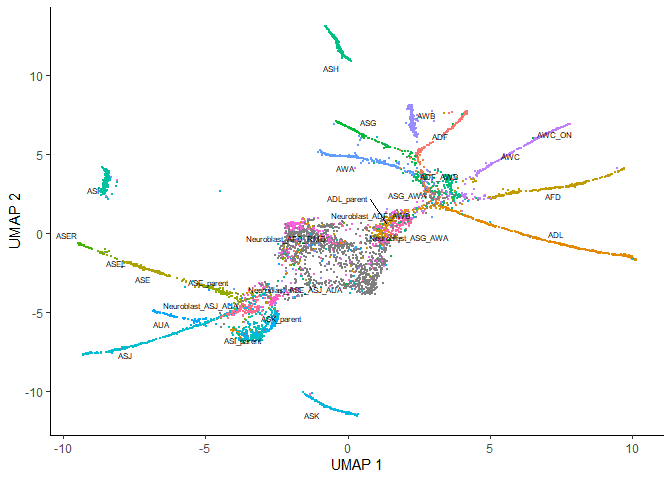
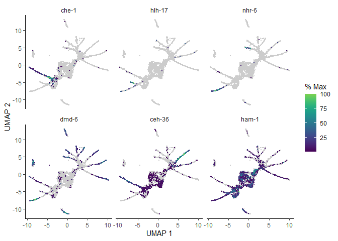
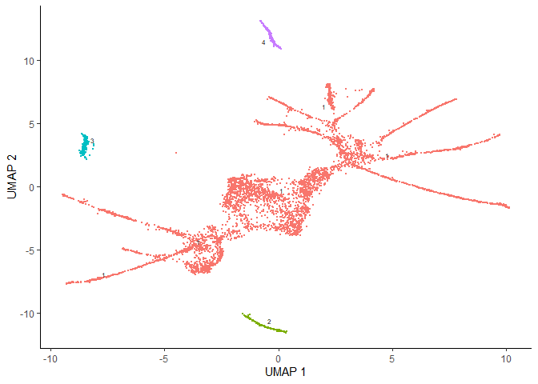
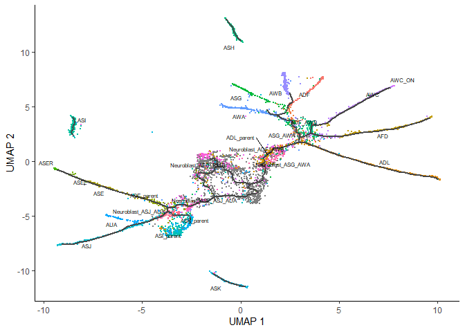
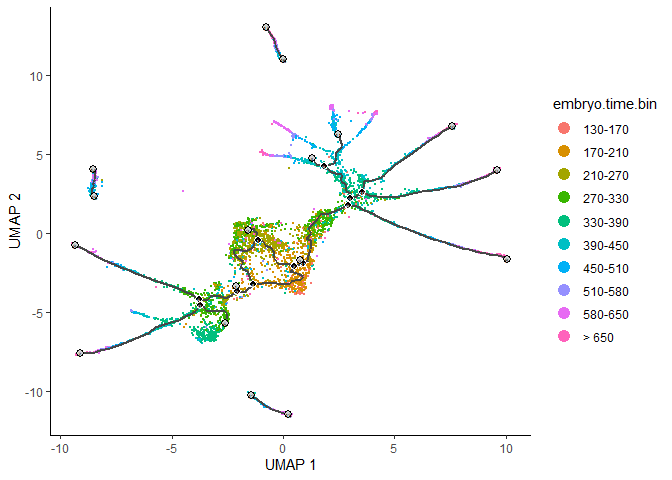

``` r
library(monocle3)
```

```
## Loading required package: Biobase
```

```
## Loading required package: BiocGenerics
```

```
## Loading required package: generics
```

```
## 
## Attaching package: 'generics'
```

```
## The following objects are masked from 'package:base':
## 
##     as.difftime, as.factor, as.ordered, intersect, is.element, setdiff,
##     setequal, union
```

```
## 
## Attaching package: 'BiocGenerics'
```

```
## The following objects are masked from 'package:stats':
## 
##     IQR, mad, sd, var, xtabs
```

```
## The following objects are masked from 'package:base':
## 
##     anyDuplicated, aperm, append, as.data.frame, basename, cbind,
##     colnames, dirname, do.call, duplicated, eval, evalq, Filter, Find,
##     get, grep, grepl, is.unsorted, lapply, Map, mapply, match, mget,
##     order, paste, pmax, pmax.int, pmin, pmin.int, Position, rank,
##     rbind, Reduce, rownames, sapply, saveRDS, table, tapply, unique,
##     unsplit, which.max, which.min
```

```
## Welcome to Bioconductor
## 
##     Vignettes contain introductory material; view with
##     'browseVignettes()'. To cite Bioconductor, see
##     'citation("Biobase")', and for packages 'citation("pkgname")'.
```

```
## Loading required package: SingleCellExperiment
```

```
## Loading required package: SummarizedExperiment
```

```
## Loading required package: MatrixGenerics
```

```
## Loading required package: matrixStats
```

```
## 
## Attaching package: 'matrixStats'
```

```
## The following objects are masked from 'package:Biobase':
## 
##     anyMissing, rowMedians
```

```
## 
## Attaching package: 'MatrixGenerics'
```

```
## The following objects are masked from 'package:matrixStats':
## 
##     colAlls, colAnyNAs, colAnys, colAvgsPerRowSet, colCollapse,
##     colCounts, colCummaxs, colCummins, colCumprods, colCumsums,
##     colDiffs, colIQRDiffs, colIQRs, colLogSumExps, colMadDiffs,
##     colMads, colMaxs, colMeans2, colMedians, colMins, colOrderStats,
##     colProds, colQuantiles, colRanges, colRanks, colSdDiffs, colSds,
##     colSums2, colTabulates, colVarDiffs, colVars, colWeightedMads,
##     colWeightedMeans, colWeightedMedians, colWeightedSds,
##     colWeightedVars, rowAlls, rowAnyNAs, rowAnys, rowAvgsPerColSet,
##     rowCollapse, rowCounts, rowCummaxs, rowCummins, rowCumprods,
##     rowCumsums, rowDiffs, rowIQRDiffs, rowIQRs, rowLogSumExps,
##     rowMadDiffs, rowMads, rowMaxs, rowMeans2, rowMedians, rowMins,
##     rowOrderStats, rowProds, rowQuantiles, rowRanges, rowRanks,
##     rowSdDiffs, rowSds, rowSums2, rowTabulates, rowVarDiffs, rowVars,
##     rowWeightedMads, rowWeightedMeans, rowWeightedMedians,
##     rowWeightedSds, rowWeightedVars
```

```
## The following object is masked from 'package:Biobase':
## 
##     rowMedians
```

```
## Loading required package: GenomicRanges
```

```
## Loading required package: stats4
```

```
## Loading required package: S4Vectors
```

```
## 
## Attaching package: 'S4Vectors'
```

```
## The following object is masked from 'package:utils':
## 
##     findMatches
```

```
## The following objects are masked from 'package:base':
## 
##     expand.grid, I, unname
```

```
## Loading required package: IRanges
```

```
## 
## Attaching package: 'IRanges'
```

```
## The following object is masked from 'package:grDevices':
## 
##     windows
```

```
## Loading required package: Seqinfo
```

```
## 
## Attaching package: 'monocle3'
```

```
## The following objects are masked from 'package:Biobase':
## 
##     exprs, fData, fData<-, pData, pData<-
```

``` r
# The tutorial shown below and on subsequent pages uses two additional packages:
library(ggplot2)
library(dplyr)
```

```
## 
## Attaching package: 'dplyr'
```

```
## The following objects are masked from 'package:GenomicRanges':
## 
##     intersect, setdiff, union
```

```
## The following object is masked from 'package:Seqinfo':
## 
##     intersect
```

```
## The following objects are masked from 'package:IRanges':
## 
##     collapse, desc, intersect, setdiff, slice, union
```

```
## The following objects are masked from 'package:S4Vectors':
## 
##     first, intersect, rename, setdiff, setequal, union
```

```
## The following object is masked from 'package:matrixStats':
## 
##     count
```

```
## The following object is masked from 'package:Biobase':
## 
##     combine
```

```
## The following objects are masked from 'package:BiocGenerics':
## 
##     combine, intersect, setdiff, setequal, union
```

```
## The following object is masked from 'package:generics':
## 
##     explain
```

```
## The following objects are masked from 'package:stats':
## 
##     filter, lag
```

```
## The following objects are masked from 'package:base':
## 
##     intersect, setdiff, setequal, union
```

``` r
set.seed(2025)
```


During development, in response to stimuli, and throughout life, cells transition from one functional "state" to another. Cells in different states express different sets of genes, producing a dynamic repetoire of proteins and metabolites that carry out their work. As cells move between states, they undergo a process of transcriptional re-configuration, with some genes being silenced and others newly activated. These transient states are often hard to characterize because purifying cells in between more stable endpoint states can be difficult or impossible. Single-cell RNA-Seq can enable you to see these states without the need for purification. However, to do so, we must determine where each cell is in the range of possible states.

Monocle introduced the strategy of using RNA-Seq for single-cell trajectory analysis. Rather than purifying cells into discrete states experimentally, Monocle uses an algorithm to learn the sequence of gene expression changes each cell must go through as part of a dynamic biological process. Once it has learned the overall "trajectory" of gene expression changes, Monocle can place each cell at its proper position in the trajectory. You can then use Monocle's differential analysis toolkit to find genes regulated over the course of the trajectory, as described in the section Finding genes that change as a function of pseudotime . If there are multiple outcomes for the process, Monocle will reconstruct a "branched" trajectory. These branches correspond to cellular "decisions", and Monocle provides powerful tools for identifying the genes affected by them and involved in making them. You can see how to analyze branches in the section Analyzing branches in single-cell trajectories .

The workflow for reconstructing trajectories is very similar to the workflow for clustering, but it has a few additional steps. To illustrate the workflow, we will use another C. elegans data set, this one from Packer & Zhu et al. Their study includes a time series analysis of whole developing embyros. We will examine a small subset of the data which includes most of the neurons. We will load it as we did with the L2 data:


``` r
expression_matrix <- readRDS(url("https://depts.washington.edu:/trapnell-lab/software/monocle3/celegans/data/packer_embryo_expression.rds"))
cell_metadata <- readRDS(url("https://depts.washington.edu:/trapnell-lab/software/monocle3/celegans/data/packer_embryo_colData.rds"))
gene_annotation <- readRDS(url("https://depts.washington.edu:/trapnell-lab/software/monocle3/celegans/data/packer_embryo_rowData.rds"))

cds <- new_cell_data_set(expression_matrix,
                         cell_metadata = cell_metadata,
                         gene_metadata = gene_annotation)
```

# Pre-process the data

Pre-processing works exactly as in clustering analysis. This time, we will use a different strategy for batch correction, which includes what Packer & Zhu et al did in their original analysis:

Note: Your data will not have the loading batch information demonstrated here, you will correct batch using your own batch information.


``` r
cds <- preprocess_cds(cds, num_dim = 50)
cds <- align_cds(cds, alignment_group = "batch", residual_model_formula_str = "~ bg.300.loading + bg.400.loading + bg.500.1.loading + bg.500.2.loading + bg.r17.loading + bg.b01.loading + bg.b02.loading")
```

```
## Aligning cells from different batches using Batchelor.
## Please remember to cite:
## 	 Haghverdi L, Lun ATL, Morgan MD, Marioni JC (2018). 'Batch effects in single-cell RNA-sequencing data are corrected by matching mutual nearest neighbors.' Nat. Biotechnol., 36(5), 421-427. doi: 10.1038/nbt.4091
```

Note that in addition to using the alignment_group argument to align_cds(), which aligns groups of cells (i.e. batches), we are also using residual_model_formula_str. This argument is for subtracting continuous effects. You can use this to control for things like the fraction of mitochondrial reads in each cell, which is sometimes used as a QC metric for each cell. In this experiment (as in many scRNA-seq experiments), some cells spontanously lyse, releasing their mRNAs into the cell suspension immediately prior to loading into the single-cell library prep. This "supernatant RNA" contaminates each cells' transcriptome profile to a certain extent. Fortunately, it is fairly straightforward to estimate the level of background contamination in each batch of cells and subtract it, which is what Packer et al did in the original study. Each of the columns bg.300.loading, bg.400.loading, corresponds to a background signal that a cell might be contaminated with. Passing these colums as terms in the residual_model_formula_str tells align_cds() to subtract these signals prior to dimensionality reduction, clustering, and trajectory inference. Note that you can call align_cds() with alignment_group, residual_model_formula, or both.

# Reduce dimensionality and visualize the results

Next, we reduce the dimensionality of the data. However, unlike clustering, which works well with both UMAP and t-SNE, here we strongly urge you to use UMAP, the default method:


``` r
cds <- reduce_dimension(cds)
```

```
## No preprocess_method specified, and aligned coordinates have been computed previously. Using preprocess_method = 'Aligned'
```

``` r
plot_cells(cds, label_groups_by_cluster=FALSE,  color_cells_by = "cell.type")
```

```
## No trajectory to plot. Has learn_graph() been called yet?
```

```
## Warning: `aes_string()` was deprecated in ggplot2 3.0.0.
## ℹ Please use tidy evaluation idioms with `aes()`.
## ℹ See also `vignette("ggplot2-in-packages")` for more information.
## ℹ The deprecated feature was likely used in the monocle3 package.
##   Please report the issue to the authors.
## This warning is displayed once every 8 hours.
## Call `lifecycle::last_lifecycle_warnings()` to see where this warning was
## generated.
```

```
## Warning: The `size` argument of `element_line()` is deprecated as of ggplot2 3.4.0.
## ℹ Please use the `linewidth` argument instead.
## ℹ The deprecated feature was likely used in the monocle3 package.
##   Please report the issue to the authors.
## This warning is displayed once every 8 hours.
## Call `lifecycle::last_lifecycle_warnings()` to see where this warning was
## generated.
```

```
## Warning: Removed 1 row containing missing values or values outside the scale range
## (`geom_text_repel()`).
```

<!-- -->

As you can see, despite the fact that we are only looking at a small slice of this dataset, Monocle reconstructs a trajectory with numerous branches. Overlaying the manual annotations on the UMAP reveals that these branches are principally occupied by one cell type.

As with clustering analysis, you can use plot_cells() to visualize how individual genes vary along the trajectory. Let's look at some genes with interesting patterns of expression in ciliated neurons:


``` r
ciliated_genes <- c("che-1",
                    "hlh-17",
                    "nhr-6",
                    "dmd-6",
                    "ceh-36",
                    "ham-1")

plot_cells(cds,
           genes=ciliated_genes,
           label_cell_groups=FALSE,
           show_trajectory_graph=FALSE)
```

<!-- -->

# Cluster your cells

Although cells may continuously transition from one state to the next with no discrete boundary between them, Monocle does not assume that all cells in the dataset descend from a common transcriptional "ancestor". In many experiments, there might in fact be multiple distinct trajectories. For example, in a tissue responding to an infection, tissue resident immune cells and stromal cells will have very different initial transcriptomes, and will respond to infection quite differently, so they should be a part of the same trajectory.

Monocle is able to learn when cells should be placed in the same trajectory as opposed to separate trajectories through its clustering procedure. Recall that we run cluster_cells(), each cell is assigned not only to a cluster but also to a partition. When you are learning trajectories, each partition will eventually become a separate trajectory. We run cluster_cells()as before.


``` r
cds <- cluster_cells(cds)
plot_cells(cds, color_cells_by = "partition")
```

```
## No trajectory to plot. Has learn_graph() been called yet?
```

<!-- -->

# Learn the trajectory graph


``` r
cds <- learn_graph(cds)
```

```
## 
  |                                                                            
  |                                                                      |   0%
  |                                                                            
  |======================================================================| 100%
## 
  |                                                                            
  |                                                                      |   0%
  |                                                                            
  |======================================================================| 100%
```

``` r
plot_cells(cds,
           color_cells_by = "cell.type",
           label_groups_by_cluster=FALSE,
           label_leaves=FALSE,
           label_branch_points=FALSE)
```

```
## Warning: Using `size` aesthetic for lines was deprecated in ggplot2 3.4.0.
## ℹ Please use `linewidth` instead.
## ℹ The deprecated feature was likely used in the monocle3 package.
##   Please report the issue to the authors.
## This warning is displayed once every 8 hours.
## Call `lifecycle::last_lifecycle_warnings()` to see where this warning was
## generated.
```

```
## Warning: Removed 1 row containing missing values or values outside the scale range
## (`geom_text_repel()`).
```

<!-- -->

# Order the cells in pseudotime

Once we've learned a graph, we are ready to order the cells according to their progress through the developmental program. Monocle measures this progress in pseudotime. The box below defines pseudotime.

> What is pseudotime?
Pseudotime is a measure of how much progress an individual cell has made through a process such as cell differentiation.
In many biological processes, cells do not progress in perfect synchrony. In single-cell expression studies of processes such as cell differentiation, captured cells might be widely distributed in terms of progress. That is, in a population of cells captured at exactly the same time, some cells might be far along, while others might not yet even have begun the process. This asynchrony creates major problems when you want to understand the sequence of regulatory changes that occur as cells transition from one state to the next. Tracking the expression across cells captured at the same time produces a very compressed sense of a gene's kinetics, and the apparent variability of that gene's expression will be very high.
By ordering each cell according to its progress along a learned trajectory, Monocle alleviates the problems that arise due to asynchrony. Instead of tracking changes in expression as a function of time, Monocle tracks changes as a function of progress along the trajectory, which we term "pseudotime". Pseudotime is an abstract unit of progress: it's simply the distance between a cell and the start of the trajectory, measured along the shortest path. The trajectory's total length is defined in terms of the total amount of transcriptional change that a cell undergoes as it moves from the starting state to the end state.

In order to place the cells in order, we need to tell Monocle where the "beginning" of the biological process is. We do so by choosing regions of the graph that we mark as "roots" of the trajectory. In time series experiments, this can usually be accomplished by finding spots in the UMAP space that are occupied by cells from early time points:


``` r
plot_cells(cds,
           color_cells_by = "embryo.time.bin",
           label_cell_groups=FALSE,
           label_leaves=TRUE,
           label_branch_points=TRUE,
           graph_label_size=1.5)
```

<!-- -->

The black lines show the structure of the graph. Note that the graph is not fully connected: cells in different partitions are in distinct components of the graph. The circles with numbers in them denote special points within the graph. Each leaf, denoted by light gray circles, corresponds to a different outcome (i.e. cell fate) of the trajectory. Black circles indicate branch nodes, in which cells can travel to one of several outcomes. You can control whether or not these are shown in the plot with the label_leaves and label_branch_points arguments to plot_cells. Please note that numbers within the circles are provided for reference purposes only.

Now that we have a sense of where the early cells fall, we can call order_cells(), which will calculate where each cell falls in pseudotime. In order to do so order_cells()needs you to specify the root nodes of the trajectory graph. If you don't provide them as an argument, it will launch a graphical user interface for selecting one or more root nodes.
