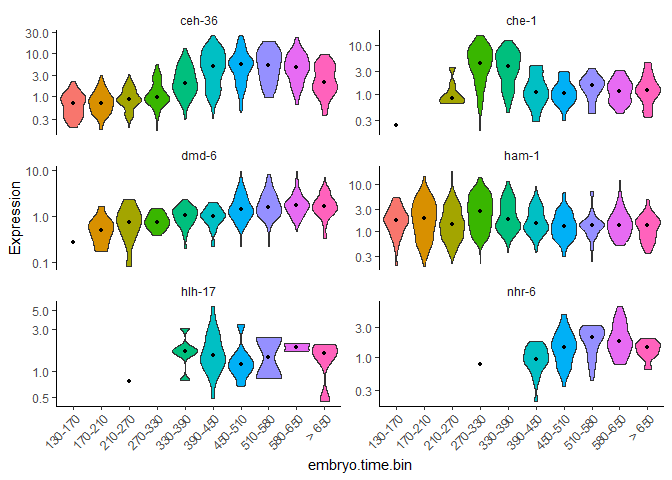
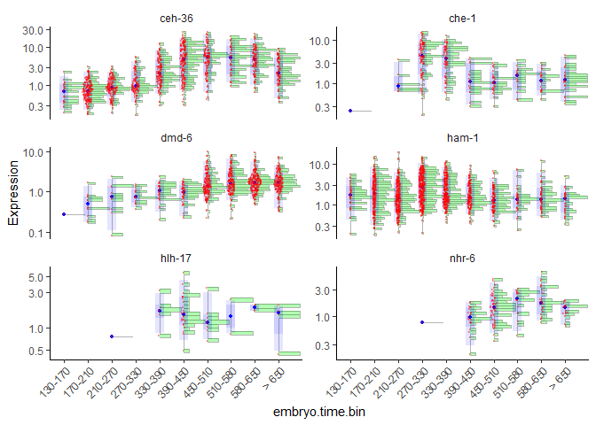

``` r
library(monocle3)
```

```
## Loading required package: Biobase
```

```
## Loading required package: BiocGenerics
```

```
## Loading required package: generics
```

```
## 
## Attaching package: 'generics'
```

```
## The following objects are masked from 'package:base':
## 
##     as.difftime, as.factor, as.ordered, intersect, is.element, setdiff,
##     setequal, union
```

```
## 
## Attaching package: 'BiocGenerics'
```

```
## The following objects are masked from 'package:stats':
## 
##     IQR, mad, sd, var, xtabs
```

```
## The following objects are masked from 'package:base':
## 
##     anyDuplicated, aperm, append, as.data.frame, basename, cbind,
##     colnames, dirname, do.call, duplicated, eval, evalq, Filter, Find,
##     get, grep, grepl, is.unsorted, lapply, Map, mapply, match, mget,
##     order, paste, pmax, pmax.int, pmin, pmin.int, Position, rank,
##     rbind, Reduce, rownames, sapply, saveRDS, table, tapply, unique,
##     unsplit, which.max, which.min
```

```
## Welcome to Bioconductor
## 
##     Vignettes contain introductory material; view with
##     'browseVignettes()'. To cite Bioconductor, see
##     'citation("Biobase")', and for packages 'citation("pkgname")'.
```

```
## Loading required package: SingleCellExperiment
```

```
## Loading required package: SummarizedExperiment
```

```
## Loading required package: MatrixGenerics
```

```
## Loading required package: matrixStats
```

```
## 
## Attaching package: 'matrixStats'
```

```
## The following objects are masked from 'package:Biobase':
## 
##     anyMissing, rowMedians
```

```
## 
## Attaching package: 'MatrixGenerics'
```

```
## The following objects are masked from 'package:matrixStats':
## 
##     colAlls, colAnyNAs, colAnys, colAvgsPerRowSet, colCollapse,
##     colCounts, colCummaxs, colCummins, colCumprods, colCumsums,
##     colDiffs, colIQRDiffs, colIQRs, colLogSumExps, colMadDiffs,
##     colMads, colMaxs, colMeans2, colMedians, colMins, colOrderStats,
##     colProds, colQuantiles, colRanges, colRanks, colSdDiffs, colSds,
##     colSums2, colTabulates, colVarDiffs, colVars, colWeightedMads,
##     colWeightedMeans, colWeightedMedians, colWeightedSds,
##     colWeightedVars, rowAlls, rowAnyNAs, rowAnys, rowAvgsPerColSet,
##     rowCollapse, rowCounts, rowCummaxs, rowCummins, rowCumprods,
##     rowCumsums, rowDiffs, rowIQRDiffs, rowIQRs, rowLogSumExps,
##     rowMadDiffs, rowMads, rowMaxs, rowMeans2, rowMedians, rowMins,
##     rowOrderStats, rowProds, rowQuantiles, rowRanges, rowRanks,
##     rowSdDiffs, rowSds, rowSums2, rowTabulates, rowVarDiffs, rowVars,
##     rowWeightedMads, rowWeightedMeans, rowWeightedMedians,
##     rowWeightedSds, rowWeightedVars
```

```
## The following object is masked from 'package:Biobase':
## 
##     rowMedians
```

```
## Loading required package: GenomicRanges
```

```
## Loading required package: stats4
```

```
## Loading required package: S4Vectors
```

```
## 
## Attaching package: 'S4Vectors'
```

```
## The following object is masked from 'package:utils':
## 
##     findMatches
```

```
## The following objects are masked from 'package:base':
## 
##     expand.grid, I, unname
```

```
## Loading required package: IRanges
```

```
## 
## Attaching package: 'IRanges'
```

```
## The following object is masked from 'package:grDevices':
## 
##     windows
```

```
## Loading required package: Seqinfo
```

```
## 
## Attaching package: 'monocle3'
```

```
## The following objects are masked from 'package:Biobase':
## 
##     exprs, fData, fData<-, pData, pData<-
```

``` r
# The tutorial shown below and on subsequent pages uses two additional packages:
library(ggplot2)
library(dplyr)
```

```
## 
## Attaching package: 'dplyr'
```

```
## The following objects are masked from 'package:GenomicRanges':
## 
##     intersect, setdiff, union
```

```
## The following object is masked from 'package:Seqinfo':
## 
##     intersect
```

```
## The following objects are masked from 'package:IRanges':
## 
##     collapse, desc, intersect, setdiff, slice, union
```

```
## The following objects are masked from 'package:S4Vectors':
## 
##     first, intersect, rename, setdiff, setequal, union
```

```
## The following object is masked from 'package:matrixStats':
## 
##     count
```

```
## The following object is masked from 'package:Biobase':
## 
##     combine
```

```
## The following objects are masked from 'package:BiocGenerics':
## 
##     combine, intersect, setdiff, setequal, union
```

```
## The following object is masked from 'package:generics':
## 
##     explain
```

```
## The following objects are masked from 'package:stats':
## 
##     filter, lag
```

```
## The following objects are masked from 'package:base':
## 
##     intersect, setdiff, setequal, union
```

``` r
set.seed(2025)
```


``` r
expression_matrix <- readRDS(url("https://depts.washington.edu:/trapnell-lab/software/monocle3/celegans/data/packer_embryo_expression.rds"))
cell_metadata <- readRDS(url("https://depts.washington.edu:/trapnell-lab/software/monocle3/celegans/data/packer_embryo_colData.rds"))
gene_annotation <- readRDS(url("https://depts.washington.edu:/trapnell-lab/software/monocle3/celegans/data/packer_embryo_rowData.rds"))

cds <- new_cell_data_set(expression_matrix,
                         cell_metadata = cell_metadata,
                         gene_metadata = gene_annotation)
```

Differential gene expression analysis is a common task in RNA-Seq experiments. Monocle can help you find genes that are differentially expressed between groups of cells and assesses the statistical signficance of those changes. Monocle 3 includes a powerful system for finding genes that vary across cells of different types, were collected at different developmental time points, or that have been perturbed in different ways.

There are two approaches for differential analysis in Monocle:

Regression analysis: using fit_models(), you can evaluate whether each gene depends on variables such as time, treatments, etc.
Graph-autocorrelation analysis: using graph_test(), you can find genes that vary over a trajectory or between clusters.
Monocle also comes with specialized functions for finding co-regulated modules of differentially expressed genes. Monocle also allows you to interactively interrogate specific clusters or regions of a trajectory (e.g. branch points) for genes that vary within them.

Let's examine these tools in turn.

# Regression analysis

In this section, we'll explore how to use Monocle to find genes that are differentially expressed according to several different criteria. Performing differential expression analysis on all genes in a cell_data_set object can take anywhere from minutes to hours, depending on how complex the analysis is. To keep the vignette simple and fast, we'll be working with small sets of genes. Rest assured, however, that Monocle can analyze several thousands of genes even in large experiments, making it useful for discovering dynamically regulated genes during the biological process you're studying.

Let's begin with a small set of genes that we know are important in ciliated neurons to demonstrate Monocle's capabilities:


``` r
ciliated_genes <- c("che-1",
                    "hlh-17",
                    "nhr-6",
                    "dmd-6",
                    "ceh-36",
                    "ham-1")
cds_subset <- cds[rowData(cds)$gene_short_name %in% ciliated_genes,]
```

The differential analysis tools in Monocle are extremely flexible. Monocle works by fitting a regression model to each gene. You can specify this model to account for various factors in your experiment (time, treatment, and so on). For example, In the embryo data, the cells were collected at different time points. We can test whether any of the genes above change over time in their expression by first fitting a generalized linear model to each one:

To do so, we first call the fit_models() function:


``` r
gene_fits <- fit_models(cds_subset, model_formula_str = "~embryo.time")
summary(gene_fits)
```

```
##       id            gene_short_name    num_cells_expressed   gene_id         
##  Length:6           Length:6           Min.   :  51.0      Length:6          
##  Class :character   Class :character   1st Qu.: 172.8      Class :character  
##  Mode  :character   Mode  :character   Median : 582.5      Mode  :character  
##                                        Mean   : 681.7                        
##                                        3rd Qu.:1060.5                        
##                                        Max.   :1618.0                        
##  model.Length  model.Class  model.Mode
##  26        speedglm  list             
##  26        speedglm  list             
##  26        speedglm  list             
##  26        speedglm  list             
##  26        speedglm  list             
##  26        speedglm  list             
##  model_summary.Length  model_summary.Class  model_summary.Mode
##  21                summary.speedglm  list                     
##  21                summary.speedglm  list                     
##  21                summary.speedglm  list                     
##  21                summary.speedglm  list                     
##  21                summary.speedglm  list                     
##  21                summary.speedglm  list                     
##     status         
##  Length:6          
##  Class :character  
##  Mode  :character  
##                    
##                    
## 
```

gene_fits is a tibble that contains a row for each gene. The model column contains generalized linear model objects, each of which aims to explain the expression of a gene across the cells using the equation above. The parameter model_formula_str should be a string specifying the model formula. The model formulae you use in your tests can include any term that exists as a column in the colData table, including those columns that are added by Monocle in other analysis steps. For example, if you use cluster_cells, you can test for genes that differ between clusters and partitions by using ~cluster or ~partition (respectively) as your model formula. You can also include multiple variables, for example ~embryo.time + batch, which can be very helpful for subtracting unwanted effects.

Now let's see which of these genes have time-dependent expression. First, we extract a table of coefficients from each model using the coefficient_table() function:


``` r
fit_coefs <- coefficient_table(gene_fits)
fit_coefs
```

```
## # A tibble: 12 × 15
##    id       gene_short_name num_cells_expressed gene_id model      model_summary
##    <chr>    <chr>                         <int> <chr>   <named li> <named list> 
##  1 WBGene0… ham-1                          1618 WBGene… <speedglm> <smmry.sp>   
##  2 WBGene0… ham-1                          1618 WBGene… <speedglm> <smmry.sp>   
##  3 WBGene0… dmd-6                           873 WBGene… <speedglm> <smmry.sp>   
##  4 WBGene0… dmd-6                           873 WBGene… <speedglm> <smmry.sp>   
##  5 WBGene0… hlh-17                           51 WBGene… <speedglm> <smmry.sp>   
##  6 WBGene0… hlh-17                           51 WBGene… <speedglm> <smmry.sp>   
##  7 WBGene0… nhr-6                           133 WBGene… <speedglm> <smmry.sp>   
##  8 WBGene0… nhr-6                           133 WBGene… <speedglm> <smmry.sp>   
##  9 WBGene0… ceh-36                         1123 WBGene… <speedglm> <smmry.sp>   
## 10 WBGene0… ceh-36                         1123 WBGene… <speedglm> <smmry.sp>   
## 11 WBGene0… che-1                           292 WBGene… <speedglm> <smmry.sp>   
## 12 WBGene0… che-1                           292 WBGene… <speedglm> <smmry.sp>   
## # ℹ 9 more variables: status <chr>, term <chr>, estimate <dbl>, std_err <dbl>,
## #   test_val <dbl>, p_value <dbl>, normalized_effect <dbl>,
## #   model_component <chr>, q_value <dbl>
```

Note that the table includes one row for each term of each gene's model. We generally don't care about the intercept term, so we can easily just extract the time terms:


``` r
emb_time_terms <- fit_coefs %>% filter(term == "embryo.time")
emb_time_terms
```

```
## # A tibble: 6 × 15
##   id        gene_short_name num_cells_expressed gene_id model      model_summary
##   <chr>     <chr>                         <int> <chr>   <named li> <named list> 
## 1 WBGene00… ham-1                          1618 WBGene… <speedglm> <smmry.sp>   
## 2 WBGene00… dmd-6                           873 WBGene… <speedglm> <smmry.sp>   
## 3 WBGene00… hlh-17                           51 WBGene… <speedglm> <smmry.sp>   
## 4 WBGene00… nhr-6                           133 WBGene… <speedglm> <smmry.sp>   
## 5 WBGene00… ceh-36                         1123 WBGene… <speedglm> <smmry.sp>   
## 6 WBGene00… che-1                           292 WBGene… <speedglm> <smmry.sp>   
## # ℹ 9 more variables: status <chr>, term <chr>, estimate <dbl>, std_err <dbl>,
## #   test_val <dbl>, p_value <dbl>, normalized_effect <dbl>,
## #   model_component <chr>, q_value <dbl>
```

Now, let's pull out the genes that have a significant time component. coefficient_table() tests whether each coefficient differs significantly from zero under the Wald test. By default, coefficient_table() adjusts these p-values for multiple hypothesis testing using the method of Benjamini and Hochberg. These adjusted values can be found in the q_value column. We can filter the results and control the false discovery rate as follows:


``` r
emb_time_terms %>% filter (q_value < 0.05) %>%
         select(gene_short_name, term, q_value, estimate)
```

```
## # A tibble: 5 × 4
##   gene_short_name term          q_value estimate
##   <chr>           <chr>           <dbl>    <dbl>
## 1 ham-1           embryo.time 4.59e- 73 -0.00388
## 2 dmd-6           embryo.time 2.03e-255  0.00750
## 3 hlh-17          embryo.time 2.47e-  3  0.00334
## 4 nhr-6           embryo.time 8.41e- 28  0.00579
## 5 ceh-36          embryo.time 1.45e- 34  0.00279
```

We can see that five of the six genes significantly vary as a function of time.

Monocle also provides some easy ways to plot the expression of a small set of genes grouped by the factors you use during differential analysis. This helps you visualize the differences revealed by the tests above. One type of plot is a "violin" plot.


``` r
plot_genes_violin(cds_subset, group_cells_by="embryo.time.bin", ncol=2) +
      theme(axis.text.x=element_text(angle=45, hjust=1))
```

```
## Warning: `aes_string()` was deprecated in ggplot2 3.0.0.
## ℹ Please use tidy evaluation idioms with `aes()`.
## ℹ See also `vignette("ggplot2-in-packages")` for more information.
## ℹ The deprecated feature was likely used in the monocle3 package.
##   Please report the issue to the authors.
## This warning is displayed once every 8 hours.
## Call `lifecycle::last_lifecycle_warnings()` to see where this warning was
## generated.
```

```
## Warning: The `size` argument of `element_line()` is deprecated as of ggplot2 3.4.0.
## ℹ Please use the `linewidth` argument instead.
## ℹ The deprecated feature was likely used in the monocle3 package.
##   Please report the issue to the authors.
## This warning is displayed once every 8 hours.
## Call `lifecycle::last_lifecycle_warnings()` to see where this warning was
## generated.
```

```
## Warning in scale_y_log10(): log-10 transformation introduced infinite values.
## log-10 transformation introduced infinite values.
## log-10 transformation introduced infinite values.
```

```
## Warning: Removed 33038 rows containing non-finite outside the scale range
## (`stat_ydensity()`).
```

```
## Warning: Groups with fewer than two datapoints have been dropped.
## ℹ Set `drop = FALSE` to consider such groups for position adjustment purposes.
## Groups with fewer than two datapoints have been dropped.
## ℹ Set `drop = FALSE` to consider such groups for position adjustment purposes.
## Groups with fewer than two datapoints have been dropped.
## ℹ Set `drop = FALSE` to consider such groups for position adjustment purposes.
## Groups with fewer than two datapoints have been dropped.
## ℹ Set `drop = FALSE` to consider such groups for position adjustment purposes.
```

```
## Warning: Removed 33038 rows containing non-finite outside the scale range
## (`stat_summary()`).
```

<!-- -->

By default, the violin plot log-scales the expression, which drops cells with zero expression, resulting in potentially misleading figures. The Monocle3 develop branch has a hybrid plot where cells appear as red dots in a Sina plot and the cell distribution appears as a histogram with green bars and a blue median_qi interval.


``` r
plot_genes_hybrid(cds_subset, group_cells_by="embryo.time.bin", ncol=2) +
      theme(axis.text.x=element_text(angle=45, hjust=1))
```

```
## Warning in scale_y_log10(): log-10 transformation introduced infinite values.
```

<!-- -->

# Controlling for batch effects and other factors


``` r
gene_fits <- fit_models(cds_subset, model_formula_str = "~embryo.time + batch")
fit_coefs <- coefficient_table(gene_fits)
fit_coefs %>% filter(term != "(Intercept)") %>%
      select(gene_short_name, term, q_value, estimate)
```

```
## # A tibble: 42 × 4
##    gene_short_name term                                 q_value estimate
##    <chr>           <chr>                                  <dbl>    <dbl>
##  1 ham-1           embryo.time                        3.65e- 27 -0.00276
##  2 ham-1           batchWaterston_400_minutes         2.28e-  3  0.212  
##  3 ham-1           batchWaterston_500_minutes_batch_1 5.35e-  3 -0.357  
##  4 ham-1           batchWaterston_500_minutes_batch_2 4.24e-  9 -1.40   
##  5 ham-1           batchMurray_r17                    7.02e-  1  0.0932 
##  6 ham-1           batchMurray_b01                    2.34e-  1 -0.187  
##  7 ham-1           batchMurray_b02                    1.68e-  1 -0.451  
##  8 dmd-6           embryo.time                        2.61e-150  0.00713
##  9 dmd-6           batchWaterston_400_minutes         1.08e-  6  2.18   
## 10 dmd-6           batchWaterston_500_minutes_batch_1 3.28e- 12  3.00   
## # ℹ 32 more rows
```

# Evaluating models of gene expression

How good are these models at "explaining" gene expression? We can evaluate the fits of each model using the evaluate_fits() function:


``` r
evaluate_fits(gene_fits)
```

```
## # A tibble: 6 × 12
##   id    gene_short_name num_cells_expressed gene_id status null_deviance df_null
##   <chr> <chr>                         <int> <chr>   <chr>          <dbl>   <int>
## 1 WBGe… ham-1                          1618 WBGene… OK            21030.    6187
## 2 WBGe… dmd-6                           873 WBGene… OK             6369.    6187
## 3 WBGe… hlh-17                           51 WBGene… OK              642.    6187
## 4 WBGe… nhr-6                           133 WBGene… OK             1660.    6187
## 5 WBGe… ceh-36                         1123 WBGene… OK            17972.    6187
## 6 WBGe… che-1                           292 WBGene… OK             8850.    6187
## # ℹ 5 more variables: logLik <lgl>, AIC <dbl>, BIC <dbl>, deviance <dbl>,
## #   df_residual <int>
```

Should we include the batch term in our model of gene expression or not? Monocle provides a function compare_models() that can help you decide. Compare models takes two models and returns the result of a likelihood ratio test between them. Any time you add terms to a model, it will improve the fit. But we should always to use the simplest model we can to explain our data. The likelihood ratio test helps us decide whether the improvement in fit is large enough to justify the complexity our extra terms introduce. You run compare_models() like this:


``` r
time_batch_models <- fit_models(cds_subset,
                                model_formula_str = "~embryo.time + batch",
                                expression_family="negbinomial")
time_models <- fit_models(cds_subset,
                          model_formula_str = "~embryo.time",
                          expression_family="negbinomial")
compare_models(time_batch_models, time_models) %>% select(gene_short_name, q_value)
```

```
## # A tibble: 6 × 2
##   gene_short_name  q_value
##   <chr>              <dbl>
## 1 ham-1           4.46e-18
## 2 dmd-6           8.46e-50
## 3 hlh-17          2.48e- 6
## 4 nhr-6           7.09e- 5
## 5 ceh-36          3.84e-11
## 6 che-1           2.97e- 6
```

The first of the two models is called the full model. This model is essentially a way of predicting the expression value of each gene in a given cell knowing both what time it was collected and which batch of cells it came from. The second model, called the reduced model, does the same thing, but it only knows about the time each cell was collected. Because the full model has more information about each cell, it will do a better job of predicting the expression of the gene in each cell. The question Monocle must answer for each gene is how much better the full model's prediction is than the reduced model's. The greater the improvement that comes from knowing the batch of each cell, the more significant the result of the likelihood ratio test.

As we can see, all of the genes' likelihood ratio tests are significant, indicating that there are substantial batch effects in the data. We are therefore justified in adding the batch term to our model.

# Choosing a distribution for modeling gene expression


